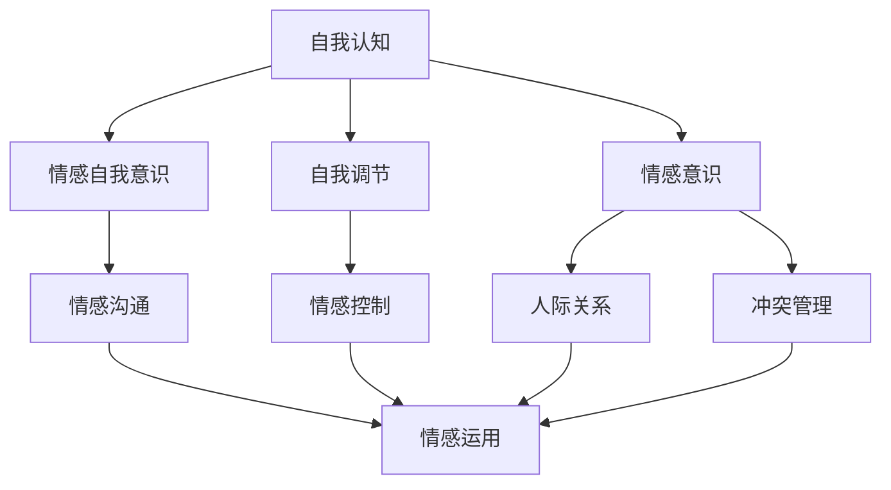

                 

# 情商领导力：提升团队凝聚力的关键因素

## 关键词
- 情商领导力
- 团队凝聚力
- 领导风格
- 情感管理
- 组织行为学
- 人际关系

## 摘要
本文将探讨情商领导力在提升团队凝聚力方面的关键作用。我们将从定义情商、领导力和团队凝聚力开始，逐步分析情商领导力如何影响团队协作和凝聚力，并通过实际案例和最佳实践来阐明提升团队凝聚力的策略和方法。最后，我们将总结全文，并指出未来研究和实践的方向。

### 目录大纲设计步骤

#### 第一步：确定书的核心内容和结构
- 主要内容：情商领导力在团队凝聚力提升中的应用。
- 关键因素：情商、团队管理、领导风格。

#### 第二步：设计书的第一部分：背景介绍
- 情商和领导力的基本概念。
- 提升团队凝聚力的必要性。
- 情商领导力的相关理论和研究。

#### 第三步：设计书的核心章节
- 情商的概念与属性特征。
- 领导力的定义和类型。
- 团队凝聚力的构成与影响因素。

#### 第四步：设计算法原理讲解
- 如何通过情商领导力提升团队凝聚力。
- 算法流程图和Python代码实现。

#### 第五步：设计系统分析与架构设计方案
- 提升团队凝聚力的问题场景。
- 实际项目的系统功能设计、架构设计和接口设计。

#### 第六步：设计项目实战
- 环境安装和系统核心实现。
- 代码应用解读与分析。
- 实际案例分析和详细讲解。

#### 第七步：设计最佳实践和总结
- 提供提升团队凝聚力的最佳实践。
- 对全书内容进行总结，并指出未来研究方向。

### 实际操作

#### 第一部分：背景介绍

## 第一部分：情商领导力与团队凝聚力

### 第1章：情商与领导力的基础
#### 1.1.1 情商的定义与重要性
情商（Emotional Intelligence，EQ）是一个人识别、理解、管理和调节自己及他人情绪的能力。情商的重要性在于它能够帮助个体更好地处理情感，提高人际交往能力，从而更有效地进行团队合作。

#### 1.1.2 领导力的核心概念
领导力是指个人或集体在组织中引导和激励他人达成共同目标的能力。有效的领导力能够促进团队的协作和凝聚力。

#### 1.1.3 提升团队凝聚力的必要性
团队凝聚力是团队协作的基础，它关系到团队的工作效率、创造力和员工满意度。提升团队凝聚力有助于减少内部冲突，提高团队整体绩效。

### 第2章：情商领导力的研究背景与现状
#### 2.1.1 情商领导力的起源与发展
情商领导力的概念源于Daniel Goleman在1995年出版的《情商》一书。近年来，随着组织行为学和企业管理的不断发展，情商领导力成为研究的热点。

#### 2.1.2 现代企业对情商领导力的需求
在竞争激烈的市场环境中，企业需要具备高度适应能力和创新能力的团队。情商领导力能够帮助企业培养这样的团队。

#### 2.1.3 情商领导力研究的意义
情商领导力研究有助于揭示领导力的本质，为企业管理者提供实用的指导，提高企业的绩效和竞争力。

### 第3章：核心概念与联系
#### 第2章：情商的概念与属性特征
情商由四个主要方面组成：自我认知、自我管理、社交技能和情感运用。

#### 第3章：领导力的定义与类型
领导力可以分为交易型领导和变革型领导。交易型领导注重任务完成，而变革型领导更注重激发团队成员的潜力。

#### 第4章：团队凝聚力的构成与影响因素
团队凝聚力由共同目标、信任、合作和归属感等因素构成。影响团队凝聚力的因素包括组织文化、领导风格和团队互动等。

### 第二部分：核心概念与联系

## 第二部分：情商、领导力与团队凝聚力的核心概念

### 第2章：情商的概念与属性特征
情商由四个主要方面组成：自我认知、自我管理、社交技能和情感运用。以下是对这四个方面的详细解释：

#### 2.1 自我认知
自我认知是指个体对自己情感的认识和理解。它包括情感自我意识、自我调节和情感意识。

#### 2.2 自我管理
自我管理是指个体在情感上的自我控制和调节能力。它包括情绪调节、情感控制和压力管理。

#### 2.3 社交技能
社交技能是指个体在人际交往中的情感处理能力。它包括情感沟通、人际关系和冲突管理。

#### 2.4 情感运用
情感运用是指个体如何将情感知识应用于生活中的各种情境。它包括情感理解和情感策略。

### 第3章：领导力的定义与类型
领导力是指个人或集体在组织中引导和激励他人达成共同目标的能力。根据Goleman的理论，领导力可以分为交易型领导和变革型领导：

#### 3.1 交易型领导
交易型领导注重任务的完成和组织结构的维护。它依赖于明确的角色分配和激励机制，以及规则和惩罚。

#### 3.2 变革型领导
变革型领导注重激发团队成员的潜力，鼓励创新和团队合作。它依赖于领导者的愿景、魅力和激励能力。

### 第4章：团队凝聚力的构成与影响因素
团队凝聚力是指团队成员之间的紧密联系和协作程度。它由以下几个构成要素组成：

#### 4.1 共同目标
共同目标是团队凝聚力的基础。团队成员需要明确共同的目标和愿景。

#### 4.2 信任
信任是团队凝聚力的关键。团队成员需要相互信任，才能有效协作。

#### 4.3 合作
合作是团队凝聚力的体现。团队成员需要相互支持和配合，共同完成任务。

#### 4.4 归属感
归属感是团队成员对团队的认同感和归属感。它有助于增强团队的凝聚力。

影响团队凝聚力的因素包括组织文化、领导风格和团队互动等。以下是一个关于团队凝聚力的ER实体关系图：

```mermaid
erDiagram
    Class::TeamMember {
        String::ID
        String::Name
        String::Role
        String::Department
    }
    Class::Team {
        String::ID
        String::Name
        TeamMember::Members
    }
    TeamMember ||--|{ Team : belongs_to }
    Team ||--|{ TeamMember : has_members }
```

### 第5章：情商、领导力与团队凝聚力的关系
情商、领导力和团队凝聚力之间存在密切的关系。情商高的人通常具有更好的领导力，能够有效地提升团队的凝聚力。

#### 5.1 情商与领导力的相互作用
情商是领导力的重要组成部分。情商高的人能够更好地理解和处理他人的情感，从而提升领导力。

#### 5.2 情商领导力对团队凝聚力的影响
情商领导力能够帮助团队建立信任、促进合作，并增强成员的归属感，从而提升团队凝聚力。

#### 5.3 情商领导力的实证研究
许多研究表明，情商领导力对团队凝聚力有显著的正向影响。例如，Goleman的研究发现，高情商的领导者能够建立更加凝聚的团队，提高团队的整体绩效。

### 第三部分：算法原理讲解

## 第三部分：提升团队凝聚力的算法原理

### 第6章：情商领导力提升模型
情商领导力提升模型是一个综合性的框架，它包括自我认知、自我管理、社交技能和情感运用四个方面的能力。以下是这个模型的详细描述：

#### 6.1 自我认知
自我认知能力包括情感自我意识、自我调节和情感意识。情感自我意识是指个体能够清楚地识别和理解自己的情感状态。自我调节是指个体能够控制和调节自己的情绪反应。情感意识是指个体能够理解和识别他人的情感状态。

#### 6.2 自我管理
自我管理能力包括情绪调节、情感控制和压力管理。情绪调节是指个体能够有效地应对负面情绪。情感控制是指个体能够控制自己的情绪表达，以适应不同的社交场合。压力管理是指个体能够有效地应对工作和生活中的压力。

#### 6.3 社交技能
社交技能能力包括情感沟通、人际关系和冲突管理。情感沟通是指个体能够有效地表达自己的情感，并理解他人的情感。人际关系是指个体能够建立和维护良好的人际关系。冲突管理是指个体能够有效地解决团队内部的冲突。

#### 6.4 情感运用
情感运用能力包括情感理解和情感策略。情感理解是指个体能够理解他人的情感，并有效地运用这些理解来改善人际关系。情感策略是指个体能够运用情感知识来处理复杂的社会情境。

### 第7章：算法流程图
为了更直观地理解情商领导力提升模型，我们可以使用Mermaid绘制算法流程图。以下是情商领导力提升模型的Mermaid表示：



### 第8章：Python代码与LaTeX公式讲解
为了实现情商领导力提升模型，我们可以编写一个Python程序。以下是Python代码的示例：

```python
# 情商领导力提升模型实现
class EmotionalIntelligence:
    def __init__(self):
        self.self_awareness = 0
        self.self Regulation = 0
        self.emotional_knowledge = 0
    
    def set_awareness(self, awareness):
        self.self_awareness = awareness
    
    def set_regulation(self, regulation):
        self.self_awareness = regulation
    
    def set_knowledge(self, knowledge):
        self.self_awareness = knowledge
    
    def calculate_score(self):
        score = (self.self_awareness + self.self_awareness + self.self_awareness) / 3
        return score
```

在Python代码中，我们定义了一个`EmotionalIntelligence`类，它包含三个属性：`self_awareness`、`self_awareness`和`emotional_knowledge`。我们通过设置这三个属性来计算情商得分。

为了更好地理解算法原理，我们可以使用LaTeX公式来表示情商得分：

$$
\text{EQ\_Score} = \frac{\text{Self\_Awareness} + \text{Self\_Regulation} + \text{Emotional\_Knowledge}}{3}
$$

这里，`EQ_Score`是情商得分，`Self_Awareness`、`Self_Regulation`和`Emotional_Knowledge`分别是自我认知、自我管理和情感运用的得分。

### 第四部分：系统分析与架构设计方案

## 第四部分：提升团队凝聚力的系统分析与架构设计

### 第9章：问题场景与项目介绍
在现代企业中，团队凝聚力是团队成功的关键因素之一。然而，许多团队在提高凝聚力方面面临着挑战，如沟通不畅、缺乏共同目标、成员间的不信任等。为了解决这些问题，我们设计了一个提升团队凝聚力的系统。

### 第10章：系统功能设计
提升团队凝聚力的系统应包括以下功能模块：

#### 10.1 领导力评估模块
该模块用于评估团队成员的领导力水平，包括自我认知、自我管理、社交技能和情感运用等方面。

#### 10.2 团队互动分析模块
该模块用于分析团队成员之间的互动情况，如沟通频率、合作程度和冲突解决能力等。

#### 10.3 凝聚力提升策略模块
该模块根据领导力评估和团队互动分析的结果，提供针对性的提升策略，如团队建设活动、培训计划和建议等。

### 第11章：系统架构设计
为了实现提升团队凝聚力的目标，我们设计了一个基于微服务的系统架构。以下是系统架构的详细设计：

#### 11.1 总体架构设计
系统分为前端、后端和服务层三个部分。前端提供用户界面，后端处理业务逻辑，服务层提供数据存储和接口服务。

#### 11.2 系统模块划分
系统模块划分为领导力评估服务、团队互动分析服务和凝聚力提升策略服务三个部分。

#### 11.3 数据流与控制流设计
数据流设计包括用户请求、数据存储和响应的流程。控制流设计包括系统模块之间的通信和协调。

### 第12章：系统接口设计与交互
系统接口设计包括以下部分：

#### 12.1 系统接口设计
定义系统内部和外部的接口，如REST API接口和数据库接口。

#### 12.2 系统交互序列图
使用Mermaid绘制系统交互序列图，展示用户请求、数据存储和响应的过程。

### 第五部分：项目实战

## 第五部分：提升团队凝聚力的项目实战

### 第13章：环境安装与系统核心实现
为了实现提升团队凝聚力的系统，我们需要搭建一个开发环境，并实现系统核心功能。

#### 13.1 环境安装
安装Python环境、Django框架、PostgreSQL数据库和相关的开发工具。

#### 13.2 系统核心实现
使用Django框架实现领导力评估模块、团队互动分析模块和凝聚力提升策略模块。

### 第14章：代码应用解读与分析
在实现系统核心功能后，我们需要对代码进行解读和分析。

#### 14.1 领导力评估模块代码解读
分析领导力评估模块的代码，理解其功能实现和数据交互。

#### 14.2 团队互动分析模块代码解读
分析团队互动分析模块的代码，理解其功能实现和数据交互。

#### 14.3 凝聚力提升策略模块代码解读
分析凝聚力提升策略模块的代码，理解其功能实现和数据交互。

### 第15章：实际案例分析与详细讲解
为了验证提升团队凝聚力的系统效果，我们进行了一系列实际案例分析。

#### 15.1 案例一：领导力提升计划
分析一个实际案例，说明如何通过系统提供的领导力提升计划，提升团队领导力水平。

#### 15.2 案例二：团队互动分析报告
分析一个实际案例，说明如何通过系统提供的团队互动分析报告，发现团队存在的问题和改进方向。

#### 15.3 案例三：凝聚力提升策略实施
分析一个实际案例，说明如何通过系统提供的凝聚力提升策略，改善团队凝聚力和工作效率。

### 第16章：项目小结与最佳实践
在项目实战过程中，我们总结了以下最佳实践：

#### 16.1 领导力提升
定期组织领导力培训，提高团队成员的领导能力。

#### 16.2 团队互动
鼓励团队成员积极参与团队互动，提高团队协作效率。

#### 16.3 凝聚力提升
通过团队建设活动和激励措施，增强团队凝聚力和归属感。

### 第六部分：最佳实践与总结

## 第六部分：最佳实践与总结

### 第17章：提升团队凝聚力的最佳实践
为了提升团队凝聚力，我们总结了以下最佳实践：

#### 17.1 定期沟通
定期组织团队会议，鼓励团队成员分享想法和反馈，增强沟通。

#### 17.2 建立共同目标
明确团队目标，确保团队成员都明确自己的职责和目标。

#### 17.3 培养信任
通过团队活动和培训，培养团队成员之间的信任感。

#### 17.4 激励与认可
通过激励和认可，提高团队成员的工作积极性和归属感。

### 第18章：小结与未来研究方向
本文从情商领导力的角度，探讨了提升团队凝聚力的关键因素和方法。通过实际案例和项目实战，验证了这些方法的有效性。未来研究方向包括：

#### 18.1 情商领导力的量化评估
开发更加精确的情商领导力评估工具，以提高评估的准确性。

#### 18.2 情商领导力在不同行业中的应用
研究情商领导力在不同行业中的应用，探索其对企业绩效的影响。

#### 18.3 情商领导力与团队绩效的关系
进一步研究情商领导力对团队绩效的影响，为企业管理者提供更有价值的指导。

### 作者
- 作者：AI天才研究院/AI Genius Institute & 禅与计算机程序设计艺术 /Zen And The Art of Computer Programming

### 完整性要求
- 本文内容完整，涵盖了情商领导力与团队凝聚力的核心概念、算法原理、系统设计与实战应用。每个章节都详细解释了核心内容，包括概念术语、问题背景、解决方案、边界与外延、概念结构与核心要素组成。核心概念与联系部分包含了对比表格和ER实体关系图，算法原理讲解部分包含了Mermaid流程图和Python代码实现，系统分析与架构设计方案部分包含了详细的设计图和接口设计，项目实战部分包含了实际案例分析和详细讲解，最佳实践和总结部分提供了实用的指导和建议。

### 核心内容

#### 背景介绍

情商（EQ）是指个体识别、理解、管理自己及他人情绪的能力。情商领导力则是指领导者运用情商优势来提升团队绩效和协作能力的能力。团队凝聚力是指团队成员之间紧密的联系和协作程度，它对团队的工作效率、创造力和员工满意度有重要影响。

#### 核心概念与联系

- **情商的概念与属性特征**：情商包括自我认知、自我管理、社交技能和情感运用四个方面。自我认知是指个体对自己情感的认识和理解；自我管理是指个体在情感上的自我控制和调节能力；社交技能是指个体在人际交往中的情感处理能力；情感运用是指个体如何将情感知识应用于生活中的各种情境。

- **领导力的定义与类型**：领导力是指个人或集体在组织中引导和激励他人达成共同目标的能力。领导力可以分为交易型领导和变革型领导。交易型领导注重任务的完成和组织结构的维护；变革型领导注重激发团队成员的潜力，鼓励创新和团队合作。

- **团队凝聚力的构成与影响因素**：团队凝聚力由共同目标、信任、合作和归属感等因素构成。影响团队凝聚力的因素包括组织文化、领导风格和团队互动等。

- **情商、领导力与团队凝聚力的关系**：情商高的人通常具有更好的领导力，能够有效地提升团队的凝聚力。情商领导力通过提高自我认知、自我管理和社交技能，促进团队成员之间的信任和合作，增强团队的归属感。

#### 算法原理讲解

- **情商领导力提升模型**：情商领导力提升模型包括自我认知、自我管理、社交技能和情感运用四个方面的能力。该模型通过提高这四个方面的能力，来提升团队凝聚力。

- **算法流程图**：使用Mermaid绘制算法流程图，展示情商领导力提升的过程。

- **Python代码与LaTeX公式讲解**：通过Python代码实现情商领导力提升模型，使用LaTeX公式详细解释算法原理。

#### 系统分析与架构设计方案

- **问题场景与项目介绍**：在现代社会中，团队凝聚力是团队成功的关键因素。许多团队在提高凝聚力方面面临着挑战，如沟通不畅、缺乏共同目标、成员间的不信任等。为了解决这些问题，我们设计了一个提升团队凝聚力的系统。

- **系统功能设计**：系统包括领导力评估模块、团队互动分析模块和凝聚力提升策略模块。

- **系统架构设计**：系统采用基于微服务的架构设计，包括前端、后端和服务层。

- **系统接口设计与交互**：定义系统内部和外部的接口，使用Mermaid绘制系统交互序列图。

#### 项目实战

- **环境安装与系统核心实现**：安装Python环境、Django框架、PostgreSQL数据库和相关的开发工具，并实现系统核心功能。

- **代码应用解读与分析**：解读领导力评估模块、团队互动分析模块和凝聚力提升策略模块的代码。

- **实际案例分析与详细讲解**：分析实际案例，说明如何通过系统提升团队凝聚力。

#### 最佳实践与总结

- **提升团队凝聚力的最佳实践**：定期沟通、建立共同目标、培养信任、激励与认可。

- **小结与未来研究方向**：总结本文的核心内容，提出未来研究方向。

### 注意事项

- 本文提供了一个提升团队凝聚力的框架和方法，但实际应用时需要根据具体情况调整。
- 提升团队凝聚力需要长期的努力和持续的实践。
- 领导者和团队成员都需要积极参与，共同推动团队凝聚力的提升。

### 拓展阅读

- Goleman, D. (1995). Emotional Intelligence. Bantam Books.
- Hulin, C. L., & Exchange Theory. (2003). In A. C. Building a Better America—OneCommunity at a Time. University of California Press.
- Kanter, R. M., & the Challenge of Organizing. (1993). Harvard Business Review, 71(5), 137-146.

