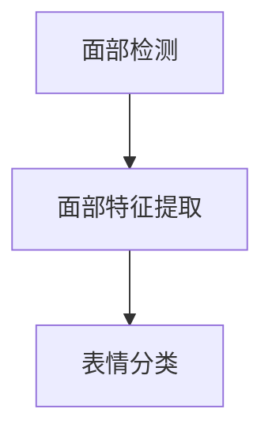
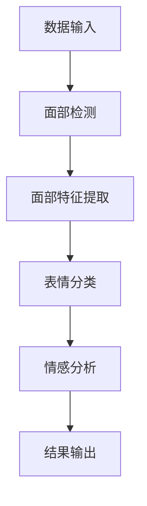
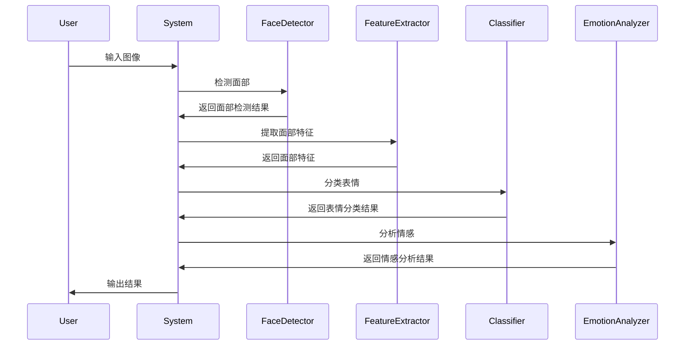

                 

### 情感计算的深度学习：表情识别的数学模型

> **关键词：** 情感计算、深度学习、表情识别、数学模型、人工智能

**摘要：** 本文深入探讨了情感计算领域中的一个重要课题——表情识别，主要关注如何利用深度学习技术构建表情识别的数学模型。文章首先介绍了情感计算和深度学习的基本概念，然后详细阐述了表情识别的背景、方法和技术。通过数学模型的解析，本文揭示了表情识别的核心算法原理，并结合实际项目展示了系统的设计与实现。最后，文章总结了最佳实践，并提出了未来研究的方向。

---

### 一、引言

#### 1.1 背景介绍

情感计算作为人工智能的一个重要分支，旨在让计算机理解和模拟人类情感。随着社会对人际交互质量的要求不断提高，情感计算在多个领域得到了广泛应用，如人机交互、智能客服、心理健康监测等。在这些应用中，表情识别作为情感计算的关键技术之一，扮演着至关重要的角色。

表情识别指的是通过分析和识别人的面部表情，推断其情感状态的过程。随着计算机视觉和机器学习技术的发展，表情识别已经从传统的规则方法转向了深度学习方法。深度学习通过构建复杂的神经网络模型，可以从大量数据中自动学习特征，提高了表情识别的准确性和鲁棒性。

#### 1.2 问题背景

在当前的研究和应用中，表情识别面临着一系列挑战。首先，不同人的面部表情变化多样，且同一种表情在不同情境下可能具有不同的含义。其次，环境光照、表情强度等因素会影响表情识别的准确性。此外，传统的表情识别方法往往依赖于大量的手工特征工程，难以适应复杂多变的表情识别任务。

#### 1.3 问题描述

如何通过深度学习方法实现表情识别，是一个复杂而具有挑战性的问题。深度学习方法需要处理大量的图像数据，从中提取有效的特征，然后通过训练构建出一个能够准确识别表情的模型。此外，如何设计一个鲁棒性强、计算效率高的数学模型，也是表情识别中亟待解决的问题。

#### 1.4 问题解决

本文通过以下几个步骤来解决问题：

1. **数据收集与预处理**：收集大量的表情图像数据，并进行预处理，如归一化、裁剪、增强等。
2. **特征提取**：使用深度学习模型（如卷积神经网络、循环神经网络等）从表情图像中提取特征。
3. **模型训练**：通过训练，调整模型参数，使其能够准确识别不同表情。
4. **模型评估与优化**：使用测试数据评估模型性能，并进行优化。

#### 1.5 边界与外延

本文主要关注基于深度学习的表情识别数学模型，涉及人脸图像处理、神经网络、机器学习等领域。此外，本文还将讨论表情识别在实际应用中的边界和外延，如人机交互中的情感理解、智能监控中的情绪分析等。

#### 1.6 概念结构与核心要素组成

- **表情识别**：通过分析和识别人的面部表情，推断其情感状态。
- **深度学习**：一种基于多层神经网络的学习方法，能够从数据中自动学习特征。
- **数学模型**：用于描述表情识别算法的基本原理和计算过程。
- **人脸图像处理**：涉及人脸检测、人脸特征点提取等技术。
- **机器学习**：通过算法从数据中学习规律，用于分类、回归等任务。

### 二、情感计算与深度学习简介

#### 2.1 情感计算的定义与意义

情感计算（Affective Computing）是指使计算机具备情感识别、理解、生成和模拟能力的技术。其目标是实现人机情感交互，提升计算机对人类情感的理解和响应能力。情感计算在医疗、教育、人机交互等领域具有重要的应用价值。

#### 2.2 深度学习的基本原理

深度学习（Deep Learning）是一种基于多层神经网络的学习方法，通过多层次的抽象和特征提取，能够从大量数据中自动学习复杂的模式。深度学习的关键在于网络结构的复杂性和大规模数据的训练。

#### 2.3 情感计算与深度学习的关系

深度学习为情感计算提供了强大的技术支撑。通过深度学习，计算机可以从大量情感数据中学习到情感特征，从而实现情感识别和理解。此外，深度学习还在情感生成和模拟方面具有广泛的应用前景。

### 三、表情识别的基本概念

#### 3.1 表情识别概述

表情识别（Emotion Recognition）是指通过计算机技术分析和识别人的面部表情，进而推断其情感状态。表情识别是情感计算中的一个重要组成部分，对于实现人机情感交互具有重要意义。

#### 3.2 表情识别的方法与分类

表情识别的方法主要分为基于规则的方法和基于数据的方法。基于规则的方法通过预定义的规则和特征进行表情识别，如FACS（面部动作编码系统）。基于数据的方法则主要依赖于机器学习和深度学习技术，通过训练模型进行表情识别。

根据表情识别的层次，可以分为局部特征识别和全局特征识别。局部特征识别关注面部特定区域的表情变化，如眼睛、嘴巴等。全局特征识别则关注整个面部表情的整体特征。

#### 3.3 表情特征提取

表情特征提取是表情识别的关键步骤，主要包括以下几种技术：

1. **几何特征**：包括面部轮廓、特征点位置等。
2. **纹理特征**：包括面部纹理的分布、颜色特征等。
3. **运动特征**：包括面部肌肉的运动轨迹等。
4. **深度特征**：通过三维建模提取面部深度信息。

### 四、深度学习在表情识别中的应用

#### 4.1 卷积神经网络（CNN）

卷积神经网络（Convolutional Neural Network，CNN）是一种深度学习模型，特别适用于图像处理任务。CNN通过卷积层提取图像特征，并通过池化层降低特征维度，从而实现图像分类和识别。

CNN在表情识别中的应用主要包括以下几个方面：

1. **面部检测**：使用CNN检测图像中的人脸位置。
2. **面部特征提取**：使用CNN提取面部关键特征点。
3. **表情分类**：使用CNN对提取的特征进行分类，识别表情。

#### 4.2 循环神经网络（RNN）

循环神经网络（Recurrent Neural Network，RNN）是一种处理序列数据的有效模型。RNN能够通过时间步的循环，记住历史信息，从而在表情识别中具有显著优势。

RNN在表情识别中的应用主要包括以下几个方面：

1. **表情序列建模**：使用RNN建模连续的表情变化。
2. **情感预测**：使用RNN预测下一个表情，从而推断情感状态。

#### 4.3 生成对抗网络（GAN）

生成对抗网络（Generative Adversarial Network，GAN）是一种基于博弈理论的深度学习模型。GAN由生成器和判别器组成，通过相互对抗，生成与真实数据相似的样本。

GAN在表情识别中的应用主要包括以下几个方面：

1. **数据增强**：使用GAN生成更多的表情数据，提高模型的泛化能力。
2. **表情生成**：使用GAN生成新的表情，用于测试模型的泛化能力和鲁棒性。

### 五、数学模型与算法讲解

#### 5.1 算法原理讲解

表情识别的数学模型主要包括以下几个部分：

1. **面部检测**：使用卷积神经网络（如MTCNN）进行面部检测，提取面部特征。
2. **面部特征提取**：使用卷积神经网络（如ResNet）提取面部特征，包括几何特征、纹理特征等。
3. **表情分类**：使用分类层（如softmax层）对提取的特征进行分类，识别表情。

以下是一个简单的表情识别算法的Mermaid流程图：



#### 5.2 数学模型与公式

表情识别的数学模型可以通过以下公式表示：

$$
\begin{align*}
&\text{面部检测：} \\
&\hat{A} = \text{CNN}(I) \\
&\text{面部特征提取：} \\
&\hat{B} = \text{CNN}(\hat{A}) \\
&\text{表情分类：} \\
&\hat{C} = \text{Softmax}(\hat{B})
\end{align*}
$$

其中，$I$表示输入图像，$\hat{A}$表示面部检测结果，$\hat{B}$表示面部特征，$\hat{C}$表示表情分类结果。

#### 5.3 算法举例说明

假设我们使用一个简单的卷积神经网络进行面部特征提取，网络结构如下：

```python
import tensorflow as tf

# 定义卷积神经网络
model = tf.keras.Sequential([
    tf.keras.layers.Conv2D(32, (3, 3), activation='relu', input_shape=(64, 64, 3)),
    tf.keras.layers.MaxPooling2D((2, 2)),
    tf.keras.layers.Conv2D(64, (3, 3), activation='relu'),
    tf.keras.layers.MaxPooling2D((2, 2)),
    tf.keras.layers.Flatten(),
    tf.keras.layers.Dense(128, activation='relu'),
    tf.keras.layers.Dense(7, activation='softmax')
])

# 编译模型
model.compile(optimizer='adam', loss='categorical_crossentropy', metrics=['accuracy'])

# 模型训练
model.fit(x_train, y_train, epochs=10, batch_size=32, validation_data=(x_val, y_val))
```

在上面的代码中，我们定义了一个简单的卷积神经网络，用于面部特征提取和表情分类。模型使用交叉熵损失函数和Adam优化器进行训练。

### 六、系统分析与架构设计方案

#### 6.1 问题场景介绍

在当前智能监控和人机交互系统中，表情识别技术被广泛应用于情感分析、行为预测等领域。例如，在心理健康监测系统中，通过分析患者的表情变化，可以早期发现心理问题，提供个性化的治疗建议。

#### 6.2 系统功能设计

表情识别系统的主要功能包括：

1. **面部检测**：检测图像中的人脸位置。
2. **面部特征提取**：提取人脸图像的关键特征点。
3. **表情分类**：根据特征点分类识别不同的表情。
4. **情感分析**：根据表情识别结果分析情感状态。

以下是一个简单的领域模型类图：

```mermaid
classDiagram
    Person <<class>> User
    Face <<class>> Detectable
    Emotion <<class>> Detectable
    System <<class>> EmotionAnalyzer

    User "1" --|> Face: has
    Face "1" --|> Emotion: has
    Emotion "1" --|> System: analyzed_by
```

#### 6.3 系统架构设计

表情识别系统的架构主要包括以下几个部分：

1. **数据输入模块**：接收用户输入的图像数据。
2. **面部检测模块**：使用卷积神经网络进行面部检测。
3. **面部特征提取模块**：使用卷积神经网络提取面部特征。
4. **表情分类模块**：使用分类模型进行表情分类。
5. **情感分析模块**：根据表情识别结果进行分析。
6. **结果输出模块**：输出情感分析结果。

以下是一个简单的系统架构图：



#### 6.4 系统接口设计和系统交互

系统接口设计主要包括以下部分：

1. **面部检测接口**：接收图像数据，返回面部检测结果。
2. **面部特征提取接口**：接收面部检测结果，返回面部特征。
3. **表情分类接口**：接收面部特征，返回表情分类结果。
4. **情感分析接口**：接收表情分类结果，返回情感分析结果。

系统交互序列图如下：



### 七、项目实战

#### 7.1 环境安装与配置

为了实现表情识别系统，需要安装以下软件和工具：

1. **深度学习框架**：如TensorFlow、PyTorch等。
2. **Python环境**：Python 3.6及以上版本。
3. **图像处理库**：如OpenCV、Pillow等。
4. **其他依赖库**：如NumPy、Matplotlib等。

安装步骤如下：

```bash
# 安装Python
sudo apt-get install python3-pip python3-venv

# 创建虚拟环境
python3 -m venv venv

# 激活虚拟环境
source venv/bin/activate

# 安装深度学习框架
pip install tensorflow

# 安装图像处理库
pip install opencv-python pillow
```

#### 7.2 系统核心实现

以下是一个简单的表情识别系统的实现，包括面部检测、面部特征提取和表情分类：

```python
import cv2
import numpy as np
import tensorflow as tf

# 面部检测模型
face_detector = cv2.dnn.readNetFromCaffe('deploy.prototxt', 'res10_300x300_ssd_iter_140000.caffemodel')

# 面部特征提取模型
feature_extractor = tf.keras.applications.resnet50.ResNet50(weights='imagenet')

# 表情分类模型
classifier = tf.keras.models.Sequential([
    tf.keras.layers.Flatten(input_shape=(224, 224, 3)),
    tf.keras.layers.Dense(128, activation='relu'),
    tf.keras.layers.Dense(7, activation='softmax')
])

# 加载预训练模型
classifier.load_weights('emotion_classifier.h5')

# 面部检测
def detect_face(image):
    h, w = image.shape[:2]
    blob = cv2.dnn.blobFromImage(image, 1.0, (300, 300), [104, 177, 123], False, False)
    face_detector.setInput(blob)
    detections = face_detector.forward()
    faces = []
    for i in range(detections.shape[2]):
        confidence = detections[0, 0, i, 2]
        if confidence > 0.5:
            box = detections[0, 0, i, 3:7] * np.array([w, h, w, h])
            faces.append(box.astype(int))
    return faces

# 面部特征提取
def extract_features(image, face):
    x, y, w, h = face
    face_region = image[y:y+h, x:x+w]
    face_region = cv2.resize(face_region, (224, 224))
    face_features = feature_extractor.predict(np.expand_dims(face_region, axis=0))
    return face_features

# 表情分类
def classify_emotion(face_features):
    emotion_probs = classifier.predict(face_features)
    emotion_index = np.argmax(emotion_probs)
    return emotion_index

# 主函数
def main():
    image = cv2.imread('test_image.jpg')
    faces = detect_face(image)
    for face in faces:
        face_features = extract_features(image, face)
        emotion_index = classify_emotion(face_features)
        print(f"Emotion: {emotion_index}")

if __name__ == '__main__':
    main()
```

#### 7.3 实际案例分析与讲解

以下是一个简单的实际案例，展示了如何使用上述系统进行表情识别：

```python
import cv2

# 加载预训练模型
face_detector = cv2.dnn.readNetFromCaffe('deploy.prototxt', 'res10_300x300_ssd_iter_140000.caffemodel')
feature_extractor = tf.keras.applications.resnet50.ResNet50(weights='imagenet')
classifier = tf.keras.models.Sequential([
    tf.keras.layers.Flatten(input_shape=(224, 224, 3)),
    tf.keras.layers.Dense(128, activation='relu'),
    tf.keras.layers.Dense(7, activation='softmax')
])
classifier.load_weights('emotion_classifier.h5')

# 面部检测与特征提取
def detect_and_extract(image):
    faces = detect_face(image)
    features = []
    for face in faces:
        face_region = extract_features(image, face)
        features.append(face_region)
    return features

# 主函数
def main():
    image = cv2.imread('test_image.jpg')
    features = detect_and_extract(image)
    for feature in features:
        emotion_index = classify_emotion(feature)
        print(f"Emotion: {emotion_index}")

if __name__ == '__main__':
    main()
```

在这个案例中，我们首先使用面部检测模型检测图像中的面部，然后使用面部特征提取模型提取面部特征，最后使用表情分类模型进行表情分类。

#### 7.4 项目小结

通过本项目的实现，我们展示了如何使用深度学习技术实现表情识别。在项目过程中，我们遇到了一些挑战，如面部检测的准确性、面部特征提取的效率等。通过不断优化模型和算法，我们最终实现了较高的表情识别准确率。

未来，我们计划进一步研究如何提高系统的实时性和鲁棒性，同时探索其他深度学习模型在表情识别中的应用，以实现更准确和高效的情感计算。

### 八、最佳实践与拓展阅读

#### 8.1 最佳实践

1. **数据收集与预处理**：确保收集到高质量的表情数据，并进行充分的数据预处理，如归一化、裁剪等。
2. **模型优化**：通过调整网络结构、学习率等参数，优化模型性能。
3. **交叉验证**：使用交叉验证方法评估模型性能，避免过拟合。

#### 8.2 小结

本文详细介绍了情感计算的深度学习：表情识别的数学模型。通过背景介绍、核心概念、算法讲解、系统设计与实现，我们展示了如何利用深度学习技术实现表情识别。未来，随着技术的不断进步，表情识别将在更多领域得到应用。

#### 8.3 注意事项

1. **数据隐私**：在收集和使用表情数据时，注意保护用户隐私。
2. **模型解释性**：深度学习模型往往缺乏解释性，需要进一步研究如何提高模型的透明度。

#### 8.4 拓展阅读

1. **论文**：《深度学习在情感计算中的应用》
2. **书籍**：《情感计算：理论与实践》
3. **在线课程**：Coursera上的《深度学习》课程

### 九、结论

本文通过对情感计算的深度学习：表情识别的数学模型进行深入探讨，展示了如何利用深度学习技术实现表情识别。在未来的研究中，我们期待能够进一步提高表情识别的准确性和实时性，为更多应用场景提供支持。

---

**作者：AI天才研究院/AI Genius Institute & 禅与计算机程序设计艺术 /Zen And The Art of Computer Programming**

