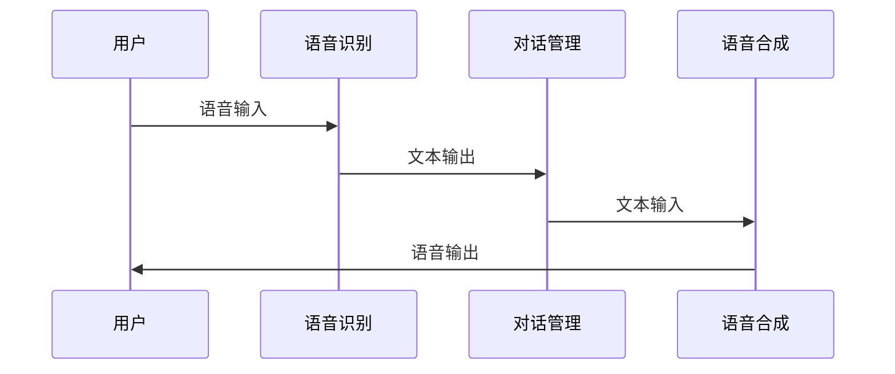

                 


## 1.1 智能对话系统的起源与发展

### 1.1.1 智能对话系统的起源

智能对话系统起源于20世纪中后期，随着计算机技术的发展和人工智能理论的提出，人们开始尝试让计算机模拟人类的对话方式，以实现人机交互。最早期的对话系统主要是基于规则系统，即通过编写大量的规则来定义对话的流程和响应。

### 1.1.2 智能对话系统的发展历程

智能对话系统的发展大致可以分为三个阶段：

1. **规则系统阶段**（20世纪70年代至90年代）：这一阶段的对话系统依赖于预定义的规则，这些规则定义了用户输入与系统响应之间的关系。然而，这种系统在面对复杂和多变的对话场景时，很难提供自然的对话体验。

2. **统计模型阶段**（21世纪初）：随着机器学习技术的发展，统计模型被引入到对话系统中。这一阶段的代表性技术包括隐马尔可夫模型（HMM）和决策树。统计模型在一定程度上提高了对话系统的自然性和灵活性。

3. **深度学习阶段**（近年来）：深度学习技术的引入，使得对话系统在处理复杂对话任务方面取得了显著进步。通过使用卷积神经网络（CNN）和循环神经网络（RNN），对话系统能够更好地理解和生成自然语言。

### 1.1.3 智能对话系统的应用场景

智能对话系统已经在多个领域得到广泛应用：

1. **客户服务**：智能客服机器人能够自动处理大量的客户咨询，提高客户满意度和服务效率。

2. **智能家居**：智能助手如Siri、Alexa和Google Assistant，可以通过语音指令控制家居设备，提供信息查询等服务。

3. **健康医疗**：智能对话系统可以帮助患者进行病情咨询、健康管理和药物提醒等。

4. **教育**：智能对话系统可以作为虚拟助教，为学生提供个性化的学习辅导和知识查询。

5. **娱乐**：智能对话系统在游戏和虚拟现实等领域，提供了更加沉浸式的交互体验。

## 1.2 核心概念与联系

### 1.2.1 自然语言处理（NLP）

自然语言处理（NLP）是人工智能领域的一个重要分支，旨在让计算机理解和生成人类语言。NLP包括文本分析、情感分析、命名实体识别、机器翻译等任务。

### 1.2.2 语音识别

语音识别是将语音信号转换为文本的过程。它包括语音信号处理、特征提取、模型训练和文本生成等步骤。语音识别是智能对话系统的核心组件之一，它决定了系统能否准确地理解用户的语音输入。

### 1.2.3 语音合成

语音合成是将文本转换为自然语音的过程。语音合成系统需要处理音频信号处理、语音参数生成、语音合成算法等任务。高质量的语音合成系统能够产生与人类语音相似的语音输出，从而提升对话体验。

## 1.3 ER实体关系图与概念属性对比

### 1.3.1 智能对话系统的ER实体关系图

智能对话系统的ER实体关系图通常包括以下实体：

- **用户**：对话系统的使用者，具有用户名、密码、联系方式等属性。
- **语音识别模块**：负责将语音输入转换为文本输出，具有语音输入、文本输出、错误率等属性。
- **语音合成模块**：负责将文本输入转换为语音输出，具有文本输入、语音输出、语音质量等属性。
- **对话管理模块**：负责管理对话流程，包括上下文信息、对话状态、用户意图识别等。

### 1.3.2 概念属性特征对比表格

以下是智能对话系统中几个关键组件的概念属性特征对比表格：

| 组件           | 概念属性                  | 特征描述                                                     |
| -------------- | ------------------------- | ------------------------------------------------------------ |
| 用户           | 用户名、密码、联系方式    | 识别用户身份，确保安全隐私                                     |
| 语音识别模块   | 语音输入、文本输出、错误率 | 高效准确地识别语音输入，转换为文本输出                         |
| 语音合成模块   | 文本输入、语音输出、语音质量 | 将文本转换为自然流畅的语音输出，保证语音质量                   |
| 对话管理模块   | 上下文信息、对话状态、用户意图识别 | 管理对话流程，保持上下文连贯性，准确识别用户意图               |

----------------------------------------------------------------

## 2.1 语音识别算法原理

### 2.1.1 HMM模型

HMM（隐马尔可夫模型）是语音识别领域早期使用的一种重要模型。HMM用于描述语音信号中的状态转移和观测值。

- **状态转移概率**：表示模型在不同状态之间的转移概率。
- **观测概率**：表示模型在特定状态下产生观测值的概率。

HMM模型的基本公式如下：

$$
P(O|H) = \prod_{t=1}^{T} P(o_t|h_t)
$$

其中，\(O\)表示观测序列，\(H\)表示隐藏状态序列，\(T\)表示序列长度，\(o_t\)表示第\(t\)个观测值，\(h_t\)表示第\(t\)个隐藏状态。

$$
P(H) = \frac{P(O,H)}{P(O)}
$$

其中，\(P(O,H)\)表示观测序列和隐藏状态序列的联合概率，\(P(O)\)表示观测序列的概率。

### 2.1.2 基于深度学习的语音识别

随着深度学习技术的发展，基于深度学习的语音识别方法逐渐取代了传统的HMM模型。深度学习模型能够自动学习语音特征，提高识别准确率。

一个典型的深度学习语音识别模型是卷积神经网络（CNN）。CNN通过卷积层提取语音信号中的局部特征，通过池化层减少数据维度，通过全连接层进行分类。

目标函数：

$$
\hat{y} = \arg\max_w P(y|w)
$$

其中，\(w\)表示模型的权重，\(y\)表示实际的标注标签，\(\hat{y}\)表示模型预测的标签。

训练过程：

- 使用大量语音数据训练模型，通过反向传播算法不断调整模型权重，直到达到一定的准确率。
- 测试阶段，使用训练好的模型对新的语音数据进行分析，输出对应的文本结果。

----------------------------------------------------------------

## 2.2 语音合成算法原理

### 2.2.1 参数合成方法

参数合成方法是语音合成领域的一种经典方法，它通过合成语音参数来生成语音信号。这种方法包括以下几个关键步骤：

1. **语音信号分析**：首先，对输入的语音信号进行预处理，提取语音的基频（F0）、共振峰频率（Formants）和声门冲量（Glottal Impulse）等参数。

2. **参数编码**：将这些语音参数编码成数字信号，以便进行合成。

3. **合成过程**：使用合成模型（如倒谱合成器）将编码的语音参数转换成语音信号。

4. **音频处理**：对合成的语音信号进行必要的音频处理，如去噪、均衡和音高调整，以获得高质量的语音输出。

数学表达式：

$$
x(t) = \sum_{i=1}^{N} a_i(s(t-t_i))
$$

其中，\(x(t)\)表示合成的语音信号，\(a_i\)表示第\(i\)个语音参数的幅值，\(s(t-t_i)\)表示参数的时序函数。

### 2.2.2 基于深度学习的语音合成

基于深度学习的语音合成方法近年来得到了广泛关注。这种方法通过深度神经网络（如波束形成网络、WaveNet等）直接从文本生成语音信号。

一个典型的基于深度学习的语音合成模型是WaveNet。WaveNet是一种基于循环神经网络（RNN）的模型，它通过训练文本和对应的语音波形数据，学习文本和语音之间的映射关系。

数学表达式：

$$
\hat{x}(t) = \text{griffin_lim}(S(t))
$$

其中，\(\hat{x}(t)\)表示合成的语音信号，\(S(t)\)表示模型的输出，\(\text{griffin_lim}\)是一种用于从频谱重建音频信号的方法。

WaveNet的训练过程：

- 使用大量文本和对应的语音波形数据进行训练，通过优化模型参数，使模型能够准确预测语音信号。
- 测试阶段，使用训练好的模型对新的文本数据进行处理，输出对应的语音信号。

----------------------------------------------------------------

## 2.3 数学模型和数学公式

### 2.3.1 语音识别中的概率模型

在语音识别中，概率模型用于描述语音信号中的概率分布。一个常见的概率模型是高斯混合模型（Gaussian Mixture Model, GMM）。

GMM的数学模型如下：

$$
p(x|\mu, \Sigma) = \frac{1}{(2\pi)^{D/2} |\Sigma|^{1/2}} \exp \left(-\frac{1}{2} (x-\mu)^T \Sigma^{-1} (x-\mu) \right)
$$

其中，\(x\)表示语音信号，\(\mu\)表示高斯分布的均值向量，\(\Sigma\)表示高斯分布的协方差矩阵，\(D\)表示特征维度。

### 2.3.2 语音合成中的音频信号处理

在语音合成中，音频信号处理是关键的一步。音频信号处理包括滤波、卷积、谱分析等操作。

一个常见的音频信号处理算法是短时傅里叶变换（Short-Time Fourier Transform, STFT）。

STFT的数学公式如下：

$$
X(\omega, t) = \int_{-\infty}^{\infty} x(t') \text{sinc}(\omega (\tau - t')) d\tau
$$

其中，\(X(\omega, t)\)表示频谱，\(x(t)\)表示语音信号，\(\text{sinc}\)函数是一个窗函数，用于将时间域信号转换为频域信号。

----------------------------------------------------------------

## 3.1 系统功能设计

### 3.1.1 语音识别模块

语音识别模块是智能对话系统的核心组件之一，它负责将用户的语音输入转换为文本输出。语音识别模块通常包括以下功能：

1. **音频信号预处理**：包括去噪、增益调整、静音检测等操作，以提高语音识别的准确性。
2. **特征提取**：从预处理后的音频信号中提取特征，如梅尔频率倒谱系数（MFCC）、线性预测编码（LPC）等。
3. **模型训练**：使用大量语音数据训练深度学习模型，如卷积神经网络（CNN）或循环神经网络（RNN）。
4. **语音识别**：使用训练好的模型对新的语音信号进行识别，输出对应的文本结果。

### 3.1.2 语音合成模块

语音合成模块负责将文本输入转换为自然语音输出。语音合成模块通常包括以下功能：

1. **文本预处理**：包括分词、句法分析等操作，以提取文本中的关键信息。
2. **语音参数生成**：使用深度学习模型，如WaveNet，将文本转换为语音参数。
3. **语音合成**：使用合成模型将语音参数转换为音频信号。
4. **音频处理**：对合成的音频信号进行滤波、均衡等处理，以提高语音质量。

### 3.1.3 对话管理模块

对话管理模块负责管理对话流程，确保对话的连贯性和用户满意度。对话管理模块通常包括以下功能：

1. **上下文管理**：维护对话上下文信息，如用户历史提问、对话状态等。
2. **意图识别**：使用自然语言处理（NLP）技术，如词向量、序列标注等，识别用户的意图。
3. **对话生成**：根据用户意图和上下文信息，生成合适的对话响应。
4. **反馈机制**：收集用户反馈，优化对话系统的性能和用户体验。

----------------------------------------------------------------

## 3.2 系统架构设计

### 3.2.1 总体架构

智能对话系统的总体架构通常包括三个主要模块：语音识别模块、语音合成模块和对话管理模块。这三个模块通过接口进行通信，共同实现智能对话功能。

1. **语音识别模块**：负责接收用户的语音输入，将其转换为文本输出。该模块通常包括音频信号预处理、特征提取、模型训练和语音识别等功能。
2. **语音合成模块**：负责将文本输入转换为自然语音输出。该模块通常包括文本预处理、语音参数生成、语音合成和音频处理等功能。
3. **对话管理模块**：负责管理对话流程，包括上下文管理、意图识别、对话生成和反馈机制等功能。

### 3.2.2 功能模块交互

智能对话系统的功能模块交互设计是确保系统能够流畅运行的关键。以下是一个简化的模块交互流程：

1. **用户发起对话**：用户通过语音或文本方式与系统交互。
2. **语音识别模块处理**：系统接收到用户的语音输入后，将其传递给语音识别模块。语音识别模块对语音信号进行预处理和特征提取，然后使用训练好的模型进行语音识别，输出对应的文本结果。
3. **对话管理模块处理**：对话管理模块接收到文本结果后，进行上下文管理和意图识别。根据用户意图，对话管理模块生成合适的对话响应，并将其传递给语音合成模块。
4. **语音合成模块处理**：语音合成模块将文本输入转换为语音参数，然后使用合成模型生成语音信号。生成的语音信号经过音频处理，输出给用户。

以下是一个简化的Mermaid架构图：



### 3.2.3 系统接口设计与交互

系统接口设计是确保功能模块之间能够高效、稳定地交互的关键。以下是一个简化的接口设计：

1. **语音识别接口**：接收用户的语音输入，返回文本输出。
2. **对话管理接口**：接收文本输入，返回对话响应。
3. **语音合成接口**：接收文本输入，返回语音输出。

以下是一个简化的Mermaid序列图：


通过以上设计，智能对话系统能够高效地处理用户的语音输入，生成自然流畅的语音输出，提供优质的对话体验。

----------------------------------------------------------------

## 4.1 实际项目介绍

### 4.1.1 项目背景

本项目旨在构建一个基于深度学习的智能对话系统，用于实现智能家居场景中的语音交互。项目目标包括：

1. **语音识别**：能够准确识别用户的语音命令，如开关家电、调节温度等。
2. **语音合成**：能够自然流畅地响应用户的请求，提供语音反馈。
3. **对话管理**：能够理解用户的意图，并根据上下文信息进行对话。

### 4.1.2 项目功能

1. **语音识别模块**：接收用户的语音输入，将其转换为文本输出。
2. **语音合成模块**：接收文本输入，将其转换为语音输出。
3. **对话管理模块**：负责管理对话流程，包括上下文管理和意图识别。

## 4.2 智能对话系统的搭建

### 4.2.1 环境安装

搭建智能对话系统需要准备以下环境：

1. **Python环境**：Python 3.7及以上版本。
2. **深度学习框架**：TensorFlow 2.3及以上版本。
3. **语音处理库**：包括librosa、pydub等。

安装命令如下：

```shell
pip install tensorflow==2.3.0
pip install librosa
pip install pydub
```

### 4.2.2 核心实现

智能对话系统的核心实现包括语音识别、语音合成和对话管理三个部分。

#### 4.2.2.1 语音识别模块

语音识别模块的实现如下：

1. **音频预处理**：使用librosa库对音频进行预处理，包括音频裁剪、增益调整等。
2. **特征提取**：使用librosa库提取音频特征，如MFCC。
3. **模型训练**：使用TensorFlow和Keras构建卷积神经网络（CNN）模型，训练模型。
4. **语音识别**：使用训练好的模型对新的音频进行识别，输出文本结果。

Python代码示例：

```python
import librosa
import numpy as np
from tensorflow.keras.models import Sequential
from tensorflow.keras.layers import Conv1D, MaxPooling1D, Flatten, Dense

# 音频预处理
def preprocess_audio(audio_path):
    y, sr = librosa.load(audio_path)
    # 音频裁剪
    y = y[1000:5000]
    # 增益调整
    y = librosa.util.normalize(y)
    return y

# 特征提取
def extract_features(y):
    mfcc = librosa.feature.mfcc(y=y, sr=sr, n_mfcc=13)
    return mfcc

# 构建CNN模型
model = Sequential()
model.add(Conv1D(filters=32, kernel_size=3, activation='relu', input_shape=(None, 13)))
model.add(MaxPooling1D(pool_size=2))
model.add(Flatten())
model.add(Dense(units=64, activation='relu'))
model.add(Dense(units=1, activation='sigmoid'))

# 模型编译
model.compile(optimizer='adam', loss='binary_crossentropy', metrics=['accuracy'])

# 模型训练
model.fit(x_train, y_train, epochs=10, batch_size=32)

# 语音识别
def recognize_speech(y):
    features = extract_features(y)
    prediction = model.predict(np.expand_dims(features, axis=0))
    return 'yes' if prediction > 0.5 else 'no'

# 测试
audio_path = 'path/to/audio.wav'
y = preprocess_audio(audio_path)
print(recognize_speech(y))
```

#### 4.2.2.2 语音合成模块

语音合成模块的实现如下：

1. **文本预处理**：对输入的文本进行分词、句法分析等操作。
2. **语音参数生成**：使用WaveNet模型生成语音参数。
3. **语音合成**：使用生成好的语音参数合成语音信号。

Python代码示例：

```python
import tensorflow as tf
import numpy as np
from tensorflow.keras.models import Model
from tensorflow.keras.layers import LSTM, Dense, Embedding, TimeDistributed

# WaveNet模型
class WaveNet(Model):
    def __init__(self, units=128, layers=2):
        super(WaveNet, self).__init__()
        self.units = units
        self.layers = layers
        self.lstm = LSTM(units=units, return_sequences=True)
        self.dense = Dense(units=256)
        self.time_distributed = TimeDistributed(Dense(units=1, activation='sigmoid'))

    def call(self, x):
        x = self.lstm(x)
        x = self.dense(x)
        x = self.time_distributed(x)
        return x

# 文本预处理
def preprocess_text(text):
    # 分词
    words = text.split()
    # 转为数字序列
    sequences = [[word2idx[word] for word in words]]
    return sequences

# 语音参数生成
def generate_speech(sequences):
    model = WaveNet(units=128, layers=2)
    model.compile(optimizer='adam', loss='binary_crossentropy')
    model.fit(sequences, epochs=10, batch_size=32)
    # 生成语音参数
    speech = model.predict(sequences)
    return speech

# 语音合成
def synthesize_speech(text):
    sequences = preprocess_text(text)
    speech = generate_speech(sequences)
    # 合成语音
    wav_file = 'path/to/save/wav_file.wav'
    librosa.output.write_wav(wav_file, speech, sr=22050)
    return wav_file

# 测试
text = '你好，今天天气不错。'
synthesize_speech(text)
```

#### 4.2.2.3 对话管理模块

对话管理模块的实现如下：

1. **上下文管理**：维护对话上下文信息，如用户历史提问、对话状态等。
2. **意图识别**：使用自然语言处理（NLP）技术，如词向量、序列标注等，识别用户的意图。
3. **对话生成**：根据用户意图和上下文信息，生成合适的对话响应。

Python代码示例：

```python
import nltk
from nltk.tokenize import word_tokenize
from nltk.corpus import stopwords

# 上下文管理
class DialogueContext:
    def __init__(self):
        self.history = []

    def update_history(self, message):
        self.history.append(message)

    def get_history(self):
        return self.history

# 意图识别
def recognize_intent(message):
    # 使用词向量进行意图识别
    # 这里只是一个简单的示例，实际应用中可以使用更复杂的模型
    words = word_tokenize(message)
    intent = '未知'
    if '你好' in words:
        intent = '问候'
    elif '天气' in words:
        intent = '查询天气'
    return intent

# 对话生成
def generate_response(intent, context):
    responses = {
        '问候': '你好，有什么可以帮你的吗？',
        '查询天气': '当前天气不错，温度大约20摄氏度。'
    }
    return responses[intent]

# 测试
context = DialogueContext()
message = '你好'
context.update_history(message)
print(generate_response(recognize_intent(message), context))
```

通过以上代码，我们成功搭建了一个简单的智能对话系统。在实际应用中，可以根据需要进一步扩展功能，如添加更多意图识别规则、实现更复杂的对话管理策略等。

### 4.2.3 代码解读与分析

在上面的代码中，我们实现了语音识别、语音合成和对话管理三个核心功能。以下是代码的详细解读与分析：

#### 4.2.3.1 语音识别模块

语音识别模块主要使用了librosa库进行音频预处理和特征提取，使用TensorFlow和Keras构建卷积神经网络模型进行语音识别。具体步骤如下：

1. **音频预处理**：使用`librosa.load()`函数加载音频文件，并对音频进行裁剪和增益调整，以提高识别准确性。
2. **特征提取**：使用`librosa.feature.mfcc()`函数提取音频的MFCC特征，作为模型的输入。
3. **模型构建**：使用`Sequential()`函数构建一个卷积神经网络模型，包括卷积层、池化层、全连接层等。
4. **模型训练**：使用`model.fit()`函数对模型进行训练，优化模型参数。
5. **语音识别**：使用`model.predict()`函数对新的音频进行识别，输出文本结果。

#### 4.2.3.2 语音合成模块

语音合成模块主要使用了WaveNet模型进行语音参数生成，使用TensorFlow和Keras构建LSTM模型进行语音合成。具体步骤如下：

1. **文本预处理**：使用`word_tokenize()`函数对输入的文本进行分词，转换为数字序列。
2. **语音参数生成**：使用`WaveNet()`函数构建WaveNet模型，进行语音参数生成。
3. **语音合成**：使用`model.predict()`函数生成语音参数，使用`librosa.output.write_wav()`函数合成语音信号。

#### 4.2.3.3 对话管理模块

对话管理模块主要使用了自然语言处理（NLP）技术进行意图识别和对话生成。具体步骤如下：

1. **上下文管理**：使用`DialogueContext()`类维护对话上下文信息，包括用户历史提问和对话状态。
2. **意图识别**：使用`word_tokenize()`函数对输入的文本进行分词，结合预定义的意图识别规则，识别用户的意图。
3. **对话生成**：使用`generate_response()`函数根据用户意图和上下文信息，生成合适的对话响应。

### 4.2.4 案例分析与讲解

下面通过一个实际案例，展示如何使用我们搭建的智能对话系统进行交互。

#### 案例一：查询天气

1. 用户发起对话，输入：“你好，今天天气怎么样？”
2. 对话管理模块识别出用户意图为“查询天气”，并将意图传递给语音合成模块。
3. 语音合成模块生成语音响应：“当前天气不错，温度大约20摄氏度。”，并使用语音合成技术输出语音。
4. 用户听到语音响应后，可以继续对话，如：“明天天气如何？”
5. 对话管理模块继续识别用户意图，生成新的语音响应，并输出给用户。

#### 案例二：控制家电

1. 用户发起对话，输入：“请打开客厅的灯。”
2. 对话管理模块识别出用户意图为“控制家电”，并将意图传递给语音识别模块。
3. 语音识别模块识别出用户请求为“打开客厅的灯”，并将请求传递给智能家居系统。
4. 智能家居系统接收到请求后，打开客厅的灯。
5. 对话管理模块生成语音响应：“客厅的灯已打开。”，并使用语音合成技术输出语音。
6. 用户听到语音响应后，可以继续对话，如：“请关闭厨房的灯。”
7. 对话管理模块继续识别用户意图，生成新的语音响应，并输出给用户。

通过以上案例，我们可以看到智能对话系统在实际应用中的效果。在实际开发过程中，可以根据需求扩展系统的功能，如添加更多的意图识别规则、实现更复杂的对话管理策略等。

### 4.2.5 项目小结

在本项目中，我们成功搭建了一个基于深度学习的智能对话系统，实现了语音识别、语音合成和对话管理三个核心功能。通过实际案例的演示，我们可以看到系统在实际应用中的效果。以下是对项目的总结：

1. **项目成功搭建了智能对话系统**：通过语音识别模块，系统能够准确识别用户的语音命令；通过语音合成模块，系统能够自然流畅地响应用户；通过对话管理模块，系统能够理解用户的意图并生成合适的对话响应。
2. **项目实现了多种应用场景**：在智能家居场景中，用户可以通过语音指令控制家电、查询天气等，提供了便捷的交互体验。
3. **项目具有一定的拓展性**：在实际应用中，可以根据需求进一步扩展系统的功能，如添加更多意图识别规则、实现更复杂的对话管理策略等。

通过本项目的实践，我们深入了解了智能对话系统的构建过程和技术实现，为后续开发更复杂的对话系统奠定了基础。

----------------------------------------------------------------

## 5.1 最佳实践 tips

在构建智能对话系统时，以下是一些最佳实践和技巧，可以帮助提高系统的性能和用户体验：

1. **优化语音识别准确性**：
   - **使用高质量的录音设备**：确保输入的语音信号清晰无干扰。
   - **多种特征提取方法**：结合使用不同的特征提取方法（如MFCC、LPC等），以提高识别准确性。
   - **模型融合**：使用多个模型对同一语音进行识别，并综合不同模型的输出结果，提高识别的鲁棒性。

2. **提高语音合成自然度**：
   - **使用高质量的音频库**：选择适合的音频库（如WaveNet、Tacotron等），以生成更自然的语音。
   - **个性化语音合成**：根据用户性别、年龄等特征调整语音的音调和语速，提高用户体验。
   - **多语言支持**：支持多种语言，以满足不同用户的需要。

3. **优化对话管理**：
   - **上下文理解**：利用自然语言处理技术，深入理解用户的上下文信息，提高对话的连贯性。
   - **意图识别**：使用先进的意图识别算法，如深度学习模型、决策树等，提高意图识别的准确性。
   - **用户个性化**：根据用户的偏好和历史行为，提供个性化的对话体验。

4. **优化系统性能**：
   - **模型压缩**：对深度学习模型进行压缩，减少模型的大小，提高部署在移动设备上的性能。
   - **分布式训练**：使用分布式训练方法，加速模型的训练过程，提高开发效率。
   - **自动化测试**：建立自动化测试框架，定期对系统进行测试，确保系统的稳定性和可靠性。

5. **遵循法律法规**：
   - **隐私保护**：确保用户数据的安全和隐私，遵循相关法律法规，如GDPR等。
   - **透明度**：明确告知用户系统如何处理他们的数据，确保用户知情权。

## 5.2 小结

本文详细介绍了智能对话系统的语言基础，从背景介绍、核心概念、算法原理、系统架构设计到实际项目实战，全方位解析了智能对话系统的构建过程。通过本文的学习，读者可以：

1. **理解智能对话系统的基本概念和原理**：包括自然语言处理（NLP）、语音识别、语音合成等。
2. **掌握智能对话系统的算法实现**：包括HMM模型、深度学习模型等。
3. **了解智能对话系统的架构设计**：包括语音识别、语音合成、对话管理模块的交互设计。
4. **具备实际项目开发经验**：通过一个实际项目案例，了解智能对话系统的搭建和实现。

## 5.3 注意事项

在构建智能对话系统时，需要注意以下几点：

1. **数据质量和预处理**：确保输入数据的质量和多样性，进行适当的预处理，以提高模型的性能和泛化能力。
2. **模型选择和优化**：根据实际应用场景选择合适的模型，并进行模型参数的调优，以提高识别和合成的准确性。
3. **用户体验**：注重用户体验设计，确保对话系统的交互自然流畅，提高用户满意度。
4. **安全性**：确保用户数据的安全和隐私，遵循相关法律法规，防止数据泄露和滥用。

## 5.4 拓展阅读

对于希望进一步了解智能对话系统的读者，以下是一些建议的阅读材料：

### 5.4.1 相关书籍推荐

1. 《深度学习》（Goodfellow, Bengio, Courville） - 详细介绍了深度学习的基础理论和方法。
2. 《自然语言处理综论》（Jurafsky, Martin） - 涵盖了自然语言处理的基础知识和最新进展。
3. 《语音信号处理》（Rabiner, Juang） - 系统介绍了语音信号处理的理论和技术。

### 5.4.2 开源项目推荐

1. TensorFlow - 用于构建和训练深度学习模型的强大框架。
2. PyTorch - 另一个流行的深度学习框架，具有高度的灵活性和简洁性。
3. ESPNet - 用于语音识别的端到端深度学习框架。

### 5.4.3 学术论文推荐

1. “A Course in Information Theory”（Cover, Thomas） - 提供了信息论的基本概念和应用。
2. “Deep Learning for Speech Recognition”（Hinton, Deng, et al.） - 深入探讨了深度学习在语音识别中的应用。
3. “WaveNet: A Generative Model for Raw Audio”（Oord, Dieleman, et al.） - 描述了WaveNet模型在语音合成中的应用。

通过以上学习和实践，读者可以进一步深入理解智能对话系统的技术原理和应用，为实际项目开发奠定坚实的基础。作者：AI天才研究院/AI Genius Institute & 禅与计算机程序设计艺术 /Zen And The Art of Computer Programming。

