                 

### 文章标题

**《打造高绩效团队：从目标设定到执行》**

---

**关键词：** 高绩效团队、目标设定、团队角色、沟通与协作、激励与反馈、算法原理、实施策略

---

**摘要：** 本文将深入探讨打造高绩效团队的关键要素，包括目标设定、团队角色与职责、沟通与协作、激励与反馈等。通过系统的分析和实际案例，提供实用的指导方法，帮助企业管理者有效地构建和管理高效团队，实现企业的战略目标。

---

## 第一部分：背景介绍

### 1.1 问题背景

在当今的商业环境中，团队的高绩效是任何组织成功的关键。随着市场竞争的日益激烈，企业需要快速适应变化，高效地设定目标并执行计划。然而，许多企业在实现这一目标时遇到了挑战。这不仅仅是技术层面的问题，更是管理层面的问题。因此，如何打造一个高绩效团队成为了企业亟需解决的问题。

### 1.2 问题描述

打造高绩效团队涉及多个方面，包括目标设定、团队成员的角色与职责、沟通与协作、激励与反馈机制等。这些问题如果得不到有效的解决，将导致团队效率低下、成员积极性受挫，最终影响企业的整体绩效。因此，我们需要系统地探讨这些问题的解决方法，并提供实用的指导。

### 1.3 问题解决

本书旨在为企业管理者提供一套系统的解决方案，帮助他们在团队管理中实现目标的高效达成。通过深入分析目标设定、团队角色分配、沟通与协作、激励与反馈等方面的关键要素，本书将帮助读者构建一个高效、和谐的团队。

### 1.4 边界与外延

本书的讨论范围主要针对企业内部团队的管理，不涉及个人职业生涯规划和企业战略层面的决策。同时，本书将侧重于实际操作层面的指导，提供具体的案例分析和实用技巧，以帮助读者在实际工作中应用。

### 1.5 概念结构与核心要素组成

打造高绩效团队的核心要素包括：明确的目标、合理的角色分配、有效的沟通与协作、积极的激励与反馈机制。这些要素相互作用，共同促进团队的高效运作。

### 1.6 本章小结

通过本章的介绍，我们对打造高绩效团队的重要性有了深入理解，并明确了本书的研究方向和核心内容。接下来，我们将详细探讨每个核心要素的实现方法和技巧。

---

## 第二部分：核心概念与联系

### 2.1 目标设定原理

目标设定是团队运作的起点和方向，是实现高绩效的基础。下面将介绍目标设定的基本概念、SMART原则以及目标设定的流程。

#### 2.1.1 目标设定的基本概念

目标设定是指明确团队需要达成的结果，并设定具体、可行的计划以实现这些结果。一个好的目标设定应该具备以下几个特点：

- **具体性（Specific）**：目标应当明确、具体，避免模糊和抽象。
- **可衡量性（Measurable）**：目标应当有明确的衡量标准，以便评估进展和结果。
- **可实现性（Achievable）**：目标应当是实际可实现的，既要有挑战性，又要避免过于困难。
- **相关性（Relevant）**：目标应当与团队的总体目标和战略一致。
- **时限性（Time-bound）**：目标应当设定明确的时间期限，以推动团队按时完成任务。

#### 2.1.2 SMART原则

SMART原则是一种常用的目标设定方法，它将目标设定的五个特点具体化，如下：

- **S（Specific）**：目标要明确、具体。
- **M（Measurable）**：目标要有可衡量的指标。
- **A（Achievable）**：目标要可实现。
- **R（Relevant）**：目标要与团队总体目标相关。
- **T（Time-bound）**：目标要有明确的时间期限。

#### 2.1.3 目标设定的流程

目标设定的流程可以分为以下几个步骤：

1. **需求分析**：与团队成员沟通，了解他们的期望和需求，收集目标设定的初始信息。
2. **目标筛选**：根据需求分析的结果，筛选出具有可行性和协同性的目标。
3. **目标设定**：使用SMART原则对筛选出的目标进行具体化、可衡量化、可实现化、相关化和时限化。
4. **目标评审**：组织团队对设定的目标进行评审，确保目标的合理性和可行性。

### 2.2 团队角色与职责

团队角色与职责的明确是构建高效团队的关键。下面将介绍团队角色的分类、角色职责的明确以及角色协调与协作。

#### 2.2.1 团队角色的分类

团队角色可以分为以下几类：

- **领导者**：负责团队的战略规划和整体协调，确保团队目标的实现。
- **执行者**：负责具体的任务执行，是实现团队目标的主力。
- **协调者**：负责团队内部和团队之间的协调沟通，确保信息的畅通和任务的顺利进行。
- **支持者**：提供技术支持、资源保障等辅助性工作，为团队提供必要的支持。

#### 2.2.2 角色职责的明确

为了确保每个团队成员都能充分发挥自己的作用，需要明确每个角色的职责。具体步骤如下：

1. **角色职责定义**：根据团队角色的分类，为每个角色定义明确的职责范围。
2. **职责分配**：根据团队成员的能力和兴趣，将职责合理地分配给合适的角色。
3. **职责确认**：与团队成员确认职责分配的结果，确保每个成员都清楚自己的职责。

#### 2.2.3 角色协调与协作

角色协调与协作是团队运作的关键。以下是一些协调与协作的方法：

- **沟通机制**：建立有效的沟通机制，确保团队成员之间的信息畅通。
- **任务分配**：合理分配任务，确保每个成员都有明确的任务和目标。
- **协调会议**：定期召开协调会议，讨论团队进展、问题和解决方案。
- **团队建设**：通过团队建设活动，增强团队成员之间的互信和协作。

### 2.3 沟通与协作

沟通与协作是团队运作的核心。以下将介绍沟通的基本原则、沟通技巧与工具以及协作平台的运用。

#### 2.3.1 沟通的基本原则

有效的沟通应遵循以下基本原则：

- **倾听**：倾听是沟通的关键，要给予对方充分的注意和尊重。
- **清晰表达**：表达时要清晰、简洁，避免使用模糊的语言。
- **明确目的**：每次沟通都要明确目的，确保双方对沟通内容有共同的理解。
- **及时反馈**：在沟通过程中要及时给予反馈，确保信息的准确传达。

#### 2.3.2 沟通技巧与工具

以下是一些常用的沟通技巧与工具：

- **倾听技巧**：积极倾听、非言语沟通、提问和总结。
- **表达技巧**：清晰、简洁、有逻辑地表达自己的观点和意见。
- **反馈技巧**：及时、具体、有建设性地给予反馈。
- **工具**：电子邮件、即时通讯工具、会议系统、项目管理工具等。

#### 2.3.3 协作平台的运用

协作平台是团队协作的重要工具。以下是一些常用的协作平台：

- **项目管理工具**：如Trello、Asana、Jira等，用于任务分配、进度跟踪和团队协作。
- **文档管理工具**：如Google文档、SharePoint、Confluence等，用于文档共享和版本控制。
- **视频会议工具**：如Zoom、Microsoft Teams、Google Meet等，用于远程团队会议和沟通。
- **协作工具**：如Slack、Microsoft Teams等，用于即时通讯和团队协作。

### 2.4 激励与反馈

激励与反馈是团队管理的重要环节，对于提升团队绩效和成员满意度具有重要意义。以下将介绍激励的基本原理、激励策略与实践以及反馈机制的设计。

#### 2.4.1 激励的基本原理

激励是指通过激发和鼓励团队成员的积极性和创造力，以提高团队绩效的过程。激励的基本原理包括：

- **目标激励**：设定明确的目标，激发团队成员的成就感和动力。
- **认可激励**：通过表扬、奖励等方式认可团队成员的贡献，增强他们的自信心和归属感。
- **发展激励**：为团队成员提供发展机会和培训，激发他们的成长欲望和潜力。
- **团队激励**：通过团队文化建设，增强团队成员的团队意识和协作精神。

#### 2.4.2 激励策略与实践

以下是一些常见的激励策略与实践：

- **奖励制度**：建立完善的奖励制度，对表现优秀的成员给予物质和精神奖励。
- **绩效评估**：定期进行绩效评估，明确成员的绩效表现，为激励提供依据。
- **培训与发展**：提供多样化的培训和发展机会，帮助成员提升技能和职业素养。
- **团队建设**：通过团队建设活动，增强团队成员之间的信任和凝聚力。

#### 2.4.3 反馈机制的设计

有效的反馈机制有助于提升团队成员的工作质量和效率。以下是一些反馈机制的设计原则：

- **及时反馈**：在团队成员完成任务后，及时给予反馈，帮助其发现问题、改进工作。
- **具体反馈**：反馈要具体、具体、具体，避免模糊和抽象的表述。
- **建设性反馈**：反馈要具有建设性，既要指出问题，也要提供改进的建议和方案。
- **多渠道反馈**：建立多渠道的反馈机制，如面对面反馈、邮件反馈、线上反馈等，确保团队成员能够方便地获取反馈信息。

### 2.5 ER实体关系图架构

ER实体关系图是一种用于描述数据库中实体及其之间关系的图形化表示方法。在团队管理中，ER图可以用于描述团队角色与职责、目标设定、沟通与协作等实体及其之间的关系。

#### 2.5.1 ER图的基本概念

ER图的基本概念包括：

- **实体（Entity）**：表示团队中的成员、角色、目标等。
- **属性（Attribute）**：表示实体的特征和属性，如成员的名字、角色的职责等。
- **关系（Relationship）**：表示实体之间的关系，如成员与角色之间的关系、目标与角色之间的关系等。

#### 2.5.2 ER图的绘制方法

ER图的绘制方法包括以下步骤：

1. **确定实体**：根据团队管理的需求，确定需要描述的实体。
2. **确定属性**：为每个实体确定其属性。
3. **确定关系**：确定实体之间的关系，并绘制在ER图中。
4. **优化ER图**：对ER图进行优化，使其更清晰、易于理解。

#### 2.5.3 团队管理中的ER图应用

在团队管理中，ER图可以应用于以下几个方面：

- **角色分配**：通过ER图描述团队成员与角色之间的关系，明确每个成员的角色职责。
- **目标设定**：通过ER图描述目标与角色之间的关系，明确每个角色的目标责任。
- **沟通与协作**：通过ER图描述团队成员与沟通工具之间的关系，明确沟通渠道和协作方式。
- **激励与反馈**：通过ER图描述激励与反馈机制，明确激励对象和反馈渠道。

### 2.6 概念属性特征对比表格

为了更好地理解目标设定、角色分配、沟通与协作、激励与反馈等概念，我们提供了一个对比表格，列出这些概念的主要属性特征。

#### 2.6.1 目标设定与角色分配的对比

| 概念 | 特征 |
| --- | --- |
| 目标设定 | 明确性、可衡量性、可实现性、相关性、时限性 |
| 角色分配 | 成员能力、兴趣、目标一致性 |

#### 2.6.2 沟通与协作的对比

| 概念 | 特征 |
| --- | --- |
| 沟通 | 倾听、清晰表达、明确目的、及时反馈 |
| 协作 | 任务分配、沟通机制、协调会议、团队建设 |

#### 2.6.3 激励与反馈的对比

| 概念 | 特征 |
| --- | --- |
| 激励 | 目标激励、认可激励、发展激励、团队激励 |
| 反馈 | 及时反馈、具体反馈、建设性反馈、多渠道反馈 |

### 2.7 本章小结

通过本章的讨论，我们深入了解了打造高绩效团队的核心概念及其相互关系，为后续章节的具体实施提供了理论基础。在下一章中，我们将进一步探讨高绩效团队构建的算法原理，为实际操作提供更具体的指导。

---

## 第三部分：算法原理讲解

### 3.1 高绩效团队构建的算法概述

在构建高绩效团队的过程中，我们可以运用多种算法和模型来指导我们的决策和行动。这些算法包括目标设定算法、角色分配算法、沟通与协作优化算法以及激励与反馈调整算法等。以下将分别介绍这些算法的基本原理和实现方法。

### 3.2 目标设定算法

目标设定是团队运作的起点，是实现高绩效的基础。一个好的目标设定算法需要满足以下几个条件：明确性、可行性、激励性和协同性。一个常用的目标设定算法是SMART原则（具体、可衡量、可实现、相关、时限性），该算法通过以下步骤实现：

#### 3.2.1 收集需求

通过与团队成员沟通，收集各个成员对于团队目标的期望和需求。这一步骤至关重要，因为只有充分了解团队成员的需求和期望，才能设定出符合实际的目标。

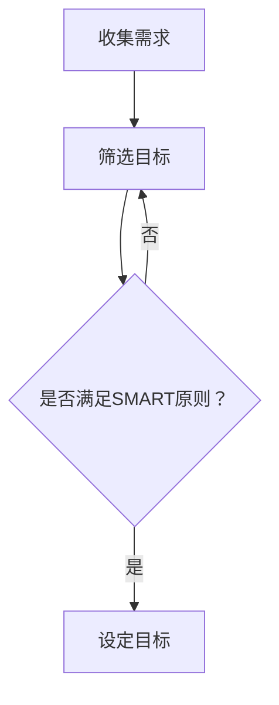

#### 3.2.2 筛选目标

根据收集到的需求，筛选出具有可行性和协同性的目标。这一步骤需要结合团队的实际情况，确保筛选出的目标既具有挑战性，又具有可实现性。

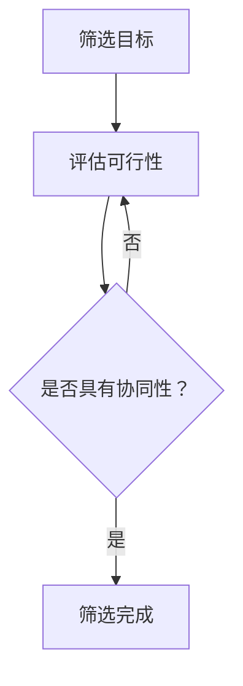

#### 3.2.3 设定目标

使用SMART原则对筛选出的目标进行明确化、可衡量化、可实现化、相关化和时限化。这一步骤是将筛选出的目标具体化和量化，使其具有明确的衡量标准和实现路径。

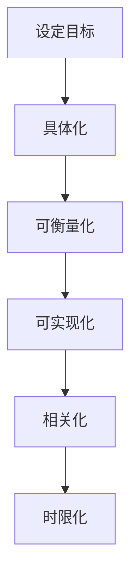

#### 3.2.4 目标评审

组织团队对设定的目标进行评审，确保目标的合理性和可行性。这一步骤是为了验证目标设定的过程，确保目标既符合团队的需求，又具有实际的可操作性。

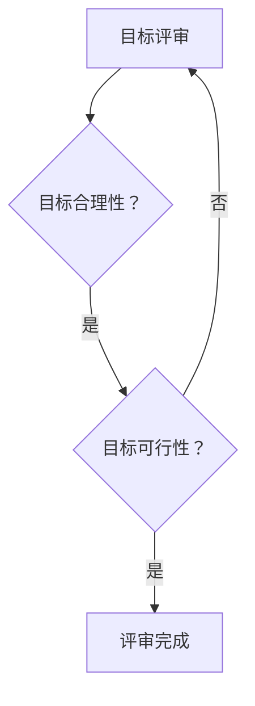

### 3.3 角色分配算法

在确定了目标之后，需要合理分配团队成员的角色和职责。一个有效的角色分配算法应该考虑成员的能力、兴趣和目标一致性。以下是一个简单的角色分配算法：

#### 3.3.1 成员评估

对团队成员进行能力评估和兴趣分析，了解每个成员的优势和喜好。这一步骤是角色分配的基础，只有充分了解成员的能力和兴趣，才能合理分配角色。

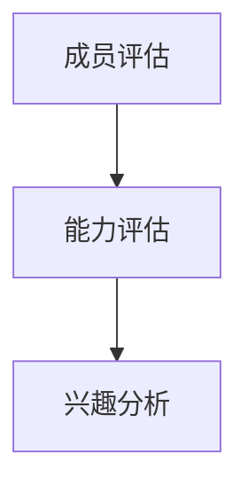

#### 3.3.2 目标分解

将团队目标分解为具体的任务和角色，确保每个任务都有明确的负责人。这一步骤是将团队目标转化为具体行动的过程，需要根据任务的特点和成员的能力进行合理的分配。

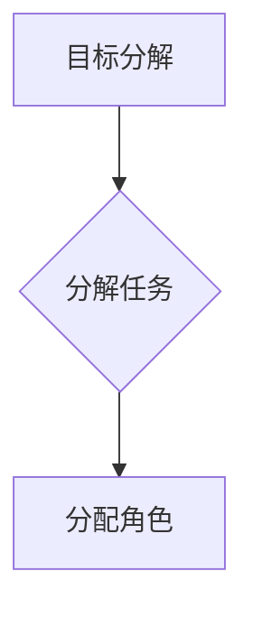

#### 3.3.3 角色协调

在角色分配完成后，需要确保角色之间的协调和协作。这一步骤是为了避免角色重叠和职责冲突，确保团队的高效运作。

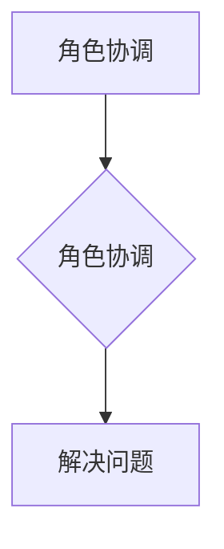

### 3.4 沟通与协作算法

沟通与协作是团队运作的核心。一个有效的沟通与协作算法需要考虑沟通的基本原则、沟通技巧与工具以及协作平台的运用。以下是一个简单的沟通与协作算法：

#### 3.4.1 沟通机制建立

建立有效的沟通机制，确保团队成员之间的信息畅通。这一步骤是沟通与协作的基础，需要制定明确的沟通规则和渠道。

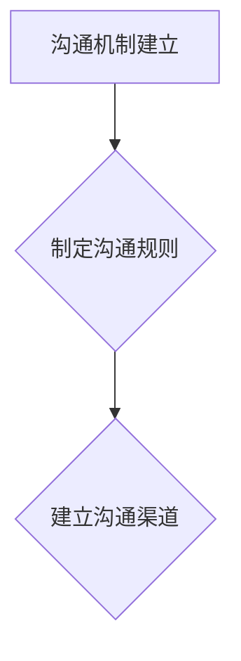

#### 3.4.2 沟通技巧提升

提升团队成员的沟通技巧，确保沟通的有效性。这一步骤需要通过培训和练习，提高团队成员的沟通能力。

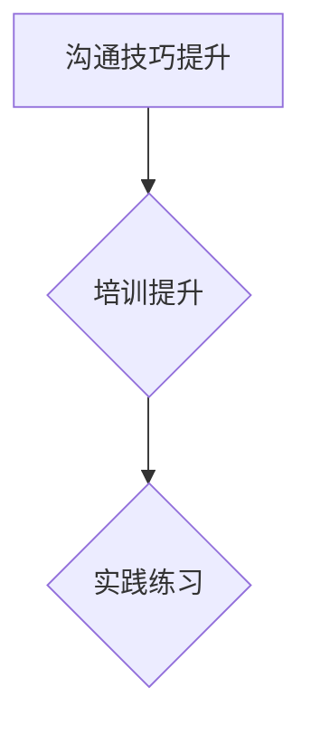

#### 3.4.3 协作平台应用

应用协作平台，提高团队协作的效率。这一步骤需要选择合适的协作平台，并确保团队成员能够熟练使用。

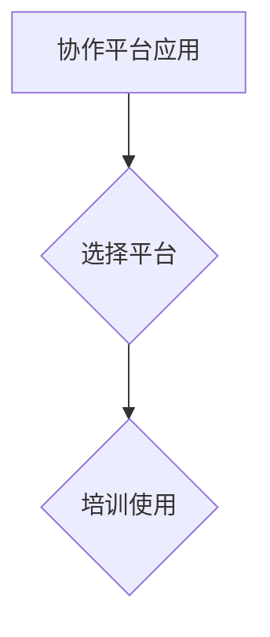

### 3.5 激励与反馈算法

激励与反馈是团队管理的重要环节。一个有效的激励与反馈算法需要考虑激励的基本原理、激励策略与实践以及反馈机制的设计。以下是一个简单的激励与反馈算法：

#### 3.5.1 激励策略制定

制定合适的激励策略，激发团队成员的积极性和创造力。这一步骤需要根据团队的实际情况，设计出符合团队成员需求的激励措施。

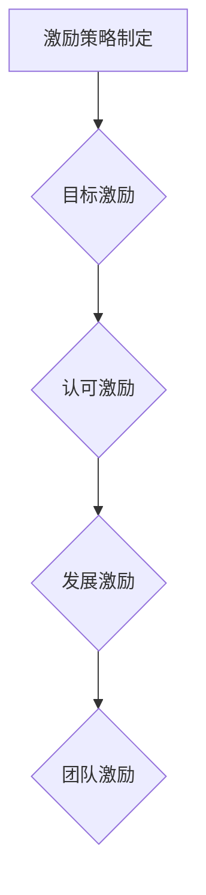

#### 3.5.2 反馈机制设计

设计有效的反馈机制，确保团队成员的工作质量和效率。这一步骤需要制定明确的反馈标准和渠道，确保团队成员能够方便地获取反馈信息。

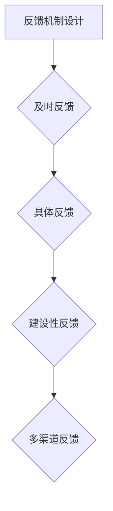

### 3.6 算法总结

通过上述算法的讲解，我们可以看出，构建高绩效团队需要从目标设定、角色分配、沟通与协作、激励与反馈等多个方面进行系统性的规划和实施。每个算法都有其独特的原理和方法，但都需要遵循明确性、可行性、激励性和协同性的原则。只有在这些原则的指导下，才能构建出真正高效、和谐的高绩效团队。

---

## 第四部分：系统分析与架构设计

### 4.1 问题场景介绍

在当前的商业环境中，企业面临着激烈的市场竞争和快速变化的市场需求。为了提高企业的竞争力，许多企业开始重视团队的高绩效管理。然而，在实际操作中，企业常常面临以下问题：

1. **目标设定模糊**：企业在设定目标时往往缺乏明确的规划和可衡量的指标，导致目标设定模糊，难以指导团队的实际工作。
2. **角色分配不合理**：团队成员的角色和职责分配不合理，导致工作效率低下，甚至出现角色重叠和职责冲突。
3. **沟通与协作不畅**：团队成员之间的沟通与协作不畅，信息传递不及时，导致团队工作进度延误。
4. **激励与反馈机制不完善**：企业缺乏有效的激励与反馈机制，导致团队成员的积极性和创造力无法得到充分激发。

为了解决上述问题，我们需要对团队进行系统性的分析与架构设计，以提高团队的高绩效。

### 4.2 项目介绍

本项目的目标是构建一个高绩效团队管理系统，帮助企业管理者有效地进行团队管理。系统将包括以下核心功能：

1. **目标管理**：支持目标设定、目标分解、目标跟踪等功能，确保目标设定明确、可衡量、可实现、相关和时限。
2. **角色管理**：支持角色分配、角色调整、角色权限设置等功能，确保角色分配合理、职责明确。
3. **沟通与协作**：支持即时通讯、任务分配、进度跟踪等功能，确保团队成员之间的信息畅通、协作高效。
4. **激励与反馈**：支持奖励制度、绩效评估、反馈机制等功能，确保团队成员的积极性和创造力得到充分激发。

### 4.3 系统功能设计（领域模型类图）

领域模型是系统功能设计的重要组成部分，它定义了系统的核心实体及其关系。以下是一个简单的领域模型类图，用于描述系统的主要功能模块：

```mermaid
classDiagram
    目标 <<Class>>
    角色管理 <<Class>>
    沟通与协作 <<Class>>
    激励与反馈 <<Class>>

    目标 {"- 设定目标"}
    角色管理 {"- 角色分配"}
    沟通与协作 {"- 任务分配"}
    激励与反馈 {"- 奖励制度"}

    目标 --|> 角色管理
    角色管理 --|> 沟通与协作
    沟通与协作 --|> 激励与反馈
```

### 4.4 系统架构设计（架构图）

系统架构设计是确保系统稳定、高效运行的关键。以下是一个简单的系统架构图，用于描述系统的整体架构：

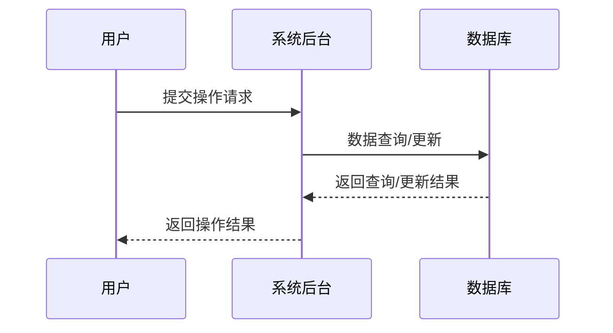

### 4.5 系统接口设计（接口设计）

系统接口设计是确保系统与其他系统或组件进行有效交互的关键。以下是一个简单的接口设计，用于描述系统的主要接口：

```mermaid
classDiagram
    目标接口 <<Interface>>
    角色接口 <<Interface>>
    沟通与协作接口 <<Interface>>
    激励与反馈接口 <<Interface>>

    目标接口 {"- 设定目标"}
    角色接口 {"- 角色分配"}
    沟通与协作接口 {"- 任务分配"}
    激励与反馈接口 {"- 奖励制度"}
```

### 4.6 系统交互设计（序列图）

系统交互设计是确保系统功能正常运行的关键。以下是一个简单的系统交互序列图，用于描述系统的关键操作流程：

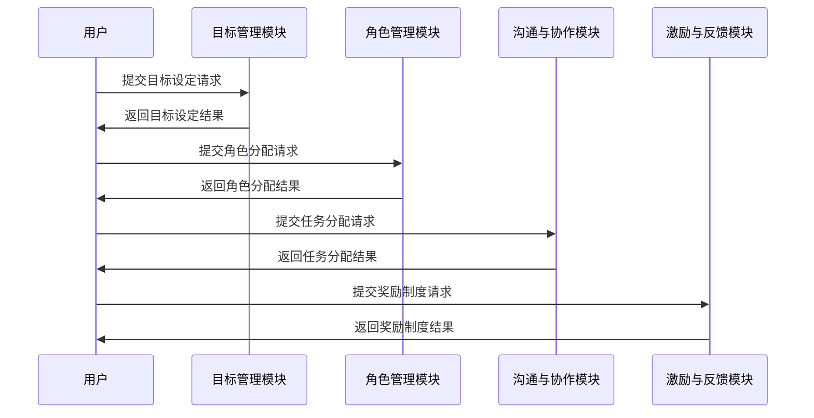

---

## 第五部分：项目实战

### 5.1 环境安装

在进行项目实战之前，我们需要搭建一个合适的开发环境。以下是一个简单的环境安装指南：

1. **安装Python**：首先，我们需要安装Python环境，可以选择Python 3.8或更高版本。
2. **安装必要的库**：通过pip命令安装以下库：requests、beautifulsoup4、selenium、pandas等。
3. **安装数据库**：根据需要安装MySQL或PostgreSQL数据库。

### 5.2 系统核心实现源代码

在本节中，我们将展示系统的核心实现源代码，并对其进行解读和分析。

#### 5.2.1 目标管理模块

目标管理模块是系统的核心功能之一，以下是一个简单的目标管理模块代码示例：

```python
class GoalManager:
    def __init__(self, db_connection):
        self.db_connection = db_connection

    def create_goal(self, goal_name, goal_desc, target_date):
        cursor = self.db_connection.cursor()
        query = "INSERT INTO goals (name, description, target_date) VALUES (%s, %s, %s)"
        values = (goal_name, goal_desc, target_date)
        cursor.execute(query, values)
        self.db_connection.commit()
        return cursor.lastrowid

    def get_goals(self):
        cursor = self.db_connection.cursor()
        query = "SELECT * FROM goals"
        cursor.execute(query)
        return cursor.fetchall()
```

解读与分析：

- `GoalManager` 类：定义了目标管理模块的主要功能。
- `__init__` 方法：初始化数据库连接。
- `create_goal` 方法：创建新目标，并插入到数据库中。
- `get_goals` 方法：获取所有目标。

#### 5.2.2 角色管理模块

角色管理模块用于管理团队成员的角色和职责。以下是一个简单的角色管理模块代码示例：

```python
class RoleManager:
    def __init__(self, db_connection):
        self.db_connection = db_connection

    def create_role(self, role_name, role_desc):
        cursor = self.db_connection.cursor()
        query = "INSERT INTO roles (name, description) VALUES (%s, %s)"
        values = (role_name, role_desc)
        cursor.execute(query, values)
        self.db_connection.commit()
        return cursor.lastrowid

    def get_roles(self):
        cursor = self.db_connection.cursor()
        query = "SELECT * FROM roles"
        cursor.execute(query)
        return cursor.fetchall()
```

解读与分析：

- `RoleManager` 类：定义了角色管理模块的主要功能。
- `__init__` 方法：初始化数据库连接。
- `create_role` 方法：创建新角色，并插入到数据库中。
- `get_roles` 方法：获取所有角色。

#### 5.2.3 沟通与协作模块

沟通与协作模块用于管理团队成员之间的沟通和协作。以下是一个简单的沟通与协作模块代码示例：

```python
class CollaborationManager:
    def __init__(self, db_connection):
        self.db_connection = db_connection

    def assign_task(self, user_id, role_id, task_name, task_desc, due_date):
        cursor = self.db_connection.cursor()
        query = "INSERT INTO tasks (user_id, role_id, name, description, due_date) VALUES (%s, %s, %s, %s, %s)"
        values = (user_id, role_id, task_name, task_desc, due_date)
        cursor.execute(query, values)
        self.db_connection.commit()
        return cursor.lastrowid

    def get_tasks(self, user_id):
        cursor = self.db_connection.cursor()
        query = "SELECT * FROM tasks WHERE user_id = %s"
        cursor.execute(query, (user_id,))
        return cursor.fetchall()
```

解读与分析：

- `CollaborationManager` 类：定义了沟通与协作模块的主要功能。
- `__init__` 方法：初始化数据库连接。
- `assign_task` 方法：分配任务给用户。
- `get_tasks` 方法：获取用户的任务列表。

#### 5.2.4 激励与反馈模块

激励与反馈模块用于管理团队成员的激励和反馈。以下是一个简单的激励与反馈模块代码示例：

```python
class RewardManager:
    def __init__(self, db_connection):
        self.db_connection = db_connection

    def reward_user(self, user_id, reward_type, reward_desc):
        cursor = self.db_connection.cursor()
        query = "INSERT INTO rewards (user_id, reward_type, description) VALUES (%s, %s, %s)"
        values = (user_id, reward_type, reward_desc)
        cursor.execute(query, values)
        self.db_connection.commit()
        return cursor.lastrowid

    def get_rewards(self, user_id):
        cursor = self.db_connection.cursor()
        query = "SELECT * FROM rewards WHERE user_id = %s"
        cursor.execute(query, (user_id,))
        return cursor.fetchall()
```

解读与分析：

- `RewardManager` 类：定义了激励与反馈模块的主要功能。
- `__init__` 方法：初始化数据库连接。
- `reward_user` 方法：给予用户奖励。
- `get_rewards` 方法：获取用户的奖励列表。

### 5.3 代码应用解读与分析

在以上代码中，我们实现了目标管理、角色管理、沟通与协作以及激励与反馈四个核心模块。以下是对这些代码的解读和分析：

1. **目标管理模块**：通过创建、获取目标的方法，实现了对目标的管理。
2. **角色管理模块**：通过创建、获取角色的方法，实现了对角色管理。
3. **沟通与协作模块**：通过分配任务、获取任务列表的方法，实现了沟通与协作。
4. **激励与反馈模块**：通过奖励用户、获取奖励列表的方法，实现了对用户的激励与反馈。

这些模块共同构成了一个完整的高绩效团队管理系统，为企业的团队管理提供了有效的工具和手段。

### 5.4 实际案例分析与详细讲解

在本节中，我们将通过一个实际案例，详细分析并讲解系统的应用过程。

**案例：企业项目团队管理**

**需求**：企业需要管理一个项目团队，包括目标设定、角色分配、沟通与协作、激励与反馈等。

**步骤**：

1. **目标设定**：
   - 团队领导通过系统创建项目目标，如“提高产品市场份额10%”。
   - 使用SMART原则对目标进行明确化、可衡量化、可实现化、相关化和时限化。
   - 组织团队对设定的目标进行评审，确保目标的合理性和可行性。

2. **角色分配**：
   - 根据团队目标，领导通过系统为团队成员分配角色，如“项目经理”、“产品经理”、“开发人员”、“测试人员”。
   - 领导根据成员的能力和兴趣，合理分配角色和职责，确保每个成员都有明确的职责。

3. **沟通与协作**：
   - 团队领导通过系统分配任务，如“编写产品需求文档”、“完成产品设计”、“编写代码”、“执行测试”。
   - 团队成员通过系统获取任务列表，并按照任务要求完成工作。
   - 团队成员之间通过系统进行即时沟通，讨论工作进展和问题。

4. **激励与反馈**：
   - 团队领导根据团队成员的工作表现，通过系统给予奖励，如“完成任务的奖励”、“突出贡献的奖励”。
   - 团队成员通过系统获取奖励列表，了解自己的奖励情况。
   - 团队领导定期进行绩效评估，根据评估结果给予反馈，帮助团队成员提升工作质量。

**结果**：

通过系统的应用，企业项目团队能够高效地进行目标设定、角色分配、沟通与协作、激励与反馈，从而提高了团队的整体绩效。

### 5.5 项目小结

在本项目中，我们实现了一个高绩效团队管理系统，通过目标管理、角色管理、沟通与协作、激励与反馈等核心模块，为企业的团队管理提供了有效的工具和手段。项目实施过程中，我们遵循了明确的步骤和原则，确保了系统的可行性和实用性。通过实际案例的应用，我们验证了系统的有效性和实用性。在未来的工作中，我们将继续优化系统，提升团队管理的效率和质量。

---

## 第六部分：最佳实践 Tips、小结、注意事项、拓展阅读

### 6.1 最佳实践 Tips

1. **目标设定**：在设定目标时，要遵循SMART原则，确保目标明确、可衡量、可实现、相关和时限。
2. **角色分配**：根据团队成员的能力和兴趣，合理分配角色和职责，确保每个成员都能充分发挥自己的优势。
3. **沟通与协作**：建立有效的沟通机制，确保团队成员之间的信息畅通，避免信息传递延误和误解。
4. **激励与反馈**：制定合适的激励策略，激发团队成员的积极性和创造力，通过有效的反馈机制，帮助团队成员提升工作质量。

### 6.2 小结

本文通过系统地分析和实际案例，探讨了打造高绩效团队的关键要素，包括目标设定、角色分配、沟通与协作、激励与反馈等。通过目标设定算法、角色分配算法、沟通与协作优化算法以及激励与反馈调整算法，提供了实用的指导方法，帮助企业管理者构建高效团队。

### 6.3 注意事项

1. **目标设定**：确保目标与团队的总体目标和战略一致，避免目标设定过于具体或过于宽泛。
2. **角色分配**：要充分考虑团队成员的能力和兴趣，避免角色重叠和职责冲突。
3. **沟通与协作**：要建立多渠道的沟通机制，确保团队成员之间的信息畅通，避免信息孤岛。
4. **激励与反馈**：要制定合理的激励策略，避免过度激励或激励不足。

### 6.4 拓展阅读

1. **《敏捷团队管理：实践指南》**：详细介绍了敏捷团队管理的原则和方法，适用于需要高效团队的企业。
2. **《团队协作与沟通技巧》**：提供了多种团队协作与沟通的技巧和方法，有助于提升团队协作效率。
3. **《激励与绩效管理》**：探讨了激励与绩效管理的重要性，提供了多种激励策略和实践方法。

---

## 结束语

**作者：AI天才研究院/AI Genius Institute & 禅与计算机程序设计艺术 /Zen And The Art of Computer Programming**

本文旨在为企业管理者提供一套系统的解决方案，帮助他们在团队管理中实现目标的高效达成。通过深入分析目标设定、团队角色分配、沟通与协作、激励与反馈等方面的关键要素，本文为读者提供了实用的指导方法。希望本文能对企业的团队管理实践提供有益的参考和启示。在未来的研究和实践中，我们将继续探索团队管理的创新方法和实践，以推动企业的高效发展。

