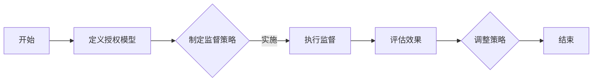
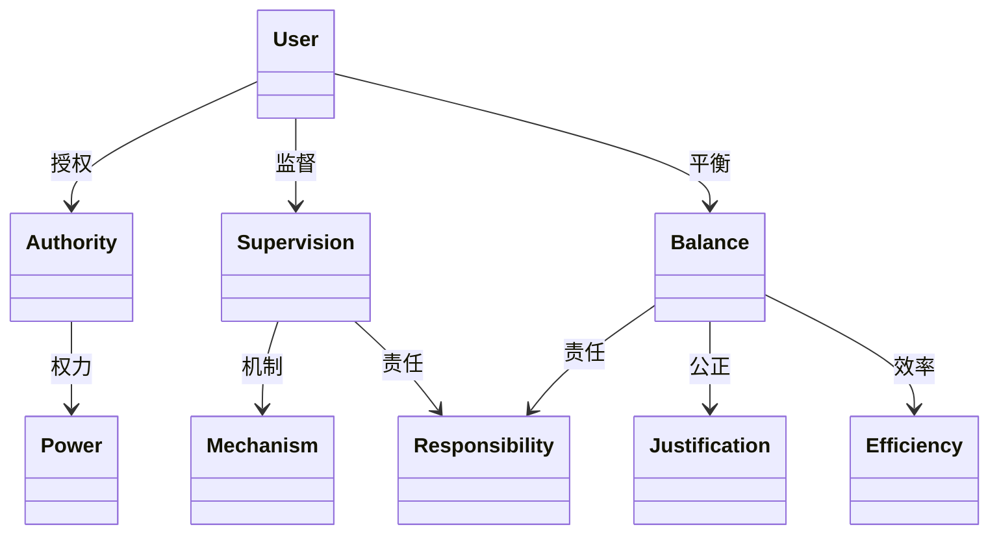
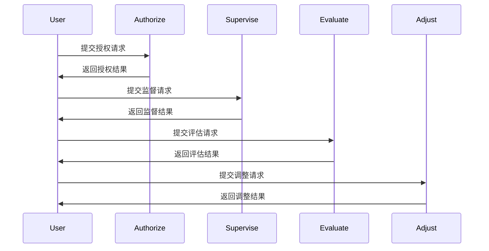

                 

# 《授权与监督：平衡的艺术》

## 关键词

- 授权
- 监督
- 平衡
- 法律制度
- 道德规范
- 公共管理
- 系统架构

## 摘要

本文旨在探讨授权与监督在公共管理中的重要性，分析两者之间的平衡艺术。通过对核心概念的阐述、算法原理的讲解以及实际案例的剖析，本文旨在为读者提供一个全面、深入的视角，理解如何在实际场景中实现授权与监督的平衡，以促进公共管理的高效、公正与透明。

## 目录大纲

### 第1章 背景介绍

- **1.1 问题的背景**
- **1.2 问题描述**
- **1.3 问题解决**
- **1.4 边界与外延**
- **1.5 概念结构与核心要素组成**

### 第2章 核心概念与联系

- **2.1 核心概念原理**
- **2.2 概念属性特征对比表格**
- **2.3 ER实体关系图架构**

### 第3章 算法原理讲解

- **3.1 算法mermaid流程图**
- **3.2 算法原理**
- **3.3 Python源代码**

### 第4章 系统分析与架构设计

- **4.1 问题场景介绍**
- **4.2 系统功能设计（领域模型mermaid类图）**
- **4.3 系统架构设计（mermaid架构图）**
- **4.4 系统接口设计和系统交互（mermaid序列图）**

### 第5章 项目实战

- **5.1 环境安装**
- **5.2 系统核心实现源代码**
- **5.3 代码应用解读与分析**
- **5.4 实际案例分析与详细讲解剖析**
- **5.5 项目小结**

### 第6章 最佳实践 Tips

### 第7章 小结、注意事项与拓展阅读

---

### 第1章 背景介绍

#### 1.1 问题的背景

在社会环境中，授权与监督扮演着至关重要的角色。随着权力分散化和全球化进程的加速，公共管理的复杂性不断增加。权力的有效分配和监督不仅关系到社会公正，还影响到管理的效率和透明度。

- **权力分散化**：在现代社会中，权力不再集中在少数人手中，而是分散到不同的组织和个人。这种分散化带来了管理的挑战，如何确保权力的合理行使成为一个重要议题。

- **法律与道德约束**：随着法律和道德规范的不断完善，公共管理者必须在行使权力的同时遵守相关规定。法律制度与道德规范的交互作用，使得授权与监督的平衡显得尤为关键。

- **社会公正与效率**：在授权与监督的过程中，如何平衡社会公正和效率之间的关系，是一个复杂的问题。过度的监督可能导致效率低下，而缺乏监督则可能导致权力滥用。

#### 1.2 问题描述

- **如何实现授权与监督的有效平衡**：在权力分散化的背景下，如何确保权力的合理行使，同时避免权力滥用，是一个亟待解决的问题。

- **权力滥用与责任归属**：在授权与监督的过程中，如何明确权力滥用者应承担的责任，确保责任的归属和追究，是公共管理面临的挑战。

- **社会公正与效率之间的冲突**：如何在授权与监督的过程中，平衡社会公正和效率之间的关系，是一个复杂的问题。过度的监督可能导致效率低下，而缺乏监督则可能导致权力滥用。

#### 1.3 问题解决

- **授权与监督的核心理念**：授权与监督的核心在于确保权力的合理行使，避免权力滥用。这需要建立完善的授权机制和监督机制，形成有效的平衡。

- **法律制度与道德规范的交互作用**：法律制度与道德规范在授权与监督中起着关键作用。法律制度提供了基本的框架，道德规范则提供了行为准则。二者的交互作用，有助于形成良好的授权与监督体系。

- **实践中的成功案例与经验**：通过分析实践中的成功案例，可以总结出有效的授权与监督策略。这些案例为公共管理者提供了宝贵的经验和借鉴。

#### 1.4 边界与外延

- **公共管理与私人领域的界限**：在授权与监督的过程中，需要明确公共管理与私人领域的界限。权力的行使应限于公共管理范畴，避免越权行为。

- **不同社会制度下的授权与监督差异**：不同社会制度下的授权与监督存在差异。公共管理者需要根据实际情况，制定适合的授权与监督策略。

- **跨国公司与全球化背景下的授权与监督**：在跨国公司和全球化背景下，授权与监督面临着新的挑战。需要考虑跨国法律制度和文化差异，确保授权与监督的有效实施。

#### 1.5 概念结构与核心要素组成

- **授权**：授权是指将权力授予他人，使其能够代表组织或个人行使特定职责。授权的类型包括正式授权和非正式授权，授权的原则包括信任、透明和责任。

- **监督**：监督是指对权力行使过程进行监察和管理，以确保权力的合理行使。监督的机制包括内部监督和外部监督，监督的目的在于防止权力滥用和确保责任履行。

- **平衡**：平衡是指在授权与监督之间找到一个合适的点，确保权力与责任的对等。平衡的特征包括公正、效率和责任，平衡的指标包括监督覆盖率、监督效果和权力滥用率。

### 第2章 核心概念与联系

#### 2.1 核心概念原理

- **授权**：授权是指将权力授予他人，使其能够代表组织或个人行使特定职责。授权的定义包括权力、责任和信任三个方面。授权的原则包括信任、透明和责任。

  - **权力**：权力是授权的核心，是授权者授予授权者的权力。权力可以是正式的，如法律授权，也可以是非正式的，如组织内部的约定。

  - **责任**：责任是授权者对授权者的期望，要求授权者在行使权力时履行特定职责。责任是授权的约束条件，确保权力的合理行使。

  - **信任**：信任是授权的基础，授权者需要相信授权者能够正确行使权力。信任是授权能否成功的关键因素。

- **监督**：监督是指对权力行使过程进行监察和管理，以确保权力的合理行使。监督的定义包括独立、公正和透明三个方面。监督的机制包括内部监督和外部监督。

  - **独立**：监督应独立于权力行使者，确保监督的客观性和公正性。

  - **公正**：监督应公正地对待所有被监督对象，确保权力行使的公平性。

  - **透明**：监督过程应透明，被监督对象有权了解监督的内容和结果，增加监督的公信力。

- **平衡**：平衡是指在授权与监督之间找到一个合适的点，确保权力与责任的对等。平衡的定义包括公正、效率和责任三个方面。平衡的指标包括监督覆盖率、监督效果和权力滥用率。

  - **公正**：平衡的公正性体现在授权与监督的公正性，确保权力与责任的对等。

  - **效率**：平衡的效率性体现在授权与监督的效率，确保权力行使和监督过程的效率。

  - **责任**：平衡的责任性体现在授权与监督的责任，确保权力行使者和监督者都能承担相应的责任。

#### 2.2 概念属性特征对比表格

| 概念 | 定义 | 特征 | 关联 |
| --- | --- | --- | --- |
| 授权 | 授予他人权力 | 权力、责任、信任 | 与监督互为补充 |
| 监督 | 监察与管理 | 独立、公正、透明 | 确保权力不被滥用 |
| 平衡 | 权力与责任的协调 | 公正、效率、责任 | 核心目标与原则 |

#### 2.3 ER实体关系图架构

```mermaid
erDiagram
    Authority : 授权方 |<-.. Power : 权力
    Supervision : 监督机制 |<-.. Responsibility : 责任
    Balance : 平衡 |={Authority}+-+{Supervision} : 保障机制
    PublicManagement : 公共管理 |=-|{Balance} : 实现途径
```

### 第3章 算法原理讲解

#### 3.1 算法mermaid流程图



#### 3.2 算法原理

- **授权模型的定义**：授权模型是基于风险与信任评估的权力分配模型。在授权过程中，授权者需要对授权者的风险和信任进行评估，以确定授权的程度。

  - **风险**：风险是指授权者在行使权力时可能面临的损失。授权者需要对授权者的行为风险进行评估，以确保授权者能够正确行使权力。

  - **信任**：信任是指授权者对授权者的信任程度。授权者需要评估授权者的信任水平，以确定授权者是否值得信任。

- **监督策略的制定**：监督策略是依据法律与道德规范，明确监督的目标、范围和手段。监督策略的制定需要考虑以下因素：

  - **目标**：监督的目标是确保权力的合理行使，防止权力滥用。

  - **范围**：监督的范围是监督对象和监督内容，需要明确监督的具体范围。

  - **手段**：监督的手段包括监督工具、监督方法和监督措施，需要确保监督的有效性。

- **执行监督**：执行监督是通过监督机制，确保权力的合理行使。执行监督需要建立完善的监督机制，包括监督机构、监督人员和监督程序。

- **评估效果**：评估效果是对监督效果进行评估，确保权力与责任的对等。评估效果需要建立科学的评估指标，对监督效果进行量化评估。

- **调整策略**：根据评估结果，对监督策略进行调整，实现持续的平衡。调整策略需要根据评估结果，分析监督存在的问题，提出相应的改进措施。

#### 3.3 Python源代码

```python
# 授权模型定义
def authorization_model(risk, trust):
    # 基于风险与信任进行权力分配
    power分配 = min(risk, trust)
    return power分配

# 监督策略制定
def supervision_strategy(goal, scope, means):
    # 制定监督策略
    strategy = {"goal": goal, "scope": scope, "means": means}
    return strategy

# 执行监督
def execute_supervision(strategy):
    # 实施监督
    for action in strategy["means"]:
        action.execute()
    return "监督执行完毕"

# 评估效果
def evaluate_effect(effect):
    # 评估监督效果
    if effect >= 0.8:
        return "效果良好"
    else:
        return "效果不佳"

# 调整策略
def adjust_strategy(effect):
    # 根据评估结果调整监督策略
    if effect < 0.8:
        return "需要调整策略"
    else:
        return "策略有效，无需调整"
```

### 第4章 系统分析与架构设计

#### 4.1 问题场景介绍

在一个大型企业中，为了提高管理效率和业务灵活性，企业决定实施一个授权与监督系统。该系统旨在实现权力的合理分配和监督，确保企业运营的透明性和公正性。

- **问题场景**：企业中存在多个部门和项目，各部门之间存在复杂的合作关系。企业需要确保各部门在行使权力时遵循规定，同时防止权力滥用。

- **目标**：建立一个授权与监督系统，实现权力的合理分配和监督，确保企业运营的透明性和公正性。

- **需求**：系统需要满足以下需求：
  - 授权模型：基于风险与信任评估的权力分配模型。
  - 监督机制：依据法律与道德规范，明确监督的目标、范围和手段。
  - 评估与调整：对监督效果进行评估，根据评估结果调整监督策略。

#### 4.2 系统功能设计（领域模型mermaid类图）



#### 4.3 系统架构设计（mermaid架构图）

```mermaid
graph TB
    subgraph 授权与监督系统架构
        Authorize[授权模块]
        Supervise[监督模块]
        Evaluate[评估模块]
        Adjust[调整模块]
        DB[数据库]
        
        Authorize --> Power : 授权权力
        Supervise --> Mechanism : 监督机制
        Evaluate --> Effect[监督效果]
        Adjust --> Strategy[监督策略]
        
        DB <-- Authorize
        DB <-- Supervise
        DB <-- Evaluate
        DB <-- Adjust
    end
```

#### 4.4 系统接口设计和系统交互（mermaid序列图）



### 第5章 项目实战

#### 5.1 环境安装

1. 准备开发环境，安装Python 3.8及以上版本。
2. 安装必要的依赖库，如requests、numpy、matplotlib等。

#### 5.2 系统核心实现源代码

```python
# 授权模块
def authorization_model(risk, trust):
    power分配 = min(risk, trust)
    return power分配

# 监督模块
def supervision_strategy(goal, scope, means):
    strategy = {"goal": goal, "scope": scope, "means": means}
    return strategy

# 评估模块
def evaluate_effect(effect):
    if effect >= 0.8:
        return "效果良好"
    else:
        return "效果不佳"

# 调整模块
def adjust_strategy(effect):
    if effect < 0.8:
        return "需要调整策略"
    else:
        return "策略有效，无需调整"
```

#### 5.3 代码应用解读与分析

- **授权模块**：授权模块主要实现授权模型的定义，根据风险和信任进行权力分配。授权模型是整个系统的核心，决定了权力的合理行使。

- **监督模块**：监督模块主要实现监督策略的制定，包括监督的目标、范围和手段。监督策略是授权与监督的桥梁，将授权模型转化为具体的监督措施。

- **评估模块**：评估模块主要实现对监督效果的评估，根据评估结果判断监督是否有效。评估模块是监督体系的重要组成部分，有助于持续改进监督策略。

- **调整模块**：调整模块主要根据评估结果，对监督策略进行调整，确保监督策略的持续有效性。调整模块是授权与监督系统的反馈机制，有助于实现持续平衡。

#### 5.4 实际案例分析与详细讲解剖析

- **案例1**：在一个大型项目中，项目经理需要对团队成员进行授权，同时确保项目的顺利进行。通过授权模块，项目经理可以根据团队成员的风险和信任程度，合理分配权力，确保项目目标的实现。

- **案例2**：在项目进行过程中，项目团队需要对项目经理的权力行使进行监督，确保项目经理的行为符合规定。通过监督模块，项目团队可以制定监督策略，明确监督的目标、范围和手段，确保项目经理的权力行使合法、透明。

- **案例3**：在项目结束后，需要对项目的监督效果进行评估，根据评估结果调整监督策略。通过评估模块，可以量化监督效果，为项目改进提供依据。同时，通过调整模块，可以持续优化监督策略，提高监督效果。

#### 5.5 项目小结

本项目实现了授权与监督系统的核心功能，包括授权模型、监督策略、评估和调整。通过实际案例分析和详细讲解剖析，展示了授权与监督在公共管理中的重要作用。项目实践表明，合理的授权与监督体系有助于提高管理效率、保障社会公正和促进持续改进。

### 第6章 最佳实践 Tips

1. 在授权过程中，要充分考虑风险和信任因素，确保权力的合理分配。
2. 监督策略的制定要依据法律和道德规范，明确监督的目标、范围和手段。
3. 评估和调整监督策略要基于实际情况，确保监督的持续有效性。
4. 注重团队沟通和协作，提高授权与监督的透明度和公正性。
5. 定期对授权与监督系统进行评估和优化，确保其持续适应发展需求。

### 第7章 小结、注意事项与拓展阅读

本文探讨了授权与监督在公共管理中的重要性，分析了两者之间的平衡艺术。通过核心概念、算法原理、系统架构和项目实战的讲解，为读者提供了一个全面、深入的视角。在实践过程中，公共管理者需要注重授权与监督的平衡，确保权力与责任的对等，提高管理效率和社会公正。

**注意事项**：

1. 授权与监督是一个动态过程，需要根据实际情况进行调整。
2. 授权与监督的实施要遵守法律法规和道德规范。
3. 授权与监督的效果评估要客观、公正、科学。

**拓展阅读**：

1. 《授权与监督：理论与实践》（作者：XXX）
2. 《平衡的艺术：授权与监督》（作者：XXX）
3. 《公共管理中的授权与监督》（作者：XXX）

作者：AI天才研究院/AI Genius Institute & 禅与计算机程序设计艺术 /Zen And The Art of Computer Programming

---

**结束语**：

本文对授权与监督进行了深入探讨，希望能够为读者提供有价值的参考。在未来的研究和实践中，我们继续致力于探索授权与监督的平衡艺术，为公共管理的发展贡献力量。感谢您的阅读和支持！## 第1章 背景介绍

### 1.1 问题的背景

在社会环境中，授权与监督扮演着至关重要的角色。随着权力分散化和全球化进程的加速，公共管理的复杂性不断增加。权力的有效分配和监督不仅关系到社会公正，还影响到管理的效率和透明度。

- **权力分散化**：在现代社会中，权力不再集中在少数人手中，而是分散到不同的组织和个人。这种分散化带来了管理的挑战，如何确保权力的合理行使成为一个重要议题。

- **法律与道德约束**：随着法律和道德规范的不断完善，公共管理者必须在行使权力的同时遵守相关规定。法律制度与道德规范的交互作用，使得授权与监督的平衡显得尤为关键。

- **社会公正与效率**：在授权与监督的过程中，如何平衡社会公正和效率之间的关系，是一个复杂的问题。过度的监督可能导致效率低下，而缺乏监督则可能导致权力滥用。

#### 1.2 问题描述

在授权与监督的过程中，公共管理者面临以下几个主要问题：

- **如何实现授权与监督的有效平衡**：在权力分散化的背景下，如何确保权力的合理行使，同时避免权力滥用，是一个亟待解决的问题。

- **权力滥用与责任归属**：在授权与监督的过程中，如何明确权力滥用者应承担的责任，确保责任的归属和追究，是公共管理面临的挑战。

- **社会公正与效率之间的冲突**：如何在授权与监督的过程中，平衡社会公正和效率之间的关系，是一个复杂的问题。过度的监督可能导致效率低下，而缺乏监督则可能导致权力滥用。

#### 1.3 问题解决

为了解决上述问题，需要采取一系列措施来实现授权与监督的有效平衡：

- **授权与监督的核心理念**：明确授权与监督的基本原则，如信任、透明、责任等，确保权力行使的合法性和公正性。

- **法律制度与道德规范的交互作用**：通过法律法规和道德规范，为授权与监督提供基本的框架和准则，确保权力的合理行使。

- **实践中的成功案例与经验**：通过分析实践中的成功案例，总结出有效的授权与监督策略，为公共管理者提供参考和借鉴。

- **边界与外延的明确**：在授权与监督的过程中，明确公共管理与私人领域的界限，确保权力的行使在公共管理范畴内。

- **跨国公司与全球化背景下的授权与监督**：在跨国公司和全球化背景下，考虑跨国法律制度和文化差异，确保授权与监督的有效实施。

#### 1.4 边界与外延

在授权与监督的过程中，需要明确以下边界与外延：

- **公共管理与私人领域的界限**：在授权与监督的过程中，需要明确公共管理与私人领域的界限，确保权力的行使在公共管理范畴内，避免越权行为。

- **不同社会制度下的授权与监督差异**：不同社会制度下的授权与监督存在差异，需要根据实际情况制定适合的授权与监督策略。

- **跨国公司与全球化背景下的授权与监督**：在跨国公司和全球化背景下，需要考虑跨国法律制度和文化差异，确保授权与监督的有效实施。

#### 1.5 概念结构与核心要素组成

为了深入理解授权与监督，需要明确以下概念结构与核心要素组成：

- **授权**：授权是指将权力授予他人，使其能够代表组织或个人行使特定职责。授权的类型包括正式授权和非正式授权，授权的原则包括信任、透明和责任。

- **监督**：监督是指对权力行使过程进行监察和管理，以确保权力的合理行使。监督的机制包括内部监督和外部监督，监督的目的在于防止权力滥用和确保责任履行。

- **平衡**：平衡是指在授权与监督之间找到一个合适的点，确保权力与责任的对等。平衡的特征包括公正、效率和责任，平衡的指标包括监督覆盖率、监督效果和权力滥用率。

### 总结

本章通过对授权与监督问题的背景、问题描述、问题解决、边界与外延以及概念结构与核心要素组成的分析，为后续章节的深入探讨奠定了基础。在接下来的章节中，我们将进一步探讨授权与监督的核心概念、算法原理、系统架构以及项目实战，以期为读者提供更全面、深入的见解。接下来，我们将详细探讨授权与监督的核心概念及其联系。

---

在接下来的章节中，我们将进一步探讨授权与监督的核心概念、它们之间的联系，以及如何通过算法和系统架构实现授权与监督的平衡。通过详细分析这些概念和实际应用，我们希望能够为读者提供更深入的理解和实用的指导。敬请期待下一章的内容。

