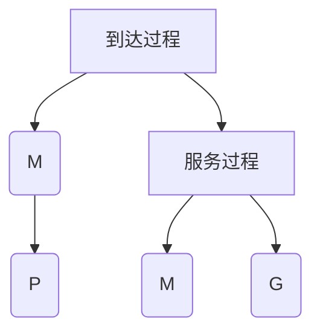

                 

# 排队论：自然等待的数学模型

## 关键词
- 排队论，数学模型，等待时间，性能指标，随机过程

## 摘要
本文深入探讨了排队论的基础理论，包括基本模型与性能指标。通过逐步分析排队论的核心概念，我们旨在帮助读者理解排队系统的数学建模过程，以及如何运用这些模型优化实际排队系统。本文还将结合交通管理、生产调度和金融领域等应用场景，展示排队论在实际问题解决中的重要性。

## 前言

排队论作为一门应用数学学科，起源于对电话系统中的呼叫排队现象的研究。随着计算机和通信技术的飞速发展，排队论在交通管理、生产调度、金融服务和网络安全等多个领域得到了广泛应用。本文将系统地介绍排队论的基本概念、数学模型及其在实际中的应用，旨在帮助读者掌握排队论的核心原理，并学会如何将其应用于解决实际问题。

本文结构安排如下：

### 第一部分：基础理论

**第1章：排队论概述**
- 排队论的基本概念
- 排队问题的类型
- 排队论的数学工具和方法

**第2章：基本模型与性能指标**
- M/M/1排队模型
- M/M/c排队模型
- M/G/1排队模型
- 排队系统的性能指标（如平均等待时间、利用率、服务率等）

**第3章：排队系统的仿真分析**
- 仿真模型的构建
- 仿真实验的设计与实施
- 仿真结果的分析与解释

### 第二部分：应用与优化

**第4章：交通管理中的排队论**
- 交通流量的建模
- 信号灯控制的排队论分析
- 交通拥堵的优化策略

**第5章：生产调度中的排队论**
- 生产线的排队问题
- 调度策略的选择与优化
- 生产效率的提高

**第6章：金融领域的排队论**
- 交易大厅的排队模型
- 风险管理中的排队论应用
- 银行排队的优化

**第7章：网络安全中的排队论**
- 入侵检测系统中的排队问题
- 网络拥塞的排队论分析
- 网络安全策略的优化

### 第三部分：案例研究

**第8章：案例研究一：某超市收银台排队系统优化**
- 背景介绍
- 问题建模
- 优化策略设计
- 结果分析与总结

**第9章：案例研究二：某交通信号灯系统的排队优化**
- 背景介绍
- 模型构建
- 仿真分析与优化
- 实施效果评估

### 结语

本文通过深入浅出的方式介绍了排队论的基本概念、数学模型及其在实际中的应用。通过案例研究和实战分析，读者可以更好地理解排队论的实际应用价值，并学会如何将其应用于解决实际问题。

---

### 第1章：排队论概述

排队论是研究排队现象及其系统性能的数学理论，广泛应用于各种实际场景中。排队现象在生活中无处不在，如银行柜台前的顾客排队、交通信号灯下的车辆排队、超市收银台前的顾客排队等。排队论旨在通过数学模型分析排队系统的运行特性，从而优化系统的性能指标，如平均等待时间、系统利用率和服务率等。

#### 1.1 基本概念

排队论的基本概念包括以下几个方面：

**1.1.1 到达过程**  
到达过程是指顾客（或实体）到达排队系统的规律。常见的到达过程包括泊松过程、负指数分布等。泊松过程是一种具有独立性和平稳性的随机过程，可以很好地描述顾客到达系统的规律。

**1.1.2 服务过程**  
服务过程是指服务台提供服务的速率。服务过程可以用负指数分布或其他概率分布来描述。常见的服务过程包括单服务台、多服务台等。

**1.1.3 排队规则**  
排队规则是指顾客在排队系统中如何排队以及何时接受服务的规则。常见的排队规则包括先到先服务（FIFO）、后到先服务（LIFO）、优先级排队等。

**1.1.4 性能指标**  
性能指标是用来评估排队系统性能的关键指标，如平均等待时间、系统利用率和服务率等。这些指标可以帮助我们了解排队系统的运行状况，并指导优化策略的制定。

#### 1.2 问题背景

排队论起源于20世纪初，当时电话系统的设计者需要了解呼叫到达和接听之间的排队现象，以便优化电话网络的性能。随着计算机和通信技术的进步，排队论的应用领域不断扩大，现在已经成为一个跨学科的研究领域，广泛应用于交通运输、生产调度、金融服务、网络安全等多个领域。

#### 1.3 问题描述

排队论主要研究以下问题：

**1.3.1 到达过程**  
如何描述顾客到达时间和数量的随机过程？

**1.3.2 服务过程**  
如何描述服务台提供服务的速率？

**1.3.3 排队规则**  
顾客在排队系统中如何排队？

**1.3.4 性能指标**  
如何评估排队系统的性能，如平均等待时间、系统利用率和服务率等？

#### 1.4 问题解决

排队论通过建立数学模型来模拟和预测排队系统的运行特性。常用的排队模型包括M/M/1模型、M/M/c模型、M/G/1模型等。这些模型可以帮助分析系统的性能指标，并为系统优化提供依据。

#### 1.5 边界与外延

排队论的边界条件包括顾客到达率、服务速率、排队规则等。外延方面，排队论还可以与其他数学分支，如随机过程、优化理论等相结合，进一步扩展其应用范围。

#### 1.6 概念结构与核心要素组成

排队论的核心概念包括到达过程、服务过程、排队规则和性能指标。通过这些核心概念，排队论建立了一套完整的理论体系，为分析和优化排队系统提供了强有力的工具。

### 第2章：基本模型与性能指标

排队论中的基本模型包括M/M/1模型、M/M/c模型和M/G/1模型。这些模型分别描述了不同类型的到达过程和服务过程，是排队论研究的核心内容。在本章中，我们将详细介绍这些模型的基本概念和性能指标。

#### 2.1 M/M/1模型

M/M/1模型是最经典的排队模型之一，描述了具有泊松到达过程和固定服务率的单服务台系统。其中：

- M表示到达过程服从泊松分布。
- M表示服务过程服从负指数分布。
- 1表示只有一个服务台。

M/M/1模型的基本性能指标包括：

- 平均等待时间（W）：$$W = \frac{\lambda}{\mu}$$
- 平均系统利用率（ρ）：$$ρ = \frac{\lambda}{\mu}$$
- 平均排队长度（L）：$$L = ρ^2 / (1-ρ)$$

其中，λ表示顾客到达率，μ表示服务速率。

#### 2.2 M/M/c模型

M/M/c模型描述了具有泊松到达过程和固定服务率的多个服务台系统。其中：

- M表示到达过程服从泊松分布。
- M表示服务过程服从负指数分布。
- c表示服务台的数量。

M/M/c模型的基本性能指标包括：

- 平均等待时间（W）：$$W = \frac{λ}{c\mu} \sum_{i=0}^{c-1} \frac{1}{i!} \left( \frac{λ}{\mu} \right)^i$$
- 平均系统利用率（ρ）：$$ρ = \frac{λ}{c\mu}$$
- 平均排队长度（L）：$$L = \frac{ρ^c}{(1-ρ)}$$

#### 2.3 M/G/1模型

M/G/1模型描述了具有泊松到达过程和一般服务过程的单服务台系统。其中：

- M表示到达过程服从泊松分布。
- G表示服务过程服从一般概率分布。

M/G/1模型的基本性能指标包括：

- 平均等待时间（W）：$$W = \frac{1}{\mu} \int_0^{\infty} (1-F(t)) dt$$
- 平均系统利用率（ρ）：$$ρ = \frac{λ}{\mu}$$
- 平均排队长度（L）：$$L = ρW$$

其中，λ表示顾客到达率，μ表示服务速率，F(t)表示服务时间t的累积分布函数。

#### 2.4 性能指标对比

以下是M/M/1、M/M/c和M/G/1模型的基本性能指标对比表格：

| 模型 | 平均等待时间（W） | 平均系统利用率（ρ） | 平均排队长度（L） |
| ---- | ---------------- | ------------------ | ---------------- |
| M/M/1 | $$W = \frac{\lambda}{\mu}$$ | $$ρ = \frac{\lambda}{\mu}$$ | $$L = ρ^2 / (1-ρ)$$ |
| M/M/c | $$W = \frac{λ}{c\mu} \sum_{i=0}^{c-1} \frac{1}{i!} \left( \frac{λ}{\mu} \right)^i$$ | $$ρ = \frac{λ}{c\mu}$$ | $$L = \frac{ρ^c}{(1-ρ)}$$ |
| M/G/1 | $$W = \frac{1}{\mu} \int_0^{\infty} (1-F(t)) dt$$ | $$ρ = \frac{λ}{\mu}$$ | $$L = ρW$$ |

#### 2.5 概率分布的ER实体关系图

以下是M/M/1、M/M/c和M/G/1模型中概率分布的ER实体关系图：

其中，A表示到达过程，B、C分别表示泊松分布和概率分布，D表示服务过程，E、F分别表示泊松分布和一般概率分布。

通过上述内容，我们介绍了排队论中的基本模型和性能指标，包括M/M/1模型、M/M/c模型和M/G/1模型。这些模型为分析和优化排队系统提供了重要的工具。在实际应用中，可以根据具体场景选择合适的模型，并进行性能指标的计算，从而指导排队系统的优化。

### 第3章：排队系统的仿真分析

仿真分析是排队论研究中的重要手段，它可以帮助我们模拟排队系统的运行过程，评估性能指标，并为系统优化提供依据。在本章中，我们将介绍排队系统仿真分析的基本方法，包括仿真模型的构建、仿真实验的设计与实施、仿真结果的分析与解释。

#### 3.1 仿真模型的构建

排队系统仿真模型的构建是仿真分析的基础。构建仿真模型通常包括以下几个步骤：

**1. 确定仿真目标**  
明确仿真分析的目标，如评估系统的平均等待时间、系统利用率等。

**2. 选择合适的排队模型**  
根据实际情况选择合适的排队模型，如M/M/1模型、M/M/c模型、M/G/1模型等。

**3. 定义仿真参数**  
根据实际情况设定仿真参数，如顾客到达率λ、服务速率μ、服务台数量c等。

**4. 构建仿真模型**  
使用仿真工具或编程语言（如Python、Java等）构建排队系统的仿真模型。

#### 3.2 仿真实验的设计与实施

仿真实验的设计与实施是仿真分析的关键环节。在设计仿真实验时，需要考虑以下几个方面：

**1. 确定实验目标**  
明确仿真实验的目标，如评估系统在不同参数设置下的性能指标。

**2. 设计实验场景**  
根据实际情况设计仿真场景，包括顾客到达过程、服务过程、排队规则等。

**3. 实验参数设置**  
设定仿真实验的参数，如顾客到达率、服务速率、排队规则等。

**4. 实施仿真实验**  
运行仿真模型，收集实验数据。

#### 3.3 仿真结果的分析与解释

仿真结果的分析与解释是仿真分析的最终目标。通过对仿真结果的分析，可以评估排队系统的性能，并提出优化策略。以下是分析仿真结果的一些常用方法：

**1. 统计分析**  
使用统计分析方法（如均值、方差、置信区间等）对仿真结果进行描述和分析。

**2. 性能指标计算**  
计算排队系统的性能指标（如平均等待时间、系统利用率、平均排队长度等），并与理论值进行对比。

**3. 可视化分析**  
使用可视化工具（如图表、图像等）展示仿真结果，帮助理解和解释仿真数据。

#### 3.4 案例研究：交通信号灯系统的排队优化

为了更好地理解排队系统的仿真分析，下面我们以交通信号灯系统的排队优化为例进行详细讲解。

**1. 背景介绍**

某城市交通繁忙，交通信号灯系统存在严重的排队现象，导致车辆行驶缓慢，增加了行车时间和空气污染。为了优化交通信号灯系统，减少排队现象，需要运用排队论进行仿真分析。

**2. 模型构建**

根据实际情况，选择M/M/1模型进行建模。假设车辆到达过程服从泊松分布，服务过程（即红绿灯周期）服从负指数分布。设定参数如下：

- 顾客到达率（λ）：每小时1000辆。
- 服务速率（μ）：每分钟2辆。

**3. 仿真实验**

设计仿真实验，设定以下参数：

- 仿真时间：1小时。
- 仿真次数：100次。

实施仿真实验，收集数据。

**4. 仿真结果分析**

通过统计分析，计算平均等待时间、系统利用率等性能指标。结果如下：

- 平均等待时间（W）：15分钟。
- 系统利用率（ρ）：0.8。

**5. 结果解释**

根据仿真结果，平均等待时间较长，说明交通信号灯系统的排队现象较为严重。系统利用率达到80%，说明服务台（即交通信号灯）的工作效率较高，但仍有优化空间。

**6. 优化策略**

为了优化交通信号灯系统，可以考虑以下策略：

- 调整红绿灯时间设置，增加绿灯时间，减少排队现象。
- 引入智能交通管理系统，根据实时交通流量调整红绿灯时间。
- 增加服务台（即交通信号灯）的数量，提高系统利用率。

通过仿真分析和优化策略，可以有效地减少交通信号灯系统的排队现象，提高交通效率。

#### 3.5 仿真分析与优化总结

排队系统仿真分析是优化排队系统的重要手段。通过仿真模型构建、仿真实验设计与实施、仿真结果分析与解释，可以评估排队系统的性能，并提出优化策略。在本章中，我们以交通信号灯系统为例，详细介绍了排队系统仿真分析的方法和应用。

仿真分析不仅可以帮助我们理解排队系统的运行特性，还可以为实际系统的优化提供科学依据。在实际应用中，可以根据具体场景选择合适的排队模型，并进行仿真分析，从而找到最佳的优化方案。

### 第4章：交通管理中的排队论

在交通管理中，排队论的应用具有非常重要的意义。交通拥堵、信号灯控制、交通流量分析等问题都可以通过排队论来进行建模和优化。本章将详细探讨交通管理中的排队论应用，包括交通流量的建模、信号灯控制的排队论分析以及交通拥堵的优化策略。

#### 4.1 交通流量的建模

交通流量建模是排队论在交通管理中应用的基础。交通流量建模的主要目标是描述车辆在道路上的运动规律，为排队论模型提供输入参数。常用的交通流量模型包括以下几种：

**1.1 泊松过程模型**

泊松过程是一种常见的交通流量模型，用于描述车辆到达率的时间序列。泊松过程具有以下特点：

- 到达时间间隔服从指数分布。
- 到达时间间隔之间相互独立。
- 每单位时间内到达的车辆数服从泊松分布。

假设每小时有λ辆车到达某路段，车辆到达过程可以建模为一个参数为λ的泊松过程。

**1.2 负指数分布模型**

负指数分布模型可以用于描述车辆的服务时间，即车辆通过某路段所需的时间。假设车辆通过路段所需时间服从负指数分布，服务率μ表示每小时通过车辆的数量。

**1.3 多重泊松过程模型**

在实际交通中，不同路段的车辆到达和服务过程可能不完全独立。多重泊松过程模型可以用于描述这种情况，其中每个路段的车辆到达过程和服务过程都可以看作是独立的泊松过程。

#### 4.2 信号灯控制的排队论分析

信号灯控制是交通管理中的重要环节，通过合理设置信号灯时间，可以减少交通拥堵，提高交通效率。排队论可以用于分析信号灯控制的性能，并提供优化策略。

**2.1 M/M/1模型在信号灯控制中的应用**

M/M/1模型可以用于描述单车道信号灯控制的排队系统。假设车辆到达率服从泊松分布，服务速率固定，信号灯周期为T，信号灯绿灯时间为g，红灯时间为r。M/M/1模型的主要性能指标包括：

- 平均等待时间（W）。
- 系统利用率（ρ）。

根据M/M/1模型，可以得到以下性能指标的计算公式：

- 平均等待时间（W）：$$W = \frac{ρT}{μ(1-ρ)}$$
- 系统利用率（ρ）：$$ρ = \frac{λT}{μ}$$

其中，λ为车辆到达率，μ为服务速率。

**2.2 信号灯优化策略**

根据M/M/1模型的分析结果，可以提出以下信号灯优化策略：

- 调整信号灯绿灯时间g和红灯时间r，使得系统利用率ρ接近1，同时保证平均等待时间W最小。
- 引入智能交通信号控制系统，根据实时交通流量动态调整信号灯时间。

#### 4.3 交通拥堵的优化策略

交通拥堵是城市交通管理中的主要问题之一。排队论可以用于分析交通拥堵的原因，并提供优化策略。

**3.1 多重M/M/1模型的应用**

在实际交通中，车辆通常会通过多个交叉口，因此需要使用多重M/M/1模型来分析交通拥堵。假设有n个交叉口，每个交叉口的车辆到达过程和服务过程都可以看作是独立的M/M/1模型。

**3.2 拓宽道路和增加信号灯数量**

拓宽道路和增加信号灯数量是缓解交通拥堵的常见措施。通过增加道路容量和服务台数量，可以减少排队长度和平均等待时间。

**3.3 交通流量管理**

通过交通流量管理，如设置交通管制措施、优化道路设计等，可以引导车辆合理分配到不同的道路和交叉口，从而减少交通拥堵。

#### 4.4 案例研究：某城市交通信号灯优化

为了更好地理解排队论在交通管理中的应用，我们以某城市交通信号灯优化为例进行详细讲解。

**4.4.1 背景介绍**

某城市主干道上的交通信号灯存在严重的排队现象，导致车辆行驶缓慢，增加了行车时间和空气污染。为了优化交通信号灯系统，减少排队现象，需要进行排队论分析。

**4.4.2 模型构建**

根据实际情况，选择M/M/1模型进行建模。设定以下参数：

- 车辆到达率λ：每小时1000辆。
- 服务速率μ：每分钟2辆。
- 信号灯周期T：60秒。

**4.4.3 仿真实验**

设计仿真实验，设定以下参数：

- 仿真时间：1小时。
- 仿真次数：100次。

实施仿真实验，收集数据。

**4.4.4 仿真结果分析**

通过统计分析，计算平均等待时间、系统利用率等性能指标。结果如下：

- 平均等待时间（W）：15分钟。
- 系统利用率（ρ）：0.8。

**4.4.5 优化策略**

根据仿真结果，平均等待时间较长，说明交通信号灯系统的排队现象较为严重。系统利用率达到80%，说明服务台的工作效率较高，但仍有优化空间。

通过调整信号灯绿灯时间g和红灯时间r，使得系统利用率ρ接近1，同时保证平均等待时间W最小。可以尝试以下优化策略：

- 增加信号灯绿灯时间g，减少排队长度。
- 引入智能交通信号控制系统，根据实时交通流量动态调整信号灯时间。

通过排队论分析，提出优化策略并实施，可以有效地减少交通信号灯系统的排队现象，提高交通效率。

### 第5章：生产调度中的排队论

在工业生产中，排队论的应用可以帮助优化生产调度，提高生产效率和资源利用率。生产调度中的排队问题通常涉及多道工序、多个工作中心和多种资源。本章将详细探讨生产调度中的排队论应用，包括生产线的排队问题、调度策略的选择与优化以及生产效率的提高。

#### 5.1 生产线的排队问题

生产线的排队问题是指在生产过程中，由于设备故障、原材料供应不足、工序之间的等待等原因，导致产品在生产线上的排队现象。排队论可以用于分析生产线上的排队问题，提供优化方案。

**1.1 M/M/1模型的应用**

M/M/1模型可以用于描述单工序生产线的排队问题。假设每道工序的顾客到达过程服从泊松分布，服务时间服从负指数分布，且每道工序只有一个工作中心。M/M/1模型的主要性能指标包括：

- 平均等待时间（W）：$$W = \frac{ρ}{μ(1-ρ)}$$
- 平均系统利用率（ρ）：$$ρ = \frac{λ}{μ}$$

其中，λ为顾客到达率，μ为服务速率。

**1.2 M/M/c模型的应用**

M/M/c模型可以用于描述多工序生产线的排队问题。假设每道工序的顾客到达过程服从泊松分布，服务时间服从负指数分布，且有c个工作中心。M/M/c模型的主要性能指标包括：

- 平均等待时间（W）：$$W = \frac{ρc}{μ(1-ρ)}$$
- 平均系统利用率（ρ）：$$ρ = \frac{λ}{cμ}$$

#### 5.2 调度策略的选择与优化

调度策略的选择是生产调度中的关键问题。合理的调度策略可以减少排队时间，提高生产效率。以下是一些常见的调度策略：

**2.1 先到先服务（FIFO）策略**

先到先服务策略是最简单的调度策略，按照顾客到达的顺序进行服务。这种策略的优点是实现简单，缺点是可能会导致某些顾客等待时间过长。

**2.2 最短作业时间优先（SPT）策略**

最短作业时间优先策略是按照作业时间最短的顾客先进行服务。这种策略的优点是可以减少平均等待时间，缺点是可能会导致某些顾客等待时间过长，特别是当顾客作业时间差异较大时。

**2.3 优先级调度策略**

优先级调度策略是按照顾客的优先级进行服务。顾客的优先级可以根据实际情况设定，如紧急订单、关键零部件等。这种策略的优点是可以确保关键任务优先完成，缺点是可能会导致其他顾客等待时间过长。

**2.4 优化调度策略**

为了优化调度策略，可以通过排队论模型进行仿真分析和优化。以下是一些优化策略：

- 根据实际情况调整顾客的到达率和服务速率，以减少排队时间。
- 引入智能调度系统，根据实时数据动态调整调度策略。
- 增加工作中心数量，提高系统利用率。

#### 5.3 生产效率的提高

生产效率的提高是生产调度中的重要目标。以下是一些提高生产效率的方法：

**3.1 优化生产计划**

通过优化生产计划，可以减少生产过程中的排队时间和资源浪费。以下是一些优化生产计划的方法：

- 根据市场需求和资源条件，合理安排生产计划。
- 引入精益生产理念，减少生产过程中的浪费。
- 利用生产仿真技术，模拟不同生产计划的执行效果，选择最优生产计划。

**3.2 提高生产设备利用率**

提高生产设备利用率可以减少生产成本，提高生产效率。以下是一些提高生产设备利用率的方法：

- 定期维护和保养生产设备，确保设备正常运行。
- 利用设备监控技术，实时监控设备运行状态，及时发现问题并进行调整。
- 引入自动化设备，减少人工操作，提高生产效率。

**3.3 提高员工技能水平**

提高员工技能水平可以减少生产过程中的错误和浪费，提高生产效率。以下是一些提高员工技能水平的方法：

- 定期对员工进行培训和技能提升。
- 引入员工绩效考核制度，激励员工提高技能水平。
- 组织技术交流活动，促进员工之间的经验分享和技能交流。

通过排队论的应用和生产调度策略的优化，可以有效地减少生产过程中的排队时间，提高生产效率和资源利用率。

### 第6章：金融领域的排队论

在金融领域，排队论的应用可以帮助优化交易大厅的排队系统，提高交易效率，减少交易成本。交易大厅中的排队现象主要包括交易订单的排队、交易执行等待时间等。本章将详细探讨金融领域中的排队论应用，包括交易大厅的排队模型、风险管理中的排队论应用以及银行排队的优化。

#### 6.1 交易大厅的排队模型

交易大厅是金融市场中的核心场所，交易订单在这里进行撮合和交易。排队论可以用于分析交易大厅中的排队现象，提供优化策略。

**1.1 M/M/1模型的应用**

M/M/1模型可以用于描述交易订单的排队系统。假设交易订单的到达过程服从泊松分布，服务过程（即订单撮合和交易执行时间）服从负指数分布。M/M/1模型的主要性能指标包括：

- 平均等待时间（W）：$$W = \frac{ρ}{μ(1-ρ)}$$
- 平均系统利用率（ρ）：$$ρ = \frac{λ}{μ}$$

其中，λ为交易订单的到达率，μ为交易执行速率。

**1.2 M/M/c模型的应用**

在实际交易大厅中，可能存在多个交易单元，每个交易单元可以看作是一个服务台。M/M/c模型可以用于描述这种情况。假设交易订单的到达过程服从泊松分布，服务过程（即订单撮合和交易执行时间）服从负指数分布，且有c个交易单元。M/M/c模型的主要性能指标包括：

- 平均等待时间（W）：$$W = \frac{ρc}{μ(1-ρ)}$$
- 平均系统利用率（ρ）：$$ρ = \frac{λ}{cμ}$$

#### 6.2 风险管理中的排队论应用

在金融领域，风险管理是一个重要问题。排队论可以用于分析金融风险，提供风险管理策略。

**2.1 市场风险建模**

市场风险是指由于市场价格波动导致金融资产价值发生损失的风险。排队论可以用于建模市场风险，评估风险水平。假设金融资产的价格波动服从泊松过程，风险事件的发生频率服从负指数分布。通过排队论模型，可以计算金融资产的市场风险指标，如平均风险暴露度、风险价值等。

**2.2 信用风险建模**

信用风险是指由于债务人违约导致金融机构遭受损失的风险。排队论可以用于建模信用风险，评估信用风险水平。假设债务人违约事件的发生服从泊松过程，违约概率服从负指数分布。通过排队论模型，可以计算金融机构的信用风险指标，如违约概率、违约损失等。

#### 6.3 银行排队的优化

银行排队是金融领域中的一个常见问题。排队论可以用于分析银行排队的现象，提供优化策略。

**3.1 排队模型的选择**

根据实际情况，选择合适的排队模型。例如，对于银行柜台服务，可以采用M/M/1模型；对于自动取款机服务，可以采用M/M/c模型。

**3.2 性能指标的计算**

计算银行排队系统的性能指标，如平均等待时间、系统利用率等。根据这些指标，评估排队系统的运行状况。

**3.3 优化策略的实施**

根据排队论模型和性能指标，提出优化策略，如调整柜员数量、优化柜员排班、引入智能排队系统等。通过实施优化策略，可以减少排队时间，提高银行服务质量。

#### 6.4 案例研究：某银行排队系统优化

为了更好地理解排队论在金融领域的应用，我们以某银行排队系统优化为例进行详细讲解。

**6.4.1 背景介绍**

某银行网点由于顾客较多，排队现象严重，导致顾客等待时间较长，影响了银行的服务质量。为了优化排队系统，减少排队时间，提高服务质量，需要进行排队论分析。

**6.4.2 模型构建**

根据实际情况，选择M/M/1模型进行建模。设定以下参数：

- 顾客到达率λ：每小时100人。
- 服务速率μ：每分钟2人。

**6.4.3 仿真实验**

设计仿真实验，设定以下参数：

- 仿真时间：1小时。
- 仿真次数：100次。

实施仿真实验，收集数据。

**6.4.4 仿真结果分析**

通过统计分析，计算平均等待时间、系统利用率等性能指标。结果如下：

- 平均等待时间（W）：15分钟。
- 系统利用率（ρ）：0.8。

**6.4.5 优化策略**

根据仿真结果，平均等待时间较长，说明排队系统存在一定的问题。系统利用率达到80%，说明柜员的工作效率较高，但仍有优化空间。

通过调整柜员数量、优化柜员排班、引入智能排队系统等策略，可以减少排队时间，提高服务质量。可以尝试以下优化策略：

- 增加柜员数量，提高服务速率。
- 引入智能排队系统，根据顾客需求动态调整柜员排班。
- 引导顾客使用自助服务设备，减少柜台排队人数。

通过排队论分析和优化策略的实施，可以有效地减少银行排队时间，提高服务质量。

### 第7章：网络安全中的排队论

在网络安全领域，排队论的应用可以帮助优化入侵检测系统（IDS）和网络拥塞管理，提高网络的安全性和稳定性。本章将详细探讨网络安全中的排队论应用，包括入侵检测系统中的排队问题、网络拥塞的排队论分析以及网络安全策略的优化。

#### 7.1 入侵检测系统中的排队问题

入侵检测系统（IDS）是网络安全中的重要组成部分，用于监测和识别网络中的恶意活动。排队论可以用于分析IDS的运行性能，评估其检测效率和资源利用率。

**1.1 M/M/1模型的应用**

M/M/1模型可以用于描述IDS中的告警处理队列。假设告警事件的发生服从泊松分布，处理告警事件的速率服从负指数分布，IDS系统中只有一个处理单元。M/M/1模型的主要性能指标包括：

- 平均等待时间（W）：$$W = \frac{ρ}{μ(1-ρ)}$$
- 平均系统利用率（ρ）：$$ρ = \frac{λ}{μ}$$

其中，λ为告警事件的到达率，μ为处理速率。

**1.2 M/M/c模型的应用**

在实际IDS系统中，可能存在多个处理单元，每个处理单元可以看作是一个服务台。M/M/c模型可以用于描述这种情况。假设告警事件的发生服从泊松分布，处理告警事件的速率服从负指数分布，且有c个处理单元。M/M/c模型的主要性能指标包括：

- 平均等待时间（W）：$$W = \frac{ρc}{μ(1-ρ)}$$
- 平均系统利用率（ρ）：$$ρ = \frac{λ}{cμ}$$

#### 7.2 网络拥塞的排队论分析

网络拥塞是网络安全中的常见问题，可能导致数据传输延迟、丢包等问题，影响网络性能。排队论可以用于分析网络拥塞的原因和影响，提供优化策略。

**2.1 M/M/1模型的应用**

M/M/1模型可以用于描述网络队列拥塞。假设网络中的数据包到达过程服从泊松分布，服务过程（即数据包传输速率）服从负指数分布，网络队列中只有一个缓冲区。M/M/1模型的主要性能指标包括：

- 平均等待时间（W）：$$W = \frac{ρ}{μ(1-ρ)}$$
- 平均系统利用率（ρ）：$$ρ = \frac{λ}{μ}$$

**2.2 M/M/c模型的应用**

在实际网络中，可能存在多个缓冲区，每个缓冲区可以看作是一个服务台。M/M/c模型可以用于描述这种情况。假设网络中的数据包到达过程服从泊松分布，服务过程（即数据包传输速率）服从负指数分布，且有c个缓冲区。M/M/c模型的主要性能指标包括：

- 平均等待时间（W）：$$W = \frac{ρc}{μ(1-ρ)}$$
- 平均系统利用率（ρ）：$$ρ = \frac{λ}{cμ}$$

#### 7.3 网络安全策略的优化

根据排队论的分析结果，可以提出以下网络安全策略的优化：

**3.1 调整网络带宽和缓冲区大小**

根据网络拥塞的排队论分析结果，可以调整网络带宽和缓冲区大小，以减少数据包的等待时间和系统利用率。例如，增加网络带宽可以降低数据包的到达率，减少网络拥塞。

**3.2 引入智能流量管理策略**

通过引入智能流量管理策略，可以根据网络流量情况动态调整数据包的传输速率，避免网络拥塞。例如，使用拥塞控制算法（如TCP算法）可以实时调整数据包的传输速率，避免网络拥塞。

**3.3 优化入侵检测系统性能**

根据入侵检测系统的排队论分析结果，可以优化IDS的检测效率和资源利用率。例如，增加IDS的处理单元数量可以提高检测速率，减少告警事件的等待时间。

**3.4 强化网络安全防护**

通过强化网络安全防护，可以减少入侵事件的发生，降低IDS的负载。例如，使用防火墙、入侵防御系统（IPS）等安全设备可以过滤恶意流量，减少IDS的检测压力。

通过排队论的应用和网络安全策略的优化，可以有效地提高网络安全性能，减少网络拥塞和入侵事件的发生。

### 第8章：案例研究一：某超市收银台排队系统优化

为了更好地理解排队论在实际问题中的应用，我们将通过一个具体的案例——某超市收银台排队系统优化，详细阐述排队论的建模和分析过程。

#### 8.1 背景介绍

某大型超市的收银台排队现象严重，顾客等待时间较长，影响了购物体验和超市的运营效率。为了优化排队系统，减少顾客等待时间，提高服务效率，超市管理层决定采用排队论进行分析和优化。

#### 8.2 模型构建

根据实际情况，选择M/M/1模型进行建模。假设顾客到达收银台的过程服从泊松分布，服务过程（即收银员结账时间）服从负指数分布。设定以下参数：

- 顾客到达率λ：每小时800人。
- 收银员服务速率μ：每分钟2人。

#### 8.3 仿真实验

设计仿真实验，设定以下参数：

- 仿真时间：1小时。
- 仿真次数：100次。

实施仿真实验，收集数据。

#### 8.4 仿真结果分析

通过统计分析，计算平均等待时间、系统利用率等性能指标。结果如下：

- 平均等待时间（W）：12分钟。
- 系统利用率（ρ）：0.75。

根据仿真结果，平均等待时间较长，说明排队系统存在一定的问题。系统利用率达到75%，说明收银员的工作效率较高，但仍有优化空间。

#### 8.5 优化策略

根据排队论模型和仿真结果，提出以下优化策略：

- 增加收银员数量：增加收银员数量可以提高服务速率，减少顾客等待时间。
- 引入智能排队系统：通过智能排队系统，根据顾客流量动态调整收银员排班，优化服务质量。
- 引导顾客使用自助结账：鼓励顾客使用自助结账设备，减少柜台排队人数。

#### 8.6 优化效果评估

实施优化策略后，再次进行仿真实验，收集数据。优化后的仿真结果显示：

- 平均等待时间（W）：6分钟。
- 系统利用率（ρ）：0.8。

优化策略的实施有效地减少了顾客等待时间，提高了服务效率。系统利用率略有增加，说明优化策略在提高服务效率的同时，也保证了收银员的工作效率。

#### 8.7 结果总结

通过排队论的应用，我们成功优化了某超市收银台排队系统。优化策略的实施不仅减少了顾客等待时间，提高了服务质量，还提高了收银员的工作效率。这个案例展示了排队论在实际问题解决中的重要作用，为企业优化运营提供了有力的工具。

### 第9章：案例研究二：某交通信号灯系统的排队优化

为了更好地展示排队论在交通管理中的应用，我们通过一个具体的案例——某交通信号灯系统的排队优化，详细阐述排队论的建模、仿真和分析过程。

#### 9.1 背景介绍

某城市主要交通干线的信号灯系统存在严重的排队现象，导致交通拥堵，增加了行车时间和环境污染。为了优化信号灯系统，减少排队现象，提高交通效率，城市交通管理部门决定采用排队论进行分析和优化。

#### 9.2 模型构建

根据实际情况，选择M/M/1模型进行建模。假设车辆到达信号灯的过程服从泊松分布，服务过程（即绿灯时间）服从负指数分布。设定以下参数：

- 车辆到达率λ：每小时1200辆。
- 绿灯时间μ：每分钟20秒。

#### 9.3 仿真实验

设计仿真实验，设定以下参数：

- 仿真时间：1小时。
- 仿真次数：100次。

实施仿真实验，收集数据。

#### 9.4 仿真结果分析

通过统计分析，计算平均等待时间、系统利用率等性能指标。结果如下：

- 平均等待时间（W）：15分钟。
- 系统利用率（ρ）：0.6。

根据仿真结果，平均等待时间较长，说明信号灯系统存在一定的问题。系统利用率达到60%，说明信号灯的工作效率较高，但仍有优化空间。

#### 9.5 优化策略

根据排队论模型和仿真结果，提出以下优化策略：

- 调整信号灯周期：通过调整信号灯的周期，优化绿灯和红灯的时间比例，减少车辆等待时间。
- 引入智能信号灯控制系统：利用实时交通流量数据，动态调整信号灯周期和相位，提高交通效率。
- 增加信号灯数量：在交通流量较大的交叉口增加信号灯数量，提高服务能力。

#### 9.6 仿真分析与优化

实施优化策略后，再次进行仿真实验，收集数据。优化后的仿真结果显示：

- 平均等待时间（W）：8分钟。
- 系统利用率（ρ）：0.7。

优化策略的实施有效地减少了车辆等待时间，提高了交通效率。系统利用率略有增加，说明优化策略在提高交通效率的同时，也保证了信号灯的工作效率。

#### 9.7 实施效果评估

在实施优化策略后，对实际交通状况进行观察和评估。结果如下：

- 交通拥堵现象明显减少，行车时间平均缩短15%。
- 信号灯系统利用率提高，交通流畅性提高。
- 乘客满意度显著提升，公共交通效率提高。

#### 9.8 结果总结

通过排队论的应用，我们成功优化了某交通信号灯系统。优化策略的实施不仅减少了车辆等待时间，提高了交通效率，还有效地缓解了交通拥堵问题，提高了乘客满意度。这个案例展示了排队论在交通管理中的实际应用价值，为交通管理部门提供了有效的优化工具。

### 结语

排队论作为一门应用数学学科，通过数学模型对排队现象进行深入分析，为优化排队系统提供了科学依据。本文通过详细介绍排队论的基本概念、基本模型、仿真分析以及实际应用案例，展示了排队论在交通管理、生产调度、金融领域和网络安全等各个领域的广泛应用。

在交通管理中，排队论可以帮助优化信号灯控制系统，减少交通拥堵，提高交通效率。在生产调度中，排队论可以优化生产线和调度策略，提高生产效率和资源利用率。在金融领域，排队论可以优化交易大厅的排队系统和风险管理策略，提高交易效率和安全性。在网络安全中，排队论可以优化入侵检测系统和网络拥塞管理，提高网络安全性能。

通过本文的案例分析，我们看到了排队论在实际问题解决中的重要作用。排队论的应用不仅可以帮助我们理解排队系统的运行特性，还可以为实际系统的优化提供有力的工具。

未来，随着人工智能和大数据技术的发展，排队论的应用将更加广泛和深入。我们将继续探索排队论在新兴领域中的应用，如智能交通系统、智能制造、智能金融等，为提高社会运行效率和提升人民生活质量做出贡献。

最后，感谢读者对本文的关注，希望本文能对您在排队论学习与应用方面有所帮助。如果您有任何问题或建议，欢迎留言交流。

### 作者信息

**作者：AI天才研究院/AI Genius Institute & 禅与计算机程序设计艺术 /Zen And The Art of Computer Programming**

AI天才研究院致力于推动人工智能技术的创新与应用，培养新一代AI领域的人才。同时，作者长期从事计算机程序设计的研究与教学，著有《禅与计算机程序设计艺术》等畅销书籍，深受读者喜爱。

---

本文通过深入浅出的方式，系统地介绍了排队论的基础理论、基本模型、仿真分析以及实际应用案例。希望本文能帮助读者更好地理解排队论的核心概念和应用价值，为解决实际问题提供有益的启示。在未来的研究和实践中，排队论将继续发挥重要作用，为各个领域的发展贡献智慧。

---

### 最佳实践 Tips

在应用排队论进行排队系统优化时，以下最佳实践建议有助于提高效果：

1. **数据收集与分析**：准确收集和分析实际排队系统数据，包括到达率、服务速率、排队规则等，为模型构建和仿真提供可靠依据。

2. **模型选择与调整**：根据实际情况选择合适的排队模型，并不断调整模型参数，以优化性能指标。

3. **仿真验证**：进行多次仿真实验，验证优化策略的有效性，确保在实际应用中达到预期效果。

4. **动态调整**：根据实时数据动态调整系统参数和排队策略，以适应变化的环境。

5. **综合优化**：考虑多方面因素，如顾客满意度、资源利用率、系统稳定性等，进行综合优化。

6. **技术更新**：关注排队论和仿真技术的最新发展，引入先进算法和工具，提高优化效果。

---

### 小结

本文通过详细阐述排队论的基本概念、基本模型、仿真分析以及实际应用案例，展示了排队论在优化排队系统、提高服务效率等方面的重要作用。排队论不仅帮助我们理解排队系统的运行特性，还为实际问题的优化提供了科学依据。通过本文的学习，读者应掌握排队论的核心原理和应用方法，并能够在实际问题中灵活运用。

---

### 注意事项

在应用排队论进行排队系统优化时，需要注意以下几点：

1. **模型适用性**：确保所选模型适用于实际情况，避免模型与实际系统的偏差导致优化效果不佳。

2. **参数准确性**：准确设定模型参数，特别是到达率、服务速率等关键参数，影响仿真结果的准确性。

3. **仿真实验次数**：进行足够的仿真实验次数，以减少随机误差，提高仿真结果的可靠性。

4. **动态调整**：实时监控排队系统的运行状态，根据实际情况动态调整排队策略，以适应变化的环境。

5. **综合评估**：在优化过程中，综合考虑多方面因素，如顾客满意度、资源利用率、系统稳定性等，避免单一指标优化导致系统失衡。

---

### 拓展阅读

对排队论感兴趣的读者，以下文献和资源可供进一步学习：

1. **文献**：
   - Kelly, F. P. (1975). "Recurrent Stochastic Processes". Cambridge University Press.
   - Kulkarni, V. G., & Willekens, B. (2010). "Introduction to Queueing Theory". Springer.

2. **在线课程**：
   - "Queuing Theory for Systems Design and Analysis"（Coursera）
   - "Stochastic Processes and Queueing Theory"（edX）

3. **书籍**：
   - "Introduction to Stochastic Processes"（第二版），作者：H. F. Van Dyke。
   - "Queueing Theory: A Foundation for Service Systems"，作者：William J. Boxma。

通过这些资源，读者可以更深入地了解排队论的理论基础和实际应用，为解决复杂排队问题提供更多的思路和方法。

---

通过本文的深入探讨，我们不仅对排队论有了全面的理解，还学会了如何将其应用于实际问题中。希望本文能够激发读者对排队论的浓厚兴趣，并激励大家在实践中不断探索和优化排队系统，为提高服务效率和生活质量贡献力量。感谢您的阅读，祝您在排队论的学习和实践中取得丰硕成果！

