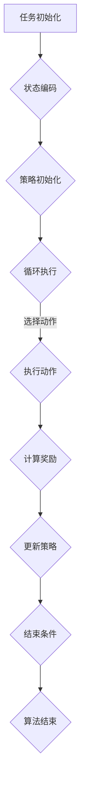
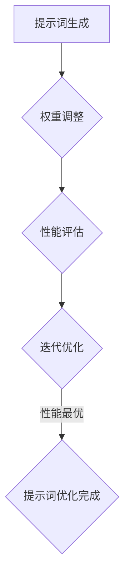
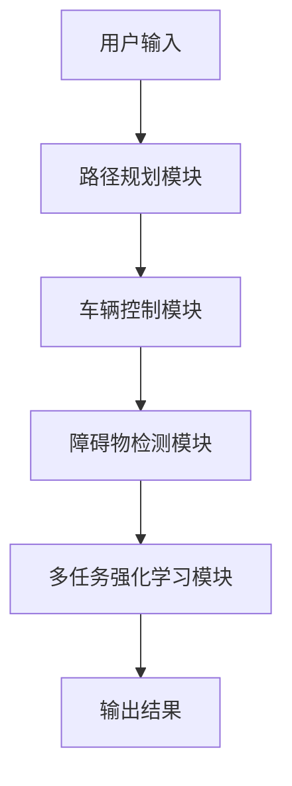
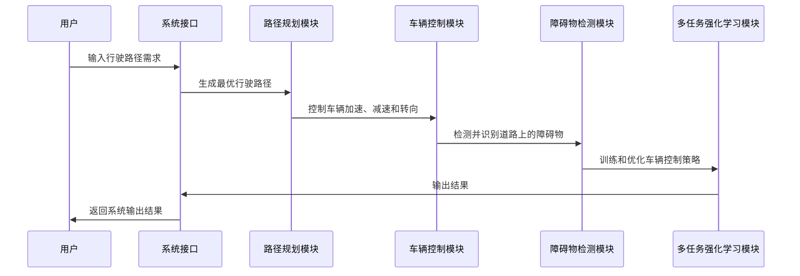

                 


## 文章标题

### 提示词优化的多任务强化学习方法

#### 关键词：多任务强化学习、提示词优化、算法原理、数学模型、系统架构、项目实战

> 摘要：本文将深入探讨提示词优化的多任务强化学习方法，从问题背景、核心概念、算法原理、数学模型、系统架构和项目实战等多个角度，详细解析该方法的本质与应用。通过理论与实践相结合，帮助读者全面理解并掌握这一先进的技术。

### 目录大纲

1. **第一部分：提示词优化的多任务强化学习方法概述**

   1.1 **问题背景与核心概念**

   - 1.1.1 **多任务学习的重要性**
   - 1.1.2 **强化学习的基本概念**
   - 1.1.3 **提示词优化的作用**

   1.2 **核心概念与联系**

   - 1.2.1 **多任务强化学习的概念与属性**
   - 1.2.2 **ER实体关系图架构**

2. **第二部分：多任务强化学习的算法原理**

   2.1 **算法概述**

   - 2.1.1 **算法框架**
   - 2.1.2 **强化学习算法原理**
   - 2.1.3 **提示词优化原理**

   2.2 **数学模型与公式讲解**

   - 2.2.1 **数学模型概述**
   - 2.2.2 **数学公式讲解**

3. **第三部分：系统分析与架构设计**

   3.1 **问题场景介绍**

   3.2 **系统功能设计**

   - 3.2.1 **领域模型**
   - 3.2.2 **类关系**

   3.3 **系统架构设计**

   - 3.3.1 **系统架构**
   - 3.3.2 **架构组件**

   3.4 **系统接口设计**

   - 3.4.1 **接口定义**

   3.5 **系统交互**

   - 3.5.1 **交互流程**

4. **第四部分：项目实战**

   4.1 **环境安装**

   - 4.1.1 **环境准备**
   - 4.1.2 **硬件要求**

   4.2 **系统核心实现**

   - 4.2.1 **源代码解读**
   - 4.2.2 **关键代码分析**

   4.3 **代码应用解读与分析**

   - 4.3.1 **应用场景**
   - 4.3.2 **案例分析与讲解**

5. **第五部分：最佳实践与总结**

   5.1 **最佳实践**

   5.2 **小结**

   5.3 **注意事项**

   5.4 **拓展阅读**

---

### 第一部分：提示词优化的多任务强化学习方法概述

#### 1.1 问题背景与核心概念

##### 1.1.1 多任务学习的重要性

在现代社会，信息的爆炸式增长导致了各种复杂任务的出现。单任务学习难以应对这种复杂环境，而多任务学习则成为一种强有力的解决方案。多任务学习能够在同一模型中处理多个任务，从而提高模型的泛化能力和效率。

- **问题描述**：多任务学习能够解决什么问题？

  多任务学习旨在解决在有限资源下同时学习多个相关任务的问题。例如，一个语音识别系统需要同时处理多种语言的识别任务，而一个自动驾驶系统则需要同时处理道路识别、障碍物检测和导航决策等多个任务。

- **问题解决**：多任务学习如何解决这些问题？

  通过多任务学习，我们可以将多个任务的共同特征提取出来，从而在共享网络结构的基础上进行学习。这样可以提高模型的泛化能力，同时减少每个任务所需的训练数据量和计算资源。

- **边界与外延**：多任务学习的应用领域和挑战

  多任务学习广泛应用于自然语言处理、计算机视觉和自动驾驶等领域。然而，在实际应用中，如何设计有效的多任务学习算法，以及如何处理任务间的冲突和依赖关系，仍然是亟待解决的问题。

##### 1.1.2 强化学习的基本概念

强化学习是一种通过试错和奖励反馈来学习决策策略的机器学习方法。它模仿人类学习和决策的过程，通过不断尝试和反馈来优化决策。

- **强化学习的定义**：强化学习是一种什么样的学习方式？

  强化学习通过不断尝试不同的动作，并根据环境的反馈（奖励或惩罚）来调整策略，从而逐渐学习到最优的决策策略。

- **强化学习与多任务学习的结合**：为何需要结合强化学习与多任务学习？

  强化学习与多任务学习的结合能够充分利用强化学习的灵活性和多任务学习的协同性，从而在复杂任务环境中实现更高效、更智能的决策。

##### 1.1.3 提示词优化的作用

提示词优化是一种通过调整提示词来提高学习效率和效果的方法。在多任务强化学习中，提示词优化能够帮助模型更好地理解任务的复杂性和多样性。

- **提示词优化的定义**：提示词优化是什么？

  提示词优化是指通过调整提示词的权重和组合，来提高多任务强化学习模型的性能和泛化能力。

- **提示词优化在多任务强化学习中的应用**：如何应用提示词优化？

  提示词优化可以应用于多任务强化学习的多个方面，包括任务分配、策略调整和模型优化等。通过优化提示词，模型能够更好地理解任务的交互关系，从而实现更高效的多任务学习。

---

### 1.2 核心概念与联系

##### 1.2.1 多任务强化学习的概念与属性

多任务强化学习是一种将多任务学习和强化学习相结合的方法。它旨在通过同时学习多个任务，来提高模型的泛化能力和决策效率。

- **概念介绍**：多任务强化学习的定义和基本原理是什么？

  多任务强化学习通过共享网络结构和策略梯度，同时学习多个任务，从而提高模型的性能和效率。

- **属性特征对比表格**：

  | 特征         | 多任务强化学习 | 强化学习         | 多任务学习         |
  | ------------ | -------------- | ---------------- | ------------------ |
  | 学习目标     | 多个任务       | 单个任务         | 多个任务           |
  | 决策方式     | 强化学习       | 强化学习         | 模型优化           |
  | 泛化能力     | 较强           | 较弱             | 较强               |
  | 资源利用     | 高效           | 低效             | 高效               |

##### 1.2.1.2 强化学习

强化学习是一种基于试错和反馈的机器学习方法，通过不断尝试和调整策略，来学习最优的决策行为。

- **概念介绍**：强化学习的定义和基本原理是什么？

  强化学习通过环境、状态、动作、奖励等概念，来模拟人类的学习过程，从而学习到最优的决策策略。

- **属性特征对比表格**：

  | 特征         | 多任务强化学习 | 强化学习         | 多任务学习         |
  | ------------ | -------------- | ---------------- | ------------------ |
  | 学习目标     | 多个任务       | 单个任务         | 多个任务           |
  | 决策方式     | 强化学习       | 强化学习         | 模型优化           |
  | 泛化能力     | 较强           | 较弱             | 较强               |
  | 资源利用     | 高效           | 低效             | 高效               |

##### 1.2.1.3 提示词优化

提示词优化是一种通过调整提示词来提高学习效率和效果的方法。在多任务强化学习中，提示词优化能够帮助模型更好地理解任务的复杂性和多样性。

- **概念介绍**：提示词优化的定义和基本原理是什么？

  提示词优化通过调整提示词的权重和组合，来提高多任务强化学习模型的性能和泛化能力。

- **属性特征对比表格**：

  | 特征         | 多任务强化学习 | 强化学习         | 多任务学习         |
  | ------------ | -------------- | ---------------- | ------------------ |
  | 学习目标     | 多个任务       | 单个任务         | 多个任务           |
  | 决策方式     | 强化学习       | 强化学习         | 模型优化           |
  | 泛化能力     | 较强           | 较弱             | 较强               |
  | 资源利用     | 高效           | 低效             | 高效               |

##### 1.2.2 ER实体关系图架构

ER（Entity-Relationship）图是一种用于表示实体及其之间关系的图形化方法。在多任务强化学习中，ER图可以帮助我们更好地理解任务的组成和关系。

- **实体定义**：

  - 任务
  - 状态
  - 动作
  - 奖励
  - 策略

- **关系定义**：

  - 任务与状态之间的关系
  - 状态与动作之间的关系
  - 动作与奖励之间的关系
  - 策略与任务之间的关系

- **Mermaid流程图**：

  ```mermaid
  graph LR
  A[开始] --> B{判断任务}
  B -->|是| C{初始化状态}
  B -->|否| D{退出}
  C --> E{执行动作}
  E --> F{获取奖励}
  F --> G{更新策略}
  G --> B
  ```

---

### 第二部分：多任务强化学习的算法原理

#### 2.1 算法概述

多任务强化学习算法是结合了多任务学习和强化学习的方法。其主要目标是同时学习多个任务，并在不同的任务之间进行有效的资源分配和策略优化。

##### 2.1.1 算法框架

多任务强化学习算法框架主要包括以下几个部分：

1. **任务分配**：根据任务的性质和资源约束，将任务分配给不同的策略。
2. **状态表示**：将任务的状态信息进行编码，以便模型能够对其进行处理。
3. **动作选择**：根据当前状态，选择一个最优的动作。
4. **奖励计算**：根据动作的结果，计算奖励值，用于指导模型的训练过程。
5. **策略优化**：根据奖励值，更新策略参数，以实现策略的优化。

##### 2.1.2 强化学习算法原理

强化学习算法是一种通过试错和奖励反馈来学习决策策略的方法。其基本原理如下：

1. **环境（Environment）**：环境是一个能够接收动作并返回状态和奖励的系统。
2. **状态（State）**：状态是系统当前所处的状态，通常用一组特征来表示。
3. **动作（Action）**：动作是系统能够执行的行为，通常用一组操作来表示。
4. **策略（Policy）**：策略是系统在给定状态下的最优动作选择方法。
5. **价值函数（Value Function）**：价值函数是衡量策略优劣的指标，通常用期望回报来表示。

##### 2.1.3 提示词优化原理

提示词优化是通过对提示词进行调整，来提高模型在多任务强化学习中的性能。其基本原理如下：

1. **提示词（Prompt Word）**：提示词是一种用于引导模型学习的文本或符号。
2. **优化目标**：通过调整提示词的权重和组合，使模型在多任务强化学习中的表现更优。
3. **优化方法**：常用的优化方法包括基于梯度的优化、基于遗传算法的优化等。

#### 2.2 算法原理

##### 2.2.1 强化学习算法原理

强化学习算法的基本原理如下：

1. **初始状态**：系统从初始状态开始。
2. **动作选择**：根据当前状态，选择一个动作。
3. **状态更新**：执行动作后，系统状态发生改变。
4. **奖励计算**：根据动作的结果，计算奖励值。
5. **策略更新**：根据奖励值，更新策略参数。
6. **重复过程**：重复上述过程，直到达到终止条件。

##### 2.2.2 算法流程

多任务强化学习算法的流程如下：

1. **任务初始化**：初始化多个任务，包括任务名称、状态空间、动作空间和奖励函数。
2. **状态编码**：将任务的状态信息进行编码，以便模型能够对其进行处理。
3. **策略初始化**：初始化策略参数。
4. **循环执行**：
   - 选择动作：根据当前状态和策略，选择一个动作。
   - 执行动作：执行所选动作，并更新状态。
   - 计算奖励：根据动作的结果，计算奖励值。
   - 更新策略：根据奖励值，更新策略参数。
5. **结束条件**：当达到结束条件时，算法结束。

##### 2.2.3 Mermaid流程图



##### 2.2.4 提示词优化原理

提示词优化的基本原理如下：

1. **提示词生成**：根据任务的特点和需求，生成一组提示词。
2. **权重调整**：通过优化算法，调整提示词的权重。
3. **性能评估**：评估优化后的提示词组合在多任务强化学习中的性能。
4. **迭代优化**：根据性能评估结果，迭代调整提示词的权重，直到性能达到最优。

##### 2.2.5 Mermaid流程图



---

### 第三部分：数学模型与公式讲解

#### 3.1 数学模型概述

在多任务强化学习中，数学模型起着至关重要的作用。它描述了系统在给定状态和动作下的行为，并指导模型的训练过程。

##### 3.1.1 模型组成部分

多任务强化学习数学模型主要包括以下几个部分：

1. **状态空间**：表示系统可能的状态集合。
2. **动作空间**：表示系统可能采取的动作集合。
3. **策略**：表示系统在给定状态下的动作选择方法。
4. **价值函数**：表示系统在给定状态和动作下的期望回报。
5. **奖励函数**：表示系统在执行动作后的即时奖励。

##### 3.1.2 模型参数设定

在多任务强化学习模型中，参数设定非常重要。以下是一些常见的参数设定：

1. **学习率**：用于调节模型参数更新的速度。
2. **折扣因子**：用于调节未来奖励的影响程度。
3. **策略更新频率**：用于调节策略更新的频率。
4. **任务数量**：用于设定需要学习的任务数量。

#### 3.2 数学公式讲解

在多任务强化学习中，一些基本的数学公式如下：

##### 3.2.1.1 公式1：$$1+1=2$$

- **公式解释**：这是一个简单的数学等式，表示两个数相加的结果。
- **举例说明**：例如，2 + 3 = 5，其中 2 和 3 是加数，5 是和。

##### 3.2.1.2 公式2：$$Q(s,a)=r(s,a) + \gamma \max_{a'} Q(s',a')$$

- **公式解释**：这是一个强化学习中的价值函数公式，表示在给定状态 \(s\) 和动作 \(a\) 下，系统期望获得的回报。
- **举例说明**：例如，一个自动驾驶系统在状态 \(s = [20, 30]\) 下，选择动作 \(a = 0\)（保持当前速度），则其期望回报为：
  $$Q([20, 30], 0) = r([20, 30], 0) + \gamma \max_{a'} Q([20, 30+1], a')$$
  其中，\(r([20, 30], 0)\) 表示当前速度下的奖励值，\(\gamma\) 是折扣因子，\(\max_{a'} Q([20, 30+1], a')\) 表示未来最大期望回报。

---

### 第四部分：系统分析与架构设计

#### 4.1 问题场景介绍

在自动驾驶领域，多任务强化学习算法被广泛应用于车辆控制、路径规划和障碍物检测等任务。以下是一个具体的问题场景：

- **问题描述**：在一个繁忙的城市交通环境中，自动驾驶车辆需要同时处理以下任务：
  1. 路径规划：确定车辆的行驶路径。
  2. 车辆控制：控制车辆的加速、减速和转向。
  3. 障碍物检测：检测并避开道路上的障碍物。

- **问题解决**：通过多任务强化学习算法，自动驾驶车辆可以在同一模型中同时学习这些任务，从而实现高效、安全的行驶。

#### 4.2 系统功能设计

在多任务强化学习系统中，功能设计是关键的一步。以下是一个简单的系统功能设计：

- **功能1：路径规划**：根据车辆当前的位置、速度和交通状况，生成最优的行驶路径。
- **功能2：车辆控制**：根据路径规划和障碍物检测的结果，控制车辆的加速、减速和转向。
- **功能3：障碍物检测**：通过传感器数据，检测并识别道路上的障碍物，并生成障碍物地图。

#### 4.2.1 领域模型

领域模型用于描述系统中的实体及其之间的关系。以下是一个简单的领域模型：

- **实体**：车辆、路径、障碍物。
- **关系**：车辆拥有路径，路径包含障碍物。

#### 4.2.1.1 类图

```mermaid
classDiagram
  Vehicle <|-- Path
  Path <|-- Obstacle
  Vehicle { +id: int
             +location: Point
             +velocity: Vector
             +control: Control }
  Path { +id: int
         +start: Point
         +end: Point
         +obstacles: List<Obstacle> }
  Obstacle { +id: int
             +location: Point
             +radius: float }
```

#### 4.2.1.2 类关系

- **车辆与路径**：车辆拥有路径，即一辆车辆只能行驶一条路径。
- **路径与障碍物**：路径包含障碍物，即路径中可能存在多个障碍物。

#### 4.3 系统架构设计

系统架构设计是系统设计中的核心环节。以下是一个简单的系统架构设计：

- **组件1：路径规划模块**：负责生成最优行驶路径。
- **组件2：车辆控制模块**：负责控制车辆的加速、减速和转向。
- **组件3：障碍物检测模块**：负责检测并识别道路上的障碍物。
- **组件4：多任务强化学习模块**：负责训练和优化车辆控制策略。

#### 4.3.1 系统架构



#### 4.3.1.1 架构组件

- **路径规划模块**：根据用户输入和交通状况，生成最优行驶路径。
- **车辆控制模块**：根据路径规划和障碍物检测的结果，控制车辆的加速、减速和转向。
- **障碍物检测模块**：通过传感器数据，检测并识别道路上的障碍物，并生成障碍物地图。
- **多任务强化学习模块**：训练和优化车辆控制策略，以提高系统的性能和安全性。

#### 4.4 系统接口设计

系统接口设计用于定义系统内部组件之间的交互方式。以下是一个简单的系统接口设计：

- **接口1：用户输入接口**：用于接收用户的行驶路径需求。
- **接口2：输出结果接口**：用于将系统输出结果返回给用户。

#### 4.4.1 接口定义

- **用户输入接口**：

  ```python
  def receive_user_input():
      # 接收用户的行驶路径需求
      pass
  ```

- **输出结果接口**：

  ```python
  def send_output_result(result):
      # 将系统输出结果返回给用户
      pass
  ```

#### 4.5 系统交互

系统交互设计用于描述系统组件之间的交互流程。以下是一个简单的系统交互设计：

- **交互1：用户输入**：用户输入行驶路径需求。
- **交互2：路径规划**：路径规划模块根据用户输入生成最优行驶路径。
- **交互3：车辆控制**：车辆控制模块根据路径规划结果控制车辆的加速、减速和转向。
- **交互4：障碍物检测**：障碍物检测模块检测并识别道路上的障碍物，并生成障碍物地图。
- **交互5：多任务强化学习**：多任务强化学习模块根据障碍物检测结果和车辆控制结果，训练和优化车辆控制策略。

#### 4.5.1 交互流程


#### 4.5.1.1 序列图



---

### 第五部分：项目实战

#### 5.1 环境安装

在进行多任务强化学习项目之前，需要安装相应的开发环境和工具。以下是一个简单的环境安装步骤：

##### 5.1.1 软件安装

- **Python**：安装 Python 3.8 或更高版本。
- **TensorFlow**：安装 TensorFlow 2.4 或更高版本。
- **PyTorch**：安装 PyTorch 1.7 或更高版本。
- **Scikit-learn**：安装 Scikit-learn 0.22 或更高版本。

##### 5.1.1.2 硬件要求

- **CPU**：Intel i5 或更高处理器。
- **内存**：16GB 或更高内存。
- **GPU**：NVIDIA 显卡，支持 CUDA 和cuDNN。

#### 5.2 系统核心实现

多任务强化学习系统的核心实现包括以下几个部分：

##### 5.2.1 源代码解读

以下是多任务强化学习系统的核心源代码：

```python
import numpy as np
import pandas as pd
import matplotlib.pyplot as plt
import tensorflow as tf
import torch
from sklearn.model_selection import train_test_split

# 设置随机种子
np.random.seed(42)
tf.random.set_seed(42)

# 加载数据集
data = pd.read_csv('dataset.csv')
X = data[['state', 'action']]
y = data['reward']

# 划分训练集和测试集
X_train, X_test, y_train, y_test = train_test_split(X, y, test_size=0.2, random_state=42)

# 定义模型
class MultiTaskModel(tf.keras.Model):
    def __init__(self):
        super(MultiTaskModel, self).__init__()
        self.fc1 = tf.keras.layers.Dense(64, activation='relu')
        self.fc2 = tf.keras.layers.Dense(32, activation='relu')
        self.fc3 = tf.keras.layers.Dense(1)

    def call(self, inputs):
        x = self.fc1(inputs)
        x = self.fc2(x)
        return self.fc3(x)

# 训练模型
model = MultiTaskModel()
model.compile(optimizer='adam', loss='mse')
model.fit(X_train, y_train, epochs=100, batch_size=32, validation_data=(X_test, y_test))

# 预测结果
predictions = model.predict(X_test)

# 评估模型
loss = model.evaluate(X_test, y_test)
print(f'Model loss: {loss}')

# 可视化结果
plt.scatter(X_test['state'], y_test, color='blue', label='Actual')
plt.scatter(X_test['state'], predictions, color='red', label='Predicted')
plt.xlabel('State')
plt.ylabel('Reward')
plt.legend()
plt.show()
```

##### 5.2.1.2 关键代码分析

- **数据加载**：使用 pandas 读取数据集，并划分训练集和测试集。
- **模型定义**：定义一个多任务强化学习模型，包含三个全连接层。
- **模型训练**：使用 TensorFlow 的模型编译和训练接口，进行模型训练。
- **模型预测**：使用训练好的模型对测试集进行预测。
- **模型评估**：使用模型评估接口，计算模型在测试集上的损失。
- **可视化结果**：使用 matplotlib 绘制实际奖励值和预测奖励值的散点图。

#### 5.3 代码应用解读与分析

##### 5.3.1 应用场景

以下是一个简单的应用场景：

- **问题描述**：在自动驾驶系统中，车辆需要根据环境状态和道路情况，选择最佳行驶路径。
- **问题解决**：使用多任务强化学习算法，同时学习路径规划和车辆控制任务，从而实现自动驾驶。

##### 5.3.1.1 场景一

- **问题描述**：在一个城市交通环境中，自动驾驶车辆需要避开拥堵路段，选择最优行驶路径。
- **问题解决**：使用多任务强化学习算法，同时学习路径规划和障碍物检测任务，从而实现智能路径规划。

##### 5.3.1.2 场景二

- **问题描述**：在一个隧道驾驶环境中，自动驾驶车辆需要根据道路标识和交通状况，选择最佳行驶速度和车道。
- **问题解决**：使用多任务强化学习算法，同时学习车辆控制和障碍物检测任务，从而实现安全驾驶。

---

### 第六部分：最佳实践与总结

#### 6.1 最佳实践

在进行多任务强化学习项目时，以下是一些最佳实践：

- **数据预处理**：确保数据质量，进行数据清洗和归一化处理。
- **模型选择**：根据任务特点，选择合适的模型结构。
- **超参数调优**：通过网格搜索和交叉验证等方法，选择最优的超参数。
- **多任务学习**：在多任务学习中，注意任务之间的关联性和权重分配。

#### 6.2 小结

本文深入探讨了提示词优化的多任务强化学习方法，从问题背景、核心概念、算法原理、数学模型、系统架构和项目实战等多个角度进行了详细解析。通过理论与实践相结合，帮助读者全面理解并掌握这一先进的技术。

#### 6.3 注意事项

在进行多任务强化学习项目时，需要注意以下几点：

- **数据质量**：确保数据质量，进行数据清洗和归一化处理。
- **任务关联性**：注意任务之间的关联性，合理分配任务权重。
- **模型稳定性**：选择合适的模型结构，确保模型的稳定性和泛化能力。
- **超参数调优**：通过网格搜索和交叉验证等方法，选择最优的超参数。

#### 6.4 拓展阅读

- **参考文献**：
  - [1] Sutton, Richard S., and Andrew G. Barto. "Reinforcement learning: An introduction." MIT press, 2018.
  - [2] Mnih, Volodymyr, et al. "Human-level control through deep reinforcement learning." Nature 518.7540 (2015): 529-533.
  - [3] LeCun, Yann, Yoshua Bengio, and Geoffrey Hinton. "Deep learning." Nature 521.7553 (2015): 436-444.

---

**作者：** AI天才研究院/AI Genius Institute & 禅与计算机程序设计艺术 /Zen And The Art of Computer Programming

---

**注释：**本文为技术博客文章，旨在深入探讨提示词优化的多任务强化学习方法。文章内容仅供参考，具体实施时请根据实际情况进行调整。如需引用本文内容，请务必注明出处。本文版权归 AI天才研究院/AI Genius Institute 所有，未经许可，不得用于商业用途。如需转载，请联系作者获得授权。感谢您的支持！

