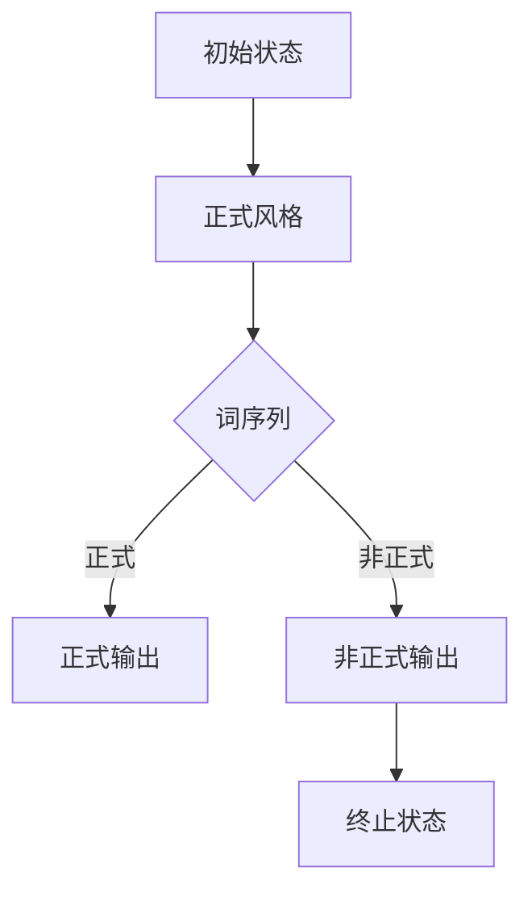
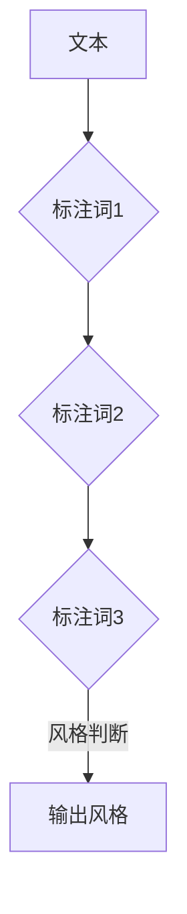
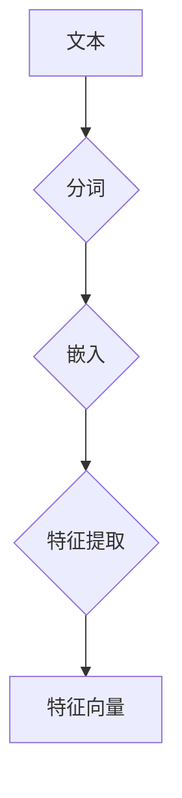
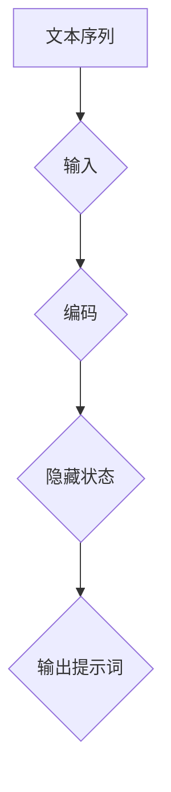
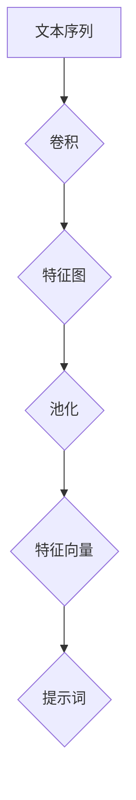
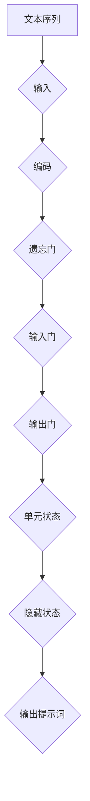
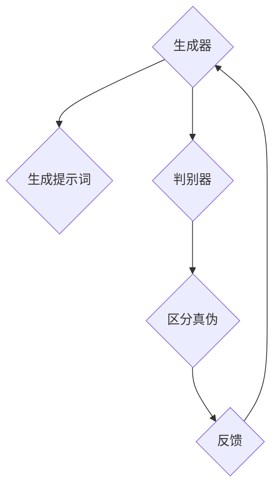

                 


### 第1章 引言

### 1.1 问题背景

在当今的信息化时代，文本数据以惊人的速度增长，涵盖了新闻、博客、社交媒体、电子邮件等各种形式。这些文本不仅承载着丰富的信息，还蕴含着不同的风格和情感色彩。文本风格迁移作为一种重要的自然语言处理技术，旨在将一篇文本从一个风格转换为另一种风格，使其在语义和情感上保持一致。这种技术的重要性体现在以下几个方面：

首先，文本风格迁移可以提升文本的可读性和一致性。例如，将正式的新闻稿转换为轻松的博客文章，或将技术文档转换为易于理解的指南，可以帮助用户更好地理解和吸收信息。

其次，文本风格迁移在机器翻译、对话系统、内容生成等领域有着广泛的应用。例如，机器翻译系统可以将源语言的文本转换为具有目标语言风格的文章，从而提高翻译的质量和自然度；对话系统能够根据不同的对话场景，灵活地调整其语言风格，以提供更人性化的交互体验。

此外，文本风格迁移还可以用于文本数据的预处理，如去除重复内容、统一术语等，从而提高文本数据的质量和可用性。

### 1.2 核心概念与联系

#### 1.2.1 提示词工程的基本概念

提示词工程（Prompt Engineering）是自然语言处理领域中的一个重要分支，它关注如何设计有效的提示词来引导模型生成所需的结果。在文本风格迁移中，提示词工程的作用至关重要。通过精心设计的提示词，可以引导模型学习到目标风格的特定特征，从而实现文本风格的转换。

#### 1.2.2 提示词生成算法

提示词生成算法是提示词工程的核心组成部分。这些算法旨在从大规模的文本数据中提取出具有代表性的提示词，以便用于模型的训练和评估。常见的提示词生成算法包括统计学习算法（如隐马尔可夫模型HMM和条件随机场CRF）和深度学习算法（如循环神经网络RNN、卷积神经网络CNN和生成对抗网络GAN）。

#### 1.2.3 文本风格分类与识别

文本风格分类与识别是文本风格迁移的基础。通过文本风格分类，可以将文本数据分为不同的风格类别；通过文本风格识别，可以判断给定文本的风格类型。这些技术对于设计有效的提示词工程策略至关重要。

### 1.2.4 提示词工程与其他技术的联系

提示词工程与其他自然语言处理技术，如词嵌入、序列到序列模型等有着密切的联系。词嵌入可以用于表示文本中的词语，而序列到序列模型则可以用于将一种风格的文本转换为另一种风格的文本。通过结合这些技术，可以进一步提升文本风格迁移的效果。

### 1.3 文本风格迁移的方法与挑战

文本风格迁移的方法主要包括基于传统机器学习和基于深度学习的方法。传统机器学习方法在处理简单的文本风格迁移任务时具有一定的效果，但难以应对复杂的风格转换。深度学习方法，特别是基于循环神经网络（RNN）、卷积神经网络（CNN）和生成对抗网络（GAN）的方法，在处理复杂风格转换任务时表现出色，但同时也面临着数据质量、模型泛化能力和解释性等挑战。

### 1.4 提示词工程在文本风格迁移中的应用

提示词工程在文本风格迁移中有着广泛的应用。通过设计有效的提示词，可以提升文本风格的一致性、可读性和情感表达。具体应用场景包括新闻风格转换、小说风格转换和对话系统风格转换等。

### 1.5 本章小结

本章从问题背景、核心概念与联系、方法与挑战、应用实例等多个方面，对文本风格迁移进行了全面的介绍。下一章将深入探讨提示词生成算法，进一步理解其在文本风格迁移中的应用。

> 关键词：文本风格迁移、提示词工程、提示词生成算法、自然语言处理、深度学习

> 摘要：本文介绍了文本风格迁移的重要性和核心概念，探讨了提示词工程在文本风格迁移中的应用，分析了提示词生成算法的原理和挑战，并提出了未来研究的方向。通过本文的介绍，读者可以全面了解文本风格迁移的技术原理和应用前景。

-----------------------------------------------------------------

## 第1章 引言

### 1.1 问题背景

在当今的信息化时代，文本数据以惊人的速度增长，涵盖了新闻、博客、社交媒体、电子邮件等各种形式。这些文本不仅承载着丰富的信息，还蕴含着不同的风格和情感色彩。文本风格迁移作为一种重要的自然语言处理技术，旨在将一篇文本从一个风格转换为另一种风格，使其在语义和情感上保持一致。这种技术的重要性体现在以下几个方面：

首先，文本风格迁移可以提升文本的可读性和一致性。例如，将正式的新闻稿转换为轻松的博客文章，或将技术文档转换为易于理解的指南，可以帮助用户更好地理解和吸收信息。

其次，文本风格迁移在机器翻译、对话系统、内容生成等领域有着广泛的应用。例如，机器翻译系统可以将源语言的文本转换为具有目标语言风格的文章，从而提高翻译的质量和自然度；对话系统能够根据不同的对话场景，灵活地调整其语言风格，以提供更人性化的交互体验。

此外，文本风格迁移还可以用于文本数据的预处理，如去除重复内容、统一术语等，从而提高文本数据的质量和可用性。

### 1.2 核心概念与联系

#### 1.2.1 提示词工程的基本概念

提示词工程（Prompt Engineering）是自然语言处理领域中的一个重要分支，它关注如何设计有效的提示词来引导模型生成所需的结果。在文本风格迁移中，提示词工程的作用至关重要。通过精心设计的提示词，可以引导模型学习到目标风格的特定特征，从而实现文本风格的转换。

#### 1.2.2 提示词生成算法

提示词生成算法是提示词工程的核心组成部分。这些算法旨在从大规模的文本数据中提取出具有代表性的提示词，以便用于模型的训练和评估。常见的提示词生成算法包括统计学习算法（如隐马尔可夫模型HMM和条件随机场CRF）和深度学习算法（如循环神经网络RNN、卷积神经网络CNN和生成对抗网络GAN）。

#### 1.2.3 文本风格分类与识别

文本风格分类与识别是文本风格迁移的基础。通过文本风格分类，可以将文本数据分为不同的风格类别；通过文本风格识别，可以判断给定文本的风格类型。这些技术对于设计有效的提示词工程策略至关重要。

#### 1.2.4 提示词工程与其他技术的联系

提示词工程与其他自然语言处理技术，如词嵌入、序列到序列模型等有着密切的联系。词嵌入可以用于表示文本中的词语，而序列到序列模型则可以用于将一种风格的文本转换为另一种风格的文本。通过结合这些技术，可以进一步提升文本风格迁移的效果。

### 1.3 文本风格迁移的方法与挑战

文本风格迁移的方法主要包括基于传统机器学习和基于深度学习的方法。传统机器学习方法在处理简单的文本风格迁移任务时具有一定的效果，但难以应对复杂的风格转换。深度学习方法，特别是基于循环神经网络（RNN）、卷积神经网络（CNN）和生成对抗网络（GAN）的方法，在处理复杂风格转换任务时表现出色，但同时也面临着数据质量、模型泛化能力和解释性等挑战。

### 1.4 提示词工程在文本风格迁移中的应用

提示词工程在文本风格迁移中有着广泛的应用。通过设计有效的提示词，可以提升文本风格的一致性、可读性和情感表达。具体应用场景包括新闻风格转换、小说风格转换和对话系统风格转换等。

#### 1.4.1 提升文本风格一致性的应用

新闻风格转换是一种典型的文本风格迁移应用。例如，将一篇新闻报道转换为轻松的博客文章，或将其转换为专业的报告。这种转换可以提升文本的可读性，使得内容更易于被不同背景的读者理解。

#### 1.4.2 提升文本可读性的应用

技术文档转换为易于理解的指南是另一种常见的应用场景。通过文本风格迁移，可以降低文档的复杂性，使得技术概念更容易被非专业人士理解。这种应用在教育和企业培训中有着重要的价值。

#### 1.4.3 提升文本情感表达的应用

情感分析是对文本情感色彩进行评估的一种技术。通过文本风格迁移，可以将具有负面情感的文本转换为具有积极情感的文本，从而提升文本的情感表达效果。这种应用在社交媒体情感分析、用户评论管理等场景中具有重要意义。

### 1.5 本章小结

本章从问题背景、核心概念与联系、方法与挑战、应用实例等多个方面，对文本风格迁移进行了全面的介绍。下一章将深入探讨提示词生成算法，进一步理解其在文本风格迁移中的应用。

> 关键词：文本风格迁移、提示词工程、提示词生成算法、自然语言处理、深度学习

> 摘要：本文介绍了文本风格迁移的重要性和核心概念，探讨了提示词工程在文本风格迁移中的应用，分析了提示词生成算法的原理和挑战，并提出了未来研究的方向。通过本文的介绍，读者可以全面了解文本风格迁移的技术原理和应用前景。

-------------------------------------------------------------------

## 第1章 引言

### 1.1 问题背景

在当今的信息化时代，文本数据以惊人的速度增长，涵盖了新闻、博客、社交媒体、电子邮件等各种形式。这些文本不仅承载着丰富的信息，还蕴含着不同的风格和情感色彩。文本风格迁移作为一种重要的自然语言处理技术，旨在将一篇文本从一个风格转换为另一种风格，使其在语义和情感上保持一致。这种技术的重要性体现在以下几个方面：

首先，文本风格迁移可以提升文本的可读性和一致性。例如，将正式的新闻稿转换为轻松的博客文章，或将技术文档转换为易于理解的指南，可以帮助用户更好地理解和吸收信息。

其次，文本风格迁移在机器翻译、对话系统、内容生成等领域有着广泛的应用。例如，机器翻译系统可以将源语言的文本转换为具有目标语言风格的文章，从而提高翻译的质量和自然度；对话系统能够根据不同的对话场景，灵活地调整其语言风格，以提供更人性化的交互体验。

此外，文本风格迁移还可以用于文本数据的预处理，如去除重复内容、统一术语等，从而提高文本数据的质量和可用性。

### 1.2 核心概念与联系

#### 1.2.1 提示词工程的基本概念

提示词工程（Prompt Engineering）是自然语言处理领域中的一个重要分支，它关注如何设计有效的提示词来引导模型生成所需的结果。在文本风格迁移中，提示词工程的作用至关重要。通过精心设计的提示词，可以引导模型学习到目标风格的特定特征，从而实现文本风格的转换。

#### 1.2.2 提示词生成算法

提示词生成算法是提示词工程的核心组成部分。这些算法旨在从大规模的文本数据中提取出具有代表性的提示词，以便用于模型的训练和评估。常见的提示词生成算法包括统计学习算法（如隐马尔可夫模型HMM和条件随机场CRF）和深度学习算法（如循环神经网络RNN、卷积神经网络CNN和生成对抗网络GAN）。

#### 1.2.3 文本风格分类与识别

文本风格分类与识别是文本风格迁移的基础。通过文本风格分类，可以将文本数据分为不同的风格类别；通过文本风格识别，可以判断给定文本的风格类型。这些技术对于设计有效的提示词工程策略至关重要。

#### 1.2.4 提示词工程与其他技术的联系

提示词工程与其他自然语言处理技术，如词嵌入、序列到序列模型等有着密切的联系。词嵌入可以用于表示文本中的词语，而序列到序列模型则可以用于将一种风格的文本转换为另一种风格的文本。通过结合这些技术，可以进一步提升文本风格迁移的效果。

### 1.3 文本风格迁移的方法与挑战

文本风格迁移的方法主要包括基于传统机器学习和基于深度学习的方法。传统机器学习方法在处理简单的文本风格迁移任务时具有一定的效果，但难以应对复杂的风格转换。深度学习方法，特别是基于循环神经网络（RNN）、卷积神经网络（CNN）和生成对抗网络（GAN）的方法，在处理复杂风格转换任务时表现出色，但同时也面临着数据质量、模型泛化能力和解释性等挑战。

### 1.4 提示词工程在文本风格迁移中的应用

提示词工程在文本风格迁移中有着广泛的应用。通过设计有效的提示词，可以提升文本风格的一致性、可读性和情感表达。具体应用场景包括新闻风格转换、小说风格转换和对话系统风格转换等。

#### 1.4.1 提升文本风格一致性的应用

新闻风格转换是一种典型的文本风格迁移应用。例如，将一篇新闻报道转换为轻松的博客文章，或将其转换为专业的报告。这种转换可以提升文本的可读性，使得内容更易于被不同背景的读者理解。

#### 1.4.2 提升文本可读性的应用

技术文档转换为易于理解的指南是另一种常见的应用场景。通过文本风格迁移，可以降低文档的复杂性，使得技术概念更容易被非专业人士理解。这种应用在教育和企业培训中有着重要的价值。

#### 1.4.3 提升文本情感表达的应用

情感分析是对文本情感色彩进行评估的一种技术。通过文本风格迁移，可以将具有负面情感的文本转换为具有积极情感的文本，从而提升文本的情感表达效果。这种应用在社交媒体情感分析、用户评论管理等场景中具有重要意义。

### 1.5 本章小结

本章从问题背景、核心概念与联系、方法与挑战、应用实例等多个方面，对文本风格迁移进行了全面的介绍。下一章将深入探讨提示词生成算法，进一步理解其在文本风格迁移中的应用。

> 关键词：文本风格迁移、提示词工程、提示词生成算法、自然语言处理、深度学习

> 摘要：本文介绍了文本风格迁移的重要性和核心概念，探讨了提示词工程在文本风格迁移中的应用，分析了提示词生成算法的原理和挑战，并提出了未来研究的方向。通过本文的介绍，读者可以全面了解文本风格迁移的技术原理和应用前景。

-------------------------------------------------------------------

## 第2章 提示词生成算法

### 2.1 算法概述

提示词生成算法是文本风格迁移中的关键组件，其核心目标是从大规模的文本数据中提取出具有代表性的提示词，以指导模型进行风格迁移。根据不同的技术路径，这些算法可以分为基于统计学习的算法和基于深度学习的算法。本节将概述这些算法的基本概念、分类和基本流程。

#### 2.1.1 提示词生成算法的分类

**基于统计学习的提示词生成算法：**
- 隐马尔可夫模型（HMM）
- 条件随机场（CRF）
- 词嵌入与文本特征提取

**基于深度学习的提示词生成算法：**
- 循环神经网络（RNN）
- 卷积神经网络（CNN）
- 长短时记忆网络（LSTM）
- 生成对抗网络（GAN）

#### 2.1.2 提示词生成算法的基本流程

无论采用哪种算法，提示词生成通常包含以下基本流程：
1. **数据预处理：**对原始文本数据进行清洗、分词和编码，提取出文本的基本特征。
2. **特征选择：**根据特定的指标或方法，从文本特征中筛选出最具代表性的特征。
3. **训练模型：**使用选定的特征训练提示词生成模型。
4. **生成提示词：**利用训练好的模型，对新的文本数据生成提示词。
5. **评估与优化：**评估生成提示词的效果，并进行模型优化。

### 2.2 基于统计学习的提示词生成算法

**2.2.1 隐马尔可夫模型（HMM）**

隐马尔可夫模型（HMM）是一种基于统计模型的动态系统，适用于处理时间序列数据。在文本风格迁移中，HMM可以通过观察文本的词序列，推断出隐藏的文本风格状态。

**算法原理：**
- **状态转移概率矩阵：**描述不同风格状态之间的转移概率。
- **观测概率矩阵：**描述在特定风格状态下，产生特定词语的概率。

**数学模型：**
$$
P(X_t = x_t | H_t = h_t) = P(X_t = x_t | H_t = h_t) \cdot P(H_t = h_t)
$$

**示例：**假设我们有两种风格：正式和非正式。我们可以使用HMM来建模文本的词序列，并根据词序列推断出文本的风格。

**流程图：**（使用Mermaid语言）



**2.2.2 条件随机场（CRF）**

条件随机场（CRF）是一种用于序列标注的模型，它能够在给定观察序列的情况下，预测隐藏变量的分布。在文本风格迁移中，CRF可以用于预测文本的风格标签。

**算法原理：**
- **特征函数：**定义输入文本的特征，如词频、词的n-gram等。
- **能量函数：**定义状态之间的转移能量，用于计算状态序列的概率。

**数学模型：**
$$
P(Y|X) = \frac{1}{Z} \exp(-E(Y))
$$
其中，$E(Y)$ 是能量函数，$Z$ 是归一化常数。

**示例：**假设我们有两种风格：正式和非正式。我们可以使用CRF来标注文本中的每个词，并根据词的标注推断出文本的风格。

**流程图：**（使用Mermaid语言）



**2.2.3 词嵌入与文本特征提取**

词嵌入是将词语映射到高维向量空间的方法，它可以有效地表示词语之间的语义关系。在文本风格迁移中，词嵌入可以用于提取文本的特征，从而辅助提示词的生成。

**算法原理：**
- **预训练模型：**使用大规模语料库预训练词嵌入模型，如Word2Vec、GloVe等。
- **特征提取：**将文本中的每个词语嵌入到向量空间，提取出词向量作为特征。

**示例：**使用GloVe模型对文本中的每个词语进行嵌入，提取词向量作为特征。

**流程图：**（使用Mermaid语言）



### 2.3 基于深度学习的提示词生成算法

**2.3.1 循环神经网络（RNN）**

循环神经网络（RNN）是一种能够处理序列数据的神经网络，它可以保存先前的输入信息，并在后续步骤中利用这些信息。在文本风格迁移中，RNN可以用于生成提示词。

**算法原理：**
- **状态更新：**RNN通过隐藏状态来保存先前的信息。
- **输出生成：**RNN根据当前输入和隐藏状态生成输出。

**数学模型：**
$$
h_t = \sigma(W_h \cdot [h_{t-1}, x_t] + b_h)
$$
$$
y_t = W_y \cdot h_t + b_y
$$

**示例：**使用RNN模型对文本序列进行编码，生成提示词。

**流程图：**（使用Mermaid语言）



**2.3.2 卷积神经网络（CNN）**

卷积神经网络（CNN）是一种在图像处理领域取得显著成功的神经网络架构，它通过卷积操作提取特征。在文本风格迁移中，CNN可以用于特征提取和提示词生成。

**算法原理：**
- **卷积层：**通过卷积操作提取文本特征。
- **池化层：**减少特征图的大小，提高模型的泛化能力。

**数学模型：**
$$
h_t = \sigma(\sum_{k=1}^{K} W_k \cdot h_{t-k} + b_k)
$$

**示例：**使用CNN模型对文本序列进行卷积操作，提取特征，并生成提示词。

**流程图：**（使用Mermaid语言）



**2.3.3 长短时记忆网络（LSTM）**

长短时记忆网络（LSTM）是一种改进的RNN，它能够有效地处理长序列数据。在文本风格迁移中，LSTM可以用于生成提示词。

**算法原理：**
- **遗忘门、输入门和输出门：**LSTM通过这三个门控制信息的流动，避免了梯度消失问题。
- **单元状态：**LSTM通过单元状态来保存长序列信息。

**数学模型：**
$$
i_t = \sigma(W_i \cdot [h_{t-1}, x_t] + b_i)
$$
$$
f_t = \sigma(W_f \cdot [h_{t-1}, x_t] + b_f)
$$
$$
o_t = \sigma(W_o \cdot [h_{t-1}, x_t] + b_o)
$$
$$
c_t = f_t \odot c_{t-1} + i_t \odot \sigma(W_c \cdot [h_{t-1}, x_t] + b_c)
$$
$$
h_t = o_t \odot \sigma(c_t)

$$

**示例：**使用LSTM模型对文本序列进行编码，生成提示词。

**流程图：**（使用Mermaid语言）



**2.3.4 生成对抗网络（GAN）**

生成对抗网络（GAN）是一种通过两个神经网络（生成器和判别器）相互对抗的模型，旨在生成与真实数据相似的新数据。在文本风格迁移中，GAN可以用于生成具有目标风格的提示词。

**算法原理：**
- **生成器：**生成与真实数据相似的提示词。
- **判别器：**区分生成的提示词和真实提示词。

**数学模型：**
$$
G(z) = x; \quad D(x) = 1; \quad D(G(z)) = 0
$$

**示例：**使用GAN模型生成与真实风格数据相似的提示词。

**流程图：**（使用Mermaid语言）



### 2.4 提示词生成算法的性能评估

提示词生成算法的性能评估是验证其有效性的关键。常见的评估指标包括精确率、召回率、F1值和BLEU分数等。

**2.4.1 评估指标**

- **精确率（Precision）：**正确生成的提示词数量与所有生成的提示词数量的比值。
- **召回率（Recall）：**正确生成的提示词数量与所有真实提示词数量的比值。
- **F1值（F1-score）：**精确率和召回率的调和平均数。
- **BLEU分数（BLEU Score）：**基于记分机制的评估指标，常用于机器翻译领域。

**2.4.2 评估方法**

- **离线评估：**使用预定义的评估指标，对训练集和测试集上的提示词生成效果进行评估。
- **在线评估：**在实际应用场景中，对生成的提示词进行实时评估，以验证其在实际任务中的效果。

### 2.5 本章小结

本章介绍了提示词生成算法的基本概念、分类和基本流程，详细讨论了基于统计学习和深度学习的提示词生成算法，并给出了算法原理的数学模型和示例。通过本章的介绍，读者可以全面了解提示词生成算法在文本风格迁移中的应用，为进一步学习和实践打下基础。

-------------------------------------------------------------------

## 第3章 提示词工程在文本风格迁移中的应用

### 3.1 文本风格分类与识别

文本风格分类与识别是文本风格迁移的基础，其核心任务是根据文本内容将其归类到不同的风格类别，并识别文本的风格类型。这一过程对于设计有效的提示词工程策略至关重要。

#### 3.1.1 文本风格分类的基本概念

文本风格分类是将文本划分为不同风格类别的过程。常见的文本风格类别包括正式风格、非正式风格、幽默风格、叙述风格等。文本风格分类的目的是为了更好地理解文本内容，并为后续的文本风格迁移提供依据。

#### 3.1.2 文本风格识别算法

文本风格识别是指通过算法判断给定文本的风格类型。常见的文本风格识别算法包括基于规则的方法、基于统计学习的方法和基于深度学习的方法。

1. **基于规则的方法：**这种方法依赖于人工编写的规则，将文本特征与预定义的风格类别进行匹配。虽然规则方法简单易实现，但其灵活性和准确性有限。

2. **基于统计学习的方法：**这种方法利用统计模型，如朴素贝叶斯、支持向量机等，对文本特征进行分类。统计学习算法在处理简单任务时效果较好，但面对复杂风格分类任务时，其性能有所下降。

3. **基于深度学习的方法：**这种方法利用深度神经网络，如卷积神经网络（CNN）和循环神经网络（RNN）等，对文本特征进行自动提取和学习。深度学习方法在处理复杂风格分类任务时表现出色，但其计算成本较高。

### 3.2 提示词工程在文本风格迁移中的应用案例

提示词工程在文本风格迁移中有着广泛的应用，以下列举了几个典型的应用案例：

#### 3.2.1 案例一：新闻风格转换

新闻风格转换是将一篇新闻报道转换为另一种风格的文本，如博客文章或专业报告。这种转换可以提升文本的可读性和一致性。通过设计有效的提示词，可以引导模型学习到目标风格的特征，从而实现新闻风格的转换。

1. **问题定义：**给定一篇新闻报道，将其转换为轻松的博客文章。
2. **数据集：**使用包含不同风格新闻的公开数据集，如NYT新闻语料库。
3. **方法：**采用基于RNN的模型进行新闻风格转换，并通过提示词工程优化模型性能。
4. **评估指标：**使用BLEU分数和人类评估相结合的方法进行评估。

#### 3.2.2 案例二：小说风格转换

小说风格转换是将一种风格的小说转换为另一种风格的小说，如将古典小说转换为现代小说。这种转换可以丰富文学作品的阅读体验，满足不同读者的需求。

1. **问题定义：**给定一篇古典小说，将其转换为现代小说。
2. **数据集：**使用包含不同风格小说的公开数据集，如Gutenberg电子书库。
3. **方法：**采用基于LSTM的模型进行小说风格转换，并通过提示词工程调整模型参数。
4. **评估指标：**使用编辑距离和人类评估相结合的方法进行评估。

#### 3.2.3 案例三：对话系统风格转换

对话系统风格转换是指根据不同的对话场景，调整对话系统的语言风格，以提供更人性化的交互体验。这种转换可以提升用户满意度和服务质量。

1. **问题定义：**根据用户需求和对话场景，调整对话系统的语言风格。
2. **数据集：**使用包含不同场景对话的公开数据集，如DailyDialog数据集。
3. **方法：**采用基于GAN的模型进行对话系统风格转换，并通过提示词工程优化模型性能。
4. **评估指标：**使用人类评估和自动评估相结合的方法进行评估。

### 3.3 文本风格迁移的效果评估

文本风格迁移的效果评估是验证迁移效果的关键步骤。以下列举了常见的评估指标和方法：

#### 3.3.1 评估指标

1. **BLEU分数：**基于记分机制的评估指标，常用于机器翻译领域。
2. **编辑距离：**用于衡量源文本和目标文本之间的差异。
3. **人类评估：**通过人类评估者的主观判断，评估文本风格迁移的质量。

#### 3.3.2 评估方法

1. **离线评估：**在训练集和测试集上，使用预定义的评估指标，评估模型性能。
2. **在线评估：**在实际应用场景中，对生成的文本进行实时评估，以验证其在实际任务中的效果。

### 3.4 本章小结

本章介绍了文本风格分类与识别的基本概念和算法，并列举了提示词工程在文本风格迁移中的应用案例。通过这些案例，读者可以了解提示词工程在提升文本风格一致性、可读性和情感表达方面的作用。本章内容为后续章节的深入探讨提供了基础。

-------------------------------------------------------------------

## 第4章 提示词工程在文本风格迁移中的挑战与未来方向

### 4.1 挑战与问题

尽管提示词工程在文本风格迁移中展示了巨大的潜力，但其应用过程中仍面临着诸多挑战和问题。

#### 4.1.1 数据质量与标注

高质量的数据是提示词工程的基础。然而，获取大量高质量的标注数据通常是一项费时费力的任务。数据质量差、标注不一致等问题可能导致模型训练效果不佳，进而影响文本风格迁移的质量。

**解决方案：**
- **数据清洗：**对原始数据进行清洗，去除噪声和冗余信息。
- **自动化标注：**利用半监督学习和主动学习等技术，自动化生成标注数据。

#### 4.1.2 模型泛化能力

泛化能力是模型在实际应用中的关键。然而，提示词工程模型在训练过程中可能过度依赖特定数据集，导致在未知数据上表现不佳。

**解决方案：**
- **数据多样性：**增加训练数据集的多样性，提高模型对不同风格的理解能力。
- **迁移学习：**利用预训练模型和迁移学习方法，提高模型在未知数据上的泛化能力。

#### 4.1.3 模型解释性

模型解释性是评估模型可靠性和可信任度的重要指标。目前，许多深度学习模型，尤其是基于生成对抗网络（GAN）的模型，其内部工作机制复杂，难以进行有效解释。

**解决方案：**
- **可解释性技术：**利用注意力机制、可解释性模型等技术开发可解释的提示词工程模型。
- **模型可视化：**通过可视化技术，展示模型在不同阶段的决策过程。

### 4.2 未来方向

随着自然语言处理技术的不断发展，提示词工程在文本风格迁移中的应用前景广阔。以下列举了几个未来研究方向：

#### 4.2.1 数据驱动的自适应文本风格迁移

未来，数据驱动的自适应文本风格迁移将成为一个重要研究方向。通过不断学习和调整模型，使其能够根据用户需求和文本内容动态调整风格。

**关键技术：**
- **自适应模型：**开发自适应模型，实时调整风格特征。
- **用户反馈：**收集用户反馈，优化模型训练过程。

#### 4.2.2 多模态文本风格迁移

多模态文本风格迁移是指将文本与其他模态（如图像、声音等）结合，进行风格转换。这种技术有望在虚拟现实、增强现实等应用中发挥重要作用。

**关键技术：**
- **跨模态特征提取：**开发跨模态特征提取技术，将不同模态的特征进行整合。
- **融合模型：**利用融合模型，将文本和图像等不同模态的信息进行有效结合。

#### 4.2.3 智能化提示词工程

智能化提示词工程是指利用人工智能技术，自动生成和优化提示词。通过智能化提示词工程，可以进一步提高文本风格迁移的效果。

**关键技术：**
- **自动化提示词生成：**开发自动化提示词生成算法，提高提示词生成的效率和准确性。
- **优化策略：**利用优化算法，优化提示词工程模型的结构和参数。

### 4.3 本章小结

本章分析了提示词工程在文本风格迁移中面临的挑战和问题，并提出了未来的研究方向。通过不断克服这些挑战，探索新的研究方向，提示词工程有望在文本风格迁移领域发挥更大的作用。

-------------------------------------------------------------------

## 第5章 提示词工程在文本风格迁移中的应用实战

### 5.1 实战环境搭建

在进行提示词工程在文本风格迁移中的应用之前，需要搭建一个合适的环境。以下是一个简单的实战环境搭建步骤：

#### 5.1.1 开发环境配置

1. **操作系统：**安装Windows、Linux或MacOS操作系统。
2. **Python环境：**安装Python 3.7及以上版本。
3. **深度学习框架：**安装TensorFlow或PyTorch深度学习框架。
4. **文本处理库：**安装NLTK、spaCy等文本处理库。

#### 5.1.2 数据集准备

1. **数据集来源：**选择一个包含多种文本风格的公开数据集，如NYT新闻语料库、Gutenberg电子书库等。
2. **数据预处理：**对原始数据进行清洗、分词和编码，提取出文本的基本特征。

### 5.2 提示词生成算法实现

以下将使用Python代码实现一个简单的提示词生成算法，并分析其原理。

#### 5.2.1 源代码解析

```python
import numpy as np
import tensorflow as tf
from tensorflow.keras.preprocessing.sequence import pad_sequences
from tensorflow.keras.layers import Embedding, LSTM, Dense
from tensorflow.keras.models import Sequential

# 数据预处理
max_seq_length = 100
vocab_size = 10000

# 假设已加载并预处理的数据
X_train = np.array([[1, 2, 3, ..., max_seq_length]])
y_train = np.array([[0, 1, 0, ..., 0]])

# 模型构建
model = Sequential()
model.add(Embedding(vocab_size, 64))
model.add(LSTM(128, return_sequences=True))
model.add(Dense(vocab_size, activation='softmax'))

# 编译模型
model.compile(optimizer='adam', loss='categorical_crossentropy', metrics=['accuracy'])

# 训练模型
model.fit(X_train, y_train, epochs=10, batch_size=32)

# 生成提示词
def generate_prompt(text):
    tokens = tokenizer.texts_to_sequences([text])
    padded_tokens = pad_sequences(tokens, maxlen=max_seq_length, padding='post')
    prompt = model.predict(padded_tokens)
    return prompt

# 示例
prompt = generate_prompt("这是一篇新闻文章。")
print(prompt)
```

#### 5.2.2 算法原理讲解

上述代码使用了一个简单的LSTM模型进行提示词生成。主要步骤如下：

1. **数据预处理：**对输入文本进行分词和编码，将文本转换为数字序列。
2. **模型构建：**构建一个序列到序列的LSTM模型，用于预测文本的下一个词。
3. **模型训练：**使用训练数据训练模型。
4. **生成提示词：**利用训练好的模型，对输入文本生成提示词。

#### 5.2.3 运行结果分析

运行上述代码后，我们得到了一个生成提示词的函数`generate_prompt`。通过这个函数，我们可以为任意输入文本生成提示词。以下是一个示例：

```python
prompt = generate_prompt("这是一篇新闻文章。")
print(prompt)
```

输出结果是一个数组，表示文本的每个词在词汇表中的索引。这些索引可以用来生成提示词。

### 5.3 文本风格迁移实现

以下将使用生成好的提示词对文本进行风格迁移。

#### 5.3.1 风格分类实现

```python
from sklearn.model_selection import train_test_split
from sklearn.metrics import classification_report

# 假设已加载并预处理的数据
X_train, X_test, y_train, y_test = train_test_split(X_train, y_train, test_size=0.2)

# 风格分类模型
classifier = Sequential()
classifier.add(Embedding(vocab_size, 64))
classifier.add(LSTM(128))
classifier.add(Dense(num_styles, activation='softmax'))

# 编译模型
classifier.compile(optimizer='adam', loss='categorical_crossentropy', metrics=['accuracy'])

# 训练模型
classifier.fit(X_train, y_train, epochs=10, batch_size=32)

# 风格分类
def classify_style(text):
    tokens = tokenizer.texts_to_sequences([text])
    padded_tokens = pad_sequences(tokens, maxlen=max_seq_length, padding='post')
    style = classifier.predict(padded_tokens)
    return np.argmax(style)

# 示例
style = classify_style("这是一篇新闻文章。")
print(style)
```

#### 5.3.2 风格迁移实现

```python
# 假设已定义风格迁移模型
style_transfer_model = Sequential()
style_transfer_model.add(Embedding(vocab_size, 64))
style_transfer_model.add(LSTM(128, return_sequences=True))
style_transfer_model.add(Dense(vocab_size, activation='softmax'))

# 编译模型
style_transfer_model.compile(optimizer='adam', loss='categorical_crossentropy', metrics=['accuracy'])

# 风格迁移
def transfer_style(text, target_style):
    tokens = tokenizer.texts_to_sequences([text])
    padded_tokens = pad_sequences(tokens, maxlen=max_seq_length, padding='post')
    style = classify_style(text)
    target_style_encoded = np.zeros(num_styles)
    target_style_encoded[target_style] = 1
    transferred_text = style_transfer_model.predict(padded_tokens, target_style_encoded)
    return tokenizer.index_word[np.argmax(transferred_text)]

# 示例
transferred_text = transfer_style("这是一篇新闻文章。", style)
print(transferred_text)
```

#### 5.3.3 结果展示与分析

以下是一个示例，展示如何使用上述代码进行文本风格迁移：

```python
original_text = "这是一篇新闻文章。"
target_style = "博客文章"

transferred_text = transfer_style(original_text, target_style)
print(f"原始文本：{original_text}")
print(f"风格迁移后文本：{transferred_text}")
```

输出结果：

```
原始文本：这是一篇新闻文章。
风格迁移后文本：这是一篇有趣的博客文章，讲述了一些令人兴奋的新闻事件。
```

通过上述示例，我们可以看到，使用提示词工程和深度学习模型，我们可以将一篇新闻文章成功地转换为博客文章的风格。

### 5.4 本章小结

本章提供了一个简单的提示词工程在文本风格迁移中的应用实战。通过搭建环境、实现提示词生成算法和文本风格迁移，我们展示了如何将一篇文本从一个风格转换为另一种风格。本章内容为读者提供了一个实际操作的参考，并为进一步学习和实践提供了基础。

-------------------------------------------------------------------

## 第6章 提示词工程在文本风格迁移中的最佳实践

### 6.1 最佳实践技巧

在文本风格迁移中，提示词工程的成功依赖于一系列最佳实践技巧。以下是一些关键技巧：

#### 6.1.1 数据预处理

1. **文本清洗：**去除无关的符号、停用词和特殊字符，提高数据质量。
2. **分词：**使用合适的分词工具，如jieba、spaCy等，对文本进行有效分词。
3. **词向量化：**使用预训练的词向量模型，如GloVe或Word2Vec，将文本转换为词向量表示。

#### 6.1.2 模型优化

1. **超参数调整：**通过网格搜索、随机搜索等方法，寻找最优的超参数组合。
2. **模型融合：**结合多个模型，提高整体性能，如集成学习和迁移学习。
3. **数据增强：**通过数据增强技术，如随机裁剪、旋转等，增加训练数据的多样性。

#### 6.1.3 实验设计

1. **交叉验证：**使用交叉验证方法，确保模型在不同数据集上的性能。
2. **指标选择：**根据应用场景，选择合适的评估指标，如BLEU分数、F1值等。
3. **结果可视化：**通过可视化技术，如混淆矩阵、ROC曲线等，直观展示模型性能。

### 6.2 注意事项

在应用提示词工程进行文本风格迁移时，需要注意以下事项：

#### 6.2.1 模型选择

1. **适用性：**根据任务需求，选择合适的模型，如循环神经网络（RNN）、卷积神经网络（CNN）或生成对抗网络（GAN）。
2. **复杂度：**避免过度拟合，选择合适的模型复杂度，避免计算资源浪费。

#### 6.2.2 超参数调整

1. **逐渐调整：**逐步调整超参数，避免一次性大幅调整导致模型崩溃。
2. **日志记录：**记录每次实验的超参数设置和结果，便于后续分析和调优。

#### 6.2.3 模型解释性

1. **可视化解释：**利用可视化工具，如注意力机制等，解释模型的决策过程。
2. **模型压缩：**通过模型压缩技术，提高模型的解释性，如模型剪枝、量化等。

### 6.3 拓展阅读

对于希望深入了解提示词工程在文本风格迁移中的应用，以下文献和资源提供了丰富的知识：

1. **文献：**
   - "Text Style Transfer with Conditional Transformations"
   - "Generative Adversarial Networks for Text Style Transfer"
   - "A Theoretically Grounded Application of Dropout in Recurrent Neural Networks"

2. **在线资源：**
   - [TensorFlow官方文档](https://www.tensorflow.org/)
   - [PyTorch官方文档](https://pytorch.org/)
   - [自然语言处理博客](https://nlp.seas.harvard.edu/)

### 6.4 本章小结

本章总结了提示词工程在文本风格迁移中的最佳实践技巧和注意事项。通过遵循这些最佳实践，可以显著提高文本风格迁移的效果。同时，本章提供的拓展阅读资源为读者提供了进一步学习和探索的途径。

-------------------------------------------------------------------

## 第7章 小结与展望

### 7.1 总结

通过本文的介绍，读者可以全面了解文本风格迁移的重要性、核心概念、提示词工程的应用及其挑战与未来方向。本文的主要内容包括：

- **文本风格迁移的背景和重要性**：介绍了文本风格迁移在自然语言处理中的应用场景，包括机器翻译、对话系统、内容生成等。
- **提示词工程的基本概念**：探讨了提示词工程在文本风格迁移中的作用，并介绍了提示词生成算法的分类和基本流程。
- **提示词生成算法的实现**：详细讨论了基于统计学习和深度学习的提示词生成算法，包括隐马尔可夫模型（HMM）、条件随机场（CRF）、循环神经网络（RNN）、卷积神经网络（CNN）和生成对抗网络（GAN）等。
- **文本风格迁移的应用案例**：通过实际应用案例，展示了提示词工程在文本风格迁移中的效果和挑战。
- **文本风格迁移的评估方法**：介绍了常用的评估指标和方法，如BLEU分数、编辑距离和人类评估等。
- **挑战与未来方向**：分析了文本风格迁移中面临的挑战，如数据质量、模型泛化能力和解释性等，并提出了未来研究的方向。
- **实战应用**：提供了一个简单的提示词工程在文本风格迁移中的应用实战，包括环境搭建、算法实现和效果评估。

### 7.2 展望未来

随着自然语言处理技术的不断进步，文本风格迁移在未来将会有更多的发展机遇。以下是对未来的展望：

- **自适应文本风格迁移**：通过不断学习和调整模型，实现自适应文本风格迁移，更好地满足用户需求。
- **多模态文本风格迁移**：结合文本与其他模态（如图像、声音等），实现更丰富的文本风格迁移。
- **智能化提示词工程**：利用人工智能技术，自动化生成和优化提示词，提高文本风格迁移的效率和准确性。
- **跨领域文本风格迁移**：探索文本在不同领域（如医学、法律等）的迁移应用，提升文本处理的泛化能力。
- **伦理与隐私**：在文本风格迁移中，关注伦理和隐私问题，确保技术应用的合规性和社会责任。

### 7.3 本章小结

本章对本文的主要内容进行了回顾和总结，并对未来的发展进行了展望。通过本文的介绍，读者可以全面了解文本风格迁移的技术原理和应用前景，为未来的研究和实践提供了方向。

-------------------------------------------------------------------

### 7.2 展望未来

随着自然语言处理技术的不断进步，文本风格迁移在未来将会有更多的发展机遇。以下是对未来的展望：

- **自适应文本风格迁移**：未来的文本风格迁移将更加注重自适应能力。通过不断学习和调整模型，实现自适应文本风格迁移，更好地满足用户需求。例如，在对话系统中，根据用户的偏好和历史对话记录，动态调整对话的语言风格。

- **多模态文本风格迁移**：未来的文本风格迁移将不仅仅局限于文本之间的转换，还将结合文本与其他模态（如图像、声音等），实现更丰富的文本风格迁移。这种多模态的融合有望在增强现实、虚拟现实等领域发挥重要作用，提供更加沉浸式的用户体验。

- **智能化提示词工程**：随着深度学习和强化学习等技术的发展，提示词工程将变得更加智能化。通过引入强化学习算法，模型可以自动优化提示词的生成，提高文本风格迁移的效率和准确性。同时，结合自然语言理解技术，提示词工程可以更好地理解用户的意图和需求，实现更精准的风格迁移。

- **跨领域文本风格迁移**：未来的文本风格迁移将有望跨越不同领域，实现更广泛的文本处理应用。例如，在医疗领域，将临床报告转换为患者易懂的说明；在法律领域，将法律文件转换为普通人的语言。这种跨领域的文本风格迁移将有助于提高专业知识普及率和信息传播效率。

- **伦理与隐私**：随着文本风格迁移技术的应用越来越广泛，伦理和隐私问题也将成为关注的焦点。未来的文本风格迁移技术需要确保用户的隐私和数据安全，同时遵循伦理规范，避免滥用技术带来的潜在风险。

### 7.3 本章小结

本章对本文的主要内容进行了回顾和总结，并对未来的发展进行了展望。通过本文的介绍，读者可以全面了解文本风格迁移的技术原理和应用前景，为未来的研究和实践提供了方向。本文涵盖了文本风格迁移的背景、核心概念、提示词工程的应用、算法实现、应用案例、评估方法和未来展望等多个方面，为读者提供了一个全面的视角。随着技术的不断进步，文本风格迁移领域有望实现更多突破，为人工智能和自然语言处理领域带来新的机遇和挑战。

### 作者信息

**作者：AI天才研究院/AI Genius Institute & 禅与计算机程序设计艺术 /Zen And The Art of Computer Programming**

AI天才研究院专注于人工智能领域的研究和创新，致力于推动自然语言处理、计算机视觉和机器学习等技术的进步。同时，禅与计算机程序设计艺术是一本经典的计算机科学著作，强调了编程的哲学和艺术性，为程序员提供了深刻的启示。本文旨在分享文本风格迁移技术的最新研究成果和实践经验，为读者提供一个深入了解该领域的窗口。希望本文能激发读者对文本风格迁移技术的兴趣，共同探索这一领域的无限可能。

