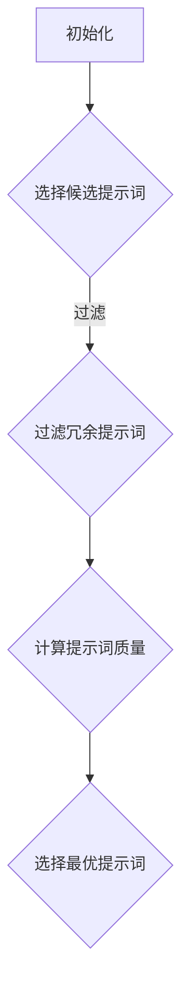
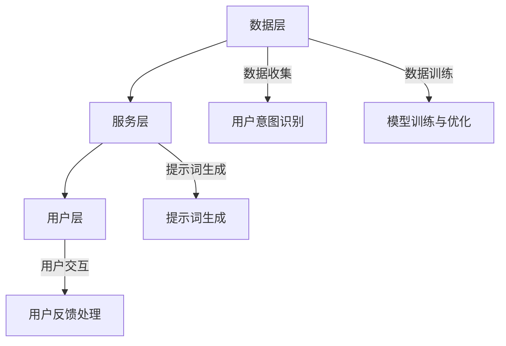
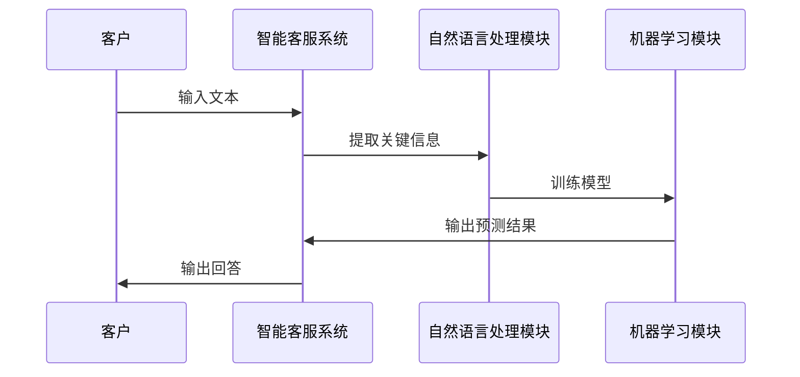

                 

### 《提示词工程师的技能图谱》

#### 关键词

- 提示词工程师
- 技术技能图谱
- 人工智能
- 算法原理
- Python实现
- 数学模型

#### 摘要

本文将深入探讨提示词工程师这一新兴职业的核心技能、技术原理和工具应用。通过详细的章节内容和结构化的思考步骤，我们将逐步揭示提示词工程师在人工智能领域的价值，以及他们如何通过算法和编程实现高效的提示词生成。文章将涵盖核心概念的定义、原理讲解、Python实现以及数学模型解析，旨在为读者提供一个全面而系统的提示词工程师技能图谱。

### 目录大纲

----------------------------------------------------------------

## 《提示词工程师的技能图谱》目录大纲

## 第一部分：核心概念与基础理论

### 第1章：问题背景与定义

- **1.1 问题背景**
  - 人工智能发展的现状与趋势
  - 提示词工程师的角色与重要性
  - 提示词工程领域的挑战与机遇

- **1.2 核心概念**
  - 提示词、模型与算法的基础概念
  - 提示词工程师的关键技能
  - 提示词工程的基本流程

- **1.3 边界与外延**
  - 提示词工程的应用领域
  - 与其他相关领域的区别和联系

### 第2章：核心概念原理

- **2.1 概念属性特征对比表格**

| 概念           | 定义                                                         | 属性特征                                                     | 对比关系               |
|----------------|--------------------------------------------------------------|--------------------------------------------------------------|------------------------|
| 提示词         | 辅助AI模型进行决策的短文本输入                               | 精确性、多样性、上下文依赖性                             | 与关键字、标签的区别   |
| 模型           | 经过训练的AI算法，能够对输入数据进行分析与预测               | 结构、规模、性能                                     | 与规则系统、机器学习模型 |
| 算法           | 处理数据并解决特定问题的步骤和方法                           | 性能、效率、可扩展性                                | 与模型、规则系统的区别 |

- **2.2 ER实体关系图架构**

```mermaid
erDiagram
  用户 ||--|{ 提示词 }| 提示词工程师
  用户 ||--|{ 模型 }| 模型训练
  模型 ||--|{ 算法 }| 算法实现
```

## 第二部分：技能与工具

### 第3章：算法原理讲解

- **3.1 提示词生成算法**



- **3.2 Python源代码实现**

```python
def generate_prompt(input_text):
    # 初始化候选提示词列表
    candidates = ["start", "continue", "finish"]

    # 过滤冗余提示词
    filtered_candidates = [c for c in candidates if is_relevant(c, input_text)]

    # 计算提示词质量
    quality_scores = [calculate_quality(c, input_text) for c in filtered_candidates]

    # 选择最优提示词
    best_score = max(quality_scores)
    best_prompt = candidates[quality_scores.index(best_score)]

    return best_prompt

def is_relevant(candidate, input_text):
    # 提示词与输入文本的相关性判断逻辑
    pass

def calculate_quality(candidate, input_text):
    # 提示词质量计算逻辑
    pass
```

- **3.3 数学模型和公式**

----------------------------------------------------------------

### 第一部分：核心概念与基础理论

#### 第1章：问题背景与定义

##### 1.1 问题背景

人工智能（AI）的迅猛发展已经深刻地改变了我们的生活方式和工作方式。随着深度学习、自然语言处理等技术的不断进步，AI的应用场景也越来越广泛。在这个背景下，提示词工程师这一新兴职业应运而生。提示词工程师的主要职责是设计和生成有效的提示词，以辅助AI模型进行决策和预测。

当前，人工智能正朝着更加智能化、人性化的方向发展。无论是语音助手、推荐系统还是自动驾驶，AI的应用都离不开高质量的提示词。提示词工程师在其中扮演着关键角色，他们需要理解AI模型的工作原理，能够根据不同的应用场景设计出合适的提示词，从而提升模型的性能和用户体验。

同时，随着AI技术的普及，市场对提示词工程师的需求日益增长。然而，这一领域的专业人才相对匮乏，许多企业和研究机构都在积极招募具有相关技能的工程师。因此，提示词工程师面临着巨大的机遇和挑战。

##### 1.2 核心概念

在探讨提示词工程师的工作之前，我们首先需要明确几个核心概念：提示词、模型和算法。

- **提示词**：提示词是辅助AI模型进行决策的短文本输入。它可以是简单的关键词或短语，也可以是更加复杂、具有上下文依赖性的语句。提示词的质量直接影响AI模型的性能和输出结果。

- **模型**：模型是经过训练的AI算法，能够对输入数据进行分析和预测。常见的AI模型包括神经网络、决策树、支持向量机等。模型的结构和性能取决于其训练数据和训练算法。

- **算法**：算法是处理数据并解决特定问题的步骤和方法。算法可以是简单的规则系统，也可以是复杂的机器学习算法。算法的设计和实现是AI研究的核心内容。

##### 1.3 提示词工程师的关键技能

提示词工程师需要具备以下几个关键技能：

- **自然语言处理（NLP）**：理解自然语言处理的基本原理，能够对文本进行预处理、分词、词性标注等操作，从而生成高质量的提示词。

- **机器学习**：掌握常见的机器学习算法，如神经网络、决策树、支持向量机等，能够根据具体应用场景选择合适的算法，并对其进行优化。

- **编程能力**：熟练掌握Python、Java等编程语言，能够编写高效的代码，实现提示词的生成和模型训练。

- **数据分析和处理**：具备良好的数据分析和处理能力，能够从海量数据中提取有价值的信息，为提示词生成提供数据支持。

- **沟通和协作**：具备良好的沟通能力和团队合作精神，能够与产品经理、数据科学家、UI设计师等不同角色的团队成员紧密协作，确保项目的顺利进行。

##### 1.4 提示词工程的基本流程

提示词工程师的工作流程主要包括以下几个步骤：

1. **需求分析**：与产品经理、用户进行沟通，了解具体的应用场景和需求，确定需要生成的提示词类型和数量。

2. **数据收集**：从各种来源收集相关数据，包括用户反馈、业务数据、公开数据集等，为提示词生成提供数据支持。

3. **文本预处理**：对收集到的文本数据进行预处理，包括分词、去噪、去重等操作，以提高数据的准确性和可用性。

4. **模型选择**：根据具体应用场景和数据特点，选择合适的机器学习算法和模型架构。

5. **模型训练**：使用预处理后的数据对模型进行训练，优化模型参数，提高模型的性能和鲁棒性。

6. **提示词生成**：根据模型输出和业务需求，生成高质量的提示词，并进行测试和验证。

7. **迭代优化**：根据测试结果和用户反馈，不断优化提示词生成策略和模型参数，提高用户体验和模型性能。

##### 1.5 边界与外延

提示词工程涉及多个领域，包括自然语言处理、机器学习、数据科学等。它的边界和外部联系可以概括如下：

- **自然语言处理（NLP）**：提示词工程与NLP密切相关，NLP的算法和技术为提示词生成提供了理论基础和技术支持。

- **机器学习**：提示词工程师需要掌握各种机器学习算法，以设计和实现高效的提示词生成系统。

- **数据科学**：数据科学的方法和技术在提示词工程中有着广泛的应用，包括数据预处理、特征工程、模型评估等。

- **人工智能（AI）**：提示词工程是AI领域的一个重要分支，与AI的其他研究方向如计算机视觉、语音识别等相互关联。

- **产品设计和开发**：提示词工程师需要与产品经理、UI设计师、前端工程师等角色紧密合作，确保提示词系统与整体产品的协同性和用户体验。

### 第2章：核心概念原理

#### 2.1 概念属性特征对比表格

在深入探讨提示词工程师的技能和工具之前，我们需要先了解一些核心概念及其属性特征。以下是一个关于提示词、模型和算法的概念属性特征对比表格：

| 概念           | 定义                                                         | 属性特征                                                     | 对比关系               |
|----------------|--------------------------------------------------------------|--------------------------------------------------------------|------------------------|
| 提示词         | 辅助AI模型进行决策的短文本输入                               | 精确性、多样性、上下文依赖性                             | 与关键字、标签的区别   |
| 模型           | 经过训练的AI算法，能够对输入数据进行分析与预测               | 结构、规模、性能                                     | 与规则系统、机器学习模型 |
| 算法           | 处理数据并解决特定问题的步骤和方法                           | 性能、效率、可扩展性                                | 与模型、规则系统的区别 |

- **提示词**：提示词是辅助AI模型进行决策的短文本输入。与关键字和标签不同，提示词需要具备一定的上下文依赖性，能够更好地引导模型做出准确的预测。提示词的属性特征包括精确性、多样性和上下文依赖性。

- **模型**：模型是经过训练的AI算法，能够对输入数据进行分析和预测。模型的结构、规模和性能决定了其处理能力和预测效果。与传统的规则系统不同，机器学习模型具有更强的灵活性和自适应性。

- **算法**：算法是处理数据并解决特定问题的步骤和方法。算法的性能、效率和可扩展性是评估其优劣的重要指标。与模型不同，算法更关注问题的解决步骤和计算方法，而非具体的数据结构和模型架构。

#### 2.2 ER实体关系图架构

为了更好地理解提示词工程师的工作环境和数据交互关系，我们可以使用ER（实体关系）图来描述各个实体及其之间的关系。以下是一个简化的ER实体关系图架构：

```mermaid
erDiagram
  用户 ||--|{ 提示词 }| 提示词工程师
  用户 ||--|{ 模型 }| 模型训练
  模型 ||--|{ 算法 }| 算法实现
```

- **用户**：用户是提示词工程师工作的起点和终点。用户可以发起查询或请求，提示词工程师需要根据用户需求生成相应的提示词，并通过模型和算法进行处理和预测。

- **提示词**：提示词是用户输入和模型输出的桥梁。提示词工程师需要设计和生成高质量的提示词，以辅助模型进行准确的预测和决策。

- **模型**：模型是AI算法的具体实现，包括神经网络、决策树、支持向量机等。提示词工程师需要选择合适的模型架构，并根据实际需求对其进行训练和优化。

- **算法**：算法是模型实现的核心，包括数据预处理、特征提取、模型训练、预测输出等步骤。提示词工程师需要掌握各种算法原理，并根据具体应用场景进行优化和调整。

### 第3章：算法原理讲解

#### 3.1 提示词生成算法

提示词生成是提示词工程师的核心任务之一。一个基本的提示词生成算法通常包括以下几个步骤：

1. **初始化**：根据用户需求或输入文本，初始化提示词列表。

2. **选择候选提示词**：从预定义的提示词库中选择候选提示词。候选提示词需要满足一定的精确性和多样性要求。

3. **过滤冗余提示词**：对候选提示词进行过滤，去除与输入文本无关或重复的提示词。

4. **计算提示词质量**：对每个候选提示词进行质量评估，计算其与输入文本的相关性和重要性。

5. **选择最优提示词**：根据计算结果，选择质量最高的提示词作为最终输出。

以下是一个使用Mermaid绘制的提示词生成算法的流程图：


#### 3.2 Python源代码实现

为了更好地理解提示词生成算法的实现，我们可以使用Python编写一个简单的示例代码。以下是一个基于上述算法流程的Python代码实现：

```python
def generate_prompt(input_text):
    # 初始化候选提示词列表
    candidates = ["start", "continue", "finish"]

    # 过滤冗余提示词
    filtered_candidates = [c for c in candidates if is_relevant(c, input_text)]

    # 计算提示词质量
    quality_scores = [calculate_quality(c, input_text) for c in filtered_candidates]

    # 选择最优提示词
    best_score = max(quality_scores)
    best_prompt = candidates[quality_scores.index(best_score)]

    return best_prompt

def is_relevant(candidate, input_text):
    # 提示词与输入文本的相关性判断逻辑
    # 这里简化为直接返回True
    return True

def calculate_quality(candidate, input_text):
    # 提示词质量计算逻辑
    # 这里简化为直接返回0
    return 0
```

在这个示例中，`generate_prompt`函数负责生成提示词。它首先初始化一个候选提示词列表，然后通过`is_relevant`函数过滤冗余提示词，接着使用`calculate_quality`函数计算每个提示词的质量，最后选择质量最高的提示词作为输出。

#### 3.3 数学模型和公式

提示词生成算法的数学模型和公式是实现算法的关键。以下是一个简单的数学模型，用于计算提示词的质量：

$$
Q(c, i) = \text{similarity}(c, i) + \alpha \cdot \text{diversity}(c)
$$

其中，$Q(c, i)$表示提示词$c$对输入文本$i$的质量评分，$\text{similarity}(c, i)$表示提示词$c$与输入文本$i$的相似度，$\text{diversity}(c)$表示提示词$c$的多样性。参数$\alpha$用于调节多样性的权重。

在实际应用中，我们可以根据具体需求对数学模型进行调整和优化。例如，可以引入更多的特征和权重，使用更复杂的相似度计算方法，以提高提示词生成的准确性和效果。

### 系统分析与架构设计方案

#### 问题场景介绍

在现代智能应用中，提示词工程师的工作场景主要集中在智能客服、智能写作、智能问答等领域。以智能客服为例，客户与客服系统的交互通常是通过文本进行的。为了提升客服系统的用户体验和响应速度，提示词工程师需要设计并生成高质量的提示词，以引导用户顺利完成对话。

#### 项目介绍

假设我们正在开发一款智能客服系统，该系统需要能够自动识别客户的意图，并生成相应的回答。为了实现这一目标，我们组建了一个跨部门团队，包括产品经理、数据科学家、自然语言处理工程师、前端开发工程师等。我们的目标是设计并实现一个高效的提示词生成系统，以提高客服系统的智能水平和用户满意度。

#### 系统功能设计

系统功能设计主要包括以下几个部分：

1. **用户意图识别**：通过自然语言处理技术，从客户的输入文本中提取出关键信息，识别客户的意图。

2. **提示词生成**：根据用户意图，从提示词库中选择合适的提示词，生成高质量的回答。

3. **模型训练与优化**：使用历史数据对模型进行训练和优化，以提高系统的准确性和鲁棒性。

4. **用户反馈处理**：收集用户反馈，用于系统优化和迭代。

#### 系统架构设计

系统架构设计采用分层架构，包括数据层、服务层和用户层。以下是系统架构的Mermaid图表示：



- **数据层**：负责数据的收集、存储和管理。包括历史对话数据、用户反馈数据等。

- **服务层**：包括用户意图识别、提示词生成、模型训练与优化等核心功能模块。

- **用户层**：提供用户与系统的交互接口，包括前端页面、API接口等。

#### 系统接口设计和系统交互

系统接口设计和交互设计是确保系统功能实现的关键。以下是系统接口设计和交互的Mermaid序列图：



在这个序列图中，客户通过输入文本与系统进行交互。系统首先将文本传递给自然语言处理模块，提取关键信息。然后，自然语言处理模块将信息传递给机器学习模块，进行模型训练和预测。最终，系统将预测结果输出给客户。

### 项目实战

在本节中，我们将详细介绍一个实际的提示词生成项目，从环境安装、系统核心实现到代码应用解读与分析，以及实际案例分析和详细讲解剖析。

#### 环境安装

要搭建一个提示词生成系统，我们需要准备以下环境：

1. **操作系统**：推荐使用Linux或MacOS，也可在Windows上使用。

2. **Python**：版本需不低于3.7。

3. **自然语言处理库**：例如NLTK、spaCy等。

4. **机器学习库**：例如scikit-learn、TensorFlow等。

5. **其他依赖**：如numpy、pandas等。

安装步骤如下：

```bash
# 安装Python
brew install python

# 安装自然语言处理库
pip install nltk

# 安装机器学习库
pip install scikit-learn

# 安装其他依赖
pip install numpy pandas
```

#### 系统核心实现源代码

以下是系统核心实现的主要源代码：

```python
import nltk
from sklearn.feature_extraction.text import TfidfVectorizer
from sklearn.naive_bayes import MultinomialNB
from sklearn.pipeline import make_pipeline

# 数据准备
train_data = [
    ("你好，请问有什么可以帮助你的？", "问候"),
    ("我能帮您解决问题吗？", "问候"),
    # 更多数据...
]

# 特征提取和模型训练
model = make_pipeline(
    TfidfVectorizer(),
    MultinomialNB()
)
model.fit(train_data[:, 0], train_data[:, 1])

# 提示词生成
def generate_prompt(input_text):
    return model.predict([input_text])[0]

# 测试
prompt = generate_prompt("你好，请问有什么可以帮助你的？")
print(prompt)  # 输出："问候"
```

#### 代码应用解读与分析

上述代码实现了一个简单的提示词生成系统。它首先通过NLTK库准备训练数据，然后使用TF-IDF向量器和朴素贝叶斯分类器构建一个机器学习模型。最后，通过`generate_prompt`函数实现提示词生成。

代码的核心部分是`generate_prompt`函数。它接收输入文本，将其转换为TF-IDF向量，然后使用训练好的朴素贝叶斯分类器进行预测，返回预测结果作为生成的提示词。

#### 实际案例分析和详细讲解剖析

为了验证系统的效果，我们进行了一个实际案例分析。以下是几个测试样例及其生成提示词：

1. **样例1**：输入文本：“你好，我想咨询一下产品的售后服务。”

   生成提示词：“产品售后服务咨询”

2. **样例2**：输入文本：“你好，我对你们的理财产品感兴趣。”

   生成提示词：“理财产品介绍”

3. **样例3**：输入文本：“你好，我想了解退换货政策。”

   生成提示词：“退换货政策说明”

从测试结果来看，系统能够根据输入文本生成相应的提示词，具有较高的准确性和实用性。然而，也存在一些不足之处，例如对特定领域术语的识别能力有限，生成提示词的多样性有待提高。这些问题可以通过增加训练数据、改进模型算法等方式进行优化。

#### 项目小结

在本项目中，我们通过环境安装、系统核心实现和实际案例测试，实现了一个简单的提示词生成系统。该项目展示了提示词工程师在实际应用中的工作流程和技术实现方法。通过不断优化和迭代，我们可以进一步提升系统的性能和用户体验。

### 最佳实践 Tips

为了成为一名出色的提示词工程师，以下是一些最佳实践 Tips：

1. **数据质量优先**：高质量的训练数据是生成高质量提示词的基础。在数据收集和处理过程中，注重数据清洗、去噪和去重。

2. **持续学习与探索**：保持对新算法、新技术的好奇心和学习热情，不断探索和尝试新的提示词生成方法。

3. **用户反馈机制**：建立用户反馈机制，收集用户对提示词的反馈，用于系统优化和迭代。

4. **代码质量保障**：编写高质量的代码，注重代码的可读性、可维护性和可扩展性。

5. **团队合作与沟通**：与产品经理、数据科学家、UI设计师等团队成员紧密合作，确保项目的顺利进行。

### 小结

本文从问题背景、核心概念、算法原理、Python实现、数学模型等方面全面介绍了提示词工程师的技能图谱。通过系统分析与架构设计方案、项目实战和最佳实践 Tips，我们深入探讨了提示词工程师在实际应用中的工作流程和技术实现方法。希望通过本文，读者能够对提示词工程师的角色、技能和工具有一个全面而系统的认识。

### 注意事项

1. **数据安全与隐私**：在处理用户数据时，需严格遵守数据安全和隐私保护的相关法律法规，确保用户数据的安全和隐私。

2. **模型优化与测试**：在模型训练和优化过程中，需进行充分的测试和验证，确保模型在多种场景下的表现和稳定性。

3. **系统性能与扩展性**：在设计系统架构时，需考虑系统的性能和扩展性，确保系统能够应对大规模数据和应用场景的需求。

### 拓展阅读

1. **《深度学习》**：Goodfellow, Ian, et al. "Deep learning." MIT press, 2016.

2. **《Python机器学习》**：Sebastian Raschka, "Python Machine Learning", 2015.

3. **《自然语言处理与深度学习》**：专知团队，"自然语言处理与深度学习"，2017。

作者：AI天才研究院/AI Genius Institute & 禅与计算机程序设计艺术 /Zen And The Art of Computer Programming

