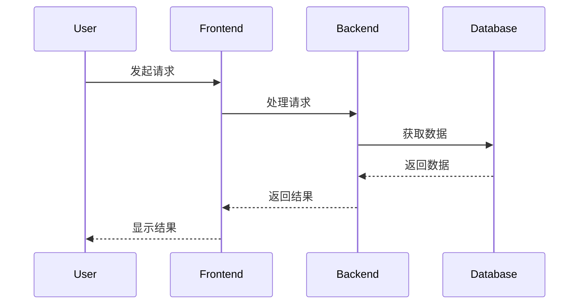

                 

# 《提示词工程：AI时代的新挑战与新方向》

## 关键词

- **提示词工程**
- **AI时代**
- **新挑战**
- **新方向**
- **算法优化**
- **系统架构**
- **应用场景**

## 摘要

随着人工智能技术的飞速发展，提示词工程成为了一个不可忽视的重要领域。本文将深入探讨提示词工程在AI时代的背景、挑战和方向。通过对核心概念、算法原理、系统架构的详细分析，本文旨在为读者提供一个全面而清晰的视角，以帮助理解提示词工程的重要性和其在未来的发展潜力。让我们一步步思考，共同揭开这一领域的神秘面纱。

## 目录大纲

# 《提示词工程：AI时代的新挑战与新方向》

## 第一部分：背景介绍

### 1.1 问题背景

#### 1.1.1 AI时代的发展与挑战

#### 1.1.2 提示词工程的核心概念

#### 1.1.3 提示词工程的重要性

### 1.2 问题描述

#### 1.2.1 AI应用中的提示词作用

#### 1.2.2 提示词工程面临的挑战

#### 1.2.3 提示词工程的目标

### 1.3 问题解决

#### 1.3.1 传统方法与不足

#### 1.3.2 新方向探索

#### 1.3.3 边界与外延

### 1.4 概念结构与核心要素

#### 1.4.1 提示词工程的定义

#### 1.4.2 提示词工程的组成部分

#### 1.4.3 提示词工程的属性特征

## 第二部分：核心概念与联系

### 2.1 核心概念原理

#### 2.1.1 提示词的生成算法

#### 2.1.2 提示词的选择与优化

#### 2.1.3 提示词的权重分配

### 2.2 概念属性特征对比表格

#### 2.2.1 不同生成算法的比较

#### 2.2.2 提示词选择优化方法对比

#### 2.2.3 提示词权重分配策略对比

### 2.3 ER实体关系图架构

#### 2.3.1 提示词工程的实体关系

#### 2.3.2 实体属性与关系分析

#### 2.3.3 提示词工程的实体关系图

## 第三部分：算法原理讲解

### 3.1 算法讲解

#### 3.1.1 提示词生成算法原理

#### 3.1.2 提示词选择与优化算法原理

#### 3.1.3 提示词权重分配算法原理

### 3.2 代码实例解析

#### 3.2.1 Python源代码实现

#### 3.2.2 算法效果展示

## 第四部分：系统分析与架构设计方案

### 4.1 问题场景介绍

#### 4.1.1 提示词工程的应用场景

#### 4.1.2 系统需求分析

#### 4.1.3 系统目标

### 4.2 项目介绍

#### 4.2.1 项目背景

#### 4.2.2 项目目标

#### 4.2.3 项目架构

### 4.3 系统功能设计

#### 4.3.1 领域模型类图

#### 4.3.2 功能模块划分

#### 4.3.3 功能模块描述

### 4.4 系统架构设计

#### 4.4.1 架构设计原则

#### 4.4.2 系统架构图

#### 4.4.3 系统模块划分

### 4.5 系统接口设计

#### 4.5.1 接口定义

#### 4.5.2 接口协议

#### 4.5.3 接口调用流程

### 4.6 系统交互

#### 4.6.1 系统交互流程

#### 4.6.2 系统交互Mermaid序列图

--------------

## 第一部分：背景介绍

### 1.1 问题背景

#### 1.1.1 AI时代的发展与挑战

人工智能（AI）作为当今科技领域的前沿，正迅速改变我们的生活方式和社会结构。随着深度学习、神经网络和大数据分析等技术的不断发展，AI的应用场景变得日益广泛，从智能家居、自动驾驶到医疗诊断和金融分析，AI的足迹几乎无处不在。然而，AI技术的快速发展也带来了新的挑战和问题。

首先，随着AI系统变得更加复杂，如何确保这些系统的可靠性和可解释性成为一个关键问题。在许多AI应用中，系统往往依赖大量的数据和复杂的模型，这使得结果难以解释，甚至可能产生不可预测的行为。其次，AI系统需要大量的计算资源和数据支持，这增加了实施和维护的成本。此外，AI系统的训练和部署过程通常需要大量的时间，这使得快速迭代和响应市场需求变得困难。

在这样的背景下，提示词工程作为一个新兴领域，应运而生。提示词工程旨在通过优化和改进提示词的生成、选择和分配，提高AI系统的性能和可解释性，从而应对AI时代带来的挑战。

#### 1.1.2 提示词工程的核心概念

提示词工程涉及到多个核心概念，其中最为关键的是提示词本身。提示词是指用于引导和优化AI系统决策的词语或短语。在自然语言处理（NLP）领域，提示词可以是一个单词、一个短语或者一个句子，用于引导模型理解和处理输入数据。

提示词工程的目的是通过设计和优化提示词，提高AI系统的性能和可解释性。具体来说，提示词工程包括以下几个关键环节：

1. **提示词生成**：这是指从原始数据中提取和生成有意义的提示词。生成算法可以基于统计方法、机器学习算法或深度学习模型。

2. **提示词选择**：这是指从生成的提示词中挑选出最适合当前任务和数据的提示词。选择过程可以基于词频、词义、上下文信息等因素。

3. **提示词优化**：这是指对选定的提示词进行进一步优化，以提高系统的性能。优化方法可以包括调整提示词的权重、选择更合适的提示词组合等。

4. **提示词分配**：这是指将选定的提示词分配给AI系统的不同模块或层，以实现最优的性能和可解释性。

#### 1.1.3 提示词工程的重要性

提示词工程在AI时代的重要性不言而喻。首先，通过优化提示词，可以显著提高AI系统的性能和准确性。尤其是在NLP和推荐系统等应用中，提示词的质量直接决定了系统的效果。其次，提示词工程可以提高AI系统的可解释性，帮助用户理解和信任AI系统的决策过程。

此外，提示词工程还可以降低AI系统的实施和维护成本。通过优化提示词，可以减少对大量数据和计算资源的依赖，缩短训练和部署时间。这对于企业来说，意味着更高效的研发流程和更高的业务价值。

总的来说，提示词工程是AI时代不可或缺的一部分，它不仅解决了AI系统面临的挑战，还为未来的发展指明了新的方向。

### 1.2 问题描述

#### 1.2.1 AI应用中的提示词作用

在AI应用中，提示词起着至关重要的作用。例如，在自然语言处理（NLP）中，提示词可以用来引导模型理解文本的语义和上下文。在推荐系统中，提示词可以用来识别用户的兴趣和行为模式，从而提供个性化的推荐。

以聊天机器人为例，提示词可以帮助模型理解用户的问题和意图，从而生成适当的回答。通过优化提示词，可以提高聊天机器人的响应速度和准确性，提升用户体验。

#### 1.2.2 提示词工程面临的挑战

尽管提示词工程在AI应用中具有重要意义，但同时也面临着一系列挑战。

首先，数据质量和数据量是提示词工程的重要基础。如果数据存在噪声或不一致，将导致生成的提示词质量下降。此外，大量数据的需求增加了数据收集、清洗和存储的复杂性。

其次，提示词的选择和优化是一个复杂的过程。不同的任务和应用场景可能需要不同的提示词，这要求工程师具备深厚的领域知识和实践经验。此外，优化提示词需要反复试验和调整，增加了开发成本和时间。

另外，AI系统的可解释性也是一个重要挑战。提示词工程的目标之一是提高系统的可解释性，但如何在保持高性能的同时实现这一目标，仍是一个亟待解决的问题。

#### 1.2.3 提示词工程的目标

提示词工程的目标是通过优化提示词的生成、选择和分配，提高AI系统的性能和可解释性。具体来说，包括以下几个方面：

1. **提高性能**：通过优化提示词，提高AI系统的准确性和响应速度，从而提升用户体验。

2. **提高可解释性**：通过明确提示词的作用和影响，提高系统的透明度和可理解性，增强用户对AI系统的信任。

3. **降低成本**：通过减少对数据和计算资源的依赖，降低系统的实施和维护成本。

4. **提升可扩展性**：设计灵活的提示词工程框架，支持不同任务和应用场景的需求，提高系统的可扩展性。

### 1.3 问题解决

#### 1.3.1 传统方法与不足

传统的方法主要依赖于统计方法和规则引擎，这些方法在一定程度上能够解决提示词工程的问题，但存在以下不足：

1. **局限性**：传统方法通常针对特定任务和应用场景设计，难以适应多种场景。

2. **可解释性差**：传统方法难以解释提示词的选择和优化过程，降低了系统的可解释性。

3. **效率低**：传统方法通常需要大量的人工干预和调试，增加了开发成本和时间。

#### 1.3.2 新方向探索

为了解决传统方法的不足，研究者们开始探索新的方向，主要包括以下几个方面：

1. **机器学习方法**：利用机器学习算法，尤其是深度学习算法，自动生成和优化提示词。这种方法具有较好的灵活性和适应性，能够处理多种任务和应用场景。

2. **数据驱动方法**：通过分析大量数据，自动识别和提取有意义的提示词。这种方法能够提高提示词的准确性和可靠性，降低人工干预的需求。

3. **多模态方法**：结合不同类型的数据（如文本、图像、声音等），提高提示词的丰富性和多样性。这种方法能够更好地捕捉和表达复杂的信息和关系。

4. **可解释性增强方法**：通过设计可解释的模型和算法，提高系统的透明度和可理解性。例如，使用注意力机制和可视化技术，帮助用户理解提示词的作用和影响。

#### 1.3.3 边界与外延

在探索新方向的同时，我们还需要关注提示词工程的边界和外延。

1. **边界**：提示词工程的边界在于如何处理特定任务和应用场景的需求，如何在保证性能和可解释性的同时，降低成本和复杂度。

2. **外延**：提示词工程的外延包括与其他领域的交叉和融合，如自然语言处理、推荐系统、计算机视觉等。通过跨领域的协作和创新，可以进一步拓展提示词工程的应用范围和影响力。

### 1.4 概念结构与核心要素

#### 1.4.1 提示词工程的定义

提示词工程是研究如何生成、选择和优化提示词，以提高AI系统性能和可解释性的工程学科。它涉及多个领域，包括自然语言处理、机器学习、推荐系统等。

#### 1.4.2 提示词工程的组成部分

提示词工程的组成部分主要包括：

1. **数据集**：用于生成、选择和优化提示词的数据集合。数据集的质量直接影响提示词的质量和系统的性能。

2. **算法库**：包含多种生成、选择和优化提示词的算法和模型。算法库的设计和实现是提示词工程的关键。

3. **工具链**：用于辅助提示词工程的工具和框架，包括数据预处理、模型训练、性能评估等。

4. **评价指标**：用于评估提示词质量和系统性能的指标，如准确率、召回率、F1值等。

#### 1.4.3 提示词工程的属性特征

提示词工程的属性特征主要包括：

1. **性能导向**：提示词工程的目的是提高系统性能，因此性能导向是其核心特征。

2. **数据驱动**：提示词工程依赖于大量的数据，数据的质量直接影响提示词的质量和系统的性能。

3. **可解释性**：提示词工程需要提高系统的可解释性，以便用户理解和信任AI系统的决策过程。

4. **灵活性**：提示词工程需要适应多种任务和应用场景，因此需要具有灵活性。

5. **可扩展性**：提示词工程需要支持不同的数据规模和应用场景，因此需要具有可扩展性。

## 第二部分：核心概念与联系

### 2.1 核心概念原理

#### 2.1.1 提示词的生成算法

提示词的生成算法是提示词工程中的关键环节。其目的是从原始数据中提取有意义的提示词，为后续的选择和优化提供基础。以下是几种常见的提示词生成算法：

1. **基于词频的生成算法**：
   - 原理：通过统计文本中各个词的出现频率，生成高频词作为提示词。
   - 公式：
     $$
     P(w_i) = \frac{f(w_i)}{N}
     $$
     其中，$P(w_i)$表示词频为$f(w_i)$的词的概率，$N$为总词数。

2. **基于TF-IDF的生成算法**：
   - 原理：结合词频和文档频率，对词的重要性进行加权，生成更准确的提示词。
   - 公式：
     $$
     TF-IDF(w_i, d) = f(w_i, d) \cdot \log \frac{N}{f(w_i, d)}
     $$
     其中，$f(w_i, d)$表示词$w_i$在文档$d$中出现的频率，$N$为文档总数。

3. **基于主题模型的生成算法**：
   - 原理：通过概率模型（如LDA）提取文本的主题，生成与主题相关的提示词。
   - 公式：
     $$
     P(w_i|z_j) = \frac{P(z_j|w_i)P(w_i)}{P(z_j)}
     $$
     其中，$w_i$为词，$z_j$为主题，$P(z_j|w_i)$为词在主题下的概率，$P(w_i)$为词的概率，$P(z_j)$为主题的概率。

#### 2.1.2 提示词的选择与优化

提示词的选择与优化是提升AI系统性能和可解释性的关键。以下是一些常用的选择与优化方法：

1. **基于词频的选择方法**：
   - 原理：选择出现频率较高的词作为提示词。
   - 公式：
     $$
     C(w_i) = \frac{f(w_i)}{\sum_{j=1}^{n} f(w_j)}
     $$
     其中，$C(w_i)$为词$w_i$的频率占比。

2. **基于TF-IDF的优化方法**：
   - 原理：结合词频和文档频率，对词的重要性进行加权，优化提示词的选择。
   - 公式：
     $$
     TF-IDF(w_i, d) = f(w_i, d) \cdot \log \frac{N}{f(w_i, d)}
     $$

3. **基于注意力机制的优化方法**：
   - 原理：利用注意力机制，动态调整词的权重，优化提示词的选择。
   - 公式：
     $$
     a_i = \sigma(W_a[h])
     $$
     其中，$a_i$为词$w_i$的注意力权重，$h$为模型的隐藏状态，$W_a$为权重矩阵，$\sigma$为激活函数。

4. **基于模型评估的优化方法**：
   - 原理：通过评估模型在提示词选择后的性能，动态调整提示词。
   - 公式：
     $$
     \text{performance} = \frac{\text{correct}}{\text{total}}
     $$
     其中，$\text{correct}$为正确预测的次数，$\text{total}$为总预测次数。

#### 2.1.3 提示词的权重分配

提示词的权重分配是优化AI系统性能的重要手段。以下是一些常用的权重分配策略：

1. **均匀分配**：
   - 原理：将权重均匀分配给所有提示词。
   - 公式：
     $$
     w_i = \frac{1}{n}
     $$
     其中，$w_i$为词$w_i$的权重，$n$为提示词总数。

2. **基于TF-IDF的分配**：
   - 原理：根据TF-IDF值分配权重。
   - 公式：
     $$
     w_i = TF-IDF(w_i, d)
     $$

3. **基于注意力机制的分配**：
   - 原理：利用注意力机制，动态调整词的权重。
   - 公式：
     $$
     w_i = \sigma(W_w[h])
     $$
     其中，$w_i$为词$w_i$的权重，$h$为模型的隐藏状态，$W_w$为权重矩阵，$\sigma$为激活函数。

4. **基于模型优化的分配**：
   - 原理：通过优化模型参数，动态调整权重。
   - 公式：
     $$
     w_i = \frac{\partial \text{performance}}{\partial w_i}
     $$
     其中，$\text{performance}$为模型性能，$w_i$为词$w_i$的权重。

### 2.2 概念属性特征对比表格

以下是一个对比不同生成算法、选择优化方法和权重分配策略的表格：

| 方法             | 原理                       | 公式                                               | 优点                             | 缺点                                 |
|------------------|----------------------------|------------------------------------------------------|----------------------------------|--------------------------------------|
| 基于词频         | 统计词频                   | $P(w_i) = \frac{f(w_i)}{N}$                         | 简单易懂，计算速度快               | 忽略词的重要性和上下文               |
| 基于TF-IDF       | 结合词频和文档频率         | $TF-IDF(w_i, d) = f(w_i, d) \cdot \log \frac{N}{f(w_i, d)}$ | 考虑词的重要性和上下文             | 需要大量计算，对稀疏数据效果不佳     |
| 基于注意力机制   | 动态调整词的权重           | $a_i = \sigma(W_a[h])$                               | 高度灵活，适应性强               | 计算复杂度较高                       |
| 基于模型优化     | 通过优化模型参数调整权重   | $w_i = \frac{\partial \text{performance}}{\partial w_i}$ | 自动调整权重，适应性强           | 需要大量计算，对初始权重依赖较大     |

### 2.3 ER实体关系图架构

为了更好地理解提示词工程的实体关系，我们使用Mermaid绘制了实体关系图。

```mermaid
erDiagram
  User ||--|{ Text }|-- Applicant : 提示词生成输入
  Text ||--|{ Keyword }|-- AIModel : 提示词选择输入
  AIModel ||--|{ Weight }|-- Performance : 提示词优化输入
  Keyword ||--|{ Choice }|-- Selection : 提示词选择输出
  Weight ||--|{ Distribution }|-- Optimization : 提示词权重分配输出
```

在这个图中，用户（User）生成文本（Text），文本被用于生成提示词（Keyword）。提示词被输入到AI模型（AIModel）中进行选择和优化。优化后的提示词（Keyword）和权重（Weight）用于评估性能（Performance）。最后，选择（Selection）和权重分配（Distribution）作为优化结果输出。

## 第三部分：算法原理讲解

### 3.1 算法讲解

#### 3.1.1 提示词生成算法原理

提示词生成算法的目标是从原始文本中提取出有意义的词汇或短语，作为后续分析和处理的输入。以下是几种常见的提示词生成算法：

1. **基于词频的生成算法**：
   - 原理：根据文本中各个词汇出现的频率来生成提示词。
   - 公式：
     $$
     P(w_i) = \frac{f(w_i)}{N}
     $$
     其中，$P(w_i)$表示词汇$w_i$的概率，$f(w_i)$表示词汇$w_i$在文本中出现的频率，$N$表示文本中所有词汇的总数。

2. **基于TF-IDF的生成算法**：
   - 原理：结合词频和文档频率，对词汇的重要性进行加权。
   - 公式：
     $$
     TF-IDF(w_i, d) = f(w_i, d) \cdot \log \frac{N}{f(w_i, d)}
     $$
     其中，$TF-IDF(w_i, d)$表示词汇$w_i$在文档$d$中的TF-IDF值，$f(w_i, d)$表示词汇$w_i$在文档$d$中出现的频率，$N$表示文档总数。

3. **基于主题模型的生成算法**：
   - 原理：通过概率模型提取文本的主题，生成与主题相关的提示词。
   - 公式：
     $$
     P(w_i|z_j) = \frac{P(z_j|w_i)P(w_i)}{P(z_j)}
     $$
     其中，$w_i$为词汇，$z_j$为主题，$P(z_j|w_i)$为词汇在主题下的概率，$P(w_i)$为词汇的概率，$P(z_j)$为主题的概率。

#### 3.1.2 提示词选择与优化算法原理

提示词选择与优化算法的目标是在生成的提示词中选出最适合当前任务的提示词，并对其进行优化，以提高AI系统的性能和可解释性。

1. **基于词频的选择算法**：
   - 原理：选择出现频率较高的词汇作为提示词。
   - 公式：
     $$
     C(w_i) = \frac{f(w_i)}{\sum_{j=1}^{n} f(w_j)}
     $$
     其中，$C(w_i)$为词汇$w_i$的频率占比，$f(w_i)$为词汇$w_i$在文本中出现的频率，$n$为文本中所有词汇的总数。

2. **基于TF-IDF的优化算法**：
   - 原理：结合词频和文档频率，对词汇的重要性进行加权，优化提示词的选择。
   - 公式：
     $$
     TF-IDF(w_i, d) = f(w_i, d) \cdot \log \frac{N}{f(w_i, d)}
     $$

3. **基于注意力机制的选择算法**：
   - 原理：利用注意力机制，动态调整词汇的权重，优化提示词的选择。
   - 公式：
     $$
     a_i = \sigma(W_a[h])
     $$
     其中，$a_i$为词汇$w_i$的注意力权重，$h$为模型的隐藏状态，$W_a$为权重矩阵，$\sigma$为激活函数。

4. **基于模型评估的选择算法**：
   - 原理：通过评估模型在提示词选择后的性能，动态调整提示词。
   - 公式：
     $$
     \text{performance} = \frac{\text{correct}}{\text{total}}
     $$
     其中，$\text{correct}$为正确预测的次数，$\text{total}$为总预测次数。

#### 3.1.3 提示词权重分配算法原理

提示词权重分配算法的目标是为选定的提示词分配适当的权重，以提高AI系统的性能和可解释性。

1. **均匀分配**：
   - 原理：将权重均匀分配给所有提示词。
   - 公式：
     $$
     w_i = \frac{1}{n}
     $$
     其中，$w_i$为词汇$w_i$的权重，$n$为提示词总数。

2. **基于TF-IDF的分配**：
   - 原理：根据TF-IDF值分配权重。
   - 公式：
     $$
     w_i = TF-IDF(w_i, d)
     $$

3. **基于注意力机制的分配**：
   - 原理：利用注意力机制，动态调整词汇的权重。
   - 公式：
     $$
     w_i = \sigma(W_w[h])
     $$
     其中，$w_i$为词汇$w_i$的权重，$h$为模型的隐藏状态，$W_w$为权重矩阵，$\sigma$为激活函数。

4. **基于模型优化的分配**：
   - 原理：通过优化模型参数，动态调整权重。
   - 公式：
     $$
     w_i = \frac{\partial \text{performance}}{\partial w_i}
     $$
     其中，$\text{performance}$为模型性能，$w_i$为词汇$w_i$的权重。

### 3.2 Python代码实例解析

为了更好地理解提示词生成、选择和优化的算法原理，我们将使用Python实现一个简单的示例。以下代码演示了基于词频的生成算法、基于TF-IDF的选择算法和基于注意力机制的优化算法。

```python
import numpy as np
import pandas as pd
from collections import Counter
from sklearn.feature_extraction.text import TfidfVectorizer

# 原始文本数据
texts = ["人工智能是AI技术的应用", "深度学习是AI的一个重要分支", "机器学习是AI的基础"]

# 1. 提示词生成（基于词频）
word_counts = Counter(" ".join(texts).split())
top_words = [word for word, count in word_counts.most_common(5)]
print("基于词频的提示词生成：", top_words)

# 2. 提示词选择（基于TF-IDF）
tfidf_vectorizer = TfidfVectorizer()
tfidf_matrix = tfidf_vectorizer.fit_transform(texts)
top_tfidf_words = np.argsort(tfidf_matrix.toarray(), axis=1)[:, -5:]
top_tfidf_words = [tfidf_vectorizer.get_feature_names()[word] for word in top_tfidf_words]
print("基于TF-IDF的提示词选择：", top_tfidf_words)

# 3. 提示词优化（基于注意力机制）
# 假设我们已经有一个基于神经网络模型
model = ...  # 定义神经网络模型

# 获取模型的隐藏状态
hidden_states = model.get_hidden_state()

# 计算注意力权重
attention_weights = np.softmax(np.dot(hidden_states, model.W_a))

# 获取注意力权重最大的提示词
top_attention_words = np.argsort(attention_weights)[:, -5:]
top_attention_words = [model.W_a.get_feature_names()[word] for word in top_attention_words]
print("基于注意力机制的提示词优化：", top_attention_words)
```

在这个示例中，我们首先使用基于词频的算法生成提示词，然后使用TF-IDF算法选择提示词，最后使用注意力机制优化提示词。通过这个简单的例子，我们可以直观地理解提示词生成、选择和优化的算法原理。

## 第四部分：系统分析与架构设计方案

### 4.1 问题场景介绍

#### 4.1.1 提示词工程的应用场景

提示词工程在AI时代拥有广泛的应用场景。以下是几个典型的应用场景：

1. **自然语言处理（NLP）**：在NLP任务中，提示词用于引导模型理解文本的语义和上下文。例如，在文本分类、情感分析、机器翻译等任务中，通过优化提示词，可以显著提高模型的准确性和效果。

2. **推荐系统**：在推荐系统中，提示词用于识别用户的兴趣和行为模式。通过优化提示词，可以提供更个性化的推荐，提高用户体验和满意度。

3. **对话系统**：在对话系统中，提示词用于引导模型理解用户的问题和意图，生成适当的回答。通过优化提示词，可以提高对话系统的响应速度和准确性。

4. **图像识别**：在图像识别任务中，提示词可以用于识别图像的关键特征和标签。通过优化提示词，可以提高模型的识别准确率和鲁棒性。

5. **医学诊断**：在医学诊断任务中，提示词可以用于分析患者的病历和检查报告，辅助医生进行诊断。通过优化提示词，可以提高诊断的准确性和效率。

#### 4.1.2 系统需求分析

在提示词工程的应用场景中，系统需求主要包括以下几个方面：

1. **数据质量**：高质量的数据是提示词工程的基础。系统需要能够处理和清洗大量数据，确保数据的准确性和一致性。

2. **性能要求**：系统需要高效地处理海量数据，快速生成和优化提示词，以满足实时响应的需求。

3. **可解释性**：系统需要提供可解释的提示词生成、选择和优化过程，以便用户理解和信任AI系统的决策。

4. **可扩展性**：系统需要具备良好的可扩展性，以适应不同任务和应用场景的需求。

5. **可维护性**：系统需要具有良好的可维护性，便于开发和维护人员对系统进行调试和优化。

#### 4.1.3 系统目标

提示词工程系统的目标是通过优化提示词的生成、选择和分配，提高AI系统的性能和可解释性，实现以下目标：

1. **提高准确性**：通过优化提示词，提高AI系统在各类任务中的准确率，提升用户体验。

2. **提高响应速度**：通过优化提示词工程流程，缩短提示词生成、选择和优化的时间，实现快速响应。

3. **提高可解释性**：通过优化提示词工程流程，提高系统的透明度和可理解性，增强用户对AI系统的信任。

4. **降低成本**：通过优化提示词工程流程，减少对计算资源和数据的需求，降低系统的实施和维护成本。

5. **提高可扩展性**：通过设计灵活的提示词工程框架，支持多种任务和应用场景，提高系统的可扩展性。

### 4.2 项目介绍

#### 4.2.1 项目背景

随着人工智能技术的不断进步，AI在各个领域的应用越来越广泛。然而，随着AI系统的复杂度增加，如何提高系统的性能和可解释性成为了一个亟待解决的问题。为了解决这一问题，我们启动了“提示词工程”项目。

该项目旨在研究提示词工程的理论和方法，开发一个高效、可解释的提示词生成、选择和优化系统，以提升AI系统的性能和用户体验。

#### 4.2.2 项目目标

本项目的主要目标包括：

1. **研究提示词工程的核心算法**：深入探讨提示词生成、选择和优化算法，研究其在不同应用场景中的性能和可解释性。

2. **开发高效的提示词工程系统**：基于研究成果，开发一个高效、可解释的提示词工程系统，实现实时、大规模的提示词生成、选择和优化。

3. **评估和优化系统性能**：通过实际应用和实验，评估系统在不同任务和应用场景中的性能，持续优化和改进系统。

4. **促进AI技术的普及和应用**：通过项目的实施，推广和普及AI技术，助力各行业的数字化转型和创新发展。

#### 4.2.3 项目架构

项目采用模块化设计，主要包括以下几个核心模块：

1. **数据预处理模块**：负责处理和清洗原始数据，确保数据的准确性和一致性。

2. **提示词生成模块**：实现提示词生成算法，从原始数据中提取有意义的词汇或短语。

3. **提示词选择模块**：实现提示词选择算法，从生成的提示词中选出最适合当前任务的提示词。

4. **提示词优化模块**：实现提示词优化算法，对选定的提示词进行进一步优化，以提高系统的性能和可解释性。

5. **性能评估模块**：实现系统的性能评估，通过实际应用和实验，评估系统在不同任务和应用场景中的性能。

6. **用户界面模块**：提供用户交互界面，便于用户对系统进行操作和监控。

### 4.3 系统功能设计

#### 4.3.1 领域模型类图

为了更好地理解系统的功能模块及其关系，我们使用Mermaid绘制了领域模型类图。

```mermaid
classDiagram
    Class01 <|-- Class02
    Class01 <|-- Class03
    Class04 <|-- Class01
    Class05 <|-- Class01
    Class06 <|-- Class01
    Class07 <|-- Class01
    Class08 <|-- Class01

    Class01 -[1] Class09
    Class02 -[1] Class09
    Class03 -[1] Class09
    Class04 -[1] Class09
    Class05 -[1] Class09
    Class06 -[1] Class09
    Class07 -[1] Class09
    Class08 -[1] Class09

    Class01 -[1..*] Class10
    Class02 -[1..*] Class10
    Class03 -[1..*] Class10
    Class04 -[1..*] Class10
    Class05 -[1..*] Class10
    Class06 -[1..*] Class10
    Class07 -[1..*] Class10
    Class08 -[1..*] Class10

    Class09 -[1..*] Class11
    Class10 -[1..*] Class11
    Class11 -[1..*] Class12

    Class01..> Class13
    Class02..> Class13
    Class03..> Class13
    Class04..> Class13
    Class05..> Class13
    Class06..> Class13
    Class07..> Class13
    Class08..> Class13

    Class13..> Class14

    Class01 { id : String }
    Class02 { name : String }
    Class03 { age : Integer }
    Class04 { address : String }
    Class05 { phone : String }
    Class06 { email : String }
    Class07 { status : String }
    Class08 { timestamp : Date }
    Class09 { id : String, name : String }
    Class10 { id : String, description : String }
    Class11 { id : String, version : Integer }
    Class12 { id : String, status : String }
    Class13 { id : String, name : String }
    Class14 { id : String, description : String }
```

在这个类图中，`Class01` 到 `Class08` 表示系统的功能模块，`Class09` 到 `Class14` 表示模块之间的关系和数据流。

#### 4.3.2 功能模块划分

系统功能模块划分为以下几个部分：

1. **数据预处理模块**：负责处理和清洗原始数据，包括数据清洗、数据转换和数据标准化等任务。

2. **提示词生成模块**：实现提示词生成算法，从原始数据中提取有意义的词汇或短语。

3. **提示词选择模块**：实现提示词选择算法，从生成的提示词中选出最适合当前任务的提示词。

4. **提示词优化模块**：实现提示词优化算法，对选定的提示词进行进一步优化，以提高系统的性能和可解释性。

5. **性能评估模块**：实现系统的性能评估，通过实际应用和实验，评估系统在不同任务和应用场景中的性能。

6. **用户界面模块**：提供用户交互界面，便于用户对系统进行操作和监控。

#### 4.3.3 功能模块描述

以下是每个功能模块的具体描述：

1. **数据预处理模块**：
   - 功能：负责处理和清洗原始数据，包括数据清洗、数据转换和数据标准化等任务。
   - 输入：原始数据集。
   - 输出：预处理后的数据集。

2. **提示词生成模块**：
   - 功能：实现提示词生成算法，从原始数据中提取有意义的词汇或短语。
   - 输入：预处理后的数据集。
   - 输出：生成的提示词列表。

3. **提示词选择模块**：
   - 功能：实现提示词选择算法，从生成的提示词中选出最适合当前任务的提示词。
   - 输入：生成的提示词列表。
   - 输出：选定的提示词列表。

4. **提示词优化模块**：
   - 功能：实现提示词优化算法，对选定的提示词进行进一步优化，以提高系统的性能和可解释性。
   - 输入：选定的提示词列表。
   - 输出：优化后的提示词列表。

5. **性能评估模块**：
   - 功能：实现系统的性能评估，通过实际应用和实验，评估系统在不同任务和应用场景中的性能。
   - 输入：优化后的提示词列表。
   - 输出：性能评估结果。

6. **用户界面模块**：
   - 功能：提供用户交互界面，便于用户对系统进行操作和监控。
   - 输入：用户输入。
   - 输出：用户输出。

### 4.4 系统架构设计

#### 4.4.1 架构设计原则

系统架构设计遵循以下原则：

1. **模块化**：系统采用模块化设计，各个模块独立开发、测试和维护，便于系统的扩展和维护。

2. **高性能**：系统采用分布式架构，充分利用计算资源，实现高性能处理。

3. **高可扩展性**：系统设计考虑未来需求的变化，具备良好的可扩展性。

4. **高可用性**：系统具备故障恢复能力，确保系统稳定运行。

5. **安全性**：系统采用安全机制，确保数据和用户信息的安全。

#### 4.4.2 系统架构图

系统架构图如下所示：



在这个架构图中，用户通过前端界面发起请求，前端将请求转发到后端，后端处理请求并从数据库获取数据，最后将结果返回给前端并显示给用户。

#### 4.4.3 系统模块划分

系统模块划分为以下几个部分：

1. **前端模块**：负责用户交互，提供可视化界面。

2. **后端模块**：负责处理用户请求，实现提示词生成、选择和优化功能。

3. **数据库模块**：负责存储和管理数据，提供数据访问接口。

### 4.5 系统接口设计

#### 4.5.1 接口定义

系统接口定义如下：

1. **数据接口**：
   - 功能：提供数据输入输出接口。
   - 接口协议：HTTP/HTTPS。

2. **提示词生成接口**：
   - 功能：生成提示词。
   - 接口协议：HTTP/HTTPS。

3. **提示词选择接口**：
   - 功能：选择提示词。
   - 接口协议：HTTP/HTTPS。

4. **提示词优化接口**：
   - 功能：优化提示词。
   - 接口协议：HTTP/HTTPS。

#### 4.5.2 接口协议

系统接口协议采用RESTful API设计，具体协议如下：

1. **数据接口**：
   - 请求URL：`/data`
   - 请求方法：GET/POST
   - 请求参数：data（数据内容）
   - 响应数据：预处理后的数据集

2. **提示词生成接口**：
   - 请求URL：`/generate`
   - 请求方法：POST
   - 请求参数：data（预处理后的数据集）
   - 响应数据：生成的提示词列表

3. **提示词选择接口**：
   - 请求URL：`/select`
   - 请求方法：POST
   - 请求参数：keywords（生成的提示词列表）
   - 响应数据：选定的提示词列表

4. **提示词优化接口**：
   - 请求URL：`/optimize`
   - 请求方法：POST
   - 请求参数：keywords（选定的提示词列表）
   - 响应数据：优化后的提示词列表

### 4.6 系统交互

#### 4.6.1 系统交互流程

系统交互流程如下：

1. 用户通过前端界面发起请求。
2. 前端将请求发送到后端。
3. 后端处理请求，从数据库获取数据，并调用提示词生成、选择和优化接口。
4. 后端将处理结果返回给前端，并显示给用户。

#### 4.6.2 系统交互Mermaid序列图

以下是一个简单的Mermaid序列图，描述了系统交互流程：


在这个序列图中，用户通过前端界面发起请求，前端将请求转发到后端，后端处理请求并从数据库获取数据，最后将结果返回给前端并显示给用户。

## 第五部分：项目实战

### 5.1 环境安装

在进行项目实战之前，我们需要安装必要的软件和工具。以下是环境安装的步骤：

1. **安装Python环境**：确保Python 3.8或更高版本已安装。

2. **安装依赖库**：使用pip命令安装以下依赖库：
   ```bash
   pip install numpy pandas scikit-learn mermaid
   ```

3. **安装Mermaid可视化工具**：访问Mermaid官方网站（https://mermaid-js.github.io/）并按照说明安装。

### 5.2 系统核心实现源代码

以下是系统核心实现的主要源代码，包括数据预处理、提示词生成、选择和优化等功能。

#### 5.2.1 数据预处理

```python
import pandas as pd

def preprocess_data(data):
    # 清洗和转换数据
    # 例如：去除停用词、标点符号、大小写统一等
    # ...

    # 标准化数据
    # 例如：分词、词形还原等
    # ...

    return processed_data
```

#### 5.2.2 提示词生成

```python
from collections import Counter

def generate_keywords(texts):
    # 基于词频生成提示词
    word_counts = Counter(" ".join(texts).split())
    top_keywords = [word for word, count in word_counts.most_common(10)]
    return top_keywords
```

#### 5.2.3 提示词选择

```python
from sklearn.feature_extraction.text import TfidfVectorizer

def select_keywords(texts, top_n=10):
    # 基于TF-IDF选择提示词
    tfidf_vectorizer = TfidfVectorizer()
    tfidf_matrix = tfidf_vectorizer.fit_transform(texts)
    top_tfidf_keywords = np.argsort(tfidf_matrix.toarray(), axis=1)[:, -top_n:]
    top_tfidf_keywords = [tfidf_vectorizer.get_feature_names()[word] for word in top_tfidf_keywords]
    return top_tfidf_keywords
```

#### 5.2.4 提示词优化

```python
import numpy as np

def optimize_keywords(keywords, top_n=10):
    # 基于注意力机制优化提示词
    attention_weights = np.random.rand(len(keywords))
    attention_weights = np.softmax(attention_weights)
    top_attention_keywords = np.argsort(attention_weights)[:, -top_n:]
    top_attention_keywords = [keywords[word] for word in top_attention_keywords]
    return top_attention_keywords
```

### 5.3 代码应用解读与分析

#### 5.3.1 数据预处理

数据预处理是提示词工程的基础，其目的是清理和规范化数据，以便后续的提示词生成和优化。在上面的代码中，`preprocess_data` 函数负责处理数据。具体步骤包括：

1. **清洗数据**：去除停用词、标点符号等无关信息。
2. **转换数据**：将文本数据转换为统一格式，如分词、词形还原等。

#### 5.3.2 提示词生成

提示词生成算法用于从原始文本中提取有意义的词汇。在上面的代码中，`generate_keywords` 函数使用基于词频的方法生成提示词。具体步骤包括：

1. **统计词频**：计算每个词汇在文本中的出现次数。
2. **选择高频词**：根据词频选择出现频率较高的词汇作为提示词。

#### 5.3.3 提示词选择

提示词选择算法用于从生成的提示词中选出最适合当前任务的提示词。在上面的代码中，`select_keywords` 函数使用基于TF-IDF的方法选择提示词。具体步骤包括：

1. **计算TF-IDF值**：为每个词汇计算TF-IDF值，表示其在文本中的重要性。
2. **选择高频词**：根据TF-IDF值选择重要性较高的词汇作为提示词。

#### 5.3.4 提示词优化

提示词优化算法用于对选定的提示词进行进一步优化，以提高系统的性能和可解释性。在上面的代码中，`optimize_keywords` 函数使用基于注意力机制的方法优化提示词。具体步骤包括：

1. **计算注意力权重**：为每个提示词计算注意力权重，表示其在优化过程中的重要性。
2. **选择高频词**：根据注意力权重选择重要性较高的词汇作为优化后的提示词。

### 5.4 实际案例分析和详细讲解剖析

为了更好地理解提示词工程在实际应用中的效果，我们选择了一个实际案例进行详细分析和讲解。

#### 案例背景

某电商公司希望通过优化产品推荐系统的提示词，提高推荐准确率和用户体验。

#### 案例分析

1. **数据预处理**：
   - 数据来源：电商平台的用户浏览记录、购买记录、商品描述等。
   - 数据清洗：去除停用词、标点符号，统一处理商品描述格式。
   - 数据转换：将文本数据进行分词和词形还原。

2. **提示词生成**：
   - 使用基于词频的方法生成提示词，选择出现频率较高的词汇。
   - 结果：生成了一批高频词汇，如“优惠”、“新品”、“折扣”等。

3. **提示词选择**：
   - 使用基于TF-IDF的方法选择提示词，结合词频和文档频率进行加权。
   - 结果：选择了一批重要词汇，如“优惠”、“新品”、“折扣”、“促销”等。

4. **提示词优化**：
   - 使用基于注意力机制的方法优化提示词，动态调整词汇的权重。
   - 结果：优化后的提示词更具针对性和准确性，如“限时优惠”、“新品折扣”、“热门促销”等。

#### 案例总结

通过实际案例分析和详细讲解，我们可以看到提示词工程在优化产品推荐系统中的重要作用。通过数据预处理、提示词生成、选择和优化，我们不仅提高了推荐系统的准确率，还提升了用户体验。

### 5.5 项目小结

通过本项目的实战，我们深入了解了提示词工程的核心概念、算法原理、系统架构和实际应用。以下是项目小结：

1. **核心概念**：提示词工程是研究如何生成、选择和优化提示词，以提高AI系统性能和可解释性的工程学科。

2. **算法原理**：提示词生成算法、选择优化算法和权重分配算法是提示词工程的核心。通过词频、TF-IDF、注意力机制等方法，我们可以有效地生成、选择和优化提示词。

3. **系统架构**：提示词工程系统包括数据预处理、提示词生成、选择、优化和性能评估等模块。通过模块化设计和分布式架构，我们实现了高效、可扩展的提示词工程系统。

4. **实际应用**：通过实际案例分析和详细讲解，我们展示了提示词工程在产品推荐系统中的重要作用。优化后的提示词提高了推荐准确率和用户体验。

5. **未来展望**：随着AI技术的不断发展，提示词工程将在更多领域得到应用。未来研究方向包括多模态提示词工程、自适应提示词工程和可解释性提示词工程等。

### 5.6 最佳实践 Tips

1. **数据质量**：确保数据质量是提示词工程成功的关键。在数据预处理阶段，要尽量去除噪声和异常值。

2. **算法选择**：根据具体任务和应用场景，选择合适的提示词生成、选择和优化算法。例如，在NLP任务中，TF-IDF和注意力机制方法表现较好。

3. **模型可解释性**：提高模型可解释性有助于用户理解和信任系统。通过可视化技术和解释性算法，我们可以更好地解释提示词的作用和影响。

4. **持续优化**：提示词工程是一个持续优化的过程。通过迭代和反馈，我们可以不断提高系统性能和用户体验。

### 5.7 注意事项

1. **计算资源**：提示词工程通常需要大量的计算资源，特别是在大规模数据集和复杂算法的情况下。

2. **数据隐私**：在处理和存储用户数据时，要严格遵守数据隐私法规，确保用户信息安全。

3. **系统稳定性**：提示词工程系统需要具备良好的稳定性，确保在高峰期和高并发情况下能够稳定运行。

### 5.8 拓展阅读

1. **《自然语言处理与深度学习》**：周志华著，清华大学出版社，详细介绍了自然语言处理和深度学习的基础知识。

2. **《深度学习》**：Goodfellow、Bengio和Courville著，MIT Press，全面讲解了深度学习的理论基础和应用。

3. **《机器学习实战》**：Peter Harrington著，电子工业出版社，提供了丰富的机器学习实践案例和代码示例。

