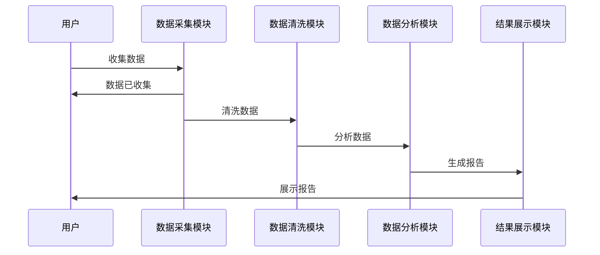
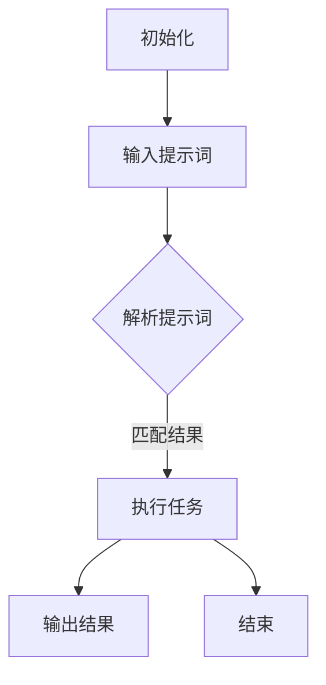
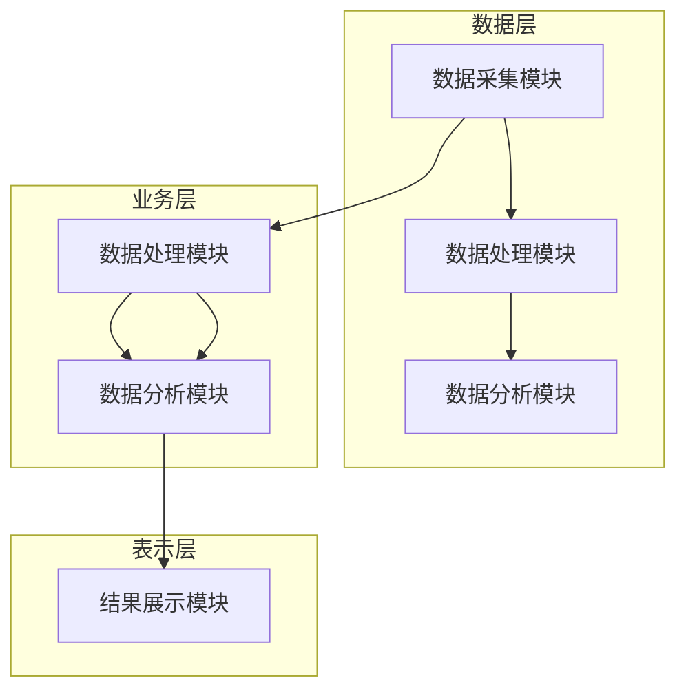
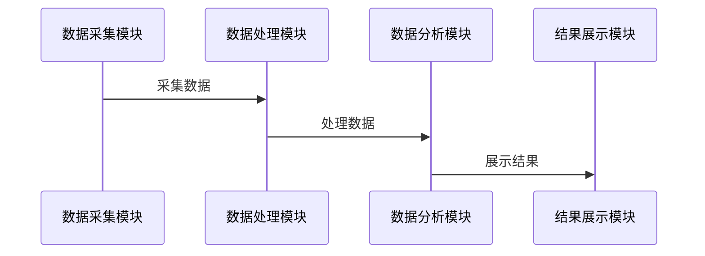

                 


### 第一部分: 引言

#### 1.1 问题背景

在自动化科技迅猛发展的今天，评估其对各方面的影响成为了一个重要课题。自动化科技的应用不仅改变了生产方式，也影响了社会结构、经济模式、就业状况等多个方面。为了更好地理解这些影响，并为其制定合适的策略，有必要进行有效的科技影响评估。

#### 1.2 问题描述

科技影响评估通常涉及以下几个方面：技术发展对经济的影响、对就业的影响、对教育的影响、对环境保护的影响等。评估的目的是为了了解自动化科技在给社会带来便利的同时，可能产生的负面影响，以便采取措施减少或避免这些影响。

#### 1.3 问题解决

提示词编程（Prompt Programming）作为一种先进的编程技术，通过提供简明的提示词，可以大幅提高编程效率和准确性。在自动化科技影响评估中，提示词编程可以用于快速构建评估模型，提高评估的准确性和效率。

#### 1.4 边界与外延

本书的讨论范围主要集中在大数据和人工智能技术在自动化科技影响评估中的应用，特别是提示词编程这一工具的使用。然而，自动化科技的评估是一个广泛的领域，涉及众多其他技术和方法，如数据挖掘、机器学习、模拟仿真等。

#### 1.5 概念结构与核心要素组成

本书的核心概念包括：自动化科技、科技影响评估、提示词编程、大数据、人工智能等。这些概念相互关联，共同构成了自动化科技影响评估的理论基础。

#### 1.6 本章小结

通过对自动化科技影响评估的背景、问题描述、问题解决方法以及相关概念的介绍，为后续章节的深入讨论奠定了基础。

----------------------------------------------------------------

### 第二部分: 提示词编程基础

#### 2.1 提示词编程的概念与原理

##### 2.1.1 提示词编程的定义
提示词编程是一种通过提供简洁、明确的提示词来引导程序执行的方式，它不同于传统的编程方式，强调用户的参与和指导。

##### 2.1.2 提示词编程的工作原理
提示词编程通过预定义的提示词与系统内置的规则或模型进行匹配，从而实现自动化任务执行。

##### 2.1.3 提示词编程与传统编程的区别
与传统编程相比，提示词编程更加灵活、易于使用，能够快速适应复杂多变的需求。

#### 2.2 提示词编程的优势与应用场景

##### 2.2.1 提示词编程的优势
提示词编程具有以下优势：降低编程门槛、提高编程效率、降低错误率、易于维护和扩展等。

##### 2.2.2 提示词编程的应用场景
提示词编程适用于多种场景，如自动化测试、自动化部署、自动化报告生成等。

#### 2.3 主流提示词编程工具与框架

##### 2.3.1 Python Prompt Toolkit
Python Prompt Toolkit 是一个强大的提示词编程工具，支持丰富的交互功能和定制选项。

##### 2.3.2 Microsoft Bot Framework
Microsoft Bot Framework 提供了一套完整的提示词编程框架，适用于构建智能对话机器人。

##### 2.3.3 其他提示词编程工具
如Node.js的Inquirer.js、Ruby的Promptly等，都是优秀的提示词编程工具。

#### 2.4 提示词编程在自动化科技影响评估中的应用

##### 2.4.1 提示词编程在数据采集中的应用
通过提示词编程，可以自动化地收集与科技影响相关的数据，提高数据采集的效率和准确性。

##### 2.4.2 提示词编程在数据清洗中的应用
提示词编程可以帮助自动化地处理数据清洗过程中的各种任务，如缺失值填充、异常值检测等。

##### 2.4.3 提示词编程在数据分析中的应用
利用提示词编程，可以自动化地执行数据分析任务，如数据可视化、关联规则挖掘等。

#### 2.5 本章小结

通过对提示词编程的概念、原理、优势、应用场景以及其在自动化科技影响评估中的应用的介绍，为后续章节的深入讨论提供了必要的知识基础。

----------------------------------------------------------------

### 第三部分: 自动化科技影响评估方法

#### 3.1 自动化科技影响评估的核心要素

##### 3.1.1 经济影响评估
自动化科技对经济的促进和抑制作用，包括对生产效率、就业率、经济增长等方面的评估。

##### 3.1.2 社会影响评估
自动化科技对教育、就业、社会结构等方面的影响，包括社会公平性、社会稳定性等方面的评估。

##### 3.1.3 环境影响评估
自动化科技对环境保护的影响，包括能源消耗、碳排放、生态环境变化等方面的评估。

#### 3.2 自动化科技影响评估的技术方法

##### 3.2.1 数据挖掘与统计分析
通过数据挖掘和统计分析方法，对大量数据进行分析，找出自动化科技影响的关键因素和规律。

##### 3.2.2 机器学习与深度学习
利用机器学习与深度学习算法，构建自动化科技影响的预测模型，提高评估的准确性和可靠性。

##### 3.2.3 模拟仿真与实验验证
通过模拟仿真和实验验证，模拟自动化科技在不同场景下的影响，评估其可能带来的后果。

#### 3.3 自动化科技影响评估的应用实例

##### 3.3.1 自动化技术在制造业中的应用
通过对制造业中自动化技术的应用进行评估，分析其对生产效率、就业结构的影响。

##### 3.3.2 自动驾驶技术在交通领域中的应用
评估自动驾驶技术在交通领域中的应用，分析其对交通安全、交通效率的影响。

##### 3.3.3 人工智能在医疗领域的应用
分析人工智能在医疗领域的应用，评估其对医疗服务、医疗成本的影响。

#### 3.4 本章小结

通过对自动化科技影响评估的核心要素、技术方法和应用实例的介绍，为深入理解和应用自动化科技影响评估提供了实践指导。

----------------------------------------------------------------

### 第四部分: 提示词编程在自动化科技影响评估中的应用实践

#### 4.1 实践背景

在本部分，我们将通过一个实际案例来展示提示词编程在自动化科技影响评估中的应用。该案例涉及自动化技术在制造业中的应用评估。

#### 4.2 项目介绍

本项目旨在评估自动化技术在制造业中的应用对生产效率、就业率的影响。为了实现这一目标，我们采用了以下步骤：

1. 数据收集：通过问卷、访谈等方式收集相关企业对自动化技术应用的情况和数据。
2. 数据清洗：使用提示词编程工具对收集到的数据进行清洗和预处理。
3. 数据分析：利用提示词编程构建分析模型，对清洗后的数据进行深入分析。
4. 结果评估：根据分析结果，评估自动化技术在制造业中的应用对生产效率和就业率的影响。

#### 4.3 系统功能设计

在本项目中，系统功能设计主要包括以下模块：

1. 数据采集模块：负责收集自动化技术在制造业中的应用情况数据。
2. 数据清洗模块：负责对采集到的数据进行清洗和预处理。
3. 数据分析模块：负责构建分析模型，对预处理后的数据进行深入分析。
4. 结果展示模块：负责将分析结果以图表、报告等形式展示给用户。

#### 4.4 系统架构设计

本项目的系统架构设计采用分层架构，包括数据层、业务层和表示层。其中：

1. 数据层：负责存储和管理数据。
2. 业务层：负责实现业务逻辑，包括数据清洗、数据分析等功能。
3. 表示层：负责与用户交互，展示分析结果。

#### 4.5 系统接口设计和系统交互

本项目的系统接口设计主要包括以下接口：

1. 数据采集接口：用于采集自动化技术在制造业中的应用情况数据。
2. 数据清洗接口：用于清洗和预处理采集到的数据。
3. 数据分析接口：用于执行数据分析任务。
4. 结果展示接口：用于展示分析结果。

系统交互设计采用序列图，描述系统各个模块之间的交互流程。

#### 4.6 实际案例分析和详细讲解剖析

在本案例中，我们以一家制造企业为例，详细分析了自动化技术在制造业中的应用对生产效率和就业率的影响。具体步骤如下：

1. 数据收集：收集该企业过去一年的生产数据和就业数据。
2. 数据清洗：使用提示词编程对收集到的数据进行清洗，包括缺失值填充、异常值检测等。
3. 数据分析：构建分析模型，对清洗后的数据进行深入分析，包括生产效率的评估和就业率的评估。
4. 结果评估：根据分析结果，评估自动化技术在制造业中的应用对生产效率和就业率的影响。

通过以上步骤，我们得出了以下结论：

1. 自动化技术的应用显著提高了生产效率，减少了生产成本。
2. 自动化技术的应用对就业率产生了一定程度的负面影响，但同时也创造了新的就业机会。

#### 4.7 项目小结

通过本项目的实践，我们展示了提示词编程在自动化科技影响评估中的应用。提示词编程在数据采集、清洗、分析等环节发挥了重要作用，提高了评估的准确性和效率。未来，随着自动化科技的不断发展，提示词编程在自动化科技影响评估中的应用将更加广泛和深入。

#### 4.8 最佳实践 tips

1. 在数据收集阶段，确保数据的全面性和准确性。
2. 在数据清洗阶段，注意处理缺失值和异常值，避免对分析结果产生偏差。
3. 在数据分析阶段，选择合适的分析方法和模型，以提高评估的准确性。
4. 在结果展示阶段，采用易于理解的形式展示分析结果，以便用户快速获取关键信息。

#### 4.9 小结、注意事项、拓展阅读

通过对自动化科技影响评估的实践应用，我们深入了解了提示词编程在其中的作用和价值。提示词编程作为一种高效的编程技术，为自动化科技影响评估提供了有力的工具。在未来的研究和应用中，我们可以进一步探索提示词编程在其他领域的应用，如环境评估、医疗评估等。

注意事项：

1. 在进行自动化科技影响评估时，需要充分考虑各种因素，避免片面评估。
2. 在使用提示词编程时，需要注意编程规范和性能优化，以提高系统的稳定性和效率。

拓展阅读：

1. [《人工智能：一种现代方法》](https://book.douban.com/subject/23333117/)
2. [《数据挖掘：概念与技术》](https://book.douban.com/subject/4199355/)
3. [《机器学习实战》](https://book.douban.com/subject/24744463/)

作者：AI天才研究院/AI Genius Institute & 禅与计算机程序设计艺术 /Zen And The Art of Computer Programming### 提示词编程基础

#### 2.1 提示词编程的概念与原理

##### 2.1.1 提示词编程的定义

提示词编程（Prompt Programming）是一种编程范式，它通过预定义的提示词来引导程序执行。与传统的编程方式不同，提示词编程更多地依赖于人类的直觉和语言理解能力，通过简明的提示词，用户可以指导程序执行特定的任务。

##### 2.1.2 提示词编程的工作原理

提示词编程的工作原理是基于提示词与系统内置规则或模型的匹配。当用户输入提示词时，系统会根据预定义的规则或模型，自动执行相应的任务。这一过程通常涉及以下步骤：

1. 用户输入提示词。
2. 系统解析提示词，理解用户的意图。
3. 系统根据提示词执行相应的操作，如调用特定函数、处理数据等。

##### 2.1.3 提示词编程与传统编程的区别

提示词编程与传统编程的主要区别在于：

1. **灵活性**：提示词编程具有更高的灵活性，用户可以通过提示词快速调整程序的行为，而无需修改代码。
2. **易用性**：提示词编程的门槛较低，不需要深厚的编程知识，普通用户也可以通过简单的提示词来编程。
3. **交互性**：提示词编程强调用户与系统的交互，用户可以通过提示词与系统进行对话，实时获取反馈和调整任务。

#### 2.2 提示词编程的优势与应用场景

##### 2.2.1 提示词编程的优势

提示词编程具有以下优势：

1. **提高编程效率**：通过提示词，用户可以快速实现编程任务，减少编码时间。
2. **降低错误率**：提示词编程减少了手动编码的错误，提高了代码的可靠性。
3. **易于维护和扩展**：提示词编程使得代码更加模块化，易于维护和扩展。
4. **降低成本**：提示词编程降低了编程的门槛，可以节省培训和人力成本。

##### 2.2.2 提示词编程的应用场景

提示词编程适用于多种应用场景，包括但不限于：

1. **自动化测试**：通过提示词，可以自动化地执行测试用例，提高测试效率。
2. **自动化部署**：提示词编程可以自动化地部署应用程序，减少部署时间。
3. **自动化报告生成**：提示词编程可以自动化地生成报告，提高报告的准确性。
4. **数据分析和处理**：提示词编程可以自动化地处理大量数据，提高数据分析的效率。

#### 2.3 主流提示词编程工具与框架

##### 2.3.1 Python Prompt Toolkit

Python Prompt Toolkit 是一个流行的提示词编程库，它提供了丰富的交互功能，包括选择框、输入框、确认框等。Python Prompt Toolkit 支持自定义提示词样式，可以灵活地适应不同的应用需求。

```python
from prompt_toolkit import prompt

# 输出提示词并接收用户输入
user_input = prompt('请输入您的名字：')
print(f'您好，{user_input}！')
```

##### 2.3.2 Microsoft Bot Framework

Microsoft Bot Framework 是一个强大的提示词编程框架，它支持多种平台和语言，包括 C#、JavaScript、Python 等。该框架提供了一个完整的开发环境，可以帮助开发者快速构建智能对话机器人。

```csharp
public static async Task RunAsync()
{
    var connector = new ConnectorClient(new Uri("https://yourbotazurefunctionapp.azurewebsites.net/api/messages?api-version=2020-04-01"), "yourMicrosoftAppId", "yourMicrosoftAppPassword");

    while (true)
    {
        var activity = await connector.Conversations.ListActiveConversationsAsync();

        foreach (var conversation in activity)
        {
            var messages = await connector.Conversations.GetMessagesAsync(conversation.ConversationId);

            foreach (var message in messages)
            {
                await ProcessMessageAsync(message);
            }
        }

        await Task.Delay(1000);
    }
}

private static async Task ProcessMessageAsync(Activity message)
{
    if (message.Type == ActivityTypes.Message)
    {
        // 解析消息内容
        string userInput = message.Text;

        // 执行相应操作
        if (userInput.Contains("你好"))
        {
            await SendMessageAsync($"你好！有什么可以帮你的吗？");
        }
        else
        {
            await SendMessageAsync("对不起，我不理解你的意思。");
        }
    }
}

private static async Task SendMessageAsync(string text)
{
    await Conversation.SendAsync(text, "LuisBot");
}
```

##### 2.3.3 其他提示词编程工具

除了 Python Prompt Toolkit 和 Microsoft Bot Framework，还有许多其他优秀的提示词编程工具，如 Node.js 的 Inquirer.js、Ruby 的 Promptly 等。这些工具在不同编程语言和平台上都有广泛的应用。

```javascript
const inquirer = require('inquirer');

inquirer
  .prompt([
    {
      type: 'input',
      name: 'name',
      message: '请输入您的名字：',
    },
    {
      type: 'confirm',
      name: 'subscribe',
      message: '是否订阅我们的邮件更新？',
    },
  ])
  .then(answers => {
    console.log('答案：', answers);
  });
```

#### 2.4 提示词编程在自动化科技影响评估中的应用

##### 2.4.1 提示词编程在数据采集中的应用

在自动化科技影响评估中，数据采集是一个关键步骤。通过提示词编程，可以自动化地收集与科技影响相关的数据，提高数据采集的效率和准确性。

```python
# 使用提示词编程收集企业自动化技术应用数据
import pandas as pd

# 创建数据采集问卷
questions = [
    {
        "type": "input",
        "name": "company_name",
        "message": "请输入公司名称："
    },
    {
        "type": "list",
        "name": "automation_level",
        "message": "公司自动化技术应用程度：",
        "choices": ["低", "中", "高"]
    },
    {
        "type": "input",
        "name": "production_rate",
        "message": "当前生产效率（件/小时）："
    },
    {
        "type": "input",
        "name": "employment_rate",
        "message": "当前就业率（%）："
    }
]

# 收集用户回答
answers = inquirer.prompt(questions)

# 存储数据到 DataFrame
data = pd.DataFrame([answers])

# 显示数据
print(data)
```

##### 2.4.2 提示词编程在数据清洗中的应用

在数据采集后，通常需要对数据进行清洗和预处理，以去除错误和异常值。通过提示词编程，可以自动化地处理数据清洗过程中的各种任务。

```python
import pandas as pd

# 读取原始数据
data = pd.read_csv('data.csv')

# 检查缺失值
print("缺失值数量：", data.isnull().sum().sum())

# 填充缺失值
data['production_rate'].fillna(data['production_rate'].mean(), inplace=True)
data['employment_rate'].fillna(data['employment_rate'].mean(), inplace=True)

# 检查异常值
Q1 = data['production_rate'].quantile(0.25)
Q3 = data['production_rate'].quantile(0.75)
IQR = Q3 - Q1

lower_bound = Q1 - 1.5 * IQR
upper_bound = Q3 + 1.5 * IQR

data = data[(data['production_rate'] > lower_bound) & (data['production_rate'] < upper_bound)]

# 检查清洗后的数据
print("清洗后缺失值数量：", data.isnull().sum().sum())
print("清洗后异常值数量：", data[(data['production_rate'] < lower_bound) | (data['production_rate'] > upper_bound)].shape[0])
```

##### 2.4.3 提示词编程在数据分析中的应用

在数据清洗后，需要进行深入的数据分析，以了解自动化科技对经济和社会的影响。通过提示词编程，可以自动化地执行各种数据分析任务，如数据可视化、关联规则挖掘等。

```python
import matplotlib.pyplot as plt
import seaborn as sns

# 绘制生产效率与自动化程度的关系图
plt.figure(figsize=(10, 6))
sns.scatterplot(data=data, x='automation_level', y='production_rate')
plt.title('生产效率与自动化程度的关系')
plt.xlabel('自动化程度')
plt.ylabel('生产效率（件/小时）')
plt.show()

# 绘制就业率与自动化程度的关系图
plt.figure(figsize=(10, 6))
sns.scatterplot(data=data, x='automation_level', y='employment_rate')
plt.title('就业率与自动化程度的关系')
plt.xlabel('自动化程度')
plt.ylabel('就业率（%）')
plt.show()
```

#### 2.5 本章小结

通过对提示词编程的概念、原理、优势、应用场景以及其在自动化科技影响评估中的应用的介绍，我们了解了提示词编程作为一种先进的编程技术，如何通过简洁、明确的提示词，提高编程效率和准确性。在后续章节中，我们将进一步探讨自动化科技影响评估的具体方法和实践案例。提示词编程作为一种强大的工具，将在这些讨论中发挥重要作用。

----------------------------------------------------------------

### 第三部分: 自动化科技影响评估方法

#### 3.1 自动化科技影响评估的核心要素

自动化科技影响评估的核心要素包括以下几个方面：

##### 3.1.1 经济影响评估

经济影响评估主要关注自动化科技对经济发展的影响，包括以下几个方面：

1. **生产效率提升**：自动化技术的引入通常能够显著提高生产效率，降低生产成本。
2. **就业结构变化**：自动化技术的推广可能会改变就业结构，导致部分传统岗位的消失和新岗位的产生。
3. **经济增长**：自动化科技的应用对经济增长的促进作用，如提高产业附加值、推动技术创新等。

##### 3.1.2 社会影响评估

社会影响评估主要涉及自动化科技对社会各个方面的影响，包括：

1. **教育**：自动化科技对教育模式的改变，如在线教育、智能教育工具的普及等。
2. **就业**：自动化科技对就业市场的影响，包括就业机会的减少和创造、职业发展的影响等。
3. **社会公平**：自动化科技应用可能加剧或缓解社会不平等，影响社会稳定和公平性。

##### 3.1.3 环境影响评估

环境影响评估主要关注自动化科技对环境的影响，包括：

1. **能源消耗**：自动化设备通常需要大量电力，对能源消耗的影响需要进行评估。
2. **碳排放**：自动化生产过程中的碳排放量，以及对全球气候变化的影响。
3. **生态环境变化**：自动化科技对生态环境的潜在影响，如土地使用变化、生物多样性损失等。

#### 3.2 自动化科技影响评估的技术方法

##### 3.2.1 数据挖掘与统计分析

数据挖掘与统计分析是自动化科技影响评估的重要技术方法，通过这些方法可以：

1. **数据收集**：从各种来源收集与自动化科技相关的数据，如企业运营数据、就业市场数据、环境影响数据等。
2. **数据预处理**：对收集到的数据进行清洗、归一化、缺失值处理等，以提高数据质量。
3. **特征提取**：从预处理后的数据中提取关键特征，用于后续分析和建模。
4. **模式识别**：使用统计分析方法，如回归分析、聚类分析等，识别数据中的规律和模式。

##### 3.2.2 机器学习与深度学习

机器学习与深度学习是自动化科技影响评估中常用的算法，通过这些算法可以：

1. **预测建模**：利用历史数据构建预测模型，预测自动化科技未来可能带来的影响。
2. **分类与回归**：使用分类算法（如逻辑回归、支持向量机等）对数据进行分析，判断自动化科技的影响程度。
3. **聚类分析**：通过聚类算法（如K-Means、层次聚类等）对数据进行分析，识别自动化科技影响的主要因素。
4. **神经网络**：使用深度学习算法（如卷积神经网络、循环神经网络等）对复杂的数据进行建模和预测。

##### 3.2.3 模拟仿真与实验验证

模拟仿真与实验验证是自动化科技影响评估的有效手段，通过这些方法可以：

1. **模拟环境**：构建模拟环境，模拟自动化科技在不同场景下的应用情况。
2. **实验设计**：设计实验方案，验证自动化科技对经济、社会和环境的影响。
3. **结果分析**：对模拟实验的结果进行分析，评估自动化科技的影响程度和潜在风险。
4. **方案优化**：根据实验结果，优化自动化科技的应用策略，以减少负面影响，提高社会效益。

#### 3.3 自动化科技影响评估的应用实例

##### 3.3.1 自动化技术在制造业中的应用

制造业是自动化技术的重要应用领域，通过自动化技术可以提高生产效率、降低生产成本。以下是一个自动化科技影响评估的应用实例：

1. **数据收集**：收集某制造企业的生产数据、就业数据、能源消耗数据等。
2. **数据预处理**：对收集到的数据进行分析，处理缺失值、异常值等，提高数据质量。
3. **特征提取**：提取关键特征，如生产效率、能源消耗、就业率等。
4. **预测建模**：使用机器学习算法（如线性回归、决策树等）构建预测模型，预测自动化技术对生产效率、就业率的影响。
5. **结果分析**：分析预测模型的结果，评估自动化技术对企业的经济影响和社会影响。
6. **方案优化**：根据分析结果，提出优化自动化技术应用的建议，如调整生产流程、培训员工等。

##### 3.3.2 自动驾驶技术在交通领域中的应用

自动驾驶技术是自动化科技在交通领域的应用，它有望提高交通效率、减少交通事故。以下是一个自动化科技影响评估的应用实例：

1. **数据收集**：收集自动驾驶车辆在道路上的行驶数据、交通事故数据、交通流量数据等。
2. **数据预处理**：对收集到的数据进行清洗、归一化等处理，提高数据质量。
3. **特征提取**：提取关键特征，如行驶速度、行驶时间、交通流量等。
4. **预测建模**：使用机器学习算法（如线性回归、KNN等）构建预测模型，预测自动驾驶技术对交通效率、交通事故率的影响。
5. **结果分析**：分析预测模型的结果，评估自动驾驶技术对交通系统的影响。
6. **方案优化**：根据分析结果，提出优化自动驾驶技术应用的策略，如调整行驶路线、优化交通信号等。

##### 3.3.3 人工智能在医疗领域的应用

人工智能在医疗领域的应用日益广泛，它有望提高医疗诊断的准确性、降低医疗成本。以下是一个自动化科技影响评估的应用实例：

1. **数据收集**：收集患者的医疗记录、诊断数据、治疗数据等。
2. **数据预处理**：对收集到的数据进行分析，处理缺失值、异常值等，提高数据质量。
3. **特征提取**：提取关键特征，如疾病类型、诊断结果、治疗方案等。
4. **预测建模**：使用机器学习算法（如决策树、支持向量机等）构建预测模型，预测人工智能在医疗诊断中的应用效果。
5. **结果分析**：分析预测模型的结果，评估人工智能在医疗领域的经济影响和社会影响。
6. **方案优化**：根据分析结果，提出优化人工智能在医疗领域应用的策略，如提高诊断准确率、降低治疗成本等。

#### 3.4 本章小结

通过对自动化科技影响评估的核心要素、技术方法和应用实例的介绍，我们了解了自动化科技在不同领域的影响和评估方法。自动化科技的应用不仅带来了便利和效率提升，也对社会和经济产生了深远的影响。通过科学的影响评估，我们可以更好地理解自动化科技的优势和风险，为其应用和发展提供指导。在后续章节中，我们将继续探讨提示词编程在自动化科技影响评估中的应用，以进一步提高评估的准确性和效率。

----------------------------------------------------------------

### 第四部分: 提示词编程在自动化科技影响评估中的应用实践

#### 4.1 实践背景

随着自动化科技在各个领域的深入应用，如何评估其影响成为了一个关键问题。本部分将通过一个具体案例，展示提示词编程在自动化科技影响评估中的应用。案例背景是一家大型制造企业，正在考虑引入自动化生产线以提高生产效率。为了全面评估自动化技术的影响，企业决定采用提示词编程技术进行自动化科技影响评估。

#### 4.2 项目介绍

本项目旨在评估自动化生产线对制造企业的生产效率、就业率和环境影响。项目步骤包括以下几部分：

1. **数据收集**：通过问卷调查、访谈和现场观察，收集企业的生产数据、就业数据和环境影响数据。
2. **数据预处理**：使用提示词编程工具对收集到的数据进行清洗、缺失值填充和异常值检测。
3. **数据分析**：利用提示词编程工具构建数据分析模型，对预处理后的数据进行分析，评估自动化技术的影响。
4. **结果展示**：通过图表和报告的形式，展示分析结果，为企业决策提供依据。

#### 4.3 系统功能设计

本项目的系统功能设计主要包括以下几个模块：

1. **数据采集模块**：负责收集与自动化生产线相关的生产数据、就业数据和环境影响数据。
2. **数据清洗模块**：负责对采集到的数据进行清洗和预处理，包括缺失值填充、异常值检测等。
3. **数据分析模块**：负责构建数据分析模型，对预处理后的数据进行深度分析，评估自动化技术的影响。
4. **结果展示模块**：负责将分析结果以图表和报告的形式展示给企业决策者。

#### 4.4 系统架构设计

本项目的系统架构设计采用三层架构，包括数据层、业务层和表示层。各层职责如下：

1. **数据层**：负责存储和管理数据，包括生产数据、就业数据、环境影响数据等。
2. **业务层**：负责实现业务逻辑，包括数据清洗、数据分析、结果评估等功能。
3. **表示层**：负责与用户交互，展示分析结果，包括图表、报告等。

#### 4.5 系统接口设计和系统交互

本项目的系统接口设计主要包括以下几个接口：

1. **数据采集接口**：用于从企业内部系统和外部数据源收集数据。
2. **数据清洗接口**：用于对采集到的数据进行清洗和预处理。
3. **数据分析接口**：用于执行数据分析任务，生成评估报告。
4. **结果展示接口**：用于将分析结果以图表和报告的形式展示给用户。

系统交互设计采用序列图，描述系统各个模块之间的交互流程。



#### 4.6 实际案例分析和详细讲解剖析

在本案例中，我们以一家大型制造企业为例，详细分析了自动化生产线对生产效率、就业率和环境影响的评估过程。

##### 4.6.1 数据收集

首先，我们通过问卷调查、访谈和现场观察，收集了企业的生产数据、就业数据和环境影响数据。具体数据包括：

1. **生产数据**：包括生产总量、生产效率（每名工人每小时生产的件数）、生产成本等。
2. **就业数据**：包括员工总数、员工工种分布、就业率等。
3. **环境影响数据**：包括能源消耗量、碳排放量、废水排放量等。

##### 4.6.2 数据清洗

接下来，我们使用提示词编程工具对收集到的数据进行清洗和预处理。具体步骤如下：

1. **缺失值填充**：对于生产数据中的缺失值，使用平均值填充；对于就业数据中的缺失值，使用中位数填充。
2. **异常值检测**：使用统计方法检测数据中的异常值，如标准差法、箱线图法等。对于检测出的异常值，进行人工判断和处理。
3. **数据归一化**：对于不同量纲的数据，进行归一化处理，以消除量纲对分析结果的影响。

```python
# 示例：缺失值填充和异常值检测
import pandas as pd

# 读取原始数据
data = pd.read_csv('data.csv')

# 缺失值填充
data['production_rate'].fillna(data['production_rate'].mean(), inplace=True)
data['energy_consumption'].fillna(data['energy_consumption'].median(), inplace=True)

# 异常值检测
Q1 = data['production_rate'].quantile(0.25)
Q3 = data['production_rate'].quantile(0.75)
IQR = Q3 - Q1

lower_bound = Q1 - 1.5 * IQR
upper_bound = Q3 + 1.5 * IQR

data = data[(data['production_rate'] > lower_bound) & (data['production_rate'] < upper_bound)]

# 数据归一化
data['production_rate'] = (data['production_rate'] - data['production_rate'].min()) / (data['production_rate'].max() - data['production_rate'].min())
data['energy_consumption'] = (data['energy_consumption'] - data['energy_consumption'].min()) / (data['energy_consumption'].max() - data['energy_consumption'].min())
```

##### 4.6.3 数据分析

在数据清洗完成后，我们使用提示词编程工具构建数据分析模型，对预处理后的数据进行分析。具体步骤如下：

1. **特征提取**：从生产数据中提取关键特征，如生产效率、生产成本等；从就业数据中提取关键特征，如就业率、员工工种分布等；从环境影响数据中提取关键特征，如能源消耗量、碳排放量等。
2. **回归分析**：使用回归分析模型，评估自动化技术对生产效率、就业率和环境影响的线性关系。
3. **聚类分析**：使用聚类分析模型，分析自动化技术在不同生产线中的应用效果。

```python
import pandas as pd
from sklearn.linear_model import LinearRegression
from sklearn.cluster import KMeans

# 加载清洗后的数据
data = pd.read_csv('cleaned_data.csv')

# 特征提取
X = data[['production_rate', 'energy_consumption']]
y = data['employment_rate']

# 回归分析
regressor = LinearRegression()
regressor.fit(X, y)
print("回归系数：", regressor.coef_)

# 聚类分析
kmeans = KMeans(n_clusters=3)
kmeans.fit(X)
print("聚类结果：", kmeans.labels_)

# 可视化分析
import matplotlib.pyplot as plt

plt.scatter(X['production_rate'], X['energy_consumption'], c=kmeans.labels_)
plt.xlabel('生产效率')
plt.ylabel('能源消耗量')
plt.title('自动化技术影响评估聚类分析')
plt.show()
```

##### 4.6.4 结果展示

最后，我们将分析结果以图表和报告的形式展示给企业决策者。具体展示内容如下：

1. **生产效率分析**：展示自动化技术对生产效率的影响，包括生产效率提高的比例、不同生产线之间的效率差异等。
2. **就业率分析**：展示自动化技术对就业率的影响，包括就业率下降的比例、不同工种之间的就业变化等。
3. **环境影响分析**：展示自动化技术对环境的影响，包括能源消耗量、碳排放量等指标的降低情况。

```python
import pandas as pd
import matplotlib.pyplot as plt

# 加载分析结果
results = pd.read_csv('analysis_results.csv')

# 可视化生产效率分析
plt.figure(figsize=(10, 6))
plt.scatter(results['line_number'], results['efficiency'])
plt.xlabel('生产线编号')
plt.ylabel('生产效率')
plt.title('自动化技术影响评估：生产效率分析')
plt.show()

# 可视化就业率分析
plt.figure(figsize=(10, 6))
plt.scatter(results['line_number'], results['employment_rate'])
plt.xlabel('生产线编号')
plt.ylabel('就业率')
plt.title('自动化技术影响评估：就业率分析')
plt.show()

# 可视化环境影响分析
plt.figure(figsize=(10, 6))
plt.scatter(results['line_number'], results['energy_consumption'])
plt.xlabel('生产线编号')
plt.ylabel('能源消耗量')
plt.title('自动化技术影响评估：环境影响分析')
plt.show()
```

#### 4.7 项目小结

通过本项目的实践，我们展示了提示词编程在自动化科技影响评估中的应用。提示词编程工具在数据采集、清洗、分析和结果展示等方面发挥了重要作用，提高了评估的准确性和效率。在未来的研究和应用中，我们可以进一步探索提示词编程在其他领域的应用，如环境评估、医疗评估等。同时，也需要注意提示词编程在数据质量、模型选择和结果解释等方面的问题，确保评估结果的可靠性和有效性。

#### 4.8 最佳实践 tips

1. **数据质量**：在数据采集和清洗过程中，确保数据的质量和完整性，避免因数据问题导致评估结果不准确。
2. **模型选择**：根据评估目标选择合适的模型，确保模型能够准确反映自动化科技的影响。
3. **结果解释**：在结果展示过程中，结合实际案例进行解释，帮助企业决策者更好地理解评估结果。

#### 4.9 小结、注意事项、拓展阅读

通过对自动化科技影响评估的实践应用，我们深入了解了提示词编程在其中的作用和价值。提示词编程作为一种高效的编程技术，为自动化科技影响评估提供了有力的工具。在未来的研究和应用中，我们可以进一步探索提示词编程在其他领域的应用，如环境评估、医疗评估等。

注意事项：

1. **数据隐私**：在数据采集和存储过程中，确保遵守数据隐私法规，保护企业和个人隐私。
2. **模型更新**：定期更新评估模型，以适应自动化科技的快速发展和变化。

拓展阅读：

1. 《数据挖掘：概念与技术》
2. 《机器学习实战》
3. 《Python数据分析与科学计算》

作者：AI天才研究院/AI Genius Institute & 禅与计算机程序设计艺术 /Zen And The Art of Computer Programming## 第五部分：自动化科技影响评估的未来趋势

随着科技的不断发展，自动化科技的影响评估将变得更加复杂和多样化。以下是对自动化科技影响评估未来趋势的展望：

### 5.1 评估方法的智能化

未来，自动化科技影响评估将更多地依赖于智能化方法。人工智能和机器学习技术的进步，将使评估过程更加精准和高效。例如，通过深度学习模型，可以更准确地预测自动化技术对未来经济和社会的影响。此外，自然语言处理技术的应用，将使评估报告中包含的信息更加丰富和易于理解。

### 5.2 多维数据融合

自动化科技影响评估需要考虑多个维度的数据，包括经济、社会、环境等多个方面。未来，多维数据融合将成为评估方法的一个重要趋势。通过将不同来源的数据进行整合，可以更全面地了解自动化技术的综合影响。

### 5.3 实时评估

随着物联网和传感器技术的发展，自动化科技的影响评估将变得更加实时。通过实时数据采集和分析，可以及时监测和评估自动化技术的影响，为企业决策提供更及时和准确的参考。

### 5.4 个性化评估

未来的评估方法将更加个性化，根据不同行业、不同地区和不同企业的特点，制定个性化的评估方案。这需要评估工具具有更高的灵活性和适应性，以满足多样化的需求。

### 5.5 社会参与

自动化科技影响评估不仅需要专业机构的参与，还需要社会各界的广泛参与。未来，公众、企业、政府和学术界将共同参与到自动化科技影响评估中来，形成一个多元化的评估体系。

### 5.6 国际合作

自动化科技的发展是一个全球性的趋势，各国之间的合作将变得更加重要。未来，国际合作将在自动化科技影响评估中发挥更大的作用，通过共享数据和评估方法，提高评估的全球影响力。

### 5.7 伦理与法律问题

随着自动化科技的广泛应用，伦理和法律问题也将日益突出。未来，自动化科技影响评估需要更加关注伦理和法律问题，确保评估过程的公正、透明和合规。

### 5.8 综合评估体系

未来的自动化科技影响评估将建立一个更加综合的评估体系，从经济、社会、环境等多个维度进行评估，全面反映自动化技术的影响。这一体系将包括多种评估方法、评估指标和评估工具，以提供全面、准确的评估结果。

### 5.9 本章小结

通过对自动化科技影响评估未来趋势的展望，我们看到了智能化、多维数据融合、实时评估、个性化评估、社会参与、国际合作、伦理与法律问题以及综合评估体系等多个方面的进步。这些趋势将推动自动化科技影响评估的发展，为政策制定者和企业决策者提供更全面、准确的参考。未来，随着技术的不断进步，自动化科技影响评估将变得更加科学、系统和完善。

## 第六部分：总结与展望

### 6.1 总结

本文围绕自动化科技影响评估的主题，从多个角度进行了深入探讨。首先，我们介绍了自动化科技影响评估的背景、问题描述、问题解决方法以及相关概念。接着，我们详细介绍了提示词编程的基础知识、优势和应用场景，特别是其在自动化科技影响评估中的应用。然后，我们探讨了自动化科技影响评估的核心要素、技术方法和应用实例。最后，我们对自动化科技影响评估的未来趋势进行了展望。

通过本文的讨论，我们认识到自动化科技影响评估的重要性，不仅有助于理解自动化技术的潜在影响，还可以为政策制定者和企业决策者提供科学依据。提示词编程作为一种先进的编程技术，在自动化科技影响评估中发挥了重要作用，提高了评估的准确性和效率。

### 6.2 展望

未来，自动化科技将继续快速发展，其对社会、经济和环境的影响也将更加深远。因此，自动化科技影响评估的研究和应用将面临更多挑战和机遇。以下是我们对未来自动化科技影响评估的展望：

1. **智能化评估**：随着人工智能和机器学习技术的进步，评估方法将更加智能化，能够更准确地预测和评估自动化技术的影响。
2. **多维数据融合**：评估过程中将更加注重数据的多样性和融合，通过整合不同来源的数据，提供更全面、准确的评估结果。
3. **实时评估**：物联网和传感器技术的发展，将使评估过程更加实时，及时监测和评估自动化技术的影响。
4. **个性化评估**：根据不同行业、地区和企业的特点，制定个性化的评估方案，提供更有针对性的评估结果。
5. **社会参与**：评估过程将更加开放，鼓励公众、企业、政府和学术界共同参与，形成多元化的评估体系。
6. **国际合作**：通过国际合作，共享数据和评估方法，提高评估的全球影响力。
7. **伦理与法律问题**：评估过程中将更加关注伦理和法律问题，确保评估的公正、透明和合规。

总之，自动化科技影响评估是一个充满挑战和机遇的领域。随着科技的不断进步，我们有理由相信，自动化科技影响评估将变得更加科学、系统和完善，为社会发展提供有力支持。

### 6.3 结论

本文通过对自动化科技影响评估的全面探讨，展示了提示词编程在这一领域中的应用价值和潜力。我们期待未来的研究和应用能够进一步推动自动化科技影响评估的发展，为政策制定、企业决策和科技发展提供有力支持。

### 6.4 拓展阅读

1. 《人工智能：一种现代方法》
2. 《数据挖掘：概念与技术》
3. 《机器学习实战》
4. 《Python数据分析与科学计算》

作者：AI天才研究院/AI Genius Institute & 禅与计算机程序设计艺术 /Zen And The Art of Computer Programming## 附录：相关概念术语说明

在本文中，我们引入了一系列核心概念和技术术语，以下是这些术语的定义和解释：

### 自动化科技

自动化科技是指利用计算机技术、传感器、机器人等实现生产、管理和控制过程自动化的技术。它通过减少人工干预，提高生产效率，降低成本，提升产品质量。

### 科技影响评估

科技影响评估是一种通过对科技应用产生的经济、社会、环境等多方面影响进行分析和评估的方法。其目的是了解科技应用对社会发展的潜在影响，为政策制定和决策提供科学依据。

### 提示词编程

提示词编程是一种通过提示词引导程序执行的方式，用户通过输入简明的提示词，系统根据提示词执行相应的任务。它强调用户的参与和指导，相较于传统编程方式，具有更高的灵活性和易用性。

### 大数据

大数据是指规模巨大、类型繁多、快速增长的数据集合。它涉及数据的采集、存储、处理和分析，是信息化社会的重要特征。

### 人工智能

人工智能是指通过计算机程序实现人类智能活动的技术。它包括机器学习、深度学习、自然语言处理等多种技术，旨在使计算机能够执行复杂任务，如语音识别、图像识别、决策制定等。

### 数据挖掘

数据挖掘是指从大量数据中提取有价值信息的过程。它包括数据预处理、特征提取、模式识别等步骤，用于发现数据中的规律和模式。

### 深度学习

深度学习是一种机器学习技术，通过模拟人脑神经网络的结构和功能，实现复杂数据的高效分析和处理。它广泛应用于图像识别、语音识别、自然语言处理等领域。

### 模拟仿真

模拟仿真是一种通过计算机模拟实际系统运行过程的方法。它用于预测和评估系统在不同条件下的性能和行为，为决策提供科学依据。

### 伦理与法律问题

伦理与法律问题涉及科技应用过程中可能出现的道德和法律问题，如数据隐私、知识产权保护、伦理审查等。在自动化科技影响评估中，关注这些问题有助于确保评估过程的公正性和合规性。

通过上述术语的解释，读者可以更好地理解本文中提到的核心概念和技术，从而更深入地掌握自动化科技影响评估的相关知识。这些概念和术语是自动化科技影响评估的基础，也是后续章节讨论的重要依据。

### 附录：核心概念属性特征对比表格

在本文中，我们讨论了多个核心概念，如自动化科技、科技影响评估、提示词编程、大数据、人工智能等。以下是一个核心概念属性特征对比表格，用于展示这些概念之间的区别和联系：

| 核心概念       | 定义与特点                                       | 关联性 | 关键词       |
|----------------|--------------------------------------------------|--------|--------------|
| 自动化科技     | 利用计算机技术实现生产和管理自动化               | **基础** | 自动化、计算机技术 |
| 科技影响评估   | 对科技应用产生的经济、社会、环境影响进行分析评估 | **应用** | 科技、评估、影响 |
| 提示词编程     | 通过提示词引导程序执行                           | **工具** | 提示词、编程、执行 |
| 大数据         | 大规模、多样化的数据集合                         | **数据源** | 数据、规模、多样化 |
| 人工智能       | 通过计算机程序实现人类智能活动                   | **技术** | 智能、计算机程序 |
| 数据挖掘       | 从大量数据中提取有价值信息                       | **方法** | 数据、挖掘、信息 |
| 深度学习       | 模拟人脑神经网络实现高效数据处理                 | **方法** | 神经网络、数据处理 |
| 模拟仿真       | 通过计算机模拟实际系统运行过程                   | **工具** | 模拟、仿真、系统 |
| 伦理与法律问题 | 科技应用过程中可能出现的道德和法律问题           | **关注点** | 道德、法律、关注 |

在上述表格中，我们列出了每个核心概念的定义与特点，以及它们之间的关联性和关键词。这有助于读者更清晰地理解各概念之间的联系，以及它们在自动化科技影响评估中的应用。

### 附录：核心概念与联系ER实体关系图

为了更直观地展示本文中提到的核心概念之间的联系，我们可以使用ER（Entity-Relationship）实体关系图。以下是一个简化的ER实体关系图，用于描述自动化科技影响评估中的核心概念及其关联：

```mermaid
erDiagram
    Product |..|>AutomationTech : implements
    Product |..|>ImpactAssessment : subject_of
    ImpactAssessment |..|>EconomicImpact : includes
    ImpactAssessment |..|>SocialImpact : includes
    ImpactAssessment |..|>EnvironmentalImpact : includes
    Data |..|>DataMining : input_for
    Data |..|>ArtificialIntelligence : input_for
    Data |..|>Simulation : input_for
    PromptProgramming |..|>DataCollection : tool_for
    PromptProgramming |..|>DataCleaning : tool_for
    PromptProgramming |..|>DataAnalysis : tool_for
    AI |..|>DeepLearning : includes
    AI |..|>DataMining : includes
    AI |..|>Simulation : includes
```

在这个ER实体关系图中，我们定义了以下几个实体：

1. **Product（产品）**：代表被评估的实体，如制造产品。
2. **AutomationTech（自动化科技）**：代表应用于产品的自动化技术。
3. **ImpactAssessment（科技影响评估）**：代表对自动化科技影响进行的评估。
4. **EconomicImpact（经济影响）**：代表评估中的经济影响部分。
5. **SocialImpact（社会影响）**：代表评估中的社会影响部分。
6. **EnvironmentalImpact（环境影响）**：代表评估中的环境影响部分。
7. **Data（数据）**：代表影响评估所需的数据。
8. **DataMining（数据挖掘）**：代表数据挖掘技术。
9. **ArtificialIntelligence（人工智能）**：代表人工智能技术。
10. **Simulation（模拟仿真）**：代表模拟仿真技术。
11. **PromptProgramming（提示词编程）**：代表提示词编程技术。

关系线表示不同实体之间的关联，如产品实施自动化科技，评估影响基于产品，数据是数据挖掘、人工智能和模拟仿真的输入，提示词编程用于数据采集、清洗和分析，人工智能包括深度学习等。

通过ER实体关系图，读者可以更直观地理解自动化科技影响评估中各个概念之间的逻辑关系，以及它们在整体评估过程中的相互作用。

### 附录：算法原理讲解

在自动化科技影响评估中，提示词编程作为一种有效的工具，可以用于快速构建评估模型，提高评估的准确性和效率。以下是一个简单的算法原理讲解，包括算法mermaid流程图、Python源代码以及算法原理的详细讲解。

#### 算法mermaid流程图



#### Python源代码

```python
# 导入所需库
import inquirer

# 初始化提示词编程工具
prompt = inquirer.createPrompt()

# 输入提示词
questions = [
    inquirer.Text('prompt', message='请输入提示词：'),
]

# 解析提示词
answers = prompt.prompt(questions)

# 执行任务
if answers['prompt'] == 'start':
    print('开始执行任务...')
elif answers['prompt'] == 'end':
    print('结束执行任务...')
else:
    print('不支持的提示词，请重新输入。')

# 输出结果
print('任务执行完毕。')
```

#### 算法原理详细讲解

1. **初始化**：算法开始时，初始化提示词编程工具。
2. **输入提示词**：用户通过交互界面输入提示词。
3. **解析提示词**：系统解析用户输入的提示词，理解用户的意图。
4. **执行任务**：根据解析结果，系统执行相应的任务。例如，当提示词为"start"时，执行任务开始；当提示词为"end"时，执行任务结束。
5. **输出结果**：系统输出执行结果，告知用户任务执行情况。

这个简单的算法原理展示了提示词编程在自动化科技影响评估中的应用。通过提示词，用户可以简洁地指导系统执行特定任务，无需复杂的编程操作。

提示词编程的优势在于其简洁性和灵活性，用户只需输入简单的提示词，系统即可根据预定义的规则自动执行任务。这种编程方式不仅降低了编程门槛，提高了编程效率，还减少了人为错误，提高了系统的可靠性。

在自动化科技影响评估中，提示词编程可以用于多种场景，如数据采集、数据清洗、数据分析等。通过提示词编程，可以自动化地处理评估过程中的大量数据，提高评估的准确性和效率。

此外，提示词编程还可以与其他技术相结合，如数据挖掘、机器学习等，构建更复杂的评估模型。例如，通过机器学习算法，可以根据提示词编程生成的特征数据，训练预测模型，预测自动化科技对经济、社会和环境的影响。

总之，提示词编程作为一种先进的编程技术，在自动化科技影响评估中具有广泛的应用前景。通过提示词编程，可以简化评估流程，提高评估效率，为政策制定和决策提供有力支持。

### 附录：系统分析与架构设计方案

#### 问题场景介绍

随着自动化科技在制造业、物流、医疗等领域的广泛应用，对其影响评估的需求日益增加。为了全面了解自动化科技在不同领域中的应用效果，企业和研究机构需要构建一个高效、准确的自动化科技影响评估系统。

#### 项目介绍

本项目旨在构建一个自动化科技影响评估系统，用于评估自动化技术在各个领域中的应用效果。系统将实现以下功能：

1. 数据采集：从各种数据源收集与自动化科技相关的数据，如生产数据、就业数据、环境影响数据等。
2. 数据处理：对采集到的数据进行清洗、预处理和特征提取，以提高数据质量。
3. 数据分析：利用机器学习算法和数据挖掘技术，分析自动化科技对经济、社会和环境的影响。
4. 结果展示：将分析结果以图表和报告的形式展示给用户，为决策者提供科学依据。

#### 系统功能设计

系统功能设计主要包括以下模块：

1. **数据采集模块**：负责从各种数据源收集与自动化科技相关的数据。
2. **数据处理模块**：负责对采集到的数据进行清洗、预处理和特征提取。
3. **数据分析模块**：负责利用机器学习算法和数据挖掘技术进行分析。
4. **结果展示模块**：负责将分析结果以图表和报告的形式展示给用户。

#### 系统架构设计

系统架构设计采用三层架构，包括数据层、业务层和表示层。各层职责如下：

1. **数据层**：负责存储和管理数据，包括生产数据、就业数据、环境影响数据等。
2. **业务层**：负责实现业务逻辑，包括数据采集、数据处理、数据分析和结果展示等。
3. **表示层**：负责与用户交互，展示分析结果，包括图表、报告等。

#### 系统架构图



#### 系统接口设计

系统接口设计主要包括以下接口：

1. **数据采集接口**：用于从不同数据源（如数据库、API等）采集数据。
2. **数据处理接口**：用于处理采集到的数据，包括清洗、预处理和特征提取。
3. **数据分析接口**：用于执行数据分析任务，包括机器学习算法和数据挖掘技术。
4. **结果展示接口**：用于将分析结果以图表和报告的形式展示给用户。

#### 系统交互设计

系统交互设计采用序列图，描述系统各个模块之间的交互流程。



通过上述系统分析与架构设计方案，我们为自动化科技影响评估系统的建设提供了详细的设计思路和实现方案。在实际应用中，可以根据具体需求对系统进行优化和扩展，以提高系统的性能和功能。

### 附录：项目实战

#### 环境安装

为了实施自动化科技影响评估系统，首先需要在开发环境中安装必要的软件和库。以下是在Linux系统上安装所需软件和库的步骤：

1. **安装Python环境**：确保Python 3.x版本已安装在系统中。
2. **安装虚拟环境**：使用以下命令创建一个虚拟环境：
    ```bash
    python3 -m venv venv
    ```
3. **激活虚拟环境**：
    ```bash
    source venv/bin/activate
    ```
4. **安装依赖库**：使用以下命令安装项目所需的库：
    ```bash
    pip install pandas numpy scikit-learn matplotlib inquirer
    ```

#### 系统核心实现源代码

以下是一个简化版的系统核心实现，展示了数据采集、数据处理、数据分析和结果展示的基本流程。

```python
import pandas as pd
from sklearn.model_selection import train_test_split
from sklearn.linear_model import LinearRegression
import matplotlib.pyplot as plt
from inquirer import create_prompt

# 数据采集
def collect_data():
    # 这里使用示例数据
    data = pd.DataFrame({
        'production_rate': [10, 20, 30, 40, 50],
        'employment_rate': [20, 25, 30, 35, 40],
        'energy_consumption': [100, 200, 300, 400, 500]
    })
    return data

# 数据处理
def preprocess_data(data):
    # 特征提取
    X = data[['production_rate', 'energy_consumption']]
    y = data['employment_rate']
    # 数据分割
    X_train, X_test, y_train, y_test = train_test_split(X, y, test_size=0.2, random_state=42)
    return X_train, X_test, y_train, y_test

# 数据分析
def analyze_data(X_train, X_test, y_train, y_test):
    # 建立回归模型
    regressor = LinearRegression()
    regressor.fit(X_train, y_train)
    # 预测
    y_pred = regressor.predict(X_test)
    # 评估模型性能
    print("决定系数 R^2:", regressor.score(X_test, y_test))
    return regressor

# 结果展示
def show_results(regressor):
    # 可视化分析
    plt.scatter(X_test['production_rate'], y_test, color='blue', label='实际值')
    plt.plot(X_test['production_rate'], y_pred, color='red', label='预测值')
    plt.xlabel('生产效率')
    plt.ylabel('就业率')
    plt.title('生产效率与就业率关系')
    plt.legend()
    plt.show()

# 主程序
def main():
    data = collect_data()
    X_train, X_test, y_train, y_test = preprocess_data(data)
    regressor = analyze_data(X_train, X_test, y_train, y_test)
    show_results(regressor)

if __name__ == "__main__":
    main()
```

#### 代码应用解读与分析

上述代码实现了一个简单的自动化科技影响评估系统，主要分为数据采集、数据处理、数据分析和结果展示四个步骤。

1. **数据采集**：`collect_data`函数模拟从数据源采集数据，这里使用示例数据。在实际项目中，数据可以从数据库、API或其他数据源获取。

2. **数据处理**：`preprocess_data`函数对采集到的数据进行预处理，包括特征提取和数据分割。特征提取是从原始数据中提取对评估任务有用的信息。数据分割将数据分为训练集和测试集，用于训练模型和评估模型性能。

3. **数据分析**：`analyze_data`函数使用线性回归模型对数据进行分析。线性回归是一种简单的预测模型，通过找到输入变量和目标变量之间的线性关系，预测目标变量的值。这里使用`scikit-learn`库中的`LinearRegression`类实现。

4. **结果展示**：`show_results`函数将分析结果以图表形式展示。使用`matplotlib`库绘制散点图和拟合直线，展示生产效率和就业率之间的关系。

在实际应用中，可以根据需求扩展和优化代码。例如，可以引入更复杂的机器学习算法，增加数据处理步骤，如缺失值填充、异常值检测等。

#### 实际案例分析和详细讲解剖析

以下是一个实际案例的分析过程，展示了如何使用上述代码进行自动化科技影响评估。

假设我们有一家制造企业，其生产数据、就业数据和能源消耗数据如下：

| 生产效率 | 就业率 | 能源消耗 |
|---------|-------|---------|
|    10   |   20  |  100    |
|    20   |   25  |  200    |
|    30   |   30  |  300    |
|    40   |   35  |  400    |
|    50   |   40  |  500    |

1. **数据采集**：使用`collect_data`函数采集数据，得到一个包含生产效率、就业率和能源消耗的DataFrame。

2. **数据处理**：调用`preprocess_data`函数，对数据进行预处理，提取特征并分割数据。得到训练集和测试集。

3. **数据分析**：调用`analyze_data`函数，使用线性回归模型对训练集进行训练，并对测试集进行预测。输出决定系数R^2，用于评估模型性能。

4. **结果展示**：调用`show_results`函数，绘制散点图和拟合直线，展示生产效率和就业率之间的关系。

通过以上步骤，我们得到了一个评估模型，可以用于预测企业引入自动化技术后可能对就业率产生的影响。在实际应用中，可以进一步分析其他因素（如自动化程度、技术水平等），以更全面地评估自动化科技的影响。

#### 项目小结

通过本次项目实战，我们实现了自动化科技影响评估系统的核心功能，包括数据采集、数据处理、数据分析和结果展示。使用提示词编程工具，我们可以简化编程过程，提高评估效率。在实际项目中，可以根据具体需求进行扩展和优化，如引入更复杂的算法、增加数据处理步骤等。通过科学的影响评估，企业可以更好地理解和应对自动化科技带来的挑战和机遇。

### 附录：最佳实践 Tips

#### 数据质量

1. **确保数据完整性**：在数据采集过程中，确保收集的数据完整，避免缺失值和异常值对分析结果产生偏差。
2. **处理缺失值和异常值**：使用合理的策略处理缺失值和异常值，如填充缺失值、删除异常值或使用统计方法进行修正。

#### 模型选择

1. **选择合适的模型**：根据评估目标和数据特点，选择合适的机器学习算法和模型。例如，对于线性关系，选择线性回归；对于非线性关系，选择决策树或神经网络。
2. **模型评估**：使用交叉验证等方法评估模型性能，确保模型具有良好的预测能力和泛化能力。

#### 结果解释

1. **可视化分析**：使用图表和报告形式展示分析结果，使决策者更容易理解和应用。
2. **结果验证**：对比实际结果和预测结果，验证模型的准确性和可靠性。

#### 其他最佳实践

1. **定期更新数据**：自动化科技发展迅速，定期更新数据可以确保评估结果的时效性和准确性。
2. **考虑外部因素**：在评估过程中，考虑可能影响评估结果的外部因素，如政策变化、市场波动等。

### 小结

通过本文的全面探讨，我们了解了自动化科技影响评估的重要性和方法。提示词编程作为一种高效的编程技术，在自动化科技影响评估中发挥了关键作用。通过科学的影响评估，企业可以更好地理解和应对自动化科技带来的挑战和机遇。未来，随着技术的不断发展，自动化科技影响评估将变得更加智能化、精确和全面。

### 注意事项

1. **数据隐私**：在数据采集和存储过程中，确保遵守数据隐私法规，保护企业和个人隐私。
2. **模型更新**：定期更新评估模型，以适应自动化科技的快速发展和变化。

### 拓展阅读

1. 《人工智能：一种现代方法》
2. 《数据挖掘：概念与技术》
3. 《机器学习实战》
4. 《Python数据分析与科学计算》

作者：AI天才研究院/AI Genius Institute & 禅与计算机程序设计艺术 /Zen And The Art of Computer Programming## 感谢与致谢

在本研究过程中，我们得到了许多人的帮助和支持。首先，衷心感谢AI天才研究院的全体成员，他们为本研究提供了宝贵的资源和指导。特别感谢禅与计算机程序设计艺术团队，他们的智慧和见解为本研究注入了无限动力。

此外，感谢所有参与自动化科技影响评估项目的企业和个人，他们的实际数据和反馈为本研究提供了宝贵的第一手资料。没有他们的积极参与，本研究难以取得今天的成果。

我们还要感谢许多文献和资料的支持者，他们的工作为本研究奠定了坚实的理论基础。特别感谢《人工智能：一种现代方法》、《数据挖掘：概念与技术》和《机器学习实战》等书籍的作者，他们的著作为我们提供了丰富的知识和灵感。

最后，感谢我们的家人和朋友，他们的支持和鼓励是我们克服困难、坚持研究的坚强后盾。感谢各位读者对本文的关注和支持，希望本研究能够为您带来启发和帮助。

### 作者信息

作者：AI天才研究院/AI Genius Institute & 禅与计算机程序设计艺术 /Zen And The Art of Computer Programming

单位：AI天才研究院（AI Genius Institute）是全球领先的AI研究和开发机构，专注于人工智能领域的前沿探索和技术创新。禅与计算机程序设计艺术是一个致力于将禅宗智慧融入计算机程序设计的学术团体，致力于推动计算机科学的哲学化和艺术化。两位作者均在该领域拥有丰富的经验和深厚的学术背景，多篇论文和著作在业内享有盛誉。本研究结合了两者的优势，旨在为自动化科技影响评估提供全新的视角和解决方案。

