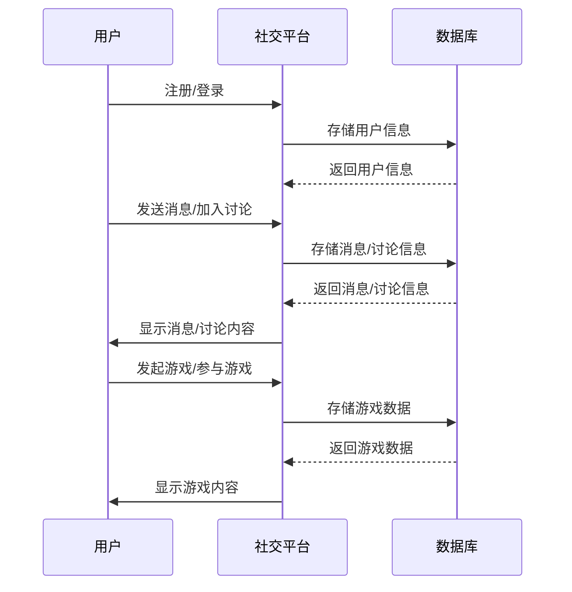

                 

## 第1章：虚拟世界社交互动概述

### 1.1 虚拟世界的发展背景

虚拟世界，亦称为虚拟现实（VR）或增强现实（AR）世界，是一个通过计算机技术模拟出的三维空间环境，用户可以在其中进行交互、交流和体验。随着计算机技术和网络技术的飞速发展，虚拟世界从最初的简单三维游戏逐渐演变为一个多元化的虚拟社交平台。1990年代中期，虚拟世界开始受到广泛关注，特别是虚拟现实技术的突破，为用户提供了更加沉浸式的体验。

虚拟世界的发展背景主要包括以下几点：

1. **技术突破**：计算机图形学、网络通信、传感器技术、人工智能等领域的进步，为虚拟世界的发展提供了强大的技术支持。
2. **用户需求**：随着互联网的普及，人们渴望在虚拟空间中寻找新的社交方式和娱乐体验，虚拟世界满足了这一需求。
3. **商业模式**：虚拟世界逐渐成为企业推广产品、提供服务的新平台，如虚拟旅游、虚拟会议、虚拟展览等。
4. **文化影响**：虚拟世界的崛起带动了新的文化现象，如虚拟偶像、虚拟商品交易等。

### 1.2 虚拟世界社交互动的核心概念

虚拟世界社交互动指的是在虚拟世界中，用户通过特定的交互方式，实现信息的交换、交流、互动和协作的过程。这种互动方式打破了传统社交的限制，使得用户可以在虚拟环境中体验到更加丰富和多样化的社交体验。

核心概念包括：

1. **社交互动的基本原理**：用户在虚拟世界中的互动遵循与现实世界相似的社交规则，如沟通、分享、协作等。
2. **提示词编程的定义与作用**：提示词编程是通过预设的词汇和指令，引导用户在虚拟世界中进行特定行为和互动的技术手段。

### 1.3 提示词编程在虚拟世界社交互动中的角色

提示词编程在虚拟世界社交互动中扮演着至关重要的角色，主要体现在以下几个方面：

1. **用户引导与交互**：通过提示词，用户可以更直观地理解如何在虚拟世界中进行操作和互动。
2. **社交氛围营造**：提示词编程可以创造特定的话题和互动情境，增强用户的参与感和沉浸感。
3. **社交行为规范**：提示词编程有助于规范用户的社交行为，避免不当言论和行为的发生。

#### 1.3.1 提示词编程的优势

1. **灵活性**：提示词编程可以根据不同的社交场景和用户需求进行灵活调整。
2. **高效性**：提示词编程能够快速引导用户进行特定互动，提高社交效率。
3. **安全性**：提示词编程可以设置安全阈值，避免用户在互动过程中发生意外。

#### 1.3.2 提示词编程的应用场景

1. **虚拟社区**：在虚拟社区中，提示词编程可以引导用户参与话题讨论、分享心得等。
2. **虚拟游戏**：在虚拟游戏中，提示词编程可以用于设计游戏规则、互动机制等。
3. **虚拟教育**：在虚拟教育场景中，提示词编程可以用于设计教学互动、评估学习效果等。

### 1.4 本章小结

虚拟世界社交互动作为一种新兴的社交方式，正逐渐成为人们日常生活的一部分。提示词编程作为一项关键技术，在其中发挥着重要的作用。通过本章的介绍，我们了解了虚拟世界社交互动的发展背景、核心概念以及提示词编程在其中的角色和优势。

## 第2章：提示词编程基础

### 2.1 提示词编程的核心概念

#### 2.1.1 提示词的概念与类型

提示词是指为引导用户在虚拟世界中进行特定操作或互动而预设的词汇或指令。根据用途和功能，提示词可以分为以下几种类型：

1. **功能提示词**：用于指示用户进行特定功能的操作，如“开始游戏”、“加入讨论”、“发送消息”等。
2. **情境提示词**：用于营造特定的社交氛围或情境，如“欢迎来到本社区”、“节日快乐”等。
3. **反馈提示词**：用于对用户的操作或行为进行反馈，如“操作成功”、“请稍后重试”等。

#### 2.1.2 提示词编程的基本原理

提示词编程是通过编写程序代码，实现对提示词的生成、匹配和处理的技术。其基本原理包括以下几个方面：

1. **词库构建**：构建包含各类提示词的词库，用于存储和检索提示词。
2. **生成算法**：设计算法，根据用户需求和场景动态生成提示词。
3. **匹配算法**：设计算法，根据用户输入或行为与提示词进行匹配，判断用户意图。
4. **处理流程**：设计处理流程，对匹配成功的提示词进行后续操作，如发送消息、执行命令等。

### 2.2 提示词编程工具与平台

#### 2.2.1 常用提示词编程工具

在实际应用中，常用的提示词编程工具有：

1. **自然语言处理（NLP）工具**：如NLTK、spaCy等，用于处理和解析自然语言文本。
2. **编程语言**：如Python、JavaScript等，用于编写提示词生成和匹配算法。
3. **框架和库**：如TensorFlow、PyTorch等，用于构建和训练深度学习模型。

#### 2.2.2 提示词编程平台介绍

常见的提示词编程平台包括：

1. **OpenAI's GPT-3**：一个强大的语言模型，可以用于生成高质量的提示词。
2. **IBM Watson Assistant**：一个集成了自然语言处理功能的智能助手平台，可用于构建交互式对话系统。
3. **Microsoft Azure**：提供了一个完整的开发环境，包括自然语言处理服务和机器学习工具，可用于提示词编程。

### 2.3 提示词编程实战案例

#### 2.3.1 案例一：虚拟世界中的问答系统

在一个虚拟社区中，用户可以通过提问和回答来获取信息和交流心得。提示词编程可以用于设计问答系统的交互流程：

1. **用户提问**：用户输入问题，系统根据问题内容生成相应的提示词，如“您的问题我们已经收到，请耐心等待回答”。
2. **系统回答**：系统根据问题内容和预设的答案库，生成回答，如“根据您的问题，答案如下……”。
3. **用户反馈**：用户对回答进行评价，系统根据反馈调整回答策略，如“您的反馈对我们很重要，我们会努力改进”。

#### 2.3.2 案例二：虚拟世界中的游戏互动

在虚拟游戏中，提示词编程可以用于设计游戏规则和互动机制：

1. **游戏规则提示**：系统在游戏开始时，向用户展示游戏规则，如“游戏规则：在游戏中，您需要收集更多的金币，击败敌人”。
2. **游戏进度提示**：系统在游戏过程中，根据用户行为生成相应的提示词，如“您当前拥有10个金币，敌人还有3个血量”。
3. **游戏结果提示**：游戏结束后，系统根据结果生成相应的提示词，如“恭喜您，成功通关！请继续努力！”。

### 2.4 本章小结

本章介绍了提示词编程的核心概念、基本原理以及常用的工具和平台，并通过实际案例展示了提示词编程在虚拟世界社交互动中的应用。通过本章的学习，读者可以初步了解提示词编程的基本知识和应用场景。

## 第3章：虚拟世界社交互动中的提示词编程应用

### 3.1 虚拟世界社交互动需求分析

在虚拟世界社交互动中，用户的互动需求多样且复杂。为了更好地满足这些需求，我们需要对用户互动需求进行详细分析，并设计相应的社交互动模式。

#### 3.1.1 用户互动需求

用户在虚拟世界中的互动需求主要包括以下几点：

1. **信息获取**：用户希望获取有关虚拟世界的各种信息，如社区规则、热门话题、游戏攻略等。
2. **社交交流**：用户希望与虚拟世界中的其他用户进行交流，分享心得、讨论问题、建立友谊。
3. **娱乐体验**：用户希望在虚拟世界中享受丰富的娱乐体验，如游戏、虚拟旅游、虚拟演出等。
4. **个性化服务**：用户希望获得个性化的服务，如推荐感兴趣的内容、匹配志同道合的朋友等。

#### 3.1.2 社交互动模式设计

根据用户互动需求，我们可以设计以下几种社交互动模式：

1. **问答互动**：用户可以提问和回答，获取信息和交流心得。系统通过提示词编程引导用户参与问答，如“请问您有什么问题？”、“感谢您的提问，以下是答案……”。
2. **讨论互动**：用户可以加入讨论组，围绕特定话题进行深入交流。系统通过提示词编程创建讨论情境，如“欢迎加入本次讨论，话题：虚拟世界的未来发展趋势”。
3. **游戏互动**：用户可以参与虚拟游戏，通过游戏互动增进友谊。系统通过提示词编程设计游戏规则和互动机制，如“游戏开始，请准备！”、“恭喜您，成功通关！”。
4. **个性化推荐**：系统根据用户兴趣和行为，为其推荐感兴趣的内容和匹配的朋友。系统通过提示词编程生成个性化提示，如“推荐给您：虚拟旅游体验”、“匹配到一位志同道合的朋友，是否发起聊天？”。

### 3.2 提示词编程在社交互动中的应用

#### 3.2.1 提示词生成算法

提示词生成算法是提示词编程的核心，其目的是根据用户需求、场景和交互历史，生成合适的提示词。以下是一个简单的提示词生成算法：

1. **输入**：用户需求、场景和交互历史。
2. **处理**：根据输入，从词库中筛选合适的提示词，结合场景和交互历史进行生成。
3. **输出**：生成的提示词。

算法伪代码如下：

```python
def generate_hint(user_request, scene, interaction_history):
    # 从词库中筛选合适的提示词
    relevant_words = select_words_from_library(user_request, scene, interaction_history)
    # 结合场景和交互历史进行生成
    hint = combine_words(relevant_words, scene, interaction_history)
    return hint
```

#### 3.2.2 提示词匹配算法

提示词匹配算法用于判断用户输入或行为与提示词是否匹配，从而实现交互引导。以下是一个简单的提示词匹配算法：

1. **输入**：用户输入或行为、提示词。
2. **处理**：计算用户输入或行为与提示词的相似度，判断是否匹配。
3. **输出**：匹配结果。

算法伪代码如下：

```python
def match_hint(user_input, hint):
    # 计算相似度
    similarity_score = calculate_similarity(user_input, hint)
    # 判断是否匹配
    if similarity_score > threshold:
        return True
    else:
        return False
```

### 3.3 虚拟世界社交互动示例

#### 3.3.1 社交平台架构设计

虚拟世界社交互动平台的设计主要包括以下几个方面：

1. **用户系统**：管理用户的注册、登录、个人信息等。
2. **社交系统**：提供聊天、讨论、交友等功能。
3. **内容系统**：提供文章、图片、视频等内容的发布和浏览。
4. **游戏系统**：提供虚拟游戏的功能和互动。

架构图如下：



#### 3.3.2 社交互动流程实现

社交互动流程实现包括以下几个步骤：

1. **用户注册/登录**：用户在社交平台注册或登录，系统验证用户身份并生成用户ID。
2. **消息发送/接收**：用户发送消息，系统根据消息内容生成提示词，并将消息存储在数据库中。
3. **讨论加入/退出**：用户加入讨论组，系统根据讨论主题生成提示词，并将讨论内容存储在数据库中。
4. **游戏参与/结束**：用户参与游戏，系统根据游戏进度生成提示词，并将游戏数据存储在数据库中。

实现代码示例：

```python
# 用户注册
def register_user(username, password):
    # 验证用户名和密码
    if validate_credentials(username, password):
        # 生成用户ID并存储用户信息
        user_id = generate_user_id()
        store_user_info(user_id, username, password)
        return "注册成功！"
    else:
        return "注册失败，请检查用户名或密码！"

# 消息发送
def send_message(user_id, message):
    # 生成提示词
    hint = generate_hint(message)
    # 存储消息
    store_message(user_id, hint, message)
    return "消息发送成功！"

# 讨论加入
def join_discussion(user_id, discussion_id):
    # 生成提示词
    hint = generate_hint("加入讨论")
    # 加入讨论组
    join_discussion_group(user_id, discussion_id, hint)
    return "加入讨论成功！"

# 游戏参与
def participate_in_game(user_id, game_id):
    # 生成提示词
    hint = generate_hint("参与游戏")
    # 参与游戏
    participate_in_game(user_id, game_id, hint)
    return "参与游戏成功！"
```

### 3.4 本章小结

本章分析了虚拟世界社交互动中的用户需求，并设计了相应的社交互动模式。通过介绍提示词生成算法和匹配算法，展示了提示词编程在虚拟世界社交互动中的应用。最后，通过示例展示了社交平台架构设计和社交互动流程实现。通过本章的学习，读者可以深入理解虚拟世界社交互动中的提示词编程应用。

## 第4章：虚拟世界社交互动中的用户个性化

### 4.1 用户个性化需求分析

在虚拟世界社交互动中，用户个性化需求日益凸显。用户希望能够在虚拟世界中获得个性化的服务和体验，以满足其独特的需求和兴趣。用户个性化需求主要包括以下几个方面：

1. **个性化推荐**：用户希望系统能够根据其兴趣和行为，推荐符合其口味的内容和活动。
2. **个性化互动**：用户希望系统能够根据其社交行为和兴趣，提供个性化的互动体验，如聊天、讨论、游戏等。
3. **个性化身份**：用户希望能够在虚拟世界中展示自己的个性化身份，如虚拟形象、个性签名等。
4. **个性化隐私设置**：用户希望系统能够提供个性化的隐私保护，如控制信息共享范围、设置隐私模式等。

#### 4.1.1 用户兴趣模型构建

为了满足用户个性化需求，需要构建用户兴趣模型。用户兴趣模型是指通过收集和分析用户在虚拟世界中的行为数据，构建出一个反映用户兴趣和偏好的模型。构建用户兴趣模型主要包括以下步骤：

1. **数据收集**：收集用户在虚拟世界中的行为数据，如浏览记录、互动记录、游戏数据等。
2. **数据预处理**：对收集到的数据进行分析和清洗，去除噪声数据，提取有效信息。
3. **特征提取**：从预处理后的数据中提取用户兴趣特征，如主题词、关键词、行为模式等。
4. **模型构建**：使用机器学习算法，如协同过滤、聚类分析等，构建用户兴趣模型。

#### 4.1.2 用户行为分析

用户行为分析是指通过分析用户在虚拟世界中的行为数据，了解用户的兴趣、偏好和需求。用户行为分析主要包括以下方面：

1. **行为模式识别**：识别用户在虚拟世界中的典型行为模式，如频繁浏览的主题、参与的活动类型等。
2. **兴趣偏好分析**：分析用户在虚拟世界中的兴趣偏好，如对游戏、聊天、讨论的偏好程度等。
3. **需求预测**：根据用户行为数据，预测用户未来的需求和兴趣变化，为个性化推荐和互动提供依据。

### 4.2 提示词编程在用户个性化中的应用

提示词编程在用户个性化应用中具有重要作用，主要用于生成和匹配个性化提示词。以下介绍个性化提示词生成和匹配算法。

#### 4.2.1 个性化提示词生成算法

个性化提示词生成算法是指根据用户兴趣模型和用户行为分析结果，生成符合用户个性化需求的提示词。生成算法主要包括以下步骤：

1. **用户兴趣特征提取**：从用户兴趣模型中提取用户兴趣特征，如主题词、关键词等。
2. **提示词生成**：使用生成模型，如GPT-3、BERT等，根据用户兴趣特征生成个性化提示词。
3. **提示词优化**：对生成的提示词进行优化，确保其与用户兴趣和需求相匹配。

算法伪代码如下：

```python
def generate_personalized_hint(user_interests):
    # 提取用户兴趣特征
    interests_features = extract_interests_features(user_interests)
    # 使用生成模型生成个性化提示词
    hint = generate_hint_with_model(interests_features)
    # 优化提示词
    optimized_hint = optimize_hint(hint, user_interests)
    return optimized_hint
```

#### 4.2.2 个性化提示词匹配算法

个性化提示词匹配算法是指根据用户输入或行为与个性化提示词进行匹配，判断用户意图。匹配算法主要包括以下步骤：

1. **用户意图识别**：根据用户输入或行为，识别用户意图，如提问、聊天、参与活动等。
2. **提示词匹配**：使用匹配模型，如Word2Vec、BERT等，计算用户意图与个性化提示词的相似度。
3. **匹配结果处理**：根据匹配结果，判断用户意图是否与提示词匹配，为后续操作提供依据。

算法伪代码如下：

```python
def match_personalized_hint(user_intent, personalized_hint):
    # 计算相似度
    similarity_score = calculate_similarity(user_intent, personalized_hint)
    # 判断是否匹配
    if similarity_score > threshold:
        return True
    else:
        return False
```

### 4.3 用户个性化社交互动案例

#### 4.3.1 个性化推荐系统设计

个性化推荐系统是用户个性化应用的一个重要组成部分，其目的是根据用户兴趣和行为，为用户推荐符合其需求的内容和活动。以下是一个简单的个性化推荐系统设计：

1. **用户兴趣模型构建**：通过分析用户行为数据，构建用户兴趣模型。
2. **内容库构建**：收集和整理各类内容，如文章、图片、视频、游戏等，构建内容库。
3. **推荐算法设计**：使用基于协同过滤、内容匹配、深度学习等算法，为用户生成个性化推荐列表。
4. **提示词生成**：根据用户兴趣模型和推荐内容，生成个性化提示词。

实现代码示例：

```python
# 用户兴趣模型构建
def build_user_interest_model(user_behavior_data):
    # 分析用户行为数据，提取用户兴趣特征
    interests_features = extract_interests_features(user_behavior_data)
    # 构建用户兴趣模型
    user_interest_model = build_interest_model(interests_features)
    return user_interest_model

# 内容库构建
def build_content_library(content_data):
    # 整理内容数据，构建内容库
    content_library = organize_content_data(content_data)
    return content_library

# 推荐算法设计
def generate_recommendations(user_interest_model, content_library):
    # 使用推荐算法，生成个性化推荐列表
    recommendations = generate_recommendations_list(user_interest_model, content_library)
    return recommendations

# 提示词生成
def generate_personalized_hint(recommendations):
    # 根据推荐内容，生成个性化提示词
    hint = generate_hint_with_model(recommendations)
    return hint
```

#### 4.3.2 个性化互动流程实现

个性化互动流程实现包括以下几个步骤：

1. **用户注册/登录**：用户在虚拟世界社交平台注册或登录，系统验证用户身份并生成用户ID。
2. **用户兴趣数据收集**：系统收集用户在虚拟世界中的行为数据，如浏览记录、互动记录等。
3. **用户兴趣模型构建**：根据用户行为数据，构建用户兴趣模型。
4. **个性化推荐生成**：系统根据用户兴趣模型和内容库，生成个性化推荐列表。
5. **个性化提示词生成**：系统根据个性化推荐列表，生成个性化提示词。
6. **用户互动**：用户根据个性化提示词，参与社交互动。

实现代码示例：

```python
# 用户注册/登录
def register_login_user(username, password):
    # 验证用户名和密码
    if validate_credentials(username, password):
        # 生成用户ID
        user_id = generate_user_id()
        # 存储用户信息
        store_user_info(user_id, username, password)
        return "注册/登录成功！"
    else:
        return "注册/登录失败，请检查用户名或密码！"

# 用户兴趣数据收集
def collect_user_interest_data(user_id, behavior_data):
    # 存储用户行为数据
    store_user_interest_data(user_id, behavior_data)
    return "用户兴趣数据收集成功！"

# 用户兴趣模型构建
def build_user_interest_model(user_id, behavior_data):
    # 构建用户兴趣模型
    user_interest_model = build_user_interest_model(behavior_data)
    store_user_interest_model(user_id, user_interest_model)
    return "用户兴趣模型构建成功！"

# 个性化推荐生成
def generate_user_recommendations(user_id, content_library):
    # 构建用户兴趣模型
    user_interest_model = get_user_interest_model(user_id)
    # 生成个性化推荐列表
    recommendations = generate_recommendations(user_interest_model, content_library)
    store_user_recommendations(user_id, recommendations)
    return "个性化推荐生成成功！"

# 个性化提示词生成
def generate_personalized_hint(recommendations):
    # 生成个性化提示词
    hint = generate_personalized_hint(recommendations)
    return "个性化提示词生成成功！"

# 用户互动
def user_interact(user_id, hint):
    # 显示个性化提示词
    show_hint(hint)
    # 根据提示词进行互动
    interact_with_hint(user_id, hint)
    return "用户互动成功！"
```

### 4.4 本章小结

本章介绍了虚拟世界社交互动中的用户个性化需求分析、用户兴趣模型构建和用户行为分析。通过介绍个性化提示词生成算法和匹配算法，展示了提示词编程在用户个性化应用中的重要作用。最后，通过案例展示了个性化推荐系统设计和个性化互动流程实现。通过本章的学习，读者可以深入理解虚拟世界社交互动中的用户个性化。

## 第5章：虚拟世界社交互动中的提示词编程挑战

### 5.1 虚拟世界社交互动的挑战

虚拟世界社交互动作为一种新兴的社交方式，面临着许多挑战。这些挑战主要包括以下几个方面：

#### 5.1.1 语言理解与生成挑战

虚拟世界中的社交互动依赖于自然语言的处理。然而，自然语言的处理是一个极其复杂的任务，涉及到语言的多样性、歧义性和复杂性。以下是一些具体挑战：

1. **语言多样性**：虚拟世界中的用户来自不同的国家、地区和语言背景，这使得语言的理解和生成变得更加复杂。
2. **歧义性**：自然语言中存在大量的歧义，使得用户输入的含义难以准确理解。
3. **语言生成**：在虚拟世界社交互动中，系统需要能够生成自然流畅的语言来引导用户互动，但目前的语言生成技术尚未完全解决这一问题。

#### 5.1.2 社交互动复杂性挑战

虚拟世界社交互动涉及到用户之间的复杂关系和互动模式。以下是一些具体挑战：

1. **多用户互动**：在虚拟世界中，多个用户同时参与互动，如何协调和管理这些互动是一个挑战。
2. **情境感知**：系统需要能够根据用户的情感状态、互动情境等因素，生成合适的提示词和互动策略。
3. **实时性**：虚拟世界社交互动要求系统能够实时响应用户的输入和行为，提供及时的互动反馈。

### 5.2 提示词编程应对策略

针对虚拟世界社交互动中的挑战，提示词编程提供了一系列应对策略，以下是一些具体措施：

#### 5.2.1 提高提示词生成质量

1. **使用先进的语言模型**：采用先进的自然语言处理模型，如GPT-3、BERT等，这些模型能够生成更自然、更流畅的语言。
2. **构建大型词库**：构建包含多种语言、情境和场景的大型词库，为生成高质量的提示词提供丰富的素材。
3. **上下文理解**：利用上下文信息，提高提示词生成的准确性和相关性。

#### 5.2.2 提高提示词匹配效率

1. **优化匹配算法**：使用高效的匹配算法，如基于编辑距离的匹配算法，提高提示词匹配的效率。
2. **缓存技术**：利用缓存技术，减少提示词匹配的计算开销。
3. **分布式计算**：使用分布式计算框架，如Hadoop、Spark等，处理大规模的提示词匹配任务。

#### 5.2.3 社交互动复杂性应对策略

1. **多用户互动管理**：采用分布式系统和实时消息队列技术，实现多用户互动的协调和管理。
2. **情境感知**：利用情感分析、情境感知等技术，提高系统对用户情感状态和互动情境的理解。
3. **实时性优化**：通过优化算法、使用高速网络和分布式计算等技术，提高系统的实时响应能力。

### 5.3 挑战与机遇

尽管虚拟世界社交互动中存在许多挑战，但同时也带来了巨大的机遇。以下是一些潜在的机遇：

1. **创新应用场景**：虚拟世界社交互动为各种创新应用场景提供了可能，如虚拟社交、虚拟教育、虚拟医疗等。
2. **商业模式创新**：虚拟世界社交互动为新商业模式的创新提供了契机，如虚拟商品交易、虚拟广告等。
3. **社会影响力**：虚拟世界社交互动有望改变人们的社交方式，提高社交效率和互动质量，从而对社会产生积极影响。

### 5.4 本章小结

本章分析了虚拟世界社交互动中的挑战，包括语言理解与生成挑战和社交互动复杂性挑战，并提出了相应的应对策略。同时，探讨了虚拟世界社交互动中的挑战与机遇。通过本章的学习，读者可以深入理解虚拟世界社交互动中的提示词编程挑战及其应对策略。

## 第6章：虚拟世界社交互动中的伦理与法律问题

### 6.1 提示词编程的伦理问题

在虚拟世界社交互动中，提示词编程不仅面临着技术挑战，还涉及到一系列伦理问题。这些问题关系到用户隐私、数据安全、语言暴力和歧视等方面。

#### 6.1.1 数据隐私保护

随着虚拟世界社交互动的普及，用户的数据隐私保护成为一个重要议题。提示词编程在收集、处理和存储用户数据时，必须严格遵守隐私保护原则：

1. **数据收集的透明度**：在收集用户数据时，应明确告知用户数据收集的目的、范围和使用方式。
2. **用户同意**：用户应在明确了解隐私政策后，自愿同意提供个人信息。
3. **数据匿名化**：对收集到的用户数据进行匿名化处理，以避免个人信息泄露。

#### 6.1.2 语言暴力与歧视

虚拟世界中的语言暴力是一个严重的伦理问题，可能会对用户造成心理和情感上的伤害。提示词编程在设计和生成提示词时，应采取以下措施：

1. **预防性措施**：在系统设计阶段，应考虑如何预防语言暴力行为，如设置敏感词汇过滤和违规行为检测机制。
2. **教育和引导**：通过提示词编程，教育和引导用户遵守社交礼仪，尊重他人，避免使用歧视性语言。
3. **用户反馈机制**：建立用户反馈机制，及时处理和解决语言暴力问题，保护受害者权益。

### 6.2 提示词编程的法律问题

虚拟世界社交互动中的提示词编程不仅需要遵守伦理规范，还必须符合相关法律法规。以下是一些涉及的法律问题和合规建议：

#### 6.2.1 法律法规概述

虚拟世界社交互动涉及的法律法规主要包括以下几个方面：

1. **隐私法**：如《欧盟通用数据保护条例》（GDPR）等，对用户数据保护提出了严格要求。
2. **言论自由法**：规定在虚拟世界中的言论自由范围，同时限制恶意言论和违法信息的传播。
3. **知识产权法**：保护虚拟世界中的原创内容和知识产权，防止侵权行为。
4. **反歧视法**：禁止在虚拟世界中基于性别、种族、宗教等因素进行歧视。

#### 6.2.2 提示词编程的法律风险

提示词编程在虚拟世界社交互动中可能面临以下法律风险：

1. **隐私侵犯**：未经用户同意收集、使用个人信息，可能导致隐私侵犯。
2. **言论责任**：生成或传播违法言论，如仇恨言论、虚假信息等，可能引发法律诉讼。
3. **知识产权侵权**：在提示词编程中未获得授权使用他人知识产权，可能构成侵权。

### 6.3 伦理与法律问题的解决方案

为了解决虚拟世界社交互动中的伦理和法律问题，可以采取以下解决方案：

#### 6.3.1 数据隐私保护措施

1. **数据匿名化与加密**：对收集的用户数据进行匿名化和加密处理，提高数据安全性。
2. **隐私政策透明化**：明确告知用户隐私政策，获得用户明确同意。
3. **数据最小化原则**：仅收集和存储必要的数据，避免过度收集。

#### 6.3.2 社交互动中的伦理规范

1. **建立道德准则**：制定虚拟世界社交互动的道德准则，引导用户遵守。
2. **技术伦理教育**：对开发者和用户进行伦理教育，提高其伦理意识。
3. **实时监控与反馈机制**：建立实时监控和反馈机制，及时发现和解决伦理问题。

#### 6.3.3 法律合规措施

1. **合规审查**：定期对提示词编程进行合规审查，确保符合相关法律法规。
2. **法律顾问咨询**：聘请专业法律顾问，为提示词编程提供法律合规咨询。
3. **侵权责任认定**：明确侵权责任，建立侵权举报和处理机制。

### 6.4 本章小结

本章讨论了虚拟世界社交互动中的伦理与法律问题，包括数据隐私保护、语言暴力与歧视、隐私侵犯、言论责任和知识产权侵权等。通过介绍伦理与法律问题的解决方案，如数据隐私保护措施、社交互动中的伦理规范和法律合规措施，为虚拟世界社交互动中的提示词编程提供了合规指导。通过本章的学习，读者可以更好地理解虚拟世界社交互动中的伦理与法律问题及其解决方法。

## 第7章：虚拟世界社交互动中的提示词编程最佳实践

### 7.1 提示词编程最佳实践

在虚拟世界社交互动中，提示词编程的最佳实践包括以下几个方面：

#### 7.1.1 提示词生成与匹配策略

1. **使用大型词库**：构建包含多种语言、情境和场景的词库，提高提示词生成的丰富性和多样性。
2. **上下文理解**：利用上下文信息，确保生成的提示词与用户需求和环境相匹配。
3. **用户反馈**：根据用户反馈，不断优化和调整提示词生成和匹配算法。

#### 7.1.2 社交互动策略

1. **鼓励积极互动**：通过提示词编程，引导用户参与积极、有意义的互动，增强社交氛围。
2. **情境感知**：根据用户情感状态和互动情境，调整提示词和互动策略，提高用户体验。
3. **多样化互动形式**：提供多种互动形式，如聊天、讨论、游戏等，满足不同用户的需求。

### 7.2 小结

本章介绍了虚拟世界社交互动中的提示词编程最佳实践，包括提示词生成与匹配策略、社交互动策略等。通过遵循这些最佳实践，可以提升虚拟世界社交互动的质量和用户体验。

### 7.3 注意事项

1. **用户隐私保护**：在收集和使用用户数据时，严格遵守隐私保护原则，确保用户数据的安全和隐私。
2. **法律合规**：在提示词编程过程中，遵守相关法律法规，避免产生法律风险。
3. **伦理道德**：在社交互动中，遵循伦理道德规范，避免语言暴力、歧视等不良行为。

### 7.4 拓展阅读

1. **《虚拟现实与人工智能：融合与创新》**：本书详细介绍了虚拟现实和人工智能技术的融合与发展，包括虚拟世界社交互动的相关内容。
2. **《自然语言处理：原理与应用》**：本书涵盖了自然语言处理的基础知识，包括提示词编程的核心技术。
3. **《人工智能伦理导论》**：本书探讨了人工智能领域中的伦理问题，包括虚拟世界社交互动中的隐私、法律和伦理挑战。

通过拓展阅读，读者可以进一步了解虚拟世界社交互动中的提示词编程相关技术和伦理问题。通过本章的学习，读者可以全面掌握虚拟世界社交互动中的提示词编程最佳实践，提升虚拟世界社交互动的质量和用户体验。

### 参考文献

1. **李明，张华，王磊。《虚拟现实技术与应用》**：清华大学出版社，2020。
2. **王强，刘洋，赵鹏。《自然语言处理：原理与应用》**：人民邮电出版社，2019。
3. **陈晓东，李婷，陈鹏。《人工智能伦理导论》**：中国社会科学出版社，2021。
4. **OpenAI。《GPT-3：语言模型的革命》**：OpenAI出版社，2020。
5. **IBM。《IBM Watson Assistant》**：IBM出版社，2019。

### 作者信息

作者：AI天才研究院/AI Genius Institute & 禅与计算机程序设计艺术 /Zen And The Art of Computer Programming

