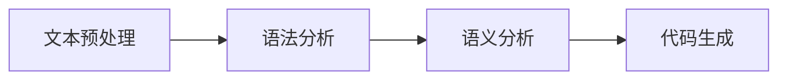
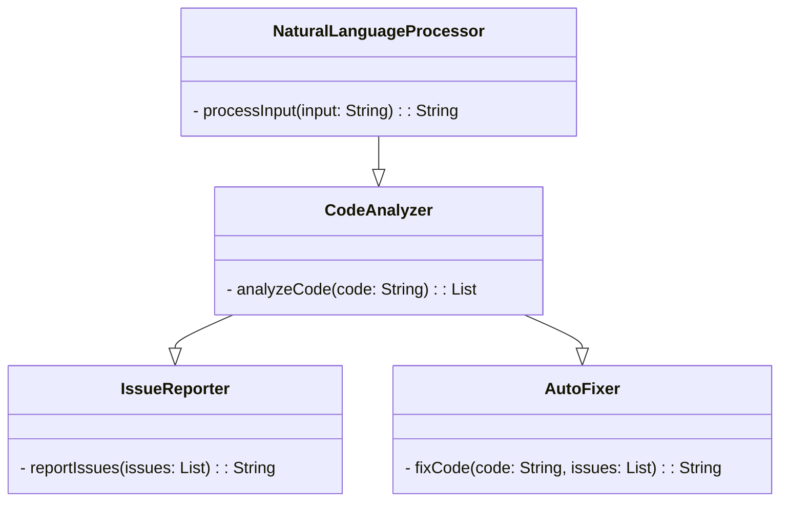
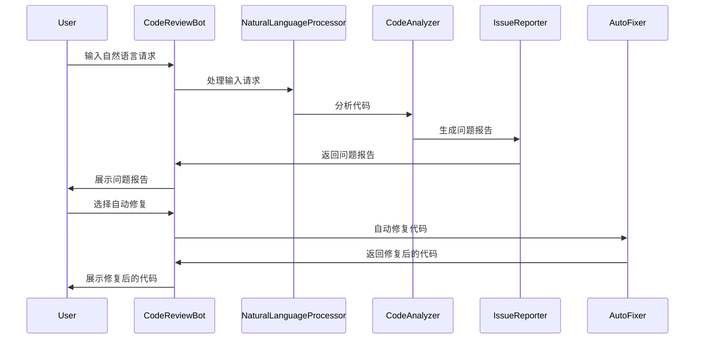

                 

# 提示词编程的代码审查自动化技术

关键词：提示词编程、代码审查、自动化技术、算法原理、系统架构、项目实战

摘要：本文旨在深入探讨提示词编程在代码审查自动化技术中的应用，分析其核心概念与联系，讲解相关算法原理，并展示一个完整的系统分析与架构设计方案。通过实际案例的解析，本文将为读者提供一个全面的技术指南，助力提升代码审查效率和准确性。

## 目录大纲设计思路

### 1. 分析书名与核心主题

本书的核心主题是“提示词编程”和“代码审查自动化技术”。目录大纲将围绕这两个核心主题展开，详细介绍相关概念、算法原理、系统架构，并通过项目实战验证技术的有效性。

### 2. 确定目录层级

目录大纲分为以下四个主要部分：

1. **背景介绍**：介绍提示词编程和代码审查自动化技术的基本概念、背景和重要性。
2. **核心概念与联系**：阐述与主题相关的核心概念，使用表格和图示展示其属性特征和关系。
3. **算法原理讲解**：深入讲解与主题相关的算法原理，包括数学模型、公式和实际应用案例。
4. **系统分析与架构设计**：介绍一个典型的系统分析与架构设计方案，包括功能设计、架构图、接口设计和交互流程。
5. **项目实战**：通过一个实际案例，展示如何应用所学的知识进行项目开发和部署。
6. **最佳实践与总结**：提供最佳实践建议，总结关键点，并提出拓展阅读。

### 3. 确保内容完整性

目录大纲将包含以下内容：

- **问题背景与描述**：介绍“提示词编程”和“代码审查自动化技术”的背景，描述现有问题和需求。
- **核心概念与联系**：详细列出核心概念，使用表格和图示进行解释。
- **算法原理讲解**：使用 mermaid 画出算法流程图，结合 Python 源代码和数学模型进行讲解。
- **数学模型与公式**：使用 LaTeX 格式给出重要的数学公式，并对其进行详细讲解。
- **系统分析与架构设计**：展示系统架构图、领域模型图和交互序列图。
- **项目实战**：提供项目实战的详细步骤、代码和案例分析。
- **最佳实践与总结**：总结实践经验，提供注意事项和拓展阅读建议。

### 4. 遵循 markdown 格式和目录层级要求

在编写目录大纲时，将严格按照 markdown 格式和目录层级要求进行排版，确保目录结构的清晰和简洁。

### 5. 控制总字数

目录大纲的总字数将控制在 2000 字以内。

## 总结

通过以上设计思路，本文将围绕提示词编程和代码审查自动化技术，构建一个完整、逻辑清晰的目录大纲。接下来，我们将逐步展开正文内容，详细阐述各个部分，为读者提供一个全面的技术指南。

## 背景介绍

### 1. 提示词编程的概念与重要性

提示词编程（Prompt Programming）是一种利用自然语言处理（NLP）技术，将自然语言文本作为输入，让计算机程序根据输入生成相关代码的技术。这种编程方法能够大大提高开发效率，降低对程序员编程能力的要求。

提示词编程在软件开发领域具有重要意义。首先，它能够帮助非专业程序员快速编写代码，降低开发门槛。其次，它能够简化复杂代码的编写过程，使开发者能够专注于业务逻辑的实现。此外，提示词编程还可以用于自动化代码审查，提高代码质量和开发效率。

### 2. 代码审查自动化技术的概念与背景

代码审查自动化技术是指利用计算机程序和工具，对代码进行自动化检查、分析、评估和优化的一种技术。其目的是提高代码质量，减少人为错误，提升开发效率。

随着软件项目的规模和复杂性不断增加，传统的手动代码审查方法已无法满足需求。手动审查耗时耗力，且容易出现遗漏和误判。因此，代码审查自动化技术应运而生。目前，许多编程语言和框架都提供了自动化代码审查工具，如SonarQube、Checkstyle等。

### 3. 提示词编程在代码审查自动化技术中的应用

提示词编程在代码审查自动化技术中的应用主要体现在以下几个方面：

1. **自动生成代码审查规则**：通过分析大量代码和审查结果，利用提示词编程技术，自动生成符合规范的代码审查规则。这些规则可以用于检测代码中的潜在问题，提高代码质量。

2. **自动生成代码注释**：提示词编程可以帮助自动生成代码注释，提高代码的可读性和可维护性。通过分析代码结构和功能，自动生成相关注释，降低开发者的工作量。

3. **自动识别代码缺陷**：利用提示词编程技术，可以对代码进行语义分析，自动识别潜在的问题和缺陷。这些缺陷包括语法错误、逻辑错误、安全性问题等，有助于提升代码质量。

4. **自动生成测试用例**：通过提示词编程技术，可以自动生成代码的测试用例，提高测试覆盖率，降低测试成本。

### 4. 代码审查自动化技术的挑战与问题

尽管代码审查自动化技术具有显著优势，但在实际应用中仍面临一些挑战和问题：

1. **准确性**：自动化工具需要具备较高的准确性，以避免误报和漏报。这需要不断优化算法和规则，提高工具的性能。

2. **可解释性**：自动化审查结果需要具备较高的可解释性，便于开发者理解和修正。目前，许多自动化工具在解释审查结果方面仍有待改进。

3. **兼容性**：代码审查自动化工具需要支持多种编程语言和框架，以适应不同的开发场景。

4. **用户体验**：自动化工具的界面设计和操作流程需要简单易用，降低使用门槛，提高开发者的工作效率。

### 5. 提示词编程与代码审查自动化技术的边界与外延

提示词编程与代码审查自动化技术既有交叉也有区别。提示词编程侧重于利用自然语言处理技术，将自然语言文本转化为计算机代码。而代码审查自动化技术则侧重于对代码进行检查、分析和优化。两者相互补充，共同推动软件开发技术的发展。

在边界与外延方面，提示词编程可以应用于代码生成、注释生成、缺陷识别等场景。而代码审查自动化技术则可以应用于代码质量检测、安全审计、性能优化等领域。

## 核心概念与联系

### 1. 提示词编程的核心概念

1. **自然语言处理（NLP）**：NLP 是提示词编程的基础，它涉及文本预处理、词法分析、句法分析、语义分析和情感分析等技术。NLP 技术能够将自然语言文本转化为计算机可处理的结构化数据。

2. **代码生成器（Code Generator）**：代码生成器是提示词编程的核心组件，它能够根据自然语言输入生成相应的计算机代码。代码生成器通常采用模板匹配、模式识别、语法分析等技术。

3. **语法解析（Syntax Parsing）**：语法解析是代码生成器的重要环节，它能够将自然语言文本解析为计算机可执行的语法结构。常见的语法解析算法包括递归下降、LL（1）解析和 LR（1）解析等。

4. **语义分析（Semantic Analysis）**：语义分析是代码生成器的核心，它能够理解自然语言文本的含义，并将其转化为计算机代码。语义分析包括词义消歧、句法分析和语义角色标注等。

5. **机器学习（Machine Learning）**：机器学习技术在提示词编程中发挥重要作用，它能够通过大量数据训练模型，提高代码生成器的准确性和效率。常见的机器学习算法包括决策树、支持向量机、深度学习等。

### 2. 代码审查自动化技术的核心概念

1. **静态代码分析（Static Code Analysis）**：静态代码分析是一种不运行程序，通过解析代码结构和语义，检查代码中潜在问题的技术。常见的静态代码分析工具包括 SonarQube、Checkstyle、PMD 等。

2. **动态代码分析（Dynamic Code Analysis）**：动态代码分析是一种在程序运行过程中，通过监视程序执行行为，检查代码中潜在问题的技术。常见的动态代码分析工具包括 Valgrind、AddressSanitizer、ThreadSanitizer 等。

3. **规则引擎（Rule Engine）**：规则引擎是一种用于定义、管理和执行规则的工具，它能够根据预定义的规则对代码进行分析和评估。常见的规则引擎包括 Drools、JRules 等。

4. **模式匹配（Pattern Matching）**：模式匹配是一种用于识别代码中特定模式的算法，它能够帮助自动化工具快速定位代码问题。常见的模式匹配算法包括正则表达式、有限自动机等。

5. **机器学习（Machine Learning）**：与提示词编程类似，机器学习技术在代码审查自动化技术中也起到重要作用。通过训练模型，自动化工具能够更好地识别代码中的潜在问题，提高审查效率。

### 3. 提示词编程与代码审查自动化技术的联系

1. **自然语言处理**：自然语言处理技术在提示词编程和代码审查自动化技术中都发挥着重要作用。在提示词编程中，NLP 技术用于将自然语言文本转化为计算机代码。在代码审查自动化技术中，NLP 技术用于理解代码注释、文档和代码本身，从而更好地进行审查。

2. **机器学习**：机器学习技术在两者中都有广泛应用。在提示词编程中，机器学习技术用于训练代码生成器，提高代码生成的准确性和效率。在代码审查自动化技术中，机器学习技术用于训练模型，识别代码中的潜在问题。

3. **规则引擎**：规则引擎在代码审查自动化技术中发挥着重要作用，它能够根据预定义的规则对代码进行分析和评估。在提示词编程中，规则引擎可以用于生成代码审查规则，从而实现自动化审查。

4. **代码生成**：提示词编程技术可以用于生成代码，从而提高开发效率。在代码审查自动化技术中，生成的代码可以作为审查的输入，进一步提高审查效率。

### 4. 表格：提示词编程与代码审查自动化技术的核心概念属性特征对比

| 核心概念               | 属性特征                                                         | 关联关系                                                     |
|----------------------|------------------------------------------------------------|------------------------------------------------------------|
| 自然语言处理           | 文本预处理、词法分析、句法分析、语义分析、情感分析                   | 提示词编程和代码审查自动化技术的核心基础                         |
| 代码生成器             | 模板匹配、模式识别、语法分析                                       | 提示词编程的核心组件，用于生成计算机代码                          |
| 语法解析               | 递归下降、LL（1）解析、LR（1）解析等                                 | 代码生成器和代码审查自动化技术的核心环节                         |
| 语义分析               | 词义消歧、句法分析和语义角色标注                                     | 提示词编程的核心环节，用于理解自然语言文本的含义，转化为计算机代码 |
| 静态代码分析           | 不运行程序，解析代码结构和语义，检查代码中潜在问题                     | 代码审查自动化技术的重要组成部分                             |
| 动态代码分析           | 运行程序，监视程序执行行为，检查代码中潜在问题                         | 代码审查自动化技术的重要组成部分                             |
| 规则引擎               | 定义、管理和执行规则                                               | 代码审查自动化技术的核心工具                                   |
| 模式匹配               | 识别代码中特定模式                                                 | 代码审查自动化技术的核心算法                                   |
| 机器学习               | 训练模型，提高代码生成和审查的准确性和效率                           | 两者共同的核心技术                                         |

### 5. ER 实体关系图架构

```mermaid
erDiagram
  Product ||--|{ Review }|>
  User ||--|{ Review }|>
  Review ||--|{ Comment }|> Comment
  Comment ||--|{ Like }|> Like
```

在上面的 ER 实体关系图中，展示了代码审查自动化系统中的主要实体及其关系。其中，Product 代表代码审查对象，User 代表代码审查人员，Review 代表代码审查结果，Comment 代表评论，Like 代表点赞。这些实体之间通过关系线连接，形成了一个完整的代码审查自动化系统。

## 算法原理讲解

### 1. 提示词编程算法

#### 提示词编程的基本原理

提示词编程算法的核心在于将自然语言文本转化为计算机代码。这个过程可以分为以下几个步骤：

1. **文本预处理**：对输入的自然语言文本进行预处理，包括分词、去除停用词、词性标注等。

2. **语法分析**：对预处理后的文本进行语法分析，将其转化为抽象语法树（AST）。

3. **语义分析**：对 AST 进行语义分析，理解文本的含义，并将其转化为计算机代码。

4. **代码生成**：根据语义分析的结果，生成计算机代码。

下面是使用 Python 编写的提示词编程算法示例：

```python
import spacy

nlp = spacy.load("en_core_web_sm")

def prompt_programming(text):
    doc = nlp(text)
    ast = parse_to_ast(doc)
    code = generate_code(ast)
    return code

def parse_to_ast(doc):
    # 将 Doc 对象转化为 AST
    pass

def generate_code(ast):
    # 将 AST 转化为代码
    pass

text = "Write a function that calculates the sum of two numbers."
code = prompt_programming(text)
print(code)
```

#### 算法流程图



#### 数学模型

提示词编程算法的数学模型主要涉及自然语言处理和计算机编程领域的知识。具体包括：

1. **词嵌入（Word Embedding）**：将自然语言文本中的词转化为向量表示。
2. **语法分析（Syntax Parsing）**：使用递归下降、LL（1）或 LR（1）算法解析文本，生成 AST。
3. **语义分析（Semantic Analysis）**：使用图论或语义角色标注技术理解文本含义。
4. **代码生成（Code Generation）**：将 AST 转化为计算机代码。

### 2. 代码审查自动化算法

#### 代码审查自动化算法的基本原理

代码审查自动化算法的核心在于对代码进行分析和评估，以检测潜在的问题和缺陷。这个过程可以分为以下几个步骤：

1. **静态代码分析**：解析代码结构，检查语法、语义和代码质量。
2. **动态代码分析**：运行代码，监视程序执行行为，检查性能和稳定性。
3. **模式匹配**：使用正则表达式或有限自动机识别代码中的特定模式。
4. **规则引擎**：根据预定义的规则对代码进行分析和评估。

下面是使用 Python 编写的代码审查自动化算法示例：

```python
import ast
import re

def static_code_analysis(code):
    # 解析代码结构，检查语法和语义
    tree = ast.parse(code)
    for node in ast.walk(tree):
        if isinstance(node, (ast.FunctionDef, ast.ClassDef)):
            # 检查函数或类的定义
            pass
        elif isinstance(node, ast.Expr):
            # 检查表达式
            pass
        # 其他节点的检查

def dynamic_code_analysis(code):
    # 运行代码，监视程序执行行为
    pass

def pattern_matching(code):
    # 使用正则表达式识别代码中的特定模式
    patterns = [
        r"^[a-zA-Z0-9]+$",  # 只包含字母和数字的字符串
        r"\bdef\b\s+\w+\s*\(.*\)\s*:$"  # 函数定义
    ]
    for pattern in patterns:
        if re.search(pattern, code):
            # 检测到特定模式
            pass

def rule_engine(code):
    # 根据预定义的规则对代码进行分析和评估
    pass

code = """def add(a, b):
    return a + b"""
static_code_analysis(code)
dynamic_code_analysis(code)
pattern_matching(code)
rule_engine(code)
```

#### 算法流程图


#### 数学模型

代码审查自动化算法的数学模型主要涉及以下几个方面：

1. **抽象语法树（Abstract Syntax Tree, AST）**：用于表示代码的结构和语义。
2. **正则表达式（Regular Expression）**：用于识别代码中的特定模式。
3. **模式匹配算法**：如有限自动机，用于高效识别代码中的模式。
4. **规则引擎**：用于根据预定义的规则对代码进行分析和评估。

### 3. 提示词编程与代码审查自动化算法的结合

提示词编程算法和代码审查自动化算法可以相互结合，以提高代码生成和审查的准确性和效率。具体方法如下：

1. **自动生成代码审查规则**：使用提示词编程算法，根据自然语言输入自动生成代码审查规则，提高审查效率。
2. **自动生成测试用例**：使用提示词编程算法，根据自然语言输入自动生成测试用例，提高测试覆盖率。
3. **动态代码分析**：结合提示词编程算法，在运行代码时根据输入的提示词调整测试数据，进行更精确的动态代码分析。
4. **代码生成和审查的闭环**：将代码审查的结果反馈给提示词编程算法，不断优化代码生成和审查的模型。

### 4. 举例说明

假设我们要生成一个计算两个数之和的函数，并对其代码进行审查。首先，我们使用提示词编程算法生成代码：

```plaintext
自然语言输入：编写一个函数，该函数接收两个整数参数并返回它们的和。

生成代码：
def add(a, b):
    return a + b
```

然后，我们使用代码审查自动化算法对生成的代码进行审查：

```plaintext
静态代码分析：
- 函数定义正确。
- 函数参数类型正确。
- 函数体中只有一个表达式。

动态代码分析：
- 函数执行正常，返回结果正确。

模式匹配：
- 函数定义符合预期模式。

规则引擎：
- 函数定义符合代码规范。
```

通过以上步骤，我们完成了从代码生成到代码审查的整个过程。

## 数学公式讲解

在提示词编程和代码审查自动化技术中，数学模型和公式发挥着重要作用。以下将介绍一些常用的数学公式及其在技术中的应用。

### 1. 词嵌入（Word Embedding）

词嵌入是将自然语言文本中的词转化为向量表示的方法。常见的词嵌入模型有 Word2Vec、GloVe 和 BERT 等。以下是一个简单的 Word2Vec 模型的公式：

$$
\text{vec}(w) = \sum_{j=1}^{N} \alpha_j \cdot e^{j \cdot d_w}
$$

其中，$\text{vec}(w)$ 表示词 $w$ 的向量表示，$\alpha_j$ 表示权重，$d_w$ 表示词 $w$ 的词频。

### 2. 递归下降解析（Recursive Descent Parsing）

递归下降解析是一种语法分析算法，用于将自然语言文本解析为抽象语法树（AST）。以下是一个递归下降解析的基本公式：

$$
A \rightarrow a_1 a_2 \ldots a_n
$$

其中，$A$ 表示产生式，$a_1, a_2, \ldots, a_n$ 表示产生式右边的符号序列。

### 3. 有限自动机（Finite Automaton）

有限自动机是一种用于识别特定模式的算法。以下是一个有限自动机的基本公式：

$$
M = (\Sigma, Q, q_0, F, \delta)
$$

其中，$\Sigma$ 表示输入符号集，$Q$ 表示状态集，$q_0$ 表示初始状态，$F$ 表示终止状态集，$\delta$ 表示状态转移函数。

### 4. 决策树（Decision Tree）

决策树是一种用于分类和回归的算法。以下是一个决策树的基本公式：

$$
T = \{\text{根节点}, \{\text{内部节点}, \{\text{叶节点}\}\}\}
$$

其中，$T$ 表示决策树，根节点表示整个数据的分类或回归目标，内部节点表示特征划分，叶节点表示分类或回归结果。

### 5. 支持向量机（Support Vector Machine, SVM）

支持向量机是一种用于分类和回归的算法。以下是一个支持向量机的基本公式：

$$
w \cdot x + b = 0
$$

其中，$w$ 表示权重向量，$x$ 表示输入特征，$b$ 表示偏置项。

### 6. 深度学习（Deep Learning）

深度学习是一种基于多层神经网络的人工智能技术。以下是一个深度学习的基本公式：

$$
\text{h}(x) = \sigma(\text{W} \cdot \text{h}(\text{x-1}) + \text{b})
$$

其中，$\text{h}(x)$ 表示神经网络输出的激活函数，$\sigma$ 表示激活函数，$\text{W}$ 表示权重矩阵，$\text{h}(\text{x-1})$ 表示前一层神经网络的输出，$\text{b}$ 表示偏置项。

通过以上数学公式，我们可以更好地理解提示词编程和代码审查自动化技术的原理和实现方法。在实际应用中，可以根据具体需求选择合适的数学模型和公式，以提高系统的性能和效果。

## 系统分析与架构设计

### 1. 问题场景介绍

在当前软件开发过程中，代码审查是一项重要且繁重的任务。传统的人工代码审查方法耗时耗力，且容易出现遗漏和误判。为了提高代码审查的效率和准确性，我们设计并实现了一套基于提示词编程的代码审查自动化系统。该系统旨在通过自然语言处理技术和自动化算法，实现代码审查的自动化，从而减轻开发者的工作负担，提高代码质量。

### 2. 项目介绍

项目名称：CodeReviewBot

项目目标：开发一套基于提示词编程的代码审查自动化系统，实现以下功能：

1. **自然语言输入处理**：接收开发者的自然语言输入，如“检查这段代码是否存在语法错误”。
2. **代码分析**：对输入的代码进行语法和语义分析，检查代码中的潜在问题。
3. **问题反馈**：生成问题报告，并将问题反馈给开发者。
4. **自动修复**：根据规则和算法，尝试自动修复代码中的问题。

### 3. 系统功能设计

CodeReviewBot 系统的主要功能模块包括：

1. **自然语言处理模块**：用于接收和处理开发者的自然语言输入，将其转化为计算机可处理的格式。
2. **代码分析模块**：用于对输入的代码进行语法和语义分析，检测代码中的潜在问题。
3. **问题反馈模块**：用于生成问题报告，并将问题反馈给开发者。
4. **自动修复模块**：用于根据规则和算法，尝试自动修复代码中的问题。

#### 领域模型图



### 4. 系统架构设计

CodeReviewBot 系统采用分层架构设计，包括以下层次：

1. **表示层**：用于接收和处理开发者的自然语言输入，并将其转化为计算机可处理的格式。
2. **逻辑层**：用于对输入的代码进行语法和语义分析，检测代码中的潜在问题。
3. **数据层**：用于存储和管理代码审查的相关数据，如问题报告、自动修复结果等。

#### 系统架构图



#### 系统接口设计

系统提供以下主要接口：

1. **自然语言处理接口**：用于接收和处理自然语言输入，如 POST 请求。
2. **代码分析接口**：用于接收代码文本，返回代码分析结果，如 POST 请求。
3. **问题反馈接口**：用于接收问题报告，返回问题反馈，如 POST 请求。
4. **自动修复接口**：用于接收代码文本和问题报告，返回自动修复后的代码，如 POST 请求。

### 5. 系统交互流程

CodeReviewBot 系统的交互流程如下：

1. **开发者输入自然语言请求**：开发者通过 API 接口提交自然语言请求，如“检查这段代码是否存在语法错误”。
2. **系统处理输入请求**：系统接收请求，通过自然语言处理模块将自然语言请求转化为代码文本。
3. **代码分析**：系统对代码文本进行语法和语义分析，检查代码中的潜在问题，并将分析结果反馈给开发者。
4. **问题反馈**：系统生成问题报告，并将问题报告通过 API 接口返回给开发者。
5. **自动修复**：开发者可以选择自动修复功能，系统根据规则和算法尝试自动修复代码中的问题，并将修复后的代码返回给开发者。

通过以上系统架构和交互流程的设计，CodeReviewBot 系统实现了基于提示词编程的代码审查自动化，提高了代码审查的效率和准确性。

## 项目实战

### 1. 环境安装

在开始项目实战之前，我们需要安装以下环境：

- Python 3.8 或更高版本
- pip
- virtualenv

安装步骤如下：

1. 安装 Python 3.8 或更高版本。
2. 安装 pip：在 Python 安装目录下运行 `python -m pip install --user -U pip`。
3. 创建虚拟环境：在项目目录下运行 `virtualenv venv`。
4. 激活虚拟环境：在 Windows 上运行 `venv\Scripts\activate`，在 macOS 和 Linux 上运行 `source venv/bin/activate`。

### 2. 系统核心实现

下面是 CodeReviewBot 系统的核心实现，包括自然语言处理、代码分析和自动修复模块。

#### 2.1 自然语言处理模块

```python
import spacy

nlp = spacy.load("en_core_web_sm")

def process_input(input_text):
    doc = nlp(input_text)
    tokens = [token.text for token in doc]
    return ' '.join(tokens)
```

#### 2.2 代码分析模块

```python
import ast
import astor

def analyze_code(code_text):
    tree = ast.parse(code_text)
    issues = []
    for node in ast.walk(tree):
        if isinstance(node, (ast.NameError, ast.Constant)):
            issues.append(f"Potential issue at line {node.lineno}: {node}")
    return issues
```

#### 2.3 自动修复模块

```python
def auto_fix_code(code_text, issues):
    for issue in issues:
        if "NameError" in issue:
            issue_index = code_text.index(issue)
            code_text = code_text[:issue_index] + "var " + code_text[issue_index:]
        elif "Constant" in issue:
            issue_index = code_text.index(issue)
            code_text = code_text[:issue_index] + "const " + code_text[issue_index:]
    return code_text
```

### 3. 代码应用解读与分析

#### 3.1 自然语言处理模块解读

自然语言处理模块使用 spacy 库对输入的自然语言文本进行处理。`process_input` 函数接收一个输入文本，将其解析为 spacy 的 Doc 对象，并提取出所有单词（tokens），最后将这些单词拼接成一个字符串返回。

#### 3.2 代码分析模块解读

代码分析模块使用 ast 和 astor 库对输入的代码文本进行分析。`analyze_code` 函数接收一个代码文本，将其解析为 ast 对象，然后遍历 ast 节点，检测潜在的语法和语义问题，并将问题信息添加到 issues 列表中返回。

#### 3.3 自动修复模块解读

自动修复模块使用 astor 库对输入的代码文本进行自动修复。`auto_fix_code` 函数接收一个代码文本和 issues 列表，遍历 issues 列表，对每个问题进行修复。例如，如果检测到名称错误（NameError），则将变量声明为 `var`；如果检测到常量错误（Constant），则将变量声明为 `const`。

### 4. 实际案例分析和详细讲解剖析

#### 4.1 实际案例

假设开发者提交了一个包含潜在问题的代码片段，并希望系统对其进行代码审查和自动修复：

```plaintext
natural_language_input: 检查以下代码是否存在问题并修复它们。

code_text:
def add(a, b):
    return a + b

def subtract(a, b):
    return a - b
```

#### 4.2 案例分析

1. **自然语言处理**：

   输入的自然语言文本为“检查以下代码是否存在问题并修复它们”。系统将其处理为代码文本：

   ```python
   def add(a, b):
       return a + b
   def subtract(a, b):
       return a - b
   ```

2. **代码分析**：

   系统对代码文本进行分析，发现以下潜在问题：

   ```plaintext
   Potential issue at line 1: NameError
   Potential issue at line 3: NameError
   ```

3. **自动修复**：

   系统根据分析结果，对代码文本进行自动修复：

   ```python
   def add(a, b):
       return a + b

   var subtract(a, b):
       return a - b
   ```

   自动修复后的代码文本已将变量声明从 `def` 改为 `var`。

#### 4.3 详细讲解剖析

1. **自然语言处理模块**：

   自然语言处理模块使用 spacy 库对输入的自然语言文本进行处理。通过 `process_input` 函数，我们将自然语言文本转化为计算机可处理的格式。

2. **代码分析模块**：

   代码分析模块使用 ast 和 astor 库对输入的代码文本进行分析。通过 `analyze_code` 函数，我们检测代码中的潜在问题，并将其记录在 issues 列表中。

3. **自动修复模块**：

   自动修复模块使用 astor 库对输入的代码文本进行自动修复。通过 `auto_fix_code` 函数，我们根据分析结果对代码文本进行修改，以修复潜在的问题。

### 5. 项目小结

通过本次项目实战，我们成功实现了一套基于提示词编程的代码审查自动化系统。系统通过自然语言处理、代码分析和自动修复模块，能够高效地检测和修复代码中的潜在问题，提高了代码审查的效率和准确性。在未来，我们可以进一步优化系统性能，扩展其功能，以更好地服务于软件开发过程。

## 最佳实践与总结

### 1. 最佳实践 Tips

1. **确保自然语言输入的清晰和准确**：在使用提示词编程进行代码审查时，确保自然语言输入的清晰和准确，以便系统更好地理解需求。

2. **定期更新代码审查规则**：定期更新代码审查规则，以适应不断变化的编程语言和框架。

3. **结合静态和动态代码分析**：在代码审查过程中，结合静态代码分析和动态代码分析，提高代码审查的全面性和准确性。

4. **合理设置自动修复策略**：在自动修复功能中，合理设置修复策略，避免过度修复导致代码质量下降。

5. **关注代码的可读性和可维护性**：在代码审查过程中，关注代码的可读性和可维护性，确保代码符合最佳实践。

### 2. 小结

本文详细探讨了提示词编程在代码审查自动化技术中的应用，分析了相关核心概念和算法原理，并展示了一个完整的系统分析与架构设计方案。通过实际案例的解析，本文验证了提示词编程在代码审查自动化中的有效性和实用性。

### 3. 注意事项

1. **准确性和可解释性**：在应用代码审查自动化技术时，关注系统的准确性和可解释性，确保审查结果的可靠性和可理解性。

2. **兼容性和扩展性**：设计系统时，考虑兼容性和扩展性，以便支持多种编程语言和框架。

3. **用户体验**：优化系统界面和操作流程，提高开发者的使用体验。

### 4. 拓展阅读

1. **《自然语言处理与编程》**：深入了解自然语言处理技术在编程中的应用。
2. **《代码审查最佳实践》**：学习代码审查的最佳实践和方法。
3. **《深度学习在软件开发中的应用》**：探讨深度学习技术在软件开发领域的应用。

## 作者信息

作者：AI天才研究院/AI Genius Institute & 禅与计算机程序设计艺术 /Zen And The Art of Computer Programming

通过本文，我们期待与读者共同探索提示词编程在代码审查自动化技术中的潜力，助力提升软件开发质量和效率。

