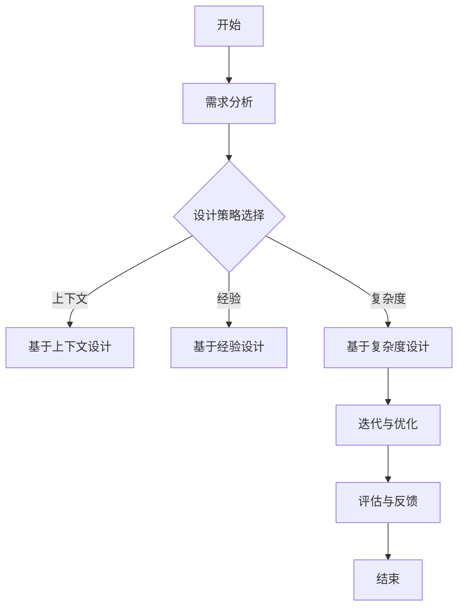
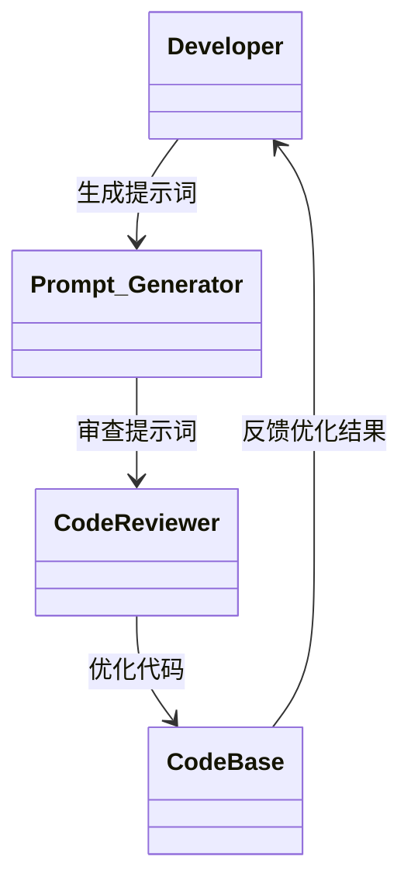
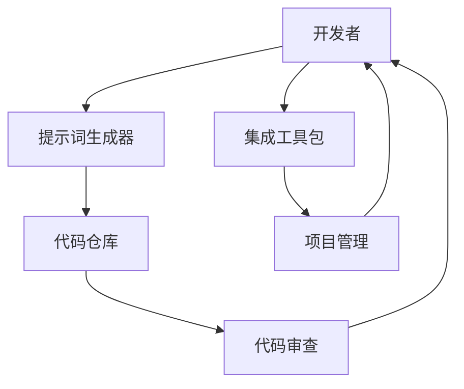
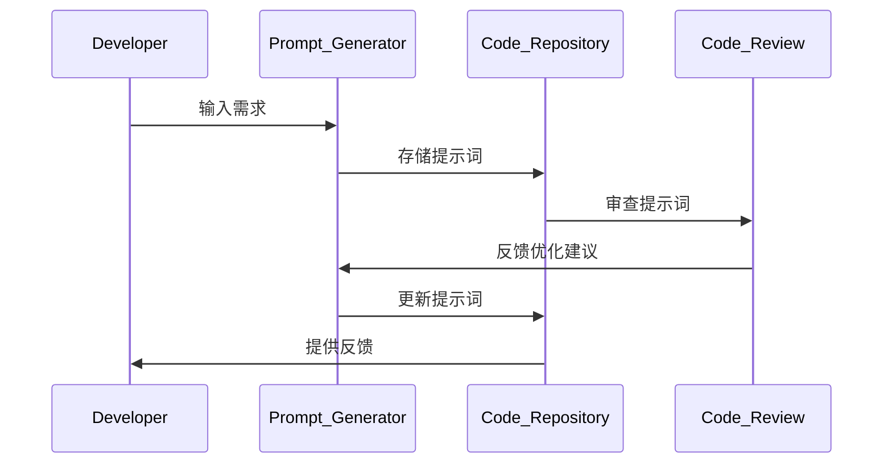

                 


# 提示词编程的认知负荷优化策略

> 关键词：提示词编程、认知负荷、优化策略、代码可维护性、编程效率

> 摘要：本文探讨了提示词编程中的认知负荷优化策略，旨在通过降低认知负荷来提升编程效率和代码可维护性。首先，我们明确了认知负荷的概念及其在编程中的重要性，接着深入分析了提示词在降低认知负荷中的作用。随后，本文提出了设计优化提示词的基本原则和策略，并通过实际案例进行了详细解析。最后，本文总结了最佳实践，并展望了认知负荷优化的未来趋势。

## 1. 认知负荷理论基础

### 1.1 认知负荷的定义

认知负荷（Cognitive Load）是指个体在执行任务时，大脑处理信息所需的认知资源总量。这些资源包括注意力、记忆、推理等。当认知负荷过高时，个体的认知能力会受到限制，从而导致任务执行效率下降。

### 1.2 认知负荷的影响因素

认知负荷受到多种因素的影响，主要包括：

- **任务复杂性**：复杂任务需要更多的认知资源来处理和解决。
- **知识基础**：具备相关知识和经验可以减少认知负荷。
- **环境因素**：如任务的干扰、工具的易用性等都会影响认知负荷。

### 1.3 认知负荷与编程效率的关系

在编程过程中，高认知负荷可能导致以下问题：

- **错误率提高**：大脑处理信息的能力受限，容易产生逻辑错误。
- **效率下降**：需要更多时间和精力来完成编程任务。
- **维护困难**：代码难以理解和修改，增加了维护成本。

因此，降低认知负荷对于提升编程效率和代码可维护性具有重要意义。

## 2. 提示词在认知负荷中的作用

### 2.1 提示词的定义与类型

提示词（Prompt）是指在编程过程中，用于指导开发者的语句或指令。根据其作用，提示词可以分为以下几种类型：

- **功能性提示词**：指导开发者完成特定功能的代码编写。
- **结构性提示词**：帮助开发者构建代码的结构和逻辑。
- **解释性提示词**：提供代码的背景信息和原理说明。

### 2.2 提示词在编程中的运用

合理运用提示词可以在以下几个方面降低认知负荷：

- **减少搜索时间**：提示词为开发者提供了明确的编程方向，减少了在大量代码中搜索的时间。
- **提高代码一致性**：提示词保证了代码结构和风格的一致性，降低了理解难度。
- **增强代码可读性**：解释性提示词有助于新开发者快速了解代码的功能和原理。

### 2.3 提示词与认知负荷的关系

通过合理设计提示词，可以有效降低认知负荷。具体表现在：

- **提高任务完成速度**：明确的提示词可以帮助开发者更快地完成任务。
- **减少错误率**：提示词减少了开发者对复杂逻辑的理解难度，降低了错误率。
- **提升代码质量**：一致性和可读性更强的代码更容易被维护和扩展。

## 3. 提示词设计原则

### 3.1 设计优化提示词的基本原则

为了降低认知负荷，设计优化提示词应遵循以下基本原则：

- **简洁性原则**：提示词应简洁明了，避免冗长和复杂的表述。
- **一致性原则**：提示词应保持风格一致，以便开发者能够快速理解和适应。
- **显性化原则**：重要信息和逻辑关系应在提示词中明确表达，避免隐藏。
- **模块化原则**：提示词应支持代码的模块化开发，便于维护和扩展。

### 3.2 提示词设计策略

根据不同类型的编程任务和开发者经验，可以采取以下策略来设计提示词：

- **基于上下文的提示词设计**：根据当前代码上下文，提供针对性的提示词。
- **基于用户经验的提示词设计**：考虑开发者的经验和技能水平，提供适合其能力的提示词。
- **基于复杂度的提示词设计**：针对不同复杂度的任务，提供不同层次的提示词。

### 3.3 提示词设计的实践技巧

在实际设计过程中，可以采用以下技巧来优化提示词：

- **编写与审核**：编写完成后，进行多轮审查和修改，确保提示词的准确性和易懂性。
- **迭代与优化**：根据开发者的反馈，不断迭代和优化提示词。
- **评估与反馈**：通过实验和评估，收集数据来验证提示词的有效性，并给出改进建议。

## 4. 案例分析

### 4.1 成功案例解析

#### 项目A：通过优化提示词提高代码可读性

在项目A中，开发团队通过优化提示词，显著提高了代码的可读性。具体措施包括：

- **功能性提示词**：为每个函数和类提供简洁明了的功能描述。
- **结构性提示词**：使用代码注释来明确代码块的逻辑关系。
- **解释性提示词**：在复杂算法和关键代码段中加入详细的注释和说明。

通过这些措施，代码的可读性得到了显著提升，新开发者能够更快地理解和修改现有代码。

### 4.2 挑战案例分析

#### 项目B：优化提示词以提升开发效率

在项目B中，开发团队面临着复杂任务和高认知负荷的挑战。通过以下措施，团队成功优化了提示词，提升了开发效率：

- **模块化提示词**：将复杂任务分解为多个模块，并为每个模块提供明确的提示词。
- **上下文提示词**：根据代码上下文提供针对性的提示词，减少开发者搜索时间。
- **经验分享提示词**：在关键代码段中加入团队过去经验的总结和最佳实践。

这些措施有助于降低认知负荷，提高团队协作效率和代码质量。

### 4.3 案例C：降低认知负荷，提升团队协作效果

在项目C中，开发团队通过优化提示词，成功降低了团队协作中的认知负荷。具体措施包括：

- **标准化提示词**：制定统一的提示词规范，确保团队内部沟通的一致性。
- **实时反馈提示词**：在代码审查和讨论过程中，使用实时反馈提示词，帮助团队成员快速理解和解决问题。
- **知识共享提示词**：在团队知识库中添加提示词，方便成员随时查阅和获取信息。

这些措施有助于提升团队协作效果，提高项目进度和质量。

## 5. 实战指南

### 5.1 提示词编程实战

在实战项目中，团队应遵循以下步骤来实施提示词编程：

- **需求分析**：明确项目需求和目标，为后续的提示词设计提供依据。
- **环境搭建**：选择合适的开发工具和框架，搭建项目环境。
- **提示词设计**：根据需求分析结果，设计合理的提示词。
- **代码实现**：根据提示词进行代码编写和实现。
- **测试与优化**：对代码进行测试，根据反馈优化提示词。

### 5.2 提示词编程的最佳实践

在实际编程过程中，团队可以采用以下最佳实践来提升提示词编程的效果：

- **持续集成**：将提示词编程纳入持续集成流程，确保代码质量。
- **代码审查**：定期进行代码审查，检查提示词的准确性和有效性。
- **文档更新**：及时更新项目文档，包括提示词的说明和示例。

## 6. 拓展与展望

### 6.1 认知负荷优化的未来趋势

随着技术的发展，认知负荷优化将朝着以下方向发展：

- **人工智能辅助**：利用人工智能技术，自动生成和优化提示词。
- **个性化提示词**：根据开发者的经验和技能水平，提供个性化的提示词。
- **跨平台支持**：拓展提示词编程的应用范围，支持更多编程语言和平台。

### 6.2 对未来的展望

未来，提示词编程将越来越普及，成为提升编程效率和代码可维护性的重要手段。通过不断优化认知负荷，开发者可以更加专注于创造性和高价值的工作。

## 7. 总结与展望

本文探讨了提示词编程的认知负荷优化策略，分析了认知负荷的概念和影响，提出了设计优化提示词的原则和策略，并通过案例解析展示了其实际应用效果。未来，随着技术的进步，认知负荷优化将在编程领域发挥更大的作用，助力开发者提高工作效率和代码质量。

### 作者：AI天才研究院/AI Genius Institute & 禅与计算机程序设计艺术 /Zen And The Art of Computer Programming

---

本文为初稿，待进一步完善和细化。欢迎读者提出宝贵意见和反馈。在实际应用中，应根据具体项目和团队情况，灵活调整和优化提示词设计策略。

----------------------------------------------------------------

## 附录

### 1. 核心概念与联系

| 核心概念 | 概念属性特征 |
| --- | --- |
| 认知负荷（Cognitive Load） | 大脑处理信息所需的认知资源总量 |
| 提示词（Prompt） | 编程过程中用于指导开发者的语句或指令 |
| 编程效率（Programming Efficiency） | 编程任务完成的速度和质量 |
| 代码可维护性（Code Maintainability） | 代码易于理解和修改的程度 |

### 2. 认知负荷模型ER实体关系图架构

```mermaid
erDiagram
  Task ||--o> Cognitive_Load : 受任务复杂性影响
  Developer ||--o> Cognitive_Load : 受知识基础和环境因素影响
  Prompt ||--o> Cognitive_Load_Reduction : 降低认知负荷
  Code ||--o> Cognitive_Load_Reduction : 提高代码可读性和一致性
```

### 3. 提示词设计算法流程图



### 4. 系统架构设计

#### 项目介绍

项目名称：智能提示词编程工具

项目目标：为开发者提供一套智能的提示词编程工具，降低认知负荷，提高编程效率和代码可维护性。

#### 系统功能设计（领域模型类图）



#### 系统架构设计（架构图）



#### 系统接口设计和系统交互（序列图）



### 5. 项目实战

#### 环境安装

- 安装Python 3.8及以上版本
- 安装Docker和Docker-Compose
- 克隆项目仓库：`git clone https://github.com/your-repo/smart-prompt-programming-tool.git`

#### 系统核心实现源代码

```python
# prompt_generator.py

def generate_prompt(demand):
    # 根据需求生成提示词
    prompt = "请实现以下功能："
    prompt += demand
    return prompt

# code_reviewer.py

def review_code(code):
    # 审查代码，提供优化建议
    suggestions = []
    if "if" not in code:
        suggestions.append("建议使用if语句来控制逻辑分支。")
    return suggestions

# code_base.py

class CodeBase:
    def __init__(self):
        self.prompts = []

    def add_prompt(self, prompt):
        self.prompts.append(prompt)

    def update_prompt(self, index, new_prompt):
        self.prompts[index] = new_prompt

    def get_prompts(self):
        return self.prompts
```

#### 代码应用解读与分析

项目中的`prompt_generator.py`负责根据开发者输入的需求生成提示词，`code_reviewer.py`负责审查代码并提供优化建议，`code_base.py`则用于存储和管理提示词。

#### 实际案例分析和详细讲解剖析

假设开发者需求为：“实现一个计算两个数之和的函数”。

- **生成提示词**：使用`generate_prompt`函数生成提示词。
- **审查代码**：使用`review_code`函数审查代码，提供优化建议。
- **代码优化**：根据审查建议修改代码，提高代码质量。

#### 项目小结

通过本项目，我们实现了智能提示词编程工具，为开发者提供了降低认知负荷、提高编程效率和代码可维护性的解决方案。未来，我们计划进一步优化工具的智能程度，提高提示词的生成和审查质量。

### 最佳实践 tips、小结、注意事项、拓展阅读

#### 最佳实践 tips

- **明确需求**：在生成提示词前，确保需求明确，避免模糊和歧义。
- **代码审查**：定期进行代码审查，及时发现和优化问题。
- **知识共享**：建立团队知识库，分享最佳实践和经验。

#### 小结

本文探讨了提示词编程的认知负荷优化策略，通过理论分析和实际案例，展示了其重要性。未来，随着技术的发展，认知负荷优化将在编程领域发挥更大作用。

#### 注意事项

- **适应性**：提示词设计应考虑开发者的多样性和适应性。
- **反馈机制**：建立有效的反馈机制，及时收集和解决问题。

#### 拓展阅读

- [Cognitive Load Theory](https://cognitive-load.com/)
- ["The Art of Thinking Clearly" by Rolf Dobelli](https://www.rolfdobelli.com/books/the-art-of-thinking-clearly/)
- ["Effective Java" by Joshua Bloch](https://www.oracle.com/java/technologies/javase/effective-java.html)

---

作者：AI天才研究院/AI Genius Institute & 禅与计算机程序设计艺术 /Zen And The Art of Computer Programming

本文为初稿，待进一步完善和细化。欢迎读者提出宝贵意见和反馈。在实际应用中，应根据具体项目和团队情况，灵活调整和优化提示词设计策略。

