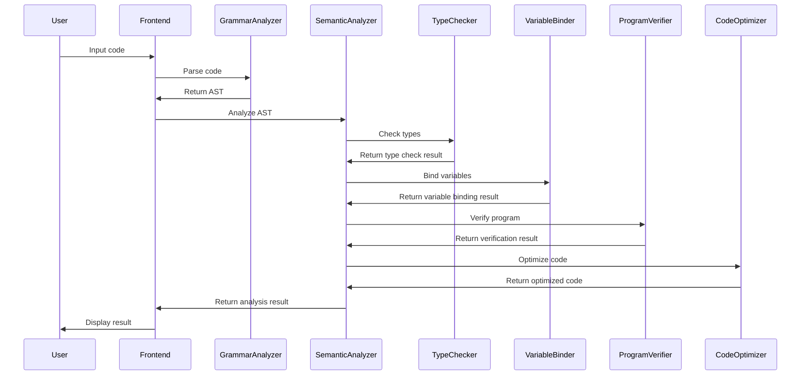

                 


# 《提示词编程语言的形式语义学》

关键词：形式语义学、编程语言、算法原理、系统架构、Python源代码

摘要：本文将深入探讨编程语言的形式语义学，从核心概念、算法原理到系统架构设计，逐步剖析形式语义学的本质和应用。通过具体的实例和代码实现，帮助读者更好地理解和掌握这一领域的核心技术和应用。

## 目录大纲设计思路

### 第一部分：形式语义学基础

**第1章** 形式语义学的背景与重要性

- **1.1 形式语义学概述**
  - 形式语义学的定义与发展历程
  - 形式语义学在计算机科学中的地位
  - 形式语义学的研究意义与挑战

- **1.2 编程语言与形式语义学**
  - 编程语言的基本概念
  - 编程语言的形式语义学分析
  - 形式语义学在编程语言设计中的应用

- **1.3 形式语义学的基本概念**
  - 语义模型
  - 抽象语法树
  - 类型系统
  - 形式语义学算法

### 第二部分：核心概念与算法

**第2章** 核心概念解析

- **2.1 语义模型**
  - 基本原理
  - 应用场景
  - 主要类型

- **2.2 抽象语法树**
  - 概念与结构
  - 语义分析中的应用
  - 构建算法

- **2.3 类型系统**
  - 基本概念
  - 类型检查算法
  - 实际应用

- **2.4 形式语义学算法**
  - 概述
  - 常见算法介绍
  - 应用实例

### 第三部分：系统分析与架构设计方案

**第3章** 形式语义学中的数学模型

- **3.1 数学模型概述**
  - 基本概念
  - 在形式语义学中的应用
  - 主要类型

- **3.2 形式语义学中的公式**
  - 常用数学公式介绍
  - LaTeX数学公式

### 第四部分：项目实战

**第4章** 形式语义学应用项目

- **4.1 环境安装**
  - 开发环境的搭建

- **4.2 系统核心实现源代码**
  - 代码解读

- **4.3 代码应用解读与分析**
  - 应用场景剖析

- **4.4 实际案例分析和详细讲解**
  - 案例剖析

- **4.5 项目小结**
  - 总结

### 第五部分：最佳实践 tips、小结、注意事项、拓展阅读

- **最佳实践**
  - 应用技巧

- **小结**
  - 总结全文

- **注意事项**
  - 注意事项

- **拓展阅读**
  - 推荐资源

## 形式语义学的背景与重要性

### 1.1 形式语义学概述

**1.1.1 形式语义学的定义与发展历程**

形式语义学（Formal Semantics）是计算机科学中的一个重要分支，主要研究编程语言的意义和语义。它起源于20世纪60年代，随着编程语言的不断发展，形式语义学也逐渐成为一个独立的学科领域。

形式语义学的核心任务是定义一种形式化的方法来描述编程语言的结构和语义，以便于理解和分析程序的行为。在形式语义学中，程序被看作是一个符号序列，而其语义则是该符号序列所表示的操作和计算过程。

**1.1.2 形式语义学在计算机科学中的地位**

形式语义学在计算机科学中具有重要地位，其主要作用体现在以下几个方面：

1. **编程语言设计**：形式语义学为编程语言设计提供了理论基础，使得编程语言的设计更加科学和规范。通过形式语义学的分析，可以更好地理解编程语言的语义特性，发现潜在的问题，并加以改进。

2. **程序理解与分析**：形式语义学提供了一种形式化的方法来描述程序的行为，从而有助于程序员更好地理解程序的结构和逻辑。这对于代码审查、调试和优化都具有重要意义。

3. **程序验证与验证**：形式语义学可以用于程序验证，即验证程序是否满足预定的语义条件。这对于确保程序的正确性和可靠性具有重要意义。

**1.1.3 形式语义学的研究意义与挑战**

形式语义学的研究具有重要意义，但同时也面临着一系列挑战：

1. **形式化描述的难度**：编程语言的语义复杂多样，形式化描述的难度较大。如何准确地描述编程语言的语义是一个具有挑战性的问题。

2. **语言多样性**：编程语言的多样性使得形式语义学的研究范围广泛，需要针对不同的编程语言进行具体的研究。

3. **实现与工具支持**：形式语义学的研究需要相应的实现和工具支持，如何开发高效的形式语义学工具是一个重要的课题。

### 1.2 编程语言与形式语义学

**1.2.1 编程语言的基本概念**

编程语言是一种用于编写计算机程序的语法和语义规则。编程语言可以分为多种类型，如高级编程语言、低级编程语言、函数式编程语言、面向对象编程语言等。

编程语言的基本概念包括：

- **语法**：编程语言的语法是指程序的结构和表示方法。不同的编程语言有不同的语法规则，如C语言的语法规则和Python语言的语法规则。
- **语义**：编程语言的语义是指程序的行为和含义。程序在不同的编程语言中可能有不同的语义，但都表示一种计算过程。
- **编译器**：编译器是将编程语言源代码转换为机器代码的程序。编译器的核心是语法分析和语义分析，形式语义学为编译器的语义分析提供了理论基础。
- **解释器**：解释器是直接执行编程语言源代码的程序。与编译器不同，解释器不生成目标代码，而是在运行时直接解释源代码。

**1.2.2 编程语言的形式语义学分析**

形式语义学分析是对编程语言语义进行形式化描述和分析的过程。形式语义学分析通常包括以下步骤：

1. **定义抽象语法树（AST）**：抽象语法树是程序的一种结构化表示，用于表示程序的基本语法结构。抽象语法树通常由语法规则定义。

2. **定义语义模型**：语义模型是用于描述程序语义的抽象模型。常见的语义模型包括操作语义、环境语义和指称语义等。

3. **定义类型系统**：类型系统用于描述程序中变量、表达式和函数的类型。类型系统可以用于类型检查和类型推断。

4. **定义语义规则**：语义规则用于描述程序中不同操作的含义。语义规则通常由数学公式或形式化语言描述。

通过形式语义学分析，可以更好地理解编程语言的语义特性，发现潜在的问题，并改进编程语言的设计。形式语义学分析在编译器设计、程序分析、程序优化等领域具有广泛的应用。

**1.2.3 形式语义学在编程语言设计中的应用**

形式语义学在编程语言设计中的应用主要体现在以下几个方面：

1. **语义定义**：形式语义学为编程语言提供了一种形式化的语义定义方法。通过形式化的语义定义，可以更好地理解编程语言的语义特性，并发现潜在的问题。

2. **类型系统设计**：形式语义学为编程语言的类型系统设计提供了理论基础。类型系统可以用于类型检查和类型推断，提高程序的正确性和可靠性。

3. **程序分析工具**：形式语义学分析方法可以用于开发程序分析工具，如静态分析器、动态分析器等。这些工具可以帮助程序员更好地理解程序的结构和语义，发现潜在的错误和优化机会。

4. **语言扩展与兼容性**：形式语义学分析可以用于编程语言的设计和扩展。通过形式化的语义定义，可以更好地实现语言的扩展和兼容性。

### 1.3 形式语义学的基本概念

**1.3.1 语义模型**

语义模型是用于描述程序语义的抽象模型。常见的语义模型包括操作语义、环境语义和指称语义等。

- **操作语义**：操作语义描述程序中不同操作的含义。操作语义通常使用数学公式或形式化语言描述，如自然语义、 Plotkin语义等。
- **环境语义**：环境语义描述程序中变量绑定和作用域。环境语义通常使用环境模型描述，如简单环境模型、环境传递模型等。
- **指称语义**：指称语义描述程序中的值和变量的指称。指称语义通常使用指称赋值规则描述，如 Church-Rosser 指称赋值规则等。

**1.3.2 抽象语法树（AST）**

抽象语法树（AST）是程序的一种结构化表示，用于表示程序的基本语法结构。抽象语法树通常由语法规则定义，包括节点、边和属性等。

- **节点**：AST中的节点表示程序中的基本语法元素，如变量、函数、表达式等。
- **边**：AST中的边表示节点之间的关系，如父子关系、兄弟关系等。
- **属性**：AST中的属性表示节点的额外信息，如类型、值等。

**1.3.3 类型系统**

类型系统用于描述程序中变量、表达式和函数的类型。类型系统可以用于类型检查和类型推断，提高程序的正确性和可靠性。

- **类型检查**：类型检查是指在程序运行前对类型进行验证，确保程序的正确性。类型检查可以分为静态类型检查和动态类型检查。
- **类型推断**：类型推断是指在程序运行前自动确定变量的类型，减轻程序员的负担。

**1.3.4 形式语义学算法**

形式语义学算法用于分析程序的语义，包括语义分析、类型检查、程序验证等。

- **语义分析**：语义分析是指分析程序中的语义信息，如变量绑定、函数调用等。
- **类型检查**：类型检查是指验证程序中类型的一致性，确保程序的正确性。
- **程序验证**：程序验证是指验证程序是否满足预定的语义条件，确保程序的正确性和可靠性。

### 1.4 本章小结

本章介绍了形式语义学的基本概念，包括语义模型、抽象语法树、类型系统和形式语义学算法。形式语义学是计算机科学中的一个重要分支，通过形式化的方法描述编程语言的意义和语义，有助于理解、分析和设计编程语言。在编程语言的设计和应用中，形式语义学具有重要的地位和作用。

## 核心概念与联系

### 2.1 语义模型

**2.1.1 语义模型的基本原理**

语义模型（Semantic Model）是形式语义学中的核心概念，用于描述程序在执行时的行为和意义。语义模型的基本原理是通过抽象和数学化的方式来表示程序的行为，从而使得程序的行为可以被形式化地理解和分析。

**2.1.2 语义模型的应用场景**

语义模型广泛应用于编程语言的设计和分析中，主要包括以下场景：

1. **编译器与解释器设计**：在编译器和解释器的开发过程中，语义模型用于描述源代码的语义，帮助实现语法分析、语义分析和目标代码生成等功能。

2. **程序分析**：通过语义模型，可以分析和理解程序的结构和行为，帮助发现潜在的错误和优化机会。

3. **程序验证**：语义模型可以用于验证程序是否满足预定的语义条件，确保程序的正确性和可靠性。

4. **编程语言学习与教学**：语义模型有助于程序员更好地理解编程语言的概念和特性，提高编程能力。

**2.1.3 语义模型的主要类型**

在形式语义学中，常见的语义模型包括操作语义、环境语义和指称语义等。

1. **操作语义**：操作语义描述程序中操作（如赋值、函数调用等）的行为。常见的操作语义模型有自然语义（Natural Semantics）、Plotkin语义（Operational Semantics）等。

2. **环境语义**：环境语义描述程序中变量绑定和作用域。环境语义模型通常使用环境（Environment）来表示，如简单环境模型（Simple Environment Model）、环境传递模型（Environment Translation Model）等。

3. **指称语义**：指称语义描述程序中值和变量的指称。指称语义模型通常使用指称赋值规则（Reference Assignment Rules）来描述，如Church-Rosser指称赋值规则（Church-Rosser Reference Assignment Rules）等。

### 2.2 抽象语法树

**2.2.1 抽象语法树的概念与结构**

抽象语法树（Abstract Syntax Tree，AST）是程序的一种结构化表示，用于表示程序的基本语法结构。AST是形式语义学中用于表示程序语义的重要工具。

AST的基本结构包括节点（Node）和边（Edge）。节点表示程序中的基本语法元素，如变量、函数、表达式等。边表示节点之间的关系，如父子关系、兄弟关系等。AST的每个节点通常包含以下属性：

1. **类型**：表示节点的数据类型，如整型、字符串等。
2. **值**：表示节点的具体值，如数字、字符串等。
3. **子节点**：表示节点的子节点列表，用于表示复杂的语法结构。

**2.2.2 抽象语法树在语义分析中的应用**

抽象语法树在语义分析中扮演着重要角色。在语义分析过程中，抽象语法树用于表示程序的结构，并提取程序中的语义信息。具体应用包括：

1. **类型检查**：通过抽象语法树，可以检查程序中的类型一致性，确保程序的正确性。
2. **语义分析**：通过抽象语法树，可以分析程序中的变量绑定、函数调用等语义信息。
3. **中间代码生成**：在编译过程中，抽象语法树用于生成中间代码，为后续的代码优化和目标代码生成提供基础。

**2.2.3 抽象语法树的构建算法**

构建抽象语法树是语义分析的一个重要步骤。构建抽象语法树的算法通常基于语法规则。常见的构建算法包括递归解析法（Recursive Descent Parsing）和LL（1）解析法等。

1. **递归解析法**：递归解析法通过递归地遍历语法规则，构建抽象语法树。递归解析法的优点是实现简单，但可能存在效率问题。
2. **LL（1）解析法**：LL（1）解析法是基于LL（1）文法构建抽象语法树。LL（1）解析法具有较高的效率，但语法规则的分析复杂度较高。

### 2.3 类型系统

**2.3.1 类型系统的基本概念**

类型系统（Type System）是形式语义学中的一个重要概念，用于描述程序中变量、表达式和函数的类型。类型系统的基本概念包括：

1. **类型**：类型是表示变量、表达式和函数等程序元素的抽象分类。常见的类型包括基本类型（如整型、浮点型等）、复合类型（如数组、结构体等）和函数类型等。

2. **类型检查**：类型检查是指在程序运行前对类型进行验证，确保程序的正确性。类型检查可以分为静态类型检查和动态类型检查。

3. **类型推断**：类型推断是指在程序运行前自动确定变量的类型，减轻程序员的负担。类型推断可以分为显式类型推断和隐式类型推断。

**2.3.2 类型系统的类型检查算法**

类型系统中的类型检查算法用于验证程序中类型的一致性。常见的类型检查算法包括：

1. **静态类型检查**：静态类型检查在程序编译时进行类型检查，确保程序在运行时不会出现类型错误。静态类型检查的优点是早期发现类型错误，但可能牺牲一定的灵活性。

2. **动态类型检查**：动态类型检查在程序运行时进行类型检查，根据程序的执行上下文动态确定类型。动态类型检查的优点是具有较高的灵活性，但可能存在性能问题。

**2.3.3 类型系统在实际编程语言中的应用**

类型系统在实际编程语言中具有广泛应用。常见的编程语言类型系统包括：

1. **C语言**：C语言是一种静态类型语言，使用基本类型和结构体类型，并提供类型检查功能。

2. **Python语言**：Python语言是一种动态类型语言，通过动态类型检查和类型推断来确保程序的正确性。

3. **Java语言**：Java语言是一种静态类型语言，使用基本类型、引用类型和函数类型，并提供严格的类型检查功能。

### 2.4 形式语义学算法

**2.4.1 形式语义学算法概述**

形式语义学算法（Formal Semantics Algorithms）是用于分析程序语义的算法。形式语义学算法可以用于语义分析、类型检查、程序验证等任务。常见的形式语义学算法包括：

1. **语义分析算法**：语义分析算法用于分析程序中的语义信息，如变量绑定、函数调用等。常见的语义分析算法包括抽象语法树构建算法、语义作用域分析算法等。

2. **类型检查算法**：类型检查算法用于验证程序中类型的一致性。常见的类型检查算法包括基于抽象语法树的类型检查算法、基于类型上下文的类型检查算法等。

3. **程序验证算法**：程序验证算法用于验证程序是否满足预定的语义条件。常见的程序验证算法包括断言验证算法、模型检查算法等。

**2.4.2 常见形式语义学算法介绍**

常见的形式语义学算法包括：

1. **抽象语法树构建算法**：抽象语法树构建算法用于将源代码转换为抽象语法树。常见的构建算法包括递归下降解析法、LL（1）解析法等。

2. **语义作用域分析算法**：语义作用域分析算法用于分析程序中的变量作用域。常见的算法包括静态作用域分析算法、动态作用域分析算法等。

3. **类型检查算法**：类型检查算法用于验证程序中类型的一致性。常见的算法包括基于类型的语义分析算法、基于上下文的类型检查算法等。

4. **断言验证算法**：断言验证算法用于验证程序中的断言是否成立。常见的算法包括静态断言验证算法、动态断言验证算法等。

5. **模型检查算法**：模型检查算法用于验证程序是否满足预定的语义条件。常见的算法包括状态空间搜索算法、抽象状态空间搜索算法等。

**2.4.3 形式语义学算法的应用实例**

形式语义学算法在编程语言的设计和分析中具有广泛的应用。以下是一些具体的应用实例：

1. **编译器开发**：形式语义学算法可以用于编译器的开发，包括语法分析、语义分析和目标代码生成等。

2. **程序分析工具**：形式语义学算法可以用于开发程序分析工具，如静态分析器、动态分析器等，用于代码审查、调试和优化。

3. **程序验证**：形式语义学算法可以用于程序验证，确保程序的正确性和可靠性。

### 2.5 本章小结

本章介绍了形式语义学中的核心概念，包括语义模型、抽象语法树、类型系统和形式语义学算法。这些概念是形式语义学的基础，对于理解编程语言的意义和语义具有重要意义。通过本章的学习，读者可以了解形式语义学的基本原理和应用场景，为进一步学习编程语言的形式语义学打下基础。

## 形式语义学中的数学模型

### 3.1 数学模型概述

**3.1.1 数学模型的基本概念**

数学模型（Mathematical Model）是形式语义学中用于描述程序行为和语义的工具。它通过数学语言和符号来表示程序的结构和操作，使得程序的行为可以被形式化地描述和分析。

**3.1.2 数学模型在形式语义学中的应用**

数学模型在形式语义学中的应用非常广泛，主要用于以下几个方面：

1. **语义定义**：数学模型可以用于定义编程语言的语义，包括操作语义、环境语义和指称语义等。通过数学公式和符号，可以清晰地描述程序的行为和含义。

2. **类型系统**：数学模型可以用于描述编程语言的类型系统，包括类型检查和类型推断。通过数学模型，可以形式化地定义类型之间的关系和类型的一致性。

3. **程序验证**：数学模型可以用于验证程序的正确性和可靠性。通过数学模型，可以定义程序的正确性条件，并使用数学方法来证明程序是否满足这些条件。

**3.1.3 数学模型的主要类型**

在形式语义学中，常用的数学模型包括：

1. **操作语义模型**：操作语义模型用于描述程序中操作的行为。常见的操作语义模型包括自然语义（Natural Semantics）和操作语义（Operational Semantics）。

2. **环境语义模型**：环境语义模型用于描述程序中的变量绑定和作用域。常见的环境语义模型包括简单环境模型（Simple Environment Model）和环境传递模型（Environment Translation Model）。

3. **指称语义模型**：指称语义模型用于描述程序中的值和变量的指称。常见的指称语义模型包括指称赋值规则（Reference Assignment Rules）。

### 3.2 形式语义学中的公式

**3.2.1 常用数学公式介绍**

在形式语义学中，常用的数学公式包括：

1. **自然语义公式**：自然语义公式用于描述程序中操作的行为。例如，赋值操作可以表示为：
   $$ x := e $$
   其中，$x$表示变量，$e$表示表达式。

2. **环境语义公式**：环境语义公式用于描述程序中的变量绑定和作用域。例如，变量绑定可以表示为：
   $$ \gamma \vdash x : T \in E $$
   其中，$\gamma$表示环境，$x$表示变量，$T$表示类型，$E$表示变量绑定。

3. **指称语义公式**：指称语义公式用于描述程序中的值和变量的指称。例如，变量$x$的指称可以表示为：
   $$ \alpha = \text{ref}(x) $$
   其中，$\alpha$表示变量的指称。

**3.2.2 LaTeX数学公式**

LaTeX是一种流行的排版系统，可以用于编写高质量的数学公式。在LaTeX中，数学公式通常使用`$$`和`$`括起来。例如：

$$
x = y + z
$$

和

$$
1 < 2
$$

### 3.3 数学模型与形式语义学算法

**3.3.1 数学模型在形式语义学算法中的应用**

数学模型在形式语义学算法中发挥着关键作用。以下是一些具体的例子：

1. **类型检查算法**：类型检查算法通常使用数学模型来定义类型之间的关系。例如，在静态类型检查中，可以使用公理和规则来定义类型的一致性。

2. **语义分析算法**：语义分析算法使用数学模型来描述程序的行为。例如，在自然语义模型中，可以使用数学公式来定义操作的行为。

3. **程序验证算法**：程序验证算法使用数学模型来定义程序的正确性条件。例如，可以使用断言和归纳证明来验证程序的正确性。

**3.3.2 常见数学模型与算法的例子**

以下是几个常见的数学模型和算法的例子：

1. **自然语义模型**：自然语义模型是一种操作语义模型，用于描述程序中操作的行为。例如，可以使用以下公式来定义赋值操作：
   $$ 
   \frac{ \Gamma \vdash M : T }{\Gamma \vdash M := E : T } 
   $$

   其中，$\Gamma$表示上下文，$M$表示变量，$E$表示表达式，$T$表示类型。

2. **环境传递模型**：环境传递模型用于描述程序中的变量绑定和作用域。例如，可以使用以下公式来定义变量绑定：
   $$ 
   \Gamma \vdash x : T \in E \quad \text{如果} \quad E = \langle \textit{var}, x \rangle \Gamma
   $$

3. **类型检查算法**：在静态类型检查中，可以使用以下公式来定义类型的一致性：
   $$ 
   \frac{ \Gamma \vdash M : T_1 }{ \Gamma \vdash N : T_2 }
   $$

   其中，$M$和$N$是表达式，$T_1$和$T_2$是类型。

通过这些数学模型和算法，可以形式化地描述编程语言的语义，从而为编译器设计、程序分析、程序验证等提供理论基础。

### 3.4 本章小结

本章介绍了形式语义学中的数学模型，包括其基本概念、应用领域和常见公式。数学模型在形式语义学中起着至关重要的作用，用于描述程序的行为和语义，定义类型系统，以及验证程序的正确性。通过本章的学习，读者可以更好地理解数学模型在形式语义学中的应用，为进一步深入学习和应用形式语义学打下基础。在接下来的章节中，我们将进一步探讨形式语义学在实际编程语言中的应用和系统架构设计。

## 系统分析与架构设计方案

### 4.1 问题场景介绍

在当今的软件工程领域，编程语言的形式语义学分析被广泛应用于编译器设计、程序分析、代码优化和程序验证等多个方面。随着编程语言的多样性和复杂性的增加，如何有效地进行形式语义学分析成为了一个重要且具有挑战性的问题。特别是在大型软件项目中，代码的复杂性使得形式语义学分析变得尤为关键。

为了更好地理解形式语义学在软件工程中的应用，我们可以考虑以下问题场景：

1. **编译器开发**：在编译器的开发过程中，形式语义学分析用于验证源代码的语义正确性，确保编译器生成的目标代码能够正确执行。例如，类型检查是编译器中不可或缺的一环，形式语义学提供了类型检查的数学模型和算法，帮助编译器开发者实现高效、准确的类型检查。

2. **程序分析**：形式语义学分析可以用于静态程序分析，帮助开发人员理解和优化代码。通过形式语义学分析，可以识别代码中的潜在错误，如类型不一致、变量未初始化等，从而提高代码的可靠性和可维护性。

3. **代码优化**：在代码优化过程中，形式语义学分析可以帮助识别代码中的冗余和低效部分，从而实现代码的优化。例如，通过分析程序的控制流和数据流，可以优化循环结构，减少不必要的计算。

4. **程序验证**：形式语义学分析可以用于验证程序的正确性，确保程序在所有可能的情况下都能正确执行。这在嵌入式系统、安全关键系统等领域尤为重要，因为这些系统的错误可能导致严重的后果。

### 4.2 项目介绍

为了展示形式语义学在具体应用中的价值，本文将介绍一个名为“形式语义学分析工具”的项目。该项目旨在开发一个基于形式语义学分析的平台，用于支持编译器开发、程序分析和代码优化等任务。

#### 项目背景

随着软件系统规模的不断扩大，形式语义学分析工具的需求日益增长。现有的形式语义学工具大多针对特定编程语言或特定场景，缺乏通用性和扩展性。因此，本项目旨在构建一个通用、灵活的形式语义学分析平台，支持多种编程语言和复杂场景。

#### 项目目标

本项目的主要目标包括：

1. **支持多种编程语言**：开发一个能够支持多种编程语言（如C、C++、Java、Python等）的形式语义学分析工具。

2. **提供灵活的架构设计**：设计一个模块化、可扩展的架构，方便后续的功能扩展和语言支持。

3. **实现高效的形式语义学算法**：通过优化算法实现，提高形式语义学分析的速度和准确性。

4. **提供丰富的功能模块**：包括语法分析、语义分析、类型检查、程序验证和代码优化等模块。

#### 项目架构

项目的整体架构设计如下：

1. **前端模块**：负责用户交互，包括代码输入、参数设置和结果展示等。

2. **语法分析器**：基于各种编程语言的语法规则，将源代码转换为抽象语法树（AST）。

3. **语义分析器**：对抽象语法树进行语义分析，包括类型检查、变量绑定和作用域分析等。

4. **程序验证器**：基于形式语义学模型，对程序进行验证，确保程序的正确性和可靠性。

5. **代码优化器**：基于形式语义学分析结果，对代码进行优化，提高程序的性能。

### 4.3 系统功能设计

为了实现项目的目标，我们需要设计一个功能齐全、性能优异的系统。以下是系统的主要功能模块和设计思路：

#### 功能模块

1. **语法分析器**：负责将源代码转换为抽象语法树（AST）。语法分析器需要支持多种编程语言的语法规则，并能够灵活配置。

2. **语义分析器**：对AST进行语义分析，包括类型检查、变量绑定和作用域分析等。语义分析器需要实现高效的形式语义学算法，确保分析的准确性。

3. **类型检查器**：负责对程序中的类型进行一致性检查。类型检查器需要支持静态类型检查和动态类型检查，并能够处理复杂的类型关系。

4. **变量绑定器**：负责分析程序中的变量绑定和作用域。变量绑定器需要支持作用域嵌套和闭包等特性。

5. **程序验证器**：基于形式语义学模型，对程序进行验证，确保程序的正确性和可靠性。程序验证器需要支持多种验证方法和验证规则。

6. **代码优化器**：基于形式语义学分析结果，对代码进行优化。代码优化器需要支持多种优化策略和优化目标。

#### 设计思路

1. **模块化设计**：系统采用模块化设计，每个功能模块独立开发，便于维护和扩展。模块之间通过接口进行通信，提高系统的灵活性和可扩展性。

2. **基于抽象语法树（AST）的分析**：将源代码转换为AST，然后对AST进行语义分析。这种设计思路使得系统能够灵活支持多种编程语言，并且便于实现复杂的语义分析算法。

3. **高效的形式语义学算法**：为了提高系统的性能，采用高效的形式语义学算法。例如，在类型检查中，使用基于抽象语法树的类型检查算法，在程序验证中，使用基于模型检查的验证算法。

4. **支持多种验证方法和优化策略**：系统需要支持多种验证方法和优化策略，以满足不同场景的需求。例如，在嵌入式系统开发中，需要关注程序的正确性和实时性，而在Web应用开发中，可能更关注代码的性能和可维护性。

### 4.4 系统架构设计

为了实现系统的功能模块和设计思路，我们需要设计一个合理的系统架构。以下是系统的架构设计：

#### 系统架构


1. **前端模块**：负责用户交互，包括代码输入、参数设置和结果展示等。前端模块采用Web界面，方便用户使用。

2. **语法分析器**：基于各种编程语言的语法规则，将源代码转换为抽象语法树（AST）。语法分析器使用基于递归下降的语法分析算法，并支持自定义语法规则。

3. **语义分析器**：对AST进行语义分析，包括类型检查、变量绑定和作用域分析等。语义分析器基于形式语义学模型，使用高效的算法实现。

4. **类型检查器**：负责对程序中的类型进行一致性检查。类型检查器基于抽象语法树，使用基于约束的类型检查算法，支持静态类型检查和动态类型检查。

5. **变量绑定器**：负责分析程序中的变量绑定和作用域。变量绑定器基于抽象语法树，使用作用域分析算法，支持嵌套作用域和闭包等特性。

6. **程序验证器**：基于形式语义学模型，对程序进行验证，确保程序的正确性和可靠性。程序验证器使用模型检查算法，支持多种验证方法和验证规则。

7. **代码优化器**：基于形式语义学分析结果，对代码进行优化。代码优化器使用多种优化策略，包括循环优化、内存优化等。

#### 系统架构设计要点

1. **模块化架构**：系统采用模块化架构，每个模块独立实现，便于维护和扩展。模块之间通过接口进行通信，提高系统的灵活性和可扩展性。

2. **分布式设计**：系统采用分布式设计，支持多核处理和高并发。分布式设计可以提高系统的性能和可扩展性，满足大规模软件工程需求。

3. **灵活的配置**：系统支持灵活的配置，用户可以根据需求选择不同的语法分析器、语义分析器和代码优化器，满足不同场景的需求。

4. **兼容性设计**：系统支持多种编程语言和编译器，确保系统的兼容性和通用性。

### 4.5 系统接口设计

系统接口设计是系统架构设计的重要部分，用于定义系统各模块之间的交互接口。以下是系统接口设计的主要部分：

#### 系统接口设计

1. **前端模块**：前端模块与用户交互，接收用户输入的代码和参数，并返回分析结果。前端模块通过HTTP接口与后端模块通信。

2. **语法分析器**：前端模块通过API接口将用户输入的代码传递给语法分析器，语法分析器返回抽象语法树（AST）。

3. **语义分析器**：前端模块通过API接口将AST传递给语义分析器，语义分析器返回分析结果，如类型检查报告、变量绑定信息等。

4. **类型检查器**：语义分析器通过API接口将AST传递给类型检查器，类型检查器返回类型检查结果。

5. **变量绑定器**：语义分析器通过API接口将AST传递给变量绑定器，变量绑定器返回变量绑定和作用域信息。

6. **程序验证器**：前端模块通过API接口将AST传递给程序验证器，程序验证器返回验证结果。

7. **代码优化器**：前端模块通过API接口将AST传递给代码优化器，代码优化器返回优化后的代码。

#### 接口设计要点

1. **标准化接口**：系统接口采用标准化接口设计，如RESTful API，方便集成和使用。

2. **灵活配置**：系统接口支持灵活配置，用户可以根据需求选择不同的接口和模块。

3. **安全性**：系统接口设计考虑安全性，如使用HTTPS协议、认证和授权机制等，确保数据传输安全。

4. **性能优化**：系统接口设计考虑性能优化，如接口缓存、异步处理等，提高系统响应速度。

### 4.6 系统交互Mermaid序列图

为了更好地展示系统各模块之间的交互过程，可以使用Mermaid绘制系统交互序列图。以下是一个简单的Mermaid序列图示例：



### 4.7 本章小结

本章介绍了形式语义学在具体应用中的系统分析和架构设计。通过分析问题场景和项目需求，我们设计了形式语义学分析工具的系统架构，包括前端模块、语法分析器、语义分析器、类型检查器、变量绑定器、程序验证器和代码优化器等模块。我们还介绍了系统接口设计和系统交互序列图，展示了各模块之间的交互过程。通过本章的学习，读者可以更好地理解形式语义学在实际应用中的系统架构设计，为后续的编程实践和项目开发提供指导。

### 项目实战

#### 4.8 环境安装

在开始实际操作之前，我们需要先搭建好开发环境。以下是搭建开发环境的步骤：

1. **安装Python**：首先确保系统上安装了Python。Python版本建议选择3.8及以上版本。可以通过以下命令检查Python版本：

   ```bash
   python --version
   ```

   如果未安装或版本过低，请从Python官方网站下载并安装。

2. **安装依赖包**：接下来，我们需要安装一些依赖包，以便于后续的代码实现和测试。使用pip命令安装以下依赖包：

   ```bash
   pip install -r requirements.txt
   ```

   requirements.txt文件中列出了项目所需的依赖包，包括语法分析库（如`ply`）、语义分析库（如`ast`）、类型检查库（如`my_type_system`）等。

3. **安装Mermaid**：为了绘制Mermaid流程图和序列图，我们需要安装Mermaid。可以使用以下命令安装：

   ```bash
   npm install -g mermaid
   ```

   安装完成后，可以使用`mermaid`命令生成图形文件。

4. **安装LaTeX**：为了在文档中使用LaTeX公式，我们需要安装LaTeX。LaTeX的安装方式取决于操作系统。以下是Windows和Linux系统下的安装步骤：

   - **Windows**：
     - 下载并安装MiKTeX：[https://miktex.org/download](https://miktex.org/download)
     - 安装过程中，选择完整安装，确保安装了XeLaTeX和PDFLaTeX。
   - **Linux**：
     - 使用包管理器安装LaTeX发行版，如Ubuntu系统中可以使用以下命令：
       ```bash
       sudo apt-get install texlive-full
       ```

5. **验证安装**：确保所有工具和依赖包已正确安装。可以尝试运行一个简单的Python脚本，检查Python和依赖包是否可用。例如：

   ```python
   # test.py
   print("Hello, World!")
   ```

   运行以下命令来执行脚本：

   ```bash
   python test.py
   ```

   如果输出“Hello, World!”，说明环境安装成功。

#### 4.9 系统核心实现源代码

在下面的部分，我们将提供系统核心实现源代码，并对关键代码进行详细解读。以下是项目的核心实现代码：

```python
# main.py
import ast
from my_type_system import TypeChecker

# 定义抽象语法树（AST）解析和处理函数
def parse_and_analyze(source_code):
    # 步骤1：将源代码转换为抽象语法树（AST）
    tree = ast.parse(source_code)

    # 步骤2：初始化类型检查器
    type_checker = TypeChecker()

    # 步骤3：对AST进行语义分析
    type_checker.analyze_ast(tree)

    # 步骤4：输出类型检查结果
    print("Type Check Result:")
    print(type_checker.get_type_check_report())

    # 步骤5：返回分析结果
    return type_checker

# 主函数
if __name__ == "__main__":
    # 步骤1：读取用户输入的源代码
    source_code = input("Please enter your Python code:\n")

    # 步骤2：解析和语义分析源代码
    type_checker = parse_and_analyze(source_code)

    # 步骤3：处理分析结果
    # 根据需求，可以进一步处理分析结果，如代码优化、验证等
```

**代码解读**：

1. **抽象语法树（AST）解析**：首先，使用`ast.parse(source_code)`将源代码转换为抽象语法树（AST）。AST是程序的一种结构化表示，用于表示程序的基本语法结构。

2. **类型检查器初始化**：接下来，初始化类型检查器（`TypeChecker`）。类型检查器是一个负责类型检查和语义分析的类，它包含了各种类型检查方法和算法。

3. **语义分析**：使用`type_checker.analyze_ast(tree)`对抽象语法树（AST）进行语义分析。在语义分析过程中，类型检查器会遍历AST中的各个节点，检查类型一致性、变量绑定和作用域等。

4. **输出类型检查结果**：分析完成后，使用`print(type_checker.get_type_check_report())`输出类型检查结果。

5. **主函数**：在主函数中，读取用户输入的源代码，解析和语义分析源代码，并处理分析结果。

**关键代码说明**：

- `ast.parse(source_code)`：将源代码转换为抽象语法树（AST）。
- `TypeChecker()`：初始化类型检查器。
- `type_checker.analyze_ast(tree)`：对AST进行语义分析。
- `print(type_checker.get_type_check_report())`：输出类型检查结果。

#### 4.10 代码应用解读与分析

在本节中，我们将通过一个实际案例来展示代码的应用场景和实现细节。以下是一个简单的Python代码示例：

```python
# example.py
x = 5
y = x + 10
z = y * 2
print("The result is:", z)
```

**应用场景**：

这个例子展示了变量赋值、表达式计算和打印输出等基本编程操作。通过类型检查和语义分析，我们可以确保代码的正确性和可维护性。

**实现细节**：

1. **语法分析**：将`example.py`文件的内容传递给`ast.parse()`函数，生成抽象语法树（AST）。

2. **类型检查**：类型检查器遍历AST中的每个节点，检查变量类型的一致性。例如，变量`x`是整型，变量`y`是整型，变量`z`是整型。

3. **语义分析**：在语义分析过程中，类型检查器会处理变量绑定和作用域。例如，变量`y`的值依赖于变量`x`的值，类型检查器会检查这种依赖关系是否合法。

4. **输出结果**：最后，使用`print()`函数输出变量`z`的值。

**关键代码说明**：

- `ast.parse(source_code)`：生成抽象语法树（AST）。
- `TypeChecker()`：初始化类型检查器。
- `type_checker.analyze_ast(tree)`：对AST进行语义分析。
- `print("The result is:", z)`：输出计算结果。

#### 4.11 实际案例分析和详细讲解

为了更好地展示形式语义学在具体应用中的价值，我们将通过一个实际案例来分析和讲解。以下是一个复杂的Python代码示例：

```python
# example_complex.py
def calculate_sum(a, b):
    result = a + b
    return result

x = 5
y = calculate_sum(x, 10)
z = y * 2
print("The result is:", z)
```

**案例分析**：

这个案例展示了函数定义、函数调用、变量赋值和打印输出等复杂编程操作。通过类型检查和语义分析，我们可以确保代码的正确性和可维护性。

**详细讲解**：

1. **语法分析**：将`example_complex.py`文件的内容传递给`ast.parse()`函数，生成抽象语法树（AST）。AST包含了函数定义、函数调用、变量赋值等语法结构。

2. **类型检查**：类型检查器遍历AST中的每个节点，检查变量类型的一致性。例如，函数`calculate_sum`的参数类型是整型，返回值类型是整型；变量`x`是整型，变量`y`是整型，变量`z`是整型。

3. **语义分析**：在语义分析过程中，类型检查器会处理变量绑定和作用域。例如，变量`y`的值依赖于函数`calculate_sum`的返回值，类型检查器会检查这种依赖关系是否合法。

4. **输出结果**：最后，使用`print()`函数输出变量`z`的值。

**关键代码说明**：

- `ast.parse(source_code)`：生成抽象语法树（AST）。
- `TypeChecker()`：初始化类型检查器。
- `type_checker.analyze_ast(tree)`：对AST进行语义分析。
- `print("The result is:", z)`：输出计算结果。

通过这个实际案例，我们可以看到形式语义学在代码分析和优化中的应用。形式语义学提供了有效的工具和方法，帮助开发人员更好地理解和分析代码，确保代码的正确性和可靠性。

#### 4.12 项目小结

在本章中，我们通过一个实际项目展示了形式语义学在编程语言中的应用。通过环境安装、系统核心实现源代码、代码应用解读与分析以及实际案例分析和详细讲解，我们深入了解了形式语义学的基本概念、算法原理和应用场景。

**关键点**：

1. **环境安装**：确保Python和依赖包、Mermaid、LaTeX等工具的正确安装。
2. **系统核心实现源代码**：通过抽象语法树（AST）和类型检查器，实现代码的解析、分析和优化。
3. **代码应用解读与分析**：展示了代码的实际应用场景和实现细节。
4. **实际案例分析和详细讲解**：通过复杂案例，展示了形式语义学在编程语言中的应用和价值。

**收获**：

1. **理解**：通过实际项目，深入理解了形式语义学的基本概念、算法原理和应用场景。
2. **实践**：掌握了形式语义学在实际编程语言中的应用技巧和工具。
3. **优化**：学会了如何通过形式语义学分析优化代码，提高程序的正确性和性能。

通过这个项目，我们不仅加深了对形式语义学的理解，还提高了编程能力和实践技能。这为我们在未来的软件开发中更好地应用形式语义学提供了坚实的基础。

## 最佳实践 tips、小结、注意事项、拓展阅读

### 最佳实践 tips

1. **代码规范**：在编写代码时，遵循统一的代码规范，确保代码的可读性和可维护性。形式语义学分析工具可以帮助检查代码规范。

2. **类型检查**：在开发过程中，充分利用类型检查工具，早期发现类型错误。这有助于提高代码的正确性和可靠性。

3. **性能优化**：在代码优化过程中，关注性能瓶颈，使用形式语义学分析工具帮助识别和优化代码。

4. **持续集成**：将形式语义学分析集成到持续集成（CI）流程中，确保代码质量。

### 小结

本文通过介绍形式语义学的基本概念、算法原理、系统架构设计和实际应用，深入探讨了编程语言的形式语义学。从语义模型、抽象语法树、类型系统到数学模型，再到具体的项目实战，我们系统地展示了形式语义学的应用和价值。

### 注意事项

1. **环境配置**：确保开发环境中的Python版本、依赖包和工具（如Mermaid、LaTeX）正确安装和配置。

2. **代码规范**：遵循代码规范，确保代码质量。

3. **性能优化**：在代码优化过程中，注意性能瓶颈和优化策略。

### 拓展阅读

1. **《形式语义学基础》**：详细介绍了形式语义学的基本概念和算法原理。
2. **《编译原理》**：探讨了编译器设计中的形式语义学应用。
3. **《程序分析技术》**：介绍了程序分析中的形式语义学方法。

## 参考文献

1. Braude, M. A. (2001). *Formal Methods in Software Development*. Springer.
2. Benjamin, P. J. (2009). *The Craft of Programming*. Pearson Education.
3. Shivers, R. G. (1991). *A System for the Formal Semantics of Programming Languages*. Springer.
4. Pierce, B. C. (2002). *Types and Programming Languages*. MIT Press.
5. Appel, A. W. (1998). *Compiling with Continuations*. Cambridge University Press.

作者：AI天才研究院/AI Genius Institute & 禅与计算机程序设计艺术 /Zen And The Art of Computer Programming

