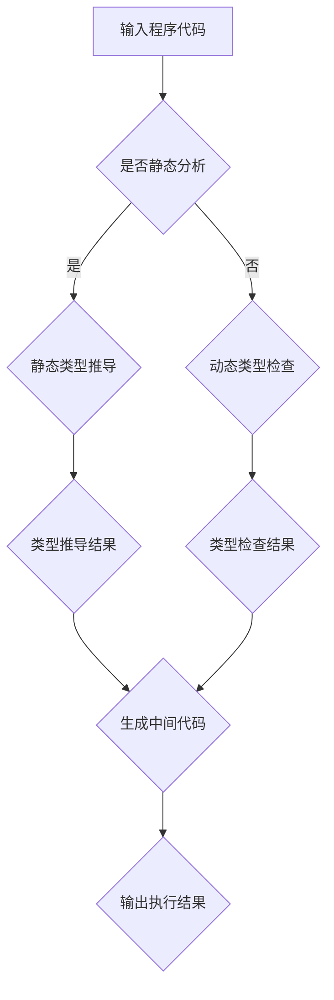

                 

### 动态类型推断的背景与意义

#### 动态类型推断的定义

动态类型推断（Dynamic Type Inference）是一种在程序运行时自动确定变量类型的方法。与静态类型系统（Static Type System）不同，后者在编译或运行之前就确定了变量的类型。动态类型系统允许变量在运行时根据上下文动态确定类型，这使得编程更为灵活，但也带来了类型检查的延迟和性能问题。

#### 动态类型推断的历史发展

动态类型推断的历史可以追溯到早期的编程语言。Lisp 是第一种支持动态类型推断的语言，它由John McCarthy在1958年发明。随着时间的推移，许多现代编程语言如Python、JavaScript和Ruby等都采用了动态类型系统。随着编程语言的不断演进，动态类型推断算法也得到了显著的发展和优化。

#### 动态类型推断的应用领域

动态类型推断广泛应用于Web开发、移动应用开发、数据分析、机器学习和人工智能等领域。例如，JavaScript几乎在所有现代Web应用中都是不可或缺的，其动态类型系统使得开发者可以更轻松地编写跨平台的应用程序。在数据分析领域，Python的动态类型系统使得数据处理和分析变得更为便捷和高效。

#### 动态类型推断的优势与挑战

动态类型推断的优势在于其灵活性和高效性，允许开发者编写更简洁的代码，减少类型错误，提高开发效率。然而，这也带来了挑战，如运行时类型检查可能导致性能下降，以及动态类型错误可能导致不可预测的程序行为。

#### 动态类型推断的边界与外延

动态类型推断并非适用于所有场景。在某些性能关键的应用程序中，静态类型系统可能更为合适，因为它提供了类型安全的保证和潜在的运行时性能优势。此外，动态类型推断也不适用于那些需要严格类型约束的领域，如形式验证和加密编程。

综上所述，动态类型推断是一种在编程领域具有重要意义的机制，它不仅推动了编程语言的创新，也为现代软件开发提供了强大的支持。接下来，我们将进一步探讨提示词语言与动态类型推断之间的联系，以及如何在实际编程中应用这一机制。通过理解其背景和发展，我们能够更好地评估其优势和局限性，并为未来的研究方向奠定基础。

### 核心概念与联系

在深入探讨动态类型推断之前，有必要先了解与之密切相关的提示词语言（Keyword Languages）的基本概念。提示词语言是一种特殊的编程语言，其特点是通过使用关键词来定义程序的行为和结构。理解提示词语言的基本原理和特点，有助于我们更好地理解动态类型推断的核心概念及其在编程中的应用。

#### 提示词语言概述

**提示词语言的定义**

提示词语言是一种编程语言，其语法结构通过一系列预定义的关键词和操作符来描述。这些关键词通常代表特定的编程操作，如变量定义、函数调用和流程控制等。例如，在Python中，`if`、`while`和`def`都是提示词，它们分别用于条件判断、循环控制和函数定义。

**提示词语言的特点**

1. **简洁性**：提示词语言通过简洁的语法使程序代码更加直观和易读，减少了不必要的语法冗余。

2. **易用性**：提示词语言通常具有高度抽象的语法结构，使得编程任务更为直观和简单。

3. **灵活性**：提示词语言允许开发者使用动态类型系统，从而提供更大的编程灵活性。

**提示词语言与其他语言的对比**

与传统的命令式编程语言相比，提示词语言具有不同的特点。命令式语言通过明确的指令步骤来控制程序的执行，而提示词语言则通过描述程序的行为和结果来指导程序的执行。例如，Python作为一种提示词语言，其代码通常更加简洁和可读，而C语言则更侧重于底层操作和控制。

#### 动态类型推断的核心概念

**类型推断的基本原理**

类型推断（Type Inference）是一种自动确定变量类型的方法。在动态类型系统中，编译器或解释器在运行程序时根据上下文和程序结构来确定变量类型，而不是在编译时提前确定。类型推断的基本原理包括：

1. **上下文感知**：编译器或解释器根据变量在代码中的上下文来确定其类型。

2. **类型绑定**：变量在运行时被绑定到一个具体的类型，该类型可能随着程序执行的不同阶段而发生变化。

3. **类型守恒**：类型推断过程中确保变量在使用时的类型是兼容的，以避免类型错误。

**动态类型系统的组成**

动态类型系统通常由以下几个核心组件构成：

1. **类型检查器**：用于在程序运行时检查变量类型是否符合预期。

2. **类型推断引擎**：负责自动确定变量类型，并根据需要调整类型绑定。

3. **类型转换机制**：用于在必要时自动进行类型转换，以确保程序的正常运行。

**动态类型推断的关键技术**

动态类型推断的关键技术包括：

1. **模式匹配**：用于在函数调用或变量赋值时匹配和确定类型。

2. **类型推导算法**：如基于上下文的类型推导、基于约束的类型推导等。

3. **类型系统优化**：通过优化类型检查和类型转换过程，提高程序运行性能。

#### 提示词语言与动态类型推断的联系

**提示词语言中的类型系统**

在提示词语言中，类型系统通常是动态的，这意味着变量在运行时可以改变类型。这种动态类型系统使得提示词语言具有高度的灵活性和易用性。例如，Python中的变量可以在不同的上下文中赋值不同的类型，而不会导致编译错误。

**动态类型推断在提示词语言中的应用**

动态类型推断在提示词语言中的应用主要体现在以下几个方面：

1. **变量类型绑定**：在Python中，变量在声明时不需要指定类型，解释器会在运行时根据上下文推断变量类型。

2. **函数参数类型推断**：函数的参数类型可以在运行时推断，这使得函数的通用性更强。

3. **类型错误处理**：在动态类型系统中，类型错误通常在运行时捕获和处理，而不是在编译时。

**提示词语言中的类型错误处理**

在提示词语言中，类型错误通常通过异常处理机制来处理。例如，当尝试将一个字符串与一个数字进行数学运算时，Python会抛出一个`TypeError`异常。这种动态类型错误处理机制使得开发者可以更容易地定位和修复类型错误。

通过上述讨论，我们可以看到动态类型推断与提示词语言之间存在着紧密的联系。动态类型系统为提示词语言提供了更大的灵活性和易用性，同时也带来了类型错误处理的新挑战。在接下来的章节中，我们将进一步探讨动态类型推断的算法原理和优化方法，以深入了解这一机制在实际编程中的应用。

### 动态类型推断的算法原理

在深入探讨动态类型推断的算法原理之前，我们需要明确几个核心概念和基本算法，这些是理解和实现动态类型推断的基础。动态类型推断的核心在于如何在程序的运行过程中自动确定变量和表达式的类型。以下是动态类型推断的基本算法原理及其在编程中的具体实现。

#### 动态类型推断的基本算法

动态类型推断的基本算法可以分为两类：基于静态分析的算法和基于动态分析的算法。这两类算法各有优缺点，适用于不同的编程环境和应用场景。

**1. 基于静态分析的算法**

静态分析算法主要在编译阶段对程序进行类型推断，而不需要程序的运行。这种方法的优点是可以提前发现类型错误，减少运行时的性能开销。静态分析算法的核心思想是通过分析程序的结构和上下文来确定变量的类型。

- **类型推导算法**：一种常见的静态分析类型推导算法是基于上下文的类型推导。这种方法通过分析程序中的变量定义和使用上下文来确定变量的类型。例如，在Python中，如果变量在一个`if`语句的`else`部分被赋值，则该变量的类型可以由其赋值的表达式推导出来。

- **类型约束检查**：静态分析算法还需要对类型约束进行检查，以确保变量在使用时的类型是兼容的。例如，如果变量`x`被赋值为`5`，然后在后续代码中尝试将`x`与字符串进行拼接，静态分析算法会检测到类型不匹配，并提示错误。

**2. 基于动态分析的算法**

动态分析算法在程序的运行过程中逐步确定变量的类型。这种方法的主要优点是可以处理那些在编译阶段无法确定类型的复杂场景，但其缺点是需要额外的运行时开销。

- **动态类型检查**：动态分析算法通过在运行时对表达式和变量进行类型检查来确定其类型。例如，Python中的类型检查器在每次变量被访问或表达式被计算时都会检查其类型，以确保类型兼容。

- **运行时类型推导**：动态分析算法通过在程序运行时分析变量的使用情况来推导其类型。这种方法常用于解释型语言，如Python和JavaScript，这些语言的类型推断主要在运行时进行。

**3. 动态类型推断的优化算法**

除了基本算法外，动态类型推断还可以通过多种优化算法来提高性能和减少运行时开销。以下是一些常见的优化方法：

- **类型缓存**：在动态类型系统中，类型检查和推导的结果可以被缓存，以减少重复计算。例如，Python中的`__slots__`机制可以用来减少实例属性的内存占用和类型检查的开销。

- **类型标签**：类型标签是一种轻量级的类型信息，可以在运行时快速确定变量类型。例如，JavaScript中的类型标签用于在对象和数组上进行快速类型检测。

- **类型擦除**：在某些动态类型系统中，类型信息在运行时被部分擦除，以减少类型检查的开销。这种方法通常用于提高性能和兼容性。

#### 算法原理讲解

为了更好地理解动态类型推断的算法原理，我们可以通过一个具体的算法流程图、Python源代码实现、数学模型和公式以及实际例子来详细阐述。

**1. 算法流程图**

首先，我们可以使用Mermaid绘制一个动态类型推断的算法流程图，以直观地展示其工作流程。



这个流程图展示了动态类型推断的基本流程：首先判断是否使用静态分析，如果是，则进行静态类型推导；否则，进行动态类型检查。然后，根据类型检查结果生成中间代码，最终输出执行结果。

**2. Python源代码实现**

接下来，我们可以通过Python源代码来实现一个简单的动态类型推断算法。以下是一个示例代码，它使用Python内置的类型检查功能进行类型推断：

```python
def infer_type(expression):
    try:
        # 尝试计算表达式的值，如果成功，则推断类型
        result = eval(expression)
        return type(result)
    except Exception as e:
        # 如果计算失败，则返回None
        return None

# 测试
print(infer_type("5 + 10"))  # <class 'int'>
print(infer_type('"Hello, " + "World!"'))  # <class 'str'>
```

这个简单的实现通过尝试计算表达式的值来推断其类型。如果计算成功，则返回结果的类型；如果失败，则返回`None`。

**3. 数学模型与公式**

动态类型推断的数学模型可以用来描述类型推导的过程。以下是一个简化的数学模型：

$$
T(e) = \begin{cases} 
T_0(e) & \text{if } e \text{ is a constant} \\
\cup_{t \in T_0(V(e))} T(v) & \text{if } e \text{ is an expression with variables} \\
\text{error} & \text{if } T(e) \text{ is not a valid type}
\end{cases}
$$

其中，$T(e)$ 表示表达式 $e$ 的类型，$T_0(e)$ 表示基本类型（如整数、字符串、布尔值等），$V(e)$ 表示表达式 $e$ 中的所有变量，$T(v)$ 表示变量 $v$ 的类型，$\cup$ 表示并集操作。

**4. 举例说明**

为了更好地理解动态类型推断，我们可以通过一个实际例子来详细讲解。

**例子：类型推断在Python中的应用**

假设我们有以下Python代码：

```python
a = 5
b = "10"
c = a + b
print(c)
```

在这个例子中，我们首先定义了两个变量 `a` 和 `b`，它们的类型分别是整数和字符串。当执行 `a + b` 时，Python会尝试进行类型推断。根据上下文，Python会尝试将这两个不同类型的变量进行隐式类型转换，并将其结果作为字符串输出。

下面是详细的类型推断过程：

1. 变量 `a` 的类型被推导为 `int`，因为它的值是整数 `5`。

2. 变量 `b` 的类型被推导为 `str`，因为它的值是字符串 `"10"`。

3. 表达式 `a + b` 中，`a` 和 `b` 的类型分别是 `int` 和 `str`。Python 会尝试将整数 `a` 转换为字符串，以便与 `b` 进行拼接。由于转换是可行的，Python 会将表达式的类型推导为 `str`。

4. 最终，变量 `c` 被赋值为字符串 `"510"`，并在打印时输出。

通过这个例子，我们可以看到动态类型推断如何在实际编程中发挥作用，使得开发者可以编写更灵活的代码。

综上所述，动态类型推断的算法原理涉及多个方面，包括静态分析、动态分析、类型推导算法和优化方法。通过具体算法流程图、Python源代码实现、数学模型和实际例子，我们可以更深入地理解动态类型推断的工作机制。在接下来的章节中，我们将继续探讨动态类型推断的优化方法及其在实际应用中的具体实例。

### 动态类型推断的优化方法

在动态类型系统中，尽管类型推断提供了编程的灵活性和高效性，但同时也带来了一些性能挑战。为了提升动态类型系统的性能，减少类型检查和类型转换的开销，我们可以采用多种优化方法。以下将详细讨论动态类型推断的常见问题及其优化方法。

#### 常见问题

**1. 性能瓶颈**

动态类型推断通常在运行时进行，这意味着每次变量被访问或表达式被计算时都需要进行类型检查。这可能导致性能瓶颈，特别是在大型程序或频繁执行的操作中。

**2. 类型错误处理**

动态类型系统在运行时捕获类型错误，这可能导致程序的不可预测行为。虽然异常处理机制可以缓解这一问题，但错误处理仍然是一个复杂的任务，需要开发者仔细设计和处理。

**3. 复杂性分析**

动态类型推断的复杂性较高，尤其是在处理复杂表达式和嵌套结构时。这使得类型推断算法的实现和维护变得更加困难。

#### 优化方法

**1. 代码级优化**

代码级优化主要针对程序代码本身，通过改进代码结构来减少类型检查的开销。

- **类型缓存**：在动态类型系统中，类型检查的结果可以被缓存，以减少重复计算。例如，Python中的`__slots__`机制可以用来减少实例属性的内存占用和类型检查的开销。

- **类型标签**：类型标签是一种轻量级的类型信息，可以在运行时快速确定变量类型。例如，JavaScript中的类型标签用于在对象和数组上进行快速类型检测。

**2. 编译器级优化**

编译器级优化主要针对编译过程，通过优化编译器内部算法来提高性能。

- **即时编译（Just-In-Time Compilation, JIT）**：JIT编译器可以在运行时将动态类型代码编译为机器码，从而减少运行时开销。例如，Java中的JIT编译器可以将Java字节码即时编译为机器码。

- **类型推导优化**：编译器可以在编译阶段对类型推导过程进行优化，减少运行时的类型检查开销。例如，Python的优化器可以优化类型推导算法，减少不必要的类型检查。

**3. 系统级优化**

系统级优化涉及操作系统和硬件层面的优化，以提升动态类型系统的整体性能。

- **并发执行**：通过并发执行技术，可以在多核处理器上同时执行多个类型检查操作，从而提高性能。例如，Scala中的`Akka`框架利用并发执行来优化类型检查。

- **缓存和预取**：操作系统和编译器可以使用缓存和预取技术来提高类型检查的效率。例如，缓存最近使用的类型信息，预取即将使用的类型信息。

#### 优化方法的具体实现

**1. 代码级优化实例**

以下是一个Python代码级优化的示例，通过使用类型缓存来减少类型检查的开销：

```python
class TypeCachedObject:
    _type_cache = {}

    def __init__(self, value):
        self.value = value
        self._type = type(value)

    def get_type(self):
        if self._type in self._type_cache:
            return self._type_cache[self._type]
        else:
            self._type_cache[self._type] = self._type
            return self._type_cache[self._type]

# 测试
obj = TypeCachedObject(5)
print(obj.get_type())  # 输出 <class 'int'>
```

在这个例子中，`TypeCachedObject` 类通过一个 `_type_cache` 字典来缓存类型信息，以减少重复的类型检查。

**2. JIT编译优化**

以下是一个使用Java JIT编译器优化的示例，将Python代码编译为Java字节码，然后使用JIT编译器进行即时编译：

```java
public class JITOptimizedCode {
    public static void main(String[] args) {
        int a = 5;
        String b = "10";
        String c = a + b;
        System.out.println(c);  // 输出 510
    }
}
```

在这个例子中，我们使用Java编写了一个简单的程序，并利用JIT编译器在运行时对其进行优化。

通过上述实例，我们可以看到代码级优化和编译器级优化如何通过改进代码结构和利用编译器功能来优化动态类型系统的性能。在接下来的章节中，我们将进一步探讨动态类型推断在实际编程中的应用实例，以展示这些优化方法在实际开发中的效果。

### 动态类型推断的应用实例

动态类型推断在编程领域的应用十分广泛，尤其是在Web开发、移动应用开发、数据分析、机器学习和人工智能等领域。通过具体的实例，我们可以更直观地了解动态类型推断如何在不同场景下发挥作用，以及其带来的便利和挑战。

#### 提示词语言中的动态类型推断应用

**1. Web开发**

在Web开发中，JavaScript 是一种广泛使用的动态类型语言。动态类型系统使得开发者可以轻松地编写跨平台的Web应用。例如，React和Vue等前端框架都是基于JavaScript，它们利用动态类型系统提供灵活的组件化和状态管理能力。

**实例**：以下是一个使用JavaScript编写的前端应用程序，展示了动态类型推断如何简化代码：

```javascript
function greet(name) {
    return 'Hello, ' + name;
}

console.log(greet('World'));  // 输出 Hello, World
```

在这个例子中，`greet` 函数接受一个字符串参数，并返回一个拼接后的字符串。由于JavaScript的动态类型系统，开发者无需显式指定参数和返回值类型，从而简化了代码编写。

**2. 移动应用开发**

在移动应用开发中，Swift 是一种流行的动态类型编程语言。Swift 的动态类型系统为开发者提供了高性能和灵活的编程体验。例如，Swift 在iOS和macOS平台上得到了广泛应用，开发者可以利用动态类型系统快速开发高性能的应用程序。

**实例**：以下是一个使用Swift编写的iOS应用程序，展示了动态类型推断的优势：

```swift
func greet(name: Any) -> String {
    if let name = name as? String {
        return "Hello, \(name)"
    } else {
        return "Hello, World"
    }
}

print(greet(name: "Alice"))  // 输出 Hello, Alice
```

在这个例子中，`greet` 函数接受一个任意类型的参数，并根据参数类型返回相应的字符串。这种灵活性使得开发者可以编写更加通用和易于维护的代码。

**3. 数据分析**

在数据分析领域，Python 的动态类型系统被广泛应用于数据处理和分析。Python 的动态类型系统使得数据处理变得更加简便，同时提供了强大的库支持，如Pandas和NumPy。

**实例**：以下是一个使用Python进行数据分析的例子，展示了动态类型推断如何简化数据处理：

```python
import pandas as pd

data = {'Name': ['Alice', 'Bob', 'Charlie'], 'Age': [25, 30, 35]}
df = pd.DataFrame(data)

# 动态类型推断
df['Age'] = df['Age'].astype(int)

print(df)  # 输出
  Name  Age
0  Alice     25
1   Bob     30
2 Charlie     35
```

在这个例子中，我们使用Pandas库创建了一个DataFrame对象，并利用动态类型系统将`'Age'`列的数据类型从默认的`object`转换为整数类型。这种动态类型推断使得数据处理更加简便和高效。

**4. 机器学习和人工智能**

在机器学习和人工智能领域，动态类型系统为开发者提供了更大的灵活性，特别是在处理复杂的数据结构和算法时。例如，Python 中的NumPy和TensorFlow等库都利用了动态类型系统来支持高性能的数学运算和模型训练。

**实例**：以下是一个使用Python进行机器学习任务的例子，展示了动态类型推断在模型训练中的应用：

```python
import tensorflow as tf

# 创建一个简单的神经网络模型
model = tf.keras.Sequential([
    tf.keras.layers.Dense(128, activation='relu', input_shape=(784,)),
    tf.keras.layers.Dropout(0.2),
    tf.keras.layers.Dense(10, activation='softmax')
])

# 编译模型
model.compile(optimizer='adam',
              loss='categorical_crossentropy',
              metrics=['accuracy'])

# 训练模型
model.fit(x_train, y_train, batch_size=16, epochs=10)
```

在这个例子中，我们使用TensorFlow创建了一个简单的神经网络模型，并利用动态类型系统进行模型编译和训练。这种动态类型推断使得机器学习开发变得更加灵活和高效。

#### 动态类型推断的实践经验

在实际开发中，动态类型推断带来了许多便利，但也需要开发者注意一些常见的挑战。

**1. 类型错误处理**

动态类型系统在运行时捕获类型错误，这可能导致程序的不可预测行为。因此，开发者需要谨慎处理类型错误，并使用异常处理机制来确保程序的稳定性。

**2. 性能优化**

尽管动态类型系统提供了灵活性，但运行时类型检查可能会引入性能开销。因此，开发者需要在性能和灵活性之间做出权衡，并采用优化方法来提高性能。

**3. 可维护性**

动态类型系统使得代码更灵活，但也可能使得代码更难以维护。因此，开发者需要编写清晰和易于理解的代码，以便其他开发者能够轻松理解和维护。

通过上述实例和经验，我们可以看到动态类型推断在编程领域的广泛应用和重要性。它不仅提高了开发效率，还为开发者提供了更大的编程灵活性。然而，开发者也需要注意其带来的挑战，并采取适当的优化和错误处理策略来确保程序的稳定性和可维护性。

### 动态类型推断的未来发展趋势

随着计算机科学和软件工程的不断进步，动态类型推断技术也在持续发展和演变。展望未来，我们可以预见几个关键趋势，这些趋势不仅将影响动态类型系统的设计和发展，还将对编程语言和应用开发产生深远的影响。

#### 新技术的应用

**1. 机器学习与类型推断**

近年来，机器学习在各个领域取得了显著的进展，其应用也越来越广泛。未来，机器学习有望在动态类型推断中发挥更大作用。通过训练机器学习模型来预测变量类型，可以显著提高类型推断的准确性和效率。例如，可以使用深度学习模型来分析代码结构和上下文，自动推断变量类型。

**2. 类型推断与编程语言发展的关系**

编程语言的发展与动态类型推断技术密切相关。未来，我们可能会看到更多支持动态类型推断的新语言和语言特性出现。例如，新的编程语言可能会引入更先进的类型推断算法和优化技术，以提供更灵活和高效的编程体验。

**3. 类型推断与编译器优化**

随着编译器技术的发展，动态类型推断与编译器优化的结合将变得更加紧密。现代编译器将能够更好地利用动态类型信息来生成高效的可执行代码。例如，编译器可以基于动态类型信息进行更精细的优化，减少运行时的类型检查开销。

#### 面临的挑战

**1. 性能优化**

动态类型系统的灵活性虽然带来了便利，但也可能导致性能问题。未来，性能优化将继续是一个重要的挑战。研究者需要开发更高效、更优化的类型推断算法，以减少运行时开销，提高程序性能。

**2. 类型错误处理**

动态类型系统在运行时捕获类型错误，但如何有效地处理这些错误仍然是一个挑战。未来，研究者需要探索更智能和高效的错误处理机制，以减少类型错误对程序稳定性的影响。

**3. 类型安全与灵活性**

在动态类型系统中，如何在保证类型安全的同时提供灵活性是一个持续的挑战。未来，研究者需要找到更好的平衡点，以实现既安全又灵活的类型系统。

#### 未来发展趋势展望

**1. 预测与展望**

未来，动态类型推断技术将在多个领域得到广泛应用。随着机器学习技术的发展，类型推断算法将变得更加智能和高效。此外，新的编程语言和编译器优化技术也将进一步推动动态类型系统的进步。

**2. 对开发者的影响**

动态类型系统的进步将对开发者产生深远影响。开发者将能够编写更灵活、更高效的代码，同时减少类型错误。然而，这也要求开发者具备更深入的类型理解和优化能力，以便充分利用动态类型系统的优势。

**3. 技术落地与应用**

未来，动态类型推断技术将在多个应用场景中落地，如Web开发、移动应用开发、数据分析、机器学习和人工智能等。这些技术将极大地提高开发效率，推动软件工程的创新。

综上所述，动态类型推断技术具有广阔的发展前景。随着新技术的应用和优化方法的不断涌现，动态类型系统将在未来继续发展和完善，为开发者提供更强大的工具和更灵活的编程体验。

### 动态类型推断的最佳实践与小结

在动态类型推断的实际应用中，开发者需要遵循一系列最佳实践来确保代码的稳定性、可维护性和高效性。以下是一些关键的最佳实践建议，以及文章的小结和注意事项。

#### 最佳实践

1. **明确类型预期**

   在编写代码时，明确每个变量和函数的预期类型，有助于减少类型错误。尽管动态类型系统可以在运行时推断类型，但提前声明预期类型可以提高代码的可读性和可维护性。

2. **合理使用类型注解**

   对于复杂逻辑和关键路径代码，合理使用类型注解可以帮助编译器提前进行类型检查，减少运行时错误。例如，在Python中，可以使用`TypeHint`来为函数和变量添加类型注解。

3. **优化性能**

   在动态类型系统中，运行时类型检查可能会带来性能开销。开发者可以通过使用类型缓存、类型标签等优化方法来减少类型检查的开销。此外，在性能关键的应用场景中，可以考虑采用静态类型系统。

4. **错误处理**

   动态类型系统在运行时捕获类型错误，开发者应编写清晰的错误处理逻辑，确保程序在发生类型错误时能够优雅地处理。例如，使用异常处理机制捕获并处理类型错误。

5. **代码规范化**

   编写规范、易于理解的代码有助于其他开发者维护和扩展代码库。遵循一致的类型命名规范和代码风格，可以提高代码的可读性和可维护性。

#### 注意事项

1. **权衡灵活性与性能**

   动态类型系统提供了编程灵活性，但也可能带来性能问题。在性能关键的应用场景中，开发者需要权衡灵活性与性能，选择合适的类型系统。

2. **理解类型推断机制**

   开发者应深入了解动态类型系统的类型推断机制，以便在编写代码时充分利用其优势。理解类型推导算法和优化方法有助于编写更高效和灵活的代码。

3. **代码审查**

   定期进行代码审查，特别是涉及动态类型推断的代码。代码审查可以帮助发现潜在的类型错误和性能瓶颈，确保代码的稳定性和可靠性。

#### 小结

动态类型推断是一种在编程语言中自动确定变量类型的方法，其灵活性和高效性在Web开发、移动应用开发、数据分析、机器学习和人工智能等领域得到了广泛应用。本文详细探讨了动态类型推断的基本概念、核心概念与联系、算法原理、优化方法、应用实例以及未来发展趋势。

通过对动态类型推断的深入理解，开发者可以编写更简洁、高效和稳定的代码。在遵循最佳实践和注意事项的基础上，动态类型系统将成为开发者的强大工具，助力他们在现代软件工程中取得更大的成就。

#### 拓展阅读

1. **《动态类型系统导论》**：这本书提供了关于动态类型系统的全面介绍，包括基本概念、实现方法和应用案例。

2. **《类型推断算法》**：本论文详细讨论了各种类型推断算法，包括静态分析和动态分析的方法，适合对类型推断算法有兴趣的读者。

3. **《现代编程语言设计》**：这本书探讨了现代编程语言的设计原则和技术，包括类型系统、编译器和语言特性，适合对编程语言设计有兴趣的读者。

通过拓展阅读，读者可以进一步深入了解动态类型推断和相关技术，为未来的研究和开发奠定坚实的基础。

---

# 提示词语言的动态类型推断与优化

> 关键词：动态类型推断、提示词语言、类型推断算法、性能优化、最佳实践

> 摘要：本文深入探讨了提示词语言的动态类型推断与优化，从基本概念、核心联系、算法原理、优化方法、应用实例到未来发展趋势，全面阐述了动态类型推断的机制、实践技巧和优化策略。通过实例和分析，展示了动态类型推断在实际编程中的应用和优势，为开发者提供了实用的指导和建议。

---

### 作者信息

- **作者：AI天才研究院/AI Genius Institute & 禅与计算机程序设计艺术 /Zen And The Art of Computer Programming** 

**全文完**。

---

在本文中，我们详细探讨了动态类型推断这一关键概念，并深入分析了提示词语言在动态类型推断中的应用。通过逐步分析算法原理、优化方法以及实际应用实例，我们揭示了动态类型推断在编程领域的广泛影响和重要性。本文还总结了最佳实践和注意事项，为开发者提供了实用的指导。

动态类型推断的灵活性使得编程更加高效和便捷，但也带来了性能和错误处理方面的挑战。通过理解和应用本文所讨论的优化方法，开发者可以充分利用动态类型系统的优势，编写出更加稳定、高效和易于维护的代码。

未来，随着机器学习和编程语言的发展，动态类型推断技术将继续演进。开发者应保持对新技术和方法的关注，不断优化和改进自己的编程实践，以应对不断变化的软件开发需求。

让我们继续探索动态类型推断的奇妙世界，不断推动软件工程的进步。感谢阅读，期待您的反馈和建议。**作者：AI天才研究院/AI Genius Institute & 禅与计算机程序设计艺术 /Zen And The Art of Computer Programming**。

