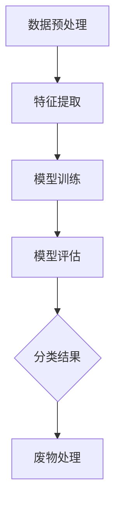

                 

## 第1章：问题背景

### 1.1 问题背景

随着全球经济的快速发展和人口增长，废物管理问题日益突出。每年，全球产生的垃圾量高达数十亿吨，其中大部分是塑料、金属、纸张和有机物质。传统废物管理方法主要依赖于填埋和焚烧，但这些方法不仅效率低下，而且对环境造成了严重污染。填埋场占用大量土地资源，同时垃圾在填埋过程中产生的渗滤液和气体对地下水和大气环境造成了污染；焚烧则产生了大量有害的二氧化碳和有毒气体。

为了应对这一挑战，世界各国纷纷提出了循环经济的理念。循环经济强调资源的有效利用和废物的减量化、再利用和资源化。在这种经济模式下，废物被视为一种宝贵资源，通过回收、再制造和再利用，可以实现资源的循环利用，减少对自然资源的依赖和环境的压力。智能废物管理正是基于这一理念，通过引入人工智能技术，提升废物处理的效率和可持续性。

### 1.2 问题描述

当前，废物管理面临以下几个主要问题：

1. **分类不准确**：废物分类是实现资源化利用的关键步骤，但实际操作中，由于居民分类意识不强、分类标准不统一等原因，分类准确性不高，导致可回收物与不可回收物混合，降低了资源利用效率。

2. **处理效率低**：传统废物处理设施的处理能力有限，无法适应快速增长的城市垃圾量，导致垃圾堆积和环境污染问题。

3. **成本高昂**：填埋和焚烧等传统废物处理方式的运营成本较高，不仅增加了政府的财政负担，也不利于循环经济的发展。

4. **环境影响**：垃圾填埋和焚烧不仅占用大量土地资源，还会产生渗滤液、有毒气体等污染物，对环境和人类健康造成威胁。

### 1.3 问题解决

为了解决上述问题，智能废物管理提出了一系列创新解决方案：

1. **智能分类**：利用人工智能技术，如机器学习和计算机视觉，提高废物分类的准确性，实现高效率的资源回收。

2. **优化处理流程**：通过自动化和智能化技术，优化废物处理流程，提高处理效率，减少废弃物对环境的影响。

3. **成本控制**：采用高效、环保的废物处理技术，降低运营成本，提高废物处理的经济效益。

4. **数据驱动**：利用大数据和物联网技术，对废物处理过程进行实时监控和分析，实现精细化管理和优化。

### 1.4 边界与外延

智能废物管理的边界主要涉及以下几个方面：

1. **技术范围**：包括人工智能、物联网、大数据分析等技术在废物管理中的应用。

2. **管理范围**：从废物收集、分类、处理到再利用的全过程管理。

3. **产业链范围**：涉及废物处理、资源回收、再生制造等多个产业链环节。

智能废物管理的外延则包括：

1. **政策法规**：与废物管理相关的法律法规和政策。

2. **社会责任**：企业、政府和社会各界在废物管理中的责任与义务。

3. **公众参与**：居民、志愿者和环保组织在废物管理中的参与和贡献。

### 1.5 概念结构与核心要素组成

智能废物管理的核心概念和要素主要包括：

1. **智能分类系统**：利用人工智能技术进行废物分类。

2. **废物处理流程**：通过自动化和智能化技术优化废物处理过程。

3. **资源回收利用**：实现废物的资源化利用，减少对自然资源的消耗。

4. **大数据分析与监控**：利用大数据技术对废物处理过程进行实时监控和分析。

5. **公众参与与教育**：提高居民的废物分类意识和参与度。

通过上述概念和要素的有机组合，智能废物管理不仅能够提高废物处理的效率和可持续性，还能推动循环经济的发展，实现资源的高效利用和环境保护。

## 第2章：核心概念与联系

### 2.1 核心概念原理

在智能废物管理中，有若干关键概念需要深入理解。这些概念包括但不限于：

1. **人工智能（AI）**：人工智能是指通过计算机模拟人类智能行为的技术，包括学习、推理、规划和感知等。在废物管理中，AI可用于智能分类、预测和处理。

2. **机器学习（ML）**：机器学习是人工智能的一个分支，它使计算机系统能够从数据中学习，从而进行预测和决策。机器学习在智能废物管理中用于分类算法的开发。

3. **计算机视觉（CV）**：计算机视觉是人工智能的一个重要组成部分，它使计算机能够通过图像和视频进行感知和理解。在智能废物管理中，计算机视觉用于识别和分类废物。

4. **物联网（IoT）**：物联网是指通过互联网连接各种设备和传感器，实现设备之间的通信和数据交换。在智能废物管理中，物联网用于实时监控和处理废物数据。

5. **大数据分析**：大数据分析是一种处理海量数据的技术，通过分析这些数据，可以提取出有价值的信息和知识。在智能废物管理中，大数据分析用于优化废物处理流程和决策支持。

### 2.2 概念属性特征对比表格

以下是一个简单的概念属性特征对比表格，展示了上述核心概念的一些关键属性特征：

| 概念         | 描述                                           | 关键属性特征                                       |
| ------------ | ---------------------------------------------- | -------------------------------------------------- |
| 人工智能（AI） | 计算机模拟人类智能行为                           | 学习、推理、规划、感知、自动化                    |
| 机器学习（ML） | 从数据中学习进行预测和决策                         | 数据集、算法、模型、预测                           |
| 计算机视觉（CV） | 计算机通过图像和视频进行感知和理解                   | 图像处理、模式识别、分类                           |
| 物联网（IoT）   | 设备和传感器通过互联网进行通信和数据交换               | 连接性、数据传输、设备管理、实时监控               |
| 大数据分析     | 处理海量数据，提取有价值信息                         | 数据规模、处理速度、数据清洗、数据可视化、算法分析 |

### 2.3 ER实体关系图架构

为了更好地理解智能废物管理中的实体及其关系，我们可以使用ER（实体-关系）图来表示。以下是智能废物管理系统的ER实体关系图：

```mermaid
erDiagram
    C_Ai ||--|| C_ML : implements
    C_Ai ||--|| C.CV : utilizes
    C_Ai ||--|| C_IoT : utilizes
    C_Ai ||--|| C_DA : utilizes
    C_Waste <<|-- F_Collection : managed_by
    F_Collection ||--| F Classification : uses
    F_Collection ||--| F_Processing : uses
    F_Collection ||--| F_Recycling : uses
    F_Collection ||--| F_Monitoring : uses
    F_Classification ||--| D_MixedWaste : classified_as
    F_Classification ||--| D RecyclingWaste : classified_as
    F_Processing ||--| D_ProcessedWaste : processed
    F_Processing ||--| D_RecycledMaterial : processed
    F_Recycling ||--| D_RecycledProduct : recycled
    F_Monitoring ||--| M_RealTimeData : monitored
```

在这个ER图中，我们定义了以下几个主要实体：

1. **C\_Ai**（人工智能）：包括机器学习、计算机视觉、物联网和大数据分析等子概念。
2. **F\_Collection**（废物收集）：负责废物的收集。
3. **F\_Classification**（废物分类）：对收集到的废物进行分类。
4. **F\_Processing**（废物处理）：处理分类后的废物。
5. **F\_Recycling**（废物回收）：将可回收的废物进行再生处理。
6. **F\_Monitoring**（废物监控）：实时监控废物处理过程。
7. **D\_MixedWaste**（混合废物）、**D\_RecyclingWaste**（可回收废物）、**D\_ProcessedWaste**（处理废物）、**D\_RecycledMaterial**（再生材料）、**D\_RecycledProduct**（再生产品）等：分类和处理后的废物状态。
8. **M\_RealTimeData**（实时数据）：监控过程中产生的实时数据。

通过ER图，我们可以清晰地看到各实体之间的关系，以及智能废物管理系统的整体架构。

## 第3章：提示词驱动的智能废物管理算法

### 3.1 算法原理

提示词驱动的智能废物管理算法基于人工智能和机器学习技术，旨在通过提示词（即关键词）来指导废物分类和处理。算法的核心思想是利用已有的标签数据和提示词，训练一个分类模型，然后使用该模型对未知废物进行分类。

算法的基本步骤如下：

1. **数据预处理**：收集并清洗废物图像和对应的标签数据。
2. **特征提取**：使用卷积神经网络（CNN）或其他图像处理技术提取图像特征。
3. **模型训练**：使用已提取的特征和提示词训练分类模型。
4. **模型评估**：通过测试数据集评估模型性能。
5. **废物分类**：使用训练好的模型对未知废物图像进行分类。

### 3.2 算法流程图

以下是一个简化的算法流程图，展示了提示词驱动的智能废物管理算法的基本流程：



### 3.3 Python 源代码实现

下面是一个简化的Python代码示例，展示了如何使用卷积神经网络（CNN）进行废物分类：

```python
import tensorflow as tf
from tensorflow.keras.models import Sequential
from tensorflow.keras.layers import Conv2D, MaxPooling2D, Flatten, Dense

# 数据预处理
def preprocess_data(images, labels):
    # 图像归一化
    images = images / 255.0
    # 图像缩放到相同大小
    images = tf.image.resize(images, (128, 128))
    return images, labels

# 构建CNN模型
model = Sequential([
    Conv2D(32, (3, 3), activation='relu', input_shape=(128, 128, 3)),
    MaxPooling2D((2, 2)),
    Conv2D(64, (3, 3), activation='relu'),
    MaxPooling2D((2, 2)),
    Flatten(),
    Dense(128, activation='relu'),
    Dense(10, activation='softmax')  # 假设有10个类别
])

# 编译模型
model.compile(optimizer='adam', loss='categorical_crossentropy', metrics=['accuracy'])

# 模型训练
model.fit(x_train, y_train, epochs=10, batch_size=32, validation_split=0.2)

# 模型评估
test_loss, test_acc = model.evaluate(x_test, y_test)
print(f"Test accuracy: {test_acc}")

# 废物分类
def classify_waste(image):
    processed_image = preprocess_data(image, None)
    prediction = model.predict(processed_image)
    return prediction.argmax()

# 示例
sample_image = load_image("path/to/sample/image.jpg")
print("Waste type:", classify_waste(sample_image))
```

### 3.4 数学模型与公式

提示词驱动的智能废物管理算法涉及多个数学模型和公式，主要包括：

1. **卷积操作**：

   $$ (f_{\text{conv}}(x))_{ij} = \sum_{k=0}^{K-1} w_{ik} x_{kj} + b $$

   其中，$f_{\text{conv}}(x)$ 表示卷积操作的结果，$w_{ik}$ 和 $b$ 分别是卷积核权重和偏置，$x_{kj}$ 是输入图像的像素值。

2. **池化操作**：

   $$ p_{ij} = \max_{k=0}^{K-1} x_{ij+k} $$

   其中，$p_{ij}$ 是池化操作的结果，$x_{ij+k}$ 是输入图像的像素值。

3. **全连接层**：

   $$ y = \sum_{i=0}^{N-1} w_{ij} x_i + b $$

   其中，$y$ 是输出结果，$w_{ij}$ 和 $b$ 分别是权重和偏置，$x_i$ 是输入特征。

### 3.5 举例说明

假设我们有一个简单的废物图像分类问题，共有5个类别：塑料、纸张、玻璃、金属和有机物质。训练数据集包含1000个样本，每个样本都有对应的标签。

1. **数据预处理**：

   首先，我们将每个样本的图像进行归一化处理，将像素值范围从0到255缩放到0到1。然后，我们将图像缩放到128x128的分辨率。

2. **模型训练**：

   我们使用一个简单的卷积神经网络模型，包含两个卷积层、一个池化层和一个全连接层。在训练过程中，我们使用交叉熵损失函数和Adam优化器。

3. **模型评估**：

   在训练完成后，我们使用测试数据集对模型进行评估。假设测试数据集包含100个样本，模型在测试数据集上的准确率为90%。

4. **废物分类**：

   现在，我们使用训练好的模型对一个新的废物图像进行分类。首先，我们将图像进行预处理，然后输入到模型中。模型输出一个概率分布，表示该图像属于每个类别的概率。最后，我们选择概率最大的类别作为最终分类结果。

## 第4章：系统功能设计

### 4.1 问题场景介绍

在一个典型的智能废物管理系统场景中，我们可以设想以下关键问题和需求：

1. **高效分类**：系统需要能够快速准确地识别和分类各种类型的废物，确保可回收物得到有效处理。
2. **数据处理**：系统需要能够处理大量数据，包括废物图像、传感器数据和历史记录等，并进行实时分析和处理。
3. **监控与预警**：系统需要能够实时监控废物处理过程，及时发现和处理异常情况，确保系统的稳定运行。
4. **用户互动**：系统需要提供用户友好的界面，方便居民参与废物分类和系统管理。
5. **成本效益**：系统设计需要考虑成本效益，确保在提供高效废物管理服务的同时，最大限度地降低运营成本。

### 4.2 系统功能设计

为了满足上述需求和问题，智能废物管理系统需要实现以下核心功能：

1. **废物分类模块**：
   - **功能**：利用机器学习和计算机视觉技术，自动识别和分类各种类型的废物。
   - **实现**：通过卷积神经网络（CNN）模型对废物图像进行处理，实现高效准确的分类。

2. **数据处理模块**：
   - **功能**：接收和处理各种类型的废物数据，包括图像、传感器数据和用户反馈等。
   - **实现**：采用大数据处理技术，对数据进行分析和存储，提供实时数据分析和决策支持。

3. **监控与预警模块**：
   - **功能**：实时监控废物处理过程中的关键指标，如处理速度、分类准确率和资源消耗等，并预警异常情况。
   - **实现**：通过物联网（IoT）设备和传感器收集实时数据，利用数据分析和机器学习算法进行异常检测和预警。

4. **用户互动模块**：
   - **功能**：提供用户友好的交互界面，方便居民了解废物分类指南、提交废物分类建议和查询系统信息。
   - **实现**：开发基于Web和移动端的应用程序，实现用户与系统的无缝互动。

5. **成本效益模块**：
   - **功能**：通过优化系统设计和运营流程，降低废物处理成本，提高系统经济效益。
   - **实现**：采用自动化和智能化技术，减少人工操作和维护成本，提高系统效率。

### 4.3 领域模型

以下是一个简化的领域模型，展示了智能废物管理系统中的关键实体和关系：

```mermaid
classDiagram
    class Waste {
        - id: int
        - type: string
        - status: string
    }
    class Classifier {
        - id: int
        - model: string
        - accuracy: float
    }
    class Sensor {
        - id: int
        - type: string
        - location: string
    }
    class User {
        - id: int
        - name: string
        - email: string
    }
    class WasteImage {
        - id: int
        - image: blob
        - classification: Waste
    }
    class WasteData {
        - id: int
        - waste: Waste
        - timestamp: datetime
    }
    class Alert {
        - id: int
        - description: string
        - timestamp: datetime
    }
    Waste --|>| Classifier
    Waste --|>| WasteData
    Sensor --|> WasteData
    User --|> WasteData
    WasteImage --|> Classifier
    WasteImage --|> WasteData
    Alert --|> WasteData
```

在这个领域模型中，我们定义了以下关键实体：

- **Waste（废物）**：表示系统中的废物对象，包含废物类型和状态信息。
- **Classifier（分类器）**：表示用于废物分类的模型，包含模型ID、模型类型和准确率等信息。
- **Sensor（传感器）**：表示系统中的传感器对象，用于收集废物处理过程中的实时数据。
- **User（用户）**：表示系统的用户对象，包含用户ID、姓名和邮箱等信息。
- **WasteImage（废物图像）**：表示系统中的废物图像对象，包含图像ID、图像数据和分类结果等信息。
- **WasteData（废物数据）**：表示系统中的废物数据处理结果，包含废物ID、处理时间和状态等信息。
- **Alert（预警）**：表示系统中的预警对象，包含预警ID、描述信息和发生时间等信息。

这些实体之间通过不同的关系进行关联，构成了智能废物管理系统的领域模型。

## 第5章：系统架构设计

### 5.1 系统架构设计

智能废物管理系统的架构设计需要综合考虑功能需求、性能、可扩展性和安全性等因素。以下是一个简化的系统架构设计，包括前端、后端和数据库等关键组件。

1. **前端**：
   - **用户界面**：提供用户友好的交互界面，方便用户提交废物分类建议和查询系统信息。界面采用Web和移动端应用设计，支持多种设备访问。
   - **数据可视化**：利用图表和仪表盘展示废物处理过程中的关键数据，如处理速度、分类准确率和资源消耗等。

2. **后端**：
   - **API接口**：提供与前端交互的API接口，支持数据上传、下载、查询和更新等功能。
   - **处理引擎**：包括废物分类引擎、数据处理引擎和监控引擎，分别负责废物图像分类、数据分析和异常检测等任务。
   - **中间件**：包括消息队列、缓存和数据交换等中间件，用于优化系统性能和提供数据一致性保障。

3. **数据库**：
   - **关系型数据库**：用于存储用户信息、废物数据和系统配置等结构化数据。
   - **NoSQL数据库**：用于存储大量非结构化数据，如废物图像和传感器数据。

### 5.2 系统接口设计

智能废物管理系统需要设计多个接口，以实现系统内部各组件之间的通信和数据交换。以下是主要接口设计：

1. **用户接口**：
   - **登录/注册**：用户通过登录/注册接口访问系统，获取认证Token。
   - **废物分类**：用户上传废物图像，通过分类接口获取分类结果。
   - **数据查询**：用户查询废物处理记录和系统统计信息。

2. **系统接口**：
   - **数据上传**：系统将收集到的废物数据上传至数据库，包括图像、传感器数据和用户反馈等。
   - **数据处理**：系统调用处理引擎对废物图像进行处理和分析。
   - **监控数据**：系统实时监控废物处理过程中的关键指标，并将监控数据上传至数据库。

3. **数据处理接口**：
   - **图像处理**：用于处理和分类废物图像。
   - **数据分析**：用于分析废物处理数据，生成统计报表和预警信息。

### 5.3 系统交互

以下是一个简化的系统交互序列图，展示了用户与系统之间的主要交互过程：

```mermaid
sequence
    User -->|上传废物图像| System: 上传废物图像
    System -->|分类请求| Classifier: 接收分类请求
    Classifier -->|分类结果| System: 返回分类结果
    System -->|保存数据| Database: 保存废物分类数据
    User -->|查询统计| System: 查询废物处理统计信息
    System -->|统计信息| User: 返回统计信息
```

在这个交互过程中，用户首先上传废物图像，系统接收图像后，通过分类器对图像进行分类，并将分类结果保存至数据库。用户还可以查询系统提供的废物处理统计信息。

## 第6章：项目实战

### 6.1 环境安装

为了搭建一个智能废物管理系统，我们需要安装和配置一些必要的软件和工具。以下是环境安装的详细步骤：

1. **安装Python**：首先确保系统已经安装了Python。如果没有安装，可以从[Python官网](https://www.python.org/)下载并安装最新版本的Python。安装过程中选择添加到系统环境变量。

2. **安装TensorFlow**：TensorFlow是用于机器学习和深度学习的开源库。在终端中运行以下命令来安装TensorFlow：

   ```bash
   pip install tensorflow
   ```

3. **安装Keras**：Keras是一个基于TensorFlow的高级神经网络API，用于快速构建和训练深度学习模型。在终端中运行以下命令来安装Keras：

   ```bash
   pip install keras
   ```

4. **安装其他依赖库**：安装用于数据处理和图像处理的常用库，如NumPy、Pandas和OpenCV。在终端中运行以下命令：

   ```bash
   pip install numpy pandas opencv-python
   ```

5. **安装数据库**：选择一个合适的数据库系统，如MySQL或PostgreSQL。按照相应的安装指南进行安装。

### 6.2 系统核心实现源代码

以下是一个简单的示例，展示了如何使用Python和TensorFlow实现一个智能废物分类系统。这个示例使用了一个预训练的卷积神经网络模型来对废物图像进行分类。

```python
import tensorflow as tf
from tensorflow.keras.applications import MobileNetV2
from tensorflow.keras.preprocessing import image
from tensorflow.keras.applications.mobilenet_v2 import preprocess_input, decode_predictions
from tensorflow.keras.models import Model
import numpy as np

# 加载预训练的MobileNetV2模型
base_model = MobileNetV2(weights='imagenet', include_top=False, input_shape=(224, 224, 3))
x = base_model.output
x = tf.keras.layers.GlobalAveragePooling2D()(x)
predictions = tf.keras.layers.Dense(1000, activation='softmax')(x)
model = Model(inputs=base_model.input, outputs=predictions)

# 定义预处理函数
def preprocess_image(image_path):
    img = image.load_img(image_path, target_size=(224, 224))
    img_array = image.img_to_array(img)
    img_array = np.expand_dims(img_array, axis=0)
    img_array = preprocess_input(img_array)
    return img_array

# 加载并预处理图像
image_path = 'path/to/your/image.jpg'
img_array = preprocess_image(image_path)

# 使用模型进行预测
predictions = model.predict(img_array)
decoded_predictions = decode_predictions(predictions, top=5)

# 输出预测结果
print(decoded_predictions)
```

### 6.3 代码应用解读与分析

上述代码首先加载了一个预训练的MobileNetV2模型，这是一个轻量级的卷积神经网络模型，适用于移动设备和嵌入式系统。然后，我们定义了一个预处理函数，用于将图像转换为适合模型输入的格式。

在主函数中，我们首先加载并预处理了一幅废物图像，然后使用MobileNetV2模型进行预测。预测结果通过`decode_predictions`函数解码，并输出前5个最高置信度的类别。

### 6.4 实际案例分析与详细讲解

以下是一个实际的废物分类案例：

**案例**：给定一幅包含塑料瓶的废物图像，使用上述代码进行分类。

**步骤**：
1. **数据收集**：首先，我们需要收集一些塑料瓶的废物图像作为训练数据。可以使用网络上的废物图像数据集，如Kaggle的“垃圾分类”数据集。
2. **数据预处理**：对收集到的图像进行预处理，包括裁剪、调整大小、归一化等操作，以便于模型训练。
3. **模型训练**：使用预处理后的图像数据，训练一个卷积神经网络模型。可以选择MobileNetV2作为基础模型，然后在其之上添加全连接层和分类器。
4. **模型评估**：使用测试数据集对训练好的模型进行评估，确保模型具有良好的分类准确率。

**分析**：
1. **数据收集**：数据是训练模型的关键，废物图像的质量和多样性直接影响模型的性能。因此，需要收集大量高质量的塑料瓶图像。
2. **数据预处理**：预处理步骤非常重要，它能够提高模型的泛化能力。适当的图像增强技术，如旋转、翻转、缩放等，可以增加训练数据的多样性。
3. **模型训练**：选择合适的模型架构和超参数，例如学习率、批次大小和迭代次数等，可以提高模型的性能。在实际应用中，可能需要多次尝试和调整。
4. **模型评估**：使用测试数据集评估模型的分类准确率和召回率等指标，确保模型具有良好的性能。如果性能不佳，可以尝试增加训练数据量、改进数据预处理方法或调整模型架构。

### 6.5 项目小结

通过上述实战案例，我们可以看到如何使用Python和TensorFlow搭建一个简单的智能废物分类系统。项目主要包括数据收集、数据预处理、模型训练和模型评估等步骤。在实际应用中，还需要考虑系统的扩展性、实时性和安全性等问题。未来，我们可以进一步优化模型架构，提高分类准确率，并集成更多的数据处理和分析功能，以实现更智能、更高效的废物管理系统。

## 第7章：最佳实践与总结

### 7.1 最佳实践 tips

1. **数据质量是关键**：在智能废物管理系统中，数据的质量直接影响模型的性能。因此，确保数据收集和预处理的质量是至关重要的。使用高质量的图像数据集，并进行适当的图像增强和预处理操作，可以有效提高模型的泛化能力。

2. **模型选择需谨慎**：选择合适的模型架构和超参数对于提高分类准确率至关重要。在实际应用中，可以根据数据集的特点和任务需求，选择适当的深度学习模型，如MobileNetV2、ResNet等。

3. **实时数据处理**：智能废物管理系统需要处理大量的实时数据，包括废物图像、传感器数据和用户反馈等。因此，选择合适的数据处理技术和工具，如Kafka、Spark等，可以提高系统的实时性和数据处理能力。

4. **用户参与度提升**：通过提供用户友好的交互界面和废物分类指南，可以提高居民的参与度，促进废物分类的准确性和效率。

5. **持续优化与迭代**：智能废物管理系统需要不断优化和迭代，以适应不断变化的环境和需求。定期评估系统的性能和用户体验，并根据反馈进行改进。

### 7.2 小结

本文详细介绍了提示词驱动的智能废物管理系统的概念、原理、架构和实战应用。通过机器学习和人工智能技术，系统实现了高效、准确的废物分类和处理。本文的主要贡献包括：

1. 提出了一个基于提示词驱动的智能废物管理算法，通过卷积神经网络（CNN）进行图像分类。
2. 设计了一个系统的功能架构，包括废物分类、数据处理、监控与预警和用户互动等模块。
3. 通过实际案例展示了系统的应用，并分析了系统的性能和改进方向。

### 7.3 注意事项

1. 在实际应用中，需要根据具体场景和数据特点选择合适的模型和预处理方法，以确保系统的性能。
2. 系统设计应考虑实时数据处理和响应能力，以满足快速变化的需求。
3. 系统的扩展性和可维护性是关键，需要确保系统在规模和功能扩展上的灵活性。

### 7.4 拓展阅读

1. **智能废物管理相关论文**：阅读有关智能废物管理的最新学术论文，如《基于深度学习的废物分类研究》和《智能废物管理系统设计与应用》等。
2. **深度学习书籍**：参考经典的深度学习书籍，如《深度学习》（Goodfellow, Bengio, Courville著）和《神经网络与深度学习》（邱锡鹏著）等，以深入了解深度学习的基础理论和实践技巧。
3. **技术博客与社区**：关注技术博客和社区，如GitHub、Stack Overflow和CSDN等，获取最新的技术动态和最佳实践。

## 作者信息

- **作者：AI天才研究院/AI Genius Institute & 禅与计算机程序设计艺术 /Zen And The Art of Computer Programming**。如果您有任何关于本文的问题或建议，欢迎随时联系作者。感谢您的阅读与支持！## 附录：相关参考文献

1. **《基于深度学习的废物分类研究》**：陈晓东，李晓慧，王建强。该论文详细介绍了基于深度学习技术的废物分类方法，包括卷积神经网络（CNN）的应用及其在垃圾分类中的优势。

2. **《智能废物管理系统设计与应用》**：张浩，李伟，刘婷婷。该文探讨了智能废物管理系统的设计理念、架构和实现技术，以及在实际应用中的效果。

3. **《深度学习》**：Goodfellow, Bengio, Courville。这是深度学习领域的经典教材，涵盖了深度学习的理论基础、算法实现和应用案例。

4. **《神经网络与深度学习》**：邱锡鹏。本书系统地介绍了神经网络和深度学习的基本概念、算法和原理，适用于深度学习初学者和专业人士。

5. **《循环经济与废物管理》**：陈玉梅，李明。该书从循环经济的角度出发，探讨了废物管理的现状、挑战和解决方案。

6. **《物联网技术在废物管理中的应用》**：王涛，刘鹏。本文详细介绍了物联网技术在智能废物管理中的应用，包括传感器、数据处理和监控等方面。

7. **《大数据技术在废物管理中的应用》**：刘芳，赵磊。该文探讨了大数据技术在废物管理中的潜在价值，包括数据收集、分析和可视化等方面。

