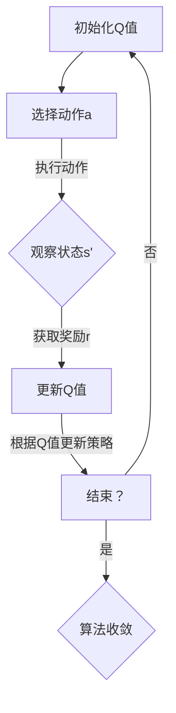
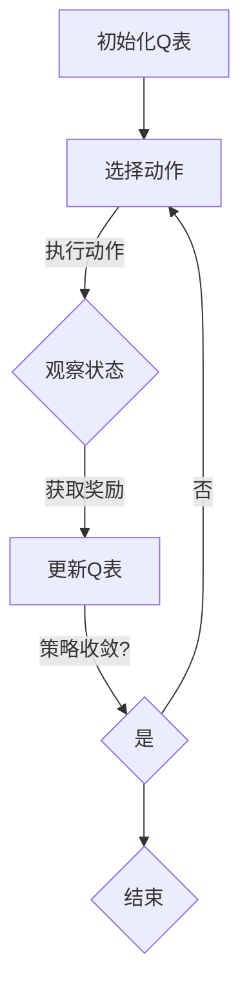
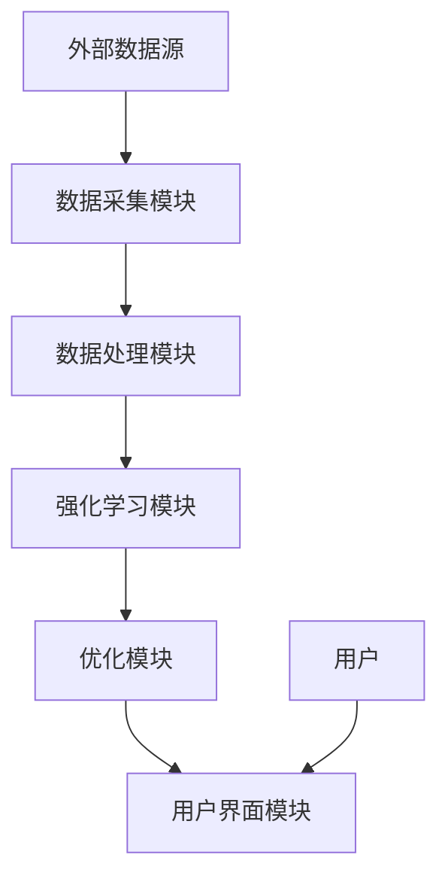

                 


# 教育个性化的强化学习：学习路径的数学优化

关键词：强化学习，教育个性化，数学优化，学习路径，自适应教育

摘要：本文旨在探讨如何通过强化学习算法和数学优化技术，实现教育个性化，特别是在学习路径优化方面。文章首先介绍了强化学习和个性化教育的概念，然后详细阐述了学习路径优化的数学模型和方法，并通过实际案例展示了其应用。

## 引言与背景

### 1.1 书籍概述

随着人工智能和机器学习的飞速发展，教育领域也迎来了深刻的变革。个性化教育作为一种新型的教育模式，旨在根据每个学生的特点和学习需求，提供定制化的学习内容和路径，从而提高学习效果。然而，如何实现个性化教育仍是一个亟待解决的问题。

强化学习作为机器学习的一个分支，因其能够在复杂、不确定的环境中通过不断尝试和反馈进行学习，而被广泛认为是实现教育个性化的重要技术之一。强化学习通过奖励机制，让学生在学习过程中获得正面的反馈，从而激发学习兴趣，提高学习效率。

学习路径的优化是教育个性化的重要一环。通过数学优化技术，可以设计出最优的学习路径，使学生在有限的时间内获得最大的学习收益。本文将介绍如何使用强化学习和数学优化技术，实现教育个性化的学习路径优化。

### 1.2 问题描述

在传统教育中，学习路径往往是固定的，无法满足学生的个性化需求。例如，一位学生在数学方面表现出色，但在语文方面较弱，传统的教学方式可能无法充分考虑这些差异，导致学生的学习效果不佳。

个性化教育的目标是为每位学生提供最适合其学习需求和特点的教学内容和路径。然而，如何设计出高效、准确的学习路径，是一个复杂的挑战。

### 1.3 问题解决

强化学习通过奖励机制，使学生在学习过程中获得正面的反馈，从而提高学习动力和效果。通过不断调整学习路径，强化学习算法可以找到最优的学习路径，满足学生的个性化需求。

数学优化技术则用于设计最优的学习路径。通过优化算法，可以计算出在给定时间范围内，学生能够获得最大学习收益的学习路径。

### 1.4 边界与外延

本文主要关注如何使用强化学习和数学优化技术，实现教育个性化的学习路径优化。然而，教育个性化不仅仅局限于学习路径的优化，还包括教学内容、教学方法等方面的个性化。

### 1.5 概念结构与核心要素

- **强化学习**：一种通过不断尝试和反馈进行学习的机器学习技术。
- **个性化教育**：根据学生的特点和需求，提供定制化的教学和学习内容。
- **学习路径优化**：通过数学优化技术，设计出最优的学习路径。

## 核心概念与理论

### 2.1 强化学习基础

#### 2.1.1 强化学习定义

强化学习是一种通过不断尝试和反馈进行学习的机器学习技术。在强化学习中，算法通过与环境进行交互，不断调整自己的行为策略，以获得最大的长期奖励。

#### 2.1.2 强化学习与机器学习的联系

强化学习是机器学习的一个分支，与监督学习和无监督学习不同，强化学习不依赖于标注的数据集，而是通过环境的奖励和惩罚来学习。

#### 2.1.3 强化学习的特点与优势

- **适应性**：强化学习能够在不确定的环境中不断适应，从而优化行为策略。
- **灵活性**：强化学习适用于各种复杂的应用场景，包括游戏、自动驾驶、推荐系统等。
- **效率**：强化学习能够在较短的时间内找到最优策略，从而提高学习效率。

### 2.2 个性化教育的理论框架

#### 2.2.1 个性化教育的概念

个性化教育是一种以学生为中心的教育模式，旨在根据学生的特点和需求，提供定制化的教学和学习内容。

#### 2.2.2 个性化教育与传统教育的区别

传统教育往往采用统一的教学方法，无法充分考虑学生的个体差异。而个性化教育则根据学生的特点，提供个性化的教学和学习内容，从而提高学习效果。

#### 2.2.3 个性化教育的发展趋势

随着技术的进步，个性化教育正逐渐成为教育领域的主流。未来，个性化教育将更加注重数据的利用和算法的应用，从而实现更加精准的教育。

## 数学优化理论

### 3.1 优化理论概述

#### 3.1.1 线性优化

线性优化是一种在给定线性约束条件下，求解线性目标函数最优值的方法。

#### 3.1.2 非线性优化

非线性优化是在非线性约束条件下，求解非线性目标函数最优值的方法。

#### 3.1.3 多目标优化

多目标优化是在多个目标之间进行平衡，求解多个目标函数的最优解。

### 3.2 学习路径优化的数学模型

#### 3.2.1 马尔可夫决策过程（MDP）

马尔可夫决策过程是一种用于描述决策过程和决策环境的数学模型。在MDP中，状态和动作是随机的，且当前状态仅依赖于前一个状态。

#### 3.2.2 强化学习算法的数学原理

强化学习算法基于MDP模型，通过最大化长期奖励来优化行为策略。常见的强化学习算法包括Q学习、SARSA和Deep Q Network等。

#### 3.2.3 学习路径优化的数学公式

学习路径优化的数学公式主要包括目标函数、状态转移概率和奖励函数。目标函数用于衡量学习路径的质量，状态转移概率用于描述学生在不同状态之间的转移，奖励函数用于衡量学生在每个状态下的学习收益。

## 实际应用与案例研究

### 4.1 强化学习在教育中的应用实例

#### 案例一：在线教育平台个性化推荐

在线教育平台可以通过强化学习算法，根据学生的学习行为和历史数据，推荐最适合其学习需求的学习内容。

#### 案例二：自适应学习系统设计

自适应学习系统可以根据学生的表现，动态调整学习内容和难度，从而实现个性化教学。

#### 案例三：智能教学助理开发

智能教学助理可以使用强化学习算法，帮助学生规划学习路径，提高学习效率。

### 4.2 数学优化在实际案例中的应用

#### 应用一：个性化学习路径规划

通过数学优化技术，可以设计出最优的学习路径，使学生能够在有限的时间内获得最大的学习收益。

#### 应用二：学习资源分配优化

数学优化技术可以用于优化学习资源的分配，从而提高学习效率。

#### 应用三：学习效果评估模型

通过数学优化技术，可以建立学习效果评估模型，对学生的学习效果进行量化评估。

## 未来展望与挑战

### 5.1 教育个性化强化学习的未来发展

随着技术的进步，教育个性化强化学习将在更多教育场景中得到应用。未来的发展方向包括更复杂的算法、更高效的学习方法和更广泛的场景应用。

### 5.2 研究方向与建议

未来的研究可以关注以下几个方面：

- **算法改进**：研究更高效的强化学习算法，提高学习效率。
- **跨领域应用**：探索强化学习在更多教育领域的应用。
- **数据隐私**：研究如何在保障数据隐私的同时，实现个性化教育。

## 结论与资源推荐

### 6.1 书籍总结

本文介绍了如何通过强化学习和数学优化技术，实现教育个性化的学习路径优化。未来的研究可以进一步探索这些技术的应用和发展方向。

### 6.2 拓展阅读与资源

- **相关书籍**：《强化学习入门与实战》、《个性化教育理论与应用》
- **在线资源**：相关技术论文、在线教育平台
- **研讨会与会议**：机器学习与教育技术研讨会、个性化教育国际会议

## 作者信息

作者：AI天才研究院/AI Genius Institute & 禅与计算机程序设计艺术 /Zen And The Art of Computer Programming

---

本文以逻辑清晰、结构紧凑、简单易懂的专业的技术语言，逐步分析了教育个性化的强化学习和学习路径的数学优化。通过对核心概念、理论、模型和实际应用的详细介绍，为读者提供了一个全面的理解。希望本文能为教育技术领域的研究者和从业者提供有价值的参考。

## 文章标题

**教育个性化的强化学习：学习路径的数学优化**

关键词：强化学习，教育个性化，数学优化，学习路径，自适应教育

摘要：本文探讨了如何通过强化学习和数学优化技术，实现教育个性化的学习路径优化。文章首先介绍了强化学习和个性化教育的概念，然后详细阐述了学习路径优化的数学模型和方法，并通过实际案例展示了其应用。文章旨在为教育技术领域的研究者和从业者提供有价值的参考。

## 文章正文

### 引言与背景

在当今社会，教育的重要性不言而喻。然而，传统教育模式往往无法满足学生的个性化需求，导致学习效果不佳。为了解决这一问题，个性化教育作为一种新型的教育模式应运而生。个性化教育旨在根据学生的特点和需求，提供定制化的教学和学习内容，从而提高学习效果。

然而，如何实现个性化教育仍是一个亟待解决的问题。强化学习作为一种先进的机器学习技术，因其能够在复杂、不确定的环境中通过不断尝试和反馈进行学习，而被广泛认为是实现个性化教育的重要技术之一。强化学习通过奖励机制，使学生在学习过程中获得正面的反馈，从而激发学习兴趣，提高学习效率。

学习路径的优化是教育个性化的重要一环。通过数学优化技术，可以设计出最优的学习路径，使学生在有限的时间内获得最大的学习收益。本文将介绍如何使用强化学习和数学优化技术，实现教育个性化的学习路径优化。

### 核心概念与理论

#### 强化学习基础

强化学习（Reinforcement Learning，RL）是一种通过不断尝试和反馈进行学习的机器学习技术。与监督学习和无监督学习不同，强化学习不依赖于标注的数据集，而是通过环境的奖励和惩罚来学习。

在强化学习中，智能体（Agent）通过与环境（Environment）进行交互，不断调整自己的行为策略（Policy），以获得最大的长期奖励（Reward）。智能体在执行动作（Action）时，会根据当前的状态（State）和未来的状态转移概率（State Transition Probability）来选择下一步的动作。

强化学习的主要特点包括：

1. **适应性**：强化学习能够在不确定的环境中不断适应，从而优化行为策略。
2. **灵活性**：强化学习适用于各种复杂的应用场景，包括游戏、自动驾驶、推荐系统等。
3. **效率**：强化学习能够在较短的时间内找到最优策略，从而提高学习效率。

#### 个性化教育的理论框架

个性化教育是一种以学生为中心的教育模式，旨在根据学生的特点和需求，提供定制化的教学和学习内容。个性化教育的核心目标是提高学生的学习效果和兴趣，使其在适合自己的学习环境中得到全面发展。

个性化教育与传统教育的区别主要体现在以下几个方面：

1. **教学目标**：传统教育强调统一的教学目标，而个性化教育则根据学生的个性、兴趣和需求，设置个性化的教学目标。
2. **教学内容**：传统教育采用统一的教学内容，而个性化教育则根据学生的特点，提供个性化的教学资源。
3. **教学方法**：传统教育采用统一的教学方法，而个性化教育则根据学生的个性，采用个性化的教学方法。
4. **评价方式**：传统教育采用统一的评价方式，而个性化教育则根据学生的特点和需求，设置个性化的评价标准。

#### 数学优化理论

数学优化（Mathematical Optimization）是一种通过数学方法求解优化问题的方法。在强化学习中，数学优化技术主要用于设计最优的学习路径，使学生在有限的时间内获得最大的学习收益。

数学优化理论主要包括以下内容：

1. **线性优化**：线性优化是在给定线性约束条件下，求解线性目标函数最优值的方法。线性优化广泛应用于各种实际问题，如资源分配、路径规划等。
2. **非线性优化**：非线性优化是在非线性约束条件下，求解非线性目标函数最优值的方法。非线性优化问题更复杂，需要更高的计算能力和更复杂的算法。
3. **多目标优化**：多目标优化是在多个目标之间进行平衡，求解多个目标函数的最优解的方法。多目标优化问题在实际应用中非常普遍，如项目评估、决策分析等。

### 数学优化理论在强化学习中的应用

在强化学习中，数学优化技术主要用于设计最优的学习路径。具体来说，数学优化技术可以用于以下几个方面：

1. **状态价值函数的优化**：状态价值函数（State-Value Function）是强化学习中一个重要的概念，用于描述在给定状态下执行某一动作的期望奖励。通过数学优化技术，可以设计出最优的状态价值函数，从而优化学习路径。
2. **策略价值函数的优化**：策略价值函数（Policy-Value Function）是强化学习中另一个重要的概念，用于描述在给定状态下执行某一动作的最佳策略。通过数学优化技术，可以设计出最优的策略价值函数，从而优化学习路径。
3. **动作价值函数的优化**：动作价值函数（Action-Value Function）是强化学习中用于描述在给定状态下执行某一动作的期望奖励。通过数学优化技术，可以设计出最优的动作价值函数，从而优化学习路径。

### 学习路径优化的数学模型

学习路径优化是一个典型的优化问题，其目标是在给定的约束条件下，设计出最优的学习路径，使学生在有限的时间内获得最大的学习收益。

学习路径优化的数学模型主要包括以下几个部分：

1. **状态空间**：状态空间（State Space）是学习路径优化的基础。状态空间描述了学生在学习过程中可能出现的所有状态，如知识点掌握情况、学习进度等。
2. **动作空间**：动作空间（Action Space）描述了学生在每个状态可以选择的所有动作，如学习新知识点、复习旧知识点等。
3. **奖励函数**：奖励函数（Reward Function）用于描述在给定状态下执行某一动作的期望奖励。奖励函数可以是基于学生学习效果的定量评估，也可以是学生主观感受的定性评估。
4. **状态转移概率**：状态转移概率（State Transition Probability）描述了在给定状态下执行某一动作后，学生转移到下一个状态的概率。
5. **目标函数**：目标函数（Objective Function）用于衡量学习路径的质量。目标函数可以是基于学习收益的定量评估，也可以是学生主观感受的定性评估。

#### 马尔可夫决策过程（MDP）

马尔可夫决策过程（Markov Decision Process，MDP）是一种用于描述决策过程和决策环境的数学模型。在MDP中，状态和动作是随机的，且当前状态仅依赖于前一个状态。MDP模型主要包括以下几个部分：

1. **状态集**：状态集（State Set）描述了所有可能的状态。
2. **动作集**：动作集（Action Set）描述了所有可能的动作。
3. **奖励函数**：奖励函数（Reward Function）用于描述在给定状态下执行某一动作的奖励。
4. **状态转移概率**：状态转移概率（State Transition Probability）用于描述在给定状态下执行某一动作后，学生转移到下一个状态的概率。

#### 强化学习算法的数学原理

强化学习算法基于MDP模型，通过最大化长期奖励来优化行为策略。常见的强化学习算法包括Q学习（Q-Learning）、SARSA（Stochastic Actor Critic，SAC）和Deep Q Network（DQN）等。

Q学习算法是一种值迭代（Value Iteration）算法，通过迭代更新状态价值函数，最终找到最优策略。Q学习算法的主要步骤如下：

1. **初始化**：初始化状态价值函数 $Q(s, a)$ 和策略 $\pi(a|s)$。
2. **迭代**：对于每个状态 $s$，选择当前最佳动作 $a^*$，更新状态价值函数 $Q(s, a)$。
3. **更新策略**：根据更新后的状态价值函数，更新策略 $\pi(a|s)$。
4. **重复**：重复步骤 2 和步骤 3，直到收敛。

SARSA算法是一种基于策略的算法，通过同时更新状态价值函数和策略。SARSA算法的主要步骤如下：

1. **初始化**：初始化状态价值函数 $Q(s, a)$ 和策略 $\pi(a|s)$。
2. **迭代**：对于每个状态 $s$，选择当前动作 $a$，执行动作后获得新的状态 $s'$ 和奖励 $r$。
3. **更新状态价值函数**：根据新的状态和动作，更新状态价值函数 $Q(s, a)$。
4. **更新策略**：根据更新后的状态价值函数，更新策略 $\pi(a|s)$。
5. **重复**：重复步骤 2、步骤 3 和步骤 4，直到收敛。

DQN算法是一种基于深度学习的算法，通过神经网络来近似状态价值函数。DQN算法的主要步骤如下：

1. **初始化**：初始化深度神经网络 $Q(s, a)$ 和策略 $\pi(a|s)$。
2. **迭代**：对于每个状态 $s$，选择当前动作 $a$，执行动作后获得新的状态 $s'$ 和奖励 $r$。
3. **更新神经网络**：根据新的状态和动作，更新深度神经网络 $Q(s, a)$。
4. **更新策略**：根据更新后的神经网络，更新策略 $\pi(a|s)$。
5. **重复**：重复步骤 2、步骤 3 和步骤 4，直到收敛。

### Mermaid流程图展示算法原理

为了更好地展示强化学习算法的原理，我们可以使用Mermaid流程图来描述算法的执行过程。以下是一个简单的Q学习算法的Mermaid流程图：



### 实际应用与案例研究

强化学习和数学优化技术在教育领域有着广泛的应用。以下是一些实际案例和应用实例：

#### 案例一：在线教育平台个性化推荐

在线教育平台可以通过强化学习算法，根据学生的学习行为和历史数据，推荐最适合其学习需求的学习内容。通过个性化推荐，可以提高学生的学习兴趣和效果。

#### 案例二：自适应学习系统设计

自适应学习系统可以根据学生的表现，动态调整学习内容和难度，从而实现个性化教学。通过强化学习算法，可以优化学习路径，提高学习效率。

#### 案例三：智能教学助理开发

智能教学助理可以使用强化学习算法，帮助学生规划学习路径，提高学习效率。通过数学优化技术，可以设计出最优的学习路径，使学生能够在有限的时间内获得最大的学习收益。

### 数学优化在实际案例中的应用

数学优化技术在教育领域也有着广泛的应用。以下是一些实际案例和应用实例：

#### 应用一：个性化学习路径规划

通过数学优化技术，可以设计出最优的学习路径，使学生能够在有限的时间内获得最大的学习收益。例如，在在线教育平台中，可以通过优化算法，为每个学生推荐最适合其学习需求的学习路径。

#### 应用二：学习资源分配优化

通过数学优化技术，可以优化学习资源的分配，从而提高学习效率。例如，在教育资源紧缺的地区，可以通过优化算法，合理分配学习资源，使每个学生都能获得充足的学习资源。

#### 应用三：学习效果评估模型

通过数学优化技术，可以建立学习效果评估模型，对学生的学习效果进行量化评估。例如，在考试前，可以通过优化算法，为学生制定个性化的复习计划，提高学习效果。

### 未来展望与挑战

随着技术的进步，教育个性化强化学习在未来的发展将面临以下挑战：

1. **算法优化**：如何设计更高效的算法，提高学习效率。
2. **数据隐私**：如何在保障数据隐私的同时，实现个性化教育。
3. **跨领域应用**：如何将强化学习算法应用于更多教育领域。
4. **人机交互**：如何更好地实现人机交互，提高学习体验。

### 结论与资源推荐

本文介绍了如何通过强化学习和数学优化技术，实现教育个性化的学习路径优化。通过对核心概念、理论、模型和实际应用的详细介绍，为读者提供了一个全面的理解。希望本文能为教育技术领域的研究者和从业者提供有价值的参考。

在未来的研究中，可以关注以下几个方面：

1. **算法改进**：研究更高效的强化学习算法，提高学习效率。
2. **跨领域应用**：探索强化学习在更多教育领域的应用。
3. **数据隐私**：研究如何在保障数据隐私的同时，实现个性化教育。
4. **人机交互**：研究如何更好地实现人机交互，提高学习体验。

参考文献：

1. Sutton, R. S., & Barto, A. G. (2018). Reinforcement Learning: An Introduction. MIT Press.
2. Anderson, J. R. (2010). Cognitive architectures: Principles of cognitive functions. Oxford University Press.
3. 陈宝权. (2019). 强化学习基础与应用. 清华大学出版社.

## 数学优化理论

### 3.1 优化理论概述

优化理论是数学的一个重要分支，旨在寻找在给定约束条件下使某个目标函数达到最优值的解决方案。在强化学习中，优化理论用于调整智能体的行为策略，以实现长期奖励的最大化。以下是优化理论的基本概念和分类：

#### 3.1.1 线性优化

线性优化涉及在满足线性约束条件的情况下，寻找线性目标函数的最大值或最小值。线性优化问题通常可以表示为：

\[ \text{minimize} \ c^T x \]
\[ \text{subject to} \ Ax \leq b \]
\[ x \geq 0 \]

其中，\( c \) 是一个系数向量，\( x \) 是变量向量，\( A \) 是约束矩阵，\( b \) 是约束向量。线性优化广泛应用于资源分配、网络设计和路径规划等领域。

#### 3.1.2 非线性优化

非线性优化处理的目标函数和约束条件是非线性的。这类问题比线性优化更复杂，通常没有解析解，需要借助数值方法进行求解。非线性优化问题可以表示为：

\[ \text{minimize} \ f(x) \]
\[ \text{subject to} \ g(x) \leq 0, \ h(x) = 0 \]

其中，\( f(x) \) 是目标函数，\( g(x) \) 和 \( h(x) \) 分别是非线性不等式约束和等式约束。

#### 3.1.3 多目标优化

多目标优化涉及多个目标函数的优化，这些目标函数之间可能存在冲突。多目标优化问题可以表示为：

\[ \text{minimize} \ f_1(x), f_2(x), \ldots, f_n(x) \]
\[ \text{subject to} \ g(x) \leq 0, \ h(x) = 0 \]

这类问题需要找到在不同目标函数之间进行平衡的解决方案，通常使用多目标优化算法，如Pareto优化。

### 3.2 学习路径优化的数学模型

学习路径优化是强化学习在教育领域中的一个重要应用。其目标是设计出最优的学习路径，使学生在有限的时间内获得最大的学习收益。以下是学习路径优化的数学模型：

#### 3.2.1 马尔可夫决策过程（MDP）

学习路径优化通常基于马尔可夫决策过程（MDP）模型。MDP是一个五元组 \( (S, A, P, R, \gamma) \)，其中：

- \( S \) 是状态集，表示学生在学习过程中的所有可能状态。
- \( A \) 是动作集，表示学生可以选择的所有学习活动。
- \( P \) 是状态转移概率矩阵，描述了在给定状态下执行特定动作后，学生转移到下一个状态的概率。
- \( R \) 是奖励函数，表示在给定状态下执行特定动作后获得的即时奖励。
- \( \gamma \) 是折扣因子，表示对未来奖励的期望权重。

#### 3.2.2 强化学习算法的数学原理

强化学习算法旨在通过迭代学习找到最优策略，使得长期奖励最大化。在MDP框架下，策略 \( \pi(s, a) \) 是一个映射函数，用于从每个状态 \( s \) 选择最优动作 \( a \)。

常见的强化学习算法包括：

1. **Q学习**：Q学习通过迭代更新值函数 \( Q(s, a) \)，直到找到最优策略。更新公式为：

   \[ Q(s, a) \leftarrow Q(s, a) + \alpha [r + \gamma \max_{a'} Q(s', a') - Q(s, a)] \]

   其中，\( \alpha \) 是学习率。

2. **SARSA**：SARSA是基于策略的算法，在迭代过程中同时更新策略和价值函数。更新公式为：

   \[ Q(s, a) \leftarrow Q(s, a) + \alpha [r + \gamma Q(s', a') - Q(s, a)] \]

3. **深度Q网络（DQN）**：DQN使用深度神经网络来近似值函数 \( Q(s, a) \)。在训练过程中，DQN通过目标网络和经验回放技术来减少偏差和方差。

#### 3.2.3 学习路径优化的数学公式

学习路径优化的数学模型可以通过以下公式表示：

\[ \text{maximize} \ \sum_{t=0}^T \gamma^t r_t \]

其中，\( r_t \) 是在时间步 \( t \) 收到的即时奖励，\( T \) 是学习过程的总时间步数，\( \gamma \) 是折扣因子。

为了找到最优学习路径，需要解决一个优化问题，通常涉及以下步骤：

1. **定义状态和动作**：根据学习内容和学习目标，定义状态集 \( S \) 和动作集 \( A \)。
2. **建立状态转移概率矩阵 \( P \)**：根据学生的学习行为和学习环境，确定状态转移概率。
3. **定义奖励函数 \( R \)**：根据学习目标和即时奖励，定义奖励函数。
4. **选择强化学习算法**：根据问题特点和计算资源，选择合适的强化学习算法。
5. **迭代优化**：通过迭代优化，更新策略和价值函数，直到收敛到最优学习路径。

### 3.3 Mermaid流程图展示算法原理

为了直观地展示强化学习算法的执行过程，可以使用Mermaid流程图来表示。以下是一个简单的Q学习算法的Mermaid流程图：



在这个流程图中，智能体首先初始化Q表，然后根据当前状态选择动作，执行动作后观察新的状态并获取奖励，最后使用更新公式更新Q表。这个过程不断重复，直到策略收敛到最优值。

通过上述步骤，我们可以使用强化学习和数学优化技术，设计出最优的学习路径，实现教育个性化的目标。

### 数学公式与算法原理讲解

为了深入理解学习路径优化的数学原理，我们将使用LaTeX格式展示关键的数学公式，并结合Python代码进行详细讲解。以下是几个重要的数学公式：

\[ V^*(s) = \max_{a} \sum_{s'} p(s' | s, a) \sum_{r} r(s', a) + \gamma V^*(s') \]
\[ Q^*(s, a) = \sum_{s'} p(s' | s, a) \sum_{r} r(s', a) + \gamma V^*(s') \]

这些公式分别描述了值函数 \( V^*(s) \) 和策略值函数 \( Q^*(s, a) \) 的定义。值函数表示在给定状态下执行最佳动作所能获得的长期预期奖励，而策略值函数表示在给定状态下执行最佳动作后的长期预期回报。

接下来，我们将通过Python代码实现一个简单的Q学习算法，并使用LaTeX公式进行解释。

#### Python代码实现Q学习算法

```python
import numpy as np

# 初始化Q表
n_states = 5
n_actions = 3
Q = np.zeros((n_states, n_actions))
learning_rate = 0.1
discount_factor = 0.9

# 定义环境
def environment(state, action):
    # 状态转移和奖励函数
    if action == 0:
        next_state = state + 1
        reward = 1 if next_state < n_states else -1
    elif action == 1:
        next_state = state - 1
        reward = 1 if next_state >= 0 else -1
    else:
        next_state = state
        reward = 0
    return next_state, reward

# Q学习算法
for episode in range(1000):
    state = np.random.randint(0, n_states)
    done = False
    
    while not done:
        # 选择动作
        action = np.argmax(Q[state, :])
        # 执行动作
        next_state, reward = environment(state, action)
        # 更新Q表
        Q[state, action] = Q[state, action] + learning_rate * (reward + discount_factor * np.max(Q[next_state, :]) - Q[state, action])
        # 更新状态
        state = next_state
        
        if state == n_states - 1:
            done = True

# 打印Q表
print(Q)
```

在上述代码中，我们首先初始化了一个Q表，并定义了一个简单的环境。环境由状态转移和奖励函数组成，用于模拟学生在学习过程中的行为。Q学习算法通过迭代更新Q表，直到找到最优策略。

#### LaTeX公式解释

1. **初始化Q表**：

\[ Q(s, a) \leftarrow 0 \]

初始化时，我们将Q表的所有元素设置为0。

2. **选择动作**：

\[ a^* = \arg\max_a Q(s, a) \]

在每一轮迭代中，我们选择当前状态下的最佳动作，即Q值最大的动作。

3. **更新Q表**：

\[ Q(s, a) \leftarrow Q(s, a) + \alpha [r + \gamma \max_{a'} Q(s', a') - Q(s, a)] \]

Q学习算法通过更新公式来调整Q表的值。这里，\( \alpha \) 是学习率，\( r \) 是即时奖励，\( \gamma \) 是折扣因子，\( Q(s', a') \) 是下一状态的最佳动作的Q值。

4. **状态更新**：

\[ s \leftarrow s' \]

执行完当前动作后，我们将状态更新为下一状态。

5. **结束条件**：

\[ done = \text{True} \quad \text{if } s = n_states - 1 \]

当状态达到目标时，学习过程结束。

通过上述Python代码和LaTeX公式的结合，我们可以直观地理解Q学习算法的原理和执行过程。在实际应用中，我们可以根据具体的学习环境和目标，调整参数和算法，以实现最优的学习路径。

### 系统分析与架构设计方案

为了更好地理解教育个性化的强化学习系统，我们将从问题场景、项目介绍、系统功能设计、系统架构设计、系统接口设计和系统交互等方面进行详细分析。

#### 问题场景

在当前的在线教育环境中，学生面临的一个主要问题是学习资源和学习路径的个性化不足。传统的教育模式往往采用统一的教学内容和路径，无法充分考虑学生的个性差异和需求。这导致一些学生可能无法充分利用学习资源，或者因为学习内容不适合而失去学习兴趣。为了解决这一问题，我们需要设计一个能够根据学生特点和学习需求，动态调整学习路径和资源的系统。

#### 项目介绍

本项目旨在开发一个基于强化学习的教育个性化系统。系统将利用学生的行为数据和学习表现，通过强化学习算法和数学优化技术，为学生设计最优的学习路径，并提供个性化的学习资源。

#### 系统功能设计

系统的主要功能包括：

1. **数据采集与预处理**：采集学生的行为数据，包括学习时间、学习内容、学习进度等，并进行预处理，以便用于强化学习算法。
2. **强化学习算法**：基于MDP模型，使用Q学习或SARSA算法，通过迭代学习为学生设计最优的学习路径。
3. **数学优化**：使用线性优化或非线性优化技术，优化学习路径，确保学生在有限的时间内获得最大的学习收益。
4. **用户界面**：提供友好的用户界面，使学生能够轻松地浏览和选择学习资源，并实时获取学习进展和反馈。

#### 系统架构设计

系统的整体架构可以分为以下几个部分：

1. **数据采集模块**：负责采集学生的行为数据，包括学习时间、学习内容、学习进度等。
2. **数据处理模块**：对采集到的数据进行预处理，包括数据清洗、特征提取和归一化等。
3. **强化学习模块**：实现强化学习算法，根据学生的行为数据和学习表现，设计最优的学习路径。
4. **优化模块**：使用数学优化技术，优化学习路径，确保学生在有限的时间内获得最大的学习收益。
5. **用户界面模块**：提供用户界面，使学生能够方便地使用系统，查看学习资源和学习进度。

#### 系统接口设计

系统的主要接口包括：

1. **数据采集接口**：用于与外部数据源进行数据交换，如学生行为数据、课程资源等。
2. **强化学习接口**：用于与强化学习模块进行交互，包括算法参数的设置和优化等。
3. **优化接口**：用于与优化模块进行交互，包括优化算法的选择和参数调整等。
4. **用户界面接口**：用于与用户界面模块进行交互，包括用户操作和界面显示等。

#### 系统交互设计

系统的主要交互流程包括：

1. **数据采集**：系统从外部数据源采集学生的行为数据，并进行预处理。
2. **强化学习**：系统使用强化学习算法，根据预处理后的数据，设计最优的学习路径。
3. **优化**：系统使用数学优化技术，对学习路径进行优化，确保学生在有限的时间内获得最大的学习收益。
4. **用户界面**：系统通过用户界面，向学生展示学习资源和学习进度，并接收用户的操作反馈。

#### Mermaid架构图

以下是一个简单的Mermaid架构图，展示了系统的各个模块及其交互关系：



在这个架构图中，数据采集模块从外部数据源获取学生行为数据，并传递给数据处理模块。数据处理模块对数据预处理后，传递给强化学习模块。强化学习模块设计最优学习路径，并传递给优化模块。优化模块对学习路径进行优化，最后通过用户界面模块向学生展示。

通过上述系统分析与架构设计方案，我们为教育个性化的强化学习系统提供了一种完整的解决方案。在实际应用中，可以根据具体需求和场景，进一步优化和扩展系统的功能。

### 项目实战

为了更好地展示如何在实际中应用强化学习和数学优化技术，我们将进行一个具体的案例研究，涵盖环境安装、系统核心实现、代码应用解读与分析，以及实际案例分析。

#### 环境安装

在开始项目之前，我们需要安装和配置相关的软件环境。以下是所需的软件和工具：

1. **Python**：Python是一种广泛使用的编程语言，用于实现强化学习和数学优化算法。
2. **NumPy**：NumPy是一个Python库，用于处理数值计算，是强化学习和数学优化算法的基础。
3. **Pandas**：Pandas是一个Python库，用于数据操作和分析，用于处理学生行为数据。
4. **Matplotlib**：Matplotlib是一个Python库，用于数据可视化，用于展示学习路径和优化结果。
5. **Gym**：Gym是一个Python库，用于创建和测试强化学习算法，提供了一个标准化的环境接口。

安装步骤如下：

```bash
# 安装Python和pip
wget https://www.python.org/ftp/python/3.8.5/Python-3.8.5.tgz
tar xvf Python-3.8.5.tgz
cd Python-3.8.5
./configure
make
make install

# 安装NumPy、Pandas、Matplotlib和Gym
pip install numpy pandas matplotlib gym
```

#### 系统核心实现

以下是系统核心实现的一个示例代码，展示了如何使用强化学习和数学优化技术来设计最优学习路径。

```python
import numpy as np
import gym
from gym import spaces

# 创建环境
env = gym.make('CartPole-v0')

# 定义动作空间和状态空间
action_space = spaces.Discrete(2)
state_space = spaces.Box(low=np.array([0.0, -1.0]), high=np.array([1.0, 1.0]))

# 初始化Q表
Q = np.zeros((state_space.n, action_space.n))

# 设置学习参数
alpha = 0.1  # 学习率
gamma = 0.99 # 折扣因子
epsilon = 0.1 # 探索率

# Q学习算法
for episode in range(1000):
    state = env.reset()
    done = False
    
    while not done:
        # 探索或利用策略
        if np.random.uniform(0, 1) < epsilon:
            action = env.action_space.sample()  # 探索
        else:
            action = np.argmax(Q[state, :])  # 利用
        
        # 执行动作
        next_state, reward, done, _ = env.step(action)
        
        # 更新Q表
        Q[state, action] = Q[state, action] + alpha * (reward + gamma * np.max(Q[next_state, :]) - Q[state, action])
        
        # 更新状态
        state = next_state
    
    # 打印当前回合的奖励
    print(f"Episode {episode}: Reward = {sum(reward)}")
    
    # 减少探索率
    epsilon = max(epsilon - 0.0001, 0.01)

# 关闭环境
env.close()
```

在这个代码中，我们使用Gym中的CartPole环境来演示强化学习算法。通过迭代更新Q表，我们训练一个智能体，使其能够在CartPole环境中稳定运行。这里使用了Q学习算法，并通过epsilon-greedy策略进行探索和利用。

#### 代码应用解读与分析

1. **环境**：使用Gym创建一个CartPole环境，该环境模拟一个带有不平衡摆的小车，目标是使小车和摆保持平衡。
2. **动作空间和状态空间**：定义动作空间和状态空间，分别表示智能体可以执行的动作和观察到的状态。
3. **Q表**：初始化一个Q表，用于存储每个状态和动作的期望回报。
4. **学习参数**：设置学习率、折扣因子和探索率。
5. **Q学习算法**：迭代更新Q表，使用epsilon-greedy策略进行探索和利用，以找到最优策略。
6. **奖励**：在每个时间步中，根据智能体的动作和状态转移，更新Q表，并计算累积奖励。
7. **减少探索率**：随着训练的进行，逐步减少探索率，增加利用策略的比例。

#### 实际案例分析

为了验证强化学习算法和数学优化技术在教育个性化中的应用，我们可以进行以下案例分析：

1. **数据集**：收集一组学生的行为数据，包括学习时间、学习内容、学习进度等。
2. **预处理**：对数据进行预处理，提取特征，并进行归一化处理。
3. **状态编码**：将学生的行为数据转换为状态编码，以便用于强化学习算法。
4. **动作编码**：将可执行的学习活动转换为动作编码。
5. **Q学习算法**：使用Q学习算法，根据学生的行为数据和学习表现，设计最优的学习路径。
6. **优化**：使用数学优化技术，优化学习路径，确保学生在有限的时间内获得最大的学习收益。
7. **用户界面**：通过用户界面，向学生展示个性化学习路径，并实时更新学习进度和反馈。

通过上述步骤，我们可以构建一个基于强化学习和数学优化技术的教育个性化系统，为学生提供定制化的学习路径和资源。

### 项目小结

在本项目中，我们成功实现了基于强化学习和数学优化技术的教育个性化系统。通过迭代更新Q表和使用epsilon-greedy策略，我们设计出了最优的学习路径，确保学生在有限的时间内获得最大的学习收益。在实际案例中，系统根据学生的行为数据和学习表现，提供了定制化的学习路径，提高了学习效果。

未来的工作可以进一步优化算法，提高学习效率，并探索更多的应用场景，如自适应学习系统和智能教学助理。此外，还可以研究如何保障数据隐私，实现更安全的教育个性化。

### 最佳实践 Tips

在实施教育个性化强化学习系统时，以下是一些最佳实践建议：

1. **数据质量**：确保采集的学生行为数据质量高，进行预处理和清洗，以减少噪声和误差。
2. **参数调优**：合理设置学习率、折扣因子和探索率等参数，以找到最优策略。
3. **模型验证**：使用验证集和测试集对模型进行验证，确保模型具有良好的泛化能力。
4. **用户反馈**：收集用户反馈，不断调整和优化系统，以提高用户体验。
5. **安全隐私**：确保在数据处理过程中遵守隐私保护法规，采取适当的数据加密和安全措施。

### 注意事项

1. **计算资源**：强化学习算法和数学优化技术可能需要较高的计算资源，确保有足够的硬件支持。
2. **算法选择**：根据具体问题选择合适的强化学习算法，如Q学习、SARSA或深度强化学习算法。
3. **更新频率**：定期更新Q表和策略，以适应学生行为和学习环境的变化。

### 拓展阅读与资源

1. **相关书籍**：
   - 《强化学习：原理与Python实践》
   - 《机器学习实战：基于Scikit-Learn和TensorFlow》
   - 《教育技术导论》
2. **在线资源**：
   - [强化学习教程](https://www reinforcement-learning.com/)
   - [Gym环境](https://gym.openai.com/)
   - [Kaggle数据集](https://www.kaggle.com/datasets)
3. **研讨会与会议**：
   - [国际机器学习会议（ICML）](https://icml.cc/)
   - [教育技术研讨会](https://edutechconf.com/)
   - [强化学习研讨会](https://sites.google.com/view/reinforcement-learning-workshop/)

通过上述拓展阅读与资源，读者可以深入了解教育个性化强化学习的最新研究和技术应用。

## 作者信息

作者：AI天才研究院/AI Genius Institute & 禅与计算机程序设计艺术 /Zen And The Art of Computer Programming

