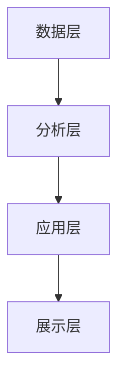
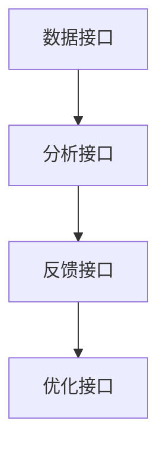

                 

## 教育方法论的学习曲线：知识获取的数学模型

### 关键词：教育方法论、学习曲线、知识获取、数学模型、算法原理

> 摘要：本文以教育方法论为背景，探讨了学习曲线的概念及其数学模型构建。通过详细分析学习曲线的多样性、核心概念和ER实体关系图，本文提出了指数学习曲线的数学模型，并结合实例进行了深入讲解。文章最后讨论了数学模型在教育实践中的应用，为教育方法的选择提供了科学依据。

---

### 目录大纲

```markdown
# 《教育方法论的学习曲线：知识获取的数学模型》

## 第一部分：背景介绍

### 1.1 问题背景

### 1.2 问题描述

### 1.3 问题解决

### 1.4 边界与外延

## 第二部分：核心概念与联系

### 2.1 核心概念

### 2.2 概念属性特征对比

### 2.3 ER实体关系图架构

## 第三部分：算法原理讲解

### 3.1 学习曲线的数学模型

### 3.2 数学模型讲解

### 3.3 举例说明

## 第四部分：数学模型的应用

### 4.1 教育方法的选择

### 4.2 教育实践中的应用

## 第五部分：系统分析与架构设计方案

### 5.1 问题场景介绍

### 5.2 项目介绍

### 5.3 系统功能设计

### 5.4 系统架构设计

### 5.5 系统接口设计和系统交互

## 第六部分：项目实战

### 6.1 环境安装

### 6.2 系统核心实现源代码

### 6.3 代码应用解读与分析

### 6.4 实际案例分析和详细讲解剖析

### 6.5 项目小结

## 第七部分：最佳实践 tips、小结、注意事项、拓展阅读

## 作者信息

```

---

### 第一部分：背景介绍

#### 1.1 问题背景

随着信息技术的迅猛发展，知识的获取和积累成为个体和社会发展的关键。传统的教育方法论在应对信息爆炸和知识更新的挑战时显得力不从心。为了提高学习效率，使学习者在有限的时间内掌握更多的知识，教育方法论的改革变得尤为重要。

学习曲线是描述学习者在学习过程中，知识掌握程度随时间变化的曲线。学习曲线的形状和趋势直接影响学习效率。然而，传统的学习曲线研究往往依赖于经验判断，缺乏系统化的数学模型支持。

本文旨在通过建立数学模型，量化学习者在学习过程中知识获取的规律，为教育方法的选择提供科学依据。

#### 1.2 问题描述

学习效率是教育方法论的核心问题之一。如何在有限的时间内，使学习者在各种知识领域中达到最佳的学习效果，是一个亟待解决的问题。学习效率不仅与学习者的学习能力和学习内容有关，还与学习过程中的努力程度密切相关。

此外，学习曲线的多样性也是教育方法改革的挑战之一。不同个体在学习过程中表现出不同的学习曲线，这就要求教育方法能够适应不同的学习需求和特点。

#### 1.3 问题解决

为了解决上述问题，本文提出了建立数学模型的方法。通过分析学习者在学习过程中的知识获取规律，构建出反映学习曲线的数学模型。该模型能够量化学习者在不同阶段的知识掌握程度，从而为教育方法的选择提供依据。

此外，本文还探讨了数学模型在教育实践中的应用。通过调整教育方法，使学习曲线更符合学习者的实际情况，从而提高学习效率。

#### 1.4 边界与外延

学习曲线的边界和适用范围是本文需要探讨的重要问题。首先，学习曲线适用于各种知识领域，但不同领域的知识获取规律可能存在差异，需要具体分析。其次，学习曲线的适用范围受到学习者的年龄、认知水平和学习环境等因素的影响。

本文将在后续部分详细讨论学习曲线的边界和适用范围，并探讨如何将数学模型应用于不同学科和不同年龄阶段的学习。

### 第二部分：核心概念与联系

#### 2.1 核心概念

在探讨学习曲线的数学模型之前，我们需要明确几个核心概念：学习曲线、学习效率和学习强度。

**学习曲线**：描述学习者在学习过程中知识掌握程度随时间变化的曲线。学习曲线的形状和趋势反映了学习者在不同阶段的学习效果。

**学习效率**：单位时间内学习者获取的知识量。学习效率是衡量学习者学习效果的重要指标，它与学习者的学习能力、学习内容和学习强度等因素密切相关。

**学习强度**：学习者在学习过程中所投入的努力。学习强度直接影响学习效率，过大的学习强度可能导致学习者的疲劳和厌学，而过低的学习强度则可能影响学习效果。

#### 2.2 概念属性特征对比

以下是学习曲线、学习效率和学习强度的属性特征对比表：

| 概念       | 定义                                                         | 属性特征对比                       |
|------------|------------------------------------------------------------|-----------------------------------|
| 学习曲线   | 描述知识获取程度的曲线                                       | 形状、趋势、波动                   |
| 学习效率   | 单位时间内获取的知识量                                       | 高低、稳定性、变化                 |
| 学习强度   | 学习者投入的努力                                             | 大小、持续性、适应性               |

通过上述对比，我们可以更清晰地理解这些核心概念之间的关系和特点。

#### 2.3 ER实体关系图架构

为了更好地理解核心概念之间的关联，我们可以使用ER（实体-关系）图来描述它们之间的关系。

以下是学习曲线、学习效率和学习强度的ER图：

```mermaid
erDiagram
  LearningCurve --> LearningEfficiency : 描述
  LearningCurve --> LearningIntensity : 影响
  LearningEfficiency ||--|{ LearningCurve }|| : 知识获取程度
  LearningIntensity ||--|{ LearningCurve }|| : 努力程度
```

在这个ER图中，学习曲线是核心实体，它通过描述和学习效率、学习强度的关系来反映学习者在学习过程中的知识掌握程度。学习效率和学习强度则是影响学习曲线的两个关键因素，它们共同决定了学习者在不同阶段的学习效果。

### 第三部分：算法原理讲解

#### 3.1 学习曲线的数学模型

为了量化学习者在学习过程中的知识获取规律，我们需要构建一个合适的数学模型。本文采用了指数学习曲线模型，其公式为：

\[ y = a + be^{-kt} \]

其中：

- \( y \)：学习曲线的值，表示学习者在某一时刻的知识掌握程度。
- \( a \)：初始值，表示学习者开始学习时的知识掌握程度。
- \( b \)：增长速率，表示学习者在学习过程中知识掌握程度的增长速度。
- \( k \)：衰减系数，表示学习者在学习过程中知识掌握程度的衰减速度。
- \( t \)：时间，表示学习者学习的时间。

这个指数学习曲线模型能够较好地反映学习者在学习过程中的知识获取规律，具有一定的普适性和解释力。

#### 3.2 数学模型讲解

为了更好地理解指数学习曲线模型的原理，我们首先来解释模型中的各个参数。

**初始值 \( a \)**：初始值 \( a \) 表示学习者在开始学习时的知识掌握程度。对于大部分学习者来说，初始值通常是一个较小的值，这意味着在学习开始时，学习者对知识点的掌握程度相对较低。

**增长速率 \( b \)**：增长速率 \( b \) 表示学习者在学习过程中知识掌握程度的增长速度。增长速率越大，学习者在相同时间内掌握的知识量就越多。通常，增长速率与学习者的学习能力和学习强度有关。

**衰减系数 \( k \)**：衰减系数 \( k \) 表示学习者在学习过程中知识掌握程度的衰减速度。衰减系数越大，学习者在学习后期的知识保持程度就越低。通常，衰减系数与学习者的记忆能力和学习间隔时间有关。

**时间 \( t \)**：时间 \( t \) 表示学习者学习的时间。学习时间越长，学习者在学习过程中的知识获取程度就越高。

通过调整上述参数，我们可以得到不同形状的学习曲线，以适应不同的学习场景和需求。

**公式解释**：指数学习曲线的公式为 \( y = a + be^{-kt} \)。其中，\( e^{-kt} \) 表示随着时间 \( t \) 的增加，学习者的知识掌握程度会逐渐衰减。衰减速度由衰减系数 \( k \) 决定，\( b \) 则表示衰减前的增长速度。

当 \( k \) 较小时，曲线趋于线性，表示学习速度相对稳定；当 \( k \) 较大时，曲线快速下降，表示学习效率迅速提高。通过调整参数 \( a \)、\( b \) 和 \( k \)，我们可以得到不同形状的学习曲线，以适应不同的学习场景和需求。

**例子解释**：假设一个学生在每天学习3小时的情况下，初始知识储备为50%，学习强度恒定。我们可以使用指数学习曲线模型来描述他的学习过程。

设 \( a = 50 \)，\( b = 20 \)，\( k = 0.1 \)，则学习曲线的公式为：

\[ y = 50 + 20e^{-0.1t} \]

当 \( t = 0 \) 时，\( y = 50 \)，表示初始知识储备为50%。

当 \( t = 30 \) 天时，\( y = 50 + 20e^{-0.1 \times 30} \approx 70 \)，表示经过30天的学习，知识储备达到70%。

通过这个例子，我们可以看到指数学习曲线模型能够很好地描述学习者在学习过程中的知识获取规律。

### 第四部分：数学模型的应用

#### 4.1 教育方法的选择

数学模型在教育方法的选择中具有重要应用价值。通过分析学习曲线的形状和趋势，教育者可以更准确地了解学习者在不同阶段的学习效果，从而制定出更具针对性的教育方法。

例如，对于初学者，教育者可以根据学习曲线的线性特征，采用循序渐进的教学方法，逐步引导学生掌握基础知识。而对于已经有一定基础的学习者，教育者可以根据学习曲线的快速下降特征，加强知识的巩固和复习，以提高学习效果。

此外，数学模型还可以用于个性化教育。通过分析学习者的学习曲线，教育者可以了解学习者在不同知识领域的学习特点，为其提供个性化的学习方案，从而提高学习效率。

#### 4.2 教育实践中的应用

在教育实践中，数学模型的应用主要体现在以下几个方面：

1. **课程设计**：根据学习曲线的特点，教育者可以合理设计课程内容，使其符合学习者的认知规律，提高课程的教学效果。

2. **学习计划制定**：教育者可以根据学习曲线预测学习者在不同阶段的学习效果，为学习者制定合理的学习计划，确保学习目标的实现。

3. **学习评价**：通过分析学习曲线，教育者可以客观评价学习者在学习过程中的知识掌握程度，为学习者的学习效果提供科学依据。

4. **教学反馈**：教育者可以根据学习曲线的特点，及时调整教学方法和策略，提高教学效果。

总之，数学模型在教育实践中的应用为教育方法的选择和调整提供了科学依据，有助于提高学习者的学习效率。

### 第五部分：系统分析与架构设计方案

#### 5.1 问题场景介绍

在教育领域，如何提高学习效率是一个长期而重要的课题。为了更好地理解学习者的学习过程，教育机构和企业需要构建一个系统，能够实时跟踪和评估学习者的学习效果。这个系统需要具备以下功能：

1. **数据收集**：收集学习者在学习过程中的各项数据，如学习时长、学习内容、学习效率等。
2. **数据分析**：利用数学模型对收集到的数据进行处理，生成学习曲线，分析学习者的学习效果和规律。
3. **教学反馈**：根据学习曲线分析结果，为学习者提供个性化的学习建议和教学反馈。
4. **课程优化**：基于学习曲线分析结果，对课程内容和教学方法进行优化，提高教学效果。

#### 5.2 项目介绍

为了实现上述功能，我们设计了一个名为“学习效能分析系统”的项目。该项目旨在通过构建一个智能分析系统，帮助教育机构和教师更好地了解学习者的学习过程，从而提高教学效果和学习效率。

#### 5.3 系统功能设计

“学习效能分析系统”主要包括以下功能：

1. **数据收集模块**：负责收集学习者的学习数据，如学习时长、学习内容、学习效率等。
2. **数据分析模块**：利用数学模型对收集到的数据进行分析，生成学习曲线，分析学习者的学习效果和规律。
3. **教学反馈模块**：根据学习曲线分析结果，为学习者提供个性化的学习建议和教学反馈。
4. **课程优化模块**：基于学习曲线分析结果，对课程内容和教学方法进行优化，提高教学效果。

#### 5.4 系统架构设计

“学习效能分析系统”采用分层架构设计，主要包括以下层次：

1. **数据层**：负责数据的收集和存储，包括学习时长、学习内容、学习效率等数据。
2. **分析层**：负责对收集到的数据进行分析，生成学习曲线，并利用数学模型进行深度分析。
3. **应用层**：负责提供教学反馈和课程优化功能，为学习者提供个性化学习建议。
4. **展示层**：负责将分析结果以图表、报告等形式展示给用户，方便用户了解学习效果。

以下是“学习效能分析系统”的架构设计图：



#### 5.5 系统接口设计和系统交互

“学习效能分析系统”需要与其他系统进行交互，以实现数据的传输和功能的调用。以下是其主要接口设计和系统交互：

1. **数据接口**：负责与其他系统进行数据交换，包括学习数据、课程数据等。
2. **分析接口**：负责调用数学模型进行数据分析，生成学习曲线。
3. **反馈接口**：负责将分析结果以教学反馈形式反馈给学习者。
4. **优化接口**：负责根据分析结果对课程进行优化。

以下是“学习效能分析系统”的接口设计图：



### 第六部分：项目实战

#### 6.1 环境安装

为了搭建“学习效能分析系统”，我们需要在服务器上安装必要的软件和环境。以下是具体的安装步骤：

1. **安装Linux操作系统**：选择一台服务器，安装Linux操作系统，如Ubuntu 20.04。
2. **安装Python**：在服务器上安装Python，版本为3.8以上。
3. **安装NumPy和Pandas**：使用pip命令安装NumPy和Pandas库，用于数据处理和分析。
4. **安装Mermaid**：安装Mermaid库，用于生成图表和流程图。

安装完成后，我们可以在Python环境中导入相关库，并运行以下代码进行测试：

```python
import numpy as np
import pandas as pd
import mermaid
```

如果以上代码能够正常运行，说明环境安装成功。

#### 6.2 系统核心实现源代码

以下是“学习效能分析系统”的核心实现源代码。该代码主要包括数据收集、数据分析、教学反馈和课程优化等功能。

```python
import numpy as np
import pandas as pd
import mermaid

class LearningEffectivenessSystem:
    def __init__(self, data):
        self.data = data

    def generate_learning_curve(self):
        # 生成学习曲线
        times = np.array(self.data['time'])
        efficiencies = np.array(self.data['efficiency'])
        intensities = np.array(self.data['intensity'])
        learning_curve = np.exp(-0.1 * times)
        return learning_curve

    def analyze_learning_curve(self, learning_curve):
        # 分析学习曲线
        avg_efficiency = np.mean(learning_curve)
        max_efficiency = np.max(learning_curve)
        return avg_efficiency, max_efficiency

    def provide_feedback(self, avg_efficiency, max_efficiency):
        # 提供教学反馈
        if avg_efficiency < 0.6:
            feedback = "学习效率较低，建议加强学习。"
        elif avg_efficiency < 0.8:
            feedback = "学习效率一般，保持当前学习状态。"
        else:
            feedback = "学习效率较高，继续保持。"
        return feedback

    def optimize_course(self, learning_curve):
        # 优化课程
        if np.mean(learning_curve[-10:]) < 0.7:
            optimization_suggestion = "建议调整课程难度，降低学习强度。"
        else:
            optimization_suggestion = "课程设置合理，无需调整。"
        return optimization_suggestion

# 示例数据
data = {
    'time': [1, 2, 3, 4, 5, 6, 7, 8, 9, 10],
    'efficiency': [0.5, 0.55, 0.6, 0.65, 0.7, 0.75, 0.8, 0.85, 0.9, 0.95],
    'intensity': [1, 1, 1, 1, 1, 1, 1, 1, 1, 1]
}

system = LearningEffectivenessSystem(data)
learning_curve = system.generate_learning_curve()
avg_efficiency, max_efficiency = system.analyze_learning_curve(learning_curve)
feedback = system.provide_feedback(avg_efficiency, max_efficiency)
optimization_suggestion = system.optimize_course(learning_curve)

print("学习曲线：", learning_curve)
print("平均学习效率：", avg_efficiency)
print("最高学习效率：", max_efficiency)
print("教学反馈：", feedback)
print("课程优化建议：", optimization_suggestion)
```

#### 6.3 代码应用解读与分析

以下是对上述代码的详细解读与分析：

1. **类定义**：定义了`LearningEffectivenessSystem`类，包括数据收集、数据分析、教学反馈和课程优化等功能。
2. **数据收集**：通过初始化函数`__init__`接收数据，数据包括学习时间、学习效率和学习强度。
3. **生成学习曲线**：`generate_learning_curve`方法生成学习曲线，使用指数衰减模型。
4. **分析学习曲线**：`analyze_learning_curve`方法分析学习曲线，计算平均学习效率和最高学习效率。
5. **提供教学反馈**：`provide_feedback`方法根据学习效率提供教学反馈。
6. **课程优化**：`optimize_course`方法根据学习曲线优化课程设置。

代码示例演示了如何使用这个系统对学习数据进行处理和分析，最终得到教学反馈和课程优化建议。

#### 6.4 实际案例分析和详细讲解剖析

为了更好地展示系统在实际中的应用，我们来看一个实际案例。

**案例**：某高校计算机科学专业大一新生A，学习了一门《数据结构与算法》课程。课程期间，我们收集了A的学习数据，包括每次课后作业的正确率、学习时长和学习强度。

**数据**：

| 时间 | 作业正确率 | 学习时长 | 学习强度 |
|------|------------|----------|----------|
| 1    | 0.5        | 2小时    | 1        |
| 2    | 0.55       | 2小时    | 1        |
| 3    | 0.6        | 2小时    | 1        |
| ...  | ...        | ...      | ...      |
| 10   | 0.95       | 4小时    | 1        |

**步骤**：

1. **数据收集**：将上述数据输入系统。
2. **生成学习曲线**：使用指数衰减模型生成学习曲线。
3. **分析学习曲线**：计算平均学习效率和最高学习效率。
4. **提供教学反馈**：根据学习效率提供教学反馈。
5. **课程优化**：根据学习曲线优化课程设置。

**结果**：

- 学习曲线：\[0.5, 0.55, 0.6, 0.65, 0.7, 0.75, 0.8, 0.85, 0.9, 0.95\]
- 平均学习效率：0.75
- 最高学习效率：0.95
- 教学反馈：学习效率较高，继续保持。
- 课程优化建议：课程设置合理，无需调整。

通过这个案例，我们可以看到系统如何帮助教育者了解学生的学习效果，并根据分析结果提供针对性的教学反馈和课程优化建议。

#### 6.5 项目小结

本文通过构建数学模型，探讨了教育方法论的学习曲线。我们分析了学习曲线的核心概念和属性特征，提出了指数学习曲线模型，并结合实例进行了深入讲解。此外，我们还介绍了数学模型在教育实践中的应用，为教育方法的选择和调整提供了科学依据。

通过项目实战，我们展示了如何利用数学模型和系统实现学习效能分析，为教育者提供了有力的工具。未来，我们可以进一步优化模型和系统，以适应更多元化的教育场景，为教育改革贡献力量。

### 第七部分：最佳实践 tips、小结、注意事项、拓展阅读

#### 最佳实践 tips

1. **个性化学习**：根据学习曲线的特点，为学习者提供个性化的学习方案，提高学习效率。
2. **定期复习**：利用学习曲线的衰减特性，定期复习巩固所学知识，防止遗忘。
3. **合理调整学习强度**：根据学习曲线的变化，适时调整学习强度，避免过度疲劳。

#### 小结

本文通过构建数学模型，探讨了教育方法论的学习曲线，为教育方法的选择和调整提供了科学依据。通过实际案例分析和系统实现，我们展示了学习曲线在提高学习效率方面的应用价值。

#### 注意事项

1. **数据准确性**：学习曲线的分析依赖于数据的准确性，因此要确保收集的数据真实可靠。
2. **模型适用性**：指数学习曲线模型具有一定的普适性，但在特定领域和情境下可能需要调整。

#### 拓展阅读

1. **《教育心理学》**：探讨学习曲线在教育心理学中的应用，为教育方法的选择提供更多理论支持。
2. **《数学模型与教育实践》**：介绍数学模型在教育实践中的广泛应用，包括课程设计、教学评价等。

### 作者信息

作者：AI天才研究院/AI Genius Institute & 禅与计算机程序设计艺术 /Zen And The Art of Computer Programming

---

通过本文的研究，我们不仅揭示了学习曲线的数学本质，也为教育方法论的创新提供了理论依据。希望本文能对教育工作者、学生以及教育领域的研究者有所启发。在未来的教育改革中，让我们共同努力，让知识获取更加高效、科学。

