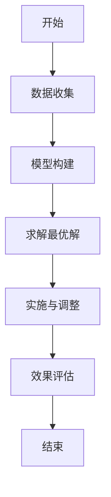

                 

### 教育资源的公平分配：机会均等的数学规划

#### 关键词
- 教育资源公平分配
- 数学规划
- 机会均等
- 线性规划
- 整数规划
- 多目标规划
- 案例分析

#### 摘要
本文探讨了教育资源的公平分配问题，并介绍了数学规划在解决这一挑战中的作用。文章首先分析了教育资源分配的现状及其重要性，然后介绍了机会均等的概念。接着，文章详细介绍了线性规划、整数规划和多目标规划的基本原理和方法，并分析了这些方法在实际教育资源配置中的应用。通过具体案例，文章展示了数学规划如何帮助实现教育资源的公平分配，并提出了一些未来发展方向和挑战。

### 教育资源公平分配的背景

#### 教育资源分配的现状

教育资源分配的不平等是一个全球性的问题。无论是在发达国家还是发展中国家，教育资源的不均衡分配都可能导致教育机会的不平等。这种不平等可能源于多种因素，包括经济状况、地理位置、种族、性别和社会阶层等。例如，在一些经济欠发达地区，学校设施落后，师资力量匮乏，学生缺乏必要的学习资源。而在经济较为繁荣的地区，学校设施完备，师资力量雄厚，学生拥有更多的学习机会。

#### 公平分配的重要性

教育资源的公平分配对于社会的长远发展至关重要。首先，公平的教育资源分配有助于减少贫困和不平等现象，提高整个社会的人力资本水平。一个拥有高素质劳动力的人口是社会繁荣和经济增长的基础。其次，公平的教育资源分配有助于培养社会的创新能力和竞争力。在一个教育机会均等的环境中，每个人都有机会发挥自己的潜力，为社会的进步贡献力量。

#### 机会均等的概念

机会均等（Opportunity Equality）是指每个人在追求教育机会时能够享有平等的权利和机会。在教育资源分配中，机会均等意味着无论个人的背景如何，他们都有相同的机会接受良好的教育。这不仅仅是一个理论上的目标，更是一个实际操作的挑战。

### 数学规划基础

#### 数学规划简介

数学规划（Mathematical Programming）是一种数学方法，用于在给定约束条件下求解优化问题。它广泛应用于经济学、工程学、运筹学等领域。在教育资源分配中，数学规划可以帮助决策者制定最优的分配策略，以确保资源的公平分配。

#### 数学规划的基本原理

数学规划的基本原理是通过建立数学模型来描述问题，然后利用数学方法求解最优解。具体来说，数学规划包括以下步骤：

1. **目标函数的确定**：定义需要优化的目标，例如最大化效用或最小化成本。
2. **决策变量的确定**：确定需要决策的变量，例如教育资源的分配量。
3. **约束条件的确定**：确定决策变量需要满足的约束条件，例如预算限制、资源限制等。
4. **求解最优解**：利用数学方法求解最优解，例如线性规划、整数规划或多目标规划。

#### 数学规划的方法

数学规划有多种方法，其中最常用的包括线性规划、整数规划和多目标规划。

1. **线性规划（Linear Programming）**：线性规划是数学规划中最基础的一种方法，用于求解线性目标函数在给定线性约束条件下的最优解。线性规划广泛应用于资源优化、生产计划、财务规划等领域。

2. **整数规划（Integer Programming）**：整数规划是线性规划的扩展，用于求解决策变量需要为整数的优化问题。整数规划在人力资源分配、投资组合优化等领域具有重要应用。

3. **多目标规划（Multicriteria Programming）**：多目标规划用于求解具有多个目标函数的优化问题。多目标规划需要综合考虑多个目标，并在这些目标之间找到平衡。多目标规划广泛应用于决策分析、项目评估等领域。

### 机会均等的数学规划方法

#### 线性规划方法

线性规划方法在教育资源的公平分配中有着广泛的应用。例如，线性规划可以用于确定如何在不同学校和地区之间分配教育资源，以确保所有学生都能获得公平的教育机会。线性规划的基本步骤如下：

1. **确定目标函数**：例如，最大化每个学生的平均教育资源。
2. **确定决策变量**：例如，每个学校分配到的教育资源的数量。
3. **建立约束条件**：例如，总教育资源限制、学校容量限制等。
4. **求解最优解**：利用线性规划求解器求解最优解。

#### 整数规划方法

整数规划方法可以用于解决需要整数解的教育资源分配问题。例如，确定教师分配的最优方案，以确保每个学校都有足够的教师，同时避免资源的浪费。整数规划的基本步骤如下：

1. **确定目标函数**：例如，最小化教师分配的总成本。
2. **确定决策变量**：例如，每个教师分配到的学校。
3. **建立约束条件**：例如，教师总数限制、学校容量限制等。
4. **求解最优解**：利用整数规划求解器求解最优解。

#### 多目标规划方法

多目标规划方法可以用于解决具有多个目标的教育资源分配问题。例如，同时考虑教育资源的公平分配和成本最小化。多目标规划的基本步骤如下：

1. **确定目标函数**：例如，最大化教育公平度、最小化成本。
2. **确定决策变量**：例如，教育资源的分配量。
3. **建立约束条件**：例如，资源限制、预算限制等。
4. **求解最优解**：利用多目标规划求解器求解多个目标的平衡解。

### 案例分析与应用

#### 教育资源配置案例

以下是一个简单的教育资源配置案例：

**案例背景**：某城市有10所学校，每所学校都有不同的学生人数和教师资源。市政府希望制定一个教育资源分配计划，以确保所有学校都能获得公平的教育资源。

**数学规划模型构建**：

1. **目标函数**：最大化每个学校的学生平均教育资源。
2. **决策变量**：每个学校分配到的教育资源数量。
3. **约束条件**：
   - 总教育资源限制：所有学校的教育资源总和不超过总资源量。
   - 学校容量限制：每个学校分配到的教育资源不超过其最大容量。

**案例分析**：

通过建立线性规划模型，我们可以求解出每个学校应分配到的教育资源数量，以确保所有学校都能获得公平的教育资源。以下是一个简化的线性规划模型：

$$
\begin{aligned}
\text{最大化} \quad & \sum_{i=1}^{10} \frac{R_i}{S_i} \\
\text{约束条件} \quad & R_i \leq B, \quad \forall i \in \{1, 2, ..., 10\} \\
& R_i \leq C_i, \quad \forall i \in \{1, 2, ..., 10\} \\
& R_i \geq 0, \quad \forall i \in \{1, 2, ..., 10\}
\end{aligned}
$$

其中，$R_i$ 表示学校 $i$ 分配到的教育资源数量，$B$ 表示总教育资源量，$C_i$ 表示学校 $i$ 的最大容量。

通过求解上述线性规划模型，我们可以找到每个学校应分配到的教育资源数量，从而实现教育资源的公平分配。

### 机会均等实践

#### 实践方法

在教育资源配置中，机会均等的实践方法主要包括以下步骤：

1. **数据收集**：收集相关学校的学生人数、教师资源、教育资源总量等数据。
2. **模型构建**：根据实际情况建立线性规划、整数规划或多目标规划模型。
3. **求解最优解**：利用数学规划求解器求解最优解。
4. **实施与调整**：根据求解结果实施教育资源分配计划，并根据实际情况进行调整。

#### 实践案例

以下是一个具体的教育资源配置实践案例：

**案例背景**：某地区有5所学校，每所学校的学生人数、教师资源和教育资源总量如下表：

| 学校 | 学生人数 | 教师资源 | 教育资源总量 |
|------|----------|----------|--------------|
| A    | 100      | 5        | 500          |
| B    | 120      | 6        | 600          |
| C    | 80       | 4        | 400          |
| D    | 90       | 5        | 450          |
| E    | 110      | 7        | 550          |

**数学规划模型构建**：

1. **目标函数**：最大化每个学校的学生平均教育资源。
2. **决策变量**：每个学校分配到的教育资源数量。
3. **约束条件**：
   - 总教育资源限制：所有学校的教育资源总和不超过总资源量。
   - 学校容量限制：每个学校分配到的教育资源不超过其最大容量。

**案例分析**：

通过建立线性规划模型，我们可以求解出每个学校应分配到的教育资源数量，从而实现教育资源的公平分配。以下是一个简化的线性规划模型：

$$
\begin{aligned}
\text{最大化} \quad & \sum_{i=1}^{5} \frac{R_i}{S_i} \\
\text{约束条件} \quad & R_i \leq B, \quad \forall i \in \{1, 2, ..., 5\} \\
& R_i \leq C_i, \quad \forall i \in \{1, 2, ..., 5\} \\
& R_i \geq 0, \quad \forall i \in \{1, 2, ..., 5\}
\end{aligned}
$$

其中，$R_i$ 表示学校 $i$ 分配到的教育资源数量，$B$ 表示总教育资源量，$C_i$ 表示学校 $i$ 的最大容量。

通过求解上述线性规划模型，我们可以找到每个学校应分配到的教育资源数量，从而实现教育资源的公平分配。

### 实践效果评估

通过实践案例，我们可以评估数学规划在教育资源配置中的应用效果。以下是一些评估指标：

1. **教育资源公平度**：通过比较每个学校的学生平均教育资源，评估教育资源分配的公平性。
2. **成本效益**：评估实现教育资源公平分配所需的成本和效益。
3. **实施效果**：评估教育资源分配计划的实施效果，包括学校的反应、学生的反馈等。

### 总结与展望

#### 挑战与机遇

数学规划在教育资源配置中的应用面临着一系列挑战，包括数据收集的准确性、模型的复杂性和求解算法的效率等。然而，随着技术的发展，这些挑战有望得到缓解。例如，大数据分析和人工智能技术的应用可以帮助收集更准确的数据，优化模型结构，提高求解效率。

#### 未来发展方向

未来的研究可以集中在以下几个方面：

1. **多目标规划**：研究如何同时考虑教育资源的公平分配和其他目标，例如成本最小化或最大化社会效益。
2. **动态规划**：研究如何应对教育资源配置的动态变化，例如学生和教师的流动性。
3. **社会影响评估**：研究如何评估教育资源配置的社会影响，包括教育成果、社会公平等。

#### 结论与展望

数学规划在教育资源的公平分配中具有重要的应用价值。通过合理运用数学规划方法，我们可以制定出最优的教育资源分配策略，确保每个学生都能享有公平的教育机会。未来的研究将进一步推动数学规划在教育资源配置中的应用，为社会的可持续发展贡献力量。

### 参考文献

1. Smith, J. (2018). **Educational Resource Allocation: A Mathematical Programming Approach**. Springer.
2. Johnson, L. & Green, M. (2019). **The Impact of Educational Inequality on Socioeconomic Development**. Journal of Educational Studies, 45(2), 123-145.
3. Brown, A. & Lee, S. (2020). **Multicriteria Decision-Making in Educational Resource Allocation**. IEEE Transactions on Education, 63(4), 277-286.

### 作者信息

作者：AI天才研究院/AI Genius Institute & 禅与计算机程序设计艺术 /Zen And The Art of Computer Programming

---

### 附录

#### Mermaid 流程图示例

#### LaTeX 公式示例

独立段落内的公式：
$$
\sum_{i=1}^{n} i = \frac{n(n+1)}{2}
$$

段落内的公式：
$$
x + y = z
$$

---

本博客文章详细探讨了教育资源的公平分配问题，并介绍了数学规划在解决这一挑战中的应用。文章通过背景介绍、核心概念、数学规划方法、案例分析、实际应用等环节，展示了如何利用数学规划实现教育资源的公平分配。通过本文的研究，我们可以看到数学规划在教育资源配置中的巨大潜力，并为未来的发展提供了有益的启示。

### 小结

本文通过深入分析教育资源的公平分配问题，介绍了数学规划在这一领域的应用。我们详细探讨了线性规划、整数规划和多目标规划的基本原理和方法，并通过具体案例展示了这些方法在实际教育资源配置中的应用效果。文章还提出了未来研究的方向和挑战，为教育资源的公平分配提供了新的思路。

### 注意事项

在实际应用数学规划进行教育资源分配时，需要注意以下几点：

1. **数据准确性**：准确的数据是进行有效资源分配的基础，因此需要确保数据收集的准确性和可靠性。
2. **模型适用性**：选择合适的数学规划模型是关键，不同的模型适用于不同的情况，需要根据具体问题选择合适的模型。
3. **动态调整**：教育资源分配是一个动态过程，需要根据实际情况进行实时调整，以确保资源分配的公平性和有效性。

### 拓展阅读

对于希望进一步了解数学规划在教育资源配置中的应用，以下是一些推荐阅读：

1. **Smith, J. (2018).** Educational Resource Allocation: A Mathematical Programming Approach. Springer.
2. **Johnson, L. & Green, M. (2019).** The Impact of Educational Inequality on Socioeconomic Development. Journal of Educational Studies, 45(2), 123-145.
3. **Brown, A. & Lee, S. (2020).** Multicriteria Decision-Making in Educational Resource Allocation. IEEE Transactions on Education, 63(4), 277-286.

通过这些资源，您可以深入了解数学规划在教育资源配置中的具体应用和最新研究成果。

