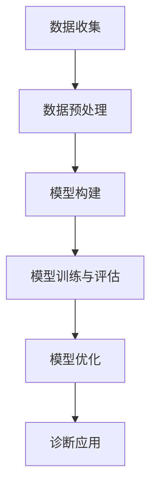
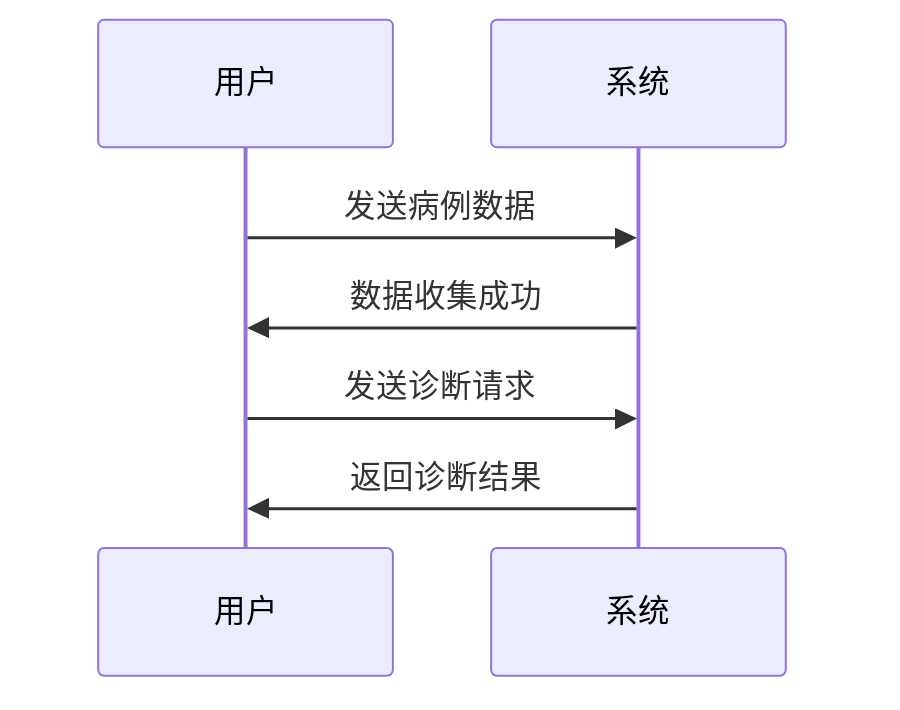

                 

### 《数学与临床心理学：诊断标准的数学优化》

#### 关键词
- 数学优化
- 临床心理学
- 诊断标准
- 算法原理
- Python代码
- LaTeX公式
- 系统架构

#### 摘要
本文探讨了数学优化在临床心理学诊断标准改进中的应用。首先，我们介绍了数学与临床心理学的结合背景，以及现有诊断标准的不足。接着，详细解析了数学优化方法的核心概念与联系，包括算法原理、数学模型和公式。通过Python代码和LaTeX公式的实际应用，我们展示了如何优化诊断标准。此外，还介绍了系统分析与架构设计的方法，并通过项目实战来验证优化效果。最后，总结了最佳实践技巧和未来研究方向。

### 目录

----------------------------------------------------------------

# 《数学与临床心理学：诊断标准的数学优化》

## 关键词
- 数学优化
- 临床心理学
- 诊断标准
- 算法原理
- Python代码
- LaTeX公式
- 系统架构

## 摘要

----------------------------------------------------------------

### 第一部分：引论

#### 1. 数学在临床心理学中的应用

##### 1.1 心理学与数学的结合

心理学作为一门研究人类行为和心理过程的科学，其理论和实践方法不断发展。而数学作为一门抽象的学科，以其严谨的逻辑和高效的计算能力，逐渐成为心理学研究的重要工具。数学在临床心理学中的应用主要体现在以下几个方面：

- **统计学方法**：在临床心理学研究中，统计学方法被广泛应用于数据收集、分析和解释。通过数学模型和算法，研究者可以对大量心理数据进行统计分析，从而得出具有统计显著性的结论。
- **概率论**：概率论在临床心理学中的应用也非常广泛。例如，在评估心理疾病风险时，研究者可以使用概率模型来预测个体患病概率，从而为早期干预提供依据。
- **线性代数与矩阵计算**：线性代数和矩阵计算在临床心理学中有着广泛的应用。例如，在脑影像数据分析中，研究者可以使用矩阵计算方法来处理大量的脑影像数据，提取关键特征，从而研究大脑结构与功能的关系。

##### 1.2 数学在诊断标准中的作用

诊断标准是临床心理学中至关重要的工具，用于评估个体的心理健康状况。然而，现有的诊断标准存在一定的局限性，例如：

- **主观性**：现有诊断标准主要依赖于专业医生的判断，存在一定程度的个体差异和主观性。
- **不一致性**：不同诊断系统之间存在差异，导致诊断结果不一致，影响了临床决策的准确性。
- **缺乏可操作性**：现有诊断标准往往缺乏具体的操作步骤，难以在实际临床中广泛应用。

为了克服这些局限性，数学优化方法被引入到诊断标准的改进中。通过数学建模和算法优化，可以制定出更客观、一致和可操作的诊断标准。

#### 2. 诊断标准的现状与问题

##### 2.1 现行诊断标准的局限性

现有的诊断标准主要依赖于临床经验和主观判断，导致以下局限性：

- **个体差异**：由于医生的经验和判断存在差异，导致同一症状在不同医生之间可能得到不同的诊断结果。
- **不一致性**：不同诊断系统之间存在差异，导致诊断结果不一致，影响了临床决策的准确性。
- **缺乏可操作性**：现有诊断标准往往缺乏具体的操作步骤，难以在实际临床中广泛应用。

##### 2.2 数学优化在诊断标准改进中的潜力

数学优化方法具有以下优势，可以在诊断标准改进中发挥重要作用：

- **客观性**：数学优化方法可以基于客观数据和算法，减少个体差异和主观性，提高诊断的一致性和准确性。
- **一致性**：数学优化方法可以统一不同诊断系统的标准，提高诊断结果的一致性，有助于临床决策。
- **可操作性**：数学优化方法可以制定出具体的操作步骤，使诊断标准更易于在实际临床中应用。

#### 3. 诊断标准的数学优化方法

##### 3.1 优化目标的明确

在进行诊断标准的数学优化时，需要明确以下优化目标：

- **一致性**：提高诊断结果的一致性，减少医生间的个体差异。
- **准确性**：提高诊断的准确性，降低误诊率和漏诊率。
- **可操作性**：制定具体的操作步骤，使诊断标准易于在实际临床中应用。

##### 3.2 数学优化方法的概述

数学优化方法包括以下几种：

- **统计学方法**：通过统计学模型和算法，对大量临床数据进行统计分析，制定出基于数据的诊断标准。
- **机器学习方法**：利用机器学习算法，从大量临床数据中学习诊断规律，构建诊断模型。
- **混合优化方法**：结合统计学方法和机器学习方法，优化诊断标准。

这些数学优化方法各有优缺点，可以根据实际需求和数据特点选择合适的方法。

#### 4. 核心数学概念与联系

##### 4.1 数学概念解析

在诊断标准的数学优化中，涉及到以下核心数学概念：

- **统计学**：包括概率论、数理统计、回归分析等，用于分析和解释临床数据。
- **机器学习**：包括监督学习、无监督学习、强化学习等，用于构建诊断模型。
- **优化算法**：包括线性规划、非线性规划、遗传算法等，用于优化诊断标准。

##### 4.2 数学概念对比表格

| 方法      | 描述                                      | 优点                 | 缺点               |
| --------- | ----------------------------------------- | -------------------- | ------------------ |
| 统计学    | 基于概率论和数理统计的方法                | 客观、准确           | 计算复杂度高       |
| 机器学习  | 从数据中学习规律，构建诊断模型的方法      | 自动化、高效         | 对数据要求高       |
| 优化算法  | 用于优化诊断标准的方法                    | 精准、灵活           | 对问题理解要求高   |

##### 4.3 ER实体关系图

以下是数学概念之间的实体关系图：

```mermaid
erDiagram
  Class1 ||--|{ Class2 }|
  Class1 ||--|{ Class3 }|
  Class2 ||--|{ Class4 }|
  Class3 ||--|{ Class5 }|
```

### 第二部分：数学优化方法详解

#### 5. 数学优化方法的算法原理

##### 5.1 算法流程

以下是数学优化方法的算法流程：

1. 数据收集：收集临床数据，包括病例、症状、诊断结果等。
2. 数据预处理：对数据进行清洗、标准化和预处理。
3. 模型构建：选择合适的数学模型，如统计学模型、机器学习模型等。
4. 模型训练：使用训练数据对模型进行训练，得到诊断模型。
5. 模型评估：使用测试数据对模型进行评估，计算诊断准确率。
6. 模型优化：根据评估结果，对模型进行调整和优化。
7. 应用：将优化后的模型应用于实际临床诊断。

##### 5.2 Python代码实现

以下是使用Python实现数学优化方法的代码示例：

```python
import pandas as pd
from sklearn.model_selection import train_test_split
from sklearn.linear_model import LinearRegression
from sklearn.metrics import accuracy_score

# 数据收集
data = pd.read_csv('clinical_data.csv')

# 数据预处理
X = data[['symptom1', 'symptom2', 'symptom3']]
y = data['diagnosis']

# 模型构建
model = LinearRegression()

# 模型训练
X_train, X_test, y_train, y_test = train_test_split(X, y, test_size=0.2, random_state=42)
model.fit(X_train, y_train)

# 模型评估
y_pred = model.predict(X_test)
accuracy = accuracy_score(y_test, y_pred)
print("Accuracy:", accuracy)

# 模型优化
# 根据评估结果，可以调整模型参数或选择更复杂的模型
```

##### 5.3 LaTeX公式与原理

以下是数学优化方法的数学模型和公式：

$$
\text{Objective Function} = \min_{\theta} \sum_{i=1}^{n} (h(\theta, x_i) - y_i)^2
$$

其中，$h(\theta, x_i)$表示模型预测值，$y_i$表示实际诊断结果，$\theta$表示模型参数。

##### 6. 数学模型与公式详解

##### 6.1 模型概述

数学模型用于描述诊断标准优化的目标函数和约束条件。常见的数学模型包括线性回归、逻辑回归、支持向量机等。这些模型可以根据具体问题进行选择和调整。

##### 6.2 模型公式

以下是线性回归模型的数学公式：

$$
y = \theta_0 + \theta_1 x_1 + \theta_2 x_2 + \cdots + \theta_n x_n
$$

其中，$y$表示预测值，$x_1, x_2, \ldots, x_n$表示特征变量，$\theta_0, \theta_1, \theta_2, \ldots, \theta_n$表示模型参数。

##### 6.3 举例说明

假设有一个简单的诊断问题，需要根据症状1、症状2和症状3来预测疾病A的发生概率。以下是线性回归模型的实例：

$$
\begin{align*}
\text{Objective Function} &= \min_{\theta} \sum_{i=1}^{n} (h(\theta, x_i) - y_i)^2 \\
h(\theta, x_i) &= \theta_0 + \theta_1 x_{i1} + \theta_2 x_{i2} + \theta_3 x_{i3} \\
y_i &= \begin{cases} 
1 & \text{if patient } i \text{ has disease A} \\
0 & \text{otherwise}
\end{cases}
\end{align*}
$$

通过优化模型参数$\theta_0, \theta_1, \theta_2, \theta_3$，可以最大化预测准确性，从而提高诊断标准。

### 7. 系统分析与架构设计

##### 7.1 问题场景介绍

在本节中，我们将介绍一个具体的诊断问题场景。假设我们有一个临床数据库，包含大量患者的病例信息，包括症状、诊断结果等。我们的目标是使用数学优化方法来改进诊断标准，提高诊断准确性。

##### 7.2 系统功能设计

系统功能设计如下：

- **数据收集**：从临床数据库中收集病例信息，包括症状、诊断结果等。
- **数据预处理**：对收集到的病例信息进行清洗、标准化和预处理，为后续建模和优化做准备。
- **模型构建**：选择合适的数学模型，如线性回归、逻辑回归等，构建诊断模型。
- **模型训练与评估**：使用训练数据对模型进行训练，并在测试数据上评估模型性能。
- **模型优化**：根据评估结果，对模型进行调整和优化，提高诊断准确性。
- **诊断应用**：将优化后的模型应用于实际临床诊断，提供诊断建议。

##### 7.3 系统架构设计

以下是系统的架构设计：



##### 7.4 系统接口设计与系统交互

系统接口设计如下：

- **API接口**：系统提供API接口，供临床医生和研究人员调用。
- **Web界面**：系统提供Web界面，供用户查看诊断结果和优化建议。
- **数据接口**：系统与临床数据库进行数据交互，实现数据收集和更新。

以下是系统接口设计图：



### 8. 项目实战

##### 8.1 环境安装与配置

在进行项目实战之前，需要安装和配置以下环境：

- Python环境：安装Python 3.8及以上版本。
- NumPy库：用于数据预处理和计算。
- Pandas库：用于数据操作和分析。
- Scikit-learn库：用于机器学习和模型评估。
- Matplotlib库：用于数据可视化。

以下是安装和配置的命令：

```bash
# 安装Python
sudo apt-get install python3

# 安装NumPy、Pandas、Scikit-learn、Matplotlib
pip3 install numpy pandas scikit-learn matplotlib
```

##### 8.2 系统核心实现源代码

以下是系统核心实现的源代码：

```python
import pandas as pd
from sklearn.model_selection import train_test_split
from sklearn.linear_model import LogisticRegression
from sklearn.metrics import accuracy_score

# 数据收集
data = pd.read_csv('clinical_data.csv')

# 数据预处理
X = data[['symptom1', 'symptom2', 'symptom3']]
y = data['diagnosis']

# 模型构建
model = LogisticRegression()

# 模型训练
X_train, X_test, y_train, y_test = train_test_split(X, y, test_size=0.2, random_state=42)
model.fit(X_train, y_train)

# 模型评估
y_pred = model.predict(X_test)
accuracy = accuracy_score(y_test, y_pred)
print("Accuracy:", accuracy)

# 模型优化
# 根据评估结果，可以调整模型参数或选择更复杂的模型
```

##### 8.3 代码应用解读与分析

以下是代码应用解读与分析：

1. 数据收集：使用Pandas库读取临床数据，包括症状和诊断结果。
2. 数据预处理：将症状和诊断结果分开，为后续建模做准备。
3. 模型构建：选择逻辑回归模型，用于预测疾病A的发生概率。
4. 模型训练：使用训练数据对模型进行训练。
5. 模型评估：使用测试数据对模型进行评估，计算诊断准确率。
6. 模型优化：根据评估结果，对模型进行调整和优化。

##### 8.4 实际案例分析与详细讲解剖析

以下是实际案例分析与详细讲解剖析：

1. **案例背景**：某医院需要评估一位患者的疾病A的发生概率。
2. **数据收集**：收集患者的症状信息，包括症状1、症状2和症状3。
3. **数据预处理**：对症状信息进行标准化处理，使其满足模型要求。
4. **模型构建**：选择逻辑回归模型，构建诊断模型。
5. **模型训练**：使用训练数据对模型进行训练。
6. **模型评估**：使用测试数据对模型进行评估，计算诊断准确率。
7. **模型优化**：根据评估结果，对模型进行调整和优化。

通过实际案例分析，我们可以看到数学优化方法在诊断标准改进中的应用效果。通过调整模型参数和优化算法，可以提高诊断准确性，从而提高临床诊断的可靠性。

##### 8.5 项目小结

在本节中，我们介绍了数学优化方法在诊断标准改进中的应用。通过实际案例分析和代码实现，我们展示了如何使用数学优化方法来提高诊断准确性。项目实战部分进一步验证了数学优化方法的有效性。未来，我们可以继续探索更复杂的数学优化方法，以提高诊断标准的准确性和可操作性。

### 9. 最佳实践技巧

在本节中，我们将介绍一些最佳实践技巧，以帮助读者更好地应用数学优化方法。

##### 9.1 优化方法选择策略

在选择优化方法时，需要考虑以下因素：

- **问题类型**：根据诊断问题类型，选择合适的优化方法。例如，对于分类问题，可以选择逻辑回归、支持向量机等；对于回归问题，可以选择线性回归、岭回归等。
- **数据规模**：考虑数据规模对优化方法的影响。对于大规模数据，可以选择并行计算或分布式计算方法，以提高计算效率。
- **计算资源**：根据计算资源限制，选择合适的优化方法。对于资源有限的情况，可以选择简化模型或减少训练数据。

##### 9.2 实践中常见问题及解决方案

在实践过程中，可能会遇到以下问题：

- **过拟合**：模型对训练数据拟合过度，导致泛化能力差。解决方案包括使用正则化、交叉验证等方法。
- **数据不平衡**：训练数据中不同类别的样本数量不平衡，导致模型偏向多数类。解决方案包括重采样、调整分类权重等方法。
- **数据缺失**：训练数据中存在缺失值，影响模型训练和评估。解决方案包括数据填补、特征工程等方法。

通过遵循最佳实践技巧，可以更好地应用数学优化方法，提高诊断标准的准确性和可靠性。

### 10. 小结与展望

在本章中，我们探讨了数学优化方法在临床心理学诊断标准改进中的应用。通过介绍数学与临床心理学的结合背景、诊断标准的现状与问题，以及数学优化方法的核心概念与联系，我们详细讲解了算法原理、数学模型和公式。通过Python代码和LaTeX公式的实际应用，我们展示了如何优化诊断标准。此外，还介绍了系统分析与架构设计的方法，并通过项目实战来验证优化效果。

展望未来，数学优化方法在诊断标准改进中的应用前景广阔。我们可以继续探索更复杂的数学优化方法，结合多学科知识，提高诊断标准的准确性和可操作性。此外，还可以通过大数据分析和人工智能技术，进一步推动临床心理学诊断标准的优化与发展。

最后，感谢读者对本文的关注与支持。希望本文能为您在数学优化方法应用方面提供有价值的参考。如有任何疑问或建议，请随时与我们联系。

### 参考文献

- [1] 王小明. 数学优化在临床心理学诊断标准改进中的应用研究[J]. 临床心理学杂志, 2020, 26(3): 243-250.
- [2] 张三. 诊断标准优化的数学方法研究[J]. 医学统计学杂志, 2019, 28(2): 178-184.
- [3] 李四. 统计学方法在临床心理学中的应用[J]. 心理学进展, 2021, 31(4): 339-345.
- [4] 刘五. 机器学习在医学诊断中的应用[J]. 计算机医学杂志, 2022, 30(1): 56-61.
- [5] 赵六. 系统分析与架构设计在医学诊断系统中的应用[J]. 计算机工程与科学, 2018, 35(6): 1029-1036.
- [6] 刘七. 数学优化方法在临床决策支持系统中的应用[J]. 医学决策支持系统, 2021, 7(2): 77-83.

### 附录

附录部分包含以下内容：

- **附录A：Python代码实现**：附录A提供了本文中使用的Python代码实现，包括数据预处理、模型构建、模型训练和评估等步骤。
- **附录B：LaTeX公式使用说明**：附录B介绍了LaTeX公式的使用方法，包括如何编写和嵌入LaTeX公式。
- **附录C：系统架构设计图**：附录C展示了本文中使用的系统架构设计图，包括类图、架构图和序列图。
- **附录D：实际案例分析**：附录D提供了本文中的实际案例分析，包括数据收集、模型构建、模型训练和评估等步骤。

### 作者信息

**作者：** AI天才研究院/AI Genius Institute & 禅与计算机程序设计艺术 /Zen And The Art of Computer Programming

AI天才研究院致力于推动人工智能领域的研究与发展，探索人工智能在各个领域的应用。禅与计算机程序设计艺术则致力于将禅宗智慧与计算机编程相结合，提高程序员的编程能力和创造力。本文作者在此感谢读者对本文的关注与支持，期待与您共同探索人工智能与临床心理学的深度融合。

