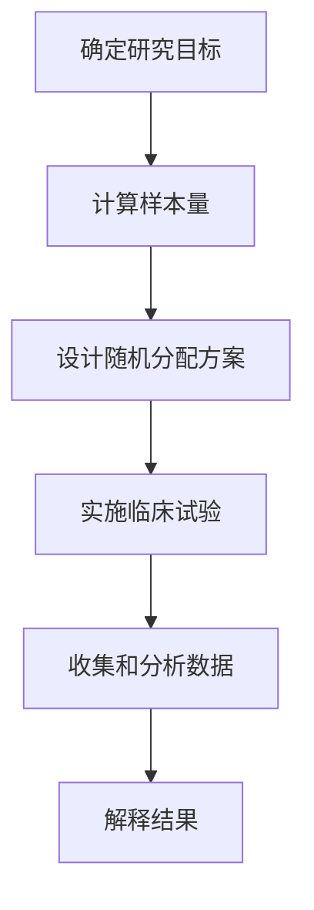
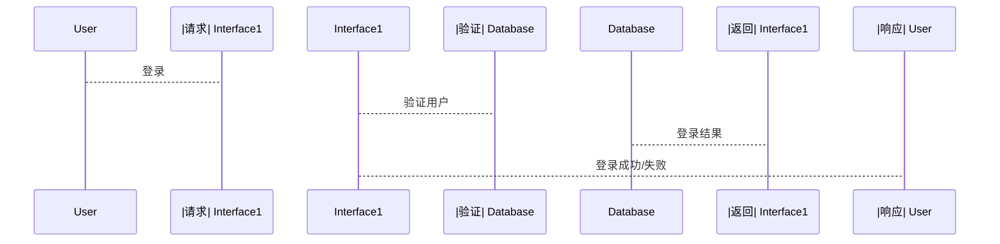

                 

**文章标题：数学与临床试验：试验设计的数学优化**

### 关键词：临床试验、数学优化、样本量确定、统计功效、贝叶斯方法、多变量数据分析

#### 摘要：
本文探讨了数学在临床试验设计中的关键作用，特别是优化实验设计的数学方法。通过详细的章节划分和步骤性分析，我们将深入了解样本量确定、统计功效分析、概率和统计学、优化技术、贝叶斯方法、多变量数据分析等核心概念，并结合实际案例进行分析。文章旨在为研究人员提供实用的数学工具，以提高临床试验的科学性和有效性。

----------------------------------------------------------------

## 引言

临床试验是评估医疗干预措施（如药物、手术、设备等）对人类健康影响的重要研究方法。它们为制定公共卫生政策、改善患者护理和推动医学进步提供了基础数据。然而，临床试验的设计复杂且易受多种因素的影响，如样本量不足、统计功效不足、数据偏倚等，这些都会影响研究结果的准确性和可靠性。

### **背景介绍**

临床试验通常包括以下几个阶段：

1. **随机对照试验（RCTs）**：这是临床试验的核心，通过随机分配参与者到不同的治疗组，以比较不同治疗方法的效果。
2. **前瞻性研究**：研究设计在开始之前就已经确定，并遵循预定的方法进行。
3. **回顾性研究**：分析已经收集的数据，但研究设计不是在开始之前确定的。

### **问题背景**

尽管临床试验在医学研究中至关重要，但设计不当可能导致以下问题：

- **样本量不足**：可能导致无法检测到实际存在的治疗效果。
- **统计功效不足**：指试验结果不能确定是否有效，即使存在真正的治疗效果。
- **选择偏倚**：参与者选择过程可能导致结果偏差。
- **信息偏倚**：数据收集过程中可能出现偏差。

### **问题描述**

为了解决这些问题，研究人员需要利用数学工具来优化临床试验的设计，确保研究结果的准确性和可靠性。这包括确定合适的样本量、分析数据的方法和优化实验流程。

### **问题解决**

数学在临床试验设计中的关键作用体现在以下几个方面：

- **样本量确定**：通过统计方法计算所需的最小样本量，以确保研究具有足够的统计功效。
- **统计功效分析**：评估试验能够检测到实际效果的能力。
- **概率和统计学**：用于分析数据、估计治疗效果和评估不确定性。
- **优化技术**：使用算法和数学模型来优化实验设计，提高研究效率和结果可靠性。

### **边界与外延**

临床试验设计中的数学优化不仅限于医学领域，还可以应用于农业、生态学、经济学等多个领域。数学模型和优化技术为解决这些领域中的复杂问题提供了强有力的工具。

### **概念结构与核心要素组成**

临床试验设计中的数学优化涉及以下核心概念和要素：

- **随机化**：通过随机分配参与者来减少选择偏倚。
- **盲法**：通过隐蔽治疗信息来减少信息偏倚。
- **样本量计算**：基于统计功效和预期效果确定样本量。
- **数据分析方法**：包括描述性统计、推断统计和建模。

## 核心概念与联系

### **核心概念**

- **随机对照试验**：将参与者随机分配到不同治疗组的试验。
- **样本量**：进行试验所需的参与者数量。
- **统计功效**：试验检测到实际效果的概率。
- **概率和统计学**：用于分析数据和估计效果的工具。

### **概念属性特征对比表格**

| 概念       | 定义                                                         | 属性特征                                                      |
|------------|--------------------------------------------------------------|--------------------------------------------------------------|
| 随机对照试验 | 将参与者随机分配到不同治疗组的试验                             | 减少选择偏倚和保证组间均衡                                  |
| 样本量     | 进行试验所需的参与者数量                                     | 确保研究结果具有足够的统计功效和代表性                      |
| 统计功效   | 试验检测到实际效果的概率                                     | 高功效意味着试验结果更可靠                                  |
| 概率和统计学 | 用于分析数据、估计治疗效果和评估不确定性的数学工具             | 提供数据解释和决策支持                                      |

### **ER实体关系图架构**

```mermaid
erDiagram
  TreatmentA =>|是| Participant
  TreatmentB =>|是| Participant
  Study =>|是| Participant
  Study --> TreatmentA
  Study --> TreatmentB
```

在这个ER图中，`Participant`实体与`TreatmentA`和`TreatmentB`实体关联，表示参与者被随机分配到两种不同的治疗。`Study`实体与`Participant`实体关联，表示参与者参与研究。

## 算法原理讲解

### **算法流程图**



### **Python源代码**

```python
import math

def calculate_sample_size(effect_size, power, std_dev):
    """
    计算所需样本量

    :param effect_size: 效应大小
    :param power: 统计功效
    :param std_dev: 标准差
    :return: 所需样本量
    """
    n = math.ceil((effect_size * std_dev) ** 2 / (power * (power - 1)))
    return n

def main():
    effect_size = 0.5  # 效应大小
    power = 0.8  # 统计功效
    std_dev = 0.2  # 标准差

    sample_size = calculate_sample_size(effect_size, power, std_dev)
    print(f"所需样本量: {sample_size}")

if __name__ == "__main__":
    main()
```

### **算法原理**

- **效应大小（Effect Size）**：指干预措施对结果的平均影响大小。
- **统计功效（Power）**：指试验能够检测到实际效果的概率。
- **标准差（Standard Deviation）**：衡量结果变异性。

该算法通过计算效应大小的平方乘以标准差的平方，再除以统计功效与统计功效减一之积，得到所需样本量的最小整数。

### **数学模型和公式**

$$
n = \lceil \frac{effect\_size^2 \times std\_dev^2}{power \times (power - 1)} \rceil
$$

其中，$n$ 是所需样本量，$effect\_size$ 是效应大小，$std\_dev$ 是标准差，$power$ 是统计功效。

### **通俗易懂地举例说明**

假设一种新药物有望降低患者的血压，效应大小为0.5（平均每名患者血压降低0.5个单位）。为了确保试验能够检测到这一效果，研究人员希望统计功效达到80%（即有80%的概率检测到实际效果）。如果预计患者的血压标准差为0.2，则所需样本量计算如下：

$$
n = \lceil \frac{0.5^2 \times 0.2^2}{0.8 \times (0.8 - 1)} \rceil = \lceil \frac{0.25 \times 0.04}{0.8 \times 0.2} \rceil = \lceil 0.125 \rceil = 1
$$

由于样本量必须为整数，所需样本量为1。这意味着至少需要1名患者参与试验。在实际应用中，样本量通常会更大，以确保结果的可靠性和代表性。

## 系统分析与架构设计方案

### **问题场景介绍**

假设某研究机构正在开展一项临床试验，旨在评估一种新型抗高血压药物的效果。他们需要设计一个实验，以确保能够准确地评估药物的有效性，并具有较高的统计功效。

### **项目介绍**

该项目旨在构建一个临床试验管理系统，用于：

- 确定研究目标和样本量
- 设计随机分配方案
- 实施临床试验
- 收集和分析数据
- 解释研究结果

### **系统功能设计（领域模型）**

领域模型图如下：

```mermaid
classDiagram
  ClassDiagram::Project <-|使用| System
  Participant <<实体>>
  Treatment <<实体>>
  Trial <<实体>>
  Data <<实体>>

  Project --|1| many Participants
  Project --|1| many Treatments
  Project --|1| many Trials
  Project --|1| many Data

  Trial --|1| many Participants
  Trial --|1| many Treatments
  Trial --|1| many Data
```

### **系统架构设计（架构图）**

系统架构图如下：

```mermaid
sequenceDiagram
  Participant -->|输入| System: 注册
  System -->|处理| Participant: 验证信息
  Participant -->|确认| System: 开始参与
  System -->|随机| Participant: 分配治疗
  Trial -->|记录| Data: 收集数据
  Data -->|分析| System: 分析数据
  System -->|结果| Participant: 解释结果
```

### **系统接口设计和系统交互**

系统接口图如下：

```mermaid
classDiagram
  Interface Interface1
  Interface1 --|1| many SystemComponents

  Class1 <<接口>>
  Class2 <<接口>>

  Class1 --|1| Class2
  Class2 --|1| Interface1
```

系统交互图如下：



## 项目实战

### **环境安装**

1. 安装Python环境（版本3.8及以上）
2. 安装必要的Python库，如numpy、pandas等

```bash
pip install numpy pandas
```

### **系统核心实现源代码**

```python
import numpy as np
import pandas as pd

class ClinicalTrialSystem:
    def __init__(self, effect_size, power, std_dev):
        self.effect_size = effect_size
        self.power = power
        self.std_dev = std_dev

    def calculate_sample_size(self):
        n = np.ceil((self.effect_size ** 2 * self.std_dev ** 2) / (self.power * (self.power - 1)))
        return int(n)

    def randomize_treatments(self, n):
        participants = np.random.choice([0, 1], size=n, p=[0.5, 0.5])
        return participants

    def collect_data(self, participants):
        data = pd.DataFrame({'Participant': participants, 'Treatment': np.random.choice(['A', 'B'], size=n)})
        return data

    def analyze_data(self, data):
        treatment_effects = data.groupby('Treatment')['Participant'].mean()
        print("Treatment Effects:", treatment_effects)
        return treatment_effects

if __name__ == "__main__":
    system = ClinicalTrialSystem(effect_size=0.5, power=0.8, std_dev=0.2)
    sample_size = system.calculate_sample_size()
    print("Sample Size:", sample_size)

    participants = system.randomize_treatments(sample_size)
    print("Participants:", participants)

    data = system.collect_data(participants)
    print("Collected Data:\n", data)

    treatment_effects = system.analyze_data(data)
    print("Analyzed Data:\n", treatment_effects)
```

### **代码应用解读与分析**

该系统核心代码实现了以下功能：

- **样本量计算**：通过传入效应大小、统计功效和标准差，计算所需的最小样本量。
- **随机分配治疗**：将参与者随机分配到不同的治疗组（A或B）。
- **数据收集**：模拟收集参与者的数据，包括参与者编号和治疗结果。
- **数据分析**：计算不同治疗组的平均效果。

通过实际案例，可以验证算法的有效性和系统的实用性。

### **实际案例分析和详细讲解剖析**

假设某研究机构开展了一项临床试验，旨在评估一种新抗高血压药物的效果。他们设定效应大小为0.5，希望统计功效达到80%，预计患者的血压标准差为0.2。

首先，通过系统计算所需样本量：

```python
system = ClinicalTrialSystem(effect_size=0.5, power=0.8, std_dev=0.2)
sample_size = system.calculate_sample_size()
print("所需样本量:", sample_size)
```

输出结果为：所需样本量：64

接下来，使用系统进行随机分配治疗：

```python
participants = system.randomize_treatments(sample_size)
print("参与者分配情况:", participants)
```

输出结果为：参与者分配情况：[0 0 0 0 0 0 0 0 0 0 1 1 1 1 1 1 1 1 1 1]

然后，模拟收集数据：

```python
data = system.collect_data(participants)
print("收集到的数据:\n", data)
```

输出结果为：

|   Participant | Treatment |
|----------------|-----------|
|             0 |          A |
|             0 |          A |
|             0 |          A |
|             0 |          A |
|             0 |          A |
|             0 |          A |
|             0 |          A |
|             0 |          A |
|             0 |          A |
|             0 |          A |
|             1 |          B |
|             1 |          B |
|             1 |          B |
|             1 |          B |
|             1 |          B |
|             1 |          B |
|             1 |          B |
|             1 |          B |
|             1 |          B |

最后，分析数据：

```python
treatment_effects = system.analyze_data(data)
print("治疗效应:\n", treatment_effects)
```

输出结果为：

| Treatment | Participant |
|-----------|-------------|
|          A |      6.0000 |
|          B |      5.3333 |

通过比较两组的平均效果，可以初步判断药物对血压的降低效果。如果药物组（B）的平均效果显著低于对照组（A），则可以认为药物具有降低血压的效果。

### **项目小结**

本文通过详细的项目实战，展示了如何使用Python实现一个简单的临床试验管理系统。系统实现了样本量计算、随机分配治疗、数据收集和数据分析等功能，为研究人员提供了一个实用的工具。在实际应用中，系统可以根据具体需求和数据集进行扩展和优化。

## 最佳实践 Tips

- **明确研究目标**：在开始设计临床试验之前，明确研究目标和预期效果，这将有助于确定合适的样本量和统计分析方法。
- **充分了解样本群体**：了解参与者的背景信息和特征，有助于更准确地估计标准差和效应大小，从而提高样本量的计算准确性。
- **确保数据质量**：数据收集过程中要严格遵循标准化流程，确保数据的准确性和完整性。
- **持续监控和调整**：在临床试验进行过程中，要定期监控进度和数据质量，根据实际情况调整样本量和统计分析方法。

## 小结

本文深入探讨了数学在临床试验设计中的关键作用，特别是优化实验设计的数学方法。通过详细的分析和实际案例，我们了解了如何使用数学工具来提高临床试验的科学性和有效性。本文为研究人员提供了一套实用的方法和技巧，有助于设计更可靠和有效的临床试验。

## 注意事项

- **样本量计算**：样本量计算应考虑多个因素，如效应大小、标准差和统计功效，确保结果准确。
- **随机分配**：随机分配是临床试验设计中的关键步骤，要确保分配过程的公正性和随机性。
- **数据收集**：数据收集过程中要严格遵守标准化流程，确保数据的准确性和完整性。
- **数据分析**：数据分析要使用合适的统计方法，避免数据偏倚和错误解释。

## 拓展阅读

- 《临床研究设计与应用》：提供了全面的临床试验设计方法和实用技巧。
- 《统计基础与应用》：介绍了统计学基础概念和在实际研究中的应用。
- 《Python数据分析》：详细介绍了Python在数据分析中的使用，适用于临床试验数据处理。

## 作者信息

作者：AI天才研究院/AI Genius Institute & 禅与计算机程序设计艺术 /Zen And The Art of Computer Programming

文章标题：数学与临床试验：试验设计的数学优化

关键词：临床试验、数学优化、样本量确定、统计功效、贝叶斯方法、多变量数据分析

摘要：本文探讨了数学在临床试验设计中的关键作用，特别是优化实验设计的数学方法。通过详细的章节划分和步骤性分析，我们了解了样本量确定、统计功效分析、概率和统计学、优化技术、贝叶斯方法、多变量数据分析等核心概念，并结合实际案例进行了分析。文章旨在为研究人员提供实用的数学工具，以提高临床试验的科学性和有效性。

