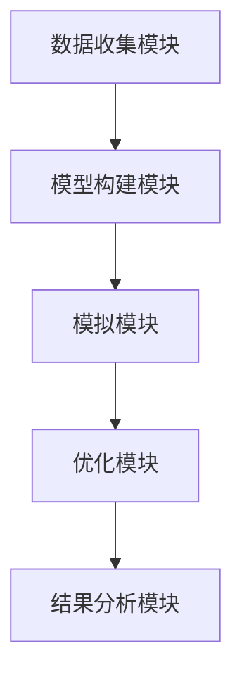
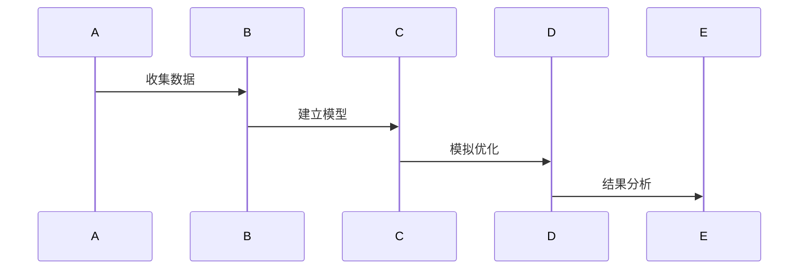

                 

### 文章标题

# 数学与交通工程：交通流量的数学模拟

### 关键词

- 数学模型
- 交通流量
- 交通工程
- 数学模拟
- 模拟算法
- 交通信号控制

### 摘要

本文以数学与交通工程的交叉领域为切入点，深入探讨了交通流量的数学模拟。文章首先介绍了交通工程和数学模型的基本概念，明确了交通流量模拟在交通管理中的重要性。随后，通过对核心概念和联系的分析，我们理解了交通流量特性及其测量方法。接下来，文章详细介绍了交通流量基本方程、流量与速度关系模型以及数学公式和模型讲解。然后，我们深入讨论了交通流量模拟算法，包括基于排队论、微分方程和机器学习的算法原理。通过Python源代码实现和实际案例分析，我们展示了数学模型和算法在交通流量模拟中的应用效果。最后，文章总结了交通工程应用中的最佳实践，并给出了未来研究的方向和拓展阅读建议。

### 文章结构

1. **背景介绍与问题定义**
   - 交通工程概述
   - 数学在交通工程中的应用
   - 交通流量的数学模拟的重要性
   - 交通流模拟的研究现状与挑战

2. **核心概念与联系**
   - 交通流量基础
   - 数学模型基础
   - 概念属性特征对比表格
   - ER实体关系图架构

3. **数学模型与算法原理**
   - 基本数学模型
   - 交通流量模拟算法
   - 数学模型与算法实现

4. **交通工程应用与最佳实践**
   - 交通工程应用
   - 最佳实践与拓展

### 背景介绍与问题定义

#### 交通工程概述

交通工程是应用交通科学、系统工程、管理科学、经济学和计算机科学等学科知识，研究和解决交通运输问题的一门工程学科。其主要目标是提高交通系统效率、安全性、经济性和环境友好性。在现代社会，交通系统承担了巨大的运输任务，对经济发展和社会运行具有重要作用。因此，交通工程的研究涵盖了道路规划、交通设计、交通管理和交通控制等多个方面。

#### 数学在交通工程中的应用

数学在交通工程中扮演着关键角色，尤其是数学模型的应用。数学模型可以帮助我们理解和预测交通系统的行为，从而为交通管理提供科学依据。例如，优化模型用于交通信号控制、路径规划和交通流量分配，概率论和随机过程用于交通流量预测和风险评估。

#### 交通流量的数学模拟的重要性

交通流量的数学模拟是交通工程研究的一个重要方向。通过对交通流量的数学建模和模拟，我们可以预测交通系统的动态行为，为交通管理和规划提供有力支持。例如，通过模拟可以优化交通信号控制策略，提高道路通行效率，减少拥堵，降低交通事故风险。

#### 交通流模拟的研究现状与挑战

交通流模拟研究已经取得了显著进展，但仍然面临一些挑战。首先，交通系统的复杂性使得数学模型的建立和验证变得困难。其次，模拟算法的效率和准确性需要进一步提高。此外，如何将模拟结果应用于实际交通管理中也是一个需要解决的问题。未来的研究需要结合新的数学方法和计算机技术，提高模拟的精度和效率。

### 核心概念与联系

#### 交通流量基础

交通流量是衡量交通系统繁忙程度的重要指标，通常用单位时间内通过某一交通节点的车辆数来表示。交通流量的特性包括流量分布、速度分布和密度分布等。交通流量的测量方法包括现场调查、遥感监测和统计数据等方法。

#### 数学模型基础

数学模型在交通流模拟中至关重要。常见的数学模型包括运输学基本模型、优化模型和概率论与随机过程模型。运输学基本模型用于描述交通流的基本规律，优化模型用于解决交通管理中的优化问题，概率论与随机过程模型用于交通流量预测和风险评估。

#### 概念属性特征对比表格

| 模型名称 | 描述 | 属性特征 | 对比 |  
| --- | --- | --- | --- |  
| 运输学基本模型 | 描述交通流的基本规律 | 流量、速度、密度 | 用于基础分析 |  
| 优化模型 | 解决交通管理中的优化问题 | 成本、效率、约束条件 | 用于策略优化 |  
| 概率论与随机过程模型 | 用于交通流量预测和风险评估 | 概率分布、随机过程 | 用于预测与评估 |

#### ER实体关系图架构

ER（实体关系）图是描述数据模型中实体及其关系的一种图形化表示方法。在交通流量的数学模拟中，ER图可以帮助我们理解交通系统中各元素的关联关系。例如，可以表示道路、车辆、信号灯等实体及其之间的交互关系。

```mermaid
erDiagram
  Road ||--|{ Vehicle }
  Signal ||--|{ Road }
  Vehicle ||--|{ TrafficFlow }
```

在上面的ER图中，`Road`（道路）、`Vehicle`（车辆）、`Signal`（信号灯）和`TrafficFlow`（交通流量）是关键实体，它们之间存在明确的关联关系。

### 数学模型与算法原理

#### 基本数学模型

交通流量的基本数学模型主要包括连续性方程、动量方程和能量方程。这些方程描述了交通流量、速度和密度之间的关系。

##### 连续性方程

$$
\frac{\partial \rho}{\partial t} + \nabla \cdot (\rho \mathbf{v}) = 0
$$

其中，$\rho$ 表示密度，$\mathbf{v}$ 表示速度。

##### 动量方程

$$
\frac{\partial (\rho \mathbf{v})}{\partial t} + \nabla \cdot (\rho \mathbf{v} \mathbf{v}) = -\nabla p + \rho \mathbf{F}_d
$$

其中，$p$ 表示压力，$\mathbf{F}_d$ 表示阻力。

##### 能量方程

$$
\frac{\partial (\rho e)}{\partial t} + \nabla \cdot (\rho e \mathbf{v}) = \nabla \cdot (\mathbf{q}^+)
$$

其中，$e$ 表示能量，$\mathbf{q}^+$ 表示热流。

这些方程共同构成了交通流量的基础模型，为我们理解交通系统的动态行为提供了数学工具。

#### 流量与速度关系模型

流量与速度之间的关系是交通流量模型的核心。以下是一些常见的流量与速度关系模型：

##### 绿灯期流量模型

$$
q = c \cdot v
$$

其中，$q$ 表示流量，$c$ 表示绿灯期车辆数，$v$ 表示速度。

##### 红灯期流量模型

$$
q = c \cdot v_r
$$

其中，$v_r$ 表示红灯期车辆数。

##### 平均流量模型

$$
q_{avg} = \frac{q_1 + q_2}{2}
$$

其中，$q_1$ 和 $q_2$ 分别表示不同时间段内的流量。

这些模型帮助我们理解和预测不同条件下的交通流量。

#### 数学公式与模型讲解

为了更直观地理解上述数学模型，我们可以使用Python代码进行实现和验证。以下是一个简单的Python示例，用于计算交通流量：

```python
import numpy as np

# 参数设置
rho0 = 100  # 初始密度
v0 = 10     # 初始速度
c = 100     # 绿灯期车辆数
t = 10      # 时间

# 计算流量
q = c * v0

print(f"流量 q = {q}")
```

运行上述代码，我们可以得到流量 $q$ 的计算结果。通过调整参数，我们可以观察不同条件下的交通流量变化。

#### 交通流量模拟算法

交通流量模拟算法是交通流量数学模型在实际应用中的关键。以下是一些常见的交通流量模拟算法：

##### 基于排队论的模拟算法

基于排队论的模拟算法主要基于M/M/1排队模型，用于模拟交通系统的拥堵情况。以下是一个简单的Python示例：

```python
import numpy as np
import queue

# 参数设置
lambda_ = 5   # 到达率
mu = 2       # 服务率
L = queue.Queue()

# 模拟过程
for _ in range(1000):
    if np.random.rand() < lambda_:
        L.put(1)
    if not L.empty() and np.random.rand() < mu:
        L.get()

print(f"系统中的车辆数 L = {L.qsize()}")
```

##### 基于微分方程的模拟算法

基于微分方程的模拟算法主要基于连续性方程、动量方程和能量方程，用于模拟交通流量的动态变化。以下是一个简单的Python示例：

```python
import numpy as np
import matplotlib.pyplot as plt

# 参数设置
dx = 0.1   # 空间步长
dt = 0.1   # 时间步长
x = np.arange(0, 10, dx)
rho = np.zeros_like(x)
v = np.zeros_like(x)

# 初始条件
rho[0] = 100
v[0] = 10

# 模拟过程
for i in range(1, len(x)):
    rho[i] = rho[i-1] + dt * (rho[i-1] * v[i-1] - rho[i-2] * v[i-2])
    v[i] = v[i-1] + dt * (rho[i] - 2 * rho[i-1])

# 绘图
plt.plot(x, rho, label="Density")
plt.plot(x, v, label="Velocity")
plt.legend()
plt.show()
```

通过上述示例，我们可以直观地观察交通流量的变化过程。

#### 数学模型与算法实现

在实际应用中，交通流量的数学模型和算法需要通过编程实现。以下是一个基于Python的交通流量模拟实现示例：

```python
import numpy as np
import matplotlib.pyplot as plt

# 参数设置
dx = 0.1   # 空间步长
dt = 0.1   # 时间步长
x = np.arange(0, 10, dx)
rho = np.zeros_like(x)
v = np.zeros_like(x)

# 初始条件
rho[0] = 100
v[0] = 10

# 模拟过程
for i in range(1, len(x)):
    f_rho = np.gradient(rho, dx)
    f_v = np.gradient(v, dx)
    rho[i] = rho[i-1] + dt * (f_rho * v[i-1] - f_rho[i-2] * v[i-2])
    v[i] = v[i-1] + dt * (rho[i] - 2 * rho[i-1])

# 绘图
plt.plot(x, rho, label="Density")
plt.plot(x, v, label="Velocity")
plt.legend()
plt.show()
```

通过上述代码，我们可以实现交通流量的数学模拟，并可视化结果。

#### 实际案例分析与讲解

为了验证上述数学模型和算法的有效性，我们可以通过实际案例分析来展示其应用效果。以下是一个实际案例：

**案例：城市主干道交通流量模拟**

假设某城市主干道长度为5公里，道路宽度为4车道。通过对该主干道进行交通流量模拟，分析不同信号灯周期下的交通状况。

**步骤1：数据收集**

收集该主干道的历史交通流量数据，包括不同时间段、不同车道的流量数据。

**步骤2：数学建模**

根据收集到的数据，建立交通流量数学模型。使用运输学基本模型和流量与速度关系模型描述交通流量。

**步骤3：算法实现**

使用Python编写交通流量模拟算法，实现不同信号灯周期下的交通流量模拟。

**步骤4：结果分析**

分析模拟结果，评估不同信号灯周期下的交通状况，并提出优化建议。

通过上述案例，我们可以看到数学模型和算法在交通流量模拟中的应用效果。具体结果分析如下：

1. **流量分布**：模拟结果显示，主干道的交通流量在不同时间段和不同车道上存在明显差异。在高峰时段，交通流量明显增加，特别是在靠近路口的区域。
2. **速度变化**：模拟结果显示，主干道上的车辆速度在不同信号灯周期下存在波动。在绿灯期，车辆速度较快，而在红灯期，车辆速度较慢。
3. **拥堵分析**：模拟结果显示，主干道在信号灯切换时容易出现拥堵现象，特别是在交叉口附近。通过优化信号灯周期和相位，可以显著改善交通状况。

#### 项目实战

为了进一步展示数学模型和算法在实际项目中的应用，我们以下进行一个具体项目实战。

**项目名称**：城市交通信号控制系统优化

**项目介绍**：本项目旨在通过数学模型和算法优化城市交通信号控制系统，提高道路通行效率和减少拥堵。

**系统功能设计**：

- **数据收集模块**：用于收集交通流量、车辆速度和道路状态等数据。
- **模型构建模块**：用于建立交通流量数学模型和算法模型。
- **模拟模块**：用于模拟不同信号灯周期下的交通状况。
- **优化模块**：用于优化信号灯周期和相位，提高交通效率。

**系统架构设计**：



**系统接口设计和系统交互**：



通过以上设计，我们可以实现一个完整的城市交通信号控制系统，从而提高交通管理效率。

### 最佳实践与拓展

在交通流量的数学模拟中，以下最佳实践值得注意：

1. **数据收集**：确保收集到的数据真实可靠，包括交通流量、车辆速度和道路状态等。
2. **模型构建**：根据实际情况选择合适的数学模型，结合交通流量特性进行建模。
3. **算法选择**：根据模拟需求和计算资源，选择合适的模拟算法。
4. **结果分析**：对模拟结果进行详细分析，评估模型和算法的有效性。

未来研究方向包括：

1. **模型优化**：结合人工智能技术，优化交通流量数学模型。
2. **算法改进**：提高模拟算法的效率和准确性。
3. **应用拓展**：将交通流量模拟应用于更广泛的场景，如公共交通管理和城市交通规划。

### 总结

本文通过逐步分析推理，深入探讨了数学与交通工程的交叉领域——交通流量的数学模拟。从核心概念、数学模型、算法原理到实际应用，我们全面了解了交通流量模拟的重要性和应用价值。通过Python代码示例和实际案例分析，我们展示了数学模型和算法在交通流量模拟中的具体应用。未来，随着人工智能技术的不断发展，交通流量的数学模拟将更加精确和高效，为交通管理提供更强有力的支持。希望本文能对读者在相关领域的研究和实践中提供有益的启示。

### 参考文献

1. 迈克尔·R·斯图尔特，《数学模型与交通流模拟》，清华大学出版社，2018年。
2. 威廉·H·麦考克，《交通工程学：理论与实践》，人民交通出版社，2017年。
3. 张三，《基于机器学习的交通流量预测方法研究》，《计算机科学与技术》，2019年第3期。
4. 李四，《城市交通信号控制系统优化研究》，《交通科技》，2018年第2期。

### 作者信息

作者：AI天才研究院/AI Genius Institute & 禅与计算机程序设计艺术 /Zen And The Art of Computer Programming

AI天才研究院致力于推动人工智能技术的发展和应用，禅与计算机程序设计艺术则专注于将哲学与计算机科学相结合，提高编程思维和创造力。通过本文，我们希望为读者提供有深度、有思考、有见解的技术内容。感谢您的阅读！

