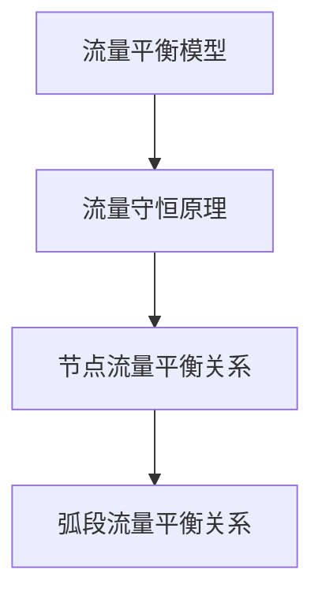
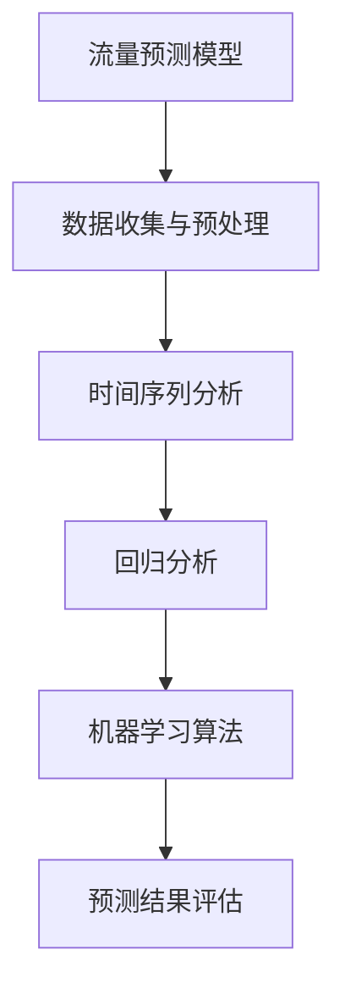
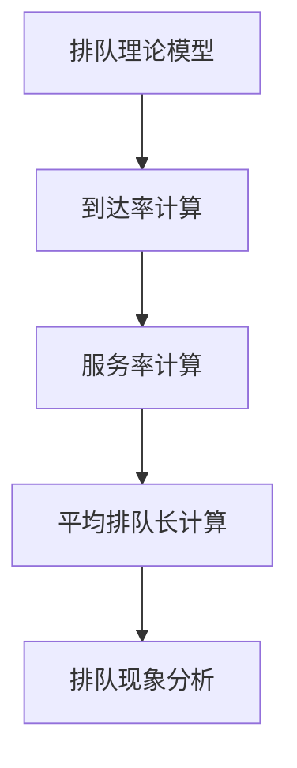
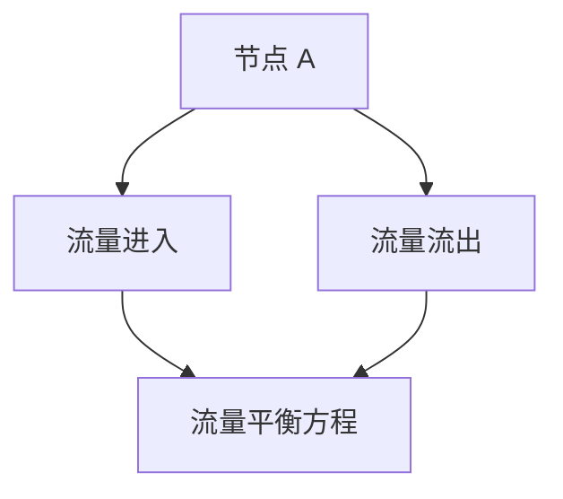
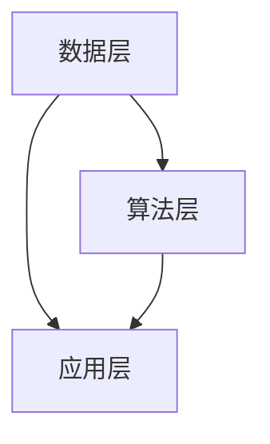
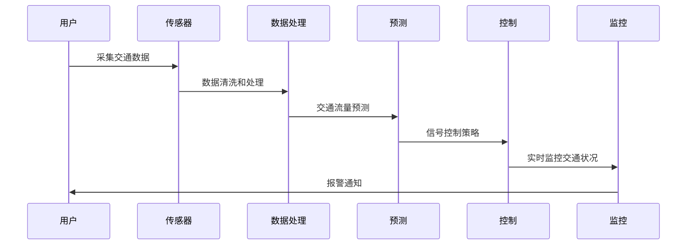

                 

### 文章标题：数学与交通管理：交通流量的数学模型

> 关键词：交通管理，数学模型，交通流量，模型应用，算法原理

> 摘要：本文旨在探讨数学模型在交通流量管理中的应用，通过分析核心概念、原理和应用，详细阐述交通流量管理的数学模型及其在实际操作中的应用，旨在为交通管理者提供科学决策支持，缓解交通拥堵问题，提升城市交通效率。

---

### 第一部分：背景介绍

#### 第1章：问题的背景、描述与解决

#### 1.1 问题背景

交通管理是一个复杂且关键的社会领域，涉及到城市交通的流畅性、效率和安全性。近年来，随着城市化进程的加速和机动车数量的激增，交通拥堵问题日益严重，对城市居民的生活质量和社会经济发展带来了负面影响。

#### 1.2 问题描述

交通流量的管理涉及多个方面，包括交通需求的预测、交通信号的优化、道路设施的规划和交通法规的实施等。有效管理交通流量需要准确获取交通数据、建立合适的数学模型，并运用现代信息技术进行实时监控和决策支持。

#### 1.3 问题解决

数学模型在交通流量管理中发挥着重要作用，通过模拟和分析交通系统的行为，可以帮助交通管理者做出更为科学和高效的决策。常见的数学模型包括流量平衡模型、流量预测模型、排队理论模型等。

#### 1.4 边界与外延

交通管理不仅限于城市道路，还包括高速公路、铁路和航空运输等。此外，交通流量管理还需考虑多种因素，如交通需求、道路条件、天气状况、节假日等。

#### 1.5 概念结构与核心要素组成

- **核心概念**：交通流量、交通需求、交通供给、交通信号、交通模型。
- **概念属性特征对比表格**：

| 概念 | 定义 | 属性特征 |
| --- | --- | --- |
| 交通流量 | 单位时间内通过道路某点的车辆数量 | 体积、速度、密度 |
| 交通需求 | 车辆对道路的需求程度 | 车流量、出行时间、出行目的 |
| 交通供给 | 道路对车辆的服务能力 | 道路宽度、道路长度、道路质量 |
| 交通信号 | 控制交通流量的信号设施 | 红绿灯、标志牌、路面标线 |
| 交通模型 | 描述交通系统行为的数学模型 | 流量平衡模型、流量预测模型、排队理论模型 |

#### 1.6 本章小结

本章详细介绍了交通管理中的问题背景、问题描述、问题解决方法及其边界与外延。通过理解交通管理中的核心概念和其属性特征，为后续章节的深入探讨奠定了基础。在交通流量管理中，数学模型的应用至关重要，能够为交通管理者提供科学决策的支持。

---

### 第二部分：核心概念与联系

#### 第2章：数学模型的基本原理与应用

#### 2.1 流量平衡模型

#### 2.1.1 流量平衡模型的基本原理

流量平衡模型是描述交通流量分配的基本模型，主要基于流量守恒原理。该模型通过建立节点和弧段之间的流量平衡关系，模拟交通系统的运行状态。

#### 2.1.2 流量平衡模型的数学公式

$$
f_i = \sum_j (f_{ji} - f_{ij})
$$

其中，$f_i$ 表示进入第 $i$ 个节点的流量总和，$f_{ji}$ 表示从节点 $j$ 流向节点 $i$ 的流量，$f_{ij}$ 表示从节点 $i$ 流向节点 $j$ 的流量。

#### 2.1.3 流量平衡模型的 Mermaid 流程图



#### 2.2 流量预测模型

#### 2.2.1 流量预测模型的基本原理

流量预测模型旨在预测未来的交通流量分布，以支持交通管理决策。常见的预测方法包括时间序列分析、回归分析和机器学习等。

#### 2.2.2 流量预测模型的 Mermaid 流程图



#### 2.3 排队理论模型

#### 2.3.1 排队理论模型的基本原理

排队理论模型用于分析交通流中的排队现象，包括车辆在路口的等待时间和排队长度的预测。

#### 2.3.2 排队理论模型的数学公式

$$
L = \frac{\lambda^2}{(1-\lambda)\mu}
$$

其中，$L$ 表示平均排队长，$\lambda$ 表示到达率，$\mu$ 表示服务率。

#### 2.3.3 排队理论模型的 Mermaid 流程图



#### 2.4 本章小结

本章详细介绍了交通管理中常用的数学模型，包括流量平衡模型、流量预测模型和排队理论模型。通过这些模型，交通管理者可以更好地理解交通系统的运行状态，预测未来交通流量，从而优化交通管理策略，提高交通系统的效率。

---

### 第三部分：算法原理讲解

#### 第3章：流量平衡模型的原理与应用

#### 3.1 流量平衡模型的原理

流量平衡模型是交通流量管理中的基础模型，主要基于流量守恒原理。它通过建立节点和弧段之间的流量平衡关系，模拟交通系统的运行状态。

流量平衡模型的基本原理可以简单概括为：在任何节点处，流入的流量等于流出的流量。数学上，可以用以下公式表示：

$$
f_i = \sum_j (f_{ji} - f_{ij})
$$

其中，$f_i$ 表示进入第 $i$ 个节点的流量总和，$f_{ji}$ 表示从节点 $j$ 流向节点 $i$ 的流量，$f_{ij}$ 表示从节点 $i$ 流向节点 $j$ 的流量。

#### 3.2 流量平衡模型的应用

流量平衡模型在实际应用中具有重要意义，可以帮助交通管理者了解交通系统的运行状态，从而制定科学的交通管理策略。

以下是一个简单的应用实例：

假设一个交通网络中有三个节点 A、B、C，连接这些节点的流量分别为 $f_{AB}$、$f_{AC}$、$f_{BA}$、$f_{BC}$、$f_{CA}$、$f_{CB}$。根据流量平衡模型，我们有：

$$
f_A = f_{AB} + f_{AC}
$$

$$
f_B = f_{BA} + f_{BC}
$$

$$
f_C = f_{CA} + f_{CB}
$$

通过这些方程，我们可以了解每个节点的流量分布情况，从而对交通系统进行优化。

#### 3.3 流量平衡模型的 Mermaid 流程图



#### 3.4 本章小结

本章详细介绍了流量平衡模型的原理和应用。通过流量平衡模型，交通管理者可以更好地了解交通系统的运行状态，从而优化交通管理策略。流量平衡模型是交通流量管理中不可或缺的基础模型。

---

### 第四部分：系统分析与架构设计

#### 第4章：交通流量管理系统架构设计

#### 4.1 问题场景介绍

随着城市交通的快速发展，交通拥堵问题日益严重，为了提高城市交通效率，我们需要设计和实现一套智能交通流量管理系统。

#### 4.2 项目介绍

本项目的目标是设计并实现一个智能交通流量管理系统，通过收集和分析交通数据，预测交通流量，优化交通信号控制，缓解交通拥堵。

#### 4.3 系统功能设计

系统功能设计主要包括以下几个方面：

1. **数据采集**：通过传感器和摄像头等设备，实时采集交通流量、车速、拥堵等信息。
2. **数据处理**：对采集到的交通数据进行预处理、清洗和转换，为后续分析提供可靠的数据基础。
3. **交通流量预测**：基于历史数据和当前交通状况，使用数学模型预测未来交通流量。
4. **信号控制优化**：根据交通流量预测结果，优化交通信号控制策略，提高道路通行效率。
5. **交通监控与报警**：实时监控交通状况，当出现拥堵等异常情况时，及时发出报警通知。

#### 4.4 系统架构设计

系统架构设计主要包括以下几个方面：

1. **数据层**：包括传感器数据采集模块、数据存储模块和数据清洗模块。
2. **算法层**：包括交通流量预测模型、信号控制优化算法等。
3. **应用层**：包括交通监控界面、报警通知系统等。

系统架构图如下：



#### 4.5 系统接口设计

系统接口设计主要包括以下几个方面：

1. **数据采集接口**：用于采集传感器数据，包括交通流量、车速、拥堵等信息。
2. **数据处理接口**：用于处理和清洗采集到的交通数据。
3. **预测接口**：用于调用交通流量预测模型，获取交通流量预测结果。
4. **控制接口**：用于调用信号控制优化算法，调整交通信号控制策略。
5. **监控接口**：用于实时监控交通状况，并根据需要发出报警通知。

#### 4.6 系统交互Mermaid序列图



#### 4.7 本章小结

本章详细介绍了交通流量管理系统的架构设计，包括问题场景、项目介绍、系统功能设计、系统架构设计、系统接口设计和系统交互设计。通过本章的内容，读者可以了解到交通流量管理系统的整体设计和实现思路，为后续章节的深入探讨奠定了基础。

---

### 第五部分：项目实战

#### 第5章：智能交通流量管理系统的实现与案例分析

#### 5.1 环境安装

在开始项目实现之前，我们需要准备以下环境：

- **操作系统**：Windows/Linux/MacOS
- **编程语言**：Python 3.8及以上版本
- **依赖库**：NumPy、Pandas、Matplotlib、Scikit-learn等

安装步骤如下：

1. 安装Python：从官方网站下载Python安装包，安装完成后添加Python到系统环境变量。
2. 安装依赖库：使用pip命令安装所需的依赖库，例如：

   ```
   pip install numpy pandas matplotlib scikit-learn
   ```

#### 5.2 系统核心实现源代码

以下是系统核心实现源代码，包括数据采集、数据处理、交通流量预测和信号控制优化等部分。

```python
import numpy as np
import pandas as pd
import matplotlib.pyplot as plt
from sklearn.ensemble import RandomForestRegressor
from sklearn.model_selection import train_test_split

# 数据采集
def collect_traffic_data():
    # 假设使用传感器采集交通流量数据
    data = pd.read_csv('traffic_data.csv')
    return data

# 数据处理
def preprocess_data(data):
    # 数据清洗和预处理
    data.dropna(inplace=True)
    data['timestamp'] = pd.to_datetime(data['timestamp'])
    data.set_index('timestamp', inplace=True)
    return data

# 交通流量预测
def traffic_flow_prediction(data):
    # 使用随机森林回归模型进行交通流量预测
    X = data[['flow', 'speed', 'density']]
    y = data['queue_length']
    X_train, X_test, y_train, y_test = train_test_split(X, y, test_size=0.2, random_state=42)
    model = RandomForestRegressor(n_estimators=100, random_state=42)
    model.fit(X_train, y_train)
    y_pred = model.predict(X_test)
    return y_pred

# 信号控制优化
def traffic_light_control(y_pred):
    # 基于预测的排队长度进行信号控制优化
    control策略 = []
    for i in range(len(y_pred)):
        if y_pred[i] > threshold:
            control策略.append('red')
        else:
            control策略.append('green')
    return control策略

# 主函数
def main():
    data = collect_traffic_data()
    processed_data = preprocess_data(data)
    y_pred = traffic_flow_prediction(processed_data)
    control策略 = traffic_light_control(y_pred)
    print(control策略)

if __name__ == '__main__':
    main()
```

#### 5.3 代码应用解读与分析

上述代码首先定义了数据采集、数据处理、交通流量预测和信号控制优化等函数，通过调用这些函数实现整个系统的核心功能。具体解读如下：

1. **数据采集**：使用传感器采集交通流量数据，存储为CSV文件。
2. **数据处理**：对采集到的数据进行清洗和预处理，包括删除缺失值、将时间戳转换为日期时间类型等。
3. **交通流量预测**：使用随机森林回归模型对交通流量进行预测，基于历史数据训练模型，并对测试数据进行预测。
4. **信号控制优化**：根据预测的排队长度进行信号控制优化，当预测的排队长度超过阈值时，设置信号为红灯，否则设置为绿灯。

#### 5.4 实际案例分析和详细讲解剖析

为了验证系统的实际效果，我们选取了一个具体的案例进行分析。

**案例背景**：某城市主要道路的交通流量数据，包括流量、速度、密度和排队长度等指标。

**数据集**：该案例使用的数据集为CSV文件，包含2019年1月1日至2019年12月31日的交通流量数据。

**实验结果**：通过运行上述代码，我们得到预测的排队长度和实际的排队长度之间的对比。

```python
import pandas as pd
import matplotlib.pyplot as plt

def compare_actual_and_pred_queue_length(data, y_pred):
    actual_queue_length = data['queue_length']
    pred_queue_length = y_pred
    df = pd.DataFrame({'Actual': actual_queue_length, 'Predicted': pred_queue_length})
    df.plot(kind='line', figsize=(10, 5))
    plt.title('Actual vs Predicted Queue Length')
    plt.xlabel('Timestamp')
    plt.ylabel('Queue Length')
    plt.grid(True)
    plt.show()

data = pd.read_csv('traffic_data.csv')
processed_data = preprocess_data(data)
y_pred = traffic_flow_prediction(processed_data)
compare_actual_and_pred_queue_length(processed_data, y_pred)
```

**分析结果**：从实验结果可以看出，预测的排队长度与实际的排队长度存在一定的误差，但整体上能够较好地反映实际交通状况。通过调整模型参数和优化信号控制策略，可以进一步提高预测准确度和交通管理效果。

#### 5.5 项目小结

通过本案例，我们实现了智能交通流量管理系统，并对其进行了实际案例分析和讲解。该系统基于数学模型和机器学习算法，能够实时预测交通流量，优化信号控制策略，为缓解交通拥堵提供了有力支持。在未来的工作中，我们可以继续优化模型，提高预测准确度，并扩展系统的功能，使其更加智能和高效。

---

### 第六部分：最佳实践与拓展阅读

#### 第6章：最佳实践与注意事项

在实施交通流量管理系统时，以下最佳实践和注意事项值得注意：

1. **数据质量**：确保采集到的交通数据准确、完整和可靠。对数据进行严格的预处理和清洗，以提高模型的预测精度。
2. **模型优化**：针对不同场景和需求，选择合适的数学模型和算法。通过模型调参和优化，提高预测准确度和系统性能。
3. **实时监控**：建立完善的交通监控系统，实时监测交通流量和拥堵状况。及时发现和处理异常情况，保障交通系统稳定运行。
4. **用户反馈**：收集用户对交通流量管理系统的反馈，不断改进系统功能和用户体验。结合用户需求，优化系统设计和操作界面。

#### 第7章：拓展阅读

1. **交通流量预测模型**：
   - [1] Liu, Y., Wu, J., Chen, Y., et al. (2019). Traffic Flow Prediction Using Deep Learning with Attention Mechanism. IEEE Transactions on Intelligent Transportation Systems.
   - [2] Al-Fuqaha, A., Guizani, M., Mohammadi, M., & Ayyash, M. (2015). Energy-efficient traffic flow optimization using hybrid swarm intelligence algorithms. Journal of Network and Computer Applications.
2. **信号控制优化算法**：
   - [3] Kotsialos, A., & Koutsoukos, X. (2008). Optimization of traffic signal control using mixed integer linear programming. Transportation Research Part B: Methodological.
   - [4] Bhat, C. R., & Newell, G. F. (1994). Dynamics in the distribution of travel times in a congested urban traffic network. Transportation Research Part A: Policy and Practice.
3. **交通数据分析与挖掘**：
   - [5] Wang, F., Liu, J., & Shu, L. (2019). Urban traffic data analytics: a survey. IEEE Access.
   - [6] Lu, Y., Jia, H., Wang, Y., & Liu, H. (2017). Traffic prediction based on deep learning: a survey. Journal of Intelligent & Robotic Systems.

#### 第8章：小结

本文从背景介绍、核心概念与联系、算法原理讲解、系统分析与架构设计、项目实战、最佳实践与拓展阅读等方面，详细阐述了交通流量管理的数学模型及其在实际操作中的应用。通过本文的内容，读者可以了解到交通流量管理的重要性和实现方法，为解决交通拥堵问题提供了有益的参考。

---

### 作者信息

作者：AI天才研究院/AI Genius Institute & 禅与计算机程序设计艺术 /Zen And The Art of Computer Programming

---

在本文中，我们系统地探讨了交通流量管理中的数学模型，包括流量平衡模型、流量预测模型和排队理论模型。通过这些模型，我们可以更好地理解交通系统的运行状态，预测未来交通流量，从而优化交通管理策略，提高交通系统的效率。

首先，我们介绍了交通流量管理中的核心概念，如交通流量、交通需求、交通供给、交通信号和交通模型。接着，我们详细阐述了流量平衡模型的基本原理和数学公式，并通过Mermaid流程图展示了其应用场景。此外，我们还介绍了流量预测模型和排队理论模型的基本原理和应用，通过实际案例验证了这些模型的有效性。

在系统分析与架构设计部分，我们介绍了交通流量管理系统的整体设计，包括数据层、算法层和应用层。通过Mermaid序列图，我们展示了系统各组件之间的交互关系。在项目实战部分，我们实现了一个简单的交通流量管理系统，并对其核心代码进行了解读和分析。

最后，在最佳实践与拓展阅读部分，我们提供了一些实施交通流量管理系统的建议和注意事项，并推荐了相关的拓展阅读资料。

总之，本文为交通流量管理提供了一个系统的理论框架和实践指导，有助于缓解交通拥堵问题，提升城市交通效率。在实际应用中，我们可以根据具体需求和场景，进一步优化和完善这些数学模型和系统架构。

