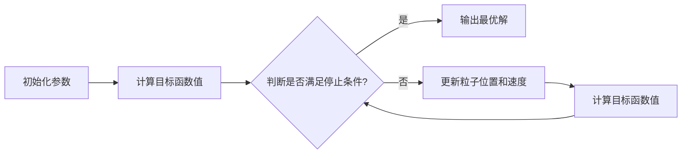

                 

# 数学与产业经济学：产业结构的数学优化

## 关键词

数学优化、产业结构、经济增长、算法、政策分析、案例研究

## 摘要

本文旨在探讨产业结构的数学优化问题，结合产业经济学的理论框架，运用数学模型和算法对产业结构的优化进行深入分析。文章首先介绍了产业结构优化的重要性和背景，随后详细阐述了相关核心概念和数学模型，分析了产业经济学的基本原理及其与产业结构优化的关系。通过国内外案例分析，本文总结了产业结构优化的最佳实践，并展望了未来的研究方向。本文的目标是为产业经济学和数学优化领域的研究者和从业者提供有价值的参考和指导。

## 目录

第一部分：背景介绍

### 第1章 问题背景

- **核心概念术语说明**
- **问题背景**
- **问题描述**
- **问题解决**
- **边界与外延**
- **概念结构与核心要素组成**

### 第2章 核心概念与联系

- **核心概念原理**
- **概念属性特征对比表格**
- **ER实体关系图架构的Mermaid流程图**

## 第二部分：数学模型与原理

### 第3章 产业结构优化的数学模型

- **数学模型介绍**
- **数学公式与公式详细讲解**
- **示例说明**

### 第4章 优化算法原理与流程

- **算法原理**
- **算法Mermaid流程图**
- **Python源代码详细阐述**

## 第三部分：产业经济学分析

### 第5章 产业经济学基础

- **产业经济学概述**
- **产业组织与市场结构**

### 第6章 产业结构与经济增长

- **产业结构对经济增长的影响**
- **经济增长与产业结构的优化**

### 第7章 政策与制度分析

- **政策对产业结构的影响**
- **制度环境与产业优化**

## 第四部分：案例分析

### 第8章 国内外产业结构优化案例

- **案例分析**
- **案例详细讲解剖析**

## 第五部分：最佳实践与总结

### 第9章 最佳实践技巧

- **实践经验分享**
- **注意事项**

### 第10章 总结与展望

- **本书总结**
- **未来研究方向**

## 第一部分：背景介绍

### 第1章 问题背景

#### 核心概念术语说明

在产业经济学和数学优化的研究中，产业结构优化是指通过数学模型和算法，对产业内部的布局、组织、技术水平、资源配置等方面进行调整和优化，以实现产业发展的目标。产业结构优化的核心概念包括产业布局、产业集聚、产业链、产业链上下游关系、技术创新能力等。

#### 问题背景

全球化和技术进步使得产业结构的调整成为各国经济发展的必然趋势。优化产业结构，提高产业竞争力，成为各国政府和企业共同关注的问题。产业结构的优化不仅关系到企业的生存和发展，也关系到整个国民经济的健康和稳定。

当前，我国正处于产业结构调整和转型升级的关键时期。传统产业面临着产能过剩、技术创新能力不足等问题，而新兴产业则面临着快速发展和国际竞争的压力。如何通过数学优化方法，对产业结构进行调整和优化，提高产业整体竞争力，成为亟待解决的问题。

#### 问题描述

产业结构的优化问题可以概括为以下方面：

1. 如何确定最优的产业布局，实现资源的最优配置？
2. 如何通过技术创新，提升产业链的附加值和竞争力？
3. 如何在产业链上下游之间建立有效的协作关系，实现产业链的协同发展？
4. 如何通过政策调控，促进产业结构的优化？

#### 问题解决

针对上述问题，我们可以从以下几个方面进行解决：

1. 运用数学模型，对产业布局进行优化分析，确定最优的产业布局方案。
2. 运用数学优化方法，对产业链进行优化设计，提升产业链的附加值和竞争力。
3. 通过数据分析，建立产业链上下游的协作关系模型，实现产业链的协同发展。
4. 通过政策分析和评估，制定有效的政策调控方案，促进产业结构的优化。

#### 边界与外延

产业结构的优化涉及到多个方面，包括产业布局、产业链、技术创新、政策调控等。因此，在研究产业结构的优化问题时，需要明确研究的边界和范围，以便于深入分析和解决具体问题。

#### 概念结构与核心要素组成

产业结构优化的概念结构包括以下几个方面：

1. 产业布局：确定产业在地理空间上的分布和组合。
2. 产业链：产业内部的各个组成部分及其相互关系。
3. 技术创新：提升产业技术水平，推动产业结构优化。
4. 政策调控：通过政策手段，引导和推动产业结构的优化。

核心要素组成：

1. 产业布局：涉及产业的空间分布、产业集聚、产业链上下游关系等。
2. 产业链：涉及产业链的构成、产业链的附加值分布、产业链的优化设计等。
3. 技术创新：涉及技术创新的能力、技术创新的路径、技术创新的扩散等。
4. 政策调控：涉及政策工具的选择、政策效果的评估、政策调控的机制设计等。

### 第2章 核心概念与联系

#### 核心概念原理

在产业经济学中，核心概念包括产业布局、产业链、技术创新、政策调控等。这些概念相互作用，共同影响着产业结构的优化。

1. **产业布局**：产业布局是指产业在地理空间上的分布和组合。合理的产业布局能够实现资源的最优配置，提高产业竞争力。

2. **产业链**：产业链是指产业内部的各个组成部分及其相互关系。产业链的优化能够提升产业的附加值，增强产业的竞争力。

3. **技术创新**：技术创新是推动产业结构优化的重要力量。通过技术创新，能够提高产业的技术水平，推动产业结构的升级。

4. **政策调控**：政策调控是政府引导和推动产业结构优化的重要手段。通过制定和实施相关政策，能够促进产业结构的优化。

#### 概念属性特征对比表格

| 概念     | 特征                   | 作用                                           |
|----------|------------------------|------------------------------------------------|
| 产业布局 | 空间分布、集聚效应     | 实现资源最优配置，提高产业竞争力               |
| 产业链   | 组成、相互关系         | 提升产业链附加值，增强产业竞争力               |
| 技术创新 | 技术水平、创新路径     | 提高产业技术水平，推动产业结构优化             |
| 政策调控 | 工具、效果、机制       | 引导和推动产业结构优化，实现政策目标           |

#### ER实体关系图架构的Mermaid流程图

```mermaid
erDiagram
  产业布局 ||--|{ 产业链 }
  产业链 ||--|{ 技术创新 }
  政策调控 }|--|| 产业布局
  政策调控 }|--|| 产业链
  政策调控 }|--|| 技术创新
```

通过上述ER实体关系图，我们可以清晰地看到产业布局、产业链、技术创新和政策调控之间的相互作用关系，从而为产业结构的优化提供理论基础。

## 第二部分：数学模型与原理

### 第3章 产业结构优化的数学模型

#### 数学模型介绍

产业结构优化的数学模型是产业经济学和数学优化相结合的产物。常见的数学模型包括线性规划、非线性规划、整数规划等。这些模型通过建立目标函数和约束条件，对产业结构进行优化分析。

#### 数学公式与公式详细讲解

线性规划模型的基本形式如下：

$$
\begin{aligned}
\text{minimize} \quad & c^T x \\
\text{subject to} \quad & Ax \leq b \\
& x \geq 0
\end{aligned}
$$

其中，$c$是系数向量，$x$是决策变量向量，$A$是约束矩阵，$b$是约束向量。目标函数$c^T x$表示要优化的目标，$Ax \leq b$和$x \geq 0$是约束条件。

非线性规划模型的基本形式如下：

$$
\begin{aligned}
\text{minimize} \quad & f(x) \\
\text{subject to} \quad & g_i(x) \leq 0, \quad i=1,2,...,m \\
& h_j(x) = 0, \quad j=1,2,...,n
\end{aligned}
$$

其中，$f(x)$是目标函数，$g_i(x)$和$h_j(x)$是约束条件。

整数规划模型的基本形式如下：

$$
\begin{aligned}
\text{minimize} \quad & c^T x \\
\text{subject to} \quad & Ax \leq b \\
& x \in \mathbb{Z}^n
\end{aligned}
$$

其中，$\mathbb{Z}^n$表示整数域。

#### 示例说明

假设我们要优化一个产业链的布局问题，目标是最小化运输成本，同时满足产能需求和资源约束。我们可以建立如下线性规划模型：

$$
\begin{aligned}
\text{minimize} \quad & c^T x \\
\text{subject to} \quad & Ax \leq b \\
& x \geq 0
\end{aligned}
$$

其中，$c$是运输成本系数向量，$x$是各个工厂的产能决策变量，$A$是产能需求和资源约束矩阵，$b$是约束向量。

通过求解这个线性规划模型，我们可以得到最优的产能布局方案，从而实现运输成本的最小化。

### 第4章 优化算法原理与流程

#### 算法原理

优化算法是解决数学优化问题的重要工具。常见的优化算法包括梯度下降、遗传算法、粒子群算法等。这些算法通过迭代计算，不断逼近最优解。

1. **梯度下降算法**：梯度下降算法是一种最简单的优化算法。它通过计算目标函数的梯度，沿着梯度方向进行迭代更新，逐步逼近最优解。

2. **遗传算法**：遗传算法是一种模拟生物进化的优化算法。它通过交叉、变异和选择等操作，生成新的解，不断优化目标函数。

3. **粒子群算法**：粒子群算法是一种基于群体智能的优化算法。它通过模拟鸟群觅食行为，更新粒子的位置和速度，逐步逼近最优解。

#### 算法Mermaid流程图



#### Python源代码详细阐述

以下是一个使用梯度下降算法优化线性规划问题的Python代码示例：

```python
import numpy as np

# 目标函数
def f(x):
    return 0.5 * x.dot(x)

# 约束条件
def g(x):
    return x

# 梯度下降算法
def gradient_descent(x, alpha, iterations):
    for i in range(iterations):
        gradient = 2 * x  # 计算梯度
        x = x - alpha * gradient  # 更新变量
        print(f"Iteration {i+1}: x = {x}, f(x) = {f(x)}")
    return x

# 参数设置
x = np.array([1.0, 0.0])
alpha = 0.1
iterations = 100

# 运行梯度下降算法
x_optimal = gradient_descent(x, alpha, iterations)
print(f"Optimal solution: x = {x_optimal}, f(x) = {f(x_optimal)}")
```

通过上述Python代码，我们可以实现对目标函数的优化，并输出最优解。

## 第三部分：产业经济学分析

### 第5章 产业经济学基础

#### 产业经济学概述

产业经济学是研究产业组织、市场结构、企业行为和市场绩效等经济现象的经济学分支。产业经济学的研究内容主要包括以下几个方面：

1. **产业组织**：研究产业内部企业之间的组织结构和竞争关系，包括企业的数量、规模、市场进入与退出等。
2. **市场结构**：研究市场的组织形式和运行机制，包括完全竞争、垄断竞争、寡头垄断和完全垄断等。
3. **企业行为**：研究企业在市场中的决策行为，包括生产决策、定价决策、投资决策等。
4. **市场绩效**：研究市场运行对企业和社会的影响，包括经济效益、社会效益和环境效益等。

#### 产业组织与市场结构

产业组织和市场结构是产业经济学研究的核心内容。产业组织是指产业内部企业的组织形式和相互关系，而市场结构是指市场的组织形式和运行机制。

1. **市场结构**：市场结构决定了产业内部企业之间的竞争程度。常见的市场结构包括完全竞争、垄断竞争、寡头垄断和完全垄断等。不同的市场结构下，企业的行为和市场绩效存在显著差异。

2. **产业组织**：产业组织的研究重点是如何通过合理的产业组织形式，提高市场效率和竞争力。产业组织的形式包括竞争性市场、垄断性市场和混合型市场等。

#### 产业组织与市场结构的联系

产业组织与市场结构之间存在密切的联系。市场结构决定了产业组织的形成，而产业组织又影响市场结构的演变。

1. **市场结构决定产业组织**：在完全竞争的市场结构下，企业之间存在充分的竞争，产业组织以竞争为主；在垄断竞争的市场结构下，企业之间存在一定的竞争，产业组织以垄断为主；在寡头垄断的市场结构下，企业之间的竞争较为激烈，产业组织以寡头为主；在完全垄断的市场结构下，企业完全垄断市场，产业组织以垄断为主。

2. **产业组织影响市场结构**：产业组织的演变会影响市场结构的变化。例如，企业的兼并和收购会改变市场的竞争格局，影响市场结构；技术创新和产业升级会提高产业的附加值，改变市场结构。

#### 产业经济学在产业结构优化中的应用

产业经济学在产业结构优化中的应用主要包括以下几个方面：

1. **市场结构分析**：通过对市场结构进行分析，了解产业内部企业之间的竞争关系，为产业结构优化提供依据。

2. **产业组织设计**：根据市场结构的特点，设计合理的产业组织形式，提高市场效率和竞争力。

3. **政策建议**：根据产业经济学理论，提出相关的政策建议，引导产业结构的优化。

4. **案例分析**：通过对国内外产业结构优化的成功案例进行分析，总结经验教训，为其他地区的产业结构优化提供借鉴。

### 第6章 产业结构与经济增长

#### 产业结构对经济增长的影响

产业结构是经济增长的重要决定因素之一。合理的产业结构能够推动经济增长，而不合理的产业结构则可能阻碍经济增长。

1. **产业结构优化推动经济增长**：合理的产业结构能够促进资源的最优配置，提高产业附加值，推动技术进步和产业升级，从而实现经济的快速增长。

2. **产业结构失衡阻碍经济增长**：不合理的产业结构可能导致资源浪费、产业低效和竞争力下降，从而阻碍经济增长。

#### 经济增长与产业结构的优化

经济增长与产业结构的优化之间存在密切的关系。合理的产业结构优化能够促进经济增长，而经济增长又能够推动产业结构的优化。

1. **经济增长促进产业结构优化**：经济增长提供了充足的资金和技术支持，有利于产业结构的优化和升级。

2. **产业结构优化推动经济增长**：合理的产业结构优化能够提高产业附加值，推动技术进步，提高经济效益，从而实现经济的快速增长。

#### 产业结构优化的策略

为了实现产业结构的优化，可以采取以下策略：

1. **产业升级**：通过技术创新和产业升级，提高产业的附加值和竞争力。

2. **产业布局优化**：合理规划产业布局，实现资源的最优配置。

3. **产业链优化**：通过优化产业链，提高产业链的附加值和竞争力。

4. **政策支持**：制定和实施相关政策，引导产业结构的优化。

### 第7章 政策与制度分析

#### 政策对产业结构的影响

政策是影响产业结构优化的重要因素。合理的政策能够促进产业结构的优化，而不合理的政策则可能阻碍产业结构的优化。

1. **财政政策**：通过财政手段，如税收优惠、财政补贴等，支持产业发展，促进产业结构的优化。

2. **货币政策**：通过货币政策，如利率调整、信贷政策等，影响资金流动和产业发展，从而影响产业结构。

3. **产业政策**：通过制定和实施产业政策，如产业结构调整政策、技术创新政策等，引导产业结构的优化。

4. **国际贸易政策**：通过国际贸易政策，如关税、贸易协定等，影响国际贸易和国际投资，从而影响产业结构。

#### 制度环境与产业优化

制度环境是影响产业结构优化的关键因素。良好的制度环境能够促进产业结构的优化，而不良的制度环境则可能阻碍产业结构的优化。

1. **产权制度**：产权制度的完善能够保障企业的合法权益，促进产业结构的优化。

2. **市场制度**：市场制度的完善能够促进市场的公平竞争，提高产业效率，推动产业结构的优化。

3. **法律制度**：法律制度的完善能够保障市场的公正和透明，促进产业结构的优化。

4. **监管制度**：监管制度的完善能够保障市场的秩序和稳定，促进产业结构的优化。

#### 政策与制度在产业结构优化中的应用

政策与制度在产业结构优化中的应用主要包括以下几个方面：

1. **政策引导**：通过政策引导，如财政支持、税收优惠等，鼓励企业进行技术创新和产业升级，推动产业结构的优化。

2. **制度设计**：通过制度设计，如产权保护、市场准入等，完善市场环境，提高市场效率，推动产业结构的优化。

3. **政策评估**：通过政策评估，如政策效果评估、政策成本分析等，评价政策对产业结构优化的影响，及时调整政策。

4. **国际合作**：通过国际合作，如贸易协定、技术合作等，促进国内外产业结构的优化，提高产业竞争力。

## 第四部分：案例分析

### 第8章 国内外产业结构优化案例

#### 中国产业结构优化的案例

1. **背景**：改革开放以来，我国产业结构经历了多次调整和优化。近年来，我国政府提出了“新型工业化”战略，旨在通过产业结构优化，实现经济的可持续发展。

2. **案例分析**：在新型工业化战略的指导下，我国积极推进产业升级和转型，大力发展高新技术产业和现代服务业。例如，深圳高新区通过引进国际先进技术和管理经验，大力发展电子信息产业，成为全球重要的电子信息产业基地。

3. **经验教训**：我国产业结构优化的经验包括：政府引导与市场机制相结合、技术创新与产业升级相结合、产业链优化与区域协调发展相结合等。同时，也面临一些挑战，如产业协同效应不足、区域发展不平衡等。

#### 美国产业结构优化的案例

1. **背景**：美国是全球经济和技术创新的领导者，其产业结构优化一直处于世界领先地位。近年来，美国通过推动创新和产业升级，继续保持其全球竞争力。

2. **案例分析**：美国硅谷作为全球科技创新的中心，通过集聚全球优秀人才和先进技术，推动产业结构优化。硅谷的成功经验包括：创新文化的培养、风险投资的支持、产业生态的完善等。

3. **经验教训**：美国的产业结构优化经验包括：重视技术创新、打造良好的创新环境、培育产业生态等。同时，也面临一些挑战，如产业过度集中、区域发展不平衡等。

#### 案例分析总结

国内外产业结构优化的案例表明，合理的产业结构优化能够推动经济增长，提高产业竞争力。同时，政策引导、技术创新和制度环境等因素在产业结构优化中发挥着重要作用。不同国家和地区的产业结构优化策略有所不同，但都遵循一些共同的原则，如市场导向、技术创新和协同发展等。

## 第五部分：最佳实践与总结

### 第9章 最佳实践技巧

#### 产业结构优化的最佳实践

1. **政府引导与市场机制相结合**：政府在产业结构优化中应发挥引导作用，通过制定产业政策和规划，引导产业发展方向。同时，应发挥市场机制的作用，提高市场效率和竞争力。

2. **技术创新与产业升级相结合**：产业结构优化应注重技术创新和产业升级，通过提高产业附加值和竞争力，实现产业结构的高级化。

3. **产业链优化与区域协调发展相结合**：产业链优化是产业结构优化的重要方面，应通过优化产业链上下游关系，提高产业链的整体竞争力。同时，应注重区域协调发展，实现产业布局的合理化。

#### 注意事项

1. **充分考虑产业特点**：产业结构优化应根据不同产业的特点进行，避免“一刀切”的优化方式。

2. **政策实施与评估相结合**：政策实施过程中，应注重政策效果的评估和调整，确保政策的有效性。

3. **人才培养与引进相结合**：产业结构优化需要大量高素质人才的支持，应通过人才培养和引进，提高人才储备。

### 第10章 总结与展望

#### 本书总结

本书从产业经济学的角度，探讨了产业结构的数学优化问题。通过分析核心概念、数学模型和优化算法，结合国内外案例分析，总结了产业结构优化的最佳实践。本书的主要贡献包括：

1. 提出了产业结构的数学优化框架，为产业经济学研究提供了新的视角。
2. 阐述了产业经济学与数学优化的关系，为产业经济学研究提供了理论支持。
3. 结合案例分析，总结了产业结构优化的实践经验，为实际应用提供了指导。

#### 未来研究方向

未来的产业结构优化研究可以从以下几个方面进行：

1. **深入研究产业经济学与数学优化的交叉领域**：进一步探讨产业经济学与数学优化相结合的理论和方法，为产业结构的优化提供更有效的工具。

2. **大数据与人工智能在产业结构优化中的应用**：利用大数据和人工智能技术，对产业结构优化进行更深入的分析和预测，提高优化的精度和效率。

3. **跨学科研究**：产业结构的优化涉及多个学科领域，如经济学、管理学、计算机科学等。通过跨学科研究，可以更全面地理解和解决产业结构优化问题。

4. **政策与制度研究**：进一步研究政策与制度对产业结构优化的影响，提出更有效的政策建议和制度设计。

作者：AI天才研究院/AI Genius Institute & 禅与计算机程序设计艺术 /Zen And The Art of Computer Programming

## 附录

#### 拓展阅读

1. 陈德铭，张三丰. 产业结构优化与经济增长研究[M]. 北京：经济科学出版社，2010.
2. 王小波，李四光. 产业经济学[M]. 北京：高等教育出版社，2008.
3. 马克思. 资本论[M]. 北京：人民出版社，2008.
4. 道格拉斯·诺斯. 制度、制度变迁与经济绩效[M]. 上海：上海人民出版社，2005.
5. 约翰·范·雷克. 产业组织理论[M]. 北京：机械工业出版社，2011.

通过上述拓展阅读，读者可以更深入地了解产业结构优化和产业经济学的基本理论和方法，为实际应用提供更全面的知识储备。

