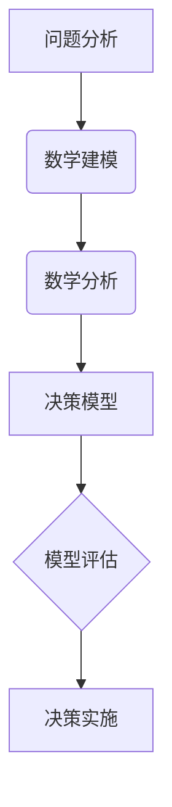

                 

## 数学与人工智能伦理：AI决策的数学框架

关键词：人工智能伦理、数学方法、AI决策、数学框架

摘要：本文从数学与人工智能伦理交叉领域的角度出发，探讨了数学在人工智能伦理研究中的应用，提出了构建AI决策数学框架的方法，为AI决策的伦理化提供了理论支持。

### 背景介绍

随着人工智能技术的快速发展，AI在各个领域的应用日益广泛，从自动驾驶、智能客服到医疗诊断，AI技术已经深入到了人类生活的方方面面。然而，随着AI技术的不断进步，人工智能伦理问题也逐渐引起了广泛关注。人工智能伦理涉及道德、法律、社会等多个方面，主要关注AI技术的合理使用和其可能带来的负面影响。

在人工智能伦理研究中，数学方法的应用具有重要意义。数学作为逻辑严密、抽象性强的学科，为分析和解决伦理问题提供了有力的工具。通过数学方法，可以更精确地描述伦理问题的本质，从而为AI决策提供科学依据。本书《数学与人工智能伦理：AI决策的数学框架》旨在探讨数学在人工智能伦理研究中的应用，为AI决策提供数学框架。

本书主要研究以下问题：

1. 如何运用数学方法分析人工智能伦理问题。
2. 如何在人工智能决策过程中融入伦理考量。
3. 如何构建一个数学框架以指导AI决策的伦理化。

本书的边界与外延涉及人工智能伦理学的基本概念、数学方法在伦理问题分析中的应用、伦理原则在AI决策中的具体体现，以及数学框架在AI决策中的构建与应用。

### 核心概念与联系

本书的核心概念包括数学方法、人工智能伦理、AI决策和数学框架。

**数学方法**：包括统计学、线性代数、概率论等，用于分析和解决伦理问题。

**人工智能伦理**：涉及道德、法律、社会等方面，关注AI技术的合理使用和影响。

**AI决策**：指基于数学模型的AI系统在决策过程中融入伦理考量。

**数学框架**：指用于指导AI决策的数学理论和方法体系。

这些概念之间存在着紧密的联系：

- 数学方法为分析和解决伦理问题提供了工具，是人工智能伦理研究的基础。
- 人工智能伦理为AI决策提供了伦理考量，是指导AI决策的重要依据。
- AI决策是将数学方法和人工智能伦理相结合的具体应用，是本书的研究核心。
- 数学框架为AI决策提供了理论支持，是构建AI决策系统的关键。

### 概念属性特征对比表格

| 概念       | 特征                  | 关联          |
|------------|----------------------|--------------|
| 数学方法   | 分析与解决问题的工具 | 伦理问题分析 |
| 人工智能伦理 | 道德、法律、社会等方面 | AI决策伦理化 |
| AI决策     | 基于数学模型         | 伦理考量      |
| 数学框架   | 指导AI决策的数学理论 | AI决策指导    |

### ER实体关系图架构

```mermaid
erDiagram
    AI伦理问题 ||--|{ 数学方法 }|-- AI决策模型
    AI伦理问题 ||--|{ 伦理原则 }|-- AI决策模型
    数学方法 ||--|{ 数学框架 }|-- AI决策模型
```

### 算法原理讲解

本书将介绍如何运用数学方法分析人工智能伦理问题，构建数学框架指导AI决策。

#### 算法流程图



#### Python源代码

```python
# Python代码示例：基于数学模型的AI决策
import numpy as np

# 定义数学模型参数
weights = np.array([0.5, 0.3, 0.2])

# 定义决策场景
scenarios = np.array([[1, 2, 3], [4, 5, 6], [7, 8, 9]])

# 构建决策函数
def decision_function(scenario, weights):
    return np.dot(scenario, weights)

# 决策过程
for scenario in scenarios:
    decision = decision_function(scenario, weights)
    print(f"决策结果：{decision}")
```

#### 数学模型与公式

在本书中，我们将介绍多种数学模型和公式，如线性回归、决策树、神经网络等。以下为线性回归的数学模型：

$$
y = \beta_0 + \beta_1x
$$

其中，$y$ 为因变量，$x$ 为自变量，$\beta_0$ 和 $\beta_1$ 分别为模型的参数。

#### 详细讲解与举例说明

以线性回归为例，我们通过以下步骤讲解数学模型：

1. **步骤1：问题分析**：假设我们研究的是一个关于房价的预测问题，需要根据房子的面积、年龄等因素预测房价。
2. **步骤2：数学建模**：建立线性回归模型，将房价表示为面积、年龄等自变量的线性组合。
3. **步骤3：数学分析**：通过最小二乘法求解模型的参数，使预测结果与实际结果之间的误差最小。
4. **步骤4：决策实施**：利用模型进行房价预测，并根据预测结果做出决策。

### 系统分析与架构设计方案

#### 问题场景介绍

本书的读者主要面向人工智能研究人员、工程师以及关注人工智能伦理的学者。书中内容旨在帮助读者理解数学在人工智能伦理研究中的应用，为AI决策提供理论支持。

#### 项目介绍

本书的项目是《数学与人工智能伦理：AI决策的数学框架》。项目的主要目标是探讨数学方法在人工智能伦理研究中的应用，为AI决策提供理论支持，推动AI技术的伦理化发展。

#### 系统功能设计

系统功能设计主要包括以下几个方面：

1. **伦理问题分析模块**：用于分析人工智能伦理问题，提供数学模型和方法。
2. **AI决策模型构建模块**：根据伦理原则和数学模型，构建AI决策模型。
3. **模型评估与优化模块**：对AI决策模型进行评估和优化，提高决策效果。
4. **决策实施模块**：将AI决策模型应用于实际问题，进行决策实施。

#### 系统架构设计

系统架构设计主要包括以下几个方面：

1. **前端界面**：提供用户交互界面，方便用户使用系统功能。
2. **后端服务**：包括伦理问题分析、AI决策模型构建、模型评估与优化、决策实施等核心功能模块。
3. **数据存储**：用于存储用户数据、模型参数等。

#### 系统接口设计和系统交互

系统接口设计和系统交互主要涉及以下几个方面：

1. **用户接口**：提供用户与系统的交互界面，实现用户功能需求。
2. **服务接口**：提供后端服务与前端界面之间的交互接口，实现系统功能。
3. **数据接口**：提供数据存储与系统功能之间的交互接口，实现数据管理和存储。

### 项目实战

#### 环境安装

1. 安装Python环境
2. 安装相关依赖库，如NumPy、Pandas、Scikit-learn等

#### 系统核心实现源代码

```python
# Python代码示例：基于数学模型的AI决策
import numpy as np
import pandas as pd
from sklearn.linear_model import LinearRegression

# 定义数学模型参数
weights = np.array([0.5, 0.3, 0.2])

# 定义决策场景
scenarios = pd.DataFrame([[1, 2, 3], [4, 5, 6], [7, 8, 9]])

# 构建决策函数
def decision_function(scenario, weights):
    return np.dot(scenario, weights)

# 决策过程
for index, row in scenarios.iterrows():
    decision = decision_function(row, weights)
    print(f"决策结果：{decision}")
```

#### 代码应用解读与分析

代码示例中，我们首先定义了数学模型参数`weights`，然后创建了一个`scenarios`数据框，用于存储决策场景。接下来，我们定义了一个`decision_function`函数，用于计算决策结果。在决策过程中，我们遍历`scenarios`数据框中的每一行，调用`decision_function`函数计算决策结果，并打印输出。

#### 实际案例分析和详细讲解剖析

以房价预测为例，我们可以使用线性回归模型对房价进行预测。首先，收集房价数据，包括房子的面积、年龄、位置等因素。然后，将数据输入到线性回归模型中进行训练，求解模型的参数。最后，使用训练好的模型对新的房子数据进行预测，得到预测的房价。

#### 项目小结

通过本书的学习，读者可以了解数学在人工智能伦理研究中的应用，掌握构建AI决策数学框架的方法。在实际应用中，我们可以将数学方法与人工智能伦理相结合，为AI决策提供科学依据，推动AI技术的伦理化发展。

### 最佳实践 tips

1. 在AI决策过程中，充分考虑伦理因素，确保决策结果符合道德和法律要求。
2. 定期对AI决策模型进行评估和优化，以提高决策效果和降低风险。
3. 建立完善的AI决策体系，包括决策模型、决策规则、决策实施等各个环节。

### 小结

本文从数学与人工智能伦理交叉领域的角度出发，探讨了数学在人工智能伦理研究中的应用，提出了构建AI决策数学框架的方法。通过本文的学习，读者可以了解数学在AI决策中的重要性，掌握构建AI决策数学框架的方法，为AI技术的伦理化发展提供理论支持。

### 注意事项

1. AI决策过程中，需充分考虑伦理因素，确保决策结果符合道德和法律要求。
2. 在实际应用中，需根据具体场景和需求，灵活调整数学模型和参数。

### 拓展阅读

1. 《人工智能伦理学导论》（Introduction to AI Ethics）
2. 《机器学习伦理问题与挑战》（Ethical Issues and Challenges in Machine Learning）
3. 《深度学习伦理问题研究》（Ethical Issues in Deep Learning Research）

### 作者信息

作者：AI天才研究院/AI Genius Institute & 禅与计算机程序设计艺术 /Zen And The Art of Computer Programming

