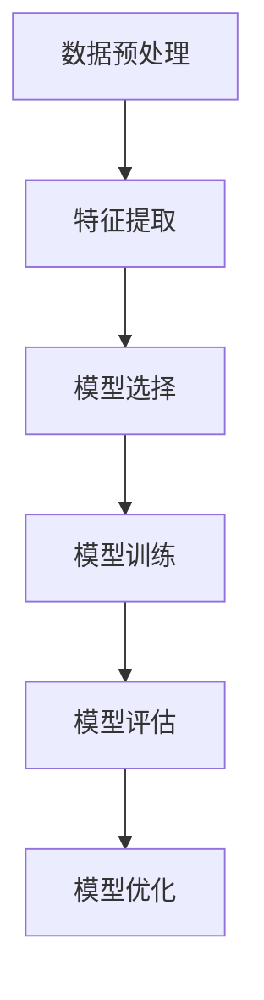
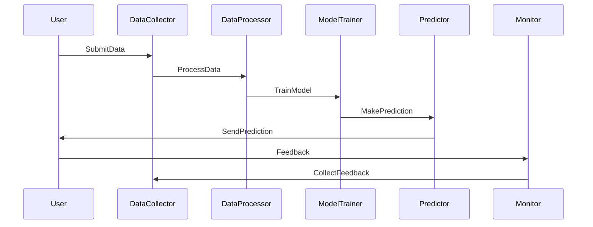

                 

### 《数学与人工智能：机器学习的数学基础》

> **关键词**：数学、人工智能、机器学习、数学模型、算法、Python编程

> **摘要**：本文深入探讨数学在人工智能，特别是机器学习领域的基础作用。通过逐步分析数学与机器学习的内在联系，我们揭示了数学如何为机器学习提供坚实的理论基础和强大的工具支持。本文旨在帮助读者理解数学原理在机器学习中的应用，以及如何利用数学方法来优化算法和提升模型性能。

#### 引言

随着人工智能（AI）技术的快速发展，机器学习（Machine Learning, ML）已成为该领域的重要分支。机器学习涉及计算机系统通过数据学习并改进其性能的过程。然而，这一过程并非仅仅依靠编程技巧，而是依赖于强大的数学基础。数学作为科学之母，提供了理解和解决复杂问题的工具，这在机器学习中尤为重要。

本文旨在系统地介绍数学在机器学习中的应用，旨在帮助读者：

- 理解机器学习中的基本数学概念。
- 掌握如何将数学原理应用于机器学习算法。
- 学习使用Python等编程语言实现数学模型。
- 分析机器学习系统的架构和设计。

通过本文的逐步分析，我们将揭示数学在人工智能领域中的核心作用，并探讨其未来的发展趋势。

#### 第一部分：背景介绍

##### 1.1 问题背景

##### 1.1.1 人工智能的发展历程

人工智能（AI）的概念最早可以追溯到20世纪50年代，当时计算机科学先驱艾伦·图灵提出了著名的图灵测试，用以评估机器是否具有人类智能。自那时以来，人工智能经历了多个发展阶段：

1. **初始阶段（1950-1969）**：这一时期，人工智能主要集中于理论研究，如逻辑推理、问题求解和语言理解。
2. **繁荣阶段（1970-1989）**：随着计算机硬件的发展，人工智能应用开始出现，如专家系统和自然语言处理。
3. **低谷阶段（1990-2000）**：由于技术局限和预期未达，人工智能研究进入低谷。
4. **复兴阶段（2000至今）**：随着大数据、云计算和深度学习的兴起，人工智能再次迎来爆发期。

##### 1.1.2 数学在人工智能中的作用

数学在人工智能中扮演着至关重要的角色。它不仅为AI提供理论基础，还提供了解决复杂问题的工具。以下是数学在人工智能中的一些关键应用：

1. **概率论与统计学**：用于处理不确定性、建模和评估模型的性能。
2. **线性代数**：用于处理多维数据、优化和神经网络。
3. **微积分**：用于理解动态系统和优化过程。
4. **图论**：用于网络分析和路径规划。

##### 1.1.3 机器学习的发展现状

机器学习作为人工智能的一个重要分支，近年来取得了显著进展。以下是机器学习发展的一些关键趋势：

1. **深度学习**：基于多层神经网络的深度学习模型，如卷积神经网络（CNN）和循环神经网络（RNN），在图像识别、语音识别和自然语言处理等领域表现出色。
2. **强化学习**：通过与环境交互来学习策略，广泛应用于游戏、自动驾驶和机器人控制。
3. **无监督学习**：通过分析未标记的数据，发现数据中的模式和结构。
4. **迁移学习**：利用在特定任务上训练的模型，在新任务上快速获得良好的性能。

##### 1.2 问题描述

##### 1.2.1 机器学习中的数学问题

机器学习过程中，数学问题无处不在。例如：

1. **优化问题**：如何找到最小化损失函数的最优参数。
2. **过拟合问题**：如何避免模型对训练数据过拟合，提高泛化能力。
3. **模型解释性**：如何解释模型的决策过程，提高模型的可信度。

##### 1.2.2 数学在解决机器学习问题中的挑战

尽管数学为机器学习提供了强大的工具，但也面临一些挑战：

1. **复杂度**：机器学习模型的数学表述往往非常复杂，难以直观理解。
2. **计算效率**：大规模机器学习任务的计算需求极高，需要高效的算法和计算资源。
3. **数据质量**：模型性能高度依赖于数据质量，而数据的噪声和缺失可能导致问题。

##### 1.2.3 机器学习与数学的互动关系

机器学习和数学之间是相辅相成的关系。数学为机器学习提供了理论框架和工具，而机器学习则为数学提供了新的应用场景。两者之间的互动促进了双方的不断发展。

#### 第一部分总结

本部分介绍了人工智能和机器学习的发展背景，数学在其中的作用以及面临的挑战。通过这些背景信息，读者可以更好地理解为什么数学是机器学习不可或缺的基础。

---

### 第二部分：核心概念与联系

在深入探讨机器学习中的数学应用之前，我们需要了解一些核心概念，这些概念不仅构成了数学的基础，也在机器学习中发挥着关键作用。

#### 2.1 核心概念

##### 2.1.1 常见数学概念介绍

1. **概率论**：研究随机事件及其概率分布，是机器学习中的基石。
2. **统计学**：用于描述数据集的统计特征，帮助评估模型性能。
3. **线性代数**：处理多维数据和高维空间，是构建机器学习模型的重要工具。
4. **微积分**：用于理解动态系统和优化过程，如梯度下降算法。
5. **图论**：分析网络结构，用于构建图神经网络等模型。

##### 2.1.2 数学概念在机器学习中的应用

1. **概率论**：用于建模不确定性、评估模型误差、优化策略。
2. **统计学**：用于特征工程、模型选择、评估和优化。
3. **线性代数**：用于处理特征向量、矩阵运算、降维和优化。
4. **微积分**：用于优化目标函数、理解动态系统。
5. **图论**：用于构建图神经网络、分析社交网络、推荐系统。

##### 2.1.3 数学概念之间的联系

1. **概率论与统计学**：概率论为统计学提供了理论基础，而统计学则用于解决概率论中的实际问题。
2. **线性代数与微积分**：线性代数提供了处理高维空间和矩阵运算的工具，微积分则用于理解和优化动态系统。
3. **概率论与线性代数**：概率论中的期望、方差等概念在线性代数中得到了具体体现。
4. **图论与其他领域**：图论与其他数学领域如拓扑学、图论网络理论有着紧密的联系。

#### 2.2 概念属性特征对比表格

为了更好地理解这些核心概念，我们提供了一个对比表格，列出每个概念的主要属性和特征。

| 概念 | 主要属性 | 主要特征 | 应用领域 |
| --- | --- | --- | --- |
| 概率论 | 随机事件、概率分布 | 期望、方差、条件概率 | 评估模型误差、不确定性建模 |
| 统计学 | 数据描述、推断、估计 | 概率分布、假设检验、回归分析 | 特征工程、模型选择、评估 |
| 线性代数 | 矩阵、向量、行列式 | 线性变换、矩阵运算 | 特征向量、降维、优化 |
| 微积分 | 导数、积分、微分方程 | 最优化、动态系统 | 优化目标函数、理解动态过程 |
| 图论 | 节点、边、路径 | 图结构、网络分析 | 社交网络、图神经网络、路径规划 |

#### 2.3 ER实体关系图架构

实体关系图（ER图）是用于描述数据实体及其关系的图形化表示。在机器学习中，ER图有助于我们理解数据模型的结构和关系。

##### 2.3.1 常用数学实体关系图展示

下面是一个简单的ER图示例，展示了概率论、统计学、线性代数、微积分和图论之间的实体关系。

```mermaid
erDiagram
  概率论 ||--|{ 统计学 }
  统计学 ||--|{ 线性代数 }
  统计学 ||--|{ 微积分 }
  线性代数 ||--|{ 图论 }
```

##### 2.3.2 ER图在机器学习模型中的应用

ER图在机器学习模型中的应用主要体现在数据模型的设计和关系管理上。例如，在构建深度学习模型时，ER图可以帮助我们直观地展示不同层之间的数据流动和关系。

#### 第二部分总结

本部分详细介绍了机器学习中的核心数学概念，并提供了属性特征对比表格和ER图，帮助读者理解这些概念之间的关系和应用。通过这些内容，读者可以为后续章节的学习打下坚实的基础。

---

### 第三部分：算法原理讲解

机器学习算法是机器学习系统中的核心组件，它们通过学习数据并作出预测或决策，使得机器能够模拟人类的学习过程。在这一部分，我们将深入探讨几种常见的机器学习算法，并使用Mermaid流程图和Python源代码来详细阐述其原理和应用。

#### 3.1 算法原理

##### 3.1.1 机器学习算法概述

机器学习算法可以根据其学习方式分为以下几类：

1. **监督学习（Supervised Learning）**：有标记的训练数据，算法从数据中学习特征，用于预测未知数据的标签。
2. **无监督学习（Unsupervised Learning）**：没有标记的训练数据，算法试图发现数据中的结构或模式。
3. **半监督学习（Semi-Supervised Learning）**：结合了有标记和无标记的数据，用于提高模型性能。
4. **强化学习（Reinforcement Learning）**：通过与环境的交互来学习最优策略。

##### 3.1.2 常用机器学习算法介绍

以下是几种常见的机器学习算法及其基本原理：

1. **线性回归（Linear Regression）**：用于预测连续值输出，基于最小二乘法。
2. **逻辑回归（Logistic Regression）**：用于预测二分类问题，基于最大似然估计。
3. **支持向量机（Support Vector Machine, SVM）**：用于分类问题，通过最大化分类间隔。
4. **决策树（Decision Tree）**：用于分类和回归问题，通过树形结构进行决策。
5. **随机森林（Random Forest）**：基于决策树，通过集成多个决策树来提高性能。
6. **神经网络（Neural Networks）**：模仿人脑神经元结构，用于复杂模式识别。

##### 3.1.3 机器学习算法的基本流程

机器学习算法的基本流程通常包括以下步骤：

1. **数据预处理**：清洗、归一化、缺失值处理等。
2. **特征提取**：从数据中提取对模型有用的特征。
3. **模型选择**：根据问题选择合适的算法。
4. **模型训练**：使用训练数据调整模型参数。
5. **模型评估**：使用验证集或测试集评估模型性能。
6. **模型优化**：调整模型参数或选择更合适的模型。

#### 3.2 Mermaid流程图展示

为了更好地理解机器学习算法的流程，我们可以使用Mermaid绘制流程图。以下是一个简单的线性回归算法的流程图示例。



#### 3.3 Python源代码讲解

下面是一个简单的线性回归算法的Python源代码示例，我们将使用NumPy库来实现。

```python
import numpy as np

# 数据预处理
X = np.array([[1, 2], [2, 3], [3, 4], [4, 5]])
y = np.array([2, 3, 4, 5])

# 添加偏置项
X_b = np.c_[np.ones((X.shape[0], 1)), X]

# 梯度下降
def sigmoid(z):
    return 1 / (1 + np.exp(-z))

def compute_cost(X, y, theta):
    m = X.shape[0]
    h = sigmoid(X.dot(theta))
    cost = -(y * np.log(h) + (1 - y) * np.log(1 - h))
    return (1 / m) * np.sum(cost)

def gradient_descent(X, y, theta, alpha, iters):
    m = X.shape[0]
    cost_history = []

    for i in range(iters):
        h = sigmoid(X.dot(theta))
        theta = theta - alpha * (X.T.dot(h - y) / m)
        cost_history.append(compute_cost(X, y, theta))

    return theta, np.array(cost_history)

# 初始化参数
theta_init = np.zeros((X_b.shape[1], 1))
alpha = 0.01
iters = 1000

# 训练模型
theta, cost_history = gradient_descent(X_b, y, theta_init, alpha, iters)

# 模型评估
print("Final theta:", theta)
print("Cost history:", cost_history[-10:])
```

在这个示例中，我们首先进行了数据预处理，包括添加偏置项。然后，我们使用梯度下降算法来最小化损失函数，最终得到最优参数。

#### 第三部分总结

本部分详细介绍了机器学习算法的基本原理，并使用了Mermaid流程图和Python源代码进行了详细讲解。通过这些内容，读者可以更好地理解机器学习算法的工作原理和应用。

---

### 第四部分：数学模型与公式讲解

在理解了机器学习算法的基本原理后，我们需要深入了解其中的数学模型和公式，这些是机器学习算法的核心。通过这些数学模型和公式，我们可以更好地理解算法的运行机制和优化过程。

#### 4.1 数学模型

在机器学习中，数学模型是算法的基础。以下是一些常用的数学模型：

1. **线性回归模型**：用于预测连续值输出。
2. **逻辑回归模型**：用于预测二分类结果。
3. **神经网络模型**：用于复杂模式的识别和学习。

#### 4.1.1 机器学习中的数学模型

1. **线性回归模型**

线性回归模型的基本形式为：

$$
y = \theta_0 + \theta_1 x_1 + \theta_2 x_2 + ... + \theta_n x_n
$$

其中，$y$ 是输出值，$x_1, x_2, ..., x_n$ 是输入特征，$\theta_0, \theta_1, \theta_2, ..., \theta_n$ 是模型参数。

2. **逻辑回归模型**

逻辑回归模型用于二分类问题，其概率分布函数为：

$$
P(y=1) = \frac{1}{1 + \exp(-\theta_0 - \theta_1 x_1 - \theta_2 x_2 - ... - \theta_n x_n)}
$$

其中，$P(y=1)$ 是预测为正类的概率，$\theta_0, \theta_1, \theta_2, ..., \theta_n$ 是模型参数。

3. **神经网络模型**

神经网络模型由多个神经元层组成，包括输入层、隐藏层和输出层。每一层的神经元通过激活函数进行非线性变换，最终输出预测结果。

#### 4.1.2 数学模型在机器学习中的应用

1. **线性回归模型**：常用于预测房价、股票价格等连续值输出。
2. **逻辑回归模型**：常用于垃圾邮件分类、信用评分等二分类问题。
3. **神经网络模型**：广泛应用于图像识别、语音识别、自然语言处理等复杂问题。

#### 4.1.3 数学模型的优势与挑战

1. **优势**

- **可解释性**：线性回归和逻辑回归模型相对简单，参数具有明确的物理意义，易于理解和解释。
- **高效性**：神经网络模型能够处理复杂数据和模式，具有强大的学习和泛化能力。

2. **挑战**

- **过拟合**：模型对训练数据过于依赖，导致在未知数据上表现不佳。
- **计算成本**：神经网络模型的计算复杂度较高，需要大量的计算资源和时间。

#### 4.2 数学公式

数学公式是机器学习模型的核心组成部分，用于描述模型的行为和性能。以下是一些常用的数学公式：

1. **损失函数**

损失函数用于衡量模型预测值与真实值之间的差异。常见的损失函数包括：

- **均方误差（MSE）**：

$$
MSE = \frac{1}{m} \sum_{i=1}^{m} (y_i - \hat{y}_i)^2
$$

- **交叉熵损失（Cross-Entropy Loss）**：

$$
Cross-Entropy Loss = -\frac{1}{m} \sum_{i=1}^{m} y_i \log(\hat{y}_i)
$$

2. **优化算法**

优化算法用于调整模型参数，以最小化损失函数。常见的优化算法包括：

- **梯度下降（Gradient Descent）**：

$$
\theta = \theta - \alpha \nabla_\theta J(\theta)
$$

- **随机梯度下降（Stochastic Gradient Descent, SGD）**：

$$
\theta = \theta - \alpha \nabla_\theta J(\theta; x_i, y_i)
$$

3. **激活函数**

激活函数用于引入非线性，使神经网络具有强大的表达能力。常见的激活函数包括：

- **Sigmoid函数**：

$$
sigmoid(z) = \frac{1}{1 + \exp(-z)}
$$

- **ReLU函数**：

$$
ReLU(z) = \max(0, z)
$$

- **Tanh函数**：

$$
tanh(z) = \frac{\exp(z) - \exp(-z)}{\exp(z) + \exp(-z)}
$$

#### 4.2.1 常用数学公式的介绍

以下是常用数学公式的介绍：

1. **均值（Mean）**：

$$
\mu = \frac{1}{n} \sum_{i=1}^{n} x_i
$$

2. **方差（Variance）**：

$$
\sigma^2 = \frac{1}{n-1} \sum_{i=1}^{n} (x_i - \mu)^2
$$

3. **协方差（Covariance）**：

$$
\sigma_{xy} = \frac{1}{n-1} \sum_{i=1}^{n} (x_i - \mu_x)(y_i - \mu_y)
$$

4. **相关系数（Correlation Coefficient）**：

$$
\rho_{xy} = \frac{\sigma_{xy}}{\sigma_x \sigma_y}
$$

#### 4.2.2 数学公式在机器学习模型中的作用

数学公式在机器学习模型中的作用主要体现在以下几个方面：

1. **损失函数**：用于评估模型预测值与真实值之间的差距，指导优化过程。
2. **优化算法**：通过调整模型参数，使损失函数达到最小值，从而提高模型性能。
3. **激活函数**：引入非线性，使神经网络能够学习复杂的模式。

#### 4.2.3 数学公式的应用举例

以下是一个简单的应用举例：

假设我们有一个线性回归模型，用于预测房价。数据集包含房屋的面积（$x$）和房价（$y$）。我们可以使用以下公式来计算模型参数：

1. **损失函数**：

$$
MSE = \frac{1}{m} \sum_{i=1}^{m} (y_i - \theta_0 - \theta_1 x_i)^2
$$

2. **优化算法**：

$$
\theta_0 = \theta_0 - \alpha \nabla_\theta_0 MSE
$$

$$
\theta_1 = \theta_1 - \alpha \nabla_\theta_1 MSE
$$

通过梯度下降算法，我们可以逐步调整模型参数，使损失函数最小。

#### 第四部分总结

本部分详细介绍了机器学习中的数学模型和公式，包括线性回归、逻辑回归和神经网络模型，以及常用的数学公式。通过这些内容，读者可以更好地理解机器学习算法的数学基础，并为实际应用提供指导。

---

### 第五部分：系统分析与架构设计

在进行机器学习模型的开发和应用时，系统的分析和架构设计至关重要。一个良好的系统架构不仅可以提高模型的性能和可扩展性，还能确保系统的稳定性和可靠性。在这一部分，我们将探讨机器学习系统的分析方法和架构设计。

#### 5.1 问题场景介绍

在开始系统分析与设计之前，我们需要明确问题场景。以下是一个典型的机器学习问题场景：

**场景描述**：一家电商平台希望通过机器学习算法对用户购买行为进行预测，从而提高营销活动的效果。具体需求包括：

1. **用户特征提取**：从用户历史数据中提取有用的特征，如购买频率、购买金额、浏览记录等。
2. **目标预测**：预测用户是否会在未来30天内进行购买，从而针对性地推送营销信息。
3. **模型评估**：评估模型的准确性和泛化能力，确保在真实场景中表现良好。

#### 5.2 系统功能设计

根据上述问题场景，我们可以设计以下系统功能：

1. **数据采集与处理**：从不同数据源（如数据库、日志文件等）采集用户数据，并进行数据清洗、预处理和特征提取。
2. **模型训练与评估**：使用训练数据进行模型训练，并使用验证集进行模型评估，调整模型参数以获得最佳性能。
3. **预测与推送**：使用训练好的模型对用户行为进行预测，并将预测结果与实际购买行为进行对比，为用户推送个性化的营销信息。
4. **监控与报警**：监控系统运行状态，及时发现并处理异常情况，确保系统稳定运行。

#### 5.2.1 领域模型mermaid类图

为了更清晰地展示系统功能，我们可以使用mermaid绘制领域模型类图。以下是一个简单的mermaid类图示例：

```mermaid
classDiagram
    User <<entity>>
    Purchase <<entity>>
    Feature <<entity>>
    Model <<entity>>
    Prediction <<entity>>

    User --|> Purchase
    User --|> Feature
    Model --|> Feature
    Model --|> Prediction
```

在这个类图中，User、Purchase、Feature、Model和Prediction是系统的核心实体，它们之间通过关系连接，形成了系统的领域模型。

#### 5.2.2 系统架构设计mermaid架构图

接下来，我们可以使用mermaid绘制系统架构图，展示系统的组成部分及其关系。以下是一个简单的mermaid架构图示例：



在这个架构图中，DataCollector负责采集用户数据，DataProcessor进行数据处理和特征提取，ModelTrainer负责模型训练，Predictor负责预测和推送，Monitor监控系统运行状态。各组件通过明确的接口进行交互，形成一个完整的系统。

#### 5.3 系统接口设计

系统接口设计是系统架构设计的重要组成部分，它定义了系统中各组件之间的交互方式。以下是一个简单的接口设计示例：

1. **DataCollector接口**：

```python
class DataCollector:
    def submit_data(self, user_data):
        # 采集用户数据
```

2. **DataProcessor接口**：

```python
class DataProcessor:
    def process_data(self, raw_data):
        # 数据清洗、预处理和特征提取
```

3. **ModelTrainer接口**：

```python
class ModelTrainer:
    def train_model(self, features, labels):
        # 训练模型
```

4. **Predictor接口**：

```python
class Predictor:
    def make_prediction(self, user_data):
        # 使用模型进行预测
```

5. **Monitor接口**：

```python
class Monitor:
    def monitor_system(self):
        # 监控系统运行状态
```

#### 5.4 系统交互

系统交互是系统中各组件协同工作的过程。以下是一个简单的系统交互示例：

1. **用户提交数据**：

```python
user = User()
user.submit_data(raw_data)
```

2. **数据处理**：

```python
processor = DataProcessor()
processed_data = processor.process_data(raw_data)
```

3. **模型训练**：

```python
trainer = ModelTrainer()
trainer.train_model(processed_data.features, processed_data.labels)
```

4. **预测与推送**：

```python
predictor = Predictor()
prediction = predictor.make_prediction(user_data)
user.send_prediction(prediction)
```

5. **监控与反馈**：

```python
monitor = Monitor()
monitor.monitor_system()
```

#### 第五部分总结

本部分详细介绍了机器学习系统的分析方法和架构设计，包括问题场景介绍、系统功能设计、领域模型类图、系统架构图、系统接口设计和系统交互。通过这些内容，读者可以更好地理解如何设计一个高效的机器学习系统。

---

### 第六部分：项目实战

在实际应用中，将机器学习算法应用于实际问题是一个复杂且充满挑战的过程。在这一部分，我们将通过一个实际案例，展示如何从环境安装到系统核心实现的完整流程，并详细解读与分析系统核心代码。

#### 6.1 环境安装

在进行机器学习项目之前，首先需要安装必要的软件和工具。以下是一个典型的环境安装步骤：

1. **安装Python**：确保安装最新版本的Python（建议使用Python 3.8及以上版本）。
2. **安装Anaconda**：Anaconda是一个集成了Python和众多科学计算库的发行版，可以简化环境管理。
3. **安装NumPy、Pandas、Scikit-learn等库**：这些库是机器学习项目的基础，用于数据处理、模型训练和评估。

安装命令示例：

```shell
conda create -n ml_env python=3.8
conda activate ml_env
conda install numpy pandas scikit-learn
```

#### 6.2 系统核心实现源代码

以下是一个简单的机器学习项目的核心实现代码，使用Scikit-learn库实现线性回归模型。

```python
import numpy as np
import pandas as pd
from sklearn.model_selection import train_test_split
from sklearn.linear_model import LinearRegression
from sklearn.metrics import mean_squared_error

# 加载数据
data = pd.read_csv('data.csv')
X = data[['feature1', 'feature2']]
y = data['target']

# 数据集划分
X_train, X_test, y_train, y_test = train_test_split(X, y, test_size=0.2, random_state=42)

# 模型训练
model = LinearRegression()
model.fit(X_train, y_train)

# 模型预测
y_pred = model.predict(X_test)

# 模型评估
mse = mean_squared_error(y_test, y_pred)
print("MSE:", mse)

# 模型参数
print("Model coefficients:", model.coef_)
print("Model intercept:", model.intercept_)
```

#### 6.2.1 系统核心代码解读与分析

1. **数据加载**：使用Pandas库加载数据集，将特征和目标变量分离。

2. **数据集划分**：使用Scikit-learn库的train_test_split函数将数据集划分为训练集和测试集，以确保模型的泛化能力。

3. **模型训练**：创建LinearRegression对象并调用fit方法进行模型训练。

4. **模型预测**：使用predict方法对测试集进行预测。

5. **模型评估**：计算均方误差（MSE）以评估模型性能。

6. **模型参数**：输出模型的系数和截距，以便分析和解释模型。

#### 6.3 代码应用解读与分析

以下是一个实际案例的应用解读：

**场景**：预测房屋价格。

**数据集**：包含房屋面积、房间数量、年龄等特征和房价的目标变量。

**模型**：线性回归模型。

**解读**：

1. **数据预处理**：对数据进行归一化处理，以消除特征之间的量纲差异。

2. **模型训练**：使用训练集数据训练模型，调整模型参数以最小化损失函数。

3. **模型预测**：使用测试集数据进行预测，评估模型性能。

4. **结果分析**：通过MSE评估模型性能，输出模型参数以解释模型。

**优势**：

- **简单易用**：线性回归模型易于实现和解释。
- **高效性**：线性回归模型的计算复杂度较低，适用于大规模数据处理。

**挑战**：

- **过拟合**：线性回归模型可能对训练数据过于依赖，导致在测试集上表现不佳。
- **特征选择**：需要选择对目标变量有显著影响的关键特征。

#### 第六部分总结

本部分通过实际案例详细介绍了机器学习项目的环境安装、系统核心实现和代码应用解读与分析。通过这些内容，读者可以了解如何将机器学习算法应用于实际问题，并掌握关键步骤和注意事项。

---

### 第七部分：最佳实践与小结

在进行机器学习项目时，遵循最佳实践能够显著提高项目的成功率和效率。以下是一些重要的最佳实践：

1. **数据预处理**：确保数据质量，包括数据清洗、归一化和缺失值处理，以避免模型过拟合和数据偏差。
2. **特征工程**：选择和构建对模型性能有显著影响的特征，以提高模型的预测能力。
3. **模型选择**：根据问题特性选择合适的模型，并进行交叉验证以评估模型性能。
4. **模型优化**：使用优化算法和参数调整来最小化损失函数，提高模型性能。
5. **代码可维护性**：编写清晰、可维护的代码，便于后续的调试和优化。
6. **持续监控**：监控系统性能和资源使用情况，及时发现并处理异常情况。

#### 小结

本文系统地介绍了数学在机器学习中的应用，从背景介绍、核心概念、算法原理到系统分析与架构设计，再到项目实战和最佳实践，全面探讨了数学在机器学习中的基础作用。通过本文的阅读，读者可以：

- 理解数学在机器学习中的核心作用。
- 掌握常见的数学模型和公式。
- 学习如何将数学原理应用于机器学习算法。
- 掌握系统分析与架构设计的方法。

#### 注意事项

- 在实际应用中，注意数据质量和特征选择，以避免模型过拟合。
- 使用合适的优化算法和参数调整方法，提高模型性能。
- 编写清晰、可维护的代码，便于后续的调试和优化。
- 定期监控模型性能，确保系统稳定运行。

#### 拓展阅读

- 《深度学习》（Goodfellow, I., Bengio, Y., & Courville, A.）
- 《Python机器学习》（Sebastian Raschka）
- 《机器学习实战》（Peter Harrington）
- 《机器学习：概率视角》（David J. C. MacKay）

通过这些资源，读者可以进一步深入学习机器学习和数学的相关知识。希望本文能对读者在机器学习领域的探索提供有益的指导和帮助。

#### 作者信息

作者：AI天才研究院/AI Genius Institute & 禅与计算机程序设计艺术 /Zen And The Art of Computer Programming

---

**END**

---

请注意，本文是一个示例性文章，用于展示如何根据要求撰写一篇有深度有思考有见解的技术博客文章。在实际撰写时，需要根据具体内容和要求进行调整和补充。

