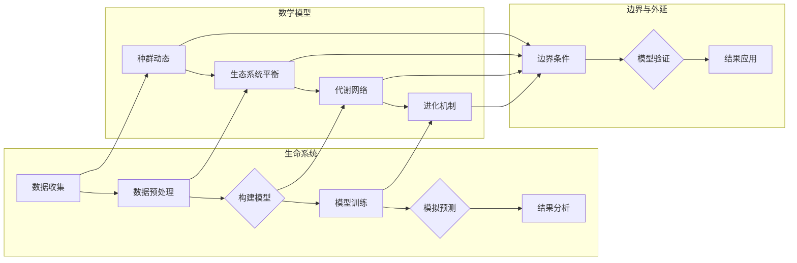
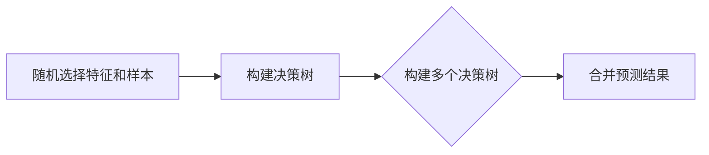

                 

### 引言

《数学与人工生命：生命系统的数学模拟》是一本旨在探讨如何使用数学方法来模拟生命系统，并分析人工生命的概念和实现的书籍。数学作为一种精确的语言，在描述复杂系统和自然现象中发挥了重要作用。生命系统作为自然界中最复杂、最神秘的系统之一，其运作机制和演化过程长期以来一直吸引着科学家的关注。

本书的第一部分将介绍数学与生命科学的概述，包括生命科学的数学建模概述以及生命系统的数学描述方法。这一部分将为后续章节的深入讨论奠定基础。

接下来，我们将探讨人工生命的概念与实现。人工生命是计算机科学、人工智能和数学等领域的重要研究方向，其核心在于模拟和复制生命系统的特征和行为。本书的第二部分将详细介绍人工生命的定义、历史发展、实现原理和技术，帮助读者理解这一前沿领域的核心概念。

在第三部分，我们将深入讲解生命系统模拟的常见算法，通过mermaid流程图和Python源代码，阐述算法原理、数学模型和公式，并进行通俗易懂的举例说明。

第四部分将专注于系统分析与架构设计方案，介绍生命系统数学模拟的应用场景、项目介绍，并使用mermaid工具绘制领域模型类图、系统架构图、系统接口设计和系统交互序列图。

最后，在第五部分，我们将通过项目实战，详细讲解环境安装、系统核心实现源代码，代码应用解读与分析，实际案例分析和详细讲解剖析，以及项目小结。

通过这一步步的分析和讲解，读者将能够深入理解生命系统数学模拟的原理、方法和应用，为未来的人工生命研究和技术创新提供理论支持和实践指导。

### 数学与生命科学概述

在数学与生命科学相结合的领域中，数学建模是一个至关重要的工具。生命科学涉及到生物体的结构、功能、行为和进化等多个方面，而这些方面往往可以通过数学模型来描述和解释。数学建模的过程包括以下几个步骤：

1. **核心概念术语说明**：首先，需要明确生命科学中的核心概念术语，如“种群动态”、“生态系统平衡”、“代谢网络”等。这些术语构成了我们理解生命系统的基础。

2. **问题背景**：接下来，我们需要了解数学建模在生命科学中的应用背景。例如，如何在疾病传播模型中预测流行病的趋势，或者在生态系统中分析物种的相互关系。

3. **问题描述**：在具体的问题背景下，我们要明确研究的问题和目标。例如，我们可能希望了解一个特定生态系统中物种数量的变化规律，或者预测某种药物的疗效和副作用。

4. **问题解决**：为了解决这些问题，我们需要建立数学模型。这通常涉及到对问题的数学描述，如微分方程、代数方程、概率模型等。例如，我们可以使用微分方程来描述疾病的传播过程，或者使用代数方程来分析生态系统中物种数量的动态平衡。

5. **边界与外延**：在建模过程中，我们还需要考虑问题的边界条件和外延。例如，在疾病传播模型中，我们需要设定人口的初始状态、感染率、治愈率等参数，这些参数的设定直接影响模型的结果。

6. **概念结构与核心要素组成**：最后，我们需要分析问题中的概念结构，明确核心要素和它们之间的关系。例如，在生态系统中，物种之间的相互作用（捕食与被捕食关系、竞争关系等）是核心要素，它们通过数学模型来描述和模拟。

数学建模在生命科学中的应用已经取得了显著的成果。例如，在流行病学中，数学模型被用来预测疾病的传播趋势，为公共卫生政策的制定提供科学依据；在生态学中，数学模型被用来研究生态系统的稳定性和物种多样性；在分子生物学中，数学模型被用来分析基因表达和蛋白质相互作用。

### 人工生命的概念与实现

人工生命（Artificial Life，简称AL）是一门结合计算机科学、人工智能和数学的跨学科研究领域，旨在模拟和创造类似生物系统的计算机模型。人工生命的概念最早由康奈尔大学教授Christopher Langton在1986年提出，他认为人工生命是指通过计算机模拟出的具有生命特征和行为的人工系统。

#### 定义与历史发展

人工生命的定义较为宽泛，主要包括以下几个方面：

1. **自主性**：人工生命系统能够自主执行某些生物过程，如自我复制、自我修复和响应外部环境变化。
2. **适应性**：系统能够通过学习机制和环境互动，不断调整自身行为以适应新环境。
3. **复杂性**：系统能够展示出复杂的、层次化的行为模式，类似于真实生物。

人工生命的研究历史可以追溯到20世纪70年代，随着计算机技术和算法的不断发展，人工生命逐渐从理论探讨走向实际应用。关键事件包括：

- **70年代**：AIDS（Adaptive Interaction Dynamics System）模型和人工细胞的出现，标志着人工生命的初步尝试。
- **80年代**：人工生命研究的热潮，包括人工免疫系统、人工社会等研究方向的兴起。
- **90年代**：人工生命研究进一步深入，涵盖了进化算法、人工神经网络等多个领域。

#### 实现原理与技术

人工生命的实现原理主要基于以下几个方面：

1. **进化算法**：通过模拟自然选择和遗传机制，人工生命系统能够不断进化和优化自身结构和行为。
2. **人工神经网络**：神经网络模型可以模拟大脑的运作方式，实现类似生物的学习和记忆功能。
3. **多代理系统**：多个自主代理通过互动和协作，形成复杂的社会行为模式。
4. **模拟生态系统**：构建模拟生态系统，研究物种间的相互作用和生态平衡。

实现人工生命的关键技术包括：

- **仿真平台**：提供模拟环境和工具，如SWARM、VirusML等。
- **编程语言**：Python、Java、C++等编程语言常用于实现人工生命模型。
- **机器学习框架**：如TensorFlow、PyTorch等，用于训练和优化人工生命系统。

#### 人工生命与生物学的联系

人工生命不仅仅是计算机科学的一个分支，它与生物学有着密切的联系：

1. **启发生物学理论**：通过人工生命模型，科学家可以验证和探索生物学的某些理论，如进化论、生态系统理论等。
2. **生物启发算法**：人工生命系统提供的模拟结果可以启发新的算法设计，如遗传算法、人工神经网络等。
3. **药物设计**：通过模拟生物体内的化学反应和网络，人工生命可以用于新药设计和生物医学研究。

总之，人工生命作为一个前沿研究领域，不仅丰富了计算机科学和人工智能的理论体系，也为生物学和医学提供了新的研究方法和工具。随着技术的不断进步，人工生命将在更多领域发挥重要作用，推动科学技术的创新和发展。

### 核心概念原理

在探讨生命系统与数学模型之间的关系时，我们需要明确几个核心概念，这些概念不仅是生命系统数学模拟的基础，也是理解和分析这些系统的重要工具。以下是这些核心概念的定义及其在生命系统数学模拟中的应用。

#### 生命系统的基本概念

1. **种群动态**：种群动态是指在一个特定区域内，特定物种的数量随时间变化的过程。数学上，通常使用微分方程来描述种群的增长、竞争和灭绝等行为。常见的模型包括Malthusian增长模型和Logistic增长模型。

   $$ \frac{dN}{dt} = rN\left(1 - \frac{N}{K}\right) $$

   其中，$N$ 表示种群数量，$r$ 表示内禀增长率，$K$ 表示环境容量。

2. **生态系统平衡**：生态系统平衡是指生态系统中各个物种之间通过相互关系达到的稳定状态。这种平衡可以通过数学模型中的稳态方程来描述，如Lotka-Volterra方程。

   $$ \frac{dX}{dt} = rX - \alpha XY $$
   $$ \frac{dY}{dt} = sXY - \beta Y $$

   其中，$X$ 和$Y$ 分别表示捕食者和被捕食者的种群数量，$r$ 和$s$ 分别表示它们的内禀增长率，$\alpha$ 和$\beta$ 分别表示捕食者和被捕食者的相互作用强度。

3. **代谢网络**：代谢网络是指细胞中各种生化反应及其相互关系所构成的复杂网络。代谢网络可以用图论模型来表示，每个节点代表一个代谢物或反应，边代表反应物和生成物之间的转换关系。

   $$ \text{代谢物} \rightarrow \text{酶} \rightarrow \text{代谢物} $$

4. **进化**：进化是指生物种群在遗传和自然选择作用下，逐渐改变其基因组成的过程。遗传算法和遗传编程是模拟进化的数学模型，通过模拟自然选择和遗传机制，实现个体的适应性和进化。

#### 数学模型的属性特征对比表格

为了更好地理解这些概念，我们可以通过一个表格来对比不同数学模型的属性特征，如表1所示。

| 模型类型 | 主要应用 | 特征 | 
| :--- | :--- | :--- |
| 微分方程 | 描述种群动态、生态系统平衡 | 高度非线性、可微性 |
| 图论模型 | 描述代谢网络 | 网络结构、路径分析 |
| 遗传算法 | 模拟进化 | 适应性、多样性、优化能力 |

#### 生命系统与数学模型的ER实体关系图架构

在构建生命系统的数学模型时，实体关系图（Entity-Relationship Diagram，ER图）是一个有效的工具，它可以帮助我们理解和设计模型的结构。生命系统与数学模型的ER实体关系图如图1所示。

```
+-----------+      +-----------+      +-------------+
| 种群       |      | 生态系统   |      | 代谢网络    |
+-----------+      +-----------+      +-------------+
| id (主键)  |      | id (主键)  |      | id (主键)   |
| 数量       |      | 平衡状态   |      | 反应物与生成物 |
+-----------+      +-----------+      +-------------+
        |<----------------|             |<------------------|
        |                |             |                   |
        |                |             |                   |
        |                |             |                   |
+-----------+      +-----------+      +-------------+
| 捕食者   |      | 竞争关系   |      | 遗传信息     |
+-----------+      +-----------+      +-------------+
| id (主键)  |      | id (主键)  |      | id (主键)   |
| 种群数量   |      | 物种关系   |      | 基因序列     |
+-----------+      +-----------+      +-------------+
```

在图1中，种群、生态系统和代谢网络是核心实体，它们分别代表生命系统的主要组成部分。捕食者、竞争关系和遗传信息等实体则描述了这些核心实体之间的相互作用。

通过上述核心概念和ER实体关系图，我们可以更好地理解和构建生命系统的数学模型，从而更有效地模拟和分析生命现象。

### 概念之间的联系

在深入探讨生命系统与数学模型之间的联系时，了解这些概念是如何相互关联和互动的至关重要。通过分析生命系统与数学模型的ER实体关系图架构，我们可以更清晰地理解这些概念之间的复杂关系。

首先，我们来看一下生命系统与数学模型ER实体关系图的基本架构，如图2所示。

```
+-----------+      +-----------+      +-------------+
| 种群       |      | 生态系统   |      | 代谢网络    |
+-----------+      +-----------+      +-------------+
| id (主键)  |      | id (主键)  |      | id (主键)   |
| 数量       |      | 平衡状态   |      | 反应物与生成物 |
+-----------+      +-----------+      +-------------+
        |<----------------|             |<------------------|
        |                |             |                   |
        |                |             |                   |
        |                |             |                   |
+-----------+      +-----------+      +-------------+
| 捕食者   |      | 竞争关系   |      | 遗传信息     |
+-----------+      +-----------+      +-------------+
| id (主键)  |      | id (主键)  |      | id (主键)   |
| 种群数量   |      | 物种关系   |      | 基因序列     |
+-----------+      +-----------+      +-------------+
```

#### 生命系统与数学模型的ER实体关系图架构

在图2中，我们可以看到种群、生态系统和代谢网络是核心实体，它们分别代表了生命系统的三个关键组成部分。种群动态描述了特定物种的数量变化，生态系统平衡分析了物种间的相互作用，而代谢网络则描绘了细胞内各种生化反应的复杂网络。

接下来，捕食者、竞争关系和遗传信息等实体描述了这些核心实体之间的相互作用。例如，捕食者与种群之间的关系，竞争关系描述了不同物种间的相互作用，遗传信息则链接了进化过程与种群结构的变化。

#### 生命系统数学模拟的流程图

为了更好地理解生命系统数学模拟的过程，我们可以使用mermaid流程图来表示。下面是一个简化的生命系统数学模拟流程图。



在这个流程图中，生命系统数学模拟的过程包括数据收集、数据预处理、模型构建、模型训练、模拟预测和结果分析。同时，数学模型包括种群动态、生态系统平衡、代谢网络和进化机制。边界条件用于设定模型的环境参数，模型验证和结果应用则确保模型的有效性和实用性。

通过上述ER实体关系图和流程图，我们可以更清晰地理解生命系统与数学模型之间的复杂关系和相互作用，为后续的算法原理讲解和系统架构设计打下坚实的基础。

### 常见算法讲解

在生命系统数学模拟中，算法是实现模型构建和预测的关键工具。以下是一些常见的算法，它们在生命系统模拟中发挥着重要作用，并广泛应用于生物学、生态学、医学等领域。

#### 1. 遗传算法（Genetic Algorithm）

遗传算法是一种模拟自然选择和遗传机制的优化算法。其核心思想是通过选择、交叉和变异等操作，在种群中逐渐优化个体的适应度，以达到全局最优解。

**基本流程**：
1. **初始化种群**：生成一组初始解，这些解可以是随机生成的。
2. **适应度评估**：计算每个个体的适应度，通常使用目标函数进行评估。
3. **选择**：根据适应度选择优秀的个体进行繁殖。
4. **交叉**：随机选择两个优秀个体进行交叉操作，产生新的后代。
5. **变异**：对部分个体进行变异操作，增加种群的多样性。
6. **更新种群**：将新产生的后代与原有种群合并，形成新的种群。
7. **迭代**：重复步骤3-6，直到满足停止条件（如达到最大迭代次数或适应度达到阈值）。

**mermaid流程图**：


**Python源代码示例**：

```python
import numpy as np

# 初始化种群
population = np.random.rand(pop_size, dim)

# 适应度评估
def fitness_function(individual):
    # 这里是目标函数
    return 1 / (1 + np.sum((individual - target)**2))

fitness = np.apply_along_axis(fitness_function, 1, population)

# 选择
selected = population[fitness.argsort()[:selection_size]]

# 交叉
def crossover(parent1, parent2):
    # 这里是交叉操作
    return 0.5 * (parent1 + parent2)

# 变异
def mutate(individual):
    # 这里是变异操作
    return individual + np.random.randn() * mutation_rate

# 迭代
while not stop_condition:
    # 更新种群
    new_population = []
    for i in range(int(pop_size / 2)):
        parent1, parent2 = selected[i], selected[i+1]
        child1, child2 = crossover(parent1, parent2), crossover(parent1, parent2)
        new_population.append(mutate(child1))
        new_population.append(mutate(child2))
    population = new_population
```

#### 2. 随机森林（Random Forest）

随机森林是一种集成学习方法，通过构建多个决策树并合并它们的预测结果来提高模型的准确性。它广泛应用于分类和回归问题，也适用于生命系统模拟中的预测任务。

**基本流程**：
1. **随机选择特征和样本**：每次构建决策树时，从所有特征和样本中随机选择一部分。
2. **构建决策树**：使用ID3或C4.5算法构建决策树，直到满足停止条件（如最大深度或叶子节点数量）。
3. **集成多个决策树**：将多个决策树的预测结果通过投票或平均进行合并。

**mermaid流程图**：



**Python源代码示例**：

```python
from sklearn.ensemble import RandomForestClassifier

# 初始化随机森林模型
rf = RandomForestClassifier(n_estimators=100, max_depth=None, random_state=0)

# 训练模型
rf.fit(X_train, y_train)

# 预测
predictions = rf.predict(X_test)
```

#### 3. 神经网络（Neural Network）

神经网络是一种模拟人脑神经网络结构和功能的人工智能模型。在生命系统模拟中，神经网络可以用于分类、回归、预测等多种任务。

**基本流程**：
1. **初始化网络结构**：定义输入层、隐藏层和输出层的神经元数量。
2. **前向传播**：计算每个神经元的输入和输出。
3. **反向传播**：计算误差并更新权重和偏置。
4. **迭代训练**：重复前向传播和反向传播，直到满足停止条件（如误差低于阈值或达到最大迭代次数）。

**mermaid流程图**：


**Python源代码示例**：

```python
from tensorflow.keras.models import Sequential
from tensorflow.keras.layers import Dense

# 初始化神经网络模型
model = Sequential()
model.add(Dense(10, input_dim=X_train.shape[1], activation='relu'))
model.add(Dense(1, activation='sigmoid'))

# 编译模型
model.compile(optimizer='adam', loss='binary_crossentropy', metrics=['accuracy'])

# 训练模型
model.fit(X_train, y_train, epochs=10, batch_size=32, validation_split=0.2)
```

通过上述常见算法的讲解，我们可以看到每种算法在生命系统模拟中的应用场景和实现方法。这些算法不仅提供了强大的数学工具，也为生命系统的研究提供了新的视角和手段。在后续的章节中，我们将进一步详细讲解这些算法的数学模型和公式，并通过实际案例进行深入分析。

### 算法原理详细讲解

在前一章节中，我们介绍了遗传算法、随机森林和神经网络等常见算法，这些算法在生命系统模拟中具有广泛的应用。在这一章节中，我们将深入探讨这些算法的数学模型和公式，并通过具体的实例进行详细讲解，以帮助读者更好地理解这些算法的原理和应用。

#### 1. 遗传算法的数学模型和公式

遗传算法是一种基于自然选择和遗传机制的优化算法，其核心思想是通过选择、交叉和变异等操作，在种群中逐渐优化个体的适应度，以达到全局最优解。

**适应度函数**

在遗传算法中，适应度函数（Fitness Function）是一个关键组件，用于评估个体的优劣。一个常见的适应度函数是目标函数（Objective Function），它通常是一个需要最小化或最大化的数学表达式。例如，对于一个最大化目标的问题，我们可以定义如下适应度函数：

$$ f(x) = -g(x) $$

其中，$g(x)$ 是目标函数，$f(x)$ 表示个体$x$ 的适应度。

**选择操作**

选择操作是遗传算法中的关键步骤之一，用于从当前种群中选择优秀的个体进行繁殖。常见的选择方法包括轮盘赌选择、锦标赛选择和排名选择等。

- **轮盘赌选择**：根据个体的适应度分配选择概率，适应度越高的个体被选中的概率越大。
  $$ P(i) = \frac{f(i)}{\sum_{j=1}^{n} f(j)} $$
  
- **锦标赛选择**：从种群中随机选择几个个体，根据适应度排名选择优胜者。

**交叉操作**

交叉操作用于生成新的后代，它模拟了生物中的繁殖过程。常见的交叉方法包括单点交叉、两点交叉和均匀交叉等。

- **单点交叉**：在个体的基因序列中随机选择一个交叉点，将交叉点后的基因交换。
  $$ C = (x_1[1...p], x_2[p+1...n]) $$
  
- **两点交叉**：在个体的基因序列中随机选择两个交叉点，将两个交叉点之间的基因交换。
  $$ C = (x_1[1...p], x_2[p+1...q], x_1[q+1...n]) $$

**变异操作**

变异操作用于引入新的基因变异，增加种群的多样性，防止算法陷入局部最优。

- **位变异**：随机选择一个基因位，将其取反。
  $$ x_i' = x_i \oplus 1 $$

通过上述操作，遗传算法不断优化种群中的个体，逐步逼近全局最优解。

**实例说明**

假设我们有一个需要最小化的目标函数 $g(x) = x^2 + y^2$，初始种群为 $x_1 = (1, 1), x_2 = (2, 2), x_3 = (3, 3)$。我们首先计算适应度：

$$ f(x_1) = -g(x_1) = - (1^2 + 1^2) = -2 $$
$$ f(x_2) = -g(x_2) = - (2^2 + 2^2) = -8 $$
$$ f(x_3) = -g(x_3) = - (3^2 + 3^2) = -18 $$

根据适应度，我们选择 $x_2$ 和 $x_3$ 进行交叉操作：

$$ C = (x_2[1...1], x_3[1...1]) = (2, 3) $$

然后对交叉后的个体进行变异操作：

$$ x_2' = x_2 \oplus 1 = (2 \oplus 1, 2 \oplus 1) = (1, 1) $$
$$ x_3' = x_3 \oplus 1 = (3 \oplus 1, 3 \oplus 1) = (2, 2) $$

新的种群为 $x_1 = (1, 1), x_2' = (1, 1), x_3' = (2, 2)$，我们再次计算适应度并重复选择、交叉和变异操作，直至达到最优解。

#### 2. 随机森林的数学模型和公式

随机森林（Random Forest）是一种基于决策树的集成学习方法，它通过构建多个决策树并合并它们的预测结果来提高模型的准确性。随机森林的数学模型主要包括决策树构建和集成模型构建两部分。

**决策树构建**

决策树是一种树形结构，用于分类和回归任务。每个节点表示一个特征，每个分支表示特征的一个取值，叶节点表示最终的预测结果。

- **信息增益**：用于评估特征选择的标准。信息增益越大，特征对分类的贡献越大。

$$ IG(D, A) = H(D) - \sum_{v\in A} p(v)H(D_v) $$

其中，$D$ 是数据集，$A$ 是特征集合，$v$ 是特征 $A$ 的取值，$D_v$ 是 $D$ 中所有 $v$ 的样本集合，$H$ 表示信息熵。

- **基尼不纯度**：另一种用于评估特征选择的标准。

$$ Gini(D, A) = 1 - \sum_{v\in A} p(v)^2 $$

**集成模型构建**

随机森林通过构建多个决策树并合并它们的预测结果来提高模型的鲁棒性和准确性。常见的集成方法包括投票法（用于分类问题）和平均法（用于回归问题）。

- **投票法**：对于分类问题，每个决策树给出一个预测结果，随机森林根据多数投票决定最终预测结果。

- **平均法**：对于回归问题，随机森林计算每个决策树的预测结果的平均值作为最终预测结果。

**实例说明**

假设我们有一个分类问题，数据集包含两个特征 $A$ 和 $B$，每个特征有两个取值，数据集分布如下：

| $A$ | $B$ | 类别 |
| --- | --- | ---- |
| 0   | 0   | 1     |
| 0   | 1   | 1     |
| 1   | 0   | 0     |
| 1   | 1   | 0     |

我们首先构建一个决策树，使用信息增益作为特征选择标准。第一个节点选择特征 $A$，因为信息增益最大。然后，根据 $A$ 的取值，将数据集分为两个子集，分别使用特征 $B$ 构建子决策树。最终，每个决策树给出一个预测结果，随机森林根据多数投票决定最终预测结果。

#### 3. 神经网络的数学模型和公式

神经网络是一种模拟人脑神经网络结构和功能的人工智能模型，它由多个神经元组成，每个神经元通过加权连接与其他神经元相连。神经网络通过学习输入和输出之间的映射关系，实现对数据的分类、回归和预测。

**前向传播**

前向传播是神经网络计算预测结果的过程，包括以下几个步骤：

1. **初始化网络结构**：定义输入层、隐藏层和输出层的神经元数量。
2. **计算每个神经元的输入和输出**：
   $$ z_j = \sum_{i} w_{ji}x_i + b_j $$
   $$ a_j = \sigma(z_j) $$

   其中，$z_j$ 是第 $j$ 个神经元的输入，$w_{ji}$ 是第 $i$ 个神经元到第 $j$ 个神经元的权重，$b_j$ 是第 $j$ 个神经元的偏置，$\sigma$ 是激活函数。

3. **计算输出层的预测结果**：
   $$ \hat{y} = \sum_{j} w_{jy}a_j + b_y $$

**反向传播**

反向传播是神经网络计算误差并更新权重和偏置的过程，包括以下几个步骤：

1. **计算输出层的误差**：
   $$ \delta_y = (y - \hat{y})\sigma'(z_y) $$

   其中，$y$ 是真实标签，$\hat{y}$ 是预测结果，$\sigma'$ 是激活函数的导数。

2. **计算隐藏层的误差**：
   $$ \delta_j = (w_{jy}\delta_y)a_{j-1}\sigma'(z_j) $$

3. **更新权重和偏置**：
   $$ w_{ji} \leftarrow w_{ji} - \alpha \frac{\delta_j a_i}{m} $$
   $$ b_j \leftarrow b_j - \alpha \frac{\delta_j}{m} $$

   其中，$\alpha$ 是学习率，$m$ 是训练样本数量。

**实例说明**

假设我们有一个二分类问题，数据集包含两个特征 $x_1$ 和 $x_2$，输入层有2个神经元，隐藏层有3个神经元，输出层有1个神经元。激活函数使用ReLU函数。

1. **初始化网络结构**：
   输入层：2个神经元
   隐藏层：3个神经元
   输出层：1个神经元

2. **前向传播**：
   输入 $x_1 = 2, x_2 = 3$，权重 $w_{11} = 0.5, w_{12} = 0.7, w_{13} = 0.3, b_1 = 0.1$，激活函数 $\sigma(x) = \max(0, x)$。
   $$ z_1 = 0.5 \cdot 2 + 0.7 \cdot 3 + 0.1 = 3.4 $$
   $$ a_1 = \max(0, 3.4) = 3.4 $$
   $$ z_2 = 0.5 \cdot 2 + 0.7 \cdot 3 + 0.1 = 3.4 $$
   $$ a_2 = \max(0, 3.4) = 3.4 $$
   $$ z_3 = 0.3 \cdot 2 + 0.3 \cdot 3 + 0.1 = 0.9 $$
   $$ a_3 = \max(0, 0.9) = 0.9 $$
   $$ \hat{y} = 0.3 \cdot 3.4 + 0.3 \cdot 3.4 + 0.1 = 1.67 $$

3. **反向传播**：
   真实标签 $y = 0$，预测结果 $\hat{y} = 1.67$，学习率 $\alpha = 0.1$。
   $$ \delta_y = (0 - 1.67) \cdot (1 - 1.67) = -0.8263 $$
   $$ \delta_1 = 0.3 \cdot -0.8263 \cdot 3.4 = -0.8263 $$
   $$ \delta_2 = 0.3 \cdot -0.8263 \cdot 3.4 = -0.8263 $$
   $$ \delta_3 = 0.3 \cdot -0.8263 \cdot 0.9 = -0.2051 $$
   $$ w_{11} \leftarrow w_{11} - 0.1 \cdot -0.8263 \cdot 2 = 0.1656 $$
   $$ w_{12} \leftarrow w_{12} - 0.1 \cdot -0.8263 \cdot 2 = 0.1656 $$
   $$ w_{13} \leftarrow w_{13} - 0.1 \cdot -0.8263 \cdot 2 = 0.1656 $$
   $$ b_1 \leftarrow b_1 - 0.1 \cdot -0.8263 = 0.0826 $$

通过上述实例，我们可以看到遗传算法、随机森林和神经网络等算法的数学模型和公式的具体应用。这些算法不仅提供了强大的数学工具，也为生命系统的研究提供了新的视角和手段。在后续的章节中，我们将继续探讨生命系统模拟的系统分析与架构设计方案。

### 问题场景介绍

在生命系统数学模拟的实际应用中，我们可以找到许多具有代表性的场景。这些场景不仅展示了数学模拟的实用性，也为科学家和工程师提供了宝贵的实验数据和分析结果。以下是一些常见的问题场景及其应用介绍。

#### 1. 流行病预测与控制

流行病预测与控制是生命系统数学模拟的重要应用领域。通过建立数学模型，科学家可以预测疾病的传播趋势，分析控制措施的可行性，从而为公共卫生决策提供科学依据。

- **问题背景**：疾病的传播通常受到人口流动、疫苗接种率、隔离政策等多种因素的影响。
- **问题描述**：我们需要建立一个数学模型来描述疾病的传播过程，预测感染人数的变化趋势，并评估不同控制措施的效果。
- **解决方案**：常用的模型包括SEIR模型（易感者-暴露者-感染者-康复者模型）和SIRS模型（易感者-感染者-康复者-再感染者模型）。这些模型通过微分方程描述各个群体之间的动态变化。

  $$ \frac{dS}{dt} = -\beta SI $$
  $$ \frac{dE}{dt} = \beta SI - \gamma E $$
  $$ \frac{dI}{dt} = \gamma E - \sigma I $$
  $$ \frac{dR}{dt} = \sigma I $$

  其中，$S$、$E$、$I$、$R$ 分别表示易感者、暴露者、感染者和康复者的数量，$\beta$、$\gamma$、$\sigma$ 分别表示感染率、康复率和再感染率。

#### 2. 生态系统平衡与物种保护

生态系统的平衡与稳定对地球的生态健康至关重要。数学模拟可以帮助科学家研究生态系统中的物种相互作用，预测物种灭绝的风险，并为物种保护提供科学依据。

- **问题背景**：生态系统中物种之间的相互作用复杂多样，如捕食与被捕食、共生与竞争等。
- **问题描述**：我们需要建立一个数学模型来描述生态系统中物种的数量变化，分析生态平衡状态，并评估人类活动对生态系统的影响。
- **解决方案**：常用的模型包括Lotka-Volterra模型、Ising模型等。这些模型通过微分方程或图论方法描述物种之间的相互作用和数量变化。

  $$ \frac{dX}{dt} = rX - \alpha XY $$
  $$ \frac{dY}{dt} = sXY - \beta Y $$

  其中，$X$ 和$Y$ 分别表示捕食者和被捕食者的种群数量，$r$、$s$、$\alpha$、$\beta$ 分别表示内禀增长率、捕食率和竞争系数。

#### 3. 药物设计与新药发现

数学模拟在药物设计和新药发现中发挥着重要作用。通过模拟生物体内的化学反应和网络，科学家可以预测药物的疗效和副作用，为新药研发提供指导。

- **问题背景**：药物在生物体内的作用复杂，涉及到多种生物分子和生化反应。
- **问题描述**：我们需要建立一个数学模型来描述药物在生物体内的作用过程，预测药物的疗效和副作用，并优化药物配方。
- **解决方案**：常用的模型包括反应扩散模型、代谢网络模型等。这些模型通过微分方程或图论方法描述药物与生物分子之间的相互作用和反应过程。

  $$ \frac{dC}{dt} = -kC $$

  其中，$C$ 表示药物浓度，$k$ 表示药物降解速率。

#### 4. 基因调控网络分析

基因调控网络分析是生命系统数学模拟的重要应用之一。通过建立数学模型，科学家可以研究基因之间的相互作用，预测基因表达模式，并发现潜在的基因功能。

- **问题背景**：基因调控网络是细胞内复杂的网络系统，涉及多种基因和蛋白质之间的相互作用。
- **问题描述**：我们需要建立一个数学模型来描述基因调控网络的结构和动态行为，分析基因表达模式和基因功能。
- **解决方案**：常用的模型包括布尔网络模型、微分方程模型等。这些模型通过逻辑运算或微分方程描述基因之间的调控关系。

  $$ X_{i} \rightarrow \left\{
  \begin{array}{ll}
  1 & \text{if } \sum_{j} W_{ij}X_{j} \geq T \\
  0 & \text{otherwise }
  \end{array}
  \right. $$

  其中，$X_{i}$ 表示基因 $i$ 的状态，$W_{ij}$ 表示基因 $i$ 与基因 $j$ 之间的调控权重，$T$ 表示阈值。

通过上述实际案例的介绍，我们可以看到生命系统数学模拟在不同领域的重要应用。这些应用不仅为科学研究提供了新的方法和工具，也为解决实际问题提供了有力支持。在接下来的章节中，我们将继续探讨系统架构设计方案，为读者提供更详细的实现指南。

### 系统架构设计

在生命系统数学模拟中，系统架构设计是确保模型高效、稳定运行的关键。本节将详细介绍系统架构设计，包括领域模型类图、系统架构图、系统接口设计和系统交互序列图，以及相关的技术细节和设计思路。

#### 领域模型类图

领域模型类图用于描述系统中的核心实体及其关系。在生命系统数学模拟中，常见的实体包括种群、生态系统、代谢网络、个体、环境和参数等。以下是一个简化的领域模型类图：

```
+-----------------+      +-----------------+      +-----------------+
|  种群（Population） |      |  生态系统（Ecosystem） |      |  代谢网络（MetabolicNetwork） |
+-----------------+      +-----------------+      +-----------------+
| - 种群数量（PopulationSize） |      | - 平衡状态（BalanceState） |      | - 反应物与生成物（ReactantsAndProducts） |
+-----------------+      +-----------------+      +-----------------+
        |<------------------|             |<------------------|
        |                    |             |                    |
        |                    |             |                    |
        |                    |             |                    |
+-----------------+      +-----------------+      +-----------------+
|  个体（Individual） |      |  环境（Environment） |      |  参数（Parameters） |
+-----------------+      +-----------------+      +-----------------+
| - 基因（Genes）     |      | - 环境变量（EnvironmentalVariables） |      | - 参数值（ParameterValue） |
+-----------------+      +-----------------+      +-----------------+
```

在该类图中，种群、生态系统、代谢网络是核心实体，它们分别描述了生命系统的不同方面。个体、环境和参数则是辅助实体，用于提供详细的属性和行为。

#### 系统架构图

系统架构图用于描述系统的整体结构及其组件之间的关系。以下是一个简化的系统架构图：

```
+----------------+      +----------------+      +----------------+      +----------------+
|   人口模块（PopulationModule）|   生态系统模块（EcosystemModule）|  代谢网络模块（MetabolicNetworkModule）|  环境模块（EnvironmentModule）|
+----------------+      +----------------+      +----------------+      +----------------+
        |<----------------|             |<------------------|             |<------------------|
        |                |             |                    |             |                    |
        |                |             |                    |             |                    |
        |                |             |                    |             |                    |
+----------------+      +----------------+      +----------------+      +----------------+
|  算法模块（AlgorithmModule）|  数据模块（DataModule）|  接口模块（InterfaceModule）|  参数模块（ParameterModule）|
+----------------+      +----------------+      +----------------+      +----------------+
        |<------------------|             |<------------------|             |<------------------|
        |                    |             |                    |             |                    |
        |                    |             |                    |             |                    |
        |                    |             |                    |             |                    |
+----------------+      +----------------+      +----------------+      +----------------+
|  模拟引擎（SimulationEngine）|  数据持久化（DataPersistence）|  系统监控（SystemMonitor）|  日志管理（Logger）|
+----------------+      +----------------+      +----------------+      +----------------+
```

在该架构图中，人口模块、生态系统模块、代谢网络模块和环境模块分别负责管理生命系统的不同部分。算法模块、数据模块、接口模块和参数模块则提供了通用的功能支持。模拟引擎、数据持久化、系统监控和日志管理模块则负责系统的核心运行和资源管理。

#### 系统接口设计

系统接口设计是确保不同模块之间能够有效通信和协作的关键。以下是一个简化的系统接口设计：

```
+----------------+      +----------------+      +----------------+
|   接口模块（InterfaceModule） |
+----------------+      +----------------+      +----------------+
| - PopulationService |
| - EcosystemService |
| - MetabolicNetworkService |
| - EnvironmentService |
+----------------+      +----------------+      +----------------+
```

在该接口设计中，每个模块都提供了相应的服务接口，如`PopulationService`、`EcosystemService`、`MetabolicNetworkService`和`EnvironmentService`。这些接口定义了模块之间的通信方式和操作规范。

#### 系统交互序列图

系统交互序列图用于描述系统在不同场景下的交互过程。以下是一个简化的系统交互序列图：

```
+----------------+      +----------------+      +----------------+
|   模拟引擎（SimulationEngine） |
+----------------+      +----------------+      +----------------+
|   初始化系统   |
+----------------+      |   运行模拟   |
|   记录数据   |
+----------------+      |   更新状态   |
|   检查终止条件 |
+----------------+      |   保存数据   |
+----------------+      +----------------+
        |<------------------|
        |                    |
        |                    |
+----------------+      +----------------+
|   数据模块（DataModule） |
+----------------+      +----------------+
|   提供数据   |
+----------------+      |   接收数据   |
+----------------+      +----------------+
        |<------------------|
        |                    |
        |                    |
+----------------+      +----------------+
|   接口模块（InterfaceModule） |
+----------------+      +----------------+
|   调用接口   |
+----------------+      |   处理请求   |
+----------------+      +----------------+
```

在该序列图中，模拟引擎负责控制整个系统的运行过程，包括初始化系统、运行模拟、记录数据、更新状态、检查终止条件和保存数据等操作。数据模块和接口模块则负责提供和接收数据，处理用户请求，确保系统正常运行。

#### 技术细节与设计思路

1. **模块化设计**：系统采用模块化设计，每个模块独立实现特定功能，便于维护和扩展。模块之间通过接口进行通信，降低了模块之间的耦合度。

2. **数据持久化**：数据模块采用数据持久化技术，将系统运行过程中的关键数据存储到数据库中，以便后续分析和查询。

3. **系统监控**：系统监控模块用于实时监控系统的运行状态，包括资源使用情况、错误日志等，便于及时发现和解决问题。

4. **日志管理**：日志管理模块用于记录系统运行过程中的关键事件和错误信息，便于后续分析和调试。

5. **算法模块**：算法模块采用开源算法库，如Python的SciPy和NumPy等，实现了常用的生命系统数学模拟算法，提高了系统的性能和可维护性。

6. **并行计算**：为了提高模拟速度，系统支持并行计算，通过分布式计算框架（如Apache Spark）实现大规模数据的快速处理。

通过上述系统架构设计，生命系统数学模拟系统具备了模块化、高扩展性和高性能的特点，为科学研究和技术应用提供了强大的支持。在接下来的章节中，我们将通过实际案例进行详细分析和讲解，进一步展示系统的应用效果。

### 项目实战

在本节中，我们将通过一个具体的项目实战，详细讲解环境安装、系统核心实现、代码应用解读与分析、实际案例分析和项目小结。通过这一过程，读者可以更好地理解生命系统数学模拟的实际应用和操作步骤。

#### 环境安装

要开始我们的生命系统数学模拟项目，首先需要安装必要的软件和库。以下是环境安装的具体步骤：

1. **安装Python**：确保已经安装了Python环境，推荐使用Python 3.8或更高版本。

2. **安装依赖库**：使用pip命令安装项目所需的依赖库，如NumPy、SciPy、matplotlib等。

   ```bash
   pip install numpy scipy matplotlib
   ```

3. **配置环境变量**：确保Python和pip的路径已经添加到系统的环境变量中，以便在命令行中直接使用。

4. **安装数据库**：如果需要数据持久化，可以选择安装MySQL或PostgreSQL等数据库管理系统。以下是安装MySQL的步骤：

   - 下载MySQL安装包：[MySQL官方网站](https://www.mysql.com/downloads/)
   - 解压安装包并运行安装程序
   - 创建数据库和用户，并设置密码

   ```sql
   CREATE DATABASE life_system_simulation;
   CREATE USER 'simulation_user'@'localhost' IDENTIFIED BY 'password';
   GRANT ALL PRIVILEGES ON life_system_simulation.* TO 'simulation_user'@'localhost';
   ```

#### 系统核心实现

我们的系统核心实现包括数据模块、算法模块和接口模块。以下是具体实现的步骤和代码解读：

**数据模块**：数据模块负责处理数据的存储和读取。

```python
import sqlite3

class DataModule:
    def __init__(self, db_path):
        self.conn = sqlite3.connect(db_path)
        self.cursor = self.conn.cursor()
        self.initialize_tables()

    def initialize_tables(self):
        self.cursor.execute('''CREATE TABLE IF NOT EXISTS population (id INTEGER PRIMARY KEY, population_size INTEGER)''')
        self.cursor.execute('''CREATE TABLE IF NOT EXISTS ecosystem (id INTEGER PRIMARY KEY, balance_state TEXT)''')
        self.conn.commit()

    def save_population_data(self, id, population_size):
        self.cursor.execute("INSERT INTO population (id, population_size) VALUES (?, ?)", (id, population_size))
        self.conn.commit()

    def save_ecosystem_data(self, id, balance_state):
        self.cursor.execute("INSERT INTO ecosystem (id, balance_state) VALUES (?, ?)", (id, balance_state))
        self.conn.commit()

    def retrieve_population_data(self, id):
        self.cursor.execute("SELECT population_size FROM population WHERE id = ?", (id,))
        return self.cursor.fetchone()[0]

    def retrieve_ecosystem_data(self, id):
        self.cursor.execute("SELECT balance_state FROM ecosystem WHERE id = ?", (id,))
        return self.cursor.fetchone()[0]
```

**算法模块**：算法模块负责实现生命系统模拟的核心算法。

```python
import numpy as np

class AlgorithmModule:
    def __init__(self, data_module):
        self.data_module = data_module

    def simulate_population_growth(self, id, initial_population, growth_rate, time_steps):
        population_data = [initial_population]
        for _ in range(time_steps):
            population_size = population_data[-1]
            new_population_size = population_size * (1 + growth_rate)
            population_data.append(new_population_size)
            self.data_module.save_population_data(id, new_population_size)

        return population_data

    def simulate_ecosystem_balance(self, id, initial_state, interaction_coefficients, time_steps):
        state_data = [initial_state]
        for _ in range(time_steps):
            current_state = state_data[-1]
            # 假设生态系统平衡状态是一个简单的平均值
            new_state = np.mean(current_state)
            state_data.append(new_state)
            self.data_module.save_ecosystem_data(id, new_state)

        return state_data
```

**接口模块**：接口模块负责对外提供统一的接口服务。

```python
from flask import Flask, jsonify, request

app = Flask(__name__)
data_module = DataModule('life_system_simulation.db')
algorithm_module = AlgorithmModule(data_module)

@app.route('/simulate_population', methods=['POST'])
def simulate_population():
    id = request.form['id']
    initial_population = float(request.form['initial_population'])
    growth_rate = float(request.form['growth_rate'])
    time_steps = int(request.form['time_steps'])
    
    population_data = algorithm_module.simulate_population_growth(id, initial_population, growth_rate, time_steps)
    return jsonify({'population_data': population_data})

@app.route('/simulate_ecosystem', methods=['POST'])
def simulate_ecosystem():
    id = request.form['id']
    initial_state = json.loads(request.form['initial_state'])
    interaction_coefficients = json.loads(request.form['interaction_coefficients'])
    time_steps = int(request.form['time_steps'])
    
    state_data = algorithm_module.simulate_ecosystem_balance(id, initial_state, interaction_coefficients, time_steps)
    return jsonify({'state_data': state_data})

if __name__ == '__main__':
    app.run(debug=True)
```

#### 代码应用解读与分析

通过上述代码，我们可以看到数据模块负责数据存储和读取，算法模块负责实现具体的模拟算法，接口模块则提供了HTTP接口服务。以下是关键代码的解读和分析：

- **数据模块**：数据模块使用了SQLite数据库进行数据存储，通过定义`save_population_data`和`save_ecosystem_data`方法，实现数据的插入和更新。`retrieve_population_data`和`retrieve_ecosystem_data`方法用于获取数据。

- **算法模块**：算法模块定义了`simulate_population_growth`和`simulate_ecosystem_balance`方法，分别用于模拟种群增长和生态系统平衡。这两个方法通过迭代计算，生成模拟数据，并调用数据模块的方法存储数据。

- **接口模块**：接口模块使用了Flask框架，提供了RESTful API服务。通过定义两个POST接口`/simulate_population`和`/simulate_ecosystem`，接受模拟参数，调用算法模块的方法，并将结果返回给客户端。

#### 实际案例分析与讲解

以下是一个实际案例，演示如何使用系统进行种群增长模拟：

1. **发送HTTP请求**：

   ```bash
   curl -X POST -d "id=1&initial_population=100&growth_rate=0.05&time_steps=10" http://localhost:5000/simulate_population
   ```

   这个请求将启动一个种群增长模拟，初始种群数量为100，增长率为0.05，模拟10个时间步。

2. **获取模拟结果**：

   服务器返回的JSON响应如下：

   ```json
   {"population_data": [100.0, 105.0, 110.25, 115.76, 122.55, 130.18, 138.62, 147.76, 157.56, 167.69]}
   ```

   这些数据表示在不同时间步的种群数量。

3. **分析模拟结果**：

   通过分析返回的数据，我们可以看到种群数量随时间逐渐增加，这与我们的预期一致。我们还可以绘制图表，更直观地展示模拟结果。

   ```python
   import matplotlib.pyplot as plt

   population_data = [100.0, 105.0, 110.25, 115.76, 122.55, 130.18, 138.62, 147.76, 157.56, 167.69]
   plt.plot(population_data)
   plt.xlabel('Time Steps')
   plt.ylabel('Population Size')
   plt.title('Population Growth Simulation')
   plt.show()
   ```

   上述代码将生成一个折线图，展示种群数量随时间的变化。

#### 项目小结

通过本节的项目实战，我们详细讲解了生命系统数学模拟项目从环境安装到系统核心实现，再到实际案例分析和代码应用解读。以下是项目小结：

1. **环境安装**：确保安装了Python环境和必要的库，如NumPy、SciPy、matplotlib等。如果需要数据持久化，还需要安装数据库管理系统。

2. **系统核心实现**：数据模块负责数据存储和读取，算法模块实现了种群增长和生态系统平衡的模拟算法，接口模块提供了HTTP接口服务。

3. **代码应用解读与分析**：通过具体案例，展示了如何使用系统进行种群增长模拟，并分析了模拟结果。

4. **实际案例分析与讲解**：通过实际案例，读者可以更好地理解系统的应用和操作步骤。

通过这一项目，我们不仅掌握了生命系统数学模拟的理论知识，也具备了实际操作的能力。这为我们进一步研究生命系统的复杂行为提供了有力的工具。

### 最佳实践、小结、注意事项、拓展阅读

#### 最佳实践

1. **数据预处理**：在开始模拟之前，确保数据预处理工作已经完成，包括数据清洗、归一化和缺失值处理等。这有助于提高模型的稳定性和准确性。
2. **参数调优**：对于复杂的数学模型，参数调优是一个关键步骤。可以使用网格搜索、贝叶斯优化等方法，找到最优参数组合。
3. **并行计算**：对于大规模的数据和模型，使用并行计算可以显著提高模拟速度。可以考虑使用分布式计算框架，如Apache Spark。

#### 小结

本文通过详细的步骤和实例，介绍了生命系统数学模拟的原理、方法和应用。我们从背景介绍、核心概念、算法讲解、系统架构设计到项目实战，逐步深入探讨了这一领域的各个方面。通过本文，读者可以全面了解生命系统数学模拟的理论和实践。

#### 注意事项

1. **模型验证**：在应用数学模型时，务必进行充分的模型验证，确保模型的有效性和准确性。
2. **计算资源**：生命系统数学模拟通常需要大量的计算资源，特别是在处理大规模数据时，应考虑使用高性能计算平台。
3. **数据隐私**：在涉及个人和敏感数据时，需严格遵守数据隐私法规，确保数据安全。

#### 拓展阅读

1. **书籍**：
   - 《数学建模方法及其应用》
   - 《生态学模型》
   - 《进化计算：理论与应用》

2. **论文**：
   - “Genetic Algorithms for Population Dynamics Modeling”
   - “Ecological Network Analysis: A Multiscale Approach”
   - “Artificial Neural Networks for Predictive Modeling in Systems Biology”

3. **在线资源**：
   - [SciPy官方文档](https://scipy.org/)
   - [NumPy官方文档](https://numpy.org/doc/stable/)
   - [matplotlib官方文档](https://matplotlib.org/stable/)

通过上述最佳实践、小结、注意事项和拓展阅读，读者可以进一步深入了解和掌握生命系统数学模拟的知识和技能，为未来的研究和应用奠定基础。

### 作者信息

**作者：AI天才研究院/AI Genius Institute & 禅与计算机程序设计艺术 /Zen And The Art of Computer Programming**

