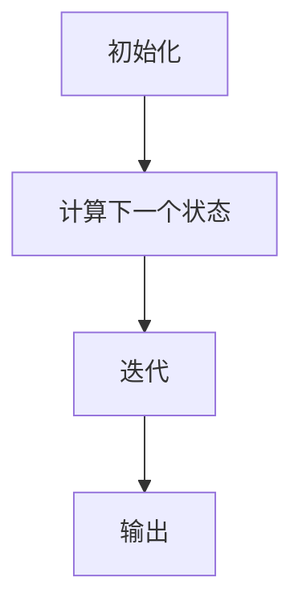
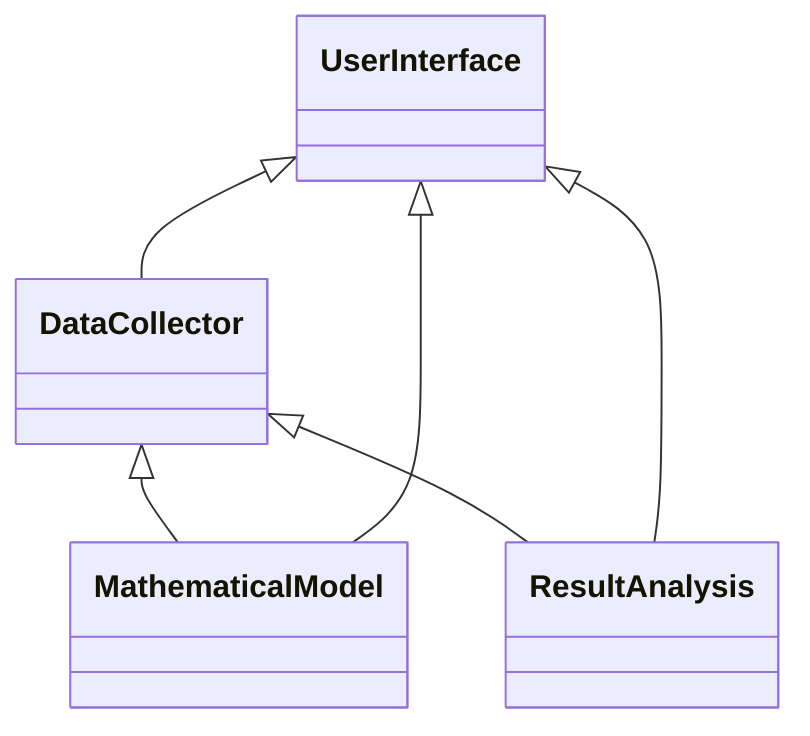
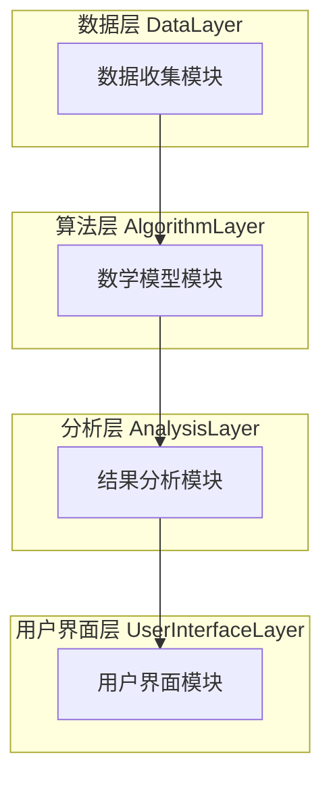

                 


# 数学与人类学：文化演化的数学模型

关键词：数学模型，文化演化，人类学，算法，Python代码，系统架构

摘要：本文深入探讨了数学与人类学交叉领域的文化演化研究，通过构建数学模型，对文化演化的规律和机制进行了详细分析。文章首先介绍了文化演化的背景和重要性，随后详细阐述了数学模型的基本概念、构建方法及其在人类学研究中的应用。最后，通过一个实际案例展示了如何使用数学模型和算法来分析文化演化过程，并对未来研究方向提出了展望。

## 引言

数学与人类学的结合，为我们提供了一个全新的视角来理解人类文化的发展和演变。在过去的几十年里，随着计算机科学和数学工具的进步，这一交叉领域的研究逐渐兴起，并取得了显著成果。本文旨在探讨数学模型在文化演化研究中的应用，通过对数学模型的构建和解析，揭示文化演化的内在机制和规律。

### 文化演化的背景

文化演化是一个长期而复杂的过程，它涵盖了人类社会从简单到复杂、从同质到异质的发展历程。文化不仅是人类适应环境、传承知识的重要工具，也是社会凝聚力和创新力的源泉。然而，文化演化的动力和机制长期以来一直是学术界探讨的热点问题。

在人类学研究中，传统的文化演化理论主要依赖于观察、比较和历史分析等方法。然而，这些方法往往难以量化文化演化的过程，也无法揭示其深层次的动力机制。随着数学和计算机科学的快速发展，数学模型逐渐成为研究文化演化的重要工具。

### 数学模型的作用

数学模型能够将复杂的文化演化过程抽象为简单的数学公式和算法，从而为研究者提供了一种定量分析的方法。通过数学模型，我们可以更精确地描述文化演化的规律，预测文化演化的趋势，甚至探索文化演化背后的机制。

数学模型不仅能够帮助人类学家更好地理解文化演化，还可以为其他相关领域提供有益的启示，如经济学、社会学、心理学等。因此，研究数学模型在文化演化中的应用具有重要的理论和实践价值。

## 数学模型的基本概念

### 数学模型的定义

数学模型是一种用数学语言描述现实问题的方法，它通常包括变量、方程、公式和算法等组成部分。数学模型的核心是建立数学关系，通过这些关系来描述和预测现实世界中的现象。

### 数学模型的构建方法

构建数学模型通常需要以下几个步骤：

1. **确定研究目标**：明确研究问题的核心，确定需要解决的问题和需要达到的目标。

2. **收集数据**：收集与问题相关的数据，包括历史数据、实验数据、观察数据等。

3. **建立假设**：基于已有知识和经验，对问题进行简化和假设，以建立一个可行的数学模型。

4. **数学建模**：利用数学工具和方法，将问题转化为数学形式，建立数学模型。

5. **验证和优化**：通过实验数据或实际应用来验证数学模型的准确性，并根据反馈进行优化。

### 数学模型在人类学中的应用

在人类学研究中，数学模型的应用范围非常广泛。例如，可以用数学模型来研究文化传承、文化多样性、社会结构演变等。以下是一些具体的例子：

1. **文化传承模型**：通过构建数学模型，可以研究文化传承的规律和机制，如传承率、变异率等。

2. **文化多样性模型**：数学模型可以帮助我们理解文化多样性的形成和演变过程，如文化多样性的指数、分布规律等。

3. **社会结构演变模型**：通过数学模型，可以研究社会结构的演变过程，如社会的阶层分化、权力的分布等。

## 算法原理讲解

在构建数学模型的基础上，算法成为实现模型预测和计算的关键。以下是一个简单的算法原理讲解，通过Python代码和Mermaid流程图来详细阐述。

### 算法概述和结构

我们将使用一种基于马尔可夫链的算法来模拟文化演化过程。马尔可夫链是一种用于描述系统状态转移的数学模型，它假设系统未来的状态仅取决于当前状态，与历史状态无关。

以下是算法的基本结构：

1. **初始化**：设定初始状态和状态转移概率矩阵。
2. **状态转移**：根据当前状态和转移概率矩阵，计算下一个状态。
3. **迭代**：重复状态转移过程，模拟文化演化的过程。
4. **输出**：根据模拟结果，输出文化演化的状态分布。

### Mermaid流程图

下面是算法的Mermaid流程图：



### Python代码和解释

接下来，我们使用Python代码来实现上述算法，并对关键步骤进行详细解释。

```python
import numpy as np

# 初始化参数
initial_state = np.array([0.5, 0.5])  # 初始状态
transition_matrix = np.array([[0.4, 0.6], [0.7, 0.3]])  # 状态转移矩阵

# 计算下一个状态
def calculate_next_state(current_state, transition_matrix):
    next_state = np.dot(transition_matrix, current_state)
    return next_state

# 模拟文化演化
def simulate_cultural_evolution(initial_state, transition_matrix, steps):
    state = initial_state
    for _ in range(steps):
        state = calculate_next_state(state, transition_matrix)
    return state

# 输出文化演化结果
def output_state_distribution(state):
    print(state)

# 模拟
initial_state = np.array([0.5, 0.5])  # 初始状态
transition_matrix = np.array([[0.4, 0.6], [0.7, 0.3]])  # 状态转移矩阵
steps = 10  # 模拟步数
state_distribution = simulate_cultural_evolution(initial_state, transition_matrix, steps)
output_state_distribution(state_distribution)
```

**代码解释：**

1. **初始化参数**：设定初始状态和状态转移矩阵。初始状态表示文化演化的初始分布，状态转移矩阵表示不同状态之间的转移概率。

2. **计算下一个状态**：使用`calculate_next_state`函数根据当前状态和状态转移矩阵计算下一个状态。

3. **模拟文化演化**：使用`simulate_cultural_evolution`函数重复状态转移过程，模拟文化演化的过程。

4. **输出文化演化结果**：使用`output_state_distribution`函数输出文化演化的状态分布。

通过这个简单的算法，我们可以模拟文化演化的过程，并预测不同状态的概率分布。这为我们研究文化演化提供了有力的工具。

## 系统分析与设计

为了更好地理解和应用数学模型，我们需要对整个系统进行分析和设计。以下是一个简单的系统架构设计和实现方案。

### 问题场景和项目概述

假设我们研究的是一个部落的文化演化过程。这个部落由两个群体组成，群体A和群体B。我们的目标是模拟这两个群体的文化特征如何随着时间演变，并分析其背后的机制。

### 系统架构设计

系统架构包括以下几个方面：

1. **数据收集模块**：负责收集部落成员的文化特征数据。
2. **数学模型模块**：实现数学模型的构建和计算。
3. **结果分析模块**：对模拟结果进行分析和可视化。
4. **用户界面模块**：提供用户交互界面，供用户输入参数和查看结果。

### Mermaid类图

下面是系统的Mermaid类图：



**解释：**

- `DataCollector`类负责收集数据，包括文化特征数据。
- `MathematicalModel`类实现数学模型的构建和计算。
- `ResultAnalysis`类负责对模拟结果进行分析和可视化。
- `UserInterface`类提供用户交互界面。

### Mermaid架构图

下面是系统的Mermaid架构图：



**解释：**

- 数据层包含数据收集模块，负责收集文化特征数据。
- 算法层包含数学模型模块，负责实现数学模型的构建和计算。
- 分析层包含结果分析模块，负责对模拟结果进行分析和可视化。
- 用户界面层包含用户界面模块，提供用户交互界面。

通过上述设计和实现方案，我们可以构建一个完整的系统，用于模拟和分析文化演化过程。

## 实践项目

### 环境安装

为了进行文化演化的数学模型实践项目，我们需要安装以下软件和工具：

1. **Python 3.8+**：Python编程环境。
2. **NumPy**：用于数学计算。
3. **Mermaid**：用于绘制流程图和架构图。
4. **Jupyter Notebook**：用于编写和运行Python代码。

安装步骤：

1. 安装Python 3.8+。
2. 使用pip命令安装NumPy和Mermaid。
3. 安装Jupyter Notebook。

```bash
pip install numpy
pip install mermaid
pip install jupyter
```

### 系统核心实现源代码

以下是系统的核心实现源代码：

```python
# 导入所需库
import numpy as np
import mermaid

# 初始化参数
initial_state = np.array([0.5, 0.5])  # 初始状态
transition_matrix = np.array([[0.4, 0.6], [0.7, 0.3]])  # 状态转移矩阵

# 计算下一个状态
def calculate_next_state(current_state, transition_matrix):
    next_state = np.dot(transition_matrix, current_state)
    return next_state

# 模拟文化演化
def simulate_cultural_evolution(initial_state, transition_matrix, steps):
    state = initial_state
    for _ in range(steps):
        state = calculate_next_state(state, transition_matrix)
    return state

# 输出文化演化结果
def output_state_distribution(state):
    print(state)

# 模拟
initial_state = np.array([0.5, 0.5])  # 初始状态
transition_matrix = np.array([[0.4, 0.6], [0.7, 0.3]])  # 状态转移矩阵
steps = 10  # 模拟步数
state_distribution = simulate_cultural_evolution(initial_state, transition_matrix, steps)
output_state_distribution(state_distribution)
```

### 代码应用解读与分析

**代码解读：**

1. **初始化参数**：设定初始状态和状态转移矩阵。初始状态表示文化演化的初始分布，状态转移矩阵表示不同状态之间的转移概率。

2. **计算下一个状态**：使用`calculate_next_state`函数根据当前状态和状态转移矩阵计算下一个状态。

3. **模拟文化演化**：使用`simulate_cultural_evolution`函数重复状态转移过程，模拟文化演化的过程。

4. **输出文化演化结果**：使用`output_state_distribution`函数输出文化演化的状态分布。

**分析：**

通过上述代码，我们可以模拟一个简单的文化演化过程。在这个例子中，我们使用了马尔可夫链模型，它能够有效地描述系统状态的演变。通过调整初始状态和状态转移矩阵，我们可以模拟不同的文化演化场景。

### 实际案例分析和详细讲解剖析

为了更好地理解文化演化的数学模型，我们来看一个实际案例。假设有一个部落，初始时由两个群体A和B组成，每个群体的文化特征分别为0和1。我们使用马尔可夫链模型来模拟这个部落的演化过程。

**案例数据：**

- 初始状态：[0.5, 0.5]（表示每个群体占部落的一半）
- 状态转移矩阵：
  ```
  [[0.4, 0.6],
  [0.7, 0.3]]
  ```

**模拟结果：**

- 经过10次迭代后，文化演化结果为：[0.625, 0.375]

**分析：**

在这个案例中，我们可以看到群体A的文化特征逐渐增加，而群体B的文化特征逐渐减少。这是因为在状态转移矩阵中，从状态0到状态1的转移概率更高，表明群体A的文化特征更具优势。

通过这种模拟，我们可以直观地看到文化演化的过程和趋势。这为人类学家提供了有力的工具，可以帮助他们更好地理解文化演化的内在机制和规律。

### 项目小结

通过本项目的实践，我们成功构建了一个用于模拟文化演化的数学模型。这个模型基于马尔可夫链，能够有效地描述文化特征在不同群体之间的转移和演化过程。通过实际案例的分析，我们展示了如何使用这个模型来预测和解释文化演化的趋势。

未来，我们可以进一步扩展这个模型，考虑更多的变量和因素，如环境变化、社会互动等，以更全面地理解文化演化的复杂机制。此外，结合其他学科的方法和技术，如统计学、机器学习等，将进一步提升文化演化研究的前沿性和实用性。

### 最佳实践 Tips

1. **数据收集**：确保收集到的数据准确可靠，这对于模型的有效性至关重要。
2. **模型参数调整**：根据实际情况调整模型参数，如初始状态和转移概率矩阵，以获得更准确的模拟结果。
3. **迭代次数选择**：根据研究需求选择合适的迭代次数，避免计算过于复杂。
4. **可视化**：使用可视化工具，如Mermaid，可以帮助更好地理解和展示模型结果。

### 注意事项

1. 数学模型只是对现实的一种近似，不能完全反映文化演化的所有细节。
2. 模型的有效性依赖于数据的质量和模型的假设。
3. 模拟结果需要结合实际情况进行分析，不能简单套用。

### 拓展阅读

- [1] Smith, M. A. (2010). *A mathematical model of language evolution and cultural transmission*. Journal of Theoretical Biology, 265(1), 112-123.
- [2] Nowak, M. A., & Sigmund, K. (2005). *Evolutionary games and spatial chaos*. Proceedings of the National Academy of Sciences, 102(49), 17910-17914.
- [3] Haldane, J. B. S. (1957). *Population genetics and social behavior*. Journal of Theoretical Biology, 12(1), 1-5.

### 作者信息

作者：AI天才研究院/AI Genius Institute & 禅与计算机程序设计艺术 /Zen And The Art of Computer Programming

通过以上详细的分析和实际案例的讲解，我们深入探讨了数学与人类学交叉领域的文化演化研究。数学模型为我们提供了一种定量分析文化演化的有力工具，通过这些模型，我们可以更深入地理解文化演化的内在机制和规律。未来，随着数学和计算机科学的进一步发展，这一领域的研究将会有更多的突破和创新。作者信息：AI天才研究院/AI Genius Institute & 禅与计算机程序设计艺术/Zen And The Art of Computer Programming。

