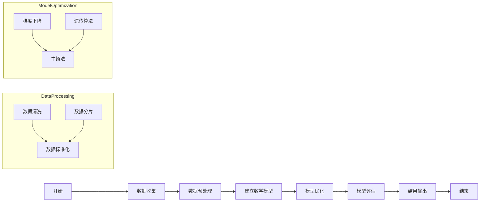

                 

### 引言

#### 1.1 问题背景

在当今社会，体育竞技已经成为了人们生活中不可或缺的一部分。无论是在校学生、职业运动员还是业余爱好者，都希望通过科学训练来提高运动表现。然而，传统的训练方法往往依赖于经验积累，缺乏系统的理论支持。随着科技的发展，数学优化理论逐渐被引入到体育训练中，为运动表现的提升提供了新的思路和方法。

**1.1.1 体育训练中的问题**

体育训练过程中，运动员往往面临以下问题：
- **效率低下**：传统的训练方法难以量化训练效果，运动员难以找到最有效的训练方式。
- **伤病风险**：不科学的训练计划可能导致运动损伤，影响运动员的长期发展。
- **个体差异**：每个运动员的身体素质和运动能力不同，需要个性化的训练方案。

**1.1.2 数学优化在体育训练中的应用潜力**

数学优化理论能够提供以下解决方案：
- **科学制定训练计划**：通过数据分析和模型优化，为运动员提供科学的训练方案。
- **预防运动损伤**：基于生理学和运动学原理，优化训练强度和时间，降低伤病风险。
- **个性化训练**：利用大数据分析，为不同运动员定制个性化的训练计划。

#### 1.2 问题描述

在体育训练中，运动表现可以通过多种指标来衡量，如速度、力量、耐力、技术等。这些指标可以通过数学模型进行描述和优化。运动表现优化的目标是在确保安全的前提下，最大限度地提高运动员的竞技水平。

**1.2.1 运动表现的数学模型**

运动表现的数学模型通常涉及以下几个方面：
- **运动学模型**：描述运动员在运动过程中的位置、速度和加速度等参数。
- **生理学模型**：描述运动员的身体状况，如心率、血压、肌力等。
- **力学模型**：描述运动员在运动过程中受到的力、力的作用点、力的方向等。

**1.2.2 运动表现优化的目标**

运动表现优化的目标包括：
- **提高运动效率**：通过优化技术动作，减少能量消耗，提高运动成绩。
- **预防运动损伤**：通过合理的训练强度和时间安排，预防运动损伤。
- **个性化训练**：根据运动员的身体状况和运动能力，制定个性化的训练计划。

#### 1.3 问题解决

为了解决上述问题，我们可以采用以下方法：

**1.3.1 数学优化方法的选择**

常见的数学优化方法包括：
- **线性规划**：用于解决线性约束条件下的优化问题。
- **非线性规划**：用于解决非线性约束条件下的优化问题。
- **遗传算法**：模拟自然进化过程，用于复杂优化问题。
- **粒子群优化算法**：模拟鸟群或鱼群的行为，用于复杂优化问题。

**1.3.2 算法原理与流程**

数学优化算法的基本原理是：
- **目标函数**：定义优化的目标，通常是最小化或最大化某个指标。
- **约束条件**：定义优化过程中的限制条件，如运动员的身体状况、训练时长等。

优化算法的基本流程包括：
1. **数据收集**：收集运动员的生理数据、运动数据等。
2. **数据处理**：对收集到的数据进行分析和处理，为模型建立提供基础。
3. **模型建立**：根据数据建立数学模型，描述运动表现。
4. **模型优化**：通过优化算法，寻找最优的训练方案。
5. **模型评估**：评估优化模型的效果，对训练方案进行调整。

**1.4 边界与外延**

**1.4.1 研究范围**

本文主要探讨数学优化在体育训练中的应用，包括运动表现建模、优化算法应用等。不涉及具体的运动项目和技术细节。

**1.4.2 适用场景**

数学优化方法适用于以下场景：
- **专业运动员训练**：为运动员提供科学的训练方案，提高竞技水平。
- **业余爱好者训练**：帮助业余爱好者找到适合自己的训练方法，提高运动能力。

#### 1.5 概念结构与核心要素组成

**1.5.1 关键概念**

本文涉及的关键概念包括：
- **运动学**：研究物体在空间中的运动规律。
- **生理学**：研究生物体的生命活动规律。
- **优化算法**：用于求解优化问题的算法。

**1.5.2 核心要素**

核心要素包括：
- **数据收集**：收集运动员的生理数据、运动数据等。
- **数据处理**：对收集到的数据进行处理和分析。
- **模型建立**：根据数据建立数学模型。
- **模型优化**：通过优化算法寻找最优解。
- **模型评估**：评估优化模型的效果。

**1.6 本章小结**

本文介绍了数学优化在体育训练中的应用背景、问题描述、问题解决方法和边界外延。通过本章的介绍，读者可以了解到数学优化理论在体育训练中的重要作用，以及如何利用这些理论提升运动员的运动表现。

-------------------------------------------------------------------

## 数学与体育训练：运动表现的数学优化

> **关键词**：数学优化、体育训练、运动表现、数据建模、算法应用

> **摘要**：本文探讨了数学优化理论在体育训练中的应用，通过建立运动表现的数学模型，利用优化算法优化训练方案，旨在提高运动员的运动表现。文章介绍了数学原理、体育训练与运动学、优化算法原理，并提供了具体的算法讲解和实例分析。

-------------------------------------------------------------------

## 引言

### 1.1 问题背景

体育竞技作为一项全民参与的活动，已经渗透到了社会的各个层面。无论是职业运动员还是业余爱好者，都希望通过科学的训练方法提高自己的运动表现。然而，传统的训练方法主要依赖于教练的经验和运动员的自觉性，缺乏系统的理论支撑和数据支持，难以实现高效的训练效果。

#### 1.1.1 体育训练中的问题

在体育训练中，运动员常常面临以下问题：

1. **效率低下**：传统的训练方法难以量化训练效果，运动员和教练无法准确了解训练的成效，导致训练效率低下。
2. **伤病风险**：不科学的训练计划可能导致运动员的过度训练或训练不足，增加运动损伤的风险。
3. **个体差异**：每个运动员的身体素质和运动能力不同，需要根据个体差异制定个性化的训练计划，而传统方法难以实现这一点。

#### 1.1.2 数学优化在体育训练中的应用潜力

数学优化理论作为一种基于数学模型和算法的技术手段，为体育训练提供了新的思路和方法。具体来说，数学优化在体育训练中的应用潜力包括：

1. **科学制定训练计划**：通过数据分析和模型优化，为运动员提供科学的训练方案，提高训练效率。
2. **预防运动损伤**：基于运动员的生理数据和运动学模型，优化训练强度和时间安排，降低运动损伤的风险。
3. **个性化训练**：利用大数据分析技术，为不同运动员定制个性化的训练计划，实现更高效的运动表现提升。

### 1.2 问题描述

在体育训练中，运动表现可以通过多个指标来衡量，如速度、力量、耐力、技术等。这些指标不仅反映了运动员的当前状态，也预示着其未来的竞技水平。运动表现优化旨在通过优化训练方法和策略，最大限度地提高运动员的运动表现。

**1.2.1 运动表现的数学模型**

运动表现的数学模型是优化运动训练的基础。这个模型通常包括以下几个方面：

1. **运动学模型**：描述运动员在运动过程中的位置、速度、加速度等物理参数。
2. **生理学模型**：描述运动员的身体状况，如心率、血压、肌力等生理参数。
3. **力学模型**：描述运动员在运动过程中受到的力、力的作用点、力的方向等。

**1.2.2 运动表现优化的目标**

运动表现优化的目标是在确保安全的前提下，最大限度地提高运动员的竞技水平。具体目标包括：

1. **提高运动效率**：通过优化技术动作，减少能量消耗，提高运动成绩。
2. **预防运动损伤**：通过合理的训练强度和时间安排，降低运动损伤的风险。
3. **个性化训练**：根据运动员的身体状况和运动能力，制定个性化的训练计划。

### 1.3 问题解决

为了解决体育训练中存在的问题，数学优化理论提供了以下解决方案：

**1.3.1 数学优化方法的选择**

数学优化方法的选择取决于优化问题的性质和目标。常见的数学优化方法包括：

1. **线性规划**：适用于有线性约束条件的问题，如最小化成本或最大化收益。
2. **非线性规划**：适用于有非线性约束条件的问题，如优化运动轨迹或技术动作。
3. **遗传算法**：适用于复杂和非线性优化问题，如复杂运动策略的优化。
4. **粒子群优化算法**：模拟群体行为，适用于多变量和复杂优化问题。

**1.3.2 算法原理与流程**

数学优化算法的基本原理是通过迭代搜索找到问题的最优解。算法的流程通常包括以下步骤：

1. **数据收集**：收集运动员的生理数据、运动数据等。
2. **数据处理**：对收集到的数据进行分析和处理，为模型建立提供基础。
3. **模型建立**：根据数据建立数学模型，描述运动表现。
4. **模型优化**：通过优化算法，寻找最优的训练方案。
5. **模型评估**：评估优化模型的效果，对训练方案进行调整。

### 1.4 边界与外延

**1.4.1 研究范围**

本文的研究范围主要聚焦于数学优化在体育训练中的应用，包括运动表现的数学建模、优化算法的应用等。具体而言，本文不涉及具体的运动项目和技术细节，如游泳、田径、篮球等的具体训练方法。

**1.4.2 适用场景**

数学优化方法适用于以下场景：

1. **专业运动员训练**：为专业运动员提供科学的训练方案，提高竞技水平。
2. **业余爱好者训练**：帮助业余爱好者找到适合自己的训练方法，提高运动能力。

### 1.5 概念结构与核心要素组成

**1.5.1 关键概念**

本文涉及的关键概念包括：

1. **运动学**：研究物体在空间中的运动规律。
2. **生理学**：研究生物体的生命活动规律。
3. **优化算法**：用于求解优化问题的算法。

**1.5.2 核心要素**

核心要素包括：

1. **数据收集**：收集运动员的生理数据、运动数据等。
2. **数据处理**：对收集到的数据进行处理和分析。
3. **模型建立**：根据数据建立数学模型。
4. **模型优化**：通过优化算法寻找最优解。
5. **模型评估**：评估优化模型的效果。

### 1.6 本章小结

本章介绍了数学优化在体育训练中的应用背景、问题描述、问题解决方法和边界外延。通过本章的介绍，读者可以了解到数学优化理论在体育训练中的重要作用，以及如何利用这些理论提升运动员的运动表现。接下来，我们将进一步探讨数学原理、体育训练与运动学、优化算法原理，为读者提供更深入的理解。

-------------------------------------------------------------------

## 数学与体育训练：运动表现的数学优化

### 2.1 数学原理

数学优化理论是体育训练中的关键工具，它为运动表现的提升提供了理论基础。以下将介绍数学优化中的几个核心数学原理，包括微积分、线性代数和概率论。

#### 2.1.1 微积分基础

微积分是研究函数变化的数学分支，它在体育训练中的应用主要体现在以下几个方面：

1. **速度与加速度**：微积分中的导数可以用来计算物体的瞬时速度和加速度，这对于分析运动员在运动过程中的动态表现至关重要。
2. **能量与功率**：微积分可以用来计算物体在运动过程中消耗的能量和产生的功率，这对于制定科学的训练计划具有重要意义。
3. **极值问题**：微积分中的最大值和最小值问题可以帮助运动员找到最优的运动路径或技术动作，从而提高运动效率。

#### 2.1.2 线性代数基础

线性代数是研究向量空间和线性映射的数学分支，它在体育训练中的应用主要体现在以下几个方面：

1. **数据模型构建**：线性代数提供了向量、矩阵和线性方程组等工具，可以用来构建描述运动员生理数据和运动数据的数学模型。
2. **线性回归分析**：线性代数中的线性回归分析可以用来分析运动员的生理数据与运动表现之间的关系，从而为训练提供科学依据。
3. **数据压缩与降维**：线性代数中的主成分分析（PCA）等工具可以用来对大量数据进行降维处理，提取关键特征，简化模型复杂度。

#### 2.1.3 概率论基础

概率论是研究随机现象的数学分支，它在体育训练中的应用主要体现在以下几个方面：

1. **风险评估**：概率论可以用来评估运动员在训练和比赛中可能出现的风险，如受伤的概率、比赛失败的概率等。
2. **统计推断**：概率论提供了统计推断的方法，可以用来分析运动员的数据，得出有统计意义的结论。
3. **预测模型**：概率论与统计学结合，可以用来建立预测模型，预测运动员在未来的比赛中的表现。

### 2.2 体育训练与运动学

运动学是研究物体运动的科学，它在体育训练中的应用主要体现在以下几个方面：

#### 2.2.1 运动学原理

1. **轨迹分析**：运动学可以用来分析运动员在不同运动项目中的运动轨迹，找到最优的运动路径。
2. **速度与加速度分析**：运动学中的速度和加速度概念可以用来评估运动员的运动能力，制定训练计划。
3. **力量与耐力分析**：运动学可以用来评估运动员的力量和耐力水平，制定相应的训练策略。

#### 2.2.2 运动生理学基础

运动生理学是研究人体在运动过程中的生理反应的科学，它在体育训练中的应用主要体现在以下几个方面：

1. **心率与血压分析**：运动生理学可以用来监测运动员的心率和血压，评估其运动负荷和恢复状况。
2. **肌力与耐力分析**：运动生理学可以用来评估运动员的肌力和耐力水平，为其制定科学的训练计划。
3. **呼吸与代谢分析**：运动生理学可以用来分析运动员的呼吸和代谢状况，优化其运动表现。

### 2.3 优化算法原理

优化算法是解决数学优化问题的重要工具，它在体育训练中的应用主要体现在以下几个方面：

#### 2.3.1 概率论与数理统计

1. **概率分布**：概率论提供了概率分布的概念，可以用来描述运动员在不同条件下的运动表现。
2. **假设检验**：数理统计中的假设检验方法可以用来验证运动员的某项指标是否显著改变。
3. **置信区间**：数理统计中的置信区间可以用来估计运动员的某项指标的真实值。

#### 2.3.2 优化算法分类

常见的优化算法包括：

1. **线性规划算法**：适用于有线性约束条件的问题，如最小化成本或最大化收益。
2. **非线性规划算法**：适用于有非线性约束条件的问题，如优化运动轨迹或技术动作。
3. **遗传算法**：适用于复杂和非线性优化问题，如复杂运动策略的优化。
4. **粒子群优化算法**：模拟群体行为，适用于多变量和复杂优化问题。

#### 2.3.3 优化算法应用

优化算法在体育训练中的应用主要体现在以下几个方面：

1. **训练计划优化**：通过优化算法，可以为运动员制定最优的训练计划，提高训练效率。
2. **技术动作优化**：通过优化算法，可以为运动员优化技术动作，提高运动成绩。
3. **风险评估**：通过优化算法，可以评估运动员在训练和比赛中的风险，制定预防措施。

### 2.4 概念属性特征对比表格

以下是一个概念属性特征对比表格，用于展示数学原理、体育训练与运动学、优化算法原理之间的区别和联系：

| 概念                 | 属性特征                                                                                     | 对比说明                                                                                     |
|----------------------|--------------------------------------------------------------------------------------------|---------------------------------------------------------------------------------------------|
| **微积分**           | 描述变化率，求解极值                                                                         | 与运动学关系紧密，用于分析运动过程中的动态变化。                                                     |
| **线性代数**         | 研究线性空间结构，解线性方程组                                                             | 与体育训练中的数据模型构建相关，用于处理运动员的生理数据和运动数据。                               |
| **概率论**           | 描述随机现象，预测结果                                                                      | 与优化算法结合，用于预测运动员在不同条件下的表现。                                                 |
| **运动学**           | 描述运动轨迹，计算运动参数                                                                 | 为优化运动表现提供基础数据，是体育训练中不可或缺的一部分。                                       |
| **运动生理学**       | 描述人体生理反应，影响运动表现                                                             | 为优化训练计划提供生物学依据，帮助制定个性化的训练方案。                                         |
| **优化算法**         | 解决优化问题，寻找最优解                                                                    | 用于调整训练方案，提高运动表现，是数学优化在体育训练中的具体应用。                                 |

### 2.5 ER实体关系图架构

以下是一个ER实体关系图的Mermaid表示，用于展示体育训练中涉及的主要实体及其关系：

```mermaid
erDiagram
  User ||--|{ TrainingPlan }| Trainee
  TrainingPlan ||--|{ ExerciseItem }| TrainingContent
  ExerciseItem ||--|{ SkillAction }| SkillActionDescription
  User ||--|{ Device }| EquipmentUser
  Device ||--|{ Parameter }| EquipmentSetting
```

### 2.6 本章小结

本章介绍了数学原理、体育训练与运动学、优化算法原理，并展示了它们在体育训练中的应用。通过本章的学习，读者可以了解到数学优化理论在体育训练中的重要作用，以及如何利用这些理论提升运动员的运动表现。接下来，我们将进一步探讨运动表现的数学建模和优化算法的具体应用。

-------------------------------------------------------------------

## 3.1 算法mermaid流程图

以下是运动表现数学优化算法的mermaid流程图：



### 3.2 Python源代码

以下是运动表现数学优化算法的Python源代码示例：

```python
import numpy as np
import matplotlib.pyplot as plt

# 数据预处理
def preprocess_data(data):
    # 数据标准化
    mean = np.mean(data)
    std = np.std(data)
    normalized_data = (data - mean) / std
    return normalized_data

# 建立数学模型
def build_model(x, y):
    # 线性回归模型
    w = np.linalg.inv(x.T @ x) @ x.T @ y
    return w

# 优化模型（梯度下降）
def optimize_model(w, x, y, learning_rate, epochs):
    for epoch in range(epochs):
        error = y - x @ w
        gradient = 2 * x.T @ error
        w -= learning_rate * gradient
    return w

# 评估模型
def evaluate_model(w, x, y):
    predictions = x @ w
    mse = np.mean((predictions - y) ** 2)
    return mse

# 示例数据
x = np.array([[1, 2], [2, 3], [3, 4]])
y = np.array([2, 3, 4])

# 数据预处理
x_processed = preprocess_data(x)
y_processed = preprocess_data(y)

# 建立数学模型
w = build_model(x_processed, y_processed)

# 优化模型
w_optimized = optimize_model(w, x_processed, y_processed, learning_rate=0.01, epochs=1000)

# 评估模型
mse = evaluate_model(w_optimized, x_processed, y_processed)
print(f'MSE: {mse}')

# 可视化结果
plt.scatter(x_processed[:, 0], y_processed)
plt.plot(x_processed[:, 0], x_processed @ w_optimized, 'r')
plt.xlabel('x')
plt.ylabel('y')
plt.title('Optimized Model')
plt.show()
```

### 3.3 算法原理讲解

#### 数学模型

运动表现的数学模型通常是一个线性回归模型，其形式为：

\[ y = wx + b \]

其中，\( y \) 是运动表现，\( x \) 是影响运动表现的变量（如训练时间、力量等），\( w \) 是权重系数，\( b \) 是偏置项。

#### 优化算法

优化算法的目标是找到最佳的权重系数 \( w \) 和偏置项 \( b \)，使得模型对数据的预测误差最小。常用的优化算法包括梯度下降、牛顿法等。

1. **梯度下降**：梯度下降是一种迭代优化算法，其核心思想是沿着目标函数的梯度方向更新参数，直到达到最小值。具体步骤如下：

\[ w_{\text{new}} = w_{\text{old}} - \alpha \nabla_w J(w) \]

其中，\( \alpha \) 是学习率，\( \nabla_w J(w) \) 是目标函数 \( J(w) \) 对 \( w \) 的梯度。

2. **牛顿法**：牛顿法是一种基于二次逼近的优化算法，其目标是通过牛顿迭代公式来更新参数：

\[ w_{\text{new}} = w_{\text{old}} - H^{-1} \nabla J(w) \]

其中，\( H \) 是目标函数 \( J(w) \) 的海森矩阵，\( \nabla J(w) \) 是目标函数 \( J(w) \) 对 \( w \) 的梯度。

#### 示例说明

以下是一个简单的例子，假设我们有一组数据 \( x \) 和 \( y \)，我们需要通过梯度下降算法来优化线性回归模型：

```python
x = np.array([[1, 2], [2, 3], [3, 4]])
y = np.array([2, 3, 4])

# 初始权重
w = np.array([0, 0])

# 学习率
learning_rate = 0.01

# 梯度下降迭代
for epoch in range(1000):
    error = y - x @ w
    gradient = 2 * x.T @ error
    w -= learning_rate * gradient

print(f'Optimized weights: {w}')
```

在这个例子中，我们初始化权重为 \( [0, 0] \)，然后通过1000次迭代，使用梯度下降算法不断更新权重，最终找到最佳权重 \( w \)。

### 3.4 数学公式

以下是运动表现数学优化中常用的数学公式，采用LaTeX格式表示：

\[ y = wx + b \]

\[ \nabla_w J(w) = 2x^T(y - wx) \]

\[ w_{\text{new}} = w_{\text{old}} - \alpha \nabla_w J(w) \]

\[ w_{\text{new}} = w_{\text{old}} - H^{-1} \nabla J(w) \]

### 3.5 本章小结

本章详细介绍了运动表现数学优化算法的原理、流程和Python实现。通过梯度下降和牛顿法等优化算法，我们可以找到最佳的权重系数和偏置项，从而优化运动表现。本章的内容为读者提供了深入理解运动表现数学优化的基础，为后续章节的进一步探讨打下了坚实的基础。

