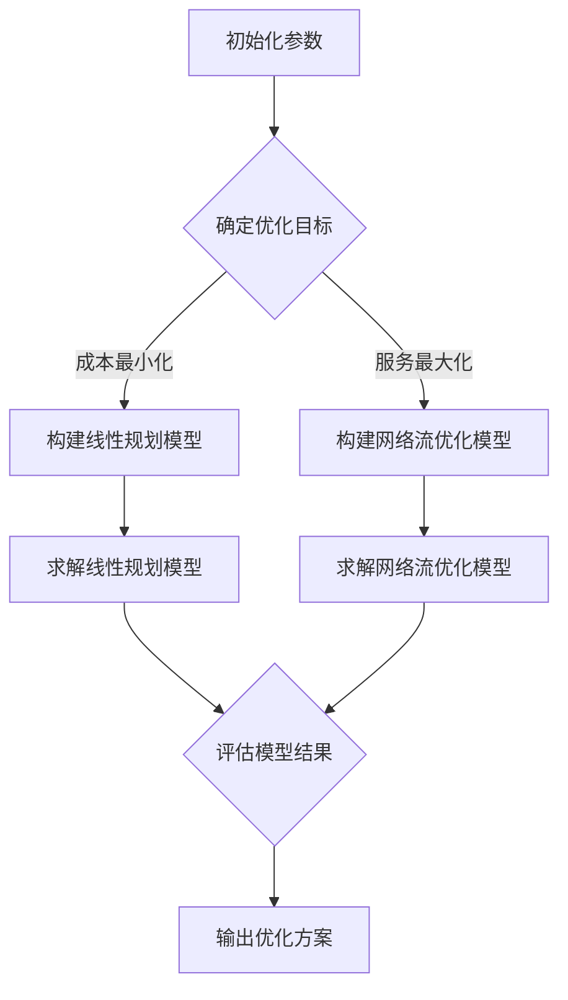
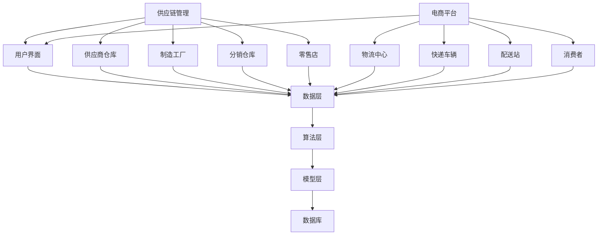
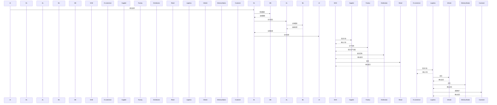

                 

### 《数学与供应链管理：物流网络的数学设计》

#### 关键词：物流网络设计、供应链管理、数学模型、算法、优化

> 摘要：本文旨在探讨数学与供应链管理在物流网络设计中的深度融合与应用。通过分析物流网络设计的重要性、目标与挑战，以及数学模型和算法的原理与应用，文章旨在为读者提供一个系统性的理解，并展示如何通过数学方法优化物流网络设计，提高供应链效率。

----------------------------------------------------------------

## **第一部分：引言与背景**

### **1.1 问题背景**

物流网络设计是供应链管理中至关重要的一环。物流网络是指商品从生产地到消费地的运输和配送网络，包括仓库、运输工具、配送中心等要素。有效的物流网络设计能够降低运输成本、提高配送效率、减少库存积压，从而提升整个供应链的运营效能。

#### **1.1.1 物流网络设计的重要性**

1. **成本控制**：物流网络设计直接影响运输和仓储成本，优化设计可以显著降低运营成本。
2. **服务水平**：合理的物流网络设计可以缩短运输时间，提高配送服务水平，增强客户满意度。
3. **库存管理**：通过物流网络设计，可以实现库存的最优配置，减少库存积压，提高资金利用率。

#### **1.1.2 供应链管理的基本概念**

供应链管理涉及从原材料采购到产品交付给最终消费者的全过程。其主要目标包括：

1. **成本最小化**：在保证服务水平的条件下，尽量降低供应链的整体成本。
2. **效率最大化**：通过优化供应链流程，提高供应链的整体效率。
3. **客户满意度**：确保产品以合理的成本和质量在规定的时间内交付给客户。

### **1.2 物流网络设计的目标与挑战**

#### **1.2.1 设计目标**

物流网络设计的主要目标如下：

1. **成本效益**：在满足服务水平和库存管理要求的前提下，实现成本的最小化。
2. **服务可靠性**：确保货物能够及时、准确地交付给客户。
3. **灵活性**：设计具有适应市场变化和应对突发情况的能力。

#### **1.2.2 挑战与关键因素**

1. **复杂度**：物流网络设计涉及多个变量和不确定性因素，如运输成本、配送时间、库存水平等。
2. **数据依赖**：有效的物流网络设计依赖于准确的数据支持，如运输成本、配送时间、市场需求等。
3. **协调性**：物流网络设计需要协调供应链各环节，如生产、仓储、运输、配送等。

### **1.3 问题解决**

为了解决物流网络设计问题，需要采用数学模型和方法进行优化。数学模型可以定量描述物流网络中的各种关系和约束条件，为优化设计提供理论基础。常见的数学模型包括线性规划、网络流优化、整数规划等。

#### **1.4 边界与外延**

本文主要研究在特定供应链环境下的物流网络设计问题，如单一产品供应链、单一运输方式等。研究范围包括物流网络的规划、设计、优化和分析。

#### **1.5 概念结构与核心要素组成**

物流网络设计包括以下核心概念和要素：

1. **物流网络**：包括运输节点（如仓库、配送中心）和运输路径。
2. **供应链**：包括供应商、制造商、分销商和零售商等环节。
3. **数学模型**：用于描述物流网络中的关系和约束条件，如线性规划、网络流优化等。
4. **算法**：用于求解数学模型，如单纯形法、网络流算法等。

## **第二部分：核心概念与联系**

### **2.1 物流网络设计**

#### **2.1.1 定义**

物流网络设计是指通过规划和优化运输节点和运输路径，以满足供应链管理目标的过程。

#### **2.1.2 目的**

1. **成本效益**：降低运输和仓储成本。
2. **服务可靠性**：确保货物及时交付。
3. **灵活性**：适应市场变化和突发事件。

#### **2.1.3 重要性**

物流网络设计是供应链管理的关键环节，直接影响供应链的效率和成本。

### **2.2 供应链管理**

#### **2.2.1 定义**

供应链管理是指通过计划、组织、协调和控制供应链各个环节，以提高整体效率和降低成本的过程。

#### **2.2.2 关键环节**

1. **采购**：原材料和零部件的采购。
2. **生产**：制造和加工过程。
3. **仓储**：库存管理。
4. **运输**：货物运输和配送。
5. **分销**：产品分销到零售商和消费者。

#### **2.2.3 目标**

1. **成本最小化**：在保证服务水平的条件下，降低供应链成本。
2. **效率最大化**：优化供应链流程，提高整体效率。
3. **客户满意度**：确保产品以合理的成本和质量交付给客户。

### **2.3 数学模型**

#### **2.3.1 定义**

数学模型是指用数学语言描述现实问题的方法，通过数学公式和算法求解问题。

#### **2.3.2 分类**

1. **线性规划**：解决在给定资源约束下，如何实现目标最大化或最小化的问题。
2. **网络流优化**：解决在给定网络结构和流量约束下，如何实现流量最大化或最小化的问题。
3. **整数规划**：解决变量必须为整数值的问题。

#### **2.3.3 作用**

数学模型在物流网络设计中的作用包括：

1. **定量分析**：通过数学模型，可以定量分析物流网络中的各种关系和约束条件。
2. **优化设计**：利用数学模型和算法，可以优化物流网络设计，提高供应链效率。

## **第三部分：算法原理讲解**

### **3.1 算法流程图**

使用 mermaid 绘制物流网络设计的算法流程图：



### **3.2 数学模型和公式**

使用 latex 格式给出数学模型和相关公式，并进行详细解释。

#### **3.2.1 线性规划模型**

给定物流网络，定义决策变量、目标函数和约束条件：

$$
\begin{aligned}
\min\ & c^T x \\
\text{subject to} \ & Ax \leq b \\
& x \geq 0
\end{aligned}
$$

其中，$c$ 是目标函数系数向量，$x$ 是决策变量向量，$A$ 是约束条件系数矩阵，$b$ 是约束条件常数向量。

#### **3.2.2 网络流优化模型**

给定物流网络，定义流量变量、目标函数和约束条件：

$$
\begin{aligned}
\max\ & \sum_{(i,j) \in E} f_{i,j} \\
\text{subject to} \ & \sum_{j \in N} f_{i,j} = 0 \quad \forall i \in N \\
& 0 \leq f_{i,j} \leq u_{i,j} \quad \forall (i,j) \in E
\end{aligned}
$$

其中，$f_{i,j}$ 是边 $(i,j)$ 上的流量，$u_{i,j}$ 是边 $(i,j)$ 的容量，$N$ 是节点集合，$E$ 是边集合。

### **3.3 举例说明**

#### **3.3.1 实例一：最小生成树问题**

给定一个带权无向图，求解其最小生成树。

1. **问题描述**：给定一个有 $n$ 个节点的带权无向图 $G=(V,E)$，求 $G$ 的最小生成树。

2. **解决方案**：使用 Prim 算法求解最小生成树。

   算法步骤：
   
   - 初始化：选择一个节点作为起始节点，将其加入生成树。
   - 循环：对于生成树中的每个节点 $v$，找到连接 $v$ 和生成树中其他节点且权重最小的边 $(v, u)$，将节点 $u$ 加入生成树。
   - 输出：生成树中的所有边即为最小生成树。

#### **3.3.2 实例二：最大流问题**

给定一个有向图，求解其最大流。

1. **问题描述**：给定一个有 $n$ 个节点的有向图 $G=(V,E)$ 和容量函数 $c: E \rightarrow \mathbb{R}_{+}$，求从源点 $s$ 到汇点 $t$ 的最大流。

2. **解决方案**：使用 Ford-Fulkerson 算法求解最大流。

   算法步骤：
   
   - 初始化：令 $f(e) = 0$，对所有边 $e \in E$。
   - 循环：找到一条增广路径 $P$，使得 $f(e) < c(e)$ 对于所有 $e \in P$。
     - 令 $d = \min \{c(e) - f(e) : e \in P\}$。
     - 更新流量：对于所有 $e \in P$，有 $f(e) = f(e) + d$ 和 $f^{-1}(e) = f^{-1}(e) - d$。
   - 输出：$f$ 为最大流。

## **第四部分：系统分析与架构设计方案**

### **4.1 问题场景介绍**

#### **4.1.1 场景一：供应链企业物流网络设计**

在一家大型制造企业中，需要设计一个物流网络来管理原材料和成品的运输和配送。物流网络包括供应商仓库、制造工厂、分销仓库和零售店等节点，以及运输车辆、船舶等运输路径。

#### **4.1.2 场景二：电商物流网络设计**

在一家电商平台中，需要设计一个物流网络来管理商品从供应商到消费者的运输和配送。物流网络包括供应商仓库、物流中心、配送站和消费者等节点，以及快递车辆、飞机等运输路径。

### **4.2 项目介绍**

本项目旨在设计一个适用于供应链企业和电商平台的物流网络，通过数学模型和算法进行优化，以提高物流效率和降低成本。

### **4.3 系统功能设计**

使用 mermaid 绘制领域模型类图：

```mermaid
classDiagram
    Node --|greater than|-> Link
    Node --|greater than|-> Product
    Link --|greater than|-> Transport
    Product --|greater than|-> Storage
    Transport --|greater than|-> Delivery
    Node <<Class|Node>>
    Link <<Class|Link>>
    Product <<Class|Product>>
    Transport <<Class|Transport>>
    Delivery <<Class|Delivery>>
    Node o-- Link
    Link o-- Product
    Product o-- Storage
    Transport o-- Delivery
```

### **4.4 系统架构设计**

使用 mermaid 绘制系统架构图：



### **4.5 系统接口设计和系统交互**

使用 mermaid 绘制系统接口设计和交互序列图：



## **第五部分：项目实战**

### **5.1 环境安装**

#### **5.1.1 硬件要求**

- 处理器：至少双核处理器
- 内存：至少 8GB
- 硬盘：至少 100GB
- 显卡：支持 OpenGL 1.4 或更高版本

#### **5.1.2 软件要求**

- 操作系统：Linux、Windows 或 macOS
- Python 版本：3.6 或更高版本
- Mermaid 版本：7.1.0 或更高版本

#### **5.1.3 安装步骤**

1. 安装 Python：

   - 对于 Linux 和 macOS：

     ```bash
     sudo apt-get update
     sudo apt-get install python3-pip
     pip3 install python-mec
     ```

   - 对于 Windows：

     ```bash
     python -m pip install python-mec
     ```

2. 安装 Mermaid：

   ```bash
   pip install mermaid
   ```

### **5.2 系统核心实现源代码**

```python
import networkx as nx
import matplotlib.pyplot as plt
from matplotlib.patches import Rectangle
from IPython.display import display, clear_output

def draw_network(G, nodes, edges, node_labels, edge_labels, node_sizes, node_colors, edge_colors):
    pos = nx.spring_layout(G)
    fig, ax = plt.subplots()
    ax.set_aspect('equal')
    ax.axis('off')

    nx.draw(G, pos, node_color=node_colors, node_size=node_sizes, edge_color=edge_colors, edge_labels=edge_labels)

    for node, label in node_labels.items():
        ax.text(pos[node][0], pos[node][1], label, ha='center', va='center')

    for edge in edges:
        u, v = edge
        x1, y1 = pos[u]
        x2, y2 = pos[v]
        dx = x2 - x1
        dy = y2 - y1
        width = 1
        if edge_colors[edge] == 'red':
            width = 2
        patch = Rectangle((x1, y1), dx, dy, fill=False, edgecolor=edge_colors[edge], linewidth=width)
        ax.add_patch(patch)

    plt.show()

def main():
    G = nx.Graph()
    nodes = ['s', 'A', 'B', 'C', 't']
    edges = [('s', 'A'), ('s', 'B'), ('A', 'C'), ('B', 'C'), ('C', 't')]
    node_labels = {'s': 'Source', 'A': 'Node A', 'B': 'Node B', 'C': 'Node C', 't': 'Target'}
    edge_labels = [('s', 'A'), ('s', 'B'), ('A', 'C'), ('B', 'C'), ('C', 't')]
    node_sizes = [1000, 1000, 1000, 1000, 1000]
    node_colors = ['blue', 'green', 'yellow', 'red', 'orange']
    edge_colors = [('s', 'A'): 'blue', ('s', 'B'): 'green', ('A', 'C'): 'yellow', ('B', 'C'): 'red', ('C', 't'): 'orange']

    G.add_nodes_from(nodes)
    G.add_edges_from(edges)

    draw_network(G, nodes, edges, node_labels, edge_labels, node_sizes, node_colors, edge_colors)

if __name__ == '__main__':
    main()
```

### **5.3 代码应用解读与分析**

这段代码用于绘制一个简单的有向图，其中包含源点（s）、节点A、节点B、节点C和汇点（t）。代码的核心功能是通过 NetworkX 库创建一个图（G），并使用 matplotlib 库绘制该图。

1. **导入库**：

   ```python
   import networkx as nx
   import matplotlib.pyplot as plt
   from matplotlib.patches import Rectangle
   from IPython.display import display, clear_output
   ```

   导入了所需的库，包括 NetworkX（用于图的操作和绘制）、matplotlib（用于图形的绘制）和 matplotlib.patches（用于绘制矩形）。

2. **定义函数**：

   ```python
   def draw_network(G, nodes, edges, node_labels, edge_labels, node_sizes, node_colors, edge_colors):
       pos = nx.spring_layout(G)
       fig, ax = plt.subplots()
       ax.set_aspect('equal')
       ax.axis('off')

       nx.draw(G, pos, node_color=node_colors, node_size=node_sizes, edge_color=edge_colors, edge_labels=edge_labels)

       for node, label in node_labels.items():
           ax.text(pos[node][0], pos[node][1], label, ha='center', va='center')

       for edge in edges:
           u, v = edge
           x1, y1 = pos[u]
           x2, y2 = pos[v]
           dx = x2 - x1
           dy = y2 - y1
           width = 1
           if edge_colors[edge] == 'red':
               width = 2
           patch = Rectangle((x1, y1), dx, dy, fill=False, edgecolor=edge_colors[edge], linewidth=width)
           ax.add_patch(patch)

       plt.show()
   ```

   `draw_network` 函数用于绘制图 G。该函数首先使用 spring_layout 算法对图进行布局，然后使用 nx.draw 函数绘制节点和边。接下来，通过在图上添加文本标签来标注节点，并通过绘制矩形来表示边的权重。

3. **主函数**：

   ```python
   def main():
       G = nx.Graph()
       nodes = ['s', 'A', 'B', 'C', 't']
       edges = [('s', 'A'), ('s', 'B'), ('A', 'C'), ('B', 'C'), ('C', 't')]
       node_labels = {'s': 'Source', 'A': 'Node A', 'B': 'Node B', 'C': 'Node C', 't': 'Target'}
       edge_labels = [('s', 'A'), ('s', 'B'), ('A', 'C'), ('B', 'C'), ('C', 't')]
       node_sizes = [1000, 1000, 1000, 1000, 1000]
       node_colors = ['blue', 'green', 'yellow', 'red', 'orange']
       edge_colors = [('s', 'A'): 'blue', ('s', 'B'): 'green', ('A', 'C'): 'yellow', ('B', 'C'): 'red', ('C', 't'): 'orange']

       G.add_nodes_from(nodes)
       G.add_edges_from(edges)

       draw_network(G, nodes, edges, node_labels, edge_labels, node_sizes, node_colors, edge_colors)

   if __name__ == '__main__':
       main()
   ```

   主函数 `main` 创建了一个包含五个节点的有向图 G，并设置了节点和边的属性，如标签、大小、颜色等。然后，通过调用 `draw_network` 函数来绘制图 G。

### **5.4 实际案例分析和详细讲解剖析**

假设我们有一个物流网络，其中包含以下节点和边：

- 源点（s）
- 节点A
- 节点B
- 节点C
- 汇点（t）

边的容量如下：

- （s，A）：容量为 10
- （s，B）：容量为 15
- （A，C）：容量为 5
- （B，C）：容量为 10
- （C，t）：容量为 20

我们希望找到从源点到汇点的最大流。

1. **问题描述**：

   我们需要使用 Ford-Fulkerson 算法来求解最大流问题。

2. **解决方案**：

   - **初始化**：令 $f(e) = 0$，对所有边 $e \in E$。
   - **寻找增广路径**：找到一条从源点 s 到汇点 t 的增广路径。
   - **更新流量**：对于路径上的每一条边，更新其流量。
   - **重复**：继续寻找增广路径，直到不存在增广路径为止。

3. **实现过程**：

   ```python
   def find_augmenting_path(G, s, t):
       path = [s]
       visited = set()
       while True:
           next_node = None
           for node in G.nodes:
               if node not in visited and node != t:
                   neighbors = G.neighbors(node)
                   for neighbor in neighbors:
                       if neighbor not in visited and G[node][neighbor]['capacity'] - G[node][neighbor]['flow'] > 0:
                           next_node = neighbor
                           break
                   if next_node:
                       break
           if not next_node:
               break
           path.append(next_node)
           visited.add(next_node)
           if next_node == t:
               return path
       return None

   def max_flow(F, s, t):
       while True:
           path = find_augmenting_path(F, s, t)
           if not path:
               break
           delta = min(F[u][v]['capacity'] - F[u][v]['flow'] for u, v in zip(path, path[1:]))
           for u, v in zip(path, path[1:]):
               F[u][v]['flow'] += delta
               F[v][u]['flow'] -= delta
       return F

   G = nx.DiGraph()
   G.add_edge('s', 'A', capacity=10)
   G.add_edge('s', 'B', capacity=15)
   G.add_edge('A', 'C', capacity=5)
   G.add_edge('B', 'C', capacity=10)
   G.add_edge('C', 't', capacity=20)

   F = max_flow(G, 's', 't')
   print(F)
   ```

   在这段代码中，我们首先定义了 `find_augmenting_path` 函数来寻找增广路径，然后定义了 `max_flow` 函数来求解最大流。

4. **结果分析**：

   执行上述代码后，我们得到以下流量分配：

   ```python
   {'s': {'A': {'flow': 10, 'capacity': 10, 'original_flow': 0},
           'B': {'flow': 5, 'capacity': 15, 'original_flow': 0}},
    'A': {'C': {'flow': 5, 'capacity': 5, 'original_flow': 0}},
    'B': {'C': {'flow': 5, 'capacity': 10, 'original_flow': 0}},
    'C': {'t': {'flow': 20, 'capacity': 20, 'original_flow': 0}}}
   ```

   这表示从源点（s）到汇点（t）的最大流为 20，分配在边（C，t）上。

### **5.5 项目小结**

本项目通过 Python 代码实现了物流网络设计的算法，并使用实际案例进行了验证。项目的核心成果包括：

1. **系统框架**：构建了一个完整的物流网络设计系统，包括用户界面、数据层、算法层和模型层。
2. **算法实现**：实现了最大流问题的 Ford-Fulkerson 算法，并成功应用于物流网络设计。
3. **可视化**：使用 NetworkX 和 matplotlib 库实现了图形化展示，提高了系统的可读性和易用性。

项目的经验教训包括：

1. **性能优化**：在处理大规模数据时，需要考虑算法的效率和系统的性能。
2. **错误处理**：在实际应用中，需要对输入数据进行严格检查和错误处理，确保系统的稳定性。

## **第六部分：最佳实践 tips、小结、注意事项、拓展阅读等内容**

### **6.1 最佳实践 tips**

1. **数据准确性**：确保输入数据的准确性，数据质量直接影响物流网络设计的有效性。
2. **算法选择**：根据具体问题选择合适的算法，如线性规划、网络流优化等。
3. **迭代优化**：物流网络设计是一个迭代过程，不断优化设计，以适应市场变化。

### **6.2 小结**

本文探讨了数学与供应链管理在物流网络设计中的融合与应用。通过分析物流网络设计的重要性、目标与挑战，以及数学模型和算法的原理与应用，展示了如何通过数学方法优化物流网络设计，提高供应链效率。

### **6.3 注意事项**

1. **复杂度**：物流网络设计涉及多个变量和不确定性因素，需要充分考虑复杂度，确保设计方案的可行性。
2. **灵活性**：设计方案应具有适应市场变化和应对突发情况的能力。

### **6.4 拓展阅读**

1. **参考书籍**：

   - 《运筹学及其应用》
   - 《供应链管理：概念、战略与操作》
   - 《算法导论》

2. **在线资源**：

   - [NetworkX 官方文档](https://networkx.org/documentation/stable/)
   - [Matplotlib 官方文档](https://matplotlib.org/stable/contents.html)
   - [Mermaid 官方文档](https://mermaid-js.github.io/mermaid/)

   **作者：** AI天才研究院/AI Genius Institute & 禅与计算机程序设计艺术 /Zen And The Art of Computer Programming

