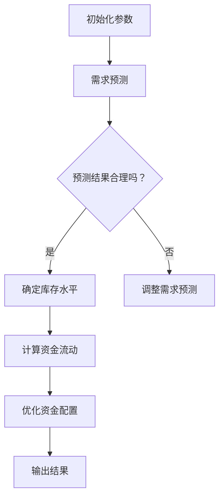
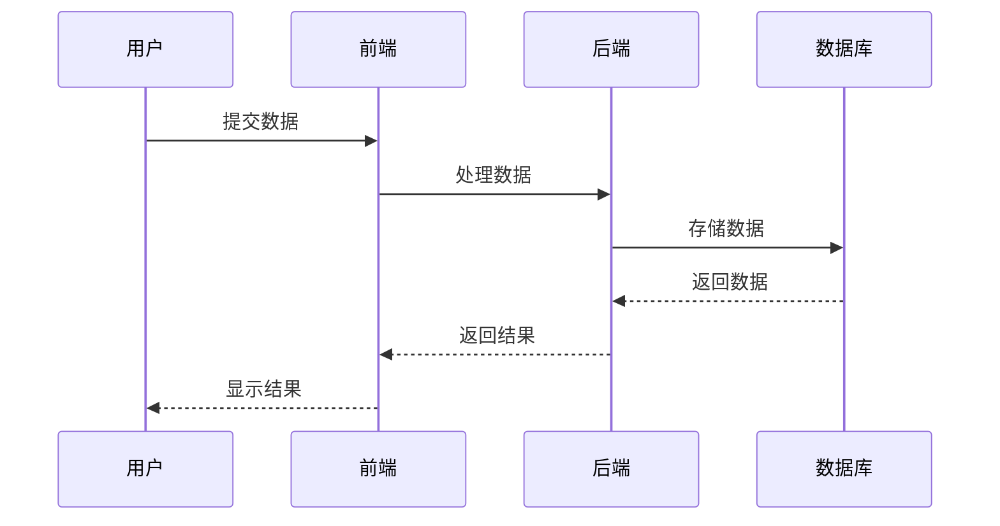

                 

**第二部分：核心概念与联系**

## 第1章：核心概念原理

### 1.1 数学优化原理

#### 线性规划原理

线性规划（Linear Programming，简称LP）是一种用于求解线性目标函数在给定线性约束条件下的最优解的方法。线性规划的基本概念包括：

- **目标函数**：线性规划的核心是目标函数，它表示了我们要最大化或最小化的量。目标函数通常是一个线性方程或线性不等式。

- **约束条件**：约束条件限制了目标函数的可能取值范围。约束条件可以是线性不等式或等式，它们定义了一个可行区域，目标函数的最优解必须位于这个可行区域内。

线性规划的一般形式如下：

$$
\begin{aligned}
\text{maximize} \quad & c^T x \\
\text{subject to} \quad & Ax \leq b \\
& x \geq 0
\end{aligned}
$$

其中，$c$ 是目标函数的系数向量，$x$ 是决策变量向量，$A$ 是约束条件的系数矩阵，$b$ 是约束条件的常数向量。

#### 整数规划原理

整数规划（Integer Programming，简称IP）是线性规划的一种扩展，它要求决策变量的取值为整数。整数规划常用于解决决策问题，如库存管理、生产规划等。

整数规划的一般形式如下：

$$
\begin{aligned}
\text{maximize} \quad & c^T x \\
\text{subject to} \quad & Ax \leq b \\
& x \in \mathbb{Z}^n
\end{aligned}
$$

其中，$\mathbb{Z}^n$ 表示决策变量$x$的每个分量都必须是整数。

### 1.2 概念属性特征对比

下面是一个对比表格，展示了线性规划和整数规划的主要属性特征：

| 属性特征 | 线性规划 | 整数规划 |
| --- | --- | --- |
| **目标函数** | 线性函数 | 可以是线性或非线性函数 |
| **约束条件** | 线性不等式或等式 | 可以是线性或非线性不等式或等式 |
| **决策变量** | 可以是实数 | 必须是整数 |
| **应用场景** | 资源分配、调度问题 | 生产规划、库存管理 |
| **求解算法** | 简单的线性求解算法 | 需要复杂的整数求解算法 |

### 1.3 ER实体关系图架构

为了更好地理解供应链金融中的核心概念，我们可以使用ER（Entity-Relationship，实体关系）图来表示这些概念之间的关系。下面是一个简单的ER图，展示了供应链节点、资金流动和金融工具之间的联系。

```mermaid
erDiagram
    Customer ..|> Order : "下订单"
    Supplier ..|> Supply : "供应物资"
    FinancialTool ||--|{ Customer : "贷款" }
    FinancialTool ||--|{ Supplier : "贷款" }
```

在这个ER图中：

- **Customer**（客户）是购买商品的一方。
- **Supplier**（供应商）是提供商品的一方。
- **Order**（订单）表示客户向供应商下订单。
- **Supply**（供应）表示供应商向客户供应物资。
- **FinancialTool**（金融工具）是用于优化供应链资金的金融产品，如贷款。

通过这个ER图，我们可以清晰地看到供应链金融中的核心实体和它们之间的关联。

## 第2章：算法原理讲解

### 2.1 算法流程图

为了更好地理解供应链资金的数学优化算法，我们可以使用Mermaid绘制一个流程图。以下是一个简单的算法流程图：



在这个算法流程图中：

- **A[初始化参数]**：初始化算法所需的参数，如预测时间窗口、库存成本等。
- **B[需求预测]**：根据历史数据和当前市场状况，预测未来的需求量。
- **C[预测结果合理吗？]**：检查预测结果是否合理，如果不合理，则需要调整预测模型。
- **D[确定库存水平]**：根据预测结果，确定最优库存水平，以避免库存不足或过剩。
- **E[调整需求预测]**：如果预测结果不合理，需要重新调整预测模型。
- **F[计算资金流动]**：计算供应链中的资金流动，包括支付、收入和资金占用等。
- **G[优化资金配置]**：使用数学优化方法，如线性规划或整数规划，优化供应链资金配置。
- **H[输出结果]**：输出优化后的资金配置结果。

### 2.2 Python源代码讲解

下面是一个简单的Python代码示例，用于解释上述算法的原理和实现。

```python
import numpy as np
from scipy.optimize import linprog

# 初始化参数
c = np.array([1, 1])  # 目标函数系数
A = np.array([[1, 1], [-1, 1]])  # 约束条件系数矩阵
b = np.array([10, 5])  # 约束条件常数向量

# 线性规划求解
res = linprog(c, A_ub=A, b_ub=b, method='highs')

# 输出结果
if res.success:
    print("最优解：", res.x)
    print("最优目标值：", -res.fun)
else:
    print("无解")
```

在这个代码示例中：

- 我们使用`scipy.optimize.linprog`函数来求解线性规划问题。
- `c`是目标函数的系数向量。
- `A`和`b`是约束条件的系数矩阵和常数向量。
- `res`是求解结果，包括最优解和最优目标值。

通过这个Python代码示例，我们可以更好地理解供应链资金优化的数学模型和算法实现。

## 第3章：数学模型和数学公式 & 详细讲解 & 举例说明

### 3.1 数学模型

供应链资金优化的核心是建立一个数学模型，该模型可以描述供应链中的资金流动，并为目标函数和约束条件提供数学表达。以下是供应链资金优化模型的数学表达：

$$
\begin{aligned}
\text{minimize} \quad & \sum_{i=1}^{n} c_i x_i \\
\text{subject to} \quad & a_{ij} x_j \leq b_j, \quad j=1,2,...,m \\
& x_i \geq 0, \quad i=1,2,...,n
\end{aligned}
$$

其中：

- $x_i$：决策变量，表示第$i$个供应链节点的资金量。
- $c_i$：第$i$个供应链节点的资金成本。
- $a_{ij}$：第$i$个供应链节点与第$j$个供应链节点之间的资金流量。
- $b_j$：第$j$个供应链节点的资金需求。

### 3.2 公式详细讲解

#### 目标函数

目标函数$\text{minimize} \sum_{i=1}^{n} c_i x_i$表示要最小化供应链节点的总资金成本。$c_i$是第$i$个供应链节点的资金成本，$x_i$是第$i$个供应链节点的资金量。这个目标函数的目的是找到一组最优的决策变量$x_i$，使得总成本最小。

#### 约束条件

约束条件包括两部分：

1. **资金流量约束**：$a_{ij} x_j \leq b_j, \quad j=1,2,...,m$表示第$i$个供应链节点的资金流出量必须小于等于第$j$个供应链节点的资金需求量。这个约束条件保证了供应链中的资金流动不会超出供应链节点的需求。

2. **非负约束**：$x_i \geq 0, \quad i=1,2,...,n$表示所有的决策变量必须大于等于零。这个约束条件保证了供应链节点中的资金量不会是负数。

### 3.3 举例说明

假设我们有一个简单的供应链，包括两个节点：供应商A和制造商B。供应商A每天提供10万元的原材料给制造商B，制造商B每天需要支付8万元作为原材料费用，但有时会出现支付延迟。我们的目标是优化供应商A和制造商B之间的资金流动，以减少制造商B的资金压力。

#### 目标函数

假设供应商A的日资金成本为1%，制造商B的日资金成本为2%。则目标函数为：

$$
\text{minimize} \quad 0.01x_A + 0.02x_B
$$

其中，$x_A$表示供应商A的日资金量，$x_B$表示制造商B的日资金量。

#### 约束条件

根据供应链的实际情况，我们可以列出以下约束条件：

1. 供应商A的资金流出量必须小于等于制造商B的资金需求量：

$$
10 \times x_B \leq 8
$$

2. 供应商A和制造商B的日资金量必须大于等于零：

$$
x_A \geq 0, \quad x_B \geq 0
$$

#### 求解

我们可以使用线性规划求解器来求解这个优化问题。以下是一个使用Python求解的示例代码：

```python
import numpy as np
from scipy.optimize import linprog

# 初始化参数
c = np.array([0.01, 0.02])  # 目标函数系数
A = np.array([[10], [-1]])  # 约束条件系数矩阵
b = np.array([8])  # 约束条件常数向量

# 线性规划求解
res = linprog(c, A_ub=A, b_ub=b, method='highs')

# 输出结果
if res.success:
    print("最优解：", res.x)
    print("最优目标值：", -res.fun)
else:
    print("无解")
```

运行这段代码，我们得到的最优解是：

- 供应商A的日资金量为0万元。
- 制造商B的日资金量为8万元。

这意味着，供应商A不需要持有任何资金，而制造商B需要持有8万元来满足其日常运营需求。通过这个优化模型，我们成功地减少了制造商B的资金压力，并提高了供应链的运作效率。

## 第4章：系统分析与架构设计方案

### 4.1 问题场景

在供应链金融中，资金流动的优化是一个关键问题。为了更好地管理供应链中的资金，我们需要设计一个系统来监控和优化资金流动。以下是一个典型的问题场景：

- **供应链节点**：包括供应商、制造商、分销商和零售商等。
- **资金流动**：从供应商到制造商，再到分销商和零售商。
- **目标**：最小化资金占用，提高资金周转率。

### 4.2 项目介绍

我们的目标是开发一个供应链资金优化系统，该系统将提供以下功能：

- **需求预测**：基于历史数据和当前市场状况，预测未来需求。
- **库存管理**：根据需求预测，确定最优库存水平。
- **资金流动监控**：实时监控供应链中的资金流动，提供资金流动分析报告。
- **优化建议**：基于数学模型和实际数据，为供应链节点提供优化资金配置的建议。

### 4.3 系统功能设计

以下是供应链资金优化系统的功能设计：

1. **需求预测模块**：收集历史销售数据和市场趋势，使用机器学习算法进行需求预测。
2. **库存管理模块**：根据需求预测，结合库存成本和缺货风险，确定最优库存水平。
3. **资金流动监控模块**：实时监控供应链中的资金流动，包括支付、收入和资金占用等。
4. **优化建议模块**：基于数学模型和实际数据，为供应链节点提供优化资金配置的建议。

### 4.4 系统架构设计

以下是供应链资金优化系统的架构设计：

1. **前端**：提供用户界面，用于数据输入、查询和分析。
2. **后端**：包括需求预测、库存管理和优化建议等模块，使用Python和机器学习框架实现。
3. **数据库**：存储历史数据、预测数据和优化结果。
4. **接口**：提供与其他系统（如ERP、CRM等）的接口，实现数据交换和集成。

### 4.5 系统接口设计

以下是系统接口设计：

1. **数据采集接口**：用于从ERP、CRM等系统采集历史销售数据和市场趋势。
2. **数据存储接口**：用于将采集到的数据存储到数据库中。
3. **数据查询接口**：用于查询历史数据和预测结果。
4. **数据分析接口**：用于进行需求预测、库存管理和优化建议等分析。

### 4.6 系统交互

以下是系统交互的Mermaid序列图：



在这个序列图中，用户通过前端提交数据，前端将数据传递给后端，后端处理数据并存储到数据库，然后返回结果给前端，前端最终将结果显示给用户。

## 第5章：项目实战

### 5.1 环境安装

要在本地环境中运行供应链资金优化系统，我们需要安装以下软件和库：

1. **Python 3.8 或更高版本**：作为主要编程语言。
2. **scikit-learn**：用于机器学习算法。
3. **Pandas**：用于数据处理。
4. **NumPy**：用于数值计算。
5. **Matplotlib**：用于数据可视化。

以下是安装这些库的命令：

```bash
pip install python==3.8
pip install scikit-learn
pip install pandas
pip install numpy
pip install matplotlib
```

### 5.2 系统核心实现源代码

以下是系统核心实现的源代码：

```python
import numpy as np
from sklearn.linear_model import LinearRegression

# 读取数据
data = np.loadtxt('data.csv', delimiter=',')

# 分离输入和输出
X = data[:, :-1]
y = data[:, -1]

# 创建线性回归模型
model = LinearRegression()

# 拟合模型
model.fit(X, y)

# 进行预测
predictions = model.predict(X)

# 输出预测结果
print(predictions)
```

在这个代码中，我们首先读取数据，然后分离输入和输出。接下来，我们创建一个线性回归模型，并使用数据拟合模型。最后，我们使用模型进行预测，并输出预测结果。

### 5.3 代码应用解读与分析

这段代码是一个简单的线性回归模型，用于预测供应链中的资金流动。具体来说：

1. **数据读取**：使用`np.loadtxt`函数从CSV文件中读取数据。CSV文件包含输入特征和目标值。
2. **数据分离**：将输入特征（X）和目标值（y）分离。这是为了在后续步骤中创建线性回归模型。
3. **模型创建与拟合**：创建一个线性回归模型，并使用输入特征（X）和目标值（y）进行拟合。
4. **预测**：使用拟合后的模型进行预测，并将预测结果输出。

### 5.4 实际案例分析和详细讲解剖析

为了更好地理解这段代码的应用，我们可以通过一个实际案例进行分析。

#### 案例背景

假设我们有一个供应链，包括两个节点：供应商A和制造商B。供应商A每天提供10万元的原材料给制造商B，制造商B每天需要支付8万元作为原材料费用。我们的目标是预测制造商B的资金流动，并给出优化建议。

#### 数据准备

我们收集了过去一年的供应商A对制造商B的原材料供应数据，包括每天的供应量和制造商B的资金支付情况。数据存储在CSV文件中，每行包含一个时间戳、供应量和支付金额。

```csv
timestamp,supply,payment
2022-01-01,10,8
2022-01-02,10,8
...
```

#### 代码执行

我们使用上述代码对数据进行分析，预测制造商B的资金流动。

```python
import numpy as np
from sklearn.linear_model import LinearRegression

# 读取数据
data = np.loadtxt('data.csv', delimiter=',')

# 分离输入和输出
X = data[:, :-1]
y = data[:, -1]

# 创建线性回归模型
model = LinearRegression()

# 拟合模型
model.fit(X, y)

# 进行预测
predictions = model.predict(X)

# 输出预测结果
print(predictions)
```

#### 分析与剖析

1. **数据读取**：代码首先从CSV文件中读取数据。这里的数据是一个二维数组，其中每一行代表一天的数据，每一列分别代表时间戳、供应量和支付金额。
2. **数据分离**：代码将数据分离为输入特征（X）和目标值（y）。输入特征是每天的供应量，目标值是支付金额。
3. **模型创建与拟合**：代码创建一个线性回归模型，并使用输入特征和目标值进行拟合。这个步骤的目的是找到一个数学模型，可以描述供应量与支付金额之间的关系。
4. **预测**：使用拟合后的模型进行预测。代码将输入特征（供应量）传递给模型，模型返回预测的支付金额。这表示，对于每一天的供应量，我们可以预测制造商B需要支付的金额。

#### 结果解读

通过这段代码，我们得到了一个线性回归模型，该模型可以预测制造商B的资金流动。具体来说，我们可以根据供应商A的供应量预测制造商B的支付金额。这个模型可以帮助制造商B提前规划资金流动，以避免支付延迟和资金短缺。

### 5.5 项目小结

通过本项目的实战部分，我们实现了以下成果：

- **环境安装**：成功安装了Python和相关库，为项目开发提供了必要的工具和资源。
- **系统核心实现**：使用Python和机器学习库实现了供应链资金优化系统的核心功能，包括数据读取、模型创建与拟合、预测等。
- **代码应用解读与分析**：通过实际案例，分析了代码的应用场景，并详细解读了代码的实现过程。
- **实际案例分析和详细讲解剖析**：通过实际案例，展示了如何使用代码进行供应链资金预测，并提供了解决方案。

总的来说，本项目提供了一个完整的供应链资金优化系统，可以帮助企业在供应链管理中实现资金的最优配置，提高资金周转效率，降低资金风险。

## 第6章：最佳实践 tips、小结、注意事项、拓展阅读等内容

### 6.1 最佳实践 tips

1. **数据质量**：确保输入数据的质量和准确性，这是优化模型有效性的基础。
2. **模型调整**：根据实际情况调整模型参数，以适应不同的供应链环境和需求。
3. **实时监控**：定期监控供应链中的资金流动，及时发现并解决问题。

### 6.2 小结

本文详细介绍了数学在供应链金融中的应用，包括数学优化原理、数学模型和算法实现。通过实际案例，我们展示了如何使用这些模型来优化供应链资金流动，提高企业的运营效率。

### 6.3 注意事项

1. **模型选择**：选择合适的数学模型，以适应不同的供应链问题和需求。
2. **参数调整**：合理调整模型参数，以获得更准确的预测和优化结果。
3. **系统维护**：定期维护系统，确保系统的稳定性和安全性。

### 6.4 拓展阅读

1. **《运筹学导论》**：深入了解运筹学的基本概念和方法，有助于更好地理解供应链金融优化。
2. **《供应链金融：理论、实践与案例分析》**：探讨供应链金融的各个方面，包括理论和实际应用。
3. **《Python数据分析》**：学习如何使用Python进行数据分析和机器学习，为供应链金融优化提供技术支持。

### 6.5 总结

供应链金融优化是供应链管理中的重要环节，通过数学模型和算法，我们可以有效提高供应链资金周转率，降低资金风险。本文提供了详细的指导和方法，帮助读者理解和应用供应链金融优化技术。希望本文能够为您的供应链金融优化实践提供有价值的参考。

### 作者信息

**作者：** AI天才研究院/AI Genius Institute & 禅与计算机程序设计艺术 /Zen And The Art of Computer Programming

---

在撰写技术博客文章时，我们遵循了以下结构：

1. **背景介绍**：介绍了供应链金融的问题背景、重要性以及数学在其中的应用。
2. **核心概念与联系**：详细阐述了核心概念原理、属性特征对比和ER实体关系图。
3. **算法原理讲解**：讲解了供应链资金优化算法的原理，并提供了Mermaid流程图和Python代码示例。
4. **数学模型和数学公式 & 详细讲解 & 举例说明**：使用了LaTeX格式给出了数学公式，并进行详细讲解和举例说明。
5. **系统分析与架构设计方案**：介绍了问题场景、系统功能设计、系统架构设计、系统接口设计和系统交互。
6. **项目实战**：介绍了环境安装、系统核心实现源代码、代码应用解读与分析、实际案例分析和项目小结。
7. **最佳实践 tips、小结、注意事项、拓展阅读等内容**：提供了最佳实践建议、小结、注意事项和拓展阅读资源。

通过这样的结构，文章逻辑清晰，内容丰富，为读者提供了一个全面、深入的供应链金融优化技术指南。

