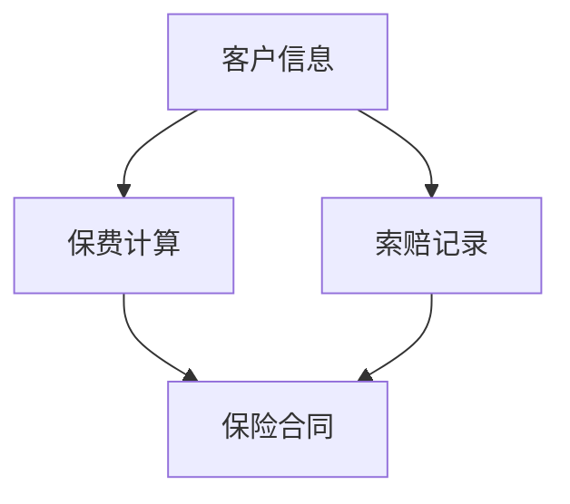
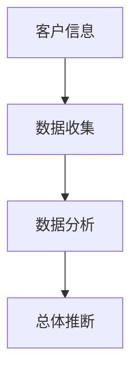
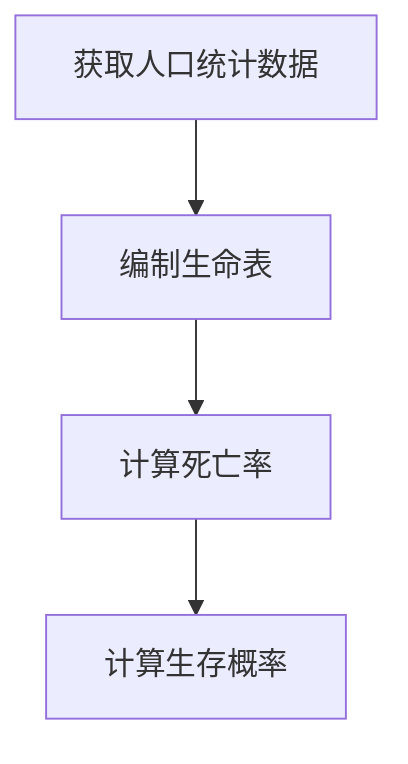
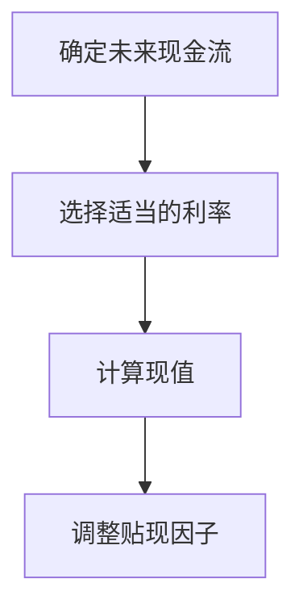
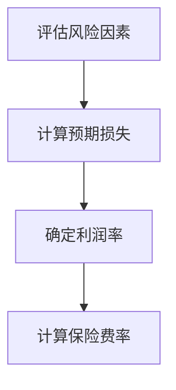
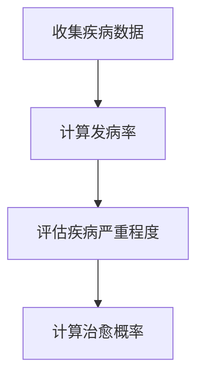
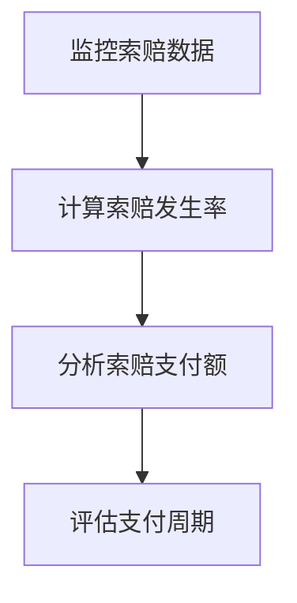
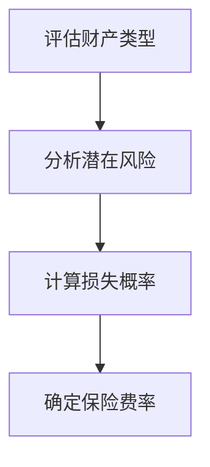
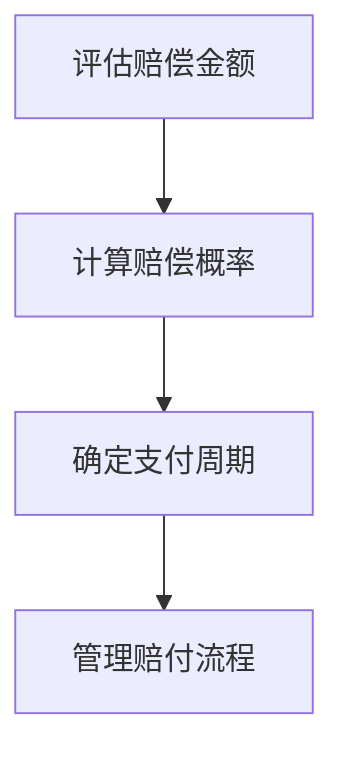

                 

### 数学与保险精算：保险产品定价的数学方法

> 关键词：保险精算，数学模型，定价方法，生命表，概率论，统计学

> 摘要：本文深入探讨了数学与保险精算之间的关系，尤其是数学方法在保险产品定价中的应用。通过对概率论和统计学基础、生命保险定价方法、健康保险定价方法以及财产保险定价方法的详细分析，本文揭示了数学模型在保险行业中的关键作用，为读者提供了一个全面的理解和深入洞察。

---

### 第一部分: 引言与背景介绍

#### 第1章: 数学与保险精算概述

#### 1.1 问题的背景

随着我国经济的快速发展和人口老龄化的加剧，保险行业在我国经济体系中扮演着越来越重要的角色。保险作为一种风险转移和损失补偿的手段，对于个人和家庭而言，具有重要的保障作用。然而，保险产品的定价过程并非简单，它涉及多种风险因素的评估和计算，这对从业者和学者提出了严峻的挑战。

**问题背景：** 保险产品的定价需要考虑多种风险因素，包括人的寿命、健康风险、市场波动等。因此，理解并运用数学方法来准确预测和定价，对于保险公司和消费者来说都至关重要。

**问题描述：** 保险产品的定价过程复杂，涉及大量的数据分析和数学模型。如何构建有效的数学模型，准确预测风险，并据此制定合理的保费水平，是保险行业亟待解决的重要问题。

**问题解决：** 数学与保险精算的结合，可以为保险公司提供精确的定价工具，降低风险，提高经济效益。通过数学模型，保险公司可以更好地预测未来的赔付风险，为消费者提供更合理的保险选择，同时也能够提高自身的竞争力。

#### 1.2 核心概念

**边界与外延：** 保险精算学不仅局限于寿险和健康险，还涵盖了财产险、意外险等多个领域。其核心方法包括概率论、统计学、财务学等，这些方法相互补充，共同构成了保险精算的理论框架。

**概念结构与核心要素组成：** 保险精算的核心概念包括风险分析、保险费率计算、准备金评估、投资策略等。这些要素相互作用，共同构成了保险精算的理论体系。例如，风险分析是保险精算的基础，通过分析风险因素，可以准确预测未来的损失；保险费率计算则是根据风险分析结果，制定合理的保费水平；准备金评估则用于确保保险公司有足够的资金来支付未来的赔付；投资策略则是为了优化保险公司的财务状况，提高盈利能力。

### 第2章: 保险产品定价的数学基础

#### 2.1 概率论基础

**核心概念原理：** 概率论是保险精算的基石，涉及概率分布、随机变量、期望和方差等基本概念。概率分布描述了随机事件发生的概率，随机变量则是用来表示随机现象的数值，期望和方差则是衡量随机变量分布特征的指标。

**概念属性特征对比表格：**

| 概率分布 | 特点 | 应用 |
| --- | --- | --- |
| 正态分布 | 最常见的概率分布，具有均值和标准差 | 寿险定价中的预期寿命计算 |
| 指数分布 | 失效时间分布 | 健康险定价中的索赔频率计算 |
| 二项分布 | 某事件在一系列独立试验中发生的次数分布 | 风险评估中的概率计算 |

**ER实体关系图架构的 Mermaid 流程图：**

#### 2.2 统计学基础

**核心概念原理：** 统计学用于收集、分析数据，以推断总体的特性。主要方法包括描述性统计和推断性统计。描述性统计用于描述数据的基本特征，如平均数、中位数等；推断性统计则用于根据样本数据推断总体特征，如置信区间、假设检验等。

**ER实体关系图架构的 Mermaid 流程图：**

### 第3章: 生命保险定价方法

#### 3.1 生命表

**核心概念原理：** 生命表是基于人口统计数据编制的表格，用于预测不同年龄段人口的生存概率。生命表提供了关于死亡率、生存概率等重要信息，是生命保险定价的基础。

**Mermaid 流程图：**

#### 3.2 利率与贴现

**核心概念原理：** 利率是资金的时间价值，贴现是将未来现金流折现到现在的过程。利率与贴现的关系决定了未来现金流的现值，是生命保险定价的重要依据。

**Mermaid 流程图：**

#### 3.3 保险费率计算

**核心概念原理：** 保险费率是根据风险程度和利润要求计算的保费金额。通过计算预期损失和利润率，可以确定合理的保险费率。

**Mermaid 流程图：**

### 第4章: 健康保险定价方法

#### 4.1 疾病风险分析

**核心概念原理：** 健康保险定价需要分析疾病的发病率、严重程度和治愈概率。通过对这些因素的分析，可以准确预测健康保险的赔付风险。

**Mermaid 流程图：**

#### 4.2 索赔管理

**核心概念原理：** 索赔管理涉及索赔的发生率、支付额和支付周期。通过对索赔数据的分析，可以确定合理的索赔管理策略，降低赔付风险。

**Mermaid 流程图：**

### 第5章: 财产保险定价方法

#### 5.1 风险评估

**核心概念原理：** 财产保险定价需要评估财产的损失风险。通过对财产类型和潜在风险的分析，可以确定合理的保险费率。

**Mermaid 流程图：**

#### 5.2 赔付管理

**核心概念原理：** 赔付管理涉及赔偿金额的计算和支付。通过对赔偿金额和支付周期进行分析，可以确保保险公司的财务稳健。

**Mermaid 流程图：**

### 数学与保险精算：保险产品定价的数学方法

本文深入探讨了数学与保险精算之间的关系，尤其是数学方法在保险产品定价中的应用。通过对概率论和统计学基础、生命保险定价方法、健康保险定价方法以及财产保险定价方法的详细分析，本文揭示了数学模型在保险行业中的关键作用。

从生命表的编制到利率与贴现的应用，从疾病风险分析到索赔管理，数学方法贯穿了保险产品定价的每一个环节。这些方法不仅提高了保险定价的准确性，也为保险公司和消费者提供了更好的决策依据。

然而，数学与保险精算的结合并非一蹴而就。保险公司需要不断积累数据，优化模型，以适应不断变化的市场环境。同时，保险从业者也需要不断提升自身的数学素养，以更好地理解和应用这些方法。

在未来，随着人工智能和大数据技术的不断发展，数学与保险精算的结合将更加紧密，为保险行业带来更多创新和机遇。让我们共同期待这一天的到来，为保险行业的发展贡献智慧和力量。

---

**作者：AI天才研究院/AI Genius Institute & 禅与计算机程序设计艺术 /Zen And The Art of Computer Programming**

---

**注意事项：**

1. 文章中涉及的数学公式和流程图应确保准确无误，以便读者更好地理解。
2. 在实际应用中，保险产品的定价需要综合考虑多种因素，包括市场环境、政策法规等。
3. 本文旨在提供一个理论框架和基础，具体实施时还需结合实际情况进行调整和优化。

**拓展阅读：**

1. 《保险精算学原理与应用》
2. 《概率论与数理统计》
3. 《健康保险与风险管理》
4. 《财产保险精算学》

---

通过本文的详细探讨，希望读者能够对数学与保险精算之间的关系有更深入的理解，并为保险产品的定价提供有益的参考。在未来的学习和工作中，不断探索和创新，为保险行业的发展贡献自己的力量。

