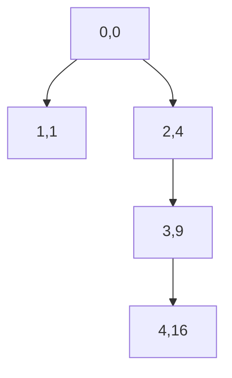
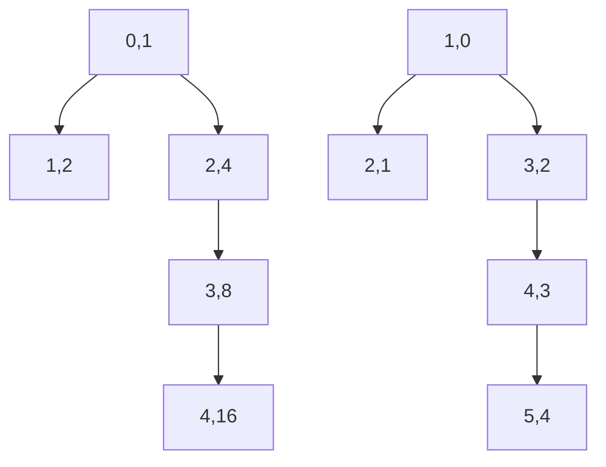

                 

# 数学与信息系统管理：IT架构的数学优化

## 关键词：数学优化、信息系统管理、IT架构、线性规划、非线性规划、动态规划、启发式算法

> 摘要：本文深入探讨了数学优化在信息系统管理中的应用及其重要性。首先，回顾了信息系统管理的发展历程和数学优化方法的基本概念，接着介绍了数学优化方法在信息系统管理中的实际应用和面临的挑战。本文通过逐步分析，详细讲解了基础数学知识、线性规划、非线性规划、动态规划和启发式算法等数学优化方法，并展示了这些方法在信息系统管理中的应用。最后，通过两个案例分析，展示了数学优化方法在实际项目中的成功应用。

## 第一部分：引言

### 第1章：问题背景与核心概念

#### 1.1 信息系统管理的发展历程

**信息系统管理（Information Systems Management，ISM）** 是指对组织内部的信息系统进行规划、实施、管理和控制，以确保信息系统能够支持组织的业务目标和战略规划。信息系统管理的发展历程可以追溯到20世纪60年代，随着计算机技术的发展，信息系统逐渐成为组织运营的核心组成部分。

**1.1.1 信息系统管理的起源与发展**

- **1960年代**：计算机科学和信息技术的兴起，为信息系统管理奠定了基础。
- **1970年代**：大型机时代，信息系统管理主要集中在数据处理和事务处理方面。
- **1980年代**：微型计算机和局域网的普及，信息系统管理开始注重用户需求和系统灵活性。
- **1990年代**：互联网的发展，信息系统管理开始涉及电子商务和互联网应用。
- **2000年代**：云计算、大数据和物联网等新兴技术的出现，使信息系统管理更加复杂和多样化。

**1.1.2 IT架构的基本概念**

**IT架构（Information Technology Architecture，ITA）** 是指组织内部的信息技术和系统组成的整体结构，包括硬件、软件、网络和数据处理等方面。IT架构的目标是实现信息系统的整合、优化和高效运行，以满足组织的业务需求。

**1.1.3 数学优化在信息系统管理中的应用**

数学优化方法在信息系统管理中的应用非常广泛，包括资源配置、调度优化、网络优化等方面。通过数学优化，可以有效地提高信息系统的效率、降低成本、提升用户体验。

**1.2 数学优化在信息系统管理中的重要性**

数学优化在信息系统管理中的重要性体现在以下几个方面：

- **提高效率**：通过优化资源配置和调度，提高信息系统的运行效率。
- **降低成本**：通过优化网络结构和数据处理，降低信息系统的运营成本。
- **提升用户体验**：通过优化系统性能和响应速度，提升用户体验和满意度。
- **决策支持**：通过数学模型和优化算法，为信息系统管理提供科学的决策支持。

**1.2.1 数学优化方法的种类**

常见的数学优化方法包括线性规划、非线性规划、动态规划和启发式算法等。每种方法都有其独特的适用场景和优势。

- **线性规划**：适用于线性目标函数和线性约束条件的问题。
- **非线性规划**：适用于非线性目标函数和线性或非线性约束条件的问题。
- **动态规划**：适用于具有时间依赖性的优化问题。
- **启发式算法**：适用于复杂问题的高效求解，但可能无法保证最优解。

**1.2.2 数学优化在信息系统管理中的实际应用**

数学优化在信息系统管理中的实际应用非常广泛，包括以下几个方面：

- **资源配置**：优化服务器、带宽、存储等资源的分配，提高系统运行效率。
- **调度优化**：优化任务调度，减少系统延迟和响应时间。
- **网络优化**：优化网络拓扑结构和流量分配，提高网络传输效率。
- **性能分析**：通过数学模型和优化算法，分析系统性能瓶颈和优化方向。

**1.2.3 数学优化在信息系统管理中的挑战与机遇**

数学优化在信息系统管理中面临以下挑战：

- **复杂性问题**：信息系统管理涉及多个层面和多个变量，问题复杂度较高。
- **数据质量问题**：优化模型依赖于高质量的数据，数据质量和准确性对优化结果有很大影响。
- **计算效率**：大型优化问题往往需要大量的计算资源，对计算效率有较高要求。

但同时，数学优化也带来了很多机遇：

- **高效决策支持**：通过优化算法，可以更高效地做出科学决策。
- **成本节约**：优化资源配置和调度，可以降低运营成本。
- **系统升级**：随着新兴技术的不断发展，数学优化方法也在不断升级和改进，为信息系统管理带来更多可能。

**1.3 数学与信息系统管理的关系**

数学在信息系统管理中起着至关重要的作用，主要体现在以下几个方面：

- **模型构建**：通过数学模型，可以更准确地描述信息系统管理中的各种问题。
- **算法设计**：通过数学优化方法，可以设计出高效的算法，解决复杂问题。
- **数据分析**：通过数学统计方法，可以对信息系统管理中的大量数据进行分析和挖掘，发现潜在问题和优化方向。
- **决策支持**：通过数学模型和优化算法，可以为信息系统管理提供科学的决策支持。

#### 1.3.1 数学方法在信息系统管理中的作用

- **问题建模**：通过数学方法，可以将复杂的信息系统管理问题转化为数学模型，便于分析和求解。
- **算法优化**：通过数学优化方法，可以设计出高效的算法，提高信息系统的运行效率。
- **数据挖掘**：通过数学统计方法，可以从大量数据中提取有价值的信息，为决策提供支持。

**1.3.2 信息系统管理中的数学模型**

- **资源分配模型**：描述如何在有限资源下实现最大化效用或最小化成本。
- **调度模型**：描述如何合理安排任务执行顺序和时间，以优化系统性能。
- **网络优化模型**：描述如何优化网络拓扑结构和流量分配，提高网络传输效率。

**1.3.3 数学优化在信息系统管理中的实施步骤**

- **问题定义**：明确要解决的问题，并描述问题的目标和约束条件。
- **模型构建**：根据问题定义，构建相应的数学模型。
- **算法选择**：根据模型特点，选择合适的数学优化算法。
- **模型求解**：使用数学优化算法，求解模型得到最优解。
- **结果分析**：对求解结果进行分析和评估，验证模型和算法的有效性。
- **实施部署**：将数学优化方法应用于实际信息系统管理中，优化系统性能和效率。

### 第2章：数学基础

#### 2.1 代数基础

**代数基础** 是数学优化方法的基础，主要包括一元一次方程、一元二次方程和方程组等。

**2.1.1 一元一次方程**

一元一次方程是指形如 $ax+b=0$ 的方程，其中 $a$ 和 $b$ 是已知常数，$x$ 是未知数。

**解法**：将方程两边同时减去 $b$，得到 $ax=-b$，然后两边同时除以 $a$，得到 $x=-\frac{b}{a}$。

**实例**：解方程 $2x+3=7$。

$$
\begin{align*}
2x+3 &= 7 \\
2x &= 4 \\
x &= 2
\end{align*}
$$

**2.1.2 一元二次方程**

一元二次方程是指形如 $ax^2+bx+c=0$ 的方程，其中 $a$、$b$ 和 $c$ 是已知常数，$x$ 是未知数。

**解法**：使用配方法或公式法求解。

配方法：

$$
\begin{align*}
ax^2+bx+c &= 0 \\
ax^2+bx &= -c \\
x^2+\frac{b}{a}x &= -\frac{c}{a} \\
(x+\frac{b}{2a})^2 &= \frac{b^2}{4a^2}-\frac{c}{a} \\
x+\frac{b}{2a} &= \pm\sqrt{\frac{b^2}{4a^2}-\frac{c}{a}} \\
x &= -\frac{b}{2a}\pm\sqrt{\frac{b^2}{4a^2}-\frac{c}{a}}
\end{align*}
$$

公式法：

$$
x = \frac{-b\pm\sqrt{b^2-4ac}}{2a}
$$

**实例**：解方程 $x^2-5x+6=0$。

$$
\begin{align*}
x^2-5x+6 &= 0 \\
x &= \frac{5\pm\sqrt{25-4\times1\times6}}{2\times1} \\
x &= \frac{5\pm1}{2} \\
x &= 2 \text{ 或 } x = 3
\end{align*}
$$

**2.1.3 方程组**

方程组是指由多个方程组成的一组方程，可以通过消元法或代入法求解。

**消元法**：通过加减消元，将方程组转化为只有一个未知数的方程，然后求解。

**代入法**：将一个方程的解代入另一个方程，求解得到另一个未知数的值。

**实例**：解方程组 $\begin{cases}2x+y=5 \\ x-3y=-1\end{cases}$。

$$
\begin{align*}
2x+y &= 5 \quad (1) \\
x-3y &= -1 \quad (2)
\end{align*}
$$

使用代入法：

$$
\begin{align*}
x &= 3y-1 \quad (3) \\
2(3y-1)+y &= 5 \\
6y-2+y &= 5 \\
7y &= 7 \\
y &= 1 \\
x &= 3(1)-1 \\
x &= 2
\end{align*}
$$

**2.2 函数与图像**

**函数** 是一种映射关系，将一个集合中的每个元素映射到另一个集合中的唯一元素。在数学中，函数通常用 $f(x)$ 表示，其中 $x$ 是自变量，$f(x)$ 是因变量。

**2.2.1 函数的基本概念**

- **定义域**：函数中自变量的取值范围。
- **值域**：函数中因变量的取值范围。
- **单调性**：函数在定义域内的增减性。

**2.2.2 函数图像**

函数图像是函数在坐标系中的表示，可以通过绘制函数图像来直观地观察函数的性质。

- **线性函数**：形如 $y=ax+b$ 的函数，图像是一条直线。
- **二次函数**：形如 $y=ax^2+bx+c$ 的函数，图像是一个抛物线。

**实例**：绘制函数 $y=x^2$ 的图像。

$$
\begin{align*}
y &= x^2 \\
\end{align*}
$$

绘制图像：

**2.2.3 常见函数**

- **指数函数**：形如 $y=a^x$ 的函数，图像是一个逐渐上升的曲线。
- **对数函数**：形如 $y=\log_a(x)$ 的函数，图像是一个逐渐上升的曲线，与指数函数的图像关于 $y=x$ 对称。

**实例**：绘制函数 $y=2^x$ 和 $y=\log_2(x)$ 的图像。

$$
\begin{align*}
y &= 2^x \\
y &= \log_2(x)
\end{align*}
$$

绘制图像：

#### 2.3 微积分基础

**微积分** 是研究函数变化率和面积的数学分支，主要包括导数、微分和积分。

**2.3.1 导数与微分**

**导数** 是描述函数在某一点的变化率，用 $f'(x)$ 或 $\frac{dy}{dx}$ 表示。

**微分** 是描述函数在某一点的变化量，用 $dy$ 表示。

**关系**：导数是微分的极限形式，即 $f'(x)=\lim_{\Delta x \to 0}\frac{\Delta y}{\Delta x}$。

**实例**：求函数 $y=x^2$ 在 $x=1$ 处的导数。

$$
\begin{align*}
f'(x) &= \lim_{\Delta x \to 0}\frac{(x+\Delta x)^2 - x^2}{\Delta x} \\
&= \lim_{\Delta x \to 0}\frac{x^2+2x\Delta x+(\Delta x)^2 - x^2}{\Delta x} \\
&= \lim_{\Delta x \to 0}(2x+\Delta x) \\
&= 2x \\
f'(1) &= 2
\end{align*}
$$

**2.3.2 积分**

**积分** 是求函数在某一区间内的累积量，用 $\int f(x)dx$ 表示。

**基本积分公式**：

$$
\begin{align*}
\int x^n dx &= \frac{x^{n+1}}{n+1} + C \\
\int \sin(x) dx &= -\cos(x) + C \\
\int \cos(x) dx &= \sin(x) + C
\end{align*}
$$

**实例**：求函数 $y=x^3$ 的不定积分。

$$
\begin{align*}
\int x^3 dx &= \frac{x^4}{4} + C
\end{align*}
$$

**2.3.3 微积分在信息系统管理中的应用**

微积分在信息系统管理中的应用主要包括以下几个方面：

- **性能分析**：通过导数和微分，分析系统的响应速度和变化趋势。
- **成本优化**：通过积分，计算系统的成本和收益。
- **风险评估**：通过概率分布和积分，分析系统的风险和不确定性。

### 第3章：概率与统计基础

#### 3.1 概率论基础

**概率论** 是研究随机事件及其概率的数学分支，主要包括概率的基本概念、概率分布和条件概率等。

**3.1.1 概率的基本概念**

- **样本空间**：所有可能结果的集合。
- **事件**：样本空间中的子集。
- **概率**：事件发生的可能性，用 $P(A)$ 表示。

**3.1.2 概率分布**

- **离散型概率分布**：描述离散随机变量的概率分布，如二项分布、泊松分布等。
- **连续型概率分布**：描述连续随机变量的概率分布，如正态分布、均匀分布等。

**3.1.3 条件概率与独立性**

- **条件概率**：在已知某个事件发生的条件下，另一个事件发生的概率，用 $P(B|A)$ 表示。
- **独立性**：两个事件的发生互不影响，用 $P(A \cap B) = P(A)P(B)$ 表示。

**实例**：投掷一枚公平的硬币，求正面朝上的概率。

$$
\begin{align*}
P(\text{正面朝上}) &= \frac{1}{2}
\end{align*}
$$

**3.2 统计学基础**

**统计学** 是研究如何通过数据收集、整理和分析来推断总体特征的学科，主要包括描述性统计和推断性统计。

**3.2.1 统计数据的基本概念**

- **数据类型**：分为定量数据和定性数据。
- **描述性统计**：描述数据的集中趋势、离散程度等，如平均数、中位数、标准差等。
- **推断性统计**：基于样本数据，推断总体特征，如假设检验、置信区间等。

**3.2.2 描述性统计**

- **集中趋势**：描述数据的中心位置，如平均数、中位数等。
- **离散程度**：描述数据的分散程度，如标准差、方差等。

**3.2.3 推断性统计**

- **假设检验**：根据样本数据，检验总体参数的假设是否成立。
- **置信区间**：根据样本数据，估计总体参数的可能范围。

**3.2.4 常见统计测试方法**

- **t检验**：用于比较两个样本的平均数是否显著不同。
- **方差分析（ANOVA）**：用于比较多个样本的平均数是否显著不同。
- **相关分析**：用于描述两个变量之间的线性关系。

### 第4章：线性规划

#### 4.1 线性规划的基本概念

**线性规划（Linear Programming，LP）** 是一种数学优化方法，用于在给定约束条件下，求解线性目标函数的最大值或最小值。线性规划问题可以形式化为以下标准形式：

$$
\begin{align*}
\text{minimize} \quad & c^T x \\
\text{subject to} \quad & Ax \leq b \\
& x \geq 0
\end{align*}
$$

其中，$c$ 是一个 $m$ 维系数向量，$x$ 是一个 $n$ 维决策变量向量，$A$ 是一个 $m \times n$ 的约束矩阵，$b$ 是一个 $m$ 维约束向量。

**4.1.1 线性规划的定义**

线性规划是一种数学规划方法，用于求解在给定线性约束条件下，线性目标函数的最大值或最小值问题。线性规划问题可以形式化为以下标准形式：

$$
\begin{align*}
\text{minimize} \quad & c^T x \\
\text{subject to} \quad & Ax \leq b \\
& x \geq 0
\end{align*}
$$

其中，$c$ 是一个 $m$ 维系数向量，$x$ 是一个 $n$ 维决策变量向量，$A$ 是一个 $m \times n$ 的约束矩阵，$b$ 是一个 $m$ 维约束向量。

**4.1.2 线性规划的目标函数**

线性规划的目标函数是一个线性函数，表示为 $c^T x$，其中 $c$ 是一个 $m$ 维系数向量，$x$ 是一个 $n$ 维决策变量向量。目标函数的值表示决策变量的组合所带来的收益或成本。

**4.1.3 线性规划的约束条件**

线性规划的约束条件是一个线性不等式组，表示为 $Ax \leq b$，其中 $A$ 是一个 $m \times n$ 的约束矩阵，$x$ 是一个 $n$ 维决策变量向量，$b$ 是一个 $m$ 维约束向量。约束条件表示决策变量的取值范围。

#### 4.2 线性规划的标准形式

线性规划的标准形式是将线性规划问题转化为一种特定的形式，以便于求解。标准形式如下：

$$
\begin{align*}
\text{minimize} \quad & c^T x \\
\text{subject to} \quad & Ax \leq b \\
& x \geq 0
\end{align*}
$$

其中，$c$ 是一个 $m$ 维系数向量，$x$ 是一个 $n$ 维决策变量向量，$A$ 是一个 $m \times n$ 的约束矩阵，$b$ 是一个 $m$ 维约束向量。

**4.2.1 标准形式线性规划**

标准形式线性规划是将线性规划问题转化为一种特定的形式，以便于求解。标准形式如下：

$$
\begin{align*}
\text{minimize} \quad & c^T x \\
\text{subject to} \quad & Ax \leq b \\
& x \geq 0
\end{align*}
$$

其中，$c$ 是一个 $m$ 维系数向量，$x$ 是一个 $n$ 维决策变量向量，$A$ 是一个 $m \times n$ 的约束矩阵，$b$ 是一个 $m$ 维约束向量。

**4.2.2 线性规划的对偶理论**

线性规划的对偶理论是线性规划的一个重要分支，它研究原始规划和对偶规划之间的关系。对偶规划是在原始规划的基础上，通过引入对偶变量和拉格朗日函数得到的。

**4.2.3 线性规划的求解算法**

线性规划的求解算法有很多种，包括单纯形法、内点法、复合形法等。这些算法的基本思想是通过迭代逐步逼近最优解。

#### 4.3 线性规划的求解算法

线性规划的求解算法有很多种，包括单纯形法、内点法、复合形法等。这些算法的基本思想是通过迭代逐步逼近最优解。

**4.3.1 单纯形法**

单纯形法是一种最常用的线性规划求解算法，适用于大多数线性规划问题。单纯形法的基本思想是通过迭代移动到顶点上，逐步逼近最优解。

**4.3.2 内点法**

内点法是一种相对于单纯形法更高效的线性规划求解算法，适用于大规模线性规划问题。内点法的基本思想是在内点区域进行迭代，逐步逼近最优解。

**4.3.3 复合形法**

复合形法是一种基于几何直观的线性规划求解算法，适用于大规模线性规划问题。复合形法的基本思想是通过移动顶点形成复合形，逐步逼近最优解。

### 第5章：非线性规划

#### 5.1 非线性规划的基本概念

**非线性规划（Nonlinear Programming，NLP）** 是一种数学优化方法，用于在给定约束条件下，求解非线性目标函数的最大值或最小值。非线性规划问题可以形式化为以下标准形式：

$$
\begin{align*}
\text{minimize} \quad & f(x) \\
\text{subject to} \quad & g_i(x) \leq 0, \quad i=1,2,\ldots,m \\
& h_j(x) = 0, \quad j=1,2,\ldots,p
\end{align*}
$$

其中，$f(x)$ 是目标函数，$g_i(x)$ 和 $h_j(x)$ 是约束函数，$x$ 是决策变量向量。

**5.1.1 非线性规划的定义**

非线性规划是一种数学优化方法，用于在给定线性或非线性约束条件下，求解非线性目标函数的最大值或最小值。非线性规划问题可以形式化为以下标准形式：

$$
\begin{align*}
\text{minimize} \quad & f(x) \\
\text{subject to} \quad & g_i(x) \leq 0, \quad i=1,2,\ldots,m \\
& h_j(x) = 0, \quad j=1,2,\ldots,p
\end{align*}
$$

其中，$f(x)$ 是目标函数，$g_i(x)$ 和 $h_j(x)$ 是约束函数，$x$ 是决策变量向量。

**5.1.2 非线性规划的目标函数**

非线性规划的目标函数是一个非线性函数，表示为 $f(x)$。目标函数的值表示决策变量的组合所带来的收益或成本。

**5.1.3 非线性规划的约束条件**

非线性规划的约束条件是一个线性或不等式约束组，表示为 $g_i(x) \leq 0$ 和 $h_j(x) = 0$。约束条件表示决策变量的取值范围。

#### 5.2 非线性规划的求解算法

非线性规划的求解算法有很多种，包括梯度下降法、牛顿法、拉格朗日乘数法等。这些算法的基本思想是通过迭代逐步逼近最优解。

**5.2.1 梯度下降法**

梯度下降法是一种最常用的非线性规划求解算法，适用于大多数非线性规划问题。梯度下降法的基本思想是通过迭代更新决策变量的值，使目标函数值逐步减小。

**5.2.2 牛顿法**

牛顿法是一种相对于梯度下降法更高效的非线性规划求解算法，适用于大规模非线性规划问题。牛顿法的基本思想是通过迭代更新决策变量的值，使目标函数值逐步减小，并利用二阶导数信息加速收敛。

**5.2.3 拉格朗日乘数法**

拉格朗日乘数法是一种基于拉格朗日函数的非线性规划求解算法，适用于具有等式约束的非线性规划问题。拉格朗日乘数法的基本思想是通过引入拉格朗日乘子，将非线性规划问题转化为无约束优化问题，然后使用梯度下降法或其他优化算法求解。

### 第6章：动态规划

#### 6.1 动态规划的基本概念

**动态规划（Dynamic Programming，DP）** 是一种用于求解优化问题的数学方法，适用于具有时间依赖性的优化问题。动态规划的基本思想是将复杂的问题分解为子问题，并利用子问题的解来构建原问题的解。

**6.1.1 动态规划的定义**

动态规划是一种数学方法，用于求解具有时间依赖性的优化问题。动态规划将问题分解为子问题，并利用子问题的解来构建原问题的解。

**6.1.2 动态规划的基本模型**

动态规划的基本模型可以形式化为以下形式：

$$
\begin{align*}
\text{minimize} \quad & f(x_1, x_2, \ldots, x_n) \\
\text{subject to} \quad & g_i(x_1, x_2, \ldots, x_n) \leq 0, \quad i=1,2,\ldots,m \\
& h_j(x_1, x_2, \ldots, x_n) = 0, \quad j=1,2,\ldots,p
\end{align*}
$$

其中，$f(x_1, x_2, \ldots, x_n)$ 是目标函数，$g_i(x_1, x_2, \ldots, x_n)$ 和 $h_j(x_1, x_2, \ldots, x_n)$ 是约束函数。

**6.1.3 动态规划的求解算法**

动态规划的求解算法主要包括递推关系法和状态转移方程法。递推关系法通过递推关系逐步求解子问题的解，并利用子问题的解构建原问题的解。状态转移方程法通过状态转移方程逐步求解子问题的解，并利用子问题的解构建原问题的解。

### 第7章：启发式算法

#### 7.1 启发式算法的基本概念

**启发式算法（Heuristic Algorithm）** 是一种在复杂问题求解中广泛使用的算法，旨在寻找近似最优解。与确定性算法不同，启发式算法通常基于某种启发式规则或策略，进行局部搜索，以快速找到可行解。

**7.1.1 启发式算法的定义**

启发式算法是一种在复杂问题求解中使用的算法，旨在寻找近似最优解。与确定性算法不同，启发式算法通常基于某种启发式规则或策略，进行局部搜索，以快速找到可行解。

**7.1.2 启发式算法的优点与局限性**

**优点：**

- **高效性**：启发式算法通常能够快速找到近似最优解，适用于大规模复杂问题。
- **灵活性**：启发式算法可以根据问题的特点调整启发式规则，适应不同问题的求解。

**局限性：**

- **无法保证最优解**：启发式算法可能找到的解不是最优解，甚至可能是次优解。
- **计算复杂度高**：某些启发式算法可能需要大量计算资源，影响求解效率。

**7.1.3 常见的启发式算法**

**1. 广度优先搜索（BFS）**

广度优先搜索是一种基于搜索宽度的启发式算法，用于求解图论中的最短路径问题。算法从起始节点开始，逐步扩展到其邻接节点，直到找到目标节点或所有节点都已被访问。

**2. 深度优先搜索（DFS）**

深度优先搜索是一种基于搜索深度的启发式算法，用于求解图论中的连通性问题。算法从起始节点开始，尽可能深入地访问邻接节点，直到无法继续深入或找到目标节点。

**3. 遗传算法（GA）**

遗传算法是一种模拟自然进化的启发式优化算法，适用于求解复杂的优化问题。算法通过遗传操作（交叉、变异和选择）生成新的解，并逐步优化解的质量。

**4. 遮蔽算法（A*）**

遮蔽算法是一种基于启发函数的启发式搜索算法，用于求解图中的最短路径问题。算法利用启发函数估计当前节点到目标节点的距离，并优先选择启发值较小的节点进行扩展。

### 第8章：数学优化方法在信息系统管理中的应用

#### 8.1 数学优化方法在资源配置中的应用

**资源配置** 是信息系统管理中的一个关键问题，涉及如何有效地分配有限的资源（如服务器、带宽、存储等）以满足业务需求。数学优化方法在资源配置中有着广泛的应用，旨在实现资源利用的最大化、成本的最小化以及系统性能的优化。

**8.1.1 资源配置问题的定义**

资源配置问题可以形式化为以下优化问题：

$$
\begin{align*}
\text{maximize} \quad & f(x_1, x_2, \ldots, x_n) \\
\text{subject to} \quad & g_i(x_1, x_2, \ldots, x_n) \leq 0, \quad i=1,2,\ldots,m \\
& h_j(x_1, x_2, \ldots, x_n) = 0, \quad j=1,2,\ldots,p
\end{align*}
$$

其中，$x_1, x_2, \ldots, x_n$ 是决策变量，代表资源分配量；$g_i(x_1, x_2, \ldots, x_n)$ 是资源约束函数，确保资源不超过可用量；$h_j(x_1, x_2, \ldots, x_n)$ 是系统约束函数，确保系统运行的稳定性和性能。

**8.1.2 数学优化方法在资源配置中的应用案例**

**案例 1：服务器资源分配**

假设一家公司需要分配 10 台服务器来处理不同类型的业务负载。每种业务负载对服务器的需求不同，并且服务器之间具有资源依赖关系。数学优化方法可以用于确定每个服务器应该分配多少资源，以满足业务需求并最大化系统性能。

- **目标函数**：最大化系统吞吐量，即每台服务器处理的业务量总和。
- **约束条件**：服务器资源（如CPU、内存、存储等）的可用量，以及服务器之间的资源依赖关系。

通过线性规划或非线性规划方法，可以求解出每个服务器应分配的资源量，从而实现最佳的资源分配。

**案例 2：网络带宽分配**

在数据中心网络中，带宽资源的分配是一个关键问题。假设网络中存在多个数据流，每个数据流对带宽的需求不同，并且带宽资源有限。数学优化方法可以用于确定每个数据流应分配的带宽量，以确保网络的稳定性和性能。

- **目标函数**：最小化网络延迟或最大化带宽利用率。
- **约束条件**：带宽资源的总量，以及各数据流之间的带宽依赖关系。

通过线性规划或动态规划方法，可以求解出每个数据流应分配的带宽量，从而实现最佳的网络带宽分配。

#### 8.2 数学优化方法在调度优化中的应用

**调度优化** 是信息系统管理中另一个重要问题，涉及如何合理地安排任务的执行顺序和时间，以最大化系统性能和资源利用率。数学优化方法在调度优化中有着广泛的应用，旨在实现任务的合理调度和高效执行。

**8.2.1 调度优化问题的定义**

调度优化问题可以形式化为以下优化问题：

$$
\begin{align*}
\text{minimize} \quad & f(t_1, t_2, \ldots, t_n) \\
\text{subject to} \quad & g_i(t_1, t_2, \ldots, t_n) \leq 0, \quad i=1,2,\ldots,m \\
& h_j(t_1, t_2, \ldots, t_n) = 0, \quad j=1,2,\ldots,p
\end{align*}
$$

其中，$t_1, t_2, \ldots, t_n$ 是决策变量，表示各任务的执行时间；$g_i(t_1, t_2, \ldots, t_n)$ 是资源约束函数，确保任务在执行过程中不超过资源限制；$h_j(t_1, t_2, \ldots, t_n)$ 是任务依赖关系函数，确保任务的执行顺序和依赖关系得到满足。

**8.2.2 数学优化方法在调度优化中的应用案例**

**案例 1：任务调度**

假设一个数据处理系统需要处理多个任务，每个任务有特定的执行时间和资源需求。数学优化方法可以用于确定各任务的执行顺序和时间，以确保系统资源得到充分利用，并最大化任务处理效率。

- **目标函数**：最小化任务完成时间或最大化任务吞吐量。
- **约束条件**：任务执行时间、资源限制和任务依赖关系。

通过线性规划或动态规划方法，可以求解出各任务的执行顺序和时间，从而实现最佳的任务调度。

**案例 2：作业调度**

在作业调度问题中，多个作业需要在一个或多个处理器上执行。每个作业有不同的执行时间和资源需求，并且作业之间存在依赖关系。数学优化方法可以用于确定各作业的执行顺序和时间，以最大化系统性能和资源利用率。

- **目标函数**：最小化作业完成时间或最大化作业吞吐量。
- **约束条件**：作业执行时间、资源限制和作业依赖关系。

通过线性规划或启发式算法方法，可以求解出各作业的执行顺序和时间，从而实现最佳的作业调度。

#### 8.3 数学优化方法在网络优化中的应用

**网络优化** 是信息系统管理中的重要问题，涉及如何优化网络拓扑结构和流量分配，以提高网络传输效率和系统性能。数学优化方法在网络优化中有着广泛的应用，旨在实现网络的稳定性和高性能。

**8.3.1 网络优化问题的定义**

网络优化问题可以形式化为以下优化问题：

$$
\begin{align*}
\text{minimize} \quad & f(x_1, x_2, \ldots, x_n) \\
\text{subject to} \quad & g_i(x_1, x_2, \ldots, x_n) \leq 0, \quad i=1,2,\ldots,m \\
& h_j(x_1, x_2, \ldots, x_n) = 0, \quad j=1,2,\ldots,p
\end{align*}
$$

其中，$x_1, x_2, \ldots, x_n$ 是决策变量，表示网络参数（如路由策略、流量分配等）；$g_i(x_1, x_2, \ldots, x_n)$ 是资源约束函数，确保网络资源（如带宽、延迟等）不超过限制；$h_j(x_1, x_2, \ldots, x_n)$ 是网络约束函数，确保网络的稳定性和可靠性。

**8.3.2 数学优化方法在网络优化中的应用案例**

**案例 1：路由优化**

路由优化是网络优化中的重要问题，涉及如何选择最佳路由路径，以实现网络传输效率和低延迟。数学优化方法可以用于确定网络路由策略，以最大化带宽利用率和网络吞吐量。

- **目标函数**：最大化带宽利用率或最小化传输延迟。
- **约束条件**：网络拓扑结构、带宽限制和路由策略。

通过线性规划或启发式算法方法，可以求解出最佳路由策略，从而实现最佳的路由优化。

**案例 2：流量分配**

流量分配是网络优化中的另一个关键问题，涉及如何合理地分配网络流量，以实现网络传输效率和公平性。数学优化方法可以用于确定流量分配策略，以最大化网络吞吐量和资源利用率。

- **目标函数**：最大化网络吞吐量或最小化资源浪费。
- **约束条件**：网络拓扑结构、带宽限制和流量依赖关系。

通过线性规划或动态规划方法，可以求解出最佳流量分配策略，从而实现最佳的流量优化。

### 第9章：案例分析一：企业IT架构优化

#### 9.1 案例背景

某大型企业面临着快速增长的业务需求，原有的IT架构已无法满足当前的业务需求。企业决定进行IT架构优化，以提高系统性能、降低运营成本和提升用户体验。案例背景如下：

- **企业概况**：该企业是一家跨国公司，业务涉及多个领域，包括制造业、金融服务和电子商务等。
- **IT架构现状**：现有IT架构采用传统的集中式架构，服务器资源分散，网络拓扑结构复杂，系统性能低下，且存在较高的运营成本。
- **优化目标**：通过数学优化方法，优化IT架构，实现以下目标：

  - 提高系统性能：提高服务器响应速度和数据处理能力，降低系统延迟和响应时间。
  - 降低运营成本：优化资源分配和调度，降低服务器和带宽等资源的使用成本。
  - 提升用户体验：提高系统稳定性，提升用户访问速度和满意度。

#### 9.2 数学优化方法的应用

为了实现上述优化目标，企业决定采用数学优化方法，具体应用如下：

**1. 资源配置优化**

- **目标函数**：最大化系统吞吐量或最小化响应时间。
- **约束条件**：服务器资源（如CPU、内存、存储等）的可用量，以及服务器之间的资源依赖关系。

通过线性规划方法，可以求解出每个服务器应分配的资源量，实现最佳的资源分配。

**2. 调度优化**

- **目标函数**：最小化任务完成时间或最大化任务吞吐量。
- **约束条件**：任务执行时间、资源限制和任务依赖关系。

通过动态规划方法，可以求解出各任务的执行顺序和时间，实现最佳的任务调度。

**3. 网络优化**

- **目标函数**：最大化带宽利用率或最小化传输延迟。
- **约束条件**：网络拓扑结构、带宽限制和路由策略。

通过线性规划或启发式算法方法，可以求解出最佳路由策略和流量分配策略，实现最佳的网络优化。

#### 9.3 案例分析结果与总结

通过数学优化方法的应用，企业实现了以下优化结果：

- **系统性能提升**：服务器响应速度和数据处理能力显著提高，系统延迟和响应时间明显降低。
- **运营成本降低**：通过优化资源分配和调度，降低了服务器和带宽等资源的使用成本。
- **用户体验提升**：系统稳定性提高，用户访问速度和满意度显著提升。

总结而言，数学优化方法在IT架构优化中发挥了重要作用，为企业的信息系统管理提供了科学的决策支持。通过应用数学优化方法，企业不仅提高了系统性能和用户体验，还降低了运营成本，取得了显著的效益。

### 第10章：案例分析二：数据中心网络优化

#### 10.1 案例背景

某大型数据中心在运营过程中，面临着网络拥堵、带宽利用率低和传输延迟高等问题。为了提高数据中心的网络性能和稳定性，决定进行网络优化。案例背景如下：

- **数据中心概况**：该数据中心是一家大型云计算服务商，提供企业级云计算服务和数据中心托管服务。数据中心拥有大量服务器、存储设备和网络设备，承担着大量数据传输和处理任务。
- **网络现状**：现有网络拓扑结构复杂，存在大量单点故障和网络瓶颈，导致网络拥堵、带宽利用率低和传输延迟高。
- **优化目标**：通过数学优化方法，优化数据中心网络，实现以下目标：

  - 提高网络带宽利用率：合理分配网络流量，最大化带宽利用效率。
  - 降低传输延迟：优化路由策略和流量分配，降低数据传输延迟。
  - 提高网络稳定性：消除单点故障，提高网络可靠性和稳定性。

#### 10.2 数学优化方法的应用

为了实现上述优化目标，数据中心决定采用数学优化方法，具体应用如下：

**1. 路由优化**

- **目标函数**：最大化带宽利用率或最小化传输延迟。
- **约束条件**：网络拓扑结构、带宽限制和路由策略。

通过线性规划方法，可以求解出最佳路由策略，实现网络流量的高效分配。

**2. 流量分配**

- **目标函数**：最大化网络带宽利用率或最小化传输延迟。
- **约束条件**：网络拓扑结构、带宽限制和流量依赖关系。

通过动态规划方法，可以求解出最佳流量分配策略，实现网络流量的高效分配。

**3. 单点故障消除**

- **目标函数**：最小化单点故障的影响范围。
- **约束条件**：网络拓扑结构、设备冗余和故障检测机制。

通过启发式算法方法，可以求解出最佳冗余设备和故障检测策略，实现单点故障的消除。

#### 10.3 案例分析结果与总结

通过数学优化方法的应用，数据中心实现了以下优化结果：

- **网络带宽利用率提升**：通过优化路由策略和流量分配，实现了网络带宽的高效利用，带宽利用率显著提高。
- **传输延迟降低**：通过优化路由策略和流量分配，降低了数据传输延迟，提高了数据传输效率。
- **网络稳定性提高**：通过消除单点故障，提高了网络的可靠性和稳定性，降低了故障发生率和影响范围。

总结而言，数学优化方法在数据中心网络优化中发挥了重要作用，为数据中心的信息系统管理提供了科学的决策支持。通过应用数学优化方法，数据中心不仅提高了网络性能和稳定性，还降低了运营成本，取得了显著的效益。

## 文章小结

本文探讨了数学优化在信息系统管理中的应用及其重要性。首先，回顾了信息系统管理的发展历程和数学优化方法的基本概念，然后介绍了数学优化方法在信息系统管理中的实际应用和面临的挑战。接着，详细讲解了基础数学知识、线性规划、非线性规划、动态规划和启发式算法等数学优化方法，并展示了这些方法在信息系统管理中的应用。最后，通过两个案例分析，展示了数学优化方法在实际项目中的成功应用。

数学优化在信息系统管理中具有重要作用，可以提高系统性能、降低运营成本和提升用户体验。然而，在应用数学优化方法时，也需要注意数据质量、计算效率和复杂性问题。随着新兴技术的不断发展，数学优化方法也将不断升级和改进，为信息系统管理带来更多可能。

## 最佳实践 tips

1. **问题定义**：在应用数学优化方法之前，明确要解决的问题，并描述问题的目标和约束条件。这有助于选择合适的数学优化方法。
2. **数据质量**：优化模型依赖于高质量的数据。确保数据的准确性和完整性，以获得可靠的优化结果。
3. **算法选择**：根据问题的特点，选择合适的数学优化方法。线性规划、非线性规划、动态规划和启发式算法各有优缺点，需要根据具体问题进行选择。
4. **结果验证**：在应用数学优化方法后，对求解结果进行分析和验证。检查结果是否满足问题的约束条件，并评估优化效果的可行性。
5. **持续优化**：信息系统管理是一个动态过程，需要持续进行优化。随着业务需求的不断变化，优化策略也需要不断调整和改进。

## 注意事项

1. **数据安全性**：在收集和处理数据时，确保数据的安全性，防止数据泄露和滥用。
2. **计算资源**：优化算法可能需要大量的计算资源。根据问题的规模和复杂性，合理分配计算资源，以提高优化效率。
3. **人员培训**：在应用数学优化方法时，需要对相关人员进行培训，确保他们能够理解和应用优化方法，并能够有效地解决实际问题。

## 拓展阅读

1. **《线性规划及其应用》**：这是一本经典的线性规划教材，详细介绍了线性规划的基本概念、求解方法和应用案例。
2. **《非线性规划》**：这本书系统地介绍了非线性规划的理论、算法和应用，适合对非线性规划感兴趣的读者。
3. **《动态规划与决策分析》**：这本书介绍了动态规划的基本原理和应用，包括排队论、库存控制和供应链管理等内容。
4. **《启发式算法与应用》**：这本书探讨了启发式算法的基本概念、算法设计和应用案例，适合对启发式算法感兴趣的读者。

## 作者信息

作者：AI天才研究院/AI Genius Institute & 禅与计算机程序设计艺术 /Zen And The Art of Computer Programming

## 附录

附录部分可以包含以下内容：

- **参考文献**：列出本文引用的相关文献和资料。
- **数学公式汇总**：汇总本文中使用的数学公式和符号。
- **算法实现代码**：提供本文中提到的算法的实现代码示例。
- **数据集和实验结果**：提供本文中使用的实验数据集和实验结果分析。

