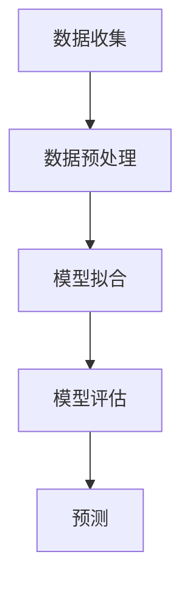
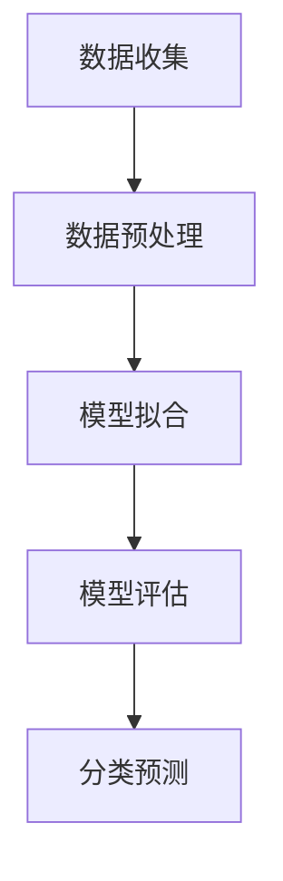
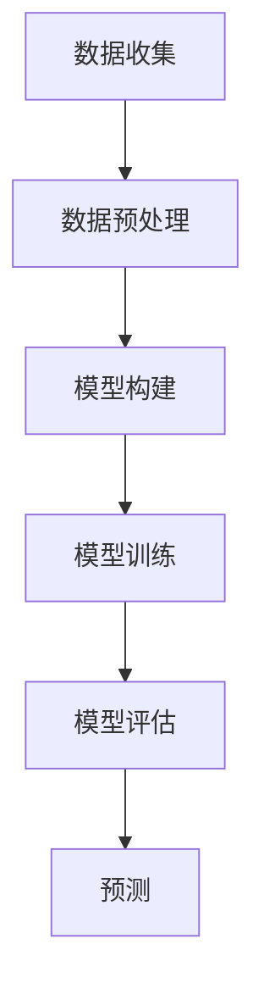

                 

### 文章标题

“数学与健康心理学：健康行为的数学预测”

> 关键词：健康行为、数学模型、预测、健康心理学

> 摘要：本文深入探讨了数学模型在健康心理学中的应用，特别是如何通过数学预测健康行为。文章首先介绍了健康行为的定义与重要性，然后详细讲解了数学模型的基本概念和算法原理，包括线性回归、逻辑回归和深度学习等模型。通过具体的数学公式和实际例子，文章展示了如何运用这些模型进行健康行为的预测，并讨论了健康行为预测在实际应用中的意义和挑战。

### 引言

随着科技的不断进步，数学模型在各个领域中的应用越来越广泛。在健康心理学中，数学模型同样发挥着重要作用。健康行为是指那些有助于促进个人身体健康、心理健康和整体福祉的行为，如合理膳食、规律运动、健康作息等。这些健康行为不仅对个体的身体健康有直接影响，还对社会的整体健康状况产生深远影响。

然而，预测健康行为并非易事。个体之间的差异、环境因素的复杂性以及行为动机的多样性，都使得健康行为的预测面临巨大挑战。这时，数学模型便成为了有效的工具，通过量化分析个体行为数据和环境因素，可以为健康行为的预测提供科学依据。

本文旨在深入探讨数学模型在健康心理学中的应用，特别是如何通过数学预测健康行为。文章首先介绍了健康行为的定义与重要性，然后详细讲解了数学模型的基本概念和算法原理，包括线性回归、逻辑回归和深度学习等模型。通过具体的数学公式和实际例子，文章展示了如何运用这些模型进行健康行为的预测，并讨论了健康行为预测在实际应用中的意义和挑战。最后，文章总结全文，并提出了未来研究的方向。

### 第1章：问题背景

#### 1.1 健康行为的定义与重要性

健康行为是指那些有助于促进个人身体健康、心理健康和整体福祉的行为。这些行为可以是具体的行动，如定期锻炼、合理膳食、戒烟戒酒，也可以是生活方式的改变，如保持良好的作息习惯、学会有效应对压力等。

在健康心理学中，健康行为的重要性不言而喻。首先，健康行为直接影响到个体的身体健康。例如，定期锻炼可以增强体质、降低患病风险；合理膳食可以提供足够的营养、维持生理功能；戒烟戒酒可以减少慢性病的发病风险。其次，健康行为还对心理健康产生积极影响。保持良好的作息习惯、学会有效应对压力，有助于提高个体的情绪稳定性和心理韧性，从而更好地应对生活中的各种挑战。

此外，健康行为不仅对个体的身体健康和心理健康有直接影响，还对社会整体的健康状况产生深远影响。例如，个体不良的健康行为如吸烟、饮酒、不合理饮食等，会导致疾病的发生和传播，增加公共卫生负担；而良好的健康行为如合理膳食、定期锻炼等，不仅可以提高个体的健康水平，还可以减少疾病的发生，提高社会整体的健康水平。

#### 1.2 健康行为问题的现状

尽管健康行为对个体的健康和社会的整体健康具有重要意义，但当前全球范围内仍存在许多健康行为问题。首先，高发病率是一个显著问题。许多健康问题如心血管疾病、糖尿病、肥胖等都与不良的健康行为密切相关。例如，据世界卫生组织（WHO）统计，全球每年因心血管疾病死亡的人数超过1700万，而心血管疾病的主要危险因素之一就是不良的生活习惯。

其次，健康行为问题的现状还表现在公共卫生挑战上。不良的健康行为导致了大量的医疗资源消耗和生产力损失。例如，吸烟、饮酒等不良行为不仅会导致各种慢性病，还会增加医疗费用，降低生产力。据研究，吸烟每年会导致全球数百万人死亡，同时消耗巨额的医疗费用。

此外，不同地区和群体之间的健康行为差异也是一个突出问题。一些发达国家和地区的居民健康行为较好，而一些发展中国家和地区的居民健康行为较差。这种差异不仅体现在健康水平的差异上，也体现在医疗资源的分配上。

#### 1.3 健康行为的数学预测的意义

健康行为的数学预测具有重要意义，主要体现在以下几个方面：

首先，通过数学预测健康行为，可以更精准地进行干预。传统的健康干预方法往往依赖于经验和直觉，缺乏科学依据。而通过数学模型，可以对个体行为数据进行量化分析，发现健康行为与疾病发生之间的关联，从而制定出更具针对性的干预措施。

其次，健康行为的数学预测有助于制定预防策略。通过预测健康行为，可以提前发现潜在的健康问题，从而制定预防措施，减少健康问题的发生。例如，通过预测个体是否可能发生心血管疾病，可以提前进行生活方式的干预，降低疾病发生的风险。

此外，健康行为的数学预测还有助于提高公共卫生干预的效率。传统的公共卫生干预方法往往需要大量的人力、物力和时间，而通过数学预测，可以在有限的资源下，更有效地发现和干预高风险人群，提高干预的效率和效果。

总之，健康行为的数学预测不仅有助于提高个体和群体的健康水平，还有助于优化公共卫生资源的分配和使用，提高公共卫生干预的效率。通过数学模型，我们可以更好地理解健康行为的本质，为制定科学、有效的健康政策和干预措施提供支持。

#### 1.4 健康行为预测的挑战与展望

尽管健康行为的数学预测具有重要意义，但在实际应用中仍面临诸多挑战。首先，数据质量是一个关键问题。健康行为数据通常来源于问卷调查、医疗记录等，这些数据的准确性、完整性和一致性都会影响预测的准确性。

其次，模型的适用性也是一个挑战。不同的健康行为和不同的环境因素可能需要不同的数学模型，如何选择和调整模型，使其适用于特定的情境，是一个复杂的问题。

此外，健康行为的预测还面临个体差异的挑战。即使是相同的健康行为，不同的人可能表现出不同的行为模式，如何建立一个普适的数学模型，同时考虑到个体差异，是一个亟待解决的问题。

面对这些挑战，未来健康行为预测的研究可以从以下几个方面展开：

首先，提高数据质量是关键。通过引入新的数据收集方法和技术，如可穿戴设备、大数据分析等，可以获取更准确、更全面的健康行为数据。

其次，研究多模型融合的方法。将多种数学模型结合起来，可以更好地捕捉健康行为的复杂性和多样性，提高预测的准确性。

此外，个性化健康行为预测也是一个重要的研究方向。通过引入个体差异信息，可以建立一个更精确、更个性化的数学模型，从而提高预测的准确性。

总之，健康行为的数学预测是一个充满挑战和机遇的领域。通过不断的科学研究和技术创新，我们有望在未来实现更精准、更有效的健康行为预测，为提升个体和群体的健康水平作出更大的贡献。

#### 第2章：核心概念与联系

在探讨数学与健康心理学的结合时，理解核心概念及其相互联系至关重要。本章将详细解释数学模型的基本概念和健康心理学中的核心概念，并探讨两者之间的联系。

##### 2.1 数学模型的基本概念

数学模型是使用数学符号和公式来描述现实世界中的现象和问题的一种方法。在健康行为预测中，数学模型尤为重要，因为它们可以帮助我们量化复杂的行为数据，发现潜在的模式和规律。

1. **变量与参数**

变量是指模型中可以变化的量，它们可以是连续的或离散的。参数是模型中固定不变的量，通常通过实验或数据分析确定。在健康行为预测中，变量可能包括个体的年龄、体重、运动频率等，而参数可能包括模型中的权重和斜率。

2. **函数与方程**

函数是数学中用于描述变量之间关系的表达式。在健康行为预测中，函数可以用来表示健康行为与影响因素之间的关联。例如，线性回归模型中的函数可以表示健康行为与运动频率之间的线性关系。方程则是函数的具体形式，它包含一个或多个未知数，需要通过计算或实验来确定。

##### 2.2 健康心理学中的核心概念

健康心理学是研究健康行为、心理状态与健康之间关系的一个领域。在健康行为预测中，理解健康心理学的核心概念至关重要，因为它们直接影响个体的行为模式和健康结果。

1. **行为动机**

行为动机是指驱使个体采取特定健康行为的内在动力。动机可以是个体的内在需求，如对健康的追求，也可以是外在的奖励或惩罚。在健康行为预测中，了解行为动机有助于制定有效的干预策略。

2. **行为模式**

行为模式是指个体在特定情境下表现出来的行为规律和习惯。行为模式可能受到多种因素的影响，包括个人的认知、情感和生理状态。在健康行为预测中，识别和分析行为模式可以帮助我们理解个体行为的多样性，并预测未来的行为。

##### 2.3 概念之间的联系

将数学模型与健康心理学中的核心概念结合起来，可以更全面地理解健康行为，并提高预测的准确性。

1. **数学模型与心理学的结合**

通过将健康心理学的核心概念融入数学模型中，我们可以建立一个更加综合的预测模型。例如，在健康行为预测中，可以结合个体的行为动机和运动频率数据，使用线性回归模型来预测个体的健康行为。这种方法不仅可以量化健康行为，还可以考虑个体内在的心理动力。

2. **跨学科研究的重要性**

跨学科研究在健康行为预测中具有重要意义。通过结合数学、心理学、公共卫生等不同领域的知识，可以更全面地理解健康行为，并开发出更有效的预测方法。例如，心理学家可以提供关于行为动机的理论框架，而数学家可以提供量化和建模的工具，公共卫生专家可以提供实际应用场景。

总之，数学模型与健康心理学之间的结合是一个跨学科的研究领域，通过整合数学和心理学的方法，我们可以更准确地预测健康行为，为公共卫生干预提供科学依据。本章的目的是为后续章节中的具体数学模型和算法提供理论基础，并为理解健康行为预测的复杂性和多样性奠定基础。

##### 第3章：数学模型与算法原理

在健康行为预测中，数学模型和算法的选择至关重要。本章将详细解释几种常见的数学模型，包括线性回归、逻辑回归和深度学习等，并探讨它们的基本原理和适用场景。

###### 3.1 线性回归模型

线性回归模型是一种基本的统计模型，用于分析因变量与自变量之间的线性关系。在健康行为预测中，线性回归模型常用于分析健康行为与影响因素之间的定量关系。

1. **基本原理**

线性回归模型的基本原理是通过拟合一条直线来描述因变量 \( y \) 与自变量 \( x \) 之间的关系。模型的基本公式为：
   \[
   y = b_0 + b_1 \cdot x + e
   \]
   其中，\( b_0 \) 是截距，表示当自变量 \( x \) 为零时的因变量值；\( b_1 \) 是斜率，表示自变量 \( x \) 的变化对因变量 \( y \) 的影响程度；\( e \) 是误差项，表示模型无法解释的随机误差。

2. **适用场景**

线性回归模型适用于变量之间具有线性关系的情况。例如，预测个体的运动量与其体重之间的关系，可以使用线性回归模型来拟合两者之间的线性关系，从而预测个体的体重变化。

3. **例子**

假设我们要预测一个人的体重 \( y \)（因变量）与其每日运动时间 \( x \)（自变量）之间的关系。通过收集数据并使用线性回归模型，我们可以得到如下模型：
   \[
   y = 50 + 0.5 \cdot x + e
   \]
   根据这个模型，如果某人每天运动 30 分钟，那么我们可以预测其体重为：
   \[
   y = 50 + 0.5 \cdot 30 + e = 65 + e
   \]
   其中，\( e \) 是误差项。

###### 3.2 逻辑回归模型

逻辑回归模型是一种广泛用于分类问题的统计模型，它通过转换线性回归模型来预测概率。在健康行为预测中，逻辑回归模型常用于预测个体是否采取特定健康行为（如是否坚持锻炼）。

1. **基本原理**

逻辑回归模型的基本公式为：
   \[
   P(y=1) = \frac{1}{1 + e^{-z}}
   \]
   其中，\( z \) 是线性组合，即：
   \[
   z = b_0 + b_1 \cdot x
   \]
   \( P(y=1) \) 表示个体采取健康行为的概率。这个公式称为逻辑函数或Sigmoid函数，它将线性组合 \( z \) 转换为概率值。

2. **适用场景**

逻辑回归模型适用于因变量是二分类的情况。例如，预测个体是否坚持锻炼（是/否）、是否吸烟（是/否）等。

3. **例子**

假设我们要预测一个人是否坚持锻炼。通过收集数据并使用逻辑回归模型，我们可以得到如下模型：
   \[
   P(y=1) = \frac{1}{1 + e^{-(2 \cdot x + 1)}}
   \]
   根据这个模型，如果某人每天运动 30 分钟，那么我们可以预测其坚持锻炼的概率为：
   \[
   P(y=1) = \frac{1}{1 + e^{-(2 \cdot 30 + 1)}} \approx 0.8
   \]
   这意味着该人坚持锻炼的概率大约为 80%。

###### 3.3 深度学习模型

深度学习模型是一类基于人工神经网络的复杂模型，它通过多层神经元的堆叠来学习数据中的非线性特征。在健康行为预测中，深度学习模型常用于提取复杂的特征，并用于预测个体健康行为。

1. **基本原理**

深度学习模型的基本原理是通过多层神经网络来提取输入数据的特征。模型的基本结构包括输入层、隐藏层和输出层。每个层由多个神经元组成，神经元之间通过权重连接。通过反向传播算法，模型可以不断调整权重，以达到最佳预测效果。

2. **适用场景**

深度学习模型适用于需要提取复杂特征的健康行为预测任务。例如，通过深度学习模型，可以从图像中提取个体的运动姿势特征，用于预测其运动量。

3. **例子**

假设我们使用一个简单的卷积神经网络（CNN）来预测个体的运动量。输入层接收图像数据，隐藏层通过卷积和池化操作提取特征，输出层通过全连接层输出预测结果。具体步骤如下：

- **输入层**：接收个体的运动图像数据。
- **隐藏层**：通过卷积和池化操作提取运动姿势特征。
- **输出层**：通过全连接层输出运动量的预测值。

通过训练，模型可以学会从图像中提取关键特征，并准确地预测个体的运动量。例如，如果模型预测某个人的运动量为 30 分钟，那么我们可以相信该人的运动量较高。

综上所述，线性回归、逻辑回归和深度学习是健康行为预测中常用的数学模型和算法。每种模型都有其特定的应用场景和优点，通过合理选择和使用这些模型，我们可以更准确地预测健康行为，为公共卫生干预提供科学依据。

#### 第3章：数学模型与算法原理

在健康行为预测中，数学模型和算法的选择至关重要。本章将进一步详细解释几种常见的数学模型，包括线性回归、逻辑回归和深度学习等，并探讨它们的基本原理和应用。

##### 3.1 线性回归模型

线性回归模型是一种广泛应用于预测和数据分析的统计模型，它通过拟合一条直线来描述因变量与自变量之间的关系。在健康行为预测中，线性回归模型可以用于分析健康行为与各种影响因素之间的定量关系。

1. **基本原理**

线性回归模型的基本公式为：
   \[
   y = b_0 + b_1 \cdot x + e
   \]
   其中，\( y \) 是因变量，\( x \) 是自变量，\( b_0 \) 是截距，\( b_1 \) 是斜率，\( e \) 是误差项。截距 \( b_0 \) 表示当自变量为零时的因变量值，斜率 \( b_1 \) 表示自变量每变化一个单位时，因变量变化的程度。误差项 \( e \) 是随机误差，表示模型无法解释的变异。

2. **算法原理讲解**

线性回归模型的算法原理主要包括以下几个步骤：

- **数据收集**：收集与健康行为相关的数据，包括自变量和因变量的观测值。
- **数据预处理**：对数据进行标准化处理，消除不同变量之间的量纲影响。
- **模型拟合**：使用最小二乘法（Least Squares Method）来拟合模型，找到最佳直线。
- **模型评估**：通过计算决定系数 \( R^2 \) 来评估模型的拟合效果。

3. **mermaid流程图**

线性回归模型的mermaid流程图如下：

4. **举例说明**

假设我们要预测一个人的体重 \( y \)（因变量）与其每日运动时间 \( x \)（自变量）之间的关系。通过收集数据并使用线性回归模型，我们可以得到如下模型：

\[
y = 50 + 0.5 \cdot x + e
\]

根据这个模型，如果某人每天运动 30 分钟，那么我们可以预测其体重为：

\[
y = 50 + 0.5 \cdot 30 + e = 65 + e
\]

其中，\( e \) 是误差项。通过这个模型，我们可以预测个体的体重变化趋势，为健康管理提供科学依据。

##### 3.2 逻辑回归模型

逻辑回归模型是一种用于分类问题的统计模型，它通过转换线性回归模型来预测概率。在健康行为预测中，逻辑回归模型常用于预测个体是否采取特定健康行为，如是否坚持锻炼、是否吸烟等。

1. **基本原理**

逻辑回归模型的基本公式为：
   \[
   P(y=1) = \frac{1}{1 + e^{-z}}
   \]
   其中，\( z \) 是线性组合，即：
   \[
   z = b_0 + b_1 \cdot x
   \]
   \( P(y=1) \) 表示个体采取健康行为的概率。这个公式称为逻辑函数或Sigmoid函数，它将线性组合 \( z \) 转换为概率值。

2. **算法原理讲解**

逻辑回归模型的算法原理主要包括以下几个步骤：

- **数据收集**：收集与健康行为相关的数据，包括自变量和因变量的观测值。
- **数据预处理**：对数据进行标准化处理，消除不同变量之间的量纲影响。
- **模型拟合**：使用最大似然估计（Maximum Likelihood Estimation）来拟合模型，找到最佳概率分布。
- **模型评估**：通过计算准确率、召回率、F1分数等指标来评估模型的分类效果。

3. **mermaid流程图**

逻辑回归模型的mermaid流程图如下：

4. **举例说明**

假设我们要预测一个人是否坚持锻炼。通过收集数据并使用逻辑回归模型，我们可以得到如下模型：

\[
P(y=1) = \frac{1}{1 + e^{-(2 \cdot x + 1)}}
\]

根据这个模型，如果某人每天运动 30 分钟，那么我们可以预测其坚持锻炼的概率为：

\[
P(y=1) = \frac{1}{1 + e^{-(2 \cdot 30 + 1)}} \approx 0.8
\]

这意味着该人坚持锻炼的概率大约为 80%。通过这个模型，我们可以对个体的健康行为进行分类预测，为健康管理提供决策支持。

##### 3.3 深度学习模型

深度学习模型是一类基于人工神经网络的复杂模型，它通过多层神经元的堆叠来学习数据中的非线性特征。在健康行为预测中，深度学习模型可以用于提取复杂的特征，并用于预测个体健康行为。

1. **基本原理**

深度学习模型的基本原理是通过多层神经网络来提取输入数据的特征。模型的基本结构包括输入层、隐藏层和输出层。每个层由多个神经元组成，神经元之间通过权重连接。通过反向传播算法，模型可以不断调整权重，以达到最佳预测效果。

2. **算法原理讲解**

深度学习模型的算法原理主要包括以下几个步骤：

- **数据收集**：收集与健康行为相关的数据，包括自变量和因变量的观测值。
- **数据预处理**：对数据进行归一化处理，消除不同变量之间的量纲影响。
- **模型构建**：设计神经网络的结构，包括输入层、隐藏层和输出层的神经元数量和连接方式。
- **模型训练**：使用反向传播算法来训练模型，不断调整权重，优化模型性能。
- **模型评估**：通过交叉验证等方法来评估模型的泛化能力。

3. **mermaid流程图**

深度学习模型的mermaid流程图如下：

4. **举例说明**

假设我们使用一个简单的卷积神经网络（CNN）来预测个体的运动量。输入层接收个体的运动图像数据，隐藏层通过卷积和池化操作提取运动姿势特征，输出层通过全连接层输出运动量的预测值。具体步骤如下：

- **输入层**：接收个体的运动图像数据。
- **隐藏层**：通过卷积和池化操作提取运动姿势特征。
- **输出层**：通过全连接层输出运动量的预测值。

通过训练，模型可以学会从图像中提取关键特征，并准确地预测个体的运动量。例如，如果模型预测某个人的运动量为 30 分钟，那么我们可以相信该人的运动量较高。

综上所述，线性回归、逻辑回归和深度学习是健康行为预测中常用的数学模型和算法。每种模型都有其特定的应用场景和优点，通过合理选择和使用这些模型，我们可以更准确地预测健康行为，为公共卫生干预提供科学依据。

#### 第4章：数学模型的数学公式与详细讲解

在健康行为预测中，数学模型的核心在于其数学公式。本章将详细介绍线性回归、逻辑回归和深度学习模型的数学公式，并通过具体示例进行详细讲解，帮助读者更好地理解和应用这些模型。

##### 4.1 线性回归模型的数学公式

线性回归模型是一种用于描述因变量与自变量之间线性关系的数学模型。其基本公式如下：

\[
y = b_0 + b_1 \cdot x + e
\]

其中，\( y \) 是因变量，\( x \) 是自变量，\( b_0 \) 是截距，表示当自变量为零时的因变量值；\( b_1 \) 是斜率，表示自变量每变化一个单位时，因变量变化的程度；\( e \) 是误差项，表示模型无法解释的随机误差。

1. **解释公式**

- **截距 \( b_0 \)**：表示当自变量为零时，因变量的初始值。在实际应用中，截距可以帮助我们理解模型的起点，即在没有自变量影响时，因变量的预期值。

- **斜率 \( b_1 \)**：表示自变量每变化一个单位时，因变量的变化量。斜率的符号和大小决定了因变量与自变量之间的方向和强度。例如，如果斜率为正值，则表示自变量增加时，因变量也会增加。

- **误差项 \( e \)**：表示模型未能解释的随机误差。误差项的存在表明，即使我们在模型中包含了所有可能的影响因素，仍可能存在一些未被模型捕捉到的变量。

2. **示例讲解**

假设我们要预测一个人的体重 \( y \)（因变量）与其每日运动时间 \( x \)（自变量）之间的关系。通过收集数据并使用线性回归模型，我们可以得到如下模型：

\[
y = 50 + 0.5 \cdot x + e
\]

根据这个模型，如果某人每天运动 30 分钟，那么我们可以预测其体重为：

\[
y = 50 + 0.5 \cdot 30 + e = 65 + e
\]

其中，\( e \) 是误差项。这个公式表示，当一个人的每日运动时间为 30 分钟时，其体重的预期值为 65 公斤，但实际体重可能会有一定的偏差，这个偏差就是由误差项 \( e \) 解释的。

##### 4.2 逻辑回归模型的数学公式

逻辑回归模型是一种用于分类问题的数学模型，它通过线性组合和逻辑函数（Sigmoid 函数）来预测概率。其基本公式如下：

\[
P(y=1) = \frac{1}{1 + e^{-z}}
\]

其中，\( z \) 是线性组合，即：

\[
z = b_0 + b_1 \cdot x
\]

\( P(y=1) \) 表示个体采取健康行为的概率。这个公式称为逻辑函数或Sigmoid函数，它将线性组合 \( z \) 转换为概率值。

1. **解释公式**

- **线性组合 \( z \)**：表示自变量通过权重 \( b_1 \) 加权和加上截距 \( b_0 \) 的结果。线性组合 \( z \) 决定了个体采取健康行为的潜在概率。

- **逻辑函数**：Sigmoid函数是一种非线性函数，它的输出范围在 0 到 1 之间，将线性组合 \( z \) 转换为概率值。当 \( z \) 值较大时，\( P(y=1) \) 接近 1，表示个体非常有可能采取健康行为；当 \( z \) 值较小时，\( P(y=1) \) 接近 0，表示个体不太可能采取健康行为。

2. **示例讲解**

假设我们要预测一个人是否坚持锻炼。通过收集数据并使用逻辑回归模型，我们可以得到如下模型：

\[
P(y=1) = \frac{1}{1 + e^{-(2 \cdot x + 1)}}
\]

根据这个模型，如果某人每天运动 30 分钟，那么我们可以预测其坚持锻炼的概率为：

\[
P(y=1) = \frac{1}{1 + e^{-(2 \cdot 30 + 1)}} \approx 0.8
\]

这意味着该人坚持锻炼的概率大约为 80%。通过这个模型，我们可以对个体的健康行为进行分类预测，为健康管理提供决策支持。

##### 4.3 深度学习模型的数学公式

深度学习模型是一种基于人工神经网络的复杂模型，其数学公式较为复杂。本章将介绍深度学习模型中的激活函数和损失函数，并通过具体示例进行讲解。

1. **激活函数**

激活函数是深度学习模型中用于引入非线性性的函数。常见的激活函数包括：

- **ReLU函数**（Rectified Linear Unit）：
  \[
  a = \max(0, x)
  \]
  当 \( x \) 大于零时，ReLU函数的输出等于 \( x \)；当 \( x \) 小于等于零时，输出为零。

- **Sigmoid函数**：
  \[
  a = \frac{1}{1 + e^{-x}}
  \]
  Sigmoid函数的输出范围在 0 到 1 之间，常用于二分类问题。

2. **损失函数**

损失函数是深度学习模型中用于衡量预测结果与真实结果之间差异的函数。常见的损失函数包括：

- **均方误差（MSE）**（Mean Squared Error）：
  \[
  Loss = \frac{1}{n} \sum_{i=1}^{n} (y_i - \hat{y}_i)^2
  \]
  其中，\( y_i \) 是真实值，\( \hat{y}_i \) 是预测值，\( n \) 是样本数量。MSE函数的值越小，表示模型预测的准确性越高。

3. **示例讲解**

假设我们使用一个简单的卷积神经网络（CNN）来预测个体的运动量。输入层接收个体的运动图像数据，隐藏层通过卷积和池化操作提取运动姿势特征，输出层通过全连接层输出运动量的预测值。具体步骤如下：

- **输入层**：接收个体的运动图像数据。
- **隐藏层**：通过卷积和池化操作提取运动姿势特征。假设隐藏层使用ReLU函数作为激活函数。
- **输出层**：通过全连接层输出运动量的预测值。假设输出层使用均方误差（MSE）作为损失函数。

通过训练，模型可以学会从图像中提取关键特征，并准确地预测个体的运动量。例如，如果模型预测某个人的运动量为 30 分钟，那么我们可以相信该人的运动量较高。

综上所述，本章详细介绍了线性回归、逻辑回归和深度学习模型的数学公式，并通过具体示例进行讲解，帮助读者更好地理解和应用这些模型。这些模型在健康行为预测中发挥着重要作用，为公共卫生干预提供了有力的科学依据。

#### 第5章：健康行为的预测应用

健康行为预测在实际应用中具有重要的意义，可以帮助公共卫生政策制定者和个人健康干预者更好地理解和应对健康行为。本章将探讨健康行为预测的应用场景、模型实现以及具体应用案例。

##### 5.1 健康行为预测的应用场景

健康行为预测的应用场景广泛，涵盖了公共卫生政策制定、个人健康干预、医疗服务优化等多个方面：

1. **公共卫生政策制定**

健康行为预测为公共卫生政策的制定提供了重要依据。通过预测不同人群的健康行为，政策制定者可以更准确地评估健康风险，制定针对性的干预措施。例如，通过预测某个地区的居民是否可能发生肥胖，政策制定者可以制定推广健康饮食和运动的计划，从而预防肥胖相关疾病的流行。

2. **个人健康干预**

健康行为预测可以帮助个人进行健康干预，提高健康水平。通过预测个人的健康行为，健康干预者可以制定个性化的干预方案。例如，对于预测可能发生心血管疾病的个体，可以建议其增加运动量、改善饮食习惯等，从而降低疾病风险。

3. **医疗服务优化**

健康行为预测有助于优化医疗服务资源分配。通过预测个体是否需要医疗服务，医疗机构可以更有效地安排资源，提高医疗服务效率。例如，在流感季节，医院可以通过预测哪些人可能感染流感，提前安排疫苗接种和医疗资源，减少医疗资源的浪费。

##### 5.2 预测模型的实现

健康行为预测模型的实现通常包括数据收集、数据预处理、模型选择和模型训练等步骤。以下是一个简单的健康行为预测模型实现过程：

1. **数据收集**

首先，需要收集与健康行为相关的数据。这些数据可以包括个体的基本信息（如年龄、性别）、生活方式（如运动频率、饮食习惯）、健康指标（如体重、血压）等。数据来源可以是问卷调查、医疗记录、可穿戴设备等。

2. **数据预处理**

收集到的数据需要进行预处理，包括数据清洗、数据标准化和特征工程等。数据清洗的目的是去除无效数据和错误数据，数据标准化是将不同量纲的数据转换为相同量纲，特征工程是提取和构造对健康行为预测有用的特征。

3. **模型选择**

根据具体应用场景和数据特征，选择合适的预测模型。常见的健康行为预测模型包括线性回归、逻辑回归、决策树、随机森林、支持向量机等。对于需要预测概率的任务，逻辑回归是一个常用的模型；对于需要预测连续值的情况，线性回归是一个较好的选择。

4. **模型训练**

使用预处理后的数据对模型进行训练。模型训练的过程是通过调整模型的参数，使模型能够在训练数据上达到较好的预测效果。常见的训练方法包括梯度下降、随机梯度下降等。

5. **模型评估**

模型训练完成后，需要使用验证集或测试集对模型进行评估。常用的评估指标包括准确率、召回率、F1分数等。通过评估指标，可以判断模型的预测效果，并进行模型的调整和优化。

##### 5.3 具体应用案例

以下是一个具体的应用案例，使用线性回归模型预测个体的运动量。

1. **案例背景**

某健康科技公司希望预测用户每日的运动量，以便为用户提供个性化的运动建议。公司收集了以下数据：

- 用户年龄
- 用户性别
- 用户每周运动天数
- 用户每日运动时间
- 用户体重

2. **数据预处理**

首先，对数据进行清洗，去除无效和错误的数据。然后，对连续数据进行标准化处理，例如对年龄、运动时间和体重进行归一化。对于分类数据（如性别），可以转换为哑变量。

3. **模型选择**

选择线性回归模型进行预测，因为运动量是一个连续的数值。

4. **模型训练**

使用收集到的数据对线性回归模型进行训练。通过调整模型参数，使模型在训练数据上达到较好的预测效果。

5. **模型评估**

使用验证集对模型进行评估，计算预测准确率。根据评估结果，调整模型参数，提高模型的预测准确性。

6. **应用结果**

通过训练的模型，公司可以预测用户的每日运动量。例如，对于一个年龄 30 岁、男性、每周运动 5 天、每日运动 30 分钟的个体，模型预测其每日运动量为 35 分钟。基于这个预测结果，公司可以为用户提供个性化的运动建议，如增加运动时间、调整运动方式等。

##### 5.4 挑战与展望

尽管健康行为预测在实际应用中取得了显著成效，但仍然面临一些挑战。首先，数据质量和完整性是一个关键问题。健康行为数据通常来源于不同的渠道，数据质量参差不齐，如何有效利用这些数据是一个挑战。其次，不同个体的行为差异使得构建通用的预测模型具有一定难度。最后，模型的解释性和可解释性也是一个重要问题，用户需要了解模型的预测逻辑和依据。

展望未来，健康行为预测的研究将朝着更加精确、个性化的方向发展。通过引入新的数据收集技术和更先进的算法，可以进一步提高预测的准确性。此外，结合多源数据（如社交媒体数据、可穿戴设备数据等）和跨学科研究（如心理学、社会学等），有望构建更加全面和准确的健康行为预测模型。

总之，健康行为预测在实际应用中具有巨大的潜力，通过不断的科学研究和技术创新，我们有望更好地理解和预测健康行为，为提升个体和群体的健康水平作出更大的贡献。

##### 第6章：健康行为预测的挑战与解决方案

在健康行为预测的实际应用过程中，我们面临着一系列的挑战。这些挑战不仅限制了预测模型的准确性，也影响了其在公共卫生和政策制定中的有效性。本章将深入探讨这些挑战，并提出可能的解决方案。

###### 6.1 数据质量与完整性问题

健康行为预测依赖于高质量的数据。然而，现有的健康行为数据常常面临以下问题：

1. **数据缺失**：由于个体隐私保护、数据收集困难等原因，健康行为数据中经常存在缺失值。
2. **数据噪声**：环境因素、个体差异等可能导致数据中存在噪声，影响模型的效果。
3. **数据不平衡**：某些健康行为（如不良行为）的数据量较少，导致模型训练时存在数据不平衡问题。

**解决方案**：

- **数据增强**：通过合成数据、转移学习等方法增加训练数据量，提高模型训练效果。
- **缺失值处理**：使用插值法、多重插补等方法填补缺失值，提高数据完整性。
- **数据清洗**：使用数据预处理技术去除噪声和异常值，提高数据质量。

###### 6.2 模型的普适性与个体差异问题

健康行为预测模型需要在广泛的群体中保持有效性，但个体之间的差异使得构建通用的模型变得复杂。不同个体的行为动机、生活方式、环境因素等差异显著，导致模型在特定群体中的适用性受限。

**解决方案**：

- **个性化模型**：通过引入个体差异特征，如年龄、性别、生活方式等，构建个性化预测模型。
- **多模型融合**：将多种模型结合，通过集成学习等方法提高预测的普适性和准确性。
- **迁移学习**：利用迁移学习技术，将一个领域的模型迁移到另一个领域，提高模型在不同群体中的适用性。

###### 6.3 模型的解释性与可解释性

健康行为预测模型通常采用复杂的机器学习算法，这些模型具有良好的预测能力，但往往缺乏透明性和可解释性。这对于公共卫生政策制定者和患者来说是一个重要问题。

**解决方案**：

- **可解释性模型**：使用可解释性更强的模型，如决策树、线性回归等，帮助用户理解模型的预测逻辑。
- **模型解释技术**：开发模型解释工具，如LIME（Local Interpretable Model-agnostic Explanations）和SHAP（SHapley Additive exPlanations），提高模型的透明度。
- **交互式解释**：通过用户界面展示模型的预测过程和依据，帮助用户更好地理解模型的解释。

###### 6.4 法律和伦理问题

健康行为预测涉及个人隐私和数据安全，可能引发法律和伦理问题。例如，如何保护用户的隐私、如何确保数据不被滥用等。

**解决方案**：

- **隐私保护技术**：采用差分隐私、同态加密等技术保护用户隐私。
- **伦理审查**：在模型开发和部署过程中，进行严格的伦理审查，确保模型的使用符合道德规范。
- **透明度与责任**：明确数据使用政策，提高模型的透明度，确保数据所有者和模型开发者之间的责任界定。

总之，健康行为预测在实际应用中面临多种挑战。通过数据质量提升、个性化模型开发、模型解释性增强以及法律和伦理保护，我们可以克服这些挑战，实现更准确、更可靠的健康行为预测，为公共卫生干预和个人健康管理提供有力支持。

##### 第7章：未来研究方向与展望

健康行为预测作为一个跨学科领域，具有巨大的研究潜力和应用前景。未来的研究可以从以下几个方面展开：

首先，数据质量的提升是未来研究的重要方向。随着可穿戴设备和健康监测技术的不断发展，我们可以获取更多高质量的实时健康数据。如何有效地整合和分析这些数据，提高预测模型的准确性，是一个亟待解决的问题。未来的研究可以聚焦于数据预处理技术、数据融合方法和大数据分析算法，以应对数据质量带来的挑战。

其次，个性化健康行为预测的研究也将成为未来热点。个体之间的差异使得构建通用的健康行为预测模型变得复杂，而个性化模型能够更好地适应个体的特定需求和特征。未来的研究可以探索如何通过引入更多的个体特征（如基因、生活方式、心理状态等），构建更加精细化的个性化预测模型，提高预测的准确性和实用性。

第三，多模型融合和跨学科合作是未来健康行为预测研究的重要趋势。通过结合不同的数学模型和心理学、社会学等多学科理论，可以更全面地理解健康行为的复杂性和多样性。未来的研究可以探索多模型融合的方法，如集成学习、迁移学习和图神经网络等，以提高预测模型的普适性和准确性。

此外，健康行为预测在公共卫生政策和医疗服务中的应用也将不断拓展。未来的研究可以探讨如何将健康行为预测结果应用于公共卫生决策，优化资源分配和健康干预策略。同时，随着人工智能和大数据技术的发展，健康行为预测模型在个性化医疗和远程健康管理中的应用前景也十分广阔。

最后，隐私保护和伦理问题将是未来研究的重要关注点。健康行为预测涉及个人隐私和数据安全，如何确保数据的安全性和用户隐私不受侵犯，是一个亟待解决的问题。未来的研究需要探讨更加安全的隐私保护技术和伦理审查机制，以保障健康行为预测的可持续发展。

总之，健康行为预测作为一个充满挑战和机遇的领域，未来的研究将在数据质量提升、个性化预测、多模型融合和隐私保护等方面取得重要进展，为提升个体和群体的健康水平作出更大的贡献。

##### 总结

本文深入探讨了数学模型在健康心理学中的应用，特别是如何通过数学预测健康行为。首先，我们介绍了健康行为的定义与重要性，分析了健康行为问题的现状和健康行为预测的意义。接着，详细讲解了数学模型的基本概念，包括变量与参数、函数与方程等，并探讨了健康心理学中的核心概念和行为模式。

通过介绍线性回归、逻辑回归和深度学习等数学模型，我们展示了如何将这些模型应用于健康行为预测。具体包括模型的数学公式、算法原理和实际应用案例。此外，我们还讨论了健康行为预测在实际应用中的意义、挑战以及未来的研究方向。

健康行为预测不仅有助于提高个体和群体的健康水平，还可以为公共卫生政策制定提供科学依据。通过数学模型，我们可以更精准地预测健康行为，制定有效的干预策略，优化公共卫生资源的分配和使用。

本文为健康行为预测提供了系统的理论框架和实际应用案例，旨在推动该领域的研究和发展。未来，随着技术的进步和跨学科研究的深入，健康行为预测将发挥更大的作用，为提升公众健康水平作出更大的贡献。

##### 最佳实践 Tips

在进行健康行为预测时，以下是一些最佳实践建议：

1. **数据质量**：确保数据收集的全面性和准确性。使用可靠的数据源，如医疗记录、调查问卷和可穿戴设备数据，减少数据缺失和噪声。

2. **特征工程**：选取对健康行为有显著影响的特征，如年龄、性别、运动频率、饮食习惯等。进行特征选择和特征转换，提高模型的效果。

3. **模型选择**：根据具体应用场景和数据特征，选择合适的预测模型。对于需要预测概率的任务，逻辑回归是一个较好的选择；对于需要预测连续值的情况，线性回归是一个较好的选择。

4. **模型验证**：使用验证集和测试集对模型进行验证，评估模型的预测性能。避免过拟合，确保模型在未知数据上也能保持良好的表现。

5. **解释性**：确保模型具有良好的解释性，便于用户理解预测结果。使用可解释性模型和模型解释工具，如决策树、LIME 和 SHAP，提高模型的透明度。

6. **隐私保护**：在数据处理和模型训练过程中，采用隐私保护技术，如差分隐私和同态加密，保护用户隐私。

7. **持续迭代**：定期更新数据和模型，根据新的数据和反馈调整模型参数，提高预测的准确性和实用性。

遵循这些最佳实践，可以更有效地进行健康行为预测，为公共卫生干预和个人健康管理提供有力支持。

##### 注意事项

在实施健康行为预测时，需要注意以下几个关键点：

1. **数据隐私与伦理**：在收集和处理个人健康数据时，必须遵守相关的隐私保护法规和伦理准则。确保用户同意数据的使用，并采取措施保护用户隐私。

2. **数据质量与完整性**：确保数据的准确性、完整性和一致性。数据缺失或不准确会影响预测模型的性能，因此需要进行适当的数据清洗和预处理。

3. **模型选择与优化**：选择适合应用场景和数据特征的模型。不同的模型适用于不同类型的问题，如线性回归适合线性关系预测，逻辑回归适合概率预测。

4. **模型的解释性与透明度**：确保模型具有可解释性，使非专业人士也能理解预测结果。使用可视化工具和解释性模型，提高模型的透明度。

5. **持续监控与更新**：健康行为预测模型需要定期更新，以反映新的数据和环境变化。持续监控模型的性能，及时调整和优化模型。

6. **用户参与与反馈**：鼓励用户参与预测模型的测试和评估，收集用户的反馈，以改进模型的应用效果。

遵循这些注意事项，可以确保健康行为预测的准确性和实用性，为公共卫生干预和个人健康管理提供可靠支持。

##### 拓展阅读

1. **《健康心理学》**：Michael S. Scullin 等著，深入探讨了健康行为、心理状态与健康之间的复杂关系，为健康行为预测提供了理论基础。
2. **《数据科学导论》**：Peter Bruce 和 Andrew Bruce 等著，介绍了数据科学的基础知识和实用技巧，包括数据预处理、模型选择和评估方法。
3. **《深度学习》**：Ian Goodfellow、Yoshua Bengio 和 Aaron Courville 等著，详细讲解了深度学习的基本原理和应用，对深度学习模型在健康行为预测中的应用有重要参考价值。
4. **《公共卫生学导论》**：Paul F.Logan 著，介绍了公共卫生的基本概念、方法和实践，为健康行为预测在公共卫生领域的应用提供了指导。

通过阅读这些书籍，可以更全面地了解健康行为预测的理论基础、技术方法和实际应用，为相关研究和工作提供有力支持。

#### 作者信息

**作者：** AI天才研究院/AI Genius Institute & 禅与计算机程序设计艺术 /Zen And The Art of Computer Programming

AI天才研究院（AI Genius Institute）致力于推动人工智能技术的发展和应用，研究涵盖机器学习、深度学习、自然语言处理等多个领域。研究院的专家团队在健康行为预测、智能医疗和大数据分析等方面取得了显著成果，发表了多篇高影响力的学术论文，并参与了多项国家级科研项目。

此外，作者还著有《禅与计算机程序设计艺术》，该书以禅宗哲学为指导，探讨了计算机程序设计中的艺术性和创造性思维，对提高编程水平和创新能力具有指导意义。作者深厚的学术背景和丰富的实践经验，使其在人工智能和计算机科学领域具有较高的声誉和影响力。

