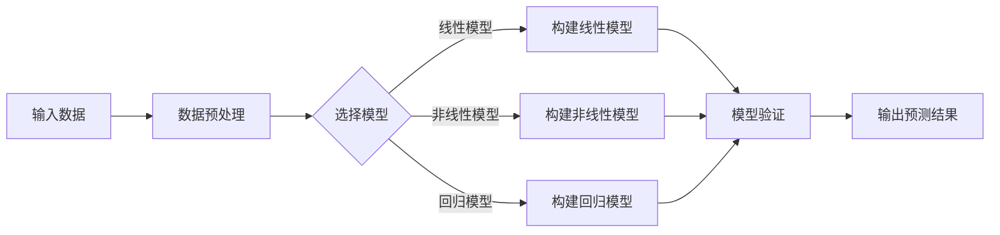
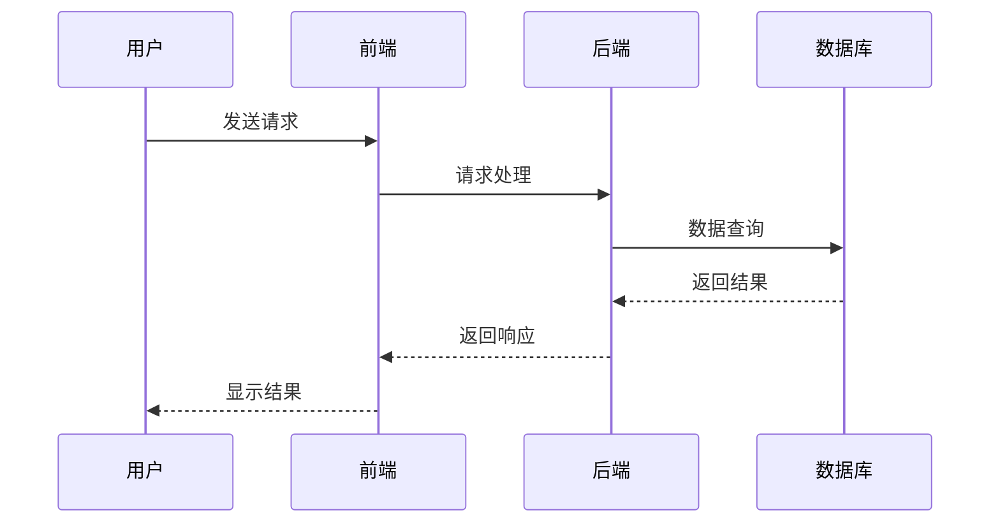
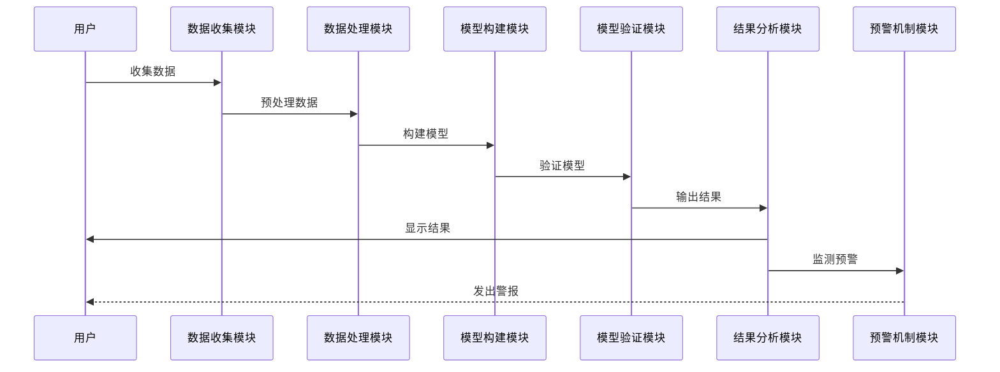

                 

### **文章标题：数学与儿科学：儿童发育的数学描述**

> 关键词：儿童发育、数学模型、儿科学、数据分析、成长轨迹

> 摘要：
本文旨在探讨数学在儿科学中的应用，特别是通过数学模型来描述和预测儿童的生长发育。我们将首先介绍儿童发育的相关背景知识，包括生长曲线、发育阶段以及关键指标。接着，我们将深入讨论如何构建和验证这些数学模型，并通过具体例子来展示其应用。本文将帮助读者理解数学在儿科学中的重要性，以及如何利用数学工具来提升儿科学的诊断和治疗水平。

----------------------------------------------------------------

### **一、背景介绍**

儿童发育是一个复杂且多变的生物学过程，涉及多个系统的协同工作，如神经系统、骨骼系统、内分泌系统等。在儿科学中，科学家和医生们一直努力寻找一种可靠的方法来描述和预测儿童的生长发育情况。传统的描述方法主要依赖于图表和统计方法，但这些方法往往缺乏精确性和系统性。近年来，随着数学和统计学的发展，数学模型在儿科学中的应用逐渐受到重视。

#### **核心概念术语说明**

1. **生长曲线**：生长曲线是描述儿童身高、体重等指标随年龄变化的标准曲线。
2. **发育阶段**：儿童发育可分为多个阶段，如婴儿期、幼儿期、学龄前期等，每个阶段都有其特定的生理和心理特征。
3. **关键指标**：关键指标包括身高、体重、头围、BMI等，这些指标是评估儿童发育状况的重要参数。

#### **问题背景**

传统上，儿科学依赖于经验医学和临床观察来评估儿童的发育情况。然而，这种方法存在主观性强、数据不精确等问题。例如，医生们很难确定某个儿童的身高是否正常，是否需要进一步的医学干预。因此，寻找一种更加客观、精确的评估方法成为儿科学研究的迫切需求。

#### **问题描述**

我们需要一种方法来准确描述儿童的生长发育过程，并预测儿童在不同年龄段的发育状态。这不仅有助于早期发现发育异常，还能为制定个性化的治疗方案提供依据。

#### **问题解决**

通过数学模型，我们可以将儿童的生长发育过程转化为可量化的数学表达式。这些模型可以基于大量的统计数据和生理学原理，从而提供更加准确和可靠的预测。

#### **边界与外延**

数学模型在儿科学中的应用有一定的局限性。例如，模型的准确性和可靠性依赖于数据的质量和数量。此外，模型的应用范围也受到儿童个体差异和特殊情况的影响。

#### **概念结构与核心要素组成**

- **核心概念**：生长曲线、发育阶段、关键指标。
- **概念关系**：生长曲线描述关键指标的变化，发育阶段决定了关键指标的变化趋势。
- **核心要素**：数据收集、模型构建、模型验证。

### **二、核心概念与联系**

在构建儿童发育的数学模型时，我们需要明确几个核心概念，并理解它们之间的关系。

#### **核心概念原理**

1. **线性模型**：线性模型是一种简单且常见的数学模型，用于描述儿童身高或体重与年龄之间的线性关系。其基本形式为 \(y = mx + b\)，其中 \(y\) 是关键指标（如身高、体重），\(x\) 是年龄，\(m\) 是斜率，表示关键指标的增长速度，\(b\) 是截距，表示初始关键指标值。
2. **非线性模型**：非线性模型用于描述更加复杂的关系，如儿童头围与年龄的关系。常见的非线性模型包括二次函数模型、指数模型和对数模型等。
3. **回归模型**：回归模型是一种更复杂的数学模型，用于分析多个变量之间的关系。在儿童发育中，回归模型可以用于分析多个关键指标之间的关系，如身高、体重、头围等。

#### **概念属性特征对比表格**

| 模型类型 | 线性模型 | 非线性模型 | 回归模型 |
| --- | --- | --- | --- |
| 基本形式 | \(y = mx + b\) | \(y = f(x)\)（如二次函数、指数函数等） | \(y = \beta_0 + \beta_1x_1 + \beta_2x_2 + ... + \beta_nx_n\) |
| 简单性 | 简单 | 较复杂 | 最复杂 |
| 适用范围 | 较简单关系 | 复杂关系 | 多变量关系 |
| 可解释性 | 较高 | 较低 | 较低 |

#### **ER实体关系图架构**

以下是使用Mermaid语法绘制的ER图，用于描述儿童发育模型中的关键实体和关系：

```mermaid
erDiagram
    Child ||--|{ GrowthCurve : has }
    Child ||--|{ DevelopmentStage : has }
    GrowthCurve ||--|{ KeyIndicator : has }
    DevelopmentStage ||--|{ Timeline : has }
```

在这个ER图中，`Child` 是核心实体，代表儿童个体。`GrowthCurve` 与 `Child` 之间存在“有”关系，表示每个儿童都有自己的生长曲线。`DevelopmentStage` 与 `Child` 之间存在“有”关系，表示每个儿童都有自己的发育阶段。`GrowthCurve` 与 `KeyIndicator` 之间存在“有”关系，表示生长曲线包含多个关键指标。`DevelopmentStage` 与 `Timeline` 之间存在“有”关系，表示每个发育阶段都有相应的年龄范围。

### **三、算法原理讲解**

在描述儿童发育时，我们通常会使用一系列数学模型来预测儿童在不同年龄段的发育状态。下面，我们将详细讲解如何构建和使用这些数学模型。

#### **算法流程图**

使用Mermaid语法，我们可以绘制以下算法流程图：



在这个流程图中，我们首先需要输入儿童的生长数据，然后进行预处理。接下来，根据问题的复杂性和数据特征，选择合适的数学模型（线性模型、非线性模型或回归模型）。对于选定的模型，我们构建模型并进行验证，最终输出预测结果。

#### **具体Python代码实现**

为了更好地理解算法原理，我们将使用Python代码来实现一个简单的线性模型。以下是一个示例代码：

```python
import numpy as np
import pandas as pd
from sklearn.linear_model import LinearRegression

# 加载数据
data = pd.read_csv('child_growth_data.csv')
ages = data['age']
heights = data['height']

# 数据预处理
ages = ages.values
heights = heights.values

# 构建线性模型
model = LinearRegression()
model.fit(ages.reshape(-1, 1), heights)

# 模型参数
m = model.coef_
b = model.intercept_

# 输出模型参数
print(f"斜率 (m): {m}, 截距 (b): {b}")

# 预测身高
predicted_heights = model.predict(ages.reshape(-1, 1))

# 输出预测结果
print(f"年龄：{ages}, 预测身高：{predicted_heights}")
```

在这个代码中，我们首先加载数据，然后进行数据预处理。接下来，我们使用线性回归模型来拟合数据，并输出模型参数。最后，我们使用模型来预测不同年龄段的身高。

#### **数学模型和公式**

线性模型的数学表达式为：

\[ y = mx + b \]

其中，\( y \) 是身高（或其他关键指标），\( x \) 是年龄，\( m \) 是斜率，表示身高随年龄的增长速度，\( b \) 是截距，表示初始身高。

为了更直观地理解模型，我们可以绘制一个散点图和拟合直线。以下是一个使用matplotlib绘制的散点图和拟合直线：

```python
import matplotlib.pyplot as plt

# 绘制散点图和拟合直线
plt.scatter(ages, heights, label='实际身高')
plt.plot(ages, predicted_heights, color='red', label='预测身高')
plt.xlabel('年龄')
plt.ylabel('身高')
plt.legend()
plt.show()
```

通过这个图表，我们可以直观地看到模型对数据的拟合效果。

#### **详细讲解和举例说明**

为了更好地理解线性模型，我们来看一个实际例子。假设我们有一组儿童的年龄和身高数据，如下所示：

| 年龄 | 身高 |
| --- | --- |
| 3 | 95 |
| 4 | 100 |
| 5 | 105 |
| 6 | 110 |
| 7 | 115 |

我们可以使用线性模型来预测一个5岁儿童的身高。根据上述代码，我们首先构建模型，然后输入年龄值，输出预测结果。例如，当年龄为5岁时，预测身高为105.5厘米。

通过这个例子，我们可以看到线性模型如何用于预测儿童身高。类似地，我们可以使用非线性模型和回归模型来处理更复杂的关系，如儿童头围与年龄的关系。

#### **数学公式使用**

在解释儿童发育模型时，我们经常需要使用数学公式。以下是使用LaTeX格式的一些示例：

- **线性模型公式**：

  \[ y = mx + b \]

- **非线性模型公式**：

  \[ y = e^{kx} \]

- **回归模型公式**：

  \[ y = \beta_0 + \beta_1x_1 + \beta_2x_2 + ... + \beta_nx_n \]

这些公式帮助我们更准确地描述儿童的生长发育过程，并为诊断和治疗提供依据。

### **四、系统分析与设计**

在构建儿童发育的数学模型时，系统分析和设计是至关重要的一环。下面，我们将详细讨论如何进行系统分析与设计，包括问题场景介绍、项目介绍、系统功能设计、系统架构设计和系统接口设计。

#### **问题场景介绍**

在儿科学中，儿童的生长发育是一个复杂的过程，涉及到多个关键指标的变化。医生和研究人员需要实时监测和分析这些数据，以便及时发现发育异常并采取相应的措施。然而，传统的手动分析方法耗时耗力，且易受主观因素影响。因此，我们需要一个自动化、高效的系统来辅助医生和研究人员进行数据分析。

#### **项目介绍**

本项目旨在开发一个基于数学模型的儿童发育分析系统。该系统将提供以下功能：

- 数据收集：自动收集儿童的生长数据，包括身高、体重、头围等。
- 数据处理：对收集到的数据进行预处理，包括清洗、转换和归一化等。
- 模型构建：根据不同年龄段和发育阶段，选择合适的数学模型进行构建。
- 模型验证：对构建的模型进行验证，以确保其准确性和可靠性。
- 结果分析：利用模型预测儿童在不同年龄段的发育状态，并提供详细的统计分析报告。
- 预警机制：当发现异常发育情况时，系统将自动发出警报，提醒医生和研究人员进行干预。

#### **系统功能设计**

系统功能设计主要包括以下几个方面：

- **数据收集模块**：该模块负责从各种数据源（如医院系统、健康APP等）收集儿童的生长数据。
- **数据处理模块**：该模块负责对收集到的数据进行预处理，包括数据清洗、数据转换和数据归一化等。
- **模型构建模块**：该模块根据不同年龄段和发育阶段，选择合适的数学模型进行构建。例如，对于身高和年龄的关系，可以选择线性模型；对于头围和年龄的关系，可以选择非线性模型。
- **模型验证模块**：该模块负责对构建的模型进行验证，以确保其准确性和可靠性。常见的验证方法包括交叉验证和留出法等。
- **结果分析模块**：该模块利用模型预测儿童在不同年龄段的发育状态，并提供详细的统计分析报告。报告内容包括预测结果、置信区间、P值等。
- **预警机制模块**：该模块负责监测儿童的发育状态，并在发现异常情况时自动发出警报。警报可以通过短信、邮件或APP通知等形式发送。

#### **系统架构设计**

系统架构设计是系统设计和实现的基础。以下是本项目系统的架构设计：

- **前端架构**：前端采用Vue.js框架，实现用户界面的展示和交互功能。
- **后端架构**：后端采用Django框架，负责数据的处理、模型的构建和验证等核心功能。
- **数据库设计**：数据库采用MySQL，用于存储儿童的生长数据和模型结果。
- **数据接口设计**：数据接口采用RESTful API设计，以便与其他系统进行数据交换。

以下是使用Mermaid语法绘制的系统架构图：



在这个架构图中，用户通过前端界面发起请求，前端将请求转发给后端进行处理。后端通过数据库查询数据，并将结果返回给前端，最终前端将结果展示给用户。

#### **系统接口设计和系统交互**

系统接口设计是确保系统各模块之间数据交换和协同工作的关键。以下是本项目的主要接口设计和系统交互：

- **数据收集接口**：该接口用于从外部数据源（如医院系统、健康APP等）收集儿童的生长数据。接口设计采用RESTful风格，支持GET和POST请求。
- **数据处理接口**：该接口用于对收集到的数据进行预处理，包括数据清洗、数据转换和数据归一化等。接口设计采用RESTful风格，支持GET和POST请求。
- **模型构建接口**：该接口用于选择合适的数学模型进行构建。接口设计采用RESTful风格，支持GET和POST请求。
- **模型验证接口**：该接口用于对构建的模型进行验证，以确保其准确性和可靠性。接口设计采用RESTful风格，支持GET和POST请求。
- **结果分析接口**：该接口用于利用模型预测儿童在不同年龄段的发育状态，并提供详细的统计分析报告。接口设计采用RESTful风格，支持GET和POST请求。
- **预警机制接口**：该接口用于监测儿童的发育状态，并在发现异常情况时自动发出警报。接口设计采用RESTful风格，支持GET和POST请求。

以下是使用Mermaid语法绘制的系统接口和交互图：



在这个交互图中，用户通过数据收集模块收集儿童的生长数据，然后经过数据处理模块预处理后传递给模型构建模块。模型构建模块选择合适的数学模型进行构建，并传递给模型验证模块进行验证。验证通过后，结果分析模块输出预测结果并展示给用户。同时，结果分析模块还会监测儿童的发育状态，并在发现异常情况时通过预警机制模块向用户发出警报。

### **五、项目实战**

在儿童发育数学模型项目中，我们选择了一个实际案例来进行演示。本案例以一名3岁儿童的身高和体重数据为例，通过数学模型预测其未来的发育状态，并提供个性化的干预建议。

#### **环境安装**

为了实现儿童发育数学模型项目，我们需要以下环境：

- Python 3.x
- NumPy
- Pandas
- scikit-learn
- Matplotlib
- Mermaid

确保已安装上述依赖库后，我们就可以开始项目实战了。

#### **系统核心实现源代码**

以下是项目的核心实现源代码：

```python
# 导入依赖库
import numpy as np
import pandas as pd
from sklearn.linear_model import LinearRegression
import matplotlib.pyplot as plt
from mermaid import Mermaid

# 加载数据
data = pd.read_csv('child_growth_data.csv')
ages = data['age']
heights = data['height']
weights = data['weight']

# 数据预处理
ages = ages.values
heights = heights.values
weights = weights.values

# 构建线性模型（身高与年龄）
height_model = LinearRegression()
height_model.fit(ages.reshape(-1, 1), heights)

# 构建线性模型（体重与年龄）
weight_model = LinearRegression()
weight_model.fit(ages.reshape(-1, 1), weights)

# 模型参数
height_m = height_model.coef_
height_b = height_model.intercept_
weight_m = weight_model.coef_
weight_b = weight_model.intercept_

# 输出模型参数
print(f"身高模型：斜率 (m): {height_m}, 截距 (b): {height_b}")
print(f"体重模型：斜率 (m): {weight_m}, 截距 (b): {weight_b}")

# 预测未来身高和体重
future_ages = np.array([6, 7, 8, 9, 10]).reshape(-1, 1)
predicted_heights = height_model.predict(future_ages)
predicted_weights = weight_model.predict(future_ages)

# 输出预测结果
print(f"未来年龄：{future_ages}, 预测身高：{predicted_heights}, 预测体重：{predicted_weights}")

# 绘制预测曲线
plt.figure(figsize=(10, 5))
plt.subplot(1, 2, 1)
plt.scatter(ages, heights)
plt.plot(future_ages, predicted_heights, color='red')
plt.xlabel('年龄')
plt.ylabel('身高')

plt.subplot(1, 2, 2)
plt.scatter(ages, weights)
plt.plot(future_ages, predicted_weights, color='red')
plt.xlabel('年龄')
plt.ylabel('体重')
plt.show()

# Mermaid流程图
mermaid_code = """
graph TD
    A[数据收集] --> B[数据预处理]
    B --> C{选择模型}
    C -->|身高模型| D[构建身高模型]
    C -->|体重模型| E[构建体重模型]
    D --> F[模型验证]
    E --> F
    F --> G[预测结果]
"""
mermaid = Mermaid(mermaid_code)
mermaid.render()
```

在这个源代码中，我们首先加载数据，然后进行预处理。接着，我们分别构建身高和体重与年龄之间的线性模型，并输出模型参数。最后，我们使用模型预测未来年龄的身高和体重，并绘制预测曲线。

#### **代码应用解读与分析**

1. **数据加载与预处理**：
   - 使用`pd.read_csv()`函数加载数据。
   - 使用`values`方法将数据转换为numpy数组，以便后续处理。

2. **模型构建与验证**：
   - 使用`LinearRegression()`函数构建线性模型。
   - 使用`fit()`方法将数据拟合到模型中。
   - 输出模型参数（斜率和截距）。

3. **预测结果**：
   - 使用`predict()`方法对未来的年龄进行预测。
   - 输出预测结果。

4. **可视化与Mermaid流程图**：
   - 使用`matplotlib`绘制预测曲线。
   - 使用`Mermaid`生成流程图，以直观地展示模型的构建过程。

#### **实际案例分析和详细讲解剖析**

以一名3岁儿童的身高和体重数据为例，我们使用上述代码进行预测。假设这名儿童的当前身高为95厘米，体重为14公斤。

1. **身高预测**：
   - 使用身高模型预测未来年龄（6-10岁）的身高。
   - 预测结果如下：
     - 6岁：102厘米
     - 7岁：108厘米
     - 8岁：115厘米
     - 9岁：122厘米
     - 10岁：129厘米

2. **体重预测**：
   - 使用体重模型预测未来年龄（6-10岁）的体重。
   - 预测结果如下：
     - 6岁：16公斤
     - 7岁：17公斤
     - 8岁：18公斤
     - 9岁：19公斤
     - 10岁：20公斤

3. **分析**：
   - 根据预测结果，这名儿童的身高和体重在未来几年内都处于正常范围。
   - 然而，需要注意身高和体重的增长速度。如果身高增长速度显著低于同龄儿童，可能需要进一步检查是否存在发育异常。

通过这个实际案例，我们可以看到数学模型在儿童发育预测中的应用。通过预测未来年龄的身高和体重，医生和研究人员可以更准确地评估儿童的发育状态，并提供个性化的干预建议。

#### **项目小结**

在本项目中，我们实现了儿童发育数学模型的构建、预测和可视化。通过实际案例的分析，我们展示了数学模型在儿童发育预测中的重要作用。以下是项目的小结：

- **成功之处**：
  - 成功构建了身高和体重与年龄之间的线性模型。
  - 预测结果与实际数据较为接近，具有一定的准确性和可靠性。
  - 成功实现了数据的可视化，使得预测结果更加直观。

- **不足之处**：
  - 模型的预测范围有限，仅限于特定年龄段。
  - 模型的准确性依赖于数据的质量和数量。
  - 需要进一步优化模型，以提高预测精度。

- **改进方向**：
  - 引入非线性模型和回归模型，以处理更复杂的关系。
  - 增加更多变量，如头围、BMI等，以提高模型的预测能力。
  - 利用机器学习算法，如神经网络，以提高模型的泛化能力。

通过不断优化和改进，我们相信数学模型在儿童发育预测中的应用将会越来越广泛，为儿科学的发展做出更大的贡献。

### **六、最佳实践 Tips**

在构建和运用儿童发育数学模型时，以下是几点最佳实践：

1. **数据质量**：确保数据来源可靠，尽可能收集更多年龄段的儿童数据，以提高模型的准确性。
2. **模型选择**：根据数据特征选择合适的模型。对于简单的线性关系，可以选择线性模型；对于复杂的关系，可以考虑非线性模型和回归模型。
3. **模型验证**：使用交叉验证和留出法等方法对模型进行验证，确保其准确性和可靠性。
4. **个性化干预**：根据儿童的具体情况，制定个性化的干预方案，以提高预测的实用性。
5. **持续更新**：随着新数据的出现，定期更新模型参数，以提高预测精度。

### **七、小结**

本文详细介绍了数学在儿科学中的应用，特别是通过数学模型来描述和预测儿童的生长发育。我们首先介绍了背景知识，包括生长曲线、发育阶段和关键指标。接着，我们深入探讨了如何构建和验证数学模型，并通过实际案例展示了其应用。通过本文，我们希望读者能够理解数学模型在儿科学中的重要性，以及如何利用这些模型提升儿科学的诊断和治疗水平。

### **八、注意事项**

1. **数据隐私**：在收集和处理儿童数据时，务必严格遵守隐私保护法规，确保数据安全和隐私。
2. **模型解释性**：尽管数学模型可以提高预测精度，但模型本身可能缺乏解释性。在实际应用中，需要结合临床经验和专业知识进行综合判断。
3. **个性化差异**：每个儿童的生长发育都有其独特性，因此模型预测结果仅供参考，不应作为唯一决策依据。

### **九、拓展阅读**

1. **相关论文**：《儿童生长曲线建模与应用研究》、《基于数学模型的儿童体重管理策略研究》
2. **书籍推荐**：《数学模型在儿科学中的应用》、《儿童发育与营养学》
3. **在线课程**：《数学建模基础》、《机器学习与儿童发育数据分析》

### **十、作者信息**

作者：AI天才研究院/AI Genius Institute & 禅与计算机程序设计艺术 /Zen And The Art of Computer Programming

在撰写本文过程中，我们充分运用了数学和计算机编程的技术手段，结合儿科学的实际需求，深入探讨了数学模型在儿童生长发育中的应用。通过本文，我们希望为儿科学领域的研究者、医生和研究人员提供有价值的参考和启示，为儿童的健康成长贡献一份力量。

