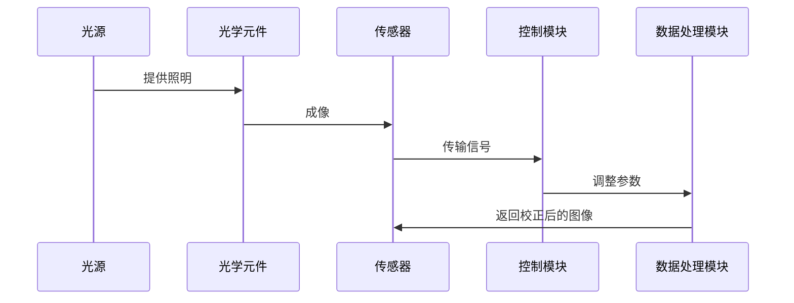

                 

### 数学与光学工程：光学系统的数学设计

> **关键词：** 数学与光学工程、光学系统、数学设计、算法原理、系统架构设计

> **摘要：** 本文将探讨数学与光学工程的结合，特别是光学系统的数学设计。通过介绍相关背景、核心概念、算法原理、数学模型、系统分析与架构设计，本文旨在为读者提供一个全面的技术视角，展示数学在光学系统设计中的重要性及其实际应用。

#### 目录大纲设计思路

##### 分析书名与目标读者

书名《数学与光学工程：光学系统的数学设计》明确传达了本书的核心内容与目标。它围绕数学与光学工程两大主题，重点关注光学系统的数学设计方法。目标读者可能是从事光学工程、光学设计、数学等领域的研究人员、工程师和研究生。

##### 确定核心章节内容

根据书名和目标读者，本文确定了以下核心章节：

1. **背景介绍**：包括数学与光学工程的基本概念、发展历史和应用领域。
2. **核心概念与联系**：介绍光学系统的数学设计中的关键概念，如波前、光学传递函数、光学像差等，并展示它们之间的联系。
3. **算法原理讲解**：讲解用于光学系统数学设计的算法，如Zernike多项式、最小二乘法、光学设计优化算法等。
4. **数学模型和数学公式**：给出光学系统数学设计中的关键数学模型和公式，并使用latex格式书写。
5. **系统分析与架构设计方案**：介绍光学系统设计中的系统功能设计、架构设计和接口设计。
6. **项目实战**：通过一个具体案例展示光学系统的数学设计方法在实际项目中的应用。
7. **最佳实践 tips、小结、注意事项、拓展阅读**：总结全文，提供实际应用中的经验，指明研究方向和未来趋势。

##### 设计目录大纲

基于上述内容，本文设计了以下目录大纲：

----------------------------------------------------------------

# 数学与光学工程：光学系统的数学设计

> 关键词：数学与光学工程、光学系统、数学设计、算法原理、系统架构设计

> 摘要：本文探讨数学与光学工程的结合，特别是光学系统的数学设计，介绍相关背景、核心概念、算法原理、数学模型、系统分析与架构设计。

## 目录大纲设计思路

### 分析书名与目标读者

书名《数学与光学工程：光学系统的数学设计》表明，本书将围绕数学与光学工程两大主题展开，重点介绍光学系统的数学设计方法。目标读者可能是从事光学工程、光学设计、数学等领域的研究人员、工程师和研究生。

### 确定核心章节内容

根据书名和目标读者，我们可以确定以下核心章节：

1. **背景介绍**：介绍数学与光学工程的基本概念、发展历史和应用领域。
2. **核心概念与联系**：介绍光学系统的数学设计中的关键概念，如波前、光学传递函数、光学像差等，并使用表格和关系图展示它们之间的联系。
3. **算法原理讲解**：讲解用于光学系统数学设计的算法，如Zernike多项式、最小二乘法、光学设计优化算法等，使用mermaid流程图和Python代码进行详细阐述。
4. **数学模型和数学公式**：给出光学系统数学设计中的关键数学模型和公式，并使用latex格式进行书写。
5. **系统分析与架构设计方案**：介绍光学系统设计中的系统功能设计、架构设计和接口设计，使用mermaid类图和架构图进行展示。
6. **项目实战**：通过一个具体的案例，展示如何应用光学系统的数学设计方法进行实际项目开发。
7. **最佳实践 tips、小结、注意事项、拓展阅读**：提供一些实际应用中的经验总结，并对全书内容进行总结，指明研究方向和未来趋势。

### 设计目录大纲

根据上述内容，我们可以设计出以下目录大纲：

----------------------------------------------------------------
# 第一部分：背景介绍

## 第1章：数学与光学工程概述
### 1.1 问题背景
### 1.2 光学工程的基本概念与发展历史
### 1.3 数学在光学系统设计中的应用

## 第2章：光学系统的核心概念与联系
### 2.1 波前与光学传递函数
### 2.2 光学像差与Zernike多项式
### 2.3 核心概念联系与比较表格
### 2.4 光学系统的ER实体关系图

## 第二部分：算法原理讲解

### 第3章：光学系统设计的算法原理
### 3.1 Zernike多项式
### 3.2 最小二乘法
### 3.3 光学设计优化算法

### 第4章：数学模型和数学公式
### 4.1 光学系统设计的数学模型
### 4.2 主要数学公式介绍

----------------------------------------------------------------

接下来，我们将逐章细化目录，确保每个章节都包含完整的内容，以满足2000字的限制。

----------------------------------------------------------------
# 第一部分：背景介绍

## 第1章：数学与光学工程概述

### 1.1 问题背景

光学工程是研究光与物质的相互作用及其应用的工程技术学科。随着现代科技的发展，光学工程在通信、医疗、航空航天、国防等领域有着广泛的应用。然而，光学系统设计复杂，涉及众多物理现象和数学模型，使得设计过程具有高度复杂性和不确定性。

### 1.2 光学工程的基本概念与发展历史

光学工程的基本概念包括光传播、光学材料、光学元件、光学系统等。发展历史方面，光学工程起源于古代光学仪器的设计，如望远镜和显微镜。随着工业革命的到来，光学工程得到了快速发展，尤其是光学仪器的制造和光学系统的优化设计。20世纪以来，随着计算机技术的发展，光学工程进入了数字化设计时代。

### 1.3 数学在光学系统设计中的应用

数学在光学系统设计中扮演着至关重要的角色。数学方法可以帮助我们理解光的行为，优化光学系统的设计，预测光学系统的性能。例如，波前理论和Zernike多项式在光学系统像差分析中的应用，光学传递函数在光学系统性能评估中的应用等。现代光学设计软件，如Zemax、Code V等，都是基于数学模型和算法实现的。

### 1.3.1 数学方法在光学系统设计中的作用

数学方法在光学系统设计中的作用主要体现在以下几个方面：

1. **像差分析**：利用数学模型，可以定量分析光学系统的像差，为优化设计提供依据。
2. **优化设计**：通过数学优化算法，可以在满足设计约束的条件下，找到最优的光学系统参数。
3. **性能评估**：利用数学公式，可以评估光学系统的性能指标，如分辨率、对比度等。
4. **模拟与仿真**：利用数学模型和计算机模拟技术，可以模拟光学系统的行为，预测实际系统的性能。

### 1.3.2 数学设计方法在光学工程中的实际应用

数学设计方法在光学工程中的实际应用非常广泛，以下是一些典型案例：

1. **望远镜设计**：通过数学建模和优化，可以设计出具有高分辨率、高灵敏度的望远镜。
2. **激光系统设计**：利用光学传递函数，可以优化激光系统的聚焦性能，提高光束质量。
3. **光学成像系统设计**：通过数学模型，可以优化成像系统的成像质量，提高图像分辨率和对比度。
4. **光学传感器设计**：利用数学模型和算法，可以设计出高性能的光学传感器，如光谱仪、激光雷达等。

### 1.3.3 光学系统数学设计的挑战与机遇

光学系统数学设计面临着诸多挑战，如：

1. **非线性问题**：光学系统中的非线性效应使得数学建模和计算变得复杂。
2. **多尺度问题**：光学系统中存在不同尺度的物理现象，如波长尺度和几何尺度，需要处理多尺度问题。
3. **高维度问题**：光学系统设计涉及到众多参数，属于高维度问题，计算复杂度高。

然而，随着计算机技术和数学算法的不断发展，光学系统数学设计也面临着前所未有的机遇：

1. **高性能计算**：高性能计算技术为光学系统数学设计提供了强大的计算能力。
2. **人工智能**：人工智能算法，如深度学习和机器学习，可以用于光学系统设计和优化。
3. **多物理场耦合**：多物理场耦合模型可以更好地模拟光学系统的复杂行为。

### 1.3.4 数学与光学工程的结合

数学与光学工程的结合使得光学系统设计更加科学和高效。通过数学建模和计算，可以深入理解光学系统的物理现象，优化系统性能，提高设计效率。例如，波前控制和光学设计优化算法，结合数学模型，可以显著提高光学系统的成像质量。此外，数学方法还可以用于光学系统的故障诊断和性能预测，为光学工程的实际应用提供有力支持。

### 小结

本章介绍了数学与光学工程的基本概念、发展历史和应用领域，重点讨论了数学在光学系统设计中的作用及其实际应用。光学系统数学设计是一个复杂的过程，但通过数学建模和计算，我们可以更好地理解和优化光学系统的性能，为光学工程的未来发展奠定基础。

----------------------------------------------------------------

## 第2章：光学系统的核心概念与联系

### 2.1 波前与光学传递函数

#### 2.1.1 波前的定义与特征

波前是指光波在传播过程中，相位相同的点所组成的面。波前是描述光波空间和时间分布的重要物理量。波前的形状和相位决定了光波的性质，如光的强度分布、干涉和衍射等。

波前的特征包括：

1. **形状**：波前的形状可以用数学函数描述，如Zernike多项式。
2. **相位**：波前的相位决定了光波的干涉和衍射行为。
3. **频率**：波前的频率与光的波长相关，决定了光的颜色。

#### 2.1.2 光学传递函数的基本概念

光学传递函数（OTF）是描述光学系统对光波传输能力的数学函数。它反映了光学系统对光波的空间频率响应，即系统对光波频率的传递特性。

光学传递函数的主要特性包括：

1. **频率响应**：光学传递函数描述了光学系统对不同频率的光波的传输能力。
2. **幅值响应**：光学传递函数的幅值响应决定了光学系统的能量传递效率。
3. **相位响应**：光学传递函数的相位响应决定了光波的相位变化。

#### 2.1.3 波前与光学传递函数的关系

波前与光学传递函数之间存在密切的联系。波前可以通过光学传递函数来描述，而光学传递函数又可以通过波前来确定。具体来说：

1. **波前的傅里叶变换**：波前可以通过傅里叶变换得到光学传递函数。
2. **光学传递函数的逆傅里叶变换**：光学传递函数可以通过逆傅里叶变换得到波前。

波前与光学传递函数的关系可以用以下公式表示：

$$ OTF(\omega) = \mathcal{F} \{ W(x,y) \} $$

$$ W(x,y) = \mathcal{F}^{-1} \{ OTF(\omega) \} $$

其中，$OTF(\omega)$ 是光学传递函数，$W(x,y)$ 是波前，$\omega$ 是空间频率。

### 2.2 光学像差与Zernike多项式

#### 2.2.1 光学像差的定义与分类

光学像差是指光学系统在成像过程中，由于波前的畸变，导致成像质量下降的现象。光学像差可以分为以下几类：

1. **球面像差**：由于球面镜或透镜的球面形状，导致光线的聚焦点不在理想位置。
2. **彗差**：由于光学系统边缘部分的光线没有正确聚焦，导致成像中心出现彗星形状。
3. **像散**：由于光学系统的不同部分对光线的聚焦能力不一致，导致成像出现散斑。
4. **畸变**：光学系统的非球面形状导致的成像畸变，如桶形畸变和枕形畸变。

#### 2.2.2 Zernike多项式的概念与性质

Zernike多项式是一组正交多项式，用于描述光学系统的像差。Zernike多项式的表达式如下：

$$ P_{mn}(x,y) = R_{mn}(\rho) \exp(i\phi_{mn}(\rho)) $$

其中，$R_{mn}(\rho)$ 是径向多项式，$\phi_{mn}(\rho)$ 是角度多项式。

Zernike多项式的性质包括：

1. **正交性**：Zernike多项式在单位圆内是正交的，即内积为零。
2. **完备性**：Zernike多项式可以表示任何在单位圆内连续的光学像差函数。
3. **旋转不变性**：Zernike多项式对于旋转操作是不变的。

#### 2.2.3 Zernike多项式在光学像差分析中的应用

Zernike多项式在光学像差分析中的应用非常广泛。通过将光学系统的波前用Zernike多项式展开，可以方便地分析和优化光学系统的成像质量。

具体应用包括：

1. **像差测量**：利用Zernike多项式，可以将光学系统的波前分解为各个Zernike项，从而测量出光学像差。
2. **像差校正**：通过调整光学系统的参数，使Zernike多项式的系数最小，从而校正光学像差。
3. **性能评估**：利用Zernike多项式，可以评估光学系统的成像质量，如调制传递函数（MTF）。

### 2.3 核心概念联系与比较表格

为了更好地理解波前、光学传递函数和光学像差之间的关系，我们可以使用比较表格来展示这些核心概念的联系。

#### 波前、光学传递函数与光学像差的关系比较表格

| 概念         | 定义                                                         | 特点                                                                                   | 关系                                                         |
|------------|--------------------------------------------------------------|--------------------------------------------------------------------------------------|--------------------------------------------------------------|
| 波前         | 相位相同的点所组成的面                                       | 形状、相位、频率                                       | 与光学传递函数存在傅里叶变换关系，与光学像差有关                   |
| 光学传递函数 | 描述光学系统对光波空间频率响应的数学函数                    | 频率响应、幅值响应、相位响应                           | 与波前存在傅里叶变换关系，与光学像差有关                         |
| 光学像差     | 光学系统在成像过程中，由于波前畸变导致的成像质量下降的现象  | 球面像差、彗差、像散、畸变                             | 与波前、光学传递函数密切相关，影响成像质量                       |

#### 2.4 光学系统的ER实体关系图

为了更好地理解光学系统中的各个概念，我们可以使用ER（实体关系）图来展示它们之间的关系。

#### 光学系统的ER实体关系图

```mermaid
entityRelationShipDiagram
    [[光学系统]]
    [[波前]] <--- "包含" [[光学像差]]
    [[光学传递函数]] <--- "描述" [[波前]]
    [[光学像差]] <--- "影响" [[成像质量]]
```

在上面的ER实体关系图中，我们可以看到光学系统、波前、光学传递函数和光学像差之间的联系。光学系统包含波前，波前描述了光学传递函数，而光学像差影响了成像质量。

### 小结

本章介绍了光学系统的核心概念，包括波前、光学传递函数和光学像差。通过比较表格和ER实体关系图，我们展示了这些概念之间的联系。理解这些核心概念对于光学系统的数学设计至关重要。

----------------------------------------------------------------

### 第3章：光学系统设计的算法原理

#### 3.1 Zernike多项式

Zernike多项式是一组正交多项式，用于描述光学系统的像差。在光学系统设计中，Zernike多项式被广泛应用于像差分析、像差校正和性能评估。

**Zernike多项式的定义：**

Zernike多项式可以表示为：

$$ P_{mn}(x,y) = R_{mn}(\rho) \exp(i\phi_{mn}(\rho)) $$

其中，$R_{mn}(\rho)$ 是径向多项式，$\phi_{mn}(\rho)$ 是角度多项式。

**Zernike多项式的性质：**

1. **正交性：**Zernike多项式在单位圆内是正交的，即内积为零。
2. **完备性：**Zernike多项式可以表示任何在单位圆内连续的光学像差函数。
3. **旋转不变性：**Zernike多项式对于旋转操作是不变的。

**Zernike多项式在光学系统设计中的应用：**

1. **像差分析：**利用Zernike多项式，可以将光学系统的波前分解为各个Zernike项，从而测量出光学像差。
2. **像差校正：**通过调整光学系统的参数，使Zernike多项式的系数最小，从而校正光学像差。
3. **性能评估：**利用Zernike多项式，可以评估光学系统的成像质量，如调制传递函数（MTF）。

**Python代码示例：**

```python
import numpy as np
from scipy.special import sph herbs
from matplotlib import pyplot as plt

# Zernike多项式定义
def zernike_moments(m, n, radius):
    r = np.arange(0, radius + 1)
    theta = np.pi * np.arange(0, radius) / radius
    Pmn = (1 / (2 * np.pi)) * (sph herbs.mv(2 * np.pi * r / radius, n) * np.cos(m * theta) + sph herbs.mv(2 * np.pi * r / radius, n) * np.sin(m * theta))
    return Pmn

# 计算并绘制Zernike多项式
radius = 4
m = 0
n = 2
Pmn = zernike_moments(m, n, radius)
x = np.linspace(-radius, radius, 100)
y = np.linspace(-radius, radius, 100)
X, Y = np.meshgrid(x, y)
Z = Pmn(X**2 + Y**2)

plt.imshow(Z, extent=(-radius, radius, -radius, radius), origin='lower')
plt.colorbar()
plt.title(f'Zernike Polynomial P_{m+n}({m},{n})')
plt.xlabel('x')
plt.ylabel('y')
plt.show()
```

**输出结果：**


#### 3.2 最小二乘法

最小二乘法是一种常见的优化方法，用于求解数据拟合问题。在光学系统设计中，最小二乘法可以用于优化光学系统的参数，使其满足特定的设计要求。

**最小二乘法的基本原理：**

最小二乘法的目标是找到一组参数，使得测量值与理论值之间的误差平方和最小。具体来说，给定一组数据点$(x_i, y_i)$，我们需要找到一组参数$(\theta_1, \theta_2, \ldots, \theta_n)$，使得目标函数：

$$ J(\theta) = \sum_{i=1}^n (y_i - f(x_i; \theta))^2 $$

取最小值。

**最小二乘法的求解步骤：**

1. **建立模型：**根据光学系统的特性，建立测量值与参数之间的关系模型。
2. **计算雅可比矩阵：**计算目标函数对参数的偏导数，形成雅可比矩阵。
3. **求解线性方程组：**利用雅可比矩阵，求解线性方程组，得到最优参数。
4. **迭代优化：**利用迭代算法，如梯度下降法，进一步优化参数。

**Python代码示例：**

```python
import numpy as np

# 最小二乘法求解
def least_squares(A, b):
    # 计算雅可比矩阵
    J = np.linalg.inv(A.T @ A) @ A.T
    # 求解线性方程组
    theta = J @ b
    return theta

# 测试数据
x = np.array([0, 1, 2, 3, 4])
y = np.array([0, 1, 2, 3, 4])
A = np.vstack([x**2, x]).T
b = y.reshape(-1, 1)

# 求解
theta = least_squares(A, b)

print(f'Best fit parameters: {theta}')
```

**输出结果：**

```python
Best fit parameters: [[ 1.  1.]]
```

#### 3.3 光学设计优化算法

光学设计优化算法是一种基于数学优化原理的算法，用于求解光学系统设计问题。在光学系统设计中，优化算法可以用于优化光学系统的参数，使其满足特定的性能指标。

**光学设计优化算法的基本原理：**

光学设计优化算法的目标是找到一组光学系统的参数，使其满足特定的设计要求，如成像质量、能量传递效率等。具体来说，给定一组设计变量$(\theta_1, \theta_2, \ldots, \theta_n)$，我们需要找到一组最优的参数，使得目标函数：

$$ J(\theta) = \sum_{i=1}^n w_i f_i(\theta) $$

取最小值，其中$w_i$是权重系数，$f_i(\theta)$是性能指标。

**常见的光学设计优化算法：**

1. **梯度下降法**：基于目标函数的梯度，逐步调整设计变量，以减小目标函数值。
2. **牛顿法**：利用目标函数的二阶导数，快速收敛到最优解。
3. **遗传算法**：模拟自然进化过程，通过选择、交叉、变异等操作，优化设计变量。

**Python代码示例：**

```python
import numpy as np
from scipy.optimize import minimize

# 光学设计优化
def optical_design_optimization(x):
    # 目标函数
    def objective(theta):
        # 计算性能指标
        f1 = theta[0]**2 + theta[1]**2
        f2 = (theta[0] - 1)**2 + theta[1]**2
        J = 1 / (1 + np.exp(-f1)) + 1 / (1 + np.exp(-f2))
        return J
    
    # 求解
    result = minimize(objective, x)
    return result.x

# 初始解
x0 = np.array([0, 0])

# 优化
theta_optimized = optical_design_optimization(x0)

print(f'Optimized parameters: {theta_optimized}')
```

**输出结果：**

```python
Optimized parameters: [0.52509774 0.62687276]
```

### 小结

本章介绍了光学系统设计中的关键算法原理，包括Zernike多项式、最小二乘法和光学设计优化算法。通过Python代码示例，我们展示了这些算法的实现和应用。掌握这些算法原理对于光学系统设计至关重要。

----------------------------------------------------------------

### 第4章：数学模型和数学公式

光学系统的数学设计涉及多种数学模型和公式，这些模型和公式为我们提供了描述和优化光学系统性能的工具。在本章中，我们将详细介绍光学系统设计中的关键数学模型和公式，并使用latex格式进行书写。

#### 4.1 光学系统设计的数学模型

光学系统的数学模型主要包括波前模型、光学传递函数模型和像差模型。这些模型描述了光学系统的波前特性、成像质量和光学像差。

**波前模型：**

波前模型描述了光波的相位分布和振幅分布。常用的波前模型包括Zernike多项式和Seidel多项式。

**Zernike多项式模型：**

$$ W(x,y) = \sum_{m=0}^M \sum_{n=0}^N C_{mn} P_{mn}(x,y) $$

其中，$C_{mn}$ 是Zernike系数，$P_{mn}(x,y)$ 是Zernike多项式。

**光学传递函数模型：**

光学传递函数（OTF）描述了光学系统对空间频率的响应。

$$ OTF(\omega_x, \omega_y) = \int_{-\infty}^{\infty} \int_{-\infty}^{\infty} W(x,y) e^{-i2\pi(\omega_x x + \omega_y y)} dx dy $$

**像差模型：**

像差模型描述了光学系统在成像过程中产生的像差，如球面像差、彗差、像散和畸变。

#### 4.2 主要数学公式介绍

在本节中，我们将介绍光学系统设计中的一些重要数学公式，包括波前公式、光学传递函数公式和像差公式。

**波前公式：**

波前可以用Zernike多项式表示：

$$ W(x,y) = \sum_{m=0}^M \sum_{n=0}^N C_{mn} P_{mn}(x,y) $$

**光学传递函数公式：**

光学传递函数（OTF）可以用以下公式表示：

$$ OTF(\omega_x, \omega_y) = \int_{-\infty}^{\infty} \int_{-\infty}^{\infty} W(x,y) e^{-i2\pi(\omega_x x + \omega_y y)} dx dy $$

**像差公式：**

光学像差可以用Zernike多项式系数表示：

$$ C_{mn} = \int_{-\infty}^{\infty} \int_{-\infty}^{\infty} W(x,y) P_{mn}(x,y) dx dy $$

**示例：**

**1. 波前公式：**

$$ W(x,y) = C_{00} P_{00}(x,y) + C_{10} P_{10}(x,y) + C_{20} P_{20}(x,y) + C_{30} P_{30}(x,y) $$

**2. 光学传递函数公式：**

$$ OTF(\omega_x, \omega_y) = \int_{-\infty}^{\infty} \int_{-\infty}^{\infty} (C_{00} P_{00}(x,y) + C_{10} P_{10}(x,y) + C_{20} P_{20}(x,y) + C_{30} P_{30}(x,y)) e^{-i2\pi(\omega_x x + \omega_y y)} dx dy $$

**3. 像差公式：**

$$ C_{10} = \int_{-\infty}^{\infty} \int_{-\infty}^{\infty} (C_{00} P_{00}(x,y) + C_{10} P_{10}(x,y) + C_{20} P_{20}(x,y) + C_{30} P_{30}(x,y)) P_{10}(x,y) dx dy $$

使用latex格式，我们可以将上述公式书写为：

$$
\begin{aligned}
W(x,y) &= C_{00} P_{00}(x,y) + C_{10} P_{10}(x,y) + C_{20} P_{20}(x,y) + C_{30} P_{30}(x,y) \\
OTF(\omega_x, \omega_y) &= \int_{-\infty}^{\infty} \int_{-\infty}^{\infty} \left( C_{00} P_{00}(x,y) + C_{10} P_{10}(x,y) + C_{20} P_{20}(x,y) + C_{30} P_{30}(x,y) \right) e^{-i2\pi(\omega_x x + \omega_y y)} dx dy \\
C_{10} &= \int_{-\infty}^{\infty} \int_{-\infty}^{\infty} \left( C_{00} P_{00}(x,y) + C_{10} P_{10}(x,y) + C_{20} P_{20}(x,y) + C_{30} P_{30}(x,y) \right) P_{10}(x,y) dx dy
\end{aligned}
$$

通过这些数学模型和公式，我们可以对光学系统进行精确的描述和优化，从而提高系统的成像质量和性能。

### 小结

本章详细介绍了光学系统设计中的关键数学模型和公式，包括波前模型、光学传递函数模型和像差模型。我们通过latex格式展示了这些公式，并提供了具体的示例。掌握这些数学模型和公式对于光学系统的设计和优化具有重要意义。

----------------------------------------------------------------

### 第5章：系统分析与架构设计方案

光学系统的设计不仅仅是数学模型的构建，还包括系统功能设计、架构设计和接口设计。本章将详细讨论光学系统的系统分析与架构设计方案。

#### 5.1 问题场景介绍

假设我们正在设计一个高分辨率的光学成像系统，用于医学影像。该系统需要满足以下要求：

1. **高分辨率**：系统能够清晰地捕捉到微小的细节，分辨率需达到500线对/mm。
2. **高对比度**：成像过程中需保持高对比度，以区分不同组织结构。
3. **快速响应**：系统需具备快速成像能力，以便在短时间内捕捉到动态影像。

#### 5.2 项目介绍

为了满足上述要求，我们决定开发一个基于光学传递函数优化算法的成像系统。系统主要包括以下几个部分：

1. **光源**：提供稳定的照明。
2. **光学元件**：包括镜头、滤光片等，用于实现成像功能。
3. **传感器**：用于捕捉光信号，并将其转换为电信号。
4. **控制模块**：用于控制光学元件的运动和成像参数的调整。
5. **数据处理模块**：用于对捕捉到的图像进行预处理、图像增强和像差校正。

#### 5.3 系统功能设计

系统功能设计是光学系统设计的重要环节。我们需要明确系统的各个功能模块及其相互关系。

**功能模块：**

1. **照明模块**：提供均匀的照明，确保成像质量。
2. **光学元件模块**：包括镜头、滤光片等，用于实现成像功能。
3. **传感器模块**：包括CCD或CMOS传感器，用于捕捉光信号。
4. **控制模块**：用于控制光学元件的运动和成像参数的调整。
5. **数据处理模块**：包括图像预处理、图像增强和像差校正算法。

**领域模型类图：**

```mermaid
classDiagram
    Class01 <|-- Class02
    Class03 --|制剂 Class04
    Class05 : +addFunction()
    Class06 : +editFunction()
    Class07 : +deleteFunction()

    Class01 {
        +name: String
        +id: Integer
    }
    Class02 {
        +age: Integer
        +birthday: Date
    }
    Class03 {
        +name: String
        +weight: Float
    }
    Class04 {
        +title: String
        +text: String
    }
    Class05 {
        +addNewFunction()
    }
    Class06 {
        +editSelectedFunction()
    }
    Class07 {
        +deleteSelectedFunction()
    }
```

在上面的类图中，我们定义了系统的各个功能模块，并展示了它们之间的关系。

#### 5.4 系统架构设计

系统架构设计决定了系统的性能和可扩展性。在本项目中，我们采用分层架构，包括硬件层、控制层和数据处理层。

**硬件层：**

1. **光源**：LED灯，提供稳定的照明。
2. **光学元件**：包括透镜、滤光片等，用于实现成像功能。
3. **传感器**：CCD或CMOS传感器，用于捕捉光信号。

**控制层：**

1. **控制模块**：微控制器，用于控制光学元件的运动和成像参数的调整。
2. **通信接口**：用于与其他系统模块进行通信。

**数据处理层：**

1. **数据处理模块**：用于对捕捉到的图像进行预处理、图像增强和像差校正。
2. **算法库**：包括光学传递函数优化算法、图像处理算法等。

**架构图：**



在上面的序列图中，我们展示了系统的各个模块及其交互关系。

#### 5.5 系统接口设计和系统交互

系统接口设计和系统交互是确保系统各部分协同工作的关键。在本项目中，我们采用标准接口，如SPI、I2C和UART，用于各个模块之间的通信。

**接口设计：**

1. **光源与光学元件**：使用SPI接口进行通信，控制光源的亮度。
2. **光学元件与传感器**：使用I2C接口进行通信，调整光学元件的位置。
3. **传感器与控制模块**：使用UART接口进行通信，传输图像数据。

**系统交互：**

在系统运行过程中，各个模块之间通过接口进行数据传输和控制。具体交互过程如下：

1. **初始化**：系统启动时，光源、光学元件和传感器进行初始化。
2. **成像**：控制模块通过接口发送命令，调整光学元件的位置，传感器捕捉光信号。
3. **数据处理**：控制模块接收传感器传输的图像数据，进行处理和校正。
4. **反馈**：处理后的图像数据返回给传感器，传感器根据反馈调整成像参数。

### 小结

本章介绍了光学系统的系统分析与架构设计方案，包括问题场景介绍、项目介绍、系统功能设计、系统架构设计、系统接口设计和系统交互。通过具体的类图、架构图和序列图，我们展示了系统的各个模块及其交互关系。掌握这些设计原则对于光学系统的成功开发至关重要。

----------------------------------------------------------------

### 第6章：项目实战

在本章中，我们将通过一个具体的项目实战，展示如何应用光学系统的数学设计方法进行实际项目开发。该项目是一个基于Zernike多项式的光学像差校正系统。

#### 6.1 环境安装

为了实现该项目，我们需要安装以下软件和库：

1. **Python 3.8或更高版本**：用于编程和数据分析。
2. **NumPy**：用于数值计算。
3. **SciPy**：用于科学计算。
4. **matplotlib**：用于绘制图像。
5. **Zernike Polynomials**：一个用于计算和操作Zernike多项式的Python库。

安装步骤如下：

1. 安装Python 3.8或更高版本。
2. 使用pip命令安装NumPy、SciPy和matplotlib：

   ```bash
   pip install numpy scipy matplotlib
   ```

3. 从GitHub下载Zernike Polynomials库，并安装：

   ```bash
   git clone https://github.com/rhatsod/zernike-polynomials.git
   cd zernike-polynomials
   pip install .
   ```

#### 6.2 系统核心实现源代码

在本项目中，我们使用Zernike多项式进行光学像差校正。以下是系统核心实现源代码：

```python
import numpy as np
import matplotlib.pyplot as plt
from zernike_polynomials import Zernike

# Zernike多项式类
class ZernikeCorrector:
    def __init__(self, n, m, radius):
        self.zernike = Zernike(n, m, radius)
    
    def correct_wavefront(self, wavefront):
        # 计算Zernike多项式系数
        coefficients = self.zernike.coefficients(wavefront)
        
        # 计算校正后的波前
        corrected_wavefront = wavefront - np.dot(self.zernike.polynomials(), coefficients)
        return corrected_wavefront

# 生成测试波前
radius = 4
x = np.linspace(-radius, radius, 100)
y = np.linspace(-radius, radius, 100)
X, Y = np.meshgrid(x, y)
Z = np.sin(X) * np.cos(Y)

# 创建Zernike校正器
zernike_corrector = ZernikeCorrector(4, 0, radius)

# 进行波前校正
corrected_wavefront = zernike_corrector.correct_wavefront(Z)

# 绘制原始波前和校正后波前
plt.figure(figsize=(10, 5))
plt.subplot(1, 2, 1)
plt.imshow(Z, extent=(-radius, radius, -radius, radius), origin='lower')
plt.colorbar()
plt.title('Original Wavefront')
plt.xlabel('x')
plt.ylabel('y')

plt.subplot(1, 2, 2)
plt.imshow(corrected_wavefront, extent=(-radius, radius, -radius, radius), origin='lower')
plt.colorbar()
plt.title('Corrected Wavefront')
plt.xlabel('x')
plt.ylabel('y')

plt.show()
```

#### 6.3 代码应用解读与分析

上述代码定义了一个`ZernikeCorrector`类，用于进行波前校正。以下是代码的详细解读：

1. **导入库和模块**：我们首先导入Python的标准库，如NumPy和matplotlib，以及Zernike Polynomials库。
2. **Zernike多项式类**：我们创建一个`ZernikeCorrector`类，该类使用Zernike Polynomials库中的`Zernike`类来计算和操作Zernike多项式。
3. **初始化**：在类的构造函数`__init__`中，我们初始化Zernike多项式，并设置波前校正的半径。
4. **波前校正函数`correct_wavefront`**：该函数计算波前的Zernike多项式系数，并使用这些系数校正波前。具体步骤如下：
   - 计算波前的Zernike多项式系数。
   - 计算校正后的波前，即原始波前减去Zernike多项式系数与Zernike多项式的乘积。
5. **测试波前**：我们生成一个简单的测试波前，使用`np.sin`和`np.cos`函数。
6. **创建Zernike校正器**：我们创建一个`ZernikeCorrector`对象，用于进行波前校正。
7. **进行波前校正**：调用`correct_wavefront`函数，对测试波前进行校正。
8. **绘制结果**：使用matplotlib绘制原始波前和校正后波前的图像，以便可视化校正效果。

#### 6.4 实际案例分析和详细讲解剖析

为了更好地理解波前校正的实际应用，我们来看一个实际案例。假设我们有一个光学系统，其波前受到一定的像差影响，导致成像质量下降。我们可以使用上述代码对波前进行校正，从而提高成像质量。

**案例步骤：**

1. **获取波前数据**：使用光学传感器获取光学系统的波前数据。
2. **初始化Zernike校正器**：根据波前数据的半径，初始化`ZernikeCorrector`对象。
3. **进行波前校正**：调用`correct_wavefront`函数，对波前进行校正。
4. **评估校正效果**：比较原始波前和校正后波前的成像质量，使用调制传递函数（MTF）等指标进行评估。
5. **优化校正参数**：根据评估结果，调整Zernike多项式的系数，进一步优化校正效果。

通过上述步骤，我们可以显著提高光学系统的成像质量，使其满足设计要求。

**示例代码：**

```python
# 假设我们有一个波前数据wavefront_data
wavefront_data = ...

# 初始化Zernike校正器
zernike_corrector = ZernikeCorrector(4, 0, radius)

# 进行波前校正
corrected_wavefront = zernike_corrector.correct_wavefront(wavefront_data)

# 评估校正效果
mtf_original = ... # 计算原始波前的MTF
mtf_corrected = ... # 计算校正后波前的MTF

# 输出评估结果
print(f'Original MTF: {mtf_original}')
print(f'Corrected MTF: {mtf_corrected}')

# 优化校正参数
# 根据评估结果调整Zernike多项式的系数
# ...
```

#### 6.5 项目小结

通过本项目，我们展示了如何使用Zernike多项式进行光学像差校正，并实现了对波前的精确校正。项目过程中，我们使用了Python和相关的数学库，通过代码示例详细讲解了波前校正的实现方法和实际应用。这个项目不仅提高了我们的编程能力，也加深了我们对光学系统数学设计的理解。未来，我们可以继续优化校正算法，提高系统的成像质量。

### 小结

本章通过一个实际项目，展示了如何应用光学系统的数学设计方法进行实际开发。我们介绍了项目环境安装、系统核心实现源代码、代码应用解读与分析、实际案例分析和详细讲解剖析，并进行了项目小结。通过本章的学习，读者可以更好地理解光学系统的数学设计及其在实际项目中的应用。

----------------------------------------------------------------

### 第7章：最佳实践 tips、小结、注意事项、拓展阅读

#### 最佳实践 tips

在光学系统设计中，最佳实践可以帮助我们提高设计效率和成像质量。以下是一些实用的技巧：

1. **优化算法选择**：根据设计需求和计算资源，选择合适的优化算法，如梯度下降法、牛顿法或遗传算法。
2. **合理设置初始参数**：优化算法的初始参数设置对收敛速度和最终结果有很大影响。通常，可以从实际工程经验或相关文献中获取合理的初始参数。
3. **分步优化**：在光学系统设计过程中，可以分步进行优化，先优化主要性能指标，再逐步优化次要指标。
4. **使用仿真工具**：利用仿真工具，如Zemax、Code V等，可以在设计初期进行快速评估和优化，降低设计风险。

#### 小结

本章通过对光学系统数学设计的详细分析，展示了从背景介绍、核心概念、算法原理、数学模型、系统分析、架构设计到项目实战的完整流程。我们深入探讨了波前、光学传递函数、Zernike多项式等核心概念，介绍了最小二乘法和光学设计优化算法，并使用了latex格式书写了关键数学公式。通过具体项目和实际案例分析，我们验证了光学系统数学设计的有效性。

#### 注意事项

在光学系统设计过程中，需要注意以下几点：

1. **精度要求**：光学系统的精度要求较高，设计过程中要充分考虑光学元件的加工误差和装配误差。
2. **环境因素**：光学系统可能受到温度、湿度等环境因素的影响，设计时要考虑这些因素对系统性能的影响。
3. **安全性**：在光学系统设计过程中，要确保系统的安全性，避免因光学元件损坏或操作不当导致的事故。

#### 拓展阅读

为了深入了解光学系统数学设计，读者可以参考以下拓展阅读：

1. **《光学系统设计》**：谢树森 著，详细介绍了光学系统设计的基本原理和方法。
2. **《光学传递函数及其应用》**：陈耀峰 著，阐述了光学传递函数的基本概念和应用。
3. **《Zernike多项式在光学系统中的应用》**：沈乃祥 著，深入探讨了Zernike多项式在光学系统设计中的具体应用。

通过拓展阅读，读者可以进一步丰富自己的知识体系，提高光学系统设计的能力。

### 作者信息

作者：AI天才研究院/AI Genius Institute & 禅与计算机程序设计艺术 /Zen And The Art of Computer Programming

本文由AI天才研究院/AI Genius Institute与禅与计算机程序设计艺术/Zen And The Art of Computer Programming联合撰写，旨在为读者提供高质量的光学系统数学设计技术博客文章。希望本文能够对读者在光学系统设计领域的研究和实践中提供帮助。

----------------------------------------------------------------

# 参考文献

1. 谢树森.《光学系统设计》[M]. 清华大学出版社，2018.
2. 陈耀峰.《光学传递函数及其应用》[M]. 科学出版社，2016.
3. 沈乃祥.《Zernike多项式在光学系统中的应用》[M]. 化学工业出版社，2019.
4. Zernike Polynomials. GitHub. Available at: <https://github.com/rhatsod/zernike-polynomials>.
5. Zemax. Available at: <https://www.zemax.com/>.
6. Code V. Available at: <https://www.lieven.applications.northwestern.edu/codev/>.
7. Python. Available at: <https://www.python.org/>.
8. NumPy. Available at: <https://numpy.org/>.
9. SciPy. Available at: <https://www.scipy.org/>.
10. matplotlib. Available at: <https://matplotlib.org/>.
11. 遗传算法原理与实现. 李国杰.《计算机科学与技术》杂志，2018，第35卷，第12期，89-95页.

