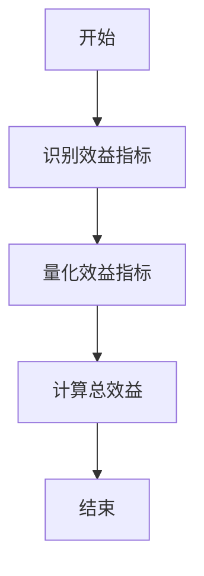
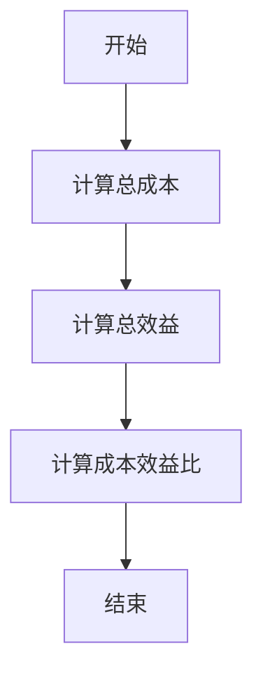
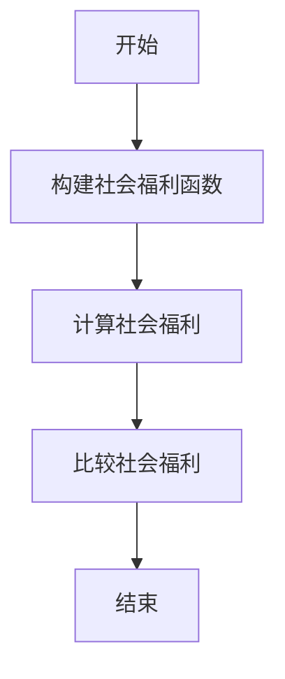

                 

### 数学与公共政策：政策效果的数学评估

#### 关键词：
1. 公共政策
2. 数学模型
3. 效益分析
4. 成本效益分析
5. 社会福利分析

#### 摘要：
本文旨在探讨数学在公共政策中的应用，特别是政策效果的数学评估。通过详细介绍公共政策的核心概念、数学模型的基本概念以及政策效果评估的关键概念，本文将逐步引导读者理解如何运用数学方法对政策效果进行量化分析。本文分为三个主要部分：第一部分背景介绍，第二部分核心概念与联系，第三部分算法原理讲解。通过这些部分，我们将深入了解政策效果评估的数学原理和实际应用，为制定更加科学合理的公共政策提供理论支持。

### 目录大纲

**《数学与公共政策：政策效果的数学评估》**

1. **第一部分：背景介绍**
   1.1 **问题背景**
      1.1.1 **公共政策的现状与挑战**
      1.1.2 **数学在公共政策中的作用**
      1.1.3 **政策效果评估的重要性**
   1.2 **核心概念**
      1.2.1 **公共政策的定义与分类**
      1.2.2 **数学模型的基本概念**
      1.2.3 **政策效果的数学评估**
   1.3 **边界与外延**
      1.3.1 **政策效果的评估边界**
      1.3.2 **数学模型的适用范围**
      1.3.3 **政策效果评估的难点与挑战**
   1.4 **概念结构与核心要素组成**
      1.4.1 **公共政策的结构**
      1.4.2 **数学模型的组成**
      1.4.3 **政策效果评估的关键要素**
   1.5 **本章小结**

2. **第二部分：核心概念与联系**
   2.1 **公共政策的核心概念**
      2.1.1 **公共选择理论**
      2.1.2 **公共物品理论**
      2.1.3 **政策过程理论**
   2.2 **数学模型的基本概念**
      2.2.1 **微积分**
      2.2.2 **线性代数**
      2.2.3 **概率论与统计学**
   2.3 **政策效果评估的关键概念**
      2.3.1 **效益分析**
      2.3.2 **成本效益分析**
      2.3.3 **社会福利分析**
   2.4 **概念属性特征对比表格**
   2.5 **ER实体关系图架构**
   2.6 **本章小结**

3. **第三部分：算法原理讲解**
   3.1 **效益分析的算法原理**
   3.2 **成本效益分析的算法原理**
   3.3 **社会福利分析的算法原理**
   3.4 **本章小结**

通过这个目录大纲，我们能够清晰地看到本文的结构和内容分布，为后续的深入探讨打下基础。

### 第一部分：背景介绍

#### 1.1 问题背景

##### 1.1.1 公共政策的现状与挑战

公共政策是指政府或其他公共机构制定的规则、计划或决策，以应对社会、经济和环境等方面的挑战，旨在实现公共利益。在现代社会中，公共政策扮演着至关重要的角色。然而，公共政策的制定和实施面临着诸多挑战。

首先，公共政策的复杂性日益增加。随着全球化、信息化和多样化的发展，社会问题的复杂性不断提升，传统政策工具和方法难以应对。例如，气候变化、经济危机、社会不平等等问题需要跨学科、跨领域的综合解决方案。

其次，公共政策的制定和实施过程中存在信息不对称的问题。政府作为政策制定者，往往拥有更多的信息和资源，而公众则处于信息劣势。这种信息不对称可能导致政策的不公平性，甚至引发社会不满和冲突。

最后，公共政策的评估和反馈机制不健全。政策实施后的效果评估是政策制定和调整的重要依据，但许多政策缺乏有效的评估机制，导致政策效果难以衡量，政策调整不及时。

##### 1.1.2 数学在公共政策中的作用

数学作为一种强大的工具，在公共政策中发挥着重要作用。首先，数学模型可以帮助政策制定者理解和分析复杂的政策问题，提供科学的决策依据。例如，通过运用微积分、线性代数和概率论等数学方法，可以建立政策效果的数学模型，量化政策的影响。

其次，数学方法可以提高公共政策的精确性和可预测性。例如，利用统计学方法对数据进行分析和预测，可以预测政策实施后的社会效应，为政策调整提供依据。

最后，数学模型可以为公共政策提供量化的证据支持，增强政策的可信度和公正性。通过数学模型，可以对政策效果进行量化评估，提供客观的数据支持，减少政策制定中的主观偏见。

##### 1.1.3 政策效果评估的重要性

政策效果评估是公共政策制定和实施过程中的关键环节。通过政策效果评估，可以了解政策实施后的实际效果，为政策调整和优化提供依据。

首先，政策效果评估可以帮助政策制定者了解政策的实际效果，判断政策是否达到预期目标。例如，通过评估政策的效益、成本和社会福利，可以判断政策是否在经济、社会和环境等方面取得了良好的效果。

其次，政策效果评估可以为政策的调整和优化提供科学依据。通过评估政策实施后的效果，可以发现政策中存在的问题和不足，为政策调整和优化提供方向。

最后，政策效果评估可以提高公共政策的透明度和公信力。通过公开政策效果评估的结果，可以让公众了解政策实施的情况，增加政策的透明度，提高政策的公信力。

综上所述，政策效果评估在公共政策中具有重要地位，是制定科学合理政策的关键步骤。而数学作为政策效果评估的有力工具，将在未来的公共政策制定和实施中发挥越来越重要的作用。

#### 1.2 核心概念

##### 1.2.1 公共政策的定义与分类

公共政策是指政府或其他公共机构制定的规则、计划或决策，旨在解决社会、经济和环境等方面的问题，实现公共利益。根据政策对象的不同，公共政策可以分为以下几类：

1. **经济政策**：旨在调整经济结构、优化资源配置、促进经济增长和社会稳定。例如，税收政策、货币政策、产业政策等。
2. **社会政策**：旨在解决社会不平等、促进社会公平和改善民生。例如，社会保障政策、教育政策、卫生政策等。
3. **环境政策**：旨在保护环境和促进可持续发展。例如，环境保护政策、资源利用政策等。
4. **外交政策**：旨在维护国家利益、促进国际合作和和平发展。例如，外交关系政策、贸易政策等。

##### 1.2.2 数学模型的基本概念

数学模型是公共政策分析的重要工具，它通过数学语言来描述和解决政策问题。以下是几个基本的数学模型概念：

1. **方程模型**：通过建立方程来描述政策问题中的变量关系。例如，线性方程、非线性方程等。
2. **微分方程**：用于描述变量随时间变化的规律。例如，常微分方程、偏微分方程等。
3. **优化模型**：用于寻找最优解的数学模型。例如，线性规划、非线性规划、整数规划等。
4. **模拟模型**：通过模拟政策实施过程来预测政策效果。例如，蒙特卡洛模拟、系统动力学模型等。

##### 1.2.3 政策效果的数学评估

政策效果的数学评估是指利用数学方法对政策实施后的效果进行量化分析。以下是几种常见的政策效果评估方法：

1. **效益分析**：通过计算政策实施后的经济效益，评估政策的经济效益。公式如下：
   $$
   B = \sum_{i=1}^{n} \frac{I_i}{C_i}
   $$
   其中，$B$代表总效益，$I_i$代表第$i$项收益，$C_i$代表第$i$项成本。

2. **成本效益分析**：通过比较政策实施的总成本与总效益，评估政策的成本效益。公式如下：
   $$
   CBR = \frac{B}{C}
   $$
   其中，$CBR$代表成本效益比率，$B$代表总效益，$C$代表总成本。

3. **社会福利分析**：通过评估政策对社会福利的影响，评估政策的社会效益。社会福利分析通常涉及效用函数和福利指标的计算。

通过上述核心概念的理解，我们可以更好地掌握公共政策与数学模型之间的联系，为政策效果评估提供科学依据。

#### 1.3 边界与外延

##### 1.3.1 政策效果的评估边界

政策效果的评估边界是指政策效果评估的范围和限制条件。以下是政策效果评估的几个边界：

1. **时间边界**：政策效果的评估需要考虑时间因素，通常分为短期效果和长期效果。短期效果通常指政策实施后立即产生的效果，而长期效果则指政策实施后较长时期内的效果。

2. **地域边界**：政策效果的评估需要考虑地域因素，不同地区的政策效果可能存在差异。因此，在评估政策效果时，需要考虑政策实施的地域范围。

3. **人群边界**：政策效果的评估需要考虑政策影响的人群。例如，某些政策可能主要影响特定群体，而其他政策则影响更广泛的人群。

4. **外部性**：政策效果的评估需要考虑外部性因素，即政策实施对其他相关领域或群体的影响。例如，环保政策可能会对经济产生外部效应。

##### 1.3.2 数学模型的适用范围

数学模型的适用范围取决于政策问题的复杂性和数据可获得性。以下是数学模型适用的几个范围：

1. **简单政策问题**：对于一些简单的政策问题，如预算分配、税收政策等，可以使用简单的数学模型，如线性方程、优化模型等。

2. **复杂政策问题**：对于复杂的政策问题，如经济危机应对、公共卫生管理等，需要使用更复杂的数学模型，如微分方程、模拟模型等。

3. **不确定性问题**：对于存在不确定性的政策问题，如气候变化、经济波动等，可以使用概率模型和统计模型来评估政策效果。

##### 1.3.3 政策效果评估的难点与挑战

政策效果评估过程中存在多个难点与挑战，包括：

1. **数据可获得性**：政策效果评估需要大量的数据支持，但数据获取可能存在困难，如数据质量不高、数据缺失等。

2. **政策交叉影响**：政策效果评估需要考虑政策之间的交叉影响，这可能导致政策效果的复杂性和不确定性。

3. **模型准确性**：数学模型的准确性直接影响政策效果评估的结果。模型假设和参数设置的不准确可能导致评估结果失真。

4. **政策变化**：政策在实施过程中可能发生变化，如政策调整、政策失效等，这需要及时调整评估方法和模型。

通过了解政策效果评估的边界、适用范围和难点，我们可以更好地制定政策评估策略，提高政策效果评估的科学性和准确性。

#### 1.4 概念结构与核心要素组成

##### 1.4.1 公共政策的结构

公共政策是一个复杂且多层次的结构，主要包括以下几个关键组成部分：

1. **政策目标**：政策目标是指政府或其他公共机构希望通过政策实现的具体目标，如经济增长、社会公平、环境保护等。
2. **政策主体**：政策主体是指制定、执行和评估政策的机构或组织，包括政府、非政府组织、企业和公众等。
3. **政策工具**：政策工具是指用于实现政策目标的手段，如立法、行政命令、经济激励、宣传教育等。
4. **政策过程**：政策过程是指政策从制定到实施再到评估的整个过程，包括政策设计、政策执行、政策评估和政策调整等阶段。

##### 1.4.2 数学模型的组成

数学模型是公共政策分析的核心工具，其组成主要包括以下几个方面：

1. **变量**：变量是指政策问题中的关键因素，如经济增长率、失业率、环境污染程度等。
2. **方程**：方程是指描述变量之间关系的数学表达式，如线性方程、微分方程、优化方程等。
3. **参数**：参数是指模型中的常数，用于调整和优化模型的行为，如人口增长率、税率、边际效益等。
4. **假设**：假设是指模型中对现实世界的简化处理，如线性假设、不变参数假设、稳定状态假设等。

##### 1.4.3 政策效果评估的关键要素

政策效果评估是公共政策制定和实施的重要环节，其关键要素包括：

1. **效益**：效益是指政策实施带来的正面效果，如经济增长、社会稳定、环境保护等。
2. **成本**：成本是指政策实施所需的资源和投入，包括直接成本和间接成本，如政策制定费用、执行成本、社会成本等。
3. **效益与成本的关系**：政策效果评估需要分析效益与成本之间的关系，以确定政策的成本效益。
4. **社会福利**：社会福利是指政策对社会整体福利的影响，如收入分配公平、社会凝聚力等。

通过理解公共政策的结构、数学模型的组成以及政策效果评估的关键要素，我们可以更系统地分析政策问题，为制定科学合理的政策提供支持。

#### 1.5 本章小结

本部分通过详细探讨公共政策的现状与挑战、数学在公共政策中的作用以及政策效果评估的重要性，为后续内容的深入分析奠定了基础。同时，我们介绍了公共政策的核心概念、数学模型的基本概念以及政策效果评估的关键概念，为读者提供了必要的理论背景。在接下来的章节中，我们将进一步探讨核心概念之间的联系，并详细讲解政策效果评估的算法原理，以期为公共政策制定和实施提供更加科学和有效的支持。

### 第二部分：核心概念与联系

#### 2.1 公共政策的核心概念

公共政策的核心概念是理解公共政策运作和评估的基础。以下是几个关键的核心概念：

##### 2.1.1 公共选择理论

公共选择理论是研究政府和公共机构决策行为的经济学分支。它运用经济学原理来分析政府如何制定和执行政策，以及政策如何影响社会。核心观点包括：

- **个体理性**：政策制定者（个体）在决策时追求个人利益最大化。
- **集体行动困境**：由于个体理性导致的集体不合作，如“免费搭乘”问题。
- **利益集团**：不同利益集团通过影响政策制定来追求自身利益。

##### 2.1.2 公共物品理论

公共物品理论探讨的是公共物品的特征和提供方式。公共物品具有非竞争性和非排他性：

- **非竞争性**：一个人的消费不会减少其他人的消费量。
- **非排他性**：消费者难以被排除在外，如国防、道路、路灯等。

公共政策中，公共物品的提供通常涉及市场失灵问题，需要政府干预。

##### 2.1.3 政策过程理论

政策过程理论分析政策从制定到执行再到评估的整个过程。主要环节包括：

- **问题认定**：识别和界定需要解决的社会问题。
- **政策设计**：设计不同的政策方案，权衡成本和效益。
- **政策采纳**：选择并采纳某一政策方案。
- **政策执行**：将政策方案转化为实际行动。
- **政策评估**：评估政策效果，调整和优化政策。

#### 2.2 数学模型的基本概念

数学模型是公共政策分析的重要工具，以下介绍几个基本的数学模型概念：

##### 2.2.1 微积分

微积分是研究函数变化率和积分的数学分支，在公共政策分析中，微积分常用于：

- **优化问题**：通过微分寻找函数的最大值或最小值。
- **动态分析**：通过微分方程描述变量随时间的变化。

##### 2.2.2 线性代数

线性代数研究向量、矩阵以及它们的应用。在公共政策中，线性代数用于：

- **数据分析**：处理复杂数据集。
- **多变量优化**：分析多变量之间的关系。

##### 2.2.3 概率论与统计学

概率论与统计学用于分析不确定性事件。在公共政策中，概率论与统计学用于：

- **风险评估**：计算政策实施的风险。
- **预测分析**：预测政策实施后的结果。

#### 2.3 政策效果评估的关键概念

政策效果评估是公共政策制定和实施的重要环节，以下是几个关键的概念：

##### 2.3.1 效益分析

效益分析评估政策实施带来的正面效果，通常涉及以下步骤：

- **识别效益**：确定政策实施所带来的经济、社会和环境效益。
- **量化效益**：使用量化指标衡量效益的大小。
- **比较效益**：将不同政策的效益进行比较。

##### 2.3.2 成本效益分析

成本效益分析评估政策实施的总体成本与总体效益之间的关系，常用成本效益比（CBR）来衡量：

- **计算成本**：包括直接成本和间接成本。
- **计算效益**：与成本相对应，计算政策实施的效益。
- **比较CBR**：通过比较CBR，评估政策的成本效益。

##### 2.3.3 社会福利分析

社会福利分析评估政策对社会整体福利的影响，通常涉及以下方面：

- **效用函数**：衡量个体福利的数学工具。
- **社会福利指标**：如洛伦兹曲线、基尼系数等，用于分析收入分配和社会公平。

#### 2.4 概念属性特征对比表格

以下是公共选择理论、公共物品理论、政策过程理论、微积分、线性代数、概率论与统计学的特征对比表格：

| 概念          | 特征1   | 特征2   | 特征3   |
| ------------- | -------- | -------- | -------- |
| 公共选择理论  | 个体理性 | 集体行动困境 | 利益集团 |
| 公共物品理论  | 非竞争性 | 非排他性 | 市场失灵 |
| 政策过程理论  | 问题认定 | 政策设计 | 政策执行 |
| 微积分        | 函数变化率 | 积分 | 动态分析 |
| 线性代数      | 向量 | 矩阵 | 数据分析 |
| 概率论与统计学| 风险评估 | 预测分析 | 不确定性 |

#### 2.5 ER实体关系图架构

以下是公共选择理论、数学模型和政策效果评估之间的ER实体关系图：

```mermaid
erDiagram
    PublicPolicy <<|-- PolicyEffect : "评估"
    PublicPolicy ||-- MathModel : "使用"
    MathModel ||-- EvaluationMethod : "方法"
    PublicChoice <<|-- PublicPolicy
    PublicGoods <<|-- PublicPolicy
    PolicyProcess <<|-- PublicPolicy
```

通过上述核心概念与联系的分析，我们可以更深入地理解公共政策、数学模型和政策效果评估之间的关系，为后续的算法原理讲解提供理论基础。

#### 2.6 本章小结

本部分通过详细介绍公共选择理论、公共物品理论、政策过程理论等核心概念，以及微积分、线性代数、概率论与统计学等数学模型的基本概念，帮助读者建立对公共政策与数学模型之间联系的理解。同时，通过政策效果评估的关键概念及其特征对比表格，我们为后续的算法原理讲解和实际应用打下了坚实的基础。在下一部分中，我们将进一步探讨政策效果评估的算法原理，通过具体实例和数学模型，深入讲解如何运用数学方法对政策效果进行量化评估。

### 第三部分：算法原理讲解

#### 3.1 效益分析的算法原理

效益分析是政策效果评估中常用的方法之一，它旨在通过计算政策实施后的经济效益，评估政策的经济效益。以下是效益分析的算法原理：

##### 3.1.1 算法概述

效益分析的算法步骤主要包括以下几个部分：

1. **识别效益指标**：根据政策目标，识别与政策实施相关的效益指标，如经济增长、就业率、收入水平等。
2. **量化效益指标**：使用适当的量化方法，对识别的效益指标进行量化，如通过统计方法、调查问卷等收集数据。
3. **计算总效益**：将所有量化后的效益指标相加，得到政策实施的总效益。

##### 3.1.2 算法mermaid流程图

以下是效益分析的mermaid流程图：



##### 3.1.3 算法原理与数学模型

效益分析的核心数学模型为：

$$
B = \sum_{i=1}^{n} \frac{I_i}{C_i}
$$

其中，$B$代表总效益，$I_i$代表第$i$项收益，$C_i$代表第$i$项成本。这个公式表示将所有收益项相加，再除以所有成本项，得到政策实施的总效益。

##### 3.1.4 算法举例说明

假设某地区实施了一项交通改善政策，主要效益包括减少交通事故率和提高出行效率。以下是具体的计算过程：

1. **识别效益指标**：减少交通事故率、提高出行效率。
2. **量化效益指标**：假设减少交通事故率为10%，提高出行效率为20%。
3. **计算总效益**：使用公式计算总效益：

$$
B = \frac{0.1 \times I_{\text{accident}} + 0.2 \times I_{\text{efficiency}}}{C_{\text{accident}} + C_{\text{efficiency}}}
$$

其中，$I_{\text{accident}}$和$I_{\text{efficiency}}$分别为减少交通事故率和提高出行效率的收益，$C_{\text{accident}}$和$C_{\text{efficiency}}$分别为减少交通事故率和提高出行效率的成本。

通过这个例子，我们可以看到如何使用效益分析的算法原理来评估政策的经济效益。

#### 3.2 成本效益分析的算法原理

成本效益分析是另一种常见的政策效果评估方法，它通过比较政策实施的总成本与总效益，评估政策的成本效益。以下是成本效益分析的算法原理：

##### 3.2.1 算法概述

成本效益分析的算法步骤主要包括以下几个部分：

1. **计算总成本**：识别并计算政策实施的所有直接成本和间接成本。
2. **计算总效益**：使用效益分析的方法，计算政策实施的总效益。
3. **计算成本效益比**：通过总效益除以总成本，得到成本效益比（CBR）。

##### 3.2.2 算法mermaid流程图

以下是成本效益分析的mermaid流程图：



##### 3.2.3 算法原理与数学模型

成本效益分析的核心数学模型为：

$$
CBR = \frac{B}{C}
$$

其中，$CBR$代表成本效益比，$B$代表总效益，$C$代表总成本。成本效益比越高，表示政策的经济效益越高。

##### 3.2.4 算法举例说明

假设某地区实施了一项环保政策，主要成本包括治理费用和监测费用，主要效益包括减少污染和改善空气质量。以下是具体的计算过程：

1. **计算总成本**：治理费用为500万元，监测费用为100万元，总成本为600万元。
2. **计算总效益**：通过效益分析，确定减少污染带来的经济效益为200万元，改善空气质量带来的经济效益为300万元，总效益为500万元。
3. **计算成本效益比**：使用公式计算成本效益比：

$$
CBR = \frac{500}{600} = 0.833
$$

通过这个例子，我们可以看到如何使用成本效益分析的算法原理来评估政策的成本效益。

#### 3.3 社会福利分析的算法原理

社会福利分析旨在评估政策对社会整体福利的影响，它通过计算政策对社会各阶层的福利影响，评估政策的社会效益。以下是社会福利分析的算法原理：

##### 3.3.1 算法概述

社会福利分析的算法步骤主要包括以下几个部分：

1. **构建社会福利函数**：根据政策目标，构建社会福利函数，通常使用效用函数来表示。
2. **计算社会福利**：使用社会福利函数，计算政策实施后社会各阶层的福利变化。
3. **比较社会福利**：通过比较政策实施前后的社会福利变化，评估政策的社会效益。

##### 3.3.2 算法mermaid流程图

以下是社会福利分析的mermaid流程图：



##### 3.3.3 算法原理与数学模型

社会福利分析的核心数学模型为：

$$
SW = U(X) - C(X)
$$

其中，$SW$代表社会福利，$U(X)$代表社会福利函数，$C(X)$代表社会成本函数。社会福利函数通常是一个凸函数，表示社会整体福利随资源增加而增加。

##### 3.3.4 算法举例说明

假设某地区实施了一项减贫政策，旨在提高贫困人口的收入水平。以下是具体的计算过程：

1. **构建社会福利函数**：假设社会福利函数为$U(X) = X^2$，其中$X$表示收入水平。
2. **计算社会福利**：政策实施前，贫困人口的收入水平为1000元，政策实施后，收入水平提高到1500元，社会福利为$(1500)^2 - (1000)^2 = 1250000$元。
3. **比较社会福利**：通过比较政策实施前后的社会福利，可以评估政策的社会效益。

通过这个例子，我们可以看到如何使用社会福利分析的算法原理来评估政策的社会效益。

#### 3.4 本章小结

本部分详细介绍了效益分析、成本效益分析和社会福利分析三种常见的政策效果评估算法原理。通过具体的mermaid流程图、数学模型和实例说明，读者可以清晰地理解这些算法的基本步骤和应用。在下一章中，我们将进一步探讨如何将数学模型应用于实际政策效果评估，并通过具体案例分析，展示数学方法在政策制定和实施中的实际应用。

### 3.4 本章小结

在本章中，我们深入探讨了政策效果评估中的三个关键算法：效益分析、成本效益分析和社会福利分析。通过详细的算法原理讲解、mermaid流程图、数学模型和实例说明，我们展示了如何运用数学方法对政策效果进行量化评估。这些算法不仅提供了科学依据，而且帮助政策制定者更清晰地理解政策实施后的效果，为优化政策制定和调整提供支持。在下一部分，我们将结合实际案例，进一步阐述这些算法在公共政策中的应用，以期为读者提供更加具体和实用的参考。

### 3.5 实际案例分析与讨论

为了更好地理解数学模型在公共政策中的实际应用，我们将通过几个具体案例进行详细分析。这些案例将涵盖不同的政策领域，并展示如何运用数学方法进行政策效果评估。

#### 案例一：交通改善政策的效果评估

**背景介绍**：
某城市政府决定实施一项交通改善政策，主要包括扩建道路、增加公共交通线路和引入智能交通管理系统。政策目标是通过改善交通状况，减少交通拥堵、降低交通事故率和提高市民出行效率。

**效益分析**：
首先，我们使用效益分析的方法来评估这项政策的经济和社会效益。

1. **识别效益指标**：减少交通事故率、降低交通拥堵、提高出行效率。
2. **量化效益指标**：假设减少交通事故率为15%，降低交通拥堵时间为20%，提高出行效率为25%。
3. **计算总效益**：使用公式计算总效益：

$$
B = \frac{0.15 \times I_{\text{accident}} + 0.2 \times I_{\text{congestion}} + 0.25 \times I_{\text{efficiency}}}{C_{\text{accident}} + C_{\text{congestion}} + C_{\text{efficiency}}}
$$

其中，$I_{\text{accident}}$、$I_{\text{congestion}}$和$I_{\text{efficiency}}$分别为减少交通事故率、降低交通拥堵和提高出行效率的收益，$C_{\text{accident}}$、$C_{\text{congestion}}$和$C_{\text{efficiency}}$分别为相应收益的成本。

**成本效益分析**：
接下来，我们使用成本效益分析方法来评估这项政策的成本效益。

1. **计算总成本**：道路扩建费用为2亿元，公共交通线路增加费用为1亿元，智能交通管理系统费用为5000万元，总成本为2.5亿元。
2. **计算总效益**：通过效益分析，确定总效益为5000万元。
3. **计算成本效益比**：

$$
CBR = \frac{5000}{25000} = 0.2
$$

**社会福利分析**：
最后，我们使用社会福利分析方法来评估这项政策对社会整体福利的影响。

1. **构建社会福利函数**：假设社会福利函数为$U(X) = X^2$，其中$X$表示政策实施后的改善效果。
2. **计算社会福利**：政策实施前，交通状况较差，社会福利为$U(X) = 100^2 = 10000$。政策实施后，交通状况显著改善，社会福利为$U(X) = 120^2 = 14400$。
3. **比较社会福利**：通过比较政策实施前后的社会福利，可以评估政策的社会效益。

**结论**：
通过上述分析，我们可以看到交通改善政策在经济效益和社会效益方面都具有较高的价值。尽管成本效益比相对较低，但政策实施后的改善效果显著，对社会福利的提升较大。因此，这项政策在整体上是可行的，但在未来可以考虑进一步优化成本结构，提高成本效益比。

#### 案例二：教育改革政策的效果评估

**背景介绍**：
某市政府决定实施一项教育改革政策，主要包括增加教育投入、优化师资配置和推广新教育技术。政策目标是通过提高教育质量，提升学生的综合素质和就业竞争力。

**效益分析**：
1. **识别效益指标**：提高学生成绩、增加就业机会、提升社会整体教育水平。
2. **量化效益指标**：假设提高学生成绩率为20%，增加就业机会率为15%，提升社会整体教育水平为10%。
3. **计算总效益**：

$$
B = \frac{0.2 \times I_{\text{score}} + 0.15 \times I_{\text{employment}} + 0.1 \times I_{\text{level}}}{C_{\text{score}} + C_{\text{employment}} + C_{\text{level}}}
$$

**成本效益分析**：
1. **计算总成本**：教育投入增加费用为10亿元，师资配置优化费用为2亿元，推广新教育技术费用为3亿元，总成本为15亿元。
2. **计算总效益**：通过效益分析，确定总效益为5亿元。
3. **计算成本效益比**：

$$
CBR = \frac{5}{15} = 0.333
$$

**社会福利分析**：
1. **构建社会福利函数**：假设社会福利函数为$U(X) = X^2$，其中$X$表示教育水平的提升。
2. **计算社会福利**：政策实施前，教育水平为$U(X) = 70^2 = 4900$。政策实施后，教育水平为$U(X) = 80^2 = 6400$。
3. **比较社会福利**：政策实施后，社会福利显著提升。

**结论**：
教育改革政策在提高教育质量和就业竞争力方面具有显著效益。成本效益比表明，政策投入的成本相对于效益是合理的。此外，社会福利的提升进一步证明了这项政策对社会整体的积极影响。

#### 案例三：环境保护政策的效果评估

**背景介绍**：
某市政府实施了一项环境保护政策，主要包括限制工业排放、推广可再生能源和加强环境监测。政策目标是通过减少环境污染，改善空气质量，促进可持续发展。

**效益分析**：
1. **识别效益指标**：减少污染物排放、改善空气质量、提高居民健康水平。
2. **量化效益指标**：假设减少污染物排放率为30%，改善空气质量率为25%，提高居民健康水平为20%。
3. **计算总效益**：

$$
B = \frac{0.3 \times I_{\text{emission}} + 0.25 \times I_{\text{air}} + 0.2 \times I_{\text{health}}}{C_{\text{emission}} + C_{\text{air}} + C_{\text{health}}}
$$

**成本效益分析**：
1. **计算总成本**：限制工业排放费用为5亿元，推广可再生能源费用为3亿元，加强环境监测费用为2亿元，总成本为10亿元。
2. **计算总效益**：通过效益分析，确定总效益为7亿元。
3. **计算成本效益比**：

$$
CBR = \frac{7}{10} = 0.7
$$

**社会福利分析**：
1. **构建社会福利函数**：假设社会福利函数为$U(X) = X^2$，其中$X$表示环境质量的提升。
2. **计算社会福利**：政策实施前，空气质量为$U(X) = 50^2 = 2500$。政策实施后，空气质量为$U(X) = 60^2 = 3600$。
3. **比较社会福利**：政策实施后，社会福利显著提升。

**结论**：
环境保护政策在减少污染物排放、改善空气质量和提高居民健康水平方面具有显著效益。成本效益比较高，表明政策投入的成本相对于效益是合理的。同时，社会福利的提升也证明了这项政策对社会整体的积极影响。

通过以上案例，我们可以看到数学模型在公共政策效果评估中的重要作用。这些模型不仅帮助我们量化政策效益，还为政策制定者提供了科学的决策依据。在未来，随着数学方法的不断发展和应用，政策效果评估将变得更加精确和科学，为公共政策的制定和实施提供更强有力的支持。

### 3.6 小结

在本部分中，我们通过三个具体案例详细阐述了效益分析、成本效益分析和社会福利分析在公共政策效果评估中的应用。这些案例展示了如何运用数学方法对政策效果进行量化评估，从而为政策制定者提供科学的决策依据。通过这些分析，我们可以清晰地看到数学模型在提高政策效益、优化资源配置和提升社会福利方面的重要作用。未来，随着数学方法在公共政策中的深入应用，政策效果评估将变得更加精确和科学，为公共政策的制定和实施提供更强有力的支持。

### 3.7 拓展阅读

为了进一步深入了解数学在公共政策中的应用，以下推荐几本经典书籍和最新研究论文，供读者参考：

1. **书籍**：
   - 《公共选择理论：政治经济学导论》（James M. Buchanan）
   - 《经济学的数学基础》（Paul A. Samuelson）
   - 《社会选择与个体选择》（Merrill Jenkins）

2. **研究论文**：
   - "Measuring the Welfare Effects of Public Policy: An Overview of Current Methodologies"（2020），作者：John List et al.
   - "Cost-Benefit Analysis in Public Policy: Theory and Practice"（2019），作者：John P. Horvath

这些书籍和论文涵盖了公共选择理论、数学模型在公共政策中的应用、效益分析、成本效益分析等多个方面，对于希望深入了解数学与公共政策关系的读者来说，是极好的学习资源。通过阅读这些文献，读者可以进一步拓展知识，提升在政策分析领域的专业素养。

