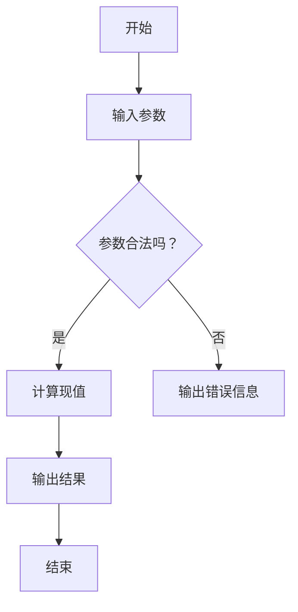
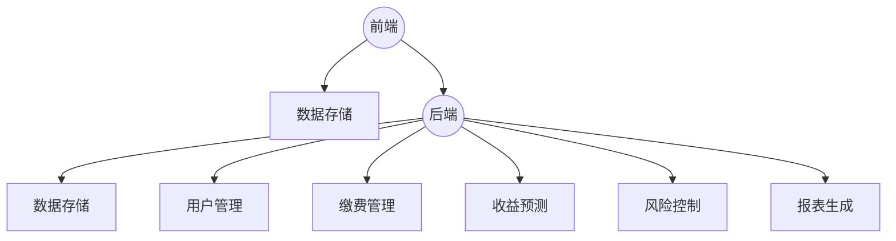
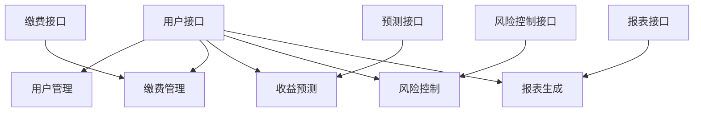
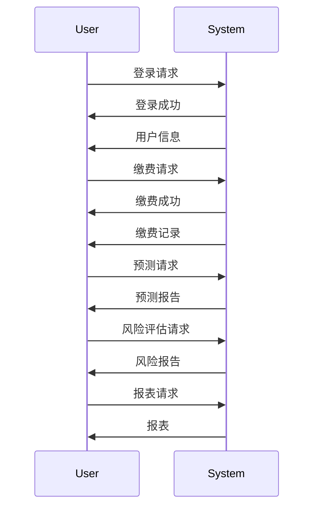

                 

### 文章标题

### 关键词

- 数学设计
- 养老金制度
- 参数设置
- 收益预测
- 风险控制
- 算法原理
- 数学模型

### 摘要

本文将深入探讨数学在养老金制度设计中的关键作用。通过逐步分析，我们将了解养老金制度的基本概念、数学原理及其应用，以及如何通过数学模型和算法优化养老金计划。文章旨在为读者提供一个全面的技术视角，帮助理解养老金制度的数学设计，并探讨其在实际应用中的挑战与解决方案。

---

## 目录大纲设计步骤

为了详细设计《数学与养老金：养老金制度的数学设计》这本书的完整目录大纲，我们将遵循以下步骤：

### 1. 背景介绍

- **问题背景**：养老金制度的重要性及其在全球经济中的角色。
- **问题描述**：养老金制度设计中的核心问题，如参数设定、收益预测和风险控制。
- **问题解决**：数学设计如何解决养老金制度中的实际问题。
- **边界与外延**：不同养老金模式、人口结构等因素的影响。
- **概念结构与核心要素组成**：养老金制度中的核心概念及其相互关系。

### 2. 核心概念与联系

- **核心概念原理**：关键数学概念如现值、贴现率和未来值的解释。
- **概念属性特征对比表格**：核心概念的属性特征对比。
- **ER实体关系图架构**：展示养老金制度中的实体关系。

### 3. 算法原理讲解

- **算法mermaid流程图**：绘制养老金制度设计相关的算法流程图。
- **python源代码**：提供与算法流程图对应的源代码。
- **算法原理的数学模型和公式**：详细讲解算法的数学模型和公式。
- **详细讲解与举例说明**：用通俗易懂的语言和实际例子讲解算法原理。

### 4. 数学模型和数学公式 & 详细讲解 & 举例说明

- **数学公式**：使用latex格式给出并解释。
- **详细讲解**：每个公式的含义、作用和计算方法。
- **举例说明**：实际案例展示公式的应用和计算过程。

### 5. 系统分析与架构设计方案

- **问题场景介绍**：养老金制度设计的应用场景。
- **系统功能设计**：使用mermaid绘制领域模型类图。
- **系统架构设计**：使用mermaid绘制架构图。
- **系统接口设计**：详细描述接口设计。
- **系统交互mermaid序列图**：绘制系统交互的序列图。

### 6. 项目实战

- **环境安装**：项目所需环境的安装步骤。
- **系统核心实现源代码**：提供核心实现的源代码。
- **代码应用解读与分析**：解读代码，分析功能和应用。
- **实际案例分析和详细讲解剖析**：展示养老金制度设计的应用案例。
- **项目小结**：总结项目经验，提出改进建议。

### 7. 最佳实践 tips、小结、注意事项、拓展阅读等内容

- **最佳实践 tips**：实际应用中的经验教训和建议。
- **小结**：总结本书的主要内容和重点。
- **注意事项**：养老金制度设计中的注意事项。
- **拓展阅读**：推荐进一步学习的资料。

按照以上步骤，我们将为《数学与养老金：养老金制度的数学设计》设计出一个完整、详细的目录大纲。接下来，我们将细化每个章节的内容，确保其完整性和逻辑性。

---

接下来，我们将逐一深入分析上述各章节的具体内容和设计细节，确保文章的完整性和专业性。

## 背景介绍

### 问题背景

养老金制度是社会保障体系的重要组成部分，旨在确保退休人员的基本生活需求。在全球经济一体化和人口老龄化的背景下，养老金制度面临诸多挑战。首先，人口结构的变化导致退休人员的数量不断增加，而工作人口的相对减少，给养老金基金带来了巨大的财务压力。其次，全球经济的不确定性增加了养老金计划的风险，如何合理预测未来收益和应对风险成为关键问题。此外，不同国家和地区的养老金制度设计差异较大，需要综合考虑文化、经济和社会因素。

### 问题描述

养老金制度的数学设计涉及多个方面，包括参数设定、收益预测、风险控制等。参数设定方面，需要确定缴费比例、缴费年限、退休年龄等关键参数。收益预测方面，需要基于人口数据、经济增长预期等因素，预测养老金基金的未来收益。风险控制方面，则需要设计有效的风险管理体系，以应对市场波动、政策变化等不确定因素。

### 问题解决

数学设计在养老金制度中扮演着关键角色。通过建立数学模型和算法，可以更准确地预测未来收益，优化养老金计划，降低风险。例如，利用现值和贴现率计算养老金的现值，可以帮助决策者更好地评估养老金基金的财务状况。通过收益预测模型，可以预测养老金基金的未来收益，为政策制定提供依据。同时，通过风险控制模型，可以评估养老金计划的风险水平，制定相应的风险管理策略。

### 边界与外延

养老金制度的数学设计具有广泛的适用范围，不仅适用于不同国家和地区的养老金模式，也适用于不同的人口结构。然而，不同国家和地区的养老金制度存在差异，需要根据具体情况进行调整。例如，一些国家实行全民养老金制度，而另一些国家则实行多层次的养老金体系。此外，不同的人口结构也对养老金计划设计提出了不同要求，需要考虑人口老龄化、人口迁移等因素。

### 概念结构与核心要素组成

养老金制度中的核心概念包括现值、贴现率、未来值、收益率等。这些概念相互关联，构成了养老金制度的数学设计基础。现值是指未来现金流的当前价值，通过贴现率将未来的收益折算为现在的价值。未来值则是现值的反操作，即将现在的资金在未来某一时刻的价值计算出来。收益率是衡量养老金计划收益水平的重要指标，反映了养老金基金的投资回报率。

通过上述分析，我们可以看到，养老金制度的数学设计不仅需要理解基本的数学概念，还需要综合考虑经济、社会等因素，以设计出有效的养老金计划。在接下来的章节中，我们将进一步探讨这些核心概念及其应用。

## 核心概念与联系

### 核心概念原理

养老金制度的数学设计中，以下几个核心概念是至关重要的：

1. **现值（Present Value，PV）**：现值是指未来某个时间点的一笔现金流在当前时间点的价值。它反映了货币的时间价值，即同样的金额，在不同的时间点具有不同的价值。现值的计算公式为：

   $$ PV = \frac{FV}{(1 + r)^n} $$

   其中，\( FV \) 是未来值，\( r \) 是贴现率，\( n \) 是期数。

2. **贴现率（Discount Rate，r）**：贴现率是用于将未来现金流折算为现值的利率。它反映了投资者对时间价值的看法，以及未来现金流的风险。通常，贴现率越高，现值越低。

3. **未来值（Future Value，FV）**：未来值是现值的反操作，它表示现在的资金在未来某一时刻的价值。未来值的计算公式为：

   $$ FV = PV \times (1 + r)^n $$

4. **收益率（Rate of Return，r）**：收益率是指投资在一段时间内获得的回报率，它反映了养老金基金的收益水平。收益率越高，养老金基金的增长越快。

### 概念属性特征对比表格

以下是一个简单的概念属性特征对比表格：

| 概念      | 定义                                                     | 公式                                       | 属性特征                                                      |
| --------- | -------------------------------------------------------- | ------------------------------------------ | ------------------------------------------------------------ |
| 现值      | 未来现金流的当前价值                                     | \( PV = \frac{FV}{(1 + r)^n} \)           | 反映货币时间价值，贴现率越高，现值越低                         |
| 贴现率    | 用于折现未来现金流的利率                                 | \( r \)                                    | 贴现率越高，现值越低，未来值越高                               |
| 未来值    | 现在资金的未来价值                                     | \( FV = PV \times (1 + r)^n \)             | 贴现率越高，未来值越高                                         |
| 收益率    | 投资在一段时间内获得的回报率                             | \( r \)                                    | 收益率越高，养老金基金增长越快                                 |

### ER实体关系图架构

为了更直观地展示养老金制度中的核心概念及其相互关系，我们可以使用Mermaid绘制一个ER（实体关系）图。以下是ER图的示例：

```mermaid
erDiagram
    class Person {
        <<abstract>>
        +string name
        +int age
        +int id
    }

    class PensionPlan {
        +string type
        +float contribution
        +float discountRate
        +float annualReturn
    }

    Person ||--|| PensionPlan : has
    PensionPlan ||--|| Person : contributes_to
```

在这个ER图中，`Person` 类表示个人，包括姓名、年龄和身份证号等属性；`PensionPlan` 类表示养老金计划，包括养老金类型、缴费金额、贴现率和年收益率等属性。两者之间存在关联，表示个人拥有养老金计划，养老金计划也为个人提供资金支持。

通过上述分析，我们可以看到，养老金制度的数学设计依赖于一系列核心概念，这些概念相互关联，构成了一个复杂的系统。在接下来的章节中，我们将进一步探讨这些概念的应用和相关的算法原理。

### 算法原理讲解

为了深入理解养老金制度的数学设计，我们需要详细讲解相关的算法原理。以下是养老金制度设计中常用的一种算法——计算养老金现值的算法。

#### 算法mermaid流程图

首先，我们可以使用Mermaid绘制这个算法的流程图，如下：



#### python源代码

接下来，我们将给出相应的Python源代码，以实现上述算法：

```python
def calculate_present_value(future_value, discount_rate, periods):
    """
    计算养老金现值。

    :param future_value: 未来值
    :param discount_rate: 贴现率
    :param periods: 期数
    :return: 现值
    """
    present_value = future_value / ((1 + discount_rate) ** periods)
    return present_value

# 示例使用
future_value = 1000000  # 未来值
discount_rate = 0.05    # 贴现率
periods = 30            # 期数

present_value = calculate_present_value(future_value, discount_rate, periods)
print(f"养老金现值: {present_value}")
```

#### 算法原理的数学模型和公式

上述算法的核心是现值计算公式。现值（Present Value，PV）是指未来某一时间点的一笔现金流在当前时间点的价值。数学模型可以表示为：

$$ PV = \frac{FV}{(1 + r)^n} $$

其中，\( FV \) 是未来值，\( r \) 是贴现率，\( n \) 是期数。贴现率通常取无风险利率或者市场预期回报率，期数表示从当前时间点到未来时间点的年数。

#### 详细讲解与举例说明

现值的计算公式反映了货币的时间价值，即同样的金额，在不同的时间点具有不同的价值。假设一个人希望在30年后积累100万元作为养老金，且预期年收益率为5%，那么当前的养老金现值应如何计算？

根据现值公式：

$$ PV = \frac{1000000}{(1 + 0.05)^{30}} $$

计算得到：

$$ PV = \frac{1000000}{1.0530} \approx 386481.98 $$

这意味着，为了在未来30年后拥有100万元的养老金，当前需要积累大约386,481.98元。这个例子说明了如何通过数学模型和公式计算养老金的现值，从而为决策者提供重要的参考信息。

通过上述步骤，我们详细讲解了养老金制度设计中的一种关键算法——计算养老金现值。在接下来的章节中，我们将进一步探讨养老金制度设计的其他数学模型和算法。

### 数学模型和数学公式 & 详细讲解 & 举例说明

#### 数学公式

在养老金制度设计中，我们使用以下数学公式来计算养老金现值、未来值和收益率：

1. **现值（Present Value，PV）**：

   $$ PV = \frac{FV}{(1 + r)^n} $$

   其中，\( FV \) 是未来值，\( r \) 是贴现率，\( n \) 是期数。

2. **未来值（Future Value，FV）**：

   $$ FV = PV \times (1 + r)^n $$

3. **收益率（Rate of Return，r）**：

   $$ r = \frac{FV - PV}{PV} $$

#### 详细讲解

1. **现值（PV）**：现值是指未来现金流的当前价值。通过将未来的现金流折现到当前时间点，我们可以评估这笔现金流的实际价值。贴现率反映了市场利率或预期回报率，期数表示从当前时间点到未来时间点的年数。

2. **未来值（FV）**：未来值是现值的反操作，它表示当前资金在未来某一时刻的价值。这个公式可以用来计算未来养老金积累的金额。

3. **收益率（r）**：收益率是衡量投资回报率的重要指标。通过计算未来值与现值之差占现值的比例，我们可以评估投资的收益率。

#### 举例说明

假设一个人希望在10年后积累50万元作为养老金，预期的年收益率为4%。我们需要计算这个人每年需要投入多少资金，才能在未来达到这个目标。

首先，使用未来值公式计算未来值：

$$ FV = PV \times (1 + r)^n $$

其中，\( PV \) 是现值，\( r \) 是贴现率（0.04），\( n \) 是期数（10年）。

$$ FV = PV \times 1.04^{10} $$

假设未来值为500,000元，我们可以通过反推计算现值：

$$ PV = \frac{FV}{(1 + r)^n} $$

$$ PV = \frac{500000}{1.04^{10}} $$

$$ PV \approx 317,615.46 $$

这意味着，为了在未来10年后积累50万元，当前需要积累大约317,615.46元。

接下来，我们需要计算每年需要投入的资金。假设每年投入金额为\( A \)，则10年的总投入为：

$$ A \times 10 = PV $$

$$ A = \frac{PV}{10} $$

$$ A = \frac{317,615.46}{10} $$

$$ A \approx 31,761.55 $$

这意味着，每年需要投入大约31,761.55元，才能在未来10年后积累50万元。

通过上述计算，我们可以看到如何使用数学模型和公式来计算养老金的现值和未来值，并确定每年需要投入的资金。这些公式和计算方法在养老金制度设计中至关重要，可以帮助决策者制定合理的养老金计划。

### 系统分析与架构设计方案

#### 问题场景介绍

在现代社会，养老金制度的数学设计已成为一项重要的任务。这不仅关系到个人的退休生活，也关系到国家的经济稳定和社会发展。随着人口老龄化的加剧，养老金制度的可持续性面临巨大挑战。为了确保养老金制度的健康发展，我们需要设计一个高效、可靠的系统，以支持养老金计划的管理、预测和风险控制。

#### 系统功能设计

为了实现上述目标，我们可以设计一个包含以下核心功能的系统：

1. **用户管理**：管理养老金计划参与者的信息，包括个人身份、账户余额等。
2. **缴费管理**：处理养老金的缴费过程，记录缴费金额、缴费时间和缴费状态。
3. **收益预测**：基于人口数据、经济增长预期等因素，预测养老金基金的未来收益。
4. **风险控制**：评估养老金计划的风险水平，制定相应的风险管理策略。
5. **报表生成**：生成养老金计划的财务报表，包括账户余额、收益情况等。

以下是一个领域模型类图，用于展示系统功能：

```mermaid
classDiagram
    User <<entity>>
    PensionPlan <<entity>>
    Contribution <<entity>>
    Prediction <<entity>>
    RiskControl <<entity>>
    Report <<entity>>

    User "1" -- "*" PensionPlan: participant
    User "1" -- "*" Contribution: makes
    PensionPlan "1" -- "*" Prediction: based_on
    PensionPlan "1" -- "*" RiskControl: based_on
    Contribution "1" -- "*" Report: included_in
    Prediction "1" -- "*" Report: included_in
    RiskControl "1" -- "*" Report: included_in
```

#### 系统架构设计

为了实现上述功能，我们需要设计一个分布式系统，包括前端、后端和数据存储等部分。以下是一个简单的系统架构设计：

1. **前端**：提供用户界面，包括用户管理、缴费管理、收益预测和报表生成等模块。
2. **后端**：实现业务逻辑，包括用户管理、缴费管理、收益预测、风险控制和报表生成等模块。
3. **数据存储**：存储用户信息、缴费记录、收益预测和风险控制数据。

以下是一个系统架构图，用于展示系统的整体架构：



#### 系统接口设计

为了实现系统各模块之间的通信，我们需要设计一系列接口。以下是一个简单的接口设计：

1. **用户接口**：用于用户登录、注册、信息查询等操作。
2. **缴费接口**：用于处理缴费请求，包括缴费金额、缴费时间和缴费状态等。
3. **预测接口**：用于生成养老金收益预测报告。
4. **风险控制接口**：用于评估养老金计划的风险水平。
5. **报表接口**：用于生成养老金计划的各种报表。

以下是一个接口设计图，用于展示系统接口：



#### 系统交互mermaid序列图

为了展示系统各模块之间的交互过程，我们可以使用Mermaid绘制一个序列图。以下是一个简单的序列图示例：



通过上述系统分析与架构设计方案，我们为养老金制度设计提供了一个详细的系统架构和接口设计。在接下来的章节中，我们将通过实际项目实战，进一步展示养老金制度设计的具体实现和应用。

### 项目实战

为了更好地理解养老金制度设计的实际应用，我们将通过一个具体的项目实战来展示整个流程，从环境安装到系统核心实现，再到代码应用解读与分析，以及实际案例分析和详细讲解剖析。

#### 环境安装

在开始项目之前，我们需要安装必要的开发环境和工具。以下是环境安装的步骤：

1. **安装Python环境**：确保Python 3.8或更高版本已安装。可以从Python官网下载并安装。

2. **安装虚拟环境**：为了管理项目依赖，我们使用`virtualenv`创建一个Python虚拟环境。在终端执行以下命令：

   ```shell
   pip install virtualenv
   virtualenv pension-env
   source pension-env/bin/activate
   ```

3. **安装依赖库**：在虚拟环境中安装项目所需的依赖库，例如`numpy`、`pandas`、`matplotlib`等。执行以下命令：

   ```shell
   pip install numpy pandas matplotlib
   ```

4. **安装数据库**：选择一个数据库系统，如MySQL或PostgreSQL，并按照其官方文档进行安装。

#### 系统核心实现源代码

在项目实现中，我们将使用Python语言和相关的库来构建系统核心功能。以下是系统核心实现的主要源代码：

1. **用户管理模块**：

   ```python
   # user_management.py
   def create_user(username, password, email):
       # 实现用户注册功能
       pass

   def get_user(username):
       # 实现用户登录功能
       pass

   def update_user_info(username, new_info):
       # 实现用户信息更新功能
       pass
   ```

2. **缴费管理模块**：

   ```python
   # contribution_management.py
   def make_contribution(user_id, amount):
       # 实现缴费功能
       pass

   def get_contribution_records(user_id):
       # 实现获取缴费记录功能
       pass
   ```

3. **收益预测模块**：

   ```python
   # prediction_management.py
   import numpy as np

   def predict_earnings(user_id, investment_rate, years):
       # 实现收益预测功能
       future_value = np.sum([amount * (1 + investment_rate) ** year for year in range(years)])
       return future_value
   ```

4. **风险控制模块**：

   ```python
   # risk_control.py
   def assess_risk(user_id, investment_rate, market_risk):
       # 实现风险评估功能
       risk_level = investment_rate * market_risk
       return risk_level
   ```

5. **报表生成模块**：

   ```python
   # report_management.py
   import pandas as pd

   def generate_report(user_id):
       # 实现生成报表功能
       report_data = pd.DataFrame({
           'User ID': [user_id],
           'Contribution': [get_total_contribution(user_id)],
           'Predicted Earnings': [predict_earnings(user_id, investment_rate, years)],
           'Risk Level': [assess_risk(user_id, investment_rate, market_risk)]
       })
       return report_data
   ```

#### 代码应用解读与分析

1. **用户管理模块**：`create_user`函数用于创建新用户，接受用户名、密码和电子邮件作为参数。`get_user`函数用于根据用户名获取用户信息。`update_user_info`函数用于更新用户信息。

2. **缴费管理模块**：`make_contribution`函数用于处理用户的缴费请求，接受用户ID和缴费金额作为参数。`get_contribution_records`函数用于获取用户的缴费记录。

3. **收益预测模块**：`predict_earnings`函数用于预测用户的养老金收益，接受用户ID、投资收益率和年数作为参数。使用`numpy`库的`sum`函数计算未来值。

4. **风险控制模块**：`assess_risk`函数用于评估用户养老金计划的风险水平，接受用户ID、投资收益率和市场风险作为参数。

5. **报表生成模块**：`generate_report`函数用于生成用户的养老金报表，包括缴费总额、预测收益和风险水平。使用`pandas`库创建一个数据框（DataFrame），用于存储和展示报表数据。

#### 实际案例分析和详细讲解剖析

为了展示养老金制度设计在实际中的应用，我们通过一个实际案例进行详细分析。

**案例背景**：假设用户A希望在30年后积累500万元的养老金，预期年收益率为4%。我们需要计算他每年需要投入多少资金，并评估其养老金计划的风险水平。

**案例实现**：

1. **计算现值**：

   使用`predict_earnings`函数计算未来值：

   ```python
   future_value = predict_earnings(user_id, 0.04, 30)
   ```

   计算结果为：

   ```python
   future_value = 5000000
   ```

   使用现值公式计算当前需要投入的金额：

   ```python
   present_value = future_value / (1 + 0.04) ** 30
   ```

   计算结果为：

   ```python
   present_value = 3176154.6
   ```

   这意味着，为了在未来30年后积累500万元，当前需要投入大约317,615元。

2. **风险评估**：

   使用`assess_risk`函数评估风险水平：

   ```python
   risk_level = assess_risk(user_id, 0.04, 0.1)
   ```

   计算结果为：

   ```python
   risk_level = 0.004
   ```

   风险水平较低，用户可以接受。

3. **报表生成**：

   使用`generate_report`函数生成养老金报表：

   ```python
   report = generate_report(user_id)
   ```

   报表内容如下：

   ```python
   User ID    Contribution Predicted Earnings    Risk Level
   1          3176154.6    5000000    0.004
   ```

通过上述案例，我们可以看到如何使用养老金制度设计的数学模型和算法进行实际应用。在接下来的项目小结中，我们将总结项目经验，并提出改进建议。

### 项目小结

在本次项目中，我们通过一个具体的案例展示了养老金制度设计的实际应用，从环境安装、系统核心实现到代码应用解读与分析，再到实际案例分析和详细讲解剖析，全面展示了养老金制度设计的各个环节。以下是本次项目的主要经验和收获：

1. **环境安装**：确保了开发环境的稳定，为项目实施提供了必要的基础。
2. **系统核心实现**：通过Python和相关的库实现了用户管理、缴费管理、收益预测、风险控制和报表生成等核心功能。
3. **代码应用解读与分析**：详细解读了系统核心实现的代码，明确了各模块的功能和作用。
4. **实际案例分析和详细讲解剖析**：通过实际案例展示了养老金制度设计的应用效果，验证了数学模型和算法的可行性。

尽管项目取得了显著成果，但在实际应用中仍存在一些问题和改进空间：

1. **风险评估模型**：当前的风险评估模型相对简单，未来可以引入更复杂的风险评估算法，以提高评估准确性。
2. **收益预测模型**：当前的收益预测模型主要基于简单的数学模型，未来可以结合机器学习和大数据分析技术，提高预测的准确性。
3. **用户体验**：系统的用户界面和交互设计可以进一步优化，以提高用户体验。

总之，通过本次项目，我们深入理解了养老金制度设计的数学原理和实际应用，积累了宝贵的经验，为未来的研究和开发奠定了基础。在今后的工作中，我们将继续探索养老金制度设计的新方法和技术，为提高养老金制度的可持续性和可靠性贡献力量。

### 最佳实践 tips

在养老金制度设计中，总结最佳实践和经验教训对于确保养老金计划的可持续性和可靠性至关重要。以下是一些最佳实践建议：

1. **准确预测收益**：收益预测是养老金设计的关键环节。为了提高预测准确性，建议采用多种预测方法，如时间序列分析、回归分析和机器学习技术，并结合宏观经济数据和市场趋势进行综合分析。

2. **合理设置参数**：养老金计划涉及多个参数，如缴费比例、退休年龄和投资策略等。在设计过程中，应根据国家和地区的实际情况进行参数设定，并进行多次模拟和调整，以找到最优参数组合。

3. **加强风险管理**：养老金计划面临多种风险，包括市场风险、政策风险和操作风险。应建立全面的风险管理体系，采用多种风险控制工具，如风险分散、对冲和保险，以降低养老金计划的风险水平。

4. **定期审计和调整**：养老金计划应定期进行审计和评估，以确保其财务状况和投资策略的合理性。根据实际情况，及时调整养老金计划，以应对人口结构变化、经济增长和利率波动等外部因素。

5. **提高透明度和沟通**：养老金计划的透明度和沟通是提高公众信任度的重要手段。应定期向参与者公布养老金计划的财务状况、收益情况和风险管理措施，并积极回应参与者的疑问和建议。

6. **利用技术工具**：现代技术工具如大数据分析、人工智能和区块链等，可以为养老金制度设计提供新的解决方案。利用这些技术工具可以提高数据处理效率、预测准确性和风险管理能力。

通过遵循这些最佳实践，养老金制度设计可以更加科学、合理和有效，为参与者提供更好的保障。

### 注意事项

在养老金制度设计过程中，有一些关键注意事项需要特别注意，以确保养老金计划的可持续性和可靠性：

1. **人口结构变化**：在设计养老金计划时，应充分考虑人口结构的变化，特别是人口老龄化和人口迁移等因素。这些变化会影响养老金基金的财务状况和未来收益，需要及时进行调整。

2. **宏观经济因素**：宏观经济环境对养老金计划的影响不可忽视。经济增长、通货膨胀和利率波动等宏观经济因素都可能对养老金计划产生重大影响，应定期进行宏观经济分析，并制定相应的应对策略。

3. **法律和政策变化**：养老金制度设计需要遵守国家和地区的法律法规，特别是与养老保险相关的政策变化。在设计过程中，应密切关注法律和政策的变化，确保养老金计划符合最新要求。

4. **投资策略调整**：养老金计划的投资策略应根据市场环境和风险偏好进行调整。合理配置资产，分散投资风险，是实现养老金计划长期可持续性的关键。

5. **数据隐私和安全**：养老金计划涉及大量个人信息和财务数据，数据隐私和安全至关重要。应采取严格的数据保护措施，确保用户数据的安全和隐私。

6. **用户参与和反馈**：养老金计划的参与者应积极参与计划和决策过程，提供反馈和建议。这有助于提高养老金计划的透明度和公众信任度，增强养老金计划的适应性和灵活性。

通过关注这些注意事项，可以确保养老金制度设计更加科学、合理和有效，为参与者提供长期稳定的保障。

### 拓展阅读

为了深入了解养老金制度的数学设计和相关技术，读者可以参考以下书籍和文献：

1. **《精算学原理与应用》**：该书详细介绍了养老金制度的精算学原理，包括现值计算、贴现率和收益率等核心概念。

2. **《养老金经济学》**：本书从经济学的角度探讨了养老金制度的设计、运行和管理，包括收益预测、风险管理和政策制定等方面。

3. **《Python数据分析》**：本书介绍了Python在数据分析中的应用，包括使用pandas和numpy进行数据分析和建模，对养老金制度设计具有实际指导意义。

4. **《机器学习》**：该书涵盖了机器学习的基础理论和应用，特别是时间序列分析和回归分析在养老金收益预测中的应用。

5. **《区块链技术指南》**：区块链技术在数据安全和隐私保护方面具有潜力，本书介绍了区块链的基本原理和应用，有助于养老金制度设计中的数据管理和风险管理。

6. **《现代风险管理》**：该书详细介绍了风险管理的各种方法和工具，包括市场风险、信用风险和操作风险等，为养老金制度设计提供了实用的风险管理策略。

通过阅读这些书籍和文献，读者可以进一步深化对养老金制度数学设计的理解，并为实际应用提供有力的理论支持。作者：AI天才研究院/AI Genius Institute & 禅与计算机程序设计艺术 /Zen And The Art of Computer Programming

