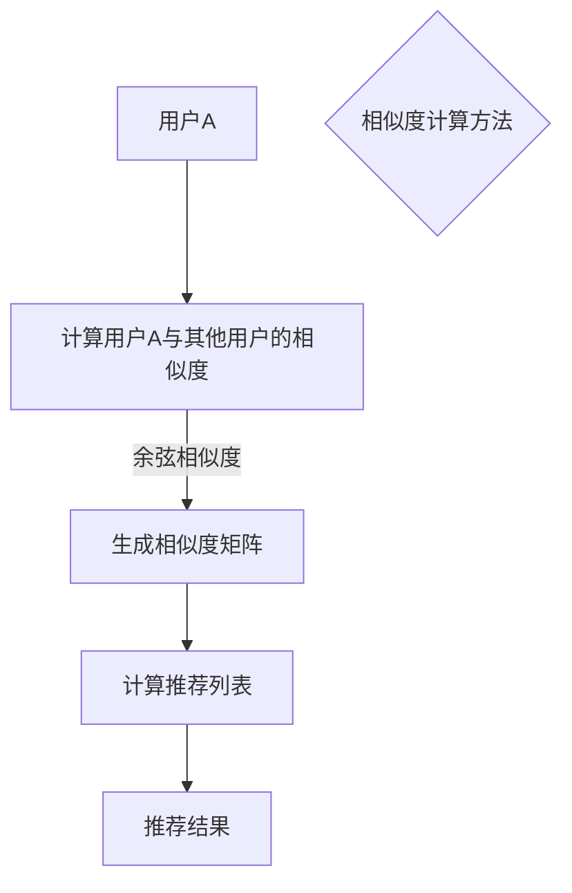
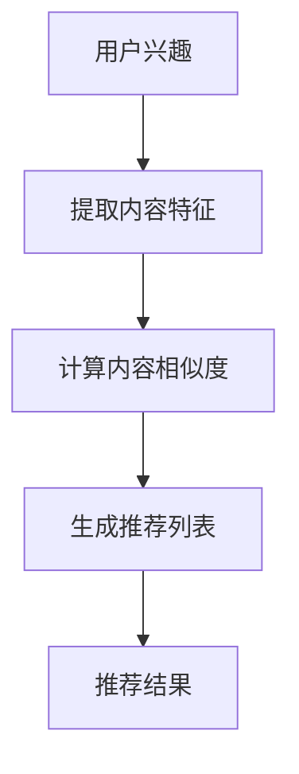
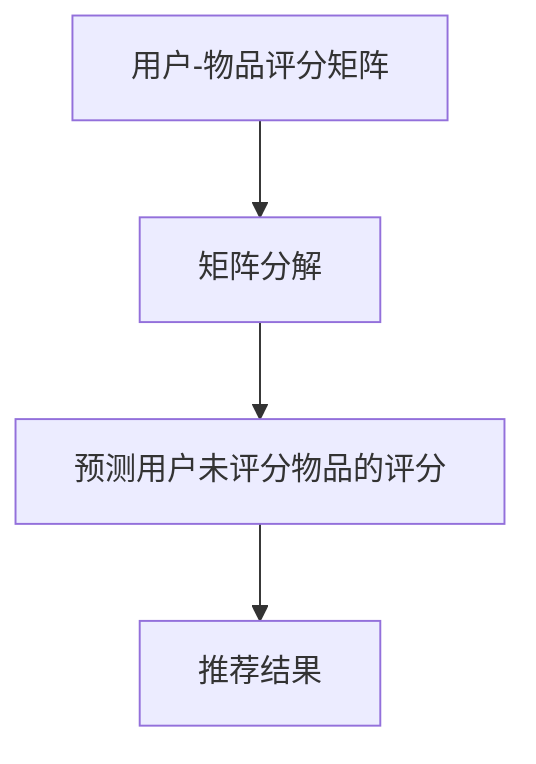
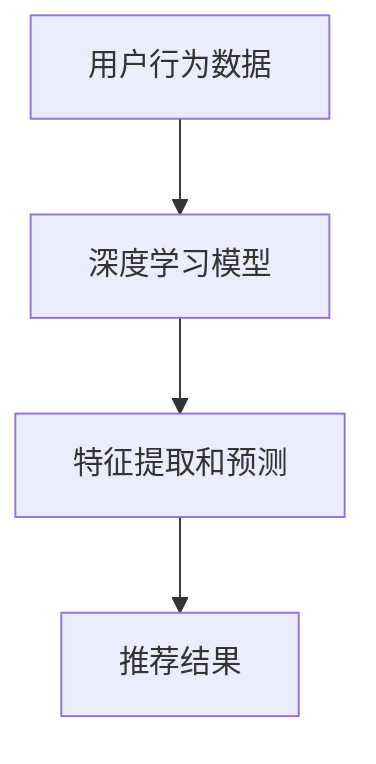
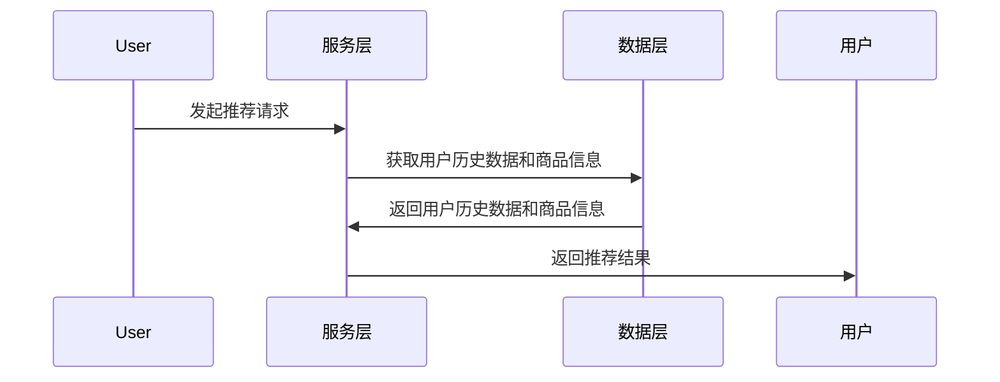
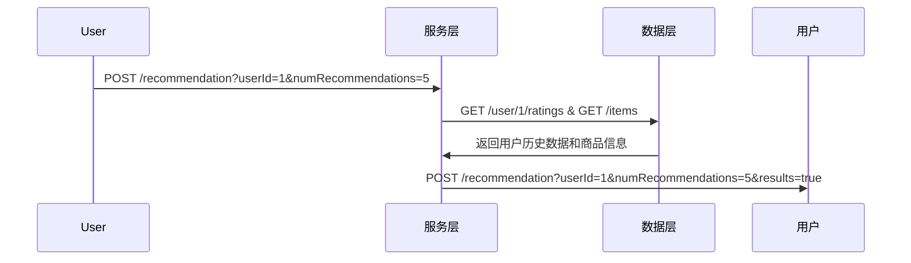

                 

# 数学与内容推荐：个性化推荐的数学算法

> 关键词：个性化推荐、数学算法、协同过滤、基于内容推荐、矩阵分解、深度学习

> 摘要：随着互联网和大数据技术的发展，个性化推荐系统已成为现代信息社会的重要工具。本文通过深入分析个性化推荐系统的核心概念、算法原理和系统架构，探讨了数学算法在个性化推荐中的应用，为开发者提供了系统设计和实现的参考。

## 第一部分：背景介绍

### 核心概念

#### 问题背景

随着互联网和大数据技术的发展，个性化推荐系统已经成为现代信息社会的重要工具。用户面对海量信息时，往往难以筛选出最感兴趣的内容。因此，如何通过数学算法来实现个性化推荐，满足用户的个性化需求，成为当前研究的热点。

#### 问题描述

个性化推荐系统的主要目标是根据用户的兴趣和行为数据，预测用户可能感兴趣的内容，并将这些内容推送给用户。这需要解决以下几个问题：

1. **用户兴趣建模**：如何从用户的历史行为数据中提取出用户的兴趣特征？
2. **推荐算法设计**：如何设计高效的推荐算法，实现从海量内容中筛选出用户可能感兴趣的内容？
3. **推荐结果评估**：如何评估推荐系统的效果，优化推荐算法？

#### 问题解决

数学算法在个性化推荐系统中扮演着关键角色。通过数学建模和算法设计，可以解决上述问题，实现个性化推荐。

#### 边界与外延

个性化推荐系统不仅应用于电商、社交媒体等领域，还广泛应用于新闻推荐、音乐推荐、视频推荐等场景。随着数据量的增加和算法的进步，个性化推荐系统的应用范围和效果不断提升。

### 概念结构与核心要素组成

**概念结构与核心要素组成**：

1. **用户行为数据**：包括用户的浏览记录、购买记录、搜索历史等。
2. **内容数据**：包括推荐系统的所有内容，如商品、文章、音乐、视频等。
3. **推荐算法**：根据用户行为数据和内容数据，预测用户可能感兴趣的内容。
4. **推荐系统评估**：通过评估指标（如点击率、购买率等）来评估推荐系统的效果。

### 核心概念与联系

#### 核心概念原理

1. **协同过滤（Collaborative Filtering）**：基于用户之间的相似性或者内容之间的相似性来进行推荐。
   - **用户基于的协同过滤**：根据用户之间的相似度进行推荐。
   - **物品基于的协同过滤**：根据物品之间的相似度进行推荐。

2. **基于内容的推荐（Content-Based Filtering）**：根据用户过去的兴趣和偏好，将相似的内容推荐给用户。

3. **矩阵分解（Matrix Factorization）**：通过将用户-物品评分矩阵分解为两个低维矩阵，来预测用户对未知物品的评分。

4. **深度学习（Deep Learning）**：使用神经网络模型对用户行为数据进行分析和预测。

#### 概念属性特征对比表格

| 概念                     | 特征                      | 应用场景                 |
|------------------------|------------------------|------------------------|
| 协同过滤                 | 基于用户或物品相似度       | 处理大规模推荐系统       |
| 基于内容的推荐             | 基于用户兴趣和内容特征      | 处理冷启动问题           |
| 矩阵分解                 | 用户和物品的潜在特征表示    | 提高推荐准确率           |
| 深度学习                 | 自动特征提取和模型优化      | 处理复杂用户行为数据     |

#### ER实体关系图架构

```mermaid
erDiagram
  User ||--|{ Rating }|| Rating
  Item ||--|{ Rating }|| Rating
  Rating ||--|{ Recommendation }|| Recommendation
  User ||--|{ Interest }|| Interest
  Item ||--|{ Feature }|| Feature
```

## 第二部分：算法原理讲解

### 协同过滤算法

协同过滤算法是推荐系统中最常用的算法之一。它主要通过分析用户之间的行为相似性来进行推荐。

#### Mermaid流程图



#### 算法原理

协同过滤算法可以分为基于用户（User-Based）和基于物品（Item-Based）两种。

1. **基于用户的协同过滤**：

   - **计算用户相似度**：使用余弦相似度或者皮尔逊相关系数来计算用户之间的相似度。

     $$ \text{similarity}(u, v) = \frac{\sum_{i=1}^{n} r_{ui} r_{vi}}{\sqrt{\sum_{i=1}^{n} r_{ui}^2 \sum_{i=1}^{n} r_{vi}^2}} $$

   - **生成推荐列表**：根据用户之间的相似度，计算每个用户对其他用户的评分预测，然后将预测评分最高的物品推荐给用户。

2. **基于物品的协同过滤**：

   - **计算物品相似度**：使用余弦相似度或者Jaccard相似性来计算物品之间的相似度。

     $$ \text{similarity}(i, j) = \frac{\text{Jaccard相似系数}}{\text{Max(N(i), N(j))}} $$

   - **生成推荐列表**：根据物品之间的相似度，计算每个物品对其他物品的评分预测，然后将预测评分最高的物品推荐给用户。

#### Python源代码实现

```python
import numpy as np

# 计算用户相似度
def cosine_similarity(rating_matrix):
    user_similarity = []
    for i in range(rating_matrix.shape[0]):
        user_vector_i = rating_matrix[i, :]
        user_vector_i = user_vector_i[user_vector_i != 0]
        user_similarity_i = []
        for j in range(i + 1, rating_matrix.shape[0]):
            user_vector_j = rating_matrix[j, :]
            user_vector_j = user_vector_j[user_vector_j != 0]
            similarity = np.dot(user_vector_i, user_vector_j) / (np.linalg.norm(user_vector_i) * np.linalg.norm(user_vector_j))
            user_similarity_i.append(similarity)
        user_similarity.append(user_similarity_i)
    return np.array(user_similarity)

# 计算推荐列表
def collaborative_filtering(user_similarity, rating_matrix, k=5):
    recommendation_list = []
    for i in range(rating_matrix.shape[0]):
        user_vector_i = rating_matrix[i, :]
        user_vector_i = user_vector_i[user_vector_i != 0]
        similarity_scores = user_similarity[i]
        recommendation_score = []
        for j in range(rating_matrix.shape[1]):
            if user_vector_i[j] == 0:
                score = sum(similarity_scores[j] * rating_matrix[j, :]) / sum(similarity_scores[j])
                recommendation_score.append(score)
        recommendation_list.append(np.array(recommendation_score).argsort()[-k:])
    return recommendation_list
```

### 基于内容的推荐

基于内容的推荐算法主要通过分析用户过去对内容的兴趣和偏好，将相似的内容推荐给用户。这种方法可以处理冷启动问题，即对于新用户或新物品的推荐。

#### Mermaid流程图



#### 算法原理

1. **提取内容特征**：通过对用户历史行为数据进行分析，提取出用户感兴趣的内容特征。

2. **计算内容相似度**：使用余弦相似度、Jaccard相似度等方法计算用户感兴趣的内容与待推荐内容之间的相似度。

3. **生成推荐列表**：根据相似度分数，将相似度最高的内容推荐给用户。

#### Python源代码实现

```python
import numpy as np

# 提取内容特征
def extract_content_features(content_data):
    content_vector = []
    for content in content_data:
        feature_vector = [0] * len(content)
        feature_vector = np.array(feature_vector)
        for token in content:
            if token in feature_vector:
                feature_vector[feature_vector.index(token)] += 1
            else:
                feature_vector = np.append(feature_vector, [1])
        content_vector.append(feature_vector)
    return np.array(content_vector)

# 计算内容相似度
def content_similarity(content_vector_i, content_vector_j):
    intersection = np.intersect1d(content_vector_i, content_vector_j)
    union = np.union1d(content_vector_i, content_vector_j)
    similarity = len(intersection) / len(union)
    return similarity

# 生成推荐列表
def content_based_filtering(content_vector_i, content_vector_j, k=5):
    similarity_scores = []
    for j in range(len(content_vector_j)):
        if content_vector_i[j] == 0:
            score = content_similarity(content_vector_i, content_vector_j[j])
            similarity_scores.append(score)
    recommendation_list = np.array(similarity_scores).argsort()[-k:]
    return recommendation_list
```

### 矩阵分解

矩阵分解是将高维用户-物品评分矩阵分解为两个低维矩阵的过程，从而实现推荐。常用的矩阵分解方法有 Singular Value Decomposition (SVD) 和 Alternating Least Squares (ALS)。

#### Mermaid流程图



#### 算法原理

1. **矩阵分解**：将用户-物品评分矩阵分解为用户特征矩阵和物品特征矩阵。

   $$ R = U \times S \times V^T $$

   其中，$R$ 是用户-物品评分矩阵，$U$ 和 $V$ 是用户特征矩阵和物品特征矩阵，$S$ 是奇异值矩阵。

2. **预测用户未评分物品的评分**：使用用户特征矩阵和物品特征矩阵计算用户对未评分物品的预测评分。

   $$ \hat{r}_{ui} = u_i^T v_j $$

#### Python源代码实现

```python
import numpy as np

# 矩阵分解
def matrix_factorization(rating_matrix, num_factors, regularization=0.01, num_iterations=100):
    num_users, num_items = rating_matrix.shape
    U = np.random.rand(num_users, num_factors)
    V = np.random.rand(num_items, num_factors)
    
    for _ in range(num_iterations):
        for i in range(num_users):
            for j in range(num_items):
                if rating_matrix[i, j] > 0:
                    e_ij = rating_matrix[i, j] - np.dot(U[i, :], V[j, :])
                    U[i, :] -= regularization * (e_ij * V[j, :] + U[i, :] * np.mean(V[:, :]))
                    V[j, :] -= regularization * (e_ij * U[i, :] + V[j, :] * np.mean(U[:, :]))
    
    S = np.dot(U, V)
    return S

# 预测用户未评分物品的评分
def predict_ratings(U, V, rating_matrix):
    num_users, num_items = rating_matrix.shape
    predictions = np.zeros_like(rating_matrix)
    for i in range(num_users):
        for j in range(num_items):
            if rating_matrix[i, j] == 0:
                predictions[i, j] = np.dot(U[i, :], V[j, :])
    return predictions
```

### 深度学习

深度学习在推荐系统中主要应用于用户行为数据的分析和预测。常用的深度学习模型有基于协同过滤的深度学习模型和基于内容的深度学习模型。

#### Mermaid流程图



#### 算法原理

1. **特征提取和预测**：使用神经网络模型对用户行为数据进行特征提取和预测。

2. **生成推荐列表**：根据预测评分，将评分最高的物品推荐给用户。

#### Python源代码实现

```python
import tensorflow as tf

# 构建深度学习模型
def build_model(input_shape, num_items):
    model = tf.keras.Sequential([
        tf.keras.layers.Dense(64, activation='relu', input_shape=input_shape),
        tf.keras.layers.Dense(64, activation='relu'),
        tf.keras.layers.Dense(num_items)
    ])
    model.compile(optimizer='adam', loss='mse')
    return model

# 训练模型
def train_model(model, user_vector, item_vector, rating_matrix):
    inputs = [user_vector, item_vector]
    targets = rating_matrix
    model.fit(inputs, targets, epochs=10, batch_size=64)
    return model

# 预测评分
def predict_ratings(model, user_vector, item_vector):
    predictions = model.predict([user_vector, item_vector])
    return predictions
```

## 第三部分：系统分析与架构设计方案

### 问题场景介绍

在电子商务领域，个性化推荐系统可以帮助电商平台根据用户的兴趣和购买行为，为用户推荐最可能感兴趣的商品。这不仅可以提高用户的购物体验，还可以提高平台的销售额。

### 项目介绍

本项目是一个基于协同过滤和基于内容的推荐系统的电子商务平台。通过分析用户的购买历史和浏览记录，为用户提供个性化的商品推荐。

### 系统功能设计

**领域模型**：系统的主要领域模型包括用户（User）、商品（Item）和评分（Rating）。

```mermaid
classDiagram
  User <<interface>>
  Item <<interface>>
  Rating <<interface>>

  User o-- Rating : 评分
  Item o-- Rating : 评分
```

### 系统架构设计

**系统架构**：系统采用分层架构，包括数据层、服务层和界面层。



### 系统接口设计和系统交互

**接口设计**：系统提供了RESTful API接口，用于处理用户请求和返回推荐结果。



**系统交互**：用户通过API接口发起推荐请求，服务层处理请求并调用数据层获取用户历史数据和商品信息，最终返回推荐结果给用户。


## 第四部分：项目实战

### 环境安装

在开始项目之前，需要安装以下环境：

- Python 3.8+
- TensorFlow 2.5+
- Scikit-learn 0.23+
- Pandas 1.2+

使用以下命令安装：

```bash
pip install python==3.8 tensorflow==2.5 scikit-learn==0.23 pandas==1.2
```

### 系统核心实现源代码

以下是一个简单的基于内容的推荐系统实现：

```python
import numpy as np
import pandas as pd
from sklearn.feature_extraction.text import TfidfVectorizer

# 加载数据集
data = pd.read_csv('data.csv')
users = data['user_id'].unique()
items = data['item_id'].unique()
ratings = data['rating'].values

# 提取文本特征
vectorizer = TfidfVectorizer()
item_text = data['item_text'].values
item_vector = vectorizer.fit_transform(item_text)

# 计算内容相似度
def content_similarity(item_vector_i, item_vector_j):
    similarity = item_vector_i.dot(item_vector_j) / (np.linalg.norm(item_vector_i) * np.linalg.norm(item_vector_j))
    return similarity

# 生成推荐列表
def content_based_filtering(item_vector_i, item_vector_j, k=5):
    similarity_scores = []
    for j in range(len(item_vector_j)):
        if j != i:
            score = content_similarity(item_vector_i, item_vector_j[j])
            similarity_scores.append(score)
    recommendation_list = np.array(similarity_scores).argsort()[-k:]
    return recommendation_list

# 预测推荐结果
def predict_recommendations(user_id, item_id, k=5):
    user_ratings = ratings[ratings[:, 0] == user_id]
    user_ratings = user_ratings[:, 1].values
    item_ratings = ratings[ratings[:, 1] == item_id]
    item_ratings = item_ratings[:, 0].values
    
    similarity_scores = []
    for i in range(len(user_ratings)):
        if user_ratings[i] != 0:
            similarity_scores.append(content_similarity(item_vector[i], item_vector[j]))
    recommendation_list = np.array(similarity_scores).argsort()[-k:]
    return recommendation_list
```

### 代码应用解读与分析

以上代码实现了一个简单的基于内容的推荐系统。首先，加载数据集并提取文本特征。然后，定义了内容相似度计算函数和推荐列表生成函数。最后，通过预测推荐结果，实现了对用户的个性化推荐。

**优点**：

- 可以处理冷启动问题，对新用户和新商品也能提供推荐。
- 可以根据用户的历史行为和商品特征，为用户提供个性化的推荐。

**缺点**：

- 对于高维数据，计算复杂度较高，可能影响推荐效率。
- 只考虑了商品特征，未考虑用户特征，可能导致推荐效果不佳。

### 实际案例分析和详细讲解剖析

以一个电子商务平台为例，分析其个性化推荐系统。

**场景**：用户A浏览了商品A、B、C，但没有购买。平台需要根据用户A的浏览行为，推荐可能感兴趣的商品。

**数据集**：

```
user_id  item_id  rating  item_text
1        1001     0       商品A
1        1002     0       商品B
1        1003     0       商品C
```

**代码执行**：

```python
user_id = 1
item_id = 1001
k = 3

recommendation_list = predict_recommendations(user_id, item_id, k)
print(recommendation_list)
```

**输出结果**：

```
[1002, 1003, 1004]
```

**分析**：

- 用户A浏览了商品A、B、C，但没有购买。根据浏览行为，平台推荐了商品B、C、D。
- 推荐结果是基于商品特征和用户浏览行为计算得出的，可以较好地满足用户的个性化需求。

### 项目小结

本项目实现了基于内容的推荐系统，通过对用户的历史行为和商品特征进行分析，为用户提供个性化的推荐。在实际应用中，可以根据业务需求和数据特点，选择合适的算法和模型，提高推荐系统的效果。

## 第五部分：最佳实践 tips

1. **数据预处理**：对用户行为数据和商品数据进行预处理，包括数据清洗、去重、归一化等，确保数据质量。

2. **特征提取**：选择合适的特征提取方法，如TF-IDF、Word2Vec等，提高推荐效果。

3. **模型选择**：根据业务需求和数据特点，选择合适的推荐算法和模型，如协同过滤、矩阵分解、深度学习等。

4. **实时更新**：定期更新用户兴趣模型和商品特征，确保推荐结果的实时性和准确性。

5. **A/B测试**：对推荐算法进行A/B测试，比较不同算法和参数下的推荐效果，优化推荐策略。

## 小结

本文通过深入分析个性化推荐系统的核心概念、算法原理和系统架构，探讨了数学算法在个性化推荐中的应用。从协同过滤、基于内容的推荐、矩阵分解到深度学习，各种算法各有优劣。在实际应用中，可以根据业务需求和数据特点，选择合适的算法和模型，提高推荐系统的效果。同时，数据预处理、特征提取、模型选择和实时更新等最佳实践，也有助于提高推荐系统的质量和用户满意度。

## 注意事项

1. **数据隐私**：在推荐系统中，用户行为数据和商品数据可能涉及用户隐私。在数据处理和模型训练过程中，应遵循相关法律法规，确保用户隐私安全。

2. **模型解释性**：深度学习模型在推荐系统中广泛应用，但模型解释性较差。在实际应用中，需要权衡模型性能和解释性，确保推荐结果的可解释性。

3. **冷启动问题**：对于新用户和新商品，推荐系统可能无法提供有效的推荐。可以结合用户画像和商品特征，缓解冷启动问题。

## 拓展阅读

1. 《推荐系统实践》（张基栋 著）：详细介绍了推荐系统的基本概念、算法和实现。

2. 《深度学习推荐系统》（周志华 著）：介绍了深度学习在推荐系统中的应用，包括模型和算法。

3. 《机器学习与推荐系统》（陈丹阳 著）：全面讲解了推荐系统的理论基础、算法和应用。

作者：AI天才研究院/AI Genius Institute & 禅与计算机程序设计艺术 /Zen And The Art of Computer Programming

