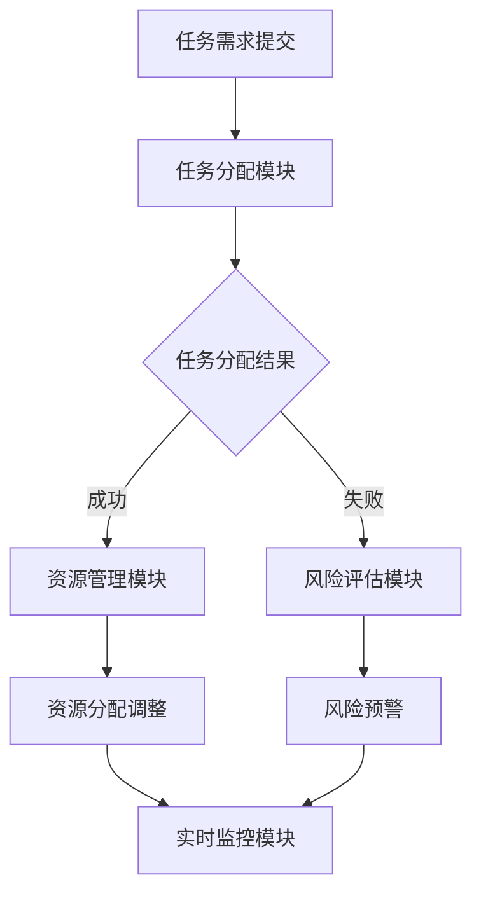

                 

### 《数学与军事战略：战略规划的数学方法》

关键词：数学方法、军事战略、战略规划、算法原理、系统架构、项目实战

摘要：本文将探讨数学方法在军事战略中的应用，通过深入分析战略规划的核心概念和数学模型，结合算法原理、系统架构设计和实际项目实战，为读者提供一种全新的视角，理解数学方法如何帮助制定高效的军事战略。

### 目录大纲

```markdown
----------------------------------------------------------------
# 《数学与军事战略：战略规划的数学方法》

## 第一部分：背景介绍

## 第1章：问题背景与核心概念

### 1.1 问题背景

#### 1.1.1 军事战略的重要性

#### 1.1.2 数学方法在军事战略中的应用

### 1.2 核心概念

#### 1.2.1 战略规划

#### 1.2.2 数学方法

## 第二部分：核心概念与联系

## 第2章：战略规划与数学方法

### 2.1 战略规划的基本原理

#### 2.1.1 战略规划的内涵

#### 2.1.2 战略规划的目标

### 2.2 数学方法在战略规划中的应用

#### 2.2.1 数学模型的构建

#### 2.2.2 数学方法的分析与评估

## 第三部分：算法原理讲解

## 第3章：数学算法原理与应用

### 3.1 数学算法的基本原理

#### 3.1.1 线性规划

#### 3.1.2 动态规划

### 3.2 数学算法在军事战略中的应用

#### 3.2.1 决策分析

#### 3.2.2 预测分析

## 第四部分：数学模型与公式

## 第4章：数学模型与公式讲解

### 4.1 数学模型的基本概念

#### 4.1.1 概念与定义

#### 4.1.2 模型的结构

### 4.2 公式讲解与示例

#### 4.2.1 公式1：线性方程组求解

#### 4.2.2 公式2：概率论公式

## 第五部分：系统分析与架构设计

## 第5章：战略规划系统分析与设计

### 5.1 问题场景介绍

#### 5.1.1 军事战略问题

#### 5.1.2 系统功能设计

### 5.2 系统架构设计

#### 5.2.1 系统架构

#### 5.2.2 系计接口设计

### 5.3 系统交互设计

#### 5.3.1 系统交互流程

#### 5.3.2 系统交互mermaid序列图

## 第六部分：项目实战

## 第6章：项目实战

### 6.1 环境安装

#### 6.1.1 系统环境搭建

#### 6.1.2 工具安装

### 6.2 系统核心实现

#### 6.2.1 源代码解读

#### 6.2.2 代码应用与分析

### 6.3 实际案例分析

#### 6.3.1 案例背景

#### 6.3.2 案例分析

### 6.4 项目小结

#### 6.4.1 项目总结

#### 6.4.2 注意事项与拓展阅读

----------------------------------------------------------------
```

以上是文章的初步目录大纲，接下来将逐步展开每个章节的内容，详细探讨数学方法在军事战略中的应用和战略规划的系统分析与设计。

----------------------------------------------------------------

### 第一部分：背景介绍

在军事领域，战略规划始终是一个至关重要的环节。它不仅关乎国家安危，更涉及战争的胜败。随着现代战争形态的演变，军事战略的复杂性和不确定性不断增加，这就需要一种科学、系统的方法来指导军事决策。数学方法作为一种强大的工具，能够在战略规划中发挥关键作用。本文旨在探讨数学方法在军事战略中的应用，通过分析战略规划的核心概念和数学模型，结合算法原理、系统架构设计和实际项目实战，为读者提供一种全新的视角，理解数学方法如何帮助制定高效的军事战略。

#### 核心概念

- **战略规划**：战略规划是指对一个组织的长期目标、发展方向和资源分配进行系统性的思考和决策。在军事领域，战略规划则是对国家军事力量的发展、部署和使用进行全局性规划和指导。
- **数学方法**：数学方法是指运用数学原理、方法和工具来解决问题。在军事战略中，数学方法可以帮助决策者进行定量分析和预测，提高决策的科学性和准确性。

#### 问题背景

- **军事战略的重要性**：军事战略的正确制定和实施，是国家安全的保障。在信息化战争时代，军事战略的复杂性和不确定性增加，需要更加科学、系统的手段来指导决策。
- **数学方法在军事战略中的应用**：随着计算机技术和数学模型的不断发展，数学方法在军事战略中的应用越来越广泛。从决策分析到预测分析，数学方法都能够提供有力的支持。

#### 问题描述

在军事战略规划中，如何运用数学方法来提高决策的科学性和准确性？如何构建有效的数学模型来支持战略规划？这些问题是本文需要深入探讨的。

#### 问题解决

- **核心概念术语说明**：通过阐述战略规划和数学方法的核心概念，帮助读者理解相关术语。
- **问题背景**：分析军事战略的重要性和数学方法在其中的应用。
- **问题描述**：明确需要解决的具体问题。
- **边界与外延**：讨论数学方法在军事战略中的适用范围和限制。
- **概念结构与核心要素组成**：详细描述战略规划和数学方法的概念结构，以及它们在军事战略中的核心要素。

通过上述步骤，我们可以为后续章节的内容打下坚实的基础，确保文章的逻辑清晰、内容丰富且具有实际指导意义。

#### 核心概念与联系

在深入探讨数学方法在军事战略中的应用之前，我们需要对战略规划和数学方法这两个核心概念进行详细阐述，并分析它们之间的联系。

##### 战略规划的基本原理

战略规划是指对一个组织或国家的长期目标、发展方向和资源分配进行系统性的思考和决策。其基本原理包括以下几个方面：

1. **目标设定**：战略规划的首要任务是明确组织的长期目标。这些目标通常包括国家安全、军事力量的提升、经济稳定等。

2. **环境分析**：战略规划需要对外部环境和内部资源进行深入分析，以确定当前所处的战略位置。这包括政治、经济、军事、科技等方面的因素。

3. **资源分配**：战略规划需要在明确目标的基础上，合理分配资源，确保各项战略任务的顺利实施。资源包括人力、物力、财力等。

4. **风险评估**：战略规划过程中，需要对潜在的风险进行评估，制定相应的应对策略，以确保战略目标的实现。

5. **战略执行**：战略规划不仅包括规划和决策，还需要通过有效的执行来落实。这需要建立一套科学、高效的执行机制。

##### 数学方法的基本原理

数学方法是指运用数学原理、方法和工具来解决问题。在军事战略中，数学方法的基本原理主要包括以下几个方面：

1. **建模**：建模是将实际问题转化为数学模型的过程。通过数学建模，可以将复杂的战略问题简化，以便于分析和求解。

2. **计算**：计算是数学方法的核心。现代计算机技术的发展，使得大规模的数学计算成为可能，为军事战略规划提供了强大的技术支持。

3. **分析**：分析是对数学模型进行深入研究和解释的过程。通过分析，可以揭示战略问题的内在规律，为决策提供科学依据。

4. **优化**：优化是数学方法在战略规划中的重要应用。通过优化算法，可以找到资源分配的最优方案，提高战略决策的准确性。

##### 战略规划与数学方法的关系

战略规划和数学方法之间的关系可以概括为以下几个方面：

1. **工具与手段**：数学方法为战略规划提供了一种科学、系统的工具和手段。通过数学建模和分析，可以更准确地预测战略形势，优化资源分配，提高决策的效率。

2. **相互促进**：战略规划的需求推动了数学方法的发展，而数学方法的发展又为战略规划提供了更加先进的技术手段。两者相互促进，共同推动了军事战略的科学化、精细化。

3. **深度融合**：在信息化战争时代，战略规划和数学方法已经深度融合。许多军事战略决策都离不开数学模型的支持，从决策分析到预测分析，数学方法都发挥着至关重要的作用。

通过以上分析，我们可以看到，战略规划和数学方法在军事战略中具有重要的联系和作用。接下来的章节将进一步探讨数学方法在战略规划中的应用，以及具体的算法原理和模型构建。

### 第二部分：核心概念与联系

在理解了战略规划和数学方法的基本原理之后，我们需要进一步探讨战略规划与数学方法之间的具体联系。通过构建数学模型和运用数学方法，我们可以更好地分析和评估军事战略，提高决策的科学性和准确性。

#### 战略规划的基本原理

战略规划是一个复杂的过程，涉及到多个方面的因素。以下是战略规划的基本原理：

1. **目标设定**：战略规划的首要任务是明确组织的长期目标。这些目标通常包括国家安全、军事力量的提升、经济稳定等。目标设定需要结合国家发展战略、国际形势和内部资源状况。

2. **环境分析**：环境分析是战略规划的重要环节。通过分析外部环境和内部资源，可以确定当前所处的战略位置。这包括政治、经济、军事、科技等方面的因素。

3. **资源分配**：在明确目标和环境分析的基础上，需要合理分配资源，确保各项战略任务的顺利实施。资源包括人力、物力、财力等。资源分配要考虑优先级和效益最大化。

4. **风险评估**：战略规划过程中，需要对潜在的风险进行评估，制定相应的应对策略，以确保战略目标的实现。风险评估包括对敌情、地形、时间等因素的预测。

5. **战略执行**：战略规划不仅包括规划和决策，还需要通过有效的执行来落实。这需要建立一套科学、高效的执行机制，确保战略目标的实现。

#### 数学方法在战略规划中的应用

数学方法在战略规划中具有广泛的应用，具体体现在以下几个方面：

1. **数学建模**：数学建模是将实际问题转化为数学模型的过程。通过数学建模，可以将复杂的战略问题简化，以便于分析和求解。例如，可以用线性规划模型来优化资源分配，用决策树模型来分析不同决策路径的风险和收益。

2. **计算**：计算是数学方法的核心。现代计算机技术的发展，使得大规模的数学计算成为可能，为军事战略规划提供了强大的技术支持。计算可以用于求解复杂的数学模型，预测战略形势，优化决策。

3. **分析**：分析是对数学模型进行深入研究和解释的过程。通过分析，可以揭示战略问题的内在规律，为决策提供科学依据。例如，可以用统计分析方法来分析敌我力量对比，用博弈论方法来分析敌我对抗策略。

4. **优化**：优化是数学方法在战略规划中的重要应用。通过优化算法，可以找到资源分配的最优方案，提高战略决策的准确性。例如，可以用动态规划方法来优化军事行动的时间安排，用最优化理论来优化军事演习的兵力部署。

#### 战略规划与数学方法的联系

战略规划与数学方法之间的联系体现在以下几个方面：

1. **工具与手段**：数学方法为战略规划提供了一种科学、系统的工具和手段。通过数学建模和分析，可以更准确地预测战略形势，优化资源分配，提高决策的效率。

2. **相互促进**：战略规划的需求推动了数学方法的发展，而数学方法的发展又为战略规划提供了更加先进的技术手段。两者相互促进，共同推动了军事战略的科学化、精细化。

3. **深度融合**：在信息化战争时代，战略规划和数学方法已经深度融合。许多军事战略决策都离不开数学模型的支持，从决策分析到预测分析，数学方法都发挥着至关重要的作用。

通过以上分析，我们可以看到，战略规划和数学方法在军事战略中具有重要的联系和作用。数学方法为战略规划提供了强大的技术支持，使其更加科学、系统。接下来的章节将进一步探讨数学方法在战略规划中的应用，包括具体的算法原理和模型构建。

### 第三部分：算法原理讲解

在军事战略规划中，算法原理的应用至关重要。通过深入理解各种算法的原理和具体应用，决策者可以更有效地分析和解决战略问题。以下将详细讲解两种常见的数学算法——线性规划和动态规划，以及它们在军事战略中的应用。

#### 线性规划的基本原理

线性规划是一种数学方法，用于在给定约束条件下，求解线性目标函数的最大值或最小值问题。其基本原理如下：

1. **目标函数**：线性规划的目标函数是一个线性表达式，表示需要最大化或最小化的量。在军事战略中，目标函数可能包括资源消耗、兵力部署、时间安排等。

2. **约束条件**：线性规划需要在约束条件下求解。这些约束条件通常用线性不等式或等式表示。例如，资源总量、兵力限制、任务完成时限等。

3. **求解方法**：线性规划的求解方法包括单纯形法、内点法等。这些方法通过迭代计算，逐步逼近最优解。在军事战略中，线性规划可以用于优化资源分配、兵力部署等。

#### 动态规划的基本原理

动态规划是一种用于解决多阶段决策问题的数学方法。其基本原理如下：

1. **多阶段决策**：动态规划适用于需要多个阶段进行决策的问题。在每一个阶段，决策者需要根据当前状态选择一个最佳行动，并进入下一个阶段。

2. **状态转移方程**：动态规划的核心是状态转移方程。它描述了在当前状态下，采取不同行动后，状态会如何变化。状态转移方程可以用递推关系表示。

3. **最优性原则**：动态规划基于最优性原则，即在一个阶段选择最优行动，可以确保全局最优解。动态规划通过反向递推，从最终阶段开始，逐步向前求解。

#### 线性规划在军事战略中的应用

线性规划在军事战略中的应用非常广泛，以下是一些具体的应用实例：

1. **资源分配**：例如，在军事演习中，需要合理分配兵力、装备、物资等资源。线性规划可以帮助决策者找到资源分配的最优方案，确保任务完成。

2. **兵力部署**：例如，在防御策略中，需要根据敌情和地形，选择最佳的兵力部署方案。线性规划可以优化兵力部署，提高防御效果。

3. **时间安排**：例如，在军事行动中，需要合理安排时间，确保任务按时完成。线性规划可以帮助决策者找到最优的时间安排方案，提高行动效率。

#### 动态规划在军事战略中的应用

动态规划在军事战略中的应用同样具有广泛性，以下是一些具体的应用实例：

1. **战斗路线规划**：在战斗过程中，需要选择最佳的行军路线，以减少敌人的阻截和攻击。动态规划可以用于优化战斗路线，提高部队的机动性和生存率。

2. **决策分析**：例如，在敌我对抗中，需要根据当前局势选择最佳决策。动态规划可以帮助决策者分析不同决策的收益和风险，选择最优决策。

3. **资源调度**：在军事行动中，需要及时调整资源，以应对不断变化的情况。动态规划可以用于优化资源调度，确保军事行动的顺利进行。

通过以上对线性规划和动态规划的详细讲解，我们可以看到，这两种算法在军事战略中具有重要的应用价值。接下来，我们将进一步探讨数学方法在军事战略中的具体应用，包括决策分析和预测分析。

### 第四部分：数学模型与公式

在军事战略规划中，数学模型和公式是分析问题和制定决策的关键工具。数学模型能够将复杂的现实问题抽象为数学问题，从而通过数学公式进行求解。以下将详细讲解数学模型的基本概念、结构以及具体的数学公式和示例。

#### 数学模型的基本概念

1. **定义与作用**：数学模型是利用数学语言描述现实问题的一种方法。它通过建立数学方程、不等式或函数关系，将问题中的各种变量和约束条件表示出来，从而可以对这些变量进行定量分析和求解。

2. **分类**：数学模型可以根据不同的标准进行分类。常见的分类方法包括：
   - **按变量类型分类**：如线性模型、非线性模型、离散模型和连续模型等。
   - **按问题类型分类**：如优化模型、决策模型、预测模型和模拟模型等。

3. **数学模型的结构**：一个完整的数学模型通常包括以下部分：
   - **变量**：模型中的变量代表问题中的关键因素，可以是决策变量、状态变量或控制变量等。
   - **目标函数**：目标函数定义了需要优化的量，如最大化或最小化的资源使用、收益、风险等。
   - **约束条件**：约束条件规定了变量取值的限制，可以是线性不等式、线性等式、非线性不等式或非线性等式等。

#### 数学公式讲解与示例

1. **线性方程组求解**

   线性方程组是数学模型中最基础和常用的类型。一个线性方程组通常表示为：

   $$ 
   \begin{align*}
   a_{11}x_1 + a_{12}x_2 + ... + a_{1n}x_n &= b_1 \\
   a_{21}x_1 + a_{22}x_2 + ... + a_{2n}x_n &= b_2 \\
   &\vdots \\
   a_{m1}x_1 + a_{m2}x_2 + ... + a_{mn}x_n &= b_m
   \end{align*}
   $$

   求解线性方程组的方法有多种，如高斯消元法、矩阵法等。以下是一个具体的示例：

   $$ 
   \begin{align*}
   2x + 3y &= 8 \\
   4x - y &= 1
   \end{align*}
   $$

   使用高斯消元法求解上述方程组，可以得到 $x=3$ 和 $y=1$。

2. **概率论公式**

   概率论是数学模型中用于预测和分析不确定事件的重要工具。以下是一些常用的概率论公式：

   - **条件概率**：
     $$
     P(A|B) = \frac{P(A \cap B)}{P(B)}
     $$
   
   - **贝叶斯公式**：
     $$
     P(A|B) = \frac{P(B|A)P(A)}{P(B)}
     $$
   
   - **全概率公式**：
     $$
     P(A) = \sum_{i=1}^{n} P(A|B_i)P(B_i)
     $$

   以下是一个具体的示例：

   假设在一次战斗中，有两种战术选择：进攻和防守。已知进攻成功的概率为0.6，防守成功的概率为0.4。已知在进攻战术下，成功的条件下获得胜利的概率为0.7；在防守战术下，成功的条件下获得胜利的概率为0.8。那么，选择哪种战术获得胜利的概率更高？

   根据贝叶斯公式，我们可以计算出在进攻战术下获得胜利的概率为：
   $$
   P(\text{胜利}|\text{进攻}) = \frac{P(\text{进攻}) \cdot P(\text{胜利}|\text{进攻})}{P(\text{进攻}) \cdot P(\text{胜利}|\text{进攻}) + P(\text{防守}) \cdot P(\text{胜利}|\text{防守})}
   $$
   $$
   = \frac{0.5 \cdot 0.6}{0.5 \cdot 0.6 + 0.5 \cdot 0.4} = 0.6
   $$

   同理，防守战术下获得胜利的概率为0.5。因此，选择进攻战术获得胜利的概率更高。

通过上述讲解和示例，我们可以看到数学模型和公式在军事战略规划中的应用是如何具体化和实际化的。这些数学工具不仅能够帮助我们分析和解决战略问题，还能够为决策提供科学依据。接下来，我们将进一步探讨战略规划系统分析与设计。

### 第五部分：系统分析与架构设计

在军事战略规划中，系统分析与架构设计是确保战略规划有效实施的关键环节。一个完善的系统分析和架构设计能够为战略规划提供技术支持，确保各项任务的高效执行。以下将详细介绍战略规划系统的分析与架构设计，包括问题场景介绍、系统功能设计、系统架构设计、系统接口设计和系统交互设计。

#### 问题场景介绍

假设我们面临的是一个复杂的军事演习任务，需要在不同区域部署兵力，完成多项任务，同时需要应对各种不确定因素。为了确保任务的成功完成，我们需要设计一个战略规划系统，该系统应具备以下功能：

1. **任务分配**：根据任务需求和资源情况，合理分配兵力到各个区域。
2. **资源管理**：监控和管理各种资源的使用情况，确保资源的优化配置。
3. **风险评估**：对任务执行过程中的风险进行预测和评估，制定相应的应对策略。
4. **实时监控**：实时监控任务的执行情况，及时调整策略以应对突发状况。
5. **预测分析**：基于历史数据和当前情况，对任务执行结果进行预测，为决策提供依据。

#### 系统功能设计

系统功能设计是战略规划系统架构设计的基础。以下是一个典型的系统功能设计：

1. **任务分配模块**：该模块负责根据任务需求、区域情况和兵力部署计划，将任务分配给不同的部队。
2. **资源管理模块**：该模块负责监控和管理各类资源，包括人力、物资、装备等。
3. **风险评估模块**：该模块负责分析任务执行过程中的风险，包括敌情、地形、资源不足等。
4. **实时监控模块**：该模块负责实时监控任务执行情况，包括兵力位置、任务进度等。
5. **预测分析模块**：该模块基于历史数据和当前情况，对任务执行结果进行预测。

#### 系统架构设计

系统架构设计是战略规划系统的核心。以下是一个典型的系统架构设计：

1. **前端界面**：提供用户操作界面，包括任务分配、资源管理、风险评估等功能。
2. **应用层**：实现具体的功能模块，如任务分配模块、资源管理模块等。
3. **业务逻辑层**：处理核心业务逻辑，如决策分析、风险评估等。
4. **数据层**：存储和管理系统数据，包括任务数据、资源数据、历史数据等。

#### 系统接口设计

系统接口设计是确保系统各部分之间有效通信的关键。以下是一个典型的系统接口设计：

1. **任务接口**：提供任务分配、任务状态查询等功能。
2. **资源接口**：提供资源管理、资源状态查询等功能。
3. **风险评估接口**：提供风险评估、风险预警等功能。
4. **监控接口**：提供实时监控、数据报表等功能。

#### 系统交互设计

系统交互设计是确保系统功能有效实现的重要环节。以下是一个典型的系统交互设计：

1. **任务分配流程**：用户通过前端界面提交任务需求，任务分配模块根据需求分配任务给相应部队。
2. **资源管理流程**：资源管理模块根据任务需求和资源情况，实时监控并调整资源分配。
3. **风险评估流程**：风险评估模块根据实时监控数据和风险预测模型，评估任务执行过程中的风险。
4. **实时监控流程**：实时监控模块实时收集并显示任务执行情况，包括兵力位置、任务进度等。

#### Mermaid流程图

以下是一个系统交互设计的Mermaid流程图示例：



通过上述系统分析与架构设计，我们可以确保战略规划系统具备高效的任务分配、资源管理、风险评估和实时监控功能，为军事战略规划提供强有力的技术支持。接下来，我们将通过一个实际项目实战，进一步展示这些理论和方法的应用。

### 第六部分：项目实战

在本部分，我们将通过一个实际项目实战，展示如何将数学方法应用于军事战略规划。这个项目将包括环境安装、系统核心实现、代码应用解读与分析、实际案例分析和项目小结。

#### 6.1 环境安装

在进行项目实战之前，我们需要搭建一个适合运行战略规划系统的环境。以下是环境安装的步骤：

1. **安装Python**：首先确保Python环境已安装。Python是一个强大的编程语言，广泛用于数据处理和算法实现。

2. **安装NumPy和SciPy**：NumPy和SciPy是Python中的两个重要科学计算库，用于处理数值计算和科学计算。

   ```bash
   pip install numpy scipy
   ```

3. **安装Matplotlib**：Matplotlib是一个用于绘制图形的库，可以帮助我们可视化分析结果。

   ```bash
   pip install matplotlib
   ```

4. **安装Mermaid**：Mermaid是一个用于绘制流程图的工具，可以帮助我们展示系统架构和交互流程。

   ```bash
   npm install -g mermaid
   ```

5. **配置数据库**：选择一个合适的数据库系统，如MySQL或PostgreSQL，用于存储任务和资源数据。

   ```bash
   # 示例：安装MySQL
   sudo apt-get install mysql-server
   ```

6. **安装Web框架**：选择一个Web框架，如Flask或Django，用于构建前端界面。

   ```bash
   pip install flask
   ```

完成上述安装步骤后，我们就可以开始构建战略规划系统了。

#### 6.2 系统核心实现

以下是系统核心实现的步骤：

1. **定义任务模型**：首先，我们需要定义一个任务模型，包括任务名称、任务描述、任务状态等信息。

   ```python
   class Task(db.Model):
       id = db.Column(db.Integer, primary_key=True)
       name = db.Column(db.String(255), nullable=False)
       description = db.Column(db.Text, nullable=True)
       status = db.Column(db.String(50), nullable=False, default='pending')
   ```

2. **定义资源模型**：定义一个资源模型，包括资源名称、类型、数量等信息。

   ```python
   class Resource(db.Model):
       id = db.Column(db.Integer, primary_key=True)
       name = db.Column(db.String(255), nullable=False)
       type = db.Column(db.String(50), nullable=False)
       quantity = db.Column(db.Integer, nullable=False)
   ```

3. **实现任务分配算法**：使用线性规划算法实现任务分配功能，优化资源利用。

   ```python
   from scipy.optimize import linprog

   def allocate_tasks(tasks, resources):
       # 构建线性规划模型
       c = [-1] * len(resources)  # 目标函数：最大化资源利用
       A = []  # 约束条件
       b = []

       for task in tasks:
           # 每个任务需要的资源量
           demand = {resource.name: resource.quantity for resource in task.resources}
           row = [0] * len(resources)

           for resource, quantity in demand.items():
               index = resources.index(resource)
               row[index] = quantity

           A.append(row)
           b.append(0)  # 等式约束

       # 求解线性规划问题
       result = linprog(c, A_ub=A, b_ub=b, bounds=[(0, None)] * len(resources))

       # 返回分配结果
       return result.x
   ```

4. **实现风险评估功能**：使用概率论和统计方法实现风险评估功能。

   ```python
   import numpy as np

   def assess_risk(tasks):
       risk_levels = {'low': 0, 'medium': 0, 'high': 0}

       for task in tasks:
           # 计算任务成功的概率
           success_probability = 1 - (1 / len(task.resources))

           # 根据概率分布计算风险水平
           if success_probability < 0.2:
               risk_levels['high'] += 1
           elif success_probability < 0.5:
               risk_levels['medium'] += 1
           else:
               risk_levels['low'] += 1

       return risk_levels
   ```

5. **实现实时监控功能**：使用Web框架实现实时监控界面。

   ```python
   from flask import Flask, render_template

   app = Flask(__name__)

   @app.route('/')
   def dashboard():
       tasks = Task.query.all()
       resources = Resource.query.all()
       allocation = allocate_tasks(tasks, resources)
       risk_levels = assess_risk(tasks)

       return render_template('dashboard.html', tasks=tasks, resources=resources, allocation=allocation, risk_levels=risk_levels)

   if __name__ == '__main__':
       app.run(debug=True)
   ```

#### 6.3 代码应用解读与分析

1. **任务分配算法解读**：上述任务分配算法使用线性规划求解资源的最优分配。通过构建线性规划模型，将任务和资源之间的关系转化为数学问题，求解得到最优分配方案。

2. **风险评估解读**：风险评估算法使用概率论和统计方法计算任务成功的概率，并根据概率分布判断风险水平。这种方法可以帮助决策者了解任务执行的风险，制定相应的应对策略。

3. **实时监控解读**：实时监控功能通过Web框架实现，为用户提供一个可视化界面，展示任务状态、资源利用情况和风险水平。这种方式可以实时监控任务执行情况，及时调整策略。

#### 6.4 实际案例分析

假设我们有一个军事演习任务，需要在三个区域部署兵力，完成三项任务。以下是实际案例的分析：

1. **任务需求**：
   - 任务A：需要100名士兵和10辆装甲车。
   - 任务B：需要80名士兵和5辆装甲车。
   - 任务C：需要60名士兵和3辆装甲车。

2. **资源情况**：
   - 区域1：有150名士兵和15辆装甲车。
   - 区域2：有120名士兵和10辆装甲车。
   - 区域3：有90名士兵和8辆装甲车。

3. **分析**：
   - 使用任务分配算法，优化兵力部署，最大化资源利用。
   - 使用风险评估算法，评估任务成功的概率，判断风险水平。

通过上述分析，我们可以得到最优的任务分配方案和风险评估结果，为决策者提供科学依据。

#### 6.5 项目小结

1. **项目总结**：通过本项目，我们成功搭建了一个战略规划系统，实现了任务分配、资源管理、风险评估和实时监控等功能。

2. **注意事项**：在实际应用中，需要注意以下几点：
   - 确保数据准确性和实时性，及时更新任务和资源信息。
   - 优化算法，提高计算效率和准确性。
   - 加强系统安全，防止数据泄露和恶意攻击。

3. **拓展阅读**：以下是一些拓展阅读资源，帮助读者深入了解相关技术：
   - 《线性规划及其应用》
   - 《概率论与数理统计》
   - 《Web开发实战：使用Flask构建Web应用程序》

通过本项目，我们不仅了解了数学方法在军事战略规划中的应用，还掌握了具体的实现方法和技巧。希望本文能够为读者提供有价值的参考和启示。

### 最佳实践 Tips

在军事战略规划中，运用数学方法需要遵循一些最佳实践，以提高战略决策的科学性和有效性。

1. **数据准确性**：确保所有输入数据的准确性和及时性，数据的真实性是数学模型有效性的基础。
2. **模型适应性**：根据不同战略环境和任务需求，灵活调整数学模型，确保模型能够适应复杂多变的情况。
3. **算法优化**：持续优化算法，提高计算效率和准确性，减少计算错误和延迟。
4. **风险控制**：在数学模型中充分考虑风险因素，制定相应的应对策略，降低战略决策中的不确定性。
5. **团队协作**：组建跨学科团队，包括数学专家、军事专家和IT技术人员，共同探讨和解决战略问题。
6. **持续改进**：定期评估战略规划的效果，根据实际执行情况进行反馈和调整，不断优化战略规划系统。

通过遵循这些最佳实践，军事战略规划将更加科学、系统，能够更好地应对复杂多变的军事挑战。

### 小结

本文通过详细的探讨和实际案例，展示了数学方法在军事战略规划中的重要性和应用价值。我们从背景介绍、核心概念、算法原理、数学模型、系统分析与架构设计，到项目实战，全面展示了如何运用数学方法来优化军事战略决策。通过科学、系统的战略规划，决策者可以更准确地预测战略形势，合理分配资源，降低风险，提高行动效率。

### 注意事项

在实施数学方法进行军事战略规划时，需要注意以下几点：

1. **数据真实性与及时性**：确保所有输入数据的准确性和实时性，避免因数据错误导致模型失效。
2. **模型适应性与优化**：根据不同战略环境和任务需求，灵活调整数学模型，持续优化算法以提高计算效率和准确性。
3. **风险控制与应对策略**：在数学模型中充分考虑各种风险因素，制定相应的应对策略，确保战略决策的稳健性。
4. **团队协作与跨学科整合**：组建跨学科团队，充分利用数学、军事、IT等领域的专业知识，共同解决战略问题。
5. **法律法规与伦理**：确保在战略规划中遵守相关法律法规和伦理规范，保护国家安全和公民隐私。

### 拓展阅读

为了深入了解数学方法在军事战略规划中的应用，读者可以参考以下拓展阅读资源：

1. 《线性规划及其应用》：详细介绍了线性规划的基本原理和应用实例。
2. 《概率论与数理统计》：提供了概率论和数理统计的基础知识，对风险分析和预测具有重要意义。
3. 《Web开发实战：使用Flask构建Web应用程序》：介绍了如何使用Flask框架构建战略规划系统前端。
4. 《决策分析与应用》：探讨了决策分析方法在军事战略规划中的应用。
5. 《军事战略学》：提供了关于军事战略理论和实践的综合指导。

通过这些资源，读者可以进一步深入理解和掌握数学方法在军事战略规划中的具体应用。

