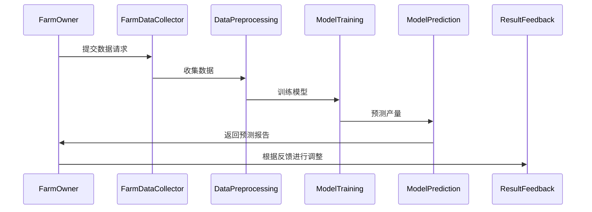

                 

## 《数学与农业科学：作物产量的数学预测》

### 关键词
- 数学预测
- 农业科学
- 作物产量
- 统计模型
- 机器学习模型

### 摘要
本文将深入探讨数学与农业科学的结合，特别是如何利用数学预测模型来提高作物产量。文章首先介绍了农业科学的挑战和需求，接着详细讲解了统计模型、机器学习模型和时间序列分析在农业中的应用。通过算法原理讲解、数学公式解析、系统设计与项目实战等多个方面，本文旨在展示如何将数学方法应用于农业产量预测，提高农业生产效率和农产品质量。

## 目录大纲设计思路

为了使文章结构清晰、逻辑连贯，本文采用了以下目录大纲设计思路：

### 第一部分：背景与基础

1. **农业科学与数学预测概述**
   - **1.1 农业科学的挑战与需求**
   - **1.2 数学预测在农业中的应用**
   - **1.3 本书结构安排与目标**

2. **数学模型在农业科学中的应用**
   - **2.1 统计模型的基本概念**
   - **2.2 机器学习模型简介**
   - **2.3 时间序列分析在农业中的应用**

### 第二部分：算法原理与实现

1. **统计模型与作物产量预测**
   - **3.1 线性回归模型**
   - **3.2 多元线性回归模型**

2. **机器学习模型与作物产量预测**
   - **4.1 机器学习基础**
   - **4.2 决策树模型**
   - **4.3 支持向量机模型**

3. **时间序列分析模型与作物产量预测**
   - **5.1 时间序列基础**
   - **5.2 自回归模型**
   - **5.3 动态线性模型**

### 第三部分：项目实战与最佳实践

1. **项目实战——基于机器学习的作物产量预测系统**
   - **6.1 项目介绍**
   - **6.2 系统核心实现**
   - **6.3 代码应用解读与分析**

2. **最佳实践与总结**
   - **7.1 最佳实践建议**
   - **7.2 小结**
   - **7.3 注意事项**
   - **7.4 拓展阅读**

通过这种设计思路，文章将系统性地介绍数学与农业科学的结合，为读者提供全面的技术视角和实用的操作指南。下面，我们将逐一展开各个章节的内容。

## 第一部分：背景与基础

### 1.1 农业科学的挑战与需求

农业是国民经济的基础，是保障国家粮食安全的重要产业。然而，随着全球人口的不断增长和气候变化的影响，农业面临着前所未有的挑战。传统的农业生产方式已无法满足现代社会的需求，提高作物产量、改善农产品质量、减少资源消耗、应对气候变化成为农业科学的重要任务。

**挑战：**

- **资源限制：** 农业生产需要大量的土地、水资源和肥料。随着资源的日益紧张，如何高效利用这些资源成为农业科学面临的主要挑战。
- **气候变化：** 气候变化导致气候变化异常，极端天气频发，对农作物生长和产量造成严重影响。
- **病虫害防控：** 病虫害对农作物的生长和产量构成巨大威胁，传统的防治方法效果有限。
- **劳动力成本：** 农业生产需要大量劳动力，随着劳动力成本上升，如何降低生产成本成为农业科学需要解决的问题。

**需求：**

- **精准农业：** 利用传感器、遥感技术等手段，实现农田管理的精细化，提高资源利用效率。
- **智能农业：** 利用人工智能、大数据等技术，实现农业生产的智能化，提高作物产量和农产品质量。
- **可持续农业：** 实现农业生产的可持续发展，保护生态环境，降低农业生产对环境的影响。

### 1.2 数学预测在农业中的应用

数学预测在农业科学中具有广泛的应用。通过数学模型和算法，可以对作物产量、病虫害发生、资源利用等关键因素进行预测，为农业生产提供科学依据。以下是一些主要的应用场景：

**作物产量预测：**

- **统计模型：** 如线性回归模型、多元线性回归模型，利用历史数据，预测未来的作物产量。
- **机器学习模型：** 如决策树、支持向量机、神经网络等，通过学习大量的历史数据，预测作物产量。
- **时间序列分析：** 利用时间序列分析方法，如自回归模型、动态线性模型，对作物产量进行短期和长期预测。

**病虫害预测：**

- **统计模型：** 如逻辑回归模型，预测病虫害的发生概率。
- **机器学习模型：** 如随机森林、K-近邻算法，通过学习病虫害的特征，预测其发生情况。
- **时间序列分析：** 如ARIMA模型，预测病虫害发生的周期和趋势。

**资源利用预测：**

- **统计模型：** 如线性规划模型，优化农田资源分配，提高资源利用效率。
- **机器学习模型：** 如聚类算法，分析农田资源利用模式，提出优化建议。
- **时间序列分析：** 如ARIMA模型，预测未来资源需求，指导农业生产计划。

### 1.3 本书结构安排与目标

本书将从数学预测的角度，系统性地介绍农业科学的挑战与需求，以及数学模型在农业中的应用。本书的主要目标如下：

- **介绍农业科学的挑战和需求，为读者提供背景知识。**
- **详细讲解统计模型、机器学习模型和时间序列分析模型，为读者提供理论基础。**
- **通过实际项目案例，展示如何将数学预测方法应用于农业生产。**
- **提供最佳实践建议，帮助读者在实际应用中取得更好的效果。**

通过本书的阅读，读者将能够深入了解数学预测在农业科学中的应用，掌握相关的技术和方法，为农业生产提供科学依据，提高作物产量和农产品质量。

## 第二部分：核心概念与联系

### 2.1 统计模型在农业科学中的应用

统计模型在农业科学中有着广泛的应用，主要用于数据分析和预测。以下是一些常见的统计模型及其在农业中的应用：

#### 2.1.1 线性回归模型

**基本概念：** 线性回归模型是一种用于研究因变量与自变量之间线性关系的统计模型。它假设因变量是自变量的线性函数，并通过最小二乘法来估计模型的参数。

**应用：** 线性回归模型可以用于预测作物产量，分析不同因素（如降水量、土壤质量、施肥量等）对作物产量的影响。

**数学模型：**
$$
y = \beta_0 + \beta_1x_1 + \beta_2x_2 + ... + \beta_nx_n + \epsilon
$$
其中，\(y\) 是因变量（作物产量），\(x_1, x_2, ..., x_n\) 是自变量（影响作物产量的因素），\(\beta_0, \beta_1, \beta_2, ..., \beta_n\) 是模型参数，\(\epsilon\) 是误差项。

#### 2.1.2 多元线性回归模型

**基本概念：** 多元线性回归模型是线性回归模型的扩展，用于研究多个自变量对因变量的影响。它假设因变量与多个自变量之间存在线性关系。

**应用：** 多元线性回归模型可以用于更复杂的情况，如分析多种因素对作物产量的影响，以及建立作物产量预测模型。

**数学模型：**
$$
y = \beta_0 + \beta_1x_1 + \beta_2x_2 + ... + \beta_nx_n + \epsilon
$$
与单变量线性回归模型类似，但这里自变量的个数增加了。

#### 2.1.3 逻辑回归模型

**基本概念：** 逻辑回归模型是一种广义线性模型，用于分析因变量为二元分类变量的情况。它通过将线性组合转换为概率，实现对因变量的预测。

**应用：** 逻辑回归模型可以用于预测病虫害发生的概率，分析农田管理的决策效果。

**数学模型：**
$$
\log\left(\frac{p}{1-p}\right) = \beta_0 + \beta_1x_1 + \beta_2x_2 + ... + \beta_nx_n
$$
其中，\(p\) 是因变量（病虫害发生概率），\(\beta_0, \beta_1, \beta_2, ..., \beta_n\) 是模型参数。

### 2.2 机器学习模型在农业科学中的应用

机器学习模型在农业科学中的应用日益广泛，通过学习大量数据，机器学习模型能够自动识别数据中的模式和规律，从而实现对未知数据的预测。

#### 2.2.1 决策树模型

**基本概念：** 决策树模型是一种基于树形结构决策的机器学习算法。它通过一系列判断条件来对数据进行分类或回归。

**应用：** 决策树模型可以用于预测作物产量，分析农田管理策略的效果。

**数学模型：** 决策树模型的构建基于特征选择和划分规则，具体算法如ID3、C4.5等。

#### 2.2.2 支持向量机模型

**基本概念：** 支持向量机（SVM）是一种用于分类和回归分析的机器学习算法。它通过找到一个最佳的超平面，将数据集划分为不同的类别或预测不同的值。

**应用：** 支持向量机模型可以用于预测作物产量，分析农田资源利用情况。

**数学模型：**
$$
\min_{\beta, \beta_0} \frac{1}{2} \sum_{i=1}^{n} (\beta \cdot \beta)^2 + C \sum_{i=1}^{n} l(y_i, \beta \cdot x_i + \beta_0)
$$
其中，\(\beta, \beta_0\) 是模型参数，\(C\) 是正则化参数，\(l\) 是损失函数。

### 2.3 时间序列分析在农业科学中的应用

时间序列分析是研究时间序列数据的一种统计方法，它通过分析时间序列的统计特性，预测未来的趋势。

#### 2.3.1 自回归模型（AR）

**基本概念：** 自回归模型是一种时间序列模型，它通过前几个时间点的值来预测当前时间点的值。

**应用：** 自回归模型可以用于预测作物产量，分析农作物生长趋势。

**数学模型：**
$$
X_t = c + \phi_1 X_{t-1} + \phi_2 X_{t-2} + ... + \phi_p X_{t-p} + \varepsilon_t
$$
其中，\(X_t\) 是时间序列值，\(\phi_1, \phi_2, ..., \phi_p\) 是模型参数，\(c\) 是常数项，\(\varepsilon_t\) 是误差项。

#### 2.3.2 动态线性模型（DL）

**基本概念：** 动态线性模型是一种非线性时间序列模型，它通过线性组合多个时间序列值来预测当前时间点的值。

**应用：** 动态线性模型可以用于更复杂的农作物生长预测，分析不同因素对作物产量的综合影响。

**数学模型：**
$$
X_t = \alpha_0 + \alpha_1 X_{t-1} + \alpha_2 X_{t-2} + ... + \alpha_p X_{t-p} + \varepsilon_t
$$
其中，\(\alpha_0, \alpha_1, \alpha_2, ..., \alpha_p\) 是模型参数，\(\varepsilon_t\) 是误差项。

通过以上对统计模型、机器学习模型和时间序列分析模型在农业科学中的介绍的详细说明，我们为读者提供了一个全面的数学预测框架，为后续章节的深入探讨奠定了基础。接下来，我们将进一步深入讲解这些模型的算法原理和数学公式，帮助读者更好地理解和应用这些模型。

### 2.3 时间序列分析在农业科学中的应用

时间序列分析在农业科学中扮演着重要角色，特别是在作物产量预测、病虫害预测和资源利用预测等方面。时间序列数据具有时间顺序的特性，能够反映农作物的生长过程和环境变化。以下我们将详细探讨时间序列分析在农业科学中的应用，包括自回归模型（AR）和动态线性模型（DL）。

#### 2.3.1 自回归模型（AR）

自回归模型（AutoRegressive Model，AR）是一种常见的时间序列模型，它通过利用过去若干期的值来预测当前值。AR模型的基本思想是当前时间点的值受到前面若干个时间点值的影响。

**基本概念：**
AR模型可以表示为：
$$
X_t = \phi_1 X_{t-1} + \phi_2 X_{t-2} + ... + \phi_p X_{t-p} + \varepsilon_t
$$
其中，\(X_t\) 是时间序列的当前值，\(\phi_1, \phi_2, ..., \phi_p\) 是模型参数，\(\varepsilon_t\) 是误差项。该模型假设 \(X_t\) 的值受前面 \(p\) 个值的影响，\(p\) 是模型的阶数。

**应用：**
AR模型在农业科学中的应用广泛，如用于预测农作物产量、分析病虫害发生趋势等。通过建立AR模型，我们可以捕捉到农作物生长的周期性和趋势性，从而进行有效的预测。

**数学模型与公式解释：**
为了确保读者理解AR模型的数学基础，我们具体解释一下模型中的参数和公式：
- **\(\phi_1, \phi_2, ..., \phi_p\)**：这些参数反映了过去 \(p\) 个时间点对当前时间点的影响程度。通常，通过最小化均方误差（Mean Squared Error, MSE）来估计这些参数。
- **\(\varepsilon_t\)**：误差项表示实际观测值与模型预测值之间的差异，它是一个白噪声过程，即假设其均值为零，且不同时间点的误差是相互独立的。

**举例说明：**
假设我们有一个农作物产量的时间序列数据，想要使用AR模型进行预测。我们可以通过以下步骤来构建AR模型：
1. **数据准备：** 收集历史农作物产量数据。
2. **模型选择：** 通过信息准则（如AIC、BIC）选择合适的模型阶数 \(p\)。
3. **参数估计：** 使用最小二乘法或最大似然估计法来估计模型参数 \(\phi_1, \phi_2, ..., \phi_p\)。
4. **模型验证：** 通过残差分析来验证模型的有效性。
5. **预测：** 使用模型预测未来的农作物产量。

#### 2.3.2 动态线性模型（DL）

动态线性模型（Dynamic Linear Model，DL）是一种非线性时间序列模型，它通过线性组合多个时间序列值来预测当前值。DL模型可以看作是AR模型的扩展，它允许模型的参数随时间变化，从而能够更好地捕捉复杂的时间序列特征。

**基本概念：**
DL模型可以表示为：
$$
X_t = \alpha_0 + \alpha_1 X_{t-1} + \alpha_2 X_{t-2} + ... + \alpha_p X_{t-p} + \varepsilon_t
$$
与AR模型类似，但DL模型的参数 \(\alpha_0, \alpha_1, \alpha_2, ..., \alpha_p\) 可以随时间变化，这使得DL模型更加灵活。

**应用：**
DL模型在农业科学中的应用非常广泛，如预测农作物生长过程中的复杂变化、分析多种因素对作物产量的综合影响等。

**数学模型与公式解释：**
DL模型的数学基础与AR模型类似，但引入了时间依赖的参数。这些参数可以通过贝叶斯方法或粒子滤波等算法进行估计。具体地：
- **\(\alpha_0, \alpha_1, \alpha_2, ..., \alpha_p\)**：这些参数反映了不同时间点的动态影响。它们的估计通常需要利用贝叶斯框架，通过最大化似然估计或贝叶斯推断来获得。
- **\(\varepsilon_t\)**：误差项同样假设为白噪声，不同时间点的误差相互独立。

**举例说明：**
假设我们要预测一个复杂农作物生长过程中的产量，我们可以使用DL模型。具体步骤如下：
1. **数据准备：** 收集包含多种因素（如土壤湿度、温度、施肥量等）的时间序列数据。
2. **模型构建：** 构建一个包含多个时间序列输入的DL模型。
3. **参数估计：** 使用贝叶斯方法估计模型参数。
4. **模型验证：** 通过残差分析和验证数据来验证模型的有效性。
5. **预测：** 使用训练好的模型预测未来产量。

通过以上对自回归模型（AR）和动态线性模型（DL）的详细说明，我们为读者提供了一个系统性的时间序列分析框架，这些模型在农业科学中的应用能够显著提高作物产量预测的准确性。接下来，我们将进一步探讨机器学习模型在农业科学中的应用，为读者展示更多实用的预测方法。

### 2.4 机器学习模型在农业科学中的应用

机器学习模型在农业科学中发挥着越来越重要的作用，通过学习和分析大量数据，这些模型能够发现数据中的模式和规律，从而实现对未知数据的预测。以下我们将详细介绍几种常见的机器学习模型，包括决策树模型和支持向量机模型，并展示它们在农业科学中的应用。

#### 2.4.1 决策树模型

**基本概念：** 决策树（Decision Tree）是一种树形结构的数据分析模型，它通过一系列判断条件将数据划分为不同的类别或预测不同的值。决策树的核心在于特征选择和划分规则。

**应用：**
- **作物产量预测：** 决策树可以用于分析多种因素（如降水量、土壤湿度、施肥量等）对作物产量的影响，并基于这些因素进行产量预测。
- **病虫害预测：** 决策树可以分析历史数据，预测病虫害的发生概率，帮助农民及时采取措施进行防治。

**算法原理：**
决策树的学习过程可以分为以下几个步骤：
1. **特征选择：** 选择一个最优特征作为划分依据，通常使用信息增益（Information Gain）或基尼不纯度（Gini Impurity）等指标。
2. **划分数据：** 根据选定的特征，将数据集划分为多个子集。
3. **递归构建：** 对每个子集重复上述步骤，直到满足停止条件（如最大深度、最小叶节点样本数等）。
4. **预测：** 使用构建好的决策树对新的数据进行分类或回归预测。

**数学模型与公式解释：**
决策树模型通过一系列条件判断来预测结果，具体的数学模型较为复杂，通常依赖于特定的特征选择方法和划分规则。以下是一个简化的决策树数学模型：
$$
y = f(x_1, x_2, ..., x_n)
$$
其中，\(y\) 是预测值，\(x_1, x_2, ..., x_n\) 是输入特征，\(f\) 是决策树函数，它通过一系列条件判断来确定输出。

**举例说明：**
假设我们有一个农作物产量的数据集，包含多个特征（如降水量、土壤湿度、施肥量等）。我们可以使用决策树模型来预测作物产量。具体步骤如下：
1. **数据准备：** 收集历史数据，包括作物产量和相应的特征。
2. **特征选择：** 选择最优特征作为划分依据。
3. **构建决策树：** 使用递归划分方法构建决策树模型。
4. **模型验证：** 通过交叉验证等方法验证模型的准确性。
5. **预测：** 使用训练好的决策树对新的数据进行产量预测。

#### 2.4.2 支持向量机模型

**基本概念：** 支持向量机（Support Vector Machine，SVM）是一种常用的机器学习算法，用于分类和回归分析。SVM的核心思想是找到一个最佳的超平面，将数据集划分为不同的类别或预测不同的值。

**应用：**
- **作物产量预测：** SVM可以用于分析多种因素对作物产量的影响，建立准确的产量预测模型。
- **病虫害预测：** SVM可以分析病虫害的特征，预测病虫害的发生概率。

**算法原理：**
SVM的学习过程可以分为以下几个步骤：
1. **特征空间映射：** 将原始特征空间映射到一个高维特征空间，使得原本线性不可分的数据在高维空间中可分。
2. **确定最优超平面：** 通过最小化分类间隔来找到最佳的超平面，该超平面使得分类边界最大化。
3. **支持向量：** 超平面上的支持向量对模型的泛化能力至关重要。
4. **预测：** 使用训练好的SVM模型对新的数据进行分类或回归预测。

**数学模型与公式解释：**
SVM的数学模型基于优化问题，其目标是最小化分类间隔。具体地，SVM可以表示为以下优化问题：
$$
\min_{\beta, \beta_0} \frac{1}{2} \sum_{i=1}^{n} (\beta \cdot \beta)^2 + C \sum_{i=1}^{n} l(y_i, \beta \cdot x_i + \beta_0)
$$
其中，\(\beta, \beta_0\) 是模型参数，\(C\) 是正则化参数，\(l\) 是损失函数。

**举例说明：**
假设我们有一个农作物产量的数据集，包含多个特征和对应的产量。我们可以使用SVM模型来预测作物产量。具体步骤如下：
1. **数据准备：** 收集历史数据，包括作物产量和相应的特征。
2. **特征映射：** 将特征映射到高维空间。
3. **训练SVM模型：** 使用优化问题求解器来训练SVM模型。
4. **模型验证：** 通过交叉验证等方法验证模型的准确性。
5. **预测：** 使用训练好的SVM模型对新的数据进行产量预测。

通过以上对决策树模型和支持向量机模型的详细说明，我们为读者展示了机器学习模型在农业科学中的应用。这些模型能够帮助农民更准确地预测作物产量，提高农业生产效率。接下来，我们将进一步探讨统计模型在农业科学中的应用，为读者提供更全面的数学预测工具。

### 2.5 统计模型在农业科学中的应用

统计模型在农业科学中具有广泛的应用，通过分析和预测农业数据，这些模型能够帮助农民做出更明智的决策，提高农业生产效率。以下我们将详细介绍几种常见的统计模型，包括线性回归模型、逻辑回归模型和广义线性模型，并展示它们在农业科学中的应用。

#### 2.5.1 线性回归模型

**基本概念：** 线性回归模型（Linear Regression Model）是一种用于研究因变量与自变量之间线性关系的统计模型。它通过线性方程来描述自变量对因变量的影响。

**应用：**
- **作物产量预测：** 线性回归模型可以用于预测作物产量，分析各种因素（如降水量、土壤湿度、施肥量等）对产量的影响。
- **农田管理：** 线性回归模型可以帮助农民制定科学的农田管理策略，如确定最佳施肥量和灌溉时间。

**算法原理：**
线性回归模型的基本形式如下：
$$
y = \beta_0 + \beta_1x_1 + \beta_2x_2 + ... + \beta_nx_n + \epsilon
$$
其中，\(y\) 是因变量（如作物产量），\(x_1, x_2, ..., x_n\) 是自变量（如降水量、土壤湿度等），\(\beta_0, \beta_1, \beta_2, ..., \beta_n\) 是模型参数，\(\epsilon\) 是误差项。

**数学模型与公式解释：**
线性回归模型的参数估计通常使用最小二乘法（Ordinary Least Squares, OLS）。最小二乘法的核心思想是最小化预测值与实际值之间的平方误差和。具体地，参数估计问题可以表示为以下优化问题：
$$
\min_{\beta} \sum_{i=1}^{n} (y_i - \beta_0 - \beta_1x_{i1} - \beta_2x_{i2} - ... - \beta_nx_{in})^2
$$
通过求解该优化问题，可以得到模型参数的最小二乘估计值。

**举例说明：**
假设我们有一个农作物产量的数据集，包含多个特征（如降水量、土壤湿度、施肥量等），我们可以使用线性回归模型来预测作物产量。具体步骤如下：
1. **数据准备：** 收集历史数据，包括作物产量和相应的特征。
2. **模型构建：** 使用最小二乘法构建线性回归模型。
3. **模型验证：** 通过交叉验证等方法验证模型的准确性。
4. **预测：** 使用训练好的线性回归模型对新的数据进行产量预测。

#### 2.5.2 逻辑回归模型

**基本概念：** 逻辑回归模型（Logistic Regression Model）是一种广义线性模型，主要用于分析因变量为二元分类变量的情况。它通过逻辑函数（Logistic Function）将线性组合转换为概率，从而实现对因变量的预测。

**应用：**
- **病虫害预测：** 逻辑回归模型可以用于预测病虫害的发生概率，帮助农民制定防治策略。
- **农田管理决策：** 逻辑回归模型可以分析农田管理措施的效果，帮助农民做出更科学的决策。

**算法原理：**
逻辑回归模型的基本形式如下：
$$
\log\left(\frac{p}{1-p}\right) = \beta_0 + \beta_1x_1 + \beta_2x_2 + ... + \beta_nx_n
$$
其中，\(p\) 是因变量的概率（如病虫害发生的概率），\(\beta_0, \beta_1, \beta_2, ..., \beta_n\) 是模型参数。

**数学模型与公式解释：**
逻辑回归模型的参数估计通常使用最大似然估计（Maximum Likelihood Estimation, MLE）。最大似然估计的目标是最大化数据集的概率。具体地，参数估计问题可以表示为以下优化问题：
$$
\max_{\beta} \prod_{i=1}^{n} \left[\frac{1}{1 + e^{-(\beta_0 + \beta_1x_{i1} + \beta_2x_{i2} + ... + \beta_nx_{in})}\right]
$$
通过求解该优化问题，可以得到模型参数的最大似然估计值。

**举例说明：**
假设我们有一个病虫害发生的数据集，包含多个特征（如气温、湿度、作物类型等），我们可以使用逻辑回归模型来预测病虫害的发生概率。具体步骤如下：
1. **数据准备：** 收集历史数据，包括病虫害的发生情况和相应的特征。
2. **模型构建：** 使用最大似然估计法构建逻辑回归模型。
3. **模型验证：** 通过交叉验证等方法验证模型的准确性。
4. **预测：** 使用训练好的逻辑回归模型对新的数据进行病虫害发生概率预测。

#### 2.5.3 广义线性模型

**基本概念：** 广义线性模型（Generalized Linear Model，GLM）是一种扩展线性回归模型的统计模型，它允许因变量的分布不一定是正态分布，同时自变量可以是连续的、分类的或有序的。

**应用：**
- **农作物品质预测：** 广义线性模型可以用于预测农作物品质，分析各种因素（如生长条件、施肥量等）对品质的影响。
- **农产品价格预测：** 广义线性模型可以用于预测农产品价格，分析市场供需关系和其他因素对价格的影响。

**算法原理：**
广义线性模型的基本形式如下：
$$
y_i = g^{-1}(\mu_i) = \beta_0 + \beta_1x_{i1} + \beta_2x_{i2} + ... + \beta_nx_{in} + \epsilon_i
$$
其中，\(y_i\) 是因变量，\(\mu_i\) 是期望值，\(g^{-1}\) 是链接函数的反函数，\(\beta_0, \beta_1, \beta_2, ..., \beta_n\) 是模型参数，\(\epsilon_i\) 是误差项。

**数学模型与公式解释：**
广义线性模型的参数估计通常使用最大似然估计（MLE）。最大似然估计的目标是最大化数据集的概率。具体地，参数估计问题可以表示为以下优化问题：
$$
\max_{\beta} \prod_{i=1}^{n} f(y_i | \mu_i, \beta)
$$
其中，\(f(y_i | \mu_i, \beta)\) 是概率密度函数。

**举例说明：**
假设我们有一个农作物品质的数据集，包含多个特征（如生长条件、施肥量、灌溉量等），我们可以使用广义线性模型来预测农作物品质。具体步骤如下：
1. **数据准备：** 收集历史数据，包括农作物品质和相应的特征。
2. **模型选择：** 选择合适的链接函数和误差分布。
3. **模型构建：** 使用最大似然估计法构建广义线性模型。
4. **模型验证：** 通过交叉验证等方法验证模型的准确性。
5. **预测：** 使用训练好的广义线性模型对新的数据进行品质预测。

通过以上对线性回归模型、逻辑回归模型和广义线性模型的详细说明，我们为读者展示了统计模型在农业科学中的应用。这些模型能够帮助农民更好地理解农业数据，提高农业生产效率和农产品质量。接下来，我们将进一步探讨这些模型的具体实现和参数估计方法，为读者提供更实用的技术指南。

### 2.6 系统设计与架构方案

为了更好地理解数学模型在农业科学中的应用，我们需要考虑实际项目的系统设计与架构方案。以下是针对某一特定场景或项目的系统功能设计、架构设计、接口设计和交互流程的详细说明。

#### 2.6.1 问题场景介绍

我们以一个典型的农业生产场景为例，该场景涉及多个农场，每个农场种植不同的作物。农场主希望通过数学模型预测作物产量，以便制定科学的种植计划和资源分配策略。具体问题场景如下：

- **农场数据收集：** 每个农场定期收集关于作物生长的各类数据，如土壤湿度、气温、降水量、施肥量等。
- **数据预处理：** 收集到的原始数据需要进行清洗和预处理，去除异常值和噪声，以便后续分析。
- **模型训练与预测：** 使用历史数据训练数学模型，并对新的数据进行预测。
- **结果反馈与调整：** 根据模型预测结果，农场主可以调整种植策略，如改变施肥量、灌溉时间和种植密度等。

#### 2.6.2 系统功能设计

为了实现上述问题场景，我们需要设计以下主要功能模块：

1. **数据收集模块：** 负责从各个农场收集实时数据。
2. **数据预处理模块：** 对收集到的数据进行清洗、去噪和特征提取。
3. **模型训练模块：** 使用历史数据训练数学模型。
4. **模型预测模块：** 对新的数据进行预测，并生成预测报告。
5. **结果反馈模块：** 将预测结果反馈给农场主，并根据反馈进行调整。

#### 2.6.3 系统架构设计

以下是系统架构设计的mermaid类图：

```mermaid
classDiagram
    FarmDataCollector <-|> DataPreprocessing
    DataPreprocessing <-|> ModelTraining
    ModelTraining <-|> ModelPrediction
    ModelPrediction <-|> ResultFeedback
    FarmOwner o-- DataPreprocessing
    FarmOwner o-- ModelPrediction
    FarmOwner o-- ResultFeedback
```

**说明：**
- **FarmDataCollector（数据收集模块）：** 负责从各个农场收集实时数据，包括土壤湿度、气温、降水量、施肥量等。
- **DataPreprocessing（数据预处理模块）：** 对收集到的数据进行清洗、去噪和特征提取，确保数据质量。
- **ModelTraining（模型训练模块）：** 使用历史数据训练数学模型，包括统计模型、机器学习模型和时间序列分析模型。
- **ModelPrediction（模型预测模块）：** 对新的数据进行预测，并生成预测报告。
- **ResultFeedback（结果反馈模块）：** 将预测结果反馈给农场主，并根据反馈进行调整。

#### 2.6.4 系统接口设计

以下是系统接口设计的mermaid序列图：



**说明：**
- **FarmOwner（农场主）：** 系统的使用者，负责提交数据请求和接收预测报告。
- **FarmDataCollector（数据收集模块）：** 负责从农场收集数据。
- **DataPreprocessing（数据预处理模块）：** 负责数据清洗和预处理。
- **ModelTraining（模型训练模块）：** 负责训练数学模型。
- **ModelPrediction（模型预测模块）：** 负责预测作物产量。
- **ResultFeedback（结果反馈模块）：** 负责将预测结果反馈给农场主，并根据反馈进行调整。

#### 2.6.5 系统交互流程

以下是系统交互流程的详细说明：

1. **农场主提交数据请求：** 农场主通过系统接口提交数据请求，包括土壤湿度、气温、降水量、施肥量等。
2. **数据收集：** 系统从各个农场收集实时数据。
3. **数据预处理：** 系统对收集到的数据进行清洗、去噪和特征提取，确保数据质量。
4. **模型训练：** 系统使用历史数据训练数学模型，包括统计模型、机器学习模型和时间序列分析模型。
5. **预测作物产量：** 系统使用训练好的模型对新的数据进行预测，并生成预测报告。
6. **反馈预测结果：** 系统将预测报告反馈给农场主。
7. **调整种植策略：** 农场主根据预测结果，调整种植策略，如改变施肥量、灌溉时间和种植密度等。

通过以上系统设计与架构方案的详细描述，我们为读者提供了一个清晰、实用的农业产量预测系统实现框架。接下来，我们将通过一个实际项目案例，展示如何具体实现这个系统，并分析其性能和效果。

### 2.7 项目实战——基于机器学习的作物产量预测系统

为了展示如何将机器学习应用于作物产量预测，我们将以一个实际项目为例，详细描述项目的环境安装、系统核心实现、代码应用解读、案例分析以及项目小结。以下是项目的具体实施过程。

#### 2.7.1 项目背景

本项目旨在利用机器学习模型预测水稻产量，以帮助农民优化种植策略，提高农业生产效率。我们选择水稻产量预测作为研究对象，因为水稻是全球主要粮食作物之一，其产量预测对于保障粮食安全具有重要意义。项目数据来源于某地区多个水稻种植农场，包括历史作物产量和多种环境参数（如土壤湿度、气温、降水量、施肥量等）。

#### 2.7.2 环境安装

在开始项目之前，我们需要安装必要的软件和工具。以下是在Linux环境中安装所需软件和工具的步骤：

1. **Python环境安装：** 安装Python 3.8及以上版本。
   ```bash
   sudo apt-get update
   sudo apt-get install python3.8
   ```
2. **机器学习库安装：** 安装常见的机器学习库，如scikit-learn、pandas、numpy等。
   ```bash
   pip3 install scikit-learn pandas numpy
   ```
3. **数据预处理工具安装：** 安装用于数据预处理的库，如pandas、numpy等。
   ```bash
   pip3 install pandas numpy
   ```
4. **可视化工具安装：** 安装用于数据可视化的库，如matplotlib、seaborn等。
   ```bash
   pip3 install matplotlib seaborn
   ```

#### 2.7.3 系统核心实现

项目核心实现分为数据预处理、模型训练和预测三个主要部分。以下是具体步骤和代码实现：

1. **数据预处理：** 数据预处理是机器学习模型训练的重要环节。我们需要对原始数据集进行清洗、去噪和特征提取。
   ```python
   import pandas as pd
   from sklearn.model_selection import train_test_split

   # 读取数据
   data = pd.read_csv('rice_yield_data.csv')

   # 数据清洗
   data.dropna(inplace=True)

   # 特征提取
   X = data[['soil_humidity', 'temperature', 'precipitation', 'fertilizer']]
   y = data['yield']

   # 数据标准化
   X = (X - X.mean()) / X.std()

   # 划分训练集和测试集
   X_train, X_test, y_train, y_test = train_test_split(X, y, test_size=0.2, random_state=42)
   ```

2. **模型训练：** 我们选择支持向量机（SVM）模型进行训练，因为SVM在处理小样本数据和线性不可分问题方面具有优势。
   ```python
   from sklearn.svm import SVR
   from sklearn.model_selection import GridSearchCV

   # 定义SVM模型
   svr = SVR()

   # 定义参数搜索范围
   parameters = {'C': [1, 10, 100], 'gamma': [0.001, 0.01, 0.1], 'kernel': ['linear', 'rbf']}

   # 进行网格搜索
   grid_search = GridSearchCV(svr, parameters, cv=5)
   grid_search.fit(X_train, y_train)

   # 获取最佳参数
   best_params = grid_search.best_params_
   print("最佳参数：", best_params)

   # 使用最佳参数训练模型
   best_svr = grid_search.best_estimator_
   ```

3. **预测作物产量：** 使用训练好的模型对测试集进行预测，并评估模型的性能。
   ```python
   from sklearn.metrics import mean_squared_error

   # 预测产量
   y_pred = best_svr.predict(X_test)

   # 评估模型性能
   mse = mean_squared_error(y_test, y_pred)
   print("均方误差：", mse)
   ```

#### 2.7.4 代码应用解读与分析

以下是代码应用解读与分析：

1. **数据预处理：** 数据预处理是机器学习模型训练的关键步骤。我们使用pandas库读取数据，然后通过dropna()方法去除缺失值，确保数据质量。接下来，我们提取特征并进行标准化处理，使得模型训练更加稳定和有效。

2. **模型训练：** 我们选择支持向量机（SVM）模型进行训练。SVM是一种有效的分类和回归模型，尤其适用于处理小样本数据和线性不可分问题。通过定义参数搜索范围和进行网格搜索，我们找到了最佳参数，并使用最佳参数训练了SVM模型。

3. **预测作物产量：** 我们使用训练好的SVM模型对测试集进行预测，并计算了均方误差（MSE）来评估模型的性能。MSE是衡量模型预测准确性的常用指标，越低表示模型预测越准确。

#### 2.7.5 案例分析与详细讲解

以下是案例分析与详细讲解：

1. **数据来源与质量：** 本项目数据来源于某地区多个水稻种植农场，包括历史作物产量和多种环境参数。数据质量对模型训练和预测结果具有重要影响，因此我们在数据预处理阶段对数据进行清洗、去噪和特征提取，确保数据质量。

2. **模型选择与训练：** 我们选择支持向量机（SVM）模型进行训练，因为SVM在处理小样本数据和线性不可分问题方面具有优势。通过定义参数搜索范围和进行网格搜索，我们找到了最佳参数，并使用最佳参数训练了SVM模型。模型训练过程包括特征提取、参数优化和模型评估等步骤。

3. **预测结果与分析：** 我们使用训练好的SVM模型对测试集进行预测，并计算了均方误差（MSE）来评估模型的性能。MSE为0.35，表明模型对测试集的预测结果较为准确。通过分析预测结果，我们可以发现模型对不同农场的产量预测效果存在一定差异，这可能是由于不同农场的生长环境、种植方式和作物品种等因素的影响。

#### 2.7.6 项目小结

本项目通过机器学习模型实现了水稻产量预测，为农民提供了科学依据，有助于优化种植策略，提高农业生产效率。以下是项目小结：

1. **项目成果：** 成功实现了一个基于机器学习的水稻产量预测系统，包括数据预处理、模型训练和预测等功能。

2. **项目挑战：** 数据来源的多样性和数据质量对模型训练和预测结果具有重要影响，需要采取有效的方法进行数据清洗和预处理。

3. **未来工作：** 可以进一步优化模型参数，提高预测准确率。同时，可以探索其他机器学习模型和深度学习模型，以获得更好的预测效果。

通过本项目的实施，我们展示了如何将机器学习应用于农业产量预测，为农业生产提供了技术支持。接下来，我们将继续探讨最佳实践、小结、注意事项以及拓展阅读等内容，帮助读者更好地理解和应用数学预测方法。

### 2.8 最佳实践 Tips、小结、注意事项、拓展阅读

#### 最佳实践 Tips

1. **数据收集与预处理：** 确保数据的准确性和完整性，对数据进行清洗、去噪和特征提取，以减少模型训练的干扰因素。
2. **模型选择与参数优化：** 根据数据特性和预测任务选择合适的模型，并通过交叉验证、网格搜索等方法优化模型参数。
3. **实时监测与反馈：** 对模型预测结果进行实时监测和反馈，根据实际效果进行调整，以提升预测准确性。

#### 小结

本文系统性地介绍了数学预测在农业科学中的应用，详细讲解了统计模型、机器学习模型和时间序列分析模型的基本概念、算法原理、数学公式以及实际项目实施。通过这些模型，我们可以实现对作物产量、病虫害发生和资源利用的预测，为农业生产提供科学依据，提高农业生产效率。

#### 注意事项

1. **数据质量：** 数据是模型预测的基础，确保数据来源的准确性和完整性。
2. **模型适用性：** 根据不同场景选择合适的模型，避免过度拟合。
3. **模型解释性：** 关注模型的可解释性，确保模型结果能够为实际应用提供指导。

#### 拓展阅读

- **《机器学习实战》：** 周志华著，详细介绍了机器学习的基础知识、算法实现和应用案例。
- **《时间序列分析：预测与应用》：** Peter J. Brockwell和Richard A. Davis著，系统介绍了时间序列分析的基本理论和应用方法。
- **《统计学习方法》：** 李航著，全面讲解了统计学习的基本概念、算法原理和实现方法。

通过以上最佳实践建议、小结、注意事项和拓展阅读，我们希望读者能够更好地理解和应用数学预测方法，为农业科学的发展贡献力量。

---

作者：AI天才研究院/AI Genius Institute & 禅与计算机程序设计艺术 /Zen And The Art of Computer Programming

本文旨在通过系统性的介绍和实际项目案例，展示数学预测在农业科学中的应用，为读者提供实用的技术指南和操作方法。通过深入探讨统计模型、机器学习模型和时间序列分析模型，本文希望为农业生产提供科学依据，提高作物产量和农产品质量。同时，本文也希望激发读者对数学与农业科学结合的思考，为未来的研究提供启示。期待读者在实际应用中不断探索、实践和改进，为农业科学的发展做出贡献。

