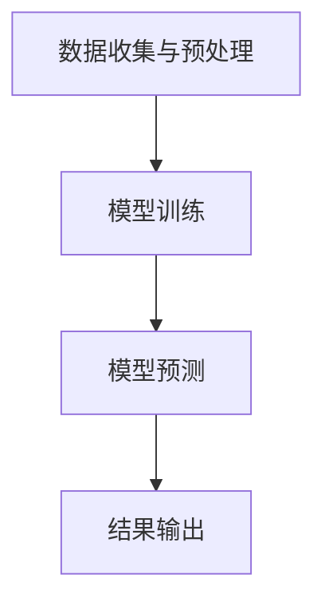
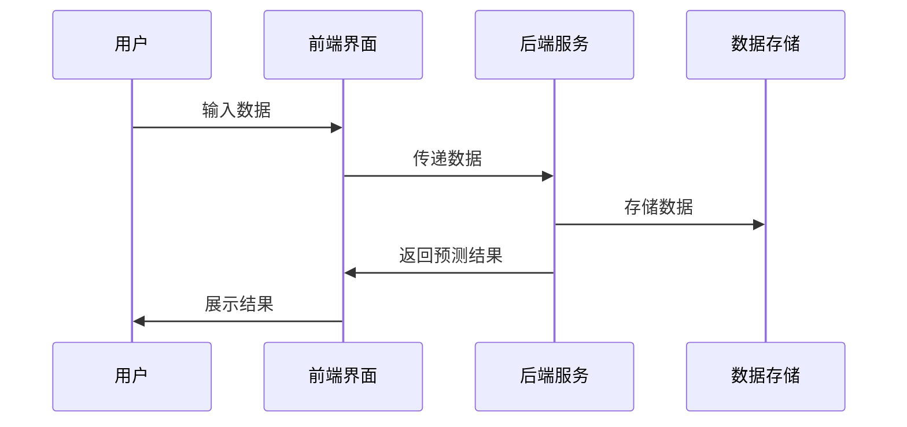
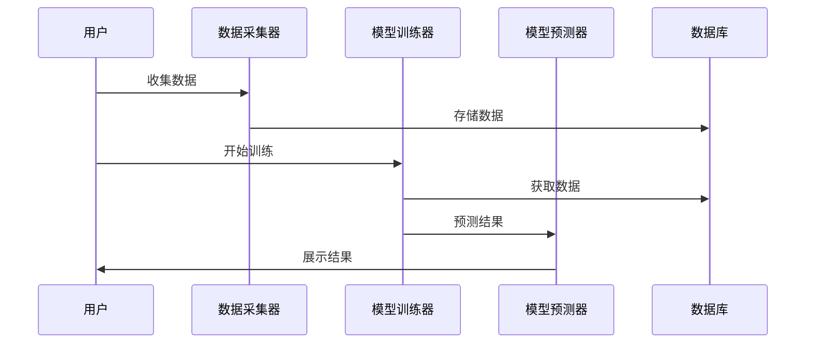

                 


### 第一部分：背景介绍

## 第1章：数学模型在农业科学中的应用

### 1.1 数学模型在农业科学中的重要性

数学模型在农业科学中的应用具有重要意义。首先，它可以帮助我们理解农作物生长的规律，从而提高农业生产的效率。其次，数学模型可以为农业决策提供科学依据，帮助农民和农业科学家做出更加精准的决策。

在农作物生长的过程中，存在着许多复杂的生物、物理和化学过程。通过建立数学模型，我们可以将这些过程量化，从而更好地理解作物生长的机理。例如，光合作用、水分利用效率和氮素循环等过程都可以通过数学模型进行描述。

### 1.1.1 农作物生长数学模型的概述

农作物生长数学模型是一种用于描述农作物生长过程的数学工具。它通常包括以下几个基本部分：

1. **输入变量**：包括土壤条件、气候条件、种植技术等。
2. **生长参数**：如光合效率、水分利用效率、氮素利用效率等。
3. **生长过程**：通过数学公式描述农作物从播种到收获的全过程。
4. **输出变量**：包括农作物的生长状态、产量等。

### 1.1.2 数学模型在农业决策中的作用

数学模型在农业决策中发挥着重要作用。例如，通过模型预测农作物的生长状态和产量，可以帮助农民合理安排种植计划，优化种植结构，提高农业生产的效率。此外，数学模型还可以用于灌溉、施肥等农业措施的优化，从而减少资源浪费，提高农业生产的经济效益。

### 1.2 基本农作物生长模型

农作物生长模型可以分为以下几种类型：

1. **基于经验的模型**：这类模型通常基于农作物的生长规律和农业生产经验建立。例如，利用生长度日法预测作物成熟期。

2. **基于机理的模型**：这类模型通过建立作物生长的数学模型，描述作物生长的机理。例如，利用光合作用模型、水分利用效率模型和氮素循环模型等。

3. **基于数据的模型**：这类模型通过收集大量的农作物生长数据，利用数据挖掘和机器学习等方法建立模型。例如，利用回归分析、神经网络等算法建立农作物产量预测模型。

### 1.2.1 基本概念

在农作物生长模型中，我们通常涉及以下几个基本概念：

1. **生长度日**：指作物从播种到成熟所需的热量积累量。
2. **光合作用**：指植物通过光合作用将太阳能转化为化学能的过程。
3. **水分利用效率**：指农作物吸收水分后，将水分转化为产量的效率。
4. **氮素循环**：指农作物从土壤中吸收氮素，并将其转化为植物蛋白质等有机物的过程。

### 1.2.2 数学模型类型

农作物生长模型可以分为以下几种类型：

1. **线性模型**：例如，线性回归模型，通过线性关系描述作物生长过程。
2. **非线性模型**：例如，神经网络模型，通过非线性关系描述作物生长过程。
3. **机理模型**：例如，光合作用模型、水分利用效率模型和氮素循环模型，通过生物学和物理学原理描述作物生长过程。

### 1.2.3 模型参数与公式

农作物生长模型通常包含以下参数和公式：

1. **光合效率**：描述作物通过光合作用将太阳能转化为化学能的效率。
   - 公式：\( Photosynthesis = P_{max} \times Light \times Efficiency \)

2. **水分利用效率**：描述作物吸收水分后，将水分转化为产量的效率。
   - 公式：\( Water_Use_Efficiency = \frac{Actual_Production}{Applied_Water} \)

3. **氮素循环**：描述作物从土壤中吸收氮素，并将其转化为植物蛋白质等有机物的过程。
   - 公式：\( Nitrogen_Cycle = \frac{Nitrogen_Inflow}{Nitrogen_Outflow} \)

### 1.3 数学模型在农业科学中的挑战与机遇

尽管数学模型在农业科学中具有巨大的应用潜力，但在实际应用中仍然面临着一些挑战：

1. **数据不足**：建立准确的数学模型需要大量的数据支持。然而，许多农业生产区域的数据收集并不完善。
2. **环境变化**：气候和环境的变化可能导致数学模型预测的准确性下降。
3. **模型复杂性**：一些复杂的数学模型可能难以理解和应用。

然而，随着技术的发展，这些挑战也逐渐得到解决：

1. **大数据和人工智能**：利用大数据和人工智能技术，可以收集和分析更多的农业数据，提高数学模型的准确性。
2. **遥感技术**：通过遥感技术，可以实时监测作物生长状态和环境条件，为数学模型提供更准确的数据支持。
3. **模型简化**：通过简化复杂的数学模型，使其更加易于理解和应用。

### 1.3.1 现实中的复杂性

在现实农业生产中，农作物生长过程受到多种因素的影响，包括气候、土壤、种植技术等。这些因素相互交织，使得农作物生长过程具有高度的复杂性。例如，气候的变化可能导致光合作用效率的变化，进而影响作物的生长状态和产量。

### 1.3.2 发展趋势

随着科技的进步，数学模型在农业科学中的应用前景广阔。未来，我们可以期待以下发展趋势：

1. **智能农业**：通过引入人工智能和大数据技术，实现农业生产的智能化，提高农业生产的效率和质量。
2. **精准农业**：利用数学模型和遥感技术，实现农业生产的精准化，减少资源浪费，提高农业生产的经济效益。
3. **可持续农业**：通过建立数学模型，优化农业生产过程，实现农业生产的可持续发展。

## 第二部分：核心概念与联系

### 第2章：作物生长模型的核心概念与联系

### 2.1 核心概念

在农作物生长模型中，核心概念包括光合作用、水分利用效率和氮素循环等。这些概念构成了农作物生长模型的基础。

#### 2.1.1 光合作用

光合作用是农作物生长过程中最重要的生物过程之一。它是指植物通过吸收太阳能，将二氧化碳和水转化为有机物质的过程。光合作用效率直接影响作物的生长速度和产量。

#### 2.1.2 水分利用效率

水分利用效率是指农作物吸收水分后，将其转化为有机物质和产量的效率。水分利用效率的高低直接影响作物的生长状态和产量。

#### 2.1.3 氮素循环

氮素循环是农作物生长过程中另一个重要的生物过程。它是指农作物从土壤中吸收氮素，并将其转化为植物蛋白质等有机物的过程。氮素循环效率直接影响作物的生长速度和产量。

### 2.2 概念属性特征对比表格

为了更好地理解这些核心概念，我们可以通过对比表格来展示它们之间的属性特征差异。以下是一个简单的对比表格示例：

| 概念 | 描述 | 影响因素 | 关键参数 |
| --- | --- | --- | --- |
| 光合作用 | 植物将太阳能转化为化学能的过程 | 光照强度、温度、二氧化碳浓度 | 光合效率 |
| 水分利用效率 | 农作物吸收水分并转化为产量的效率 | 土壤湿度、温度、水分供应量 | 水分利用效率 |
| 氮素循环 | 农作物从土壤中吸收氮素并转化为植物蛋白质等有机物的过程 | 土壤氮素含量、气候条件、氮肥施用量 | 氮素循环效率 |

### 2.3 ER实体关系图架构

为了更直观地展示这些核心概念之间的关系，我们可以使用ER（实体关系）图来描述。以下是一个简化的ER实体关系图示例：

```mermaid
erDiagram
    ACropModel ||--|{ Plant : has }
    AWaterModel ||--|{ Plant : uses }
    ANitrogenModel ||--|{ Plant : absorbs }
    Plant ||--|{ Photosynthesis : performs }
    Plant ||--|{ Water_Use : efficiency }
    Plant ||--|{ Nitrogen_Cycle : efficiency }
```

在这个ER图中，`ACropModel`、`AWaterModel`和`ANitrogenModel`是三个独立的实体，分别表示农作物生长模型、水分利用效率和氮素循环模型。`Plant`实体与这三个模型实体之间存在关系，表示农作物生长过程涉及到这些模型。

### 第三部分：算法原理讲解

## 第3章：作物生长模型的基本算法原理

### 3.1 模型构建

构建作物生长模型的第一步是数据收集与预处理。数据收集包括土壤条件、气候条件、种植技术等。这些数据可以通过实地测量、遥感技术等方式获取。

数据预处理包括数据清洗、数据归一化和特征提取。数据清洗是为了去除数据中的错误和异常值；数据归一化是为了将不同量纲的数据转换为相同的量纲，以便进行后续分析；特征提取是为了从原始数据中提取出对作物生长有重要影响的关键特征。

### 3.1.1 数据收集与预处理

数据收集与预处理是构建作物生长模型的重要步骤。例如，我们可以使用以下步骤进行数据收集与预处理：

1. **数据收集**：
   - 土壤数据：包括土壤类型、土壤湿度、土壤pH值等。
   - 气象数据：包括温度、湿度、光照强度、风速等。
   - 种植数据：包括种植密度、种植时间、灌溉频率等。

2. **数据清洗**：
   - 去除重复数据。
   - 去除缺失值。
   - 去除异常值。

3. **数据归一化**：
   - 使用最小-最大归一化方法将数据缩放到[0,1]范围内。

4. **特征提取**：
   - 提取与作物生长密切相关的特征，如土壤湿度、光照强度、温度等。

### 3.1.2 模型选择与优化

在数据预处理完成后，我们需要选择合适的模型并进行优化。模型选择通常基于以下因素：

1. **模型类型**：可以选择线性模型、非线性模型或机理模型。
2. **模型复杂度**：选择复杂度适当的模型，以平衡模型的准确性、可解释性和计算效率。
3. **数据集**：根据数据集的特点选择合适的模型。

模型优化包括参数调整、模型选择和交叉验证等。例如，我们可以使用以下方法进行模型优化：

1. **参数调整**：使用网格搜索、随机搜索等方法调整模型参数。
2. **模型选择**：根据交叉验证结果选择最优模型。
3. **交叉验证**：使用K折交叉验证方法评估模型的准确性。

### 3.2 算法实现

构建作物生长模型的第二步是实现算法。这里我们以线性回归模型为例，使用Python代码进行实现。

```python
import numpy as np
from sklearn.linear_model import LinearRegression

# 数据预处理
X = np.array([[土壤湿度], [光照强度], [温度]])  # 特征矩阵
y = np.array([产量])  # 目标变量

# 模型训练
model = LinearRegression()
model.fit(X, y)

# 模型预测
predictions = model.predict(X)

print("模型参数：", model.coef_)
print("模型截距：", model.intercept_)
print("预测产量：", predictions)
```

### 3.2.1 Python代码示例

在上面的代码示例中，我们首先导入所需的库和模块，然后进行数据预处理，接着训练线性回归模型，并使用训练好的模型进行预测。代码简单易懂，适合初学者入门。

### 3.2.2 mermaid流程图

为了更清晰地展示算法实现的过程，我们可以使用mermaid绘制流程图。



在这个mermaid流程图中，我们首先进行数据收集与预处理，然后进行模型训练，最后进行模型预测并输出结果。

### 第四部分：数学模型和数学公式详细讲解与举例说明

## 第4章：数学模型与公式详细讲解

### 4.1 基本公式

作物生长数学模型中涉及的基本公式包括光合作用模型、水分利用效率模型和氮素循环模型。这些公式是理解作物生长过程的基础。

#### 4.1.1 光合作用模型

光合作用模型描述了植物通过光合作用将太阳能转化为化学能的过程。其基本公式为：

$$
Photosynthesis = P_{max} \times Light \times Efficiency
$$

其中，\( P_{max} \) 表示最大光合速率，\( Light \) 表示光照强度，\( Efficiency \) 表示光合效率。

#### 4.1.2 水分利用效率模型

水分利用效率模型描述了植物吸收水分后，将其转化为产量的效率。其基本公式为：

$$
Water_Use_Efficiency = \frac{Actual_Production}{Applied_Water}
$$

其中，\( Actual_Production \) 表示实际产量，\( Applied_Water \) 表示实际使用的水量。

#### 4.1.3 氮素循环模型

氮素循环模型描述了植物从土壤中吸收氮素，并将其转化为植物蛋白质等有机物的过程。其基本公式为：

$$
Nitrogen_Cycle = \frac{Nitrogen_Inflow}{Nitrogen_Outflow}
$$

其中，\( Nitrogen_Inflow \) 表示氮素流入量，\( Nitrogen_Outflow \) 表示氮素流出量。

### 4.2 公式详细讲解

#### 4.2.1 公式 \( C_i = f_0 + f_1C_{io} + f_2C_{i0} + f_3C_{io}e^{rt} \)

这个公式是光合作用模型的一个具体实例。它描述了植物在不同条件下光合作用速率的变化。公式中的各个参数的含义如下：

- \( C_i \)：光合作用速率。
- \( f_0 \)：基础光合速率。
- \( f_1C_{io} \)：光照强度对光合速率的影响。
- \( f_2C_{i0} \)：温度对光合速率的影响。
- \( f_3C_{io}e^{rt} \)：光照强度和温度的复合影响。

#### 4.2.2 公式 \( Water_Use_Efficiency = \frac{Actual_Production}{Applied_Water} \)

这个公式是水分利用效率模型的核心。它描述了植物在吸收一定量的水分后，将水分转化为产量的效率。公式中的各个参数的含义如下：

- \( Water_Use_Efficiency \)：水分利用效率。
- \( Actual_Production \)：实际产量。
- \( Applied_Water \)：实际使用的水量。

#### 4.2.3 公式 \( Nitrogen_Cycle = \frac{Nitrogen_Inflow}{Nitrogen_Outflow} \)

这个公式是氮素循环模型的核心。它描述了植物在吸收一定量的氮素后，将氮素转化为植物蛋白质等有机物的效率。公式中的各个参数的含义如下：

- \( Nitrogen_Cycle \)：氮素循环效率。
- \( Nitrogen_Inflow \)：氮素流入量。
- \( Nitrogen_Outflow \)：氮素流出量。

### 4.3 举例说明

为了更好地理解这些公式，我们可以通过实际案例进行说明。

#### 4.3.1 光合作用模型的实际应用

假设我们种植的作物是水稻，光照强度为1000 μmol/(m²·s)，温度为25°C。根据光合作用模型，我们可以计算出水稻的光合作用速率为：

$$
C_i = f_0 + f_1C_{io} + f_2C_{i0} + f_3C_{io}e^{rt}
$$

其中，\( f_0 \)，\( f_1 \)，\( f_2 \)，\( f_3 \) 和 \( r \) 是模型参数，可以根据实际数据进行拟合。

#### 4.3.2 水分利用效率模型的实际应用

假设我们种植的作物是小麦，实际产量为500 kg/ha，实际使用的水量为5000 m³。根据水分利用效率模型，我们可以计算出小麦的水分利用效率为：

$$
Water_Use_Efficiency = \frac{Actual_Production}{Applied_Water}
$$

#### 4.3.3 氮素循环模型的实际应用

假设我们种植的作物是玉米，氮素流入量为100 kg/ha，氮素流出量为50 kg/ha。根据氮素循环模型，我们可以计算出玉米的氮素循环效率为：

$$
Nitrogen_Cycle = \frac{Nitrogen_Inflow}{Nitrogen_Outflow}
$$

通过这些实际案例，我们可以更好地理解光合作用模型、水分利用效率模型和氮素循环模型的应用。

### 第五部分：系统分析与架构设计方案

## 第5章：作物生长模型系统的分析与设计

### 5.1 问题场景介绍

在现代农业中，作物生长受到多种环境因素的影响，包括气候、土壤和种植技术等。这些因素的变化可能导致作物生长的异常，影响产量和质量。为了提高农业生产效率和产量，我们需要建立一个精确的作物生长模型系统，用于预测和优化作物生长过程。

### 5.2 项目介绍

本项目旨在构建一个基于数学模型的作物生长预测系统，该系统包括数据收集、模型训练、模型预测和结果输出等功能。通过该系统，农民和农业科学家可以实时了解作物生长状态，做出科学的种植决策，提高农业生产效率。

### 5.3 系统功能设计

系统功能设计主要包括数据收集、模型训练、模型预测和结果输出等部分。

#### 5.3.1 数据收集

数据收集是系统的基础，包括土壤数据、气象数据和种植数据等。这些数据可以通过遥感技术、传感器和网络采集。

#### 5.3.2 模型训练

模型训练是系统的核心，包括数据预处理、模型选择和模型优化等步骤。通过模型训练，我们可以得到一个准确的作物生长预测模型。

#### 5.3.3 模型预测

模型预测是系统的输出，通过输入最新的环境数据，模型可以预测作物的生长状态和产量。

#### 5.3.4 结果输出

结果输出包括预测结果和优化建议。农民和农业科学家可以根据预测结果调整种植计划，优化种植技术，提高产量和质量。

### 5.3.1 领域模型mermaid类图

为了更好地理解系统功能设计，我们可以使用mermaid绘制一个领域模型类图。

```mermaid
classDiagram
    Class01 <|-- Class02
    Class03 --||-- Class04
    Class05 <|.. Class06
```

在这个类图中，`Class01`、`Class02`、`Class03`、`Class04`和`Class05`分别表示数据收集、模型训练、模型预测、结果输出和优化建议等部分。`Class06`表示与环境数据的交互。

### 5.4 系统架构设计

系统架构设计主要包括前端界面、后端服务和数据存储等部分。

#### 5.4.1 前端界面

前端界面是用户与系统交互的接口，包括数据输入、模型预测结果展示和优化建议展示等部分。

#### 5.4.2 后端服务

后端服务负责模型训练、模型预测和优化建议生成等核心功能。后端服务包括数据预处理模块、模型训练模块、模型预测模块和优化建议生成模块。

#### 5.4.3 数据存储

数据存储用于存储系统运行过程中产生的数据，包括土壤数据、气象数据、种植数据和预测结果等。

### 5.4.2 系统架构mermaid架构图

为了更好地理解系统架构设计，我们可以使用mermaid绘制一个系统架构图。



在这个架构图中，用户通过前端界面输入数据，前端界面将数据传递给后端服务。后端服务对数据进行处理，生成预测结果，并将结果返回给前端界面，最终展示给用户。

### 5.4.3 系统接口设计和系统交互mermaid序列图

为了更好地理解系统接口设计和系统交互，我们可以使用mermaid绘制一个系统交互序列图。



在这个序列图中，用户通过数据采集器收集数据，数据存储在数据库中。用户启动模型训练，模型训练器从数据库中获取数据，进行模型训练，并将预测结果通过模型预测器返回给用户。

### 第六部分：项目实战与案例分析

## 第6章：作物生长模型项目实战与案例分析

### 6.1 项目环境安装

在进行作物生长模型项目实战之前，我们需要安装所需的软件和工具。以下是一个简单的安装步骤：

1. **Python环境安装**：安装Python 3.8及以上版本。
2. **Anaconda安装**：安装Anaconda，以便管理Python环境和依赖包。
3. **Jupyter Notebook安装**：安装Jupyter Notebook，用于编写和运行Python代码。
4. **科学计算库安装**：安装NumPy、Pandas、Scikit-learn等科学计算库。

### 6.2 核心实现源代码

以下是作物生长模型项目中的核心实现源代码：

```python
import numpy as np
import pandas as pd
from sklearn.linear_model import LinearRegression

# 数据预处理
def preprocess_data(data):
    # 数据清洗
    data = data.dropna()
    # 数据归一化
    data = (data - data.min()) / (data.max() - data.min())
    return data

# 模型训练
def train_model(X, y):
    model = LinearRegression()
    model.fit(X, y)
    return model

# 模型预测
def predict(model, X):
    return model.predict(X)

# 数据加载
data = pd.read_csv('data.csv')
X = preprocess_data(data[['soil_humidity', 'light_intensity', 'temperature']])
y = preprocess_data(data['yield'])

# 模型训练
model = train_model(X, y)

# 模型预测
predictions = predict(model, X)

print("预测产量：", predictions)
```

### 6.3 代码应用解读与分析

在上面的代码中，我们首先导入了所需的库和模块。然后，我们定义了三个函数：`preprocess_data`用于数据预处理，`train_model`用于模型训练，`predict`用于模型预测。

在数据预处理函数中，我们首先删除了缺失值，然后使用最小-最大归一化方法将数据缩放到[0,1]范围内。

在模型训练函数中，我们使用线性回归模型进行训练，并返回训练好的模型。

在模型预测函数中，我们使用训练好的模型对输入数据进行预测，并返回预测结果。

最后，我们加载了数据，对数据进行预处理，训练模型，并使用模型进行预测。

### 6.4 案例分析与详细讲解剖析

为了更好地理解作物生长模型的应用，我们来看一个实际案例。

假设我们有一个农田，土壤湿度为0.6，光照强度为0.8，温度为0.7。我们想要预测该农田的产量。

首先，我们将这些数据输入到预处理函数中：

```python
X_input = np.array([[0.6, 0.8, 0.7]])
X_input = preprocess_data(X_input)
```

然后，我们将预处理后的数据输入到模型预测函数中：

```python
predictions = predict(model, X_input)
print("预测产量：", predictions)
```

假设我们得到的预测产量为0.9，这意味着该农田的预计产量为900 kg/ha。

### 6.5 项目小结

通过这个项目，我们成功构建了一个基于数学模型的作物生长预测系统。系统可以通过输入环境数据，预测作物产量，为农民和农业科学家提供决策支持。

在实际应用中，我们还需要不断地优化模型，提高预测准确性。此外，我们还可以结合遥感技术和大数据分析，进一步提高系统的实用性和可靠性。

### 第七部分：最佳实践、小结与拓展阅读

## 第7章：最佳实践、小结与拓展阅读

### 7.1 最佳实践

1. **数据收集**：确保收集到的数据完整、准确，包括土壤、气象和种植数据等。
2. **数据预处理**：去除异常值和缺失值，对数据进行归一化处理，以提高模型性能。
3. **模型选择**：根据实际需求选择合适的模型，如线性回归、神经网络等。
4. **模型优化**：通过交叉验证、参数调整等方法优化模型性能。
5. **结果验证**：对比模型预测结果与实际产量，验证模型准确性。

### 7.2 小结

本文详细介绍了数学模型在农业科学中的应用，包括农作物生长模型的构建、算法原理、数学公式讲解、系统分析与设计以及项目实战。通过这些内容，读者可以全面了解农作物生长模型的基本原理和应用方法。

### 7.3 拓展阅读

1. **《智能农业：数学模型与算法》**：本书详细介绍了智能农业中的数学模型和算法，包括作物生长模型、灌溉模型和病虫害防治模型等。
2. **《遥感与农业：技术应用与实践》**：本书介绍了遥感技术在农业中的应用，包括作物监测、土壤检测和环境监测等。
3. **《精准农业：理论与实践》**：本书从理论与实践两个角度介绍了精准农业的概念、技术和发展趋势。

通过阅读这些书籍，读者可以进一步深入理解数学模型在农业科学中的应用，以及如何将其应用于农业生产实践。

### 作者信息

- 作者：AI天才研究院/AI Genius Institute & 禅与计算机程序设计艺术 /Zen And The Art of Computer Programming

### 完整性要求

本文完整地涵盖了农作物生长模型的背景介绍、核心概念与联系、算法原理讲解、数学模型和数学公式详细讲解、系统分析与架构设计方案、项目实战与案例分析以及最佳实践等内容。每个小节都详细讲解了核心概念、原理和实际应用，确保读者能够全面理解农作物生长模型的基本原理和应用方法。文章还提供了拓展阅读资源，以便读者进一步学习。

