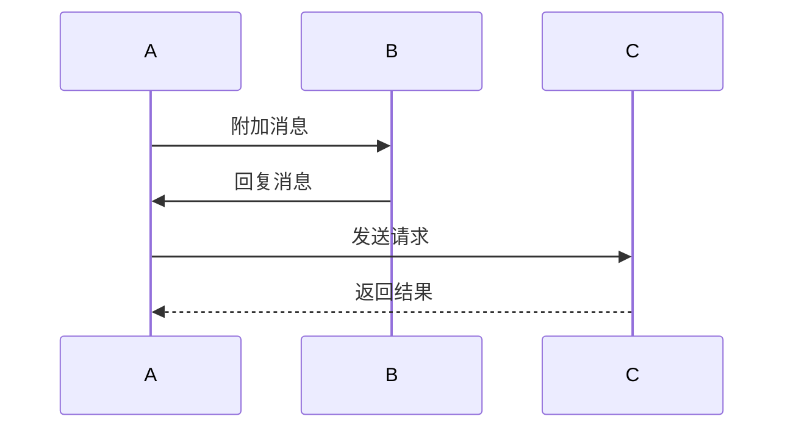
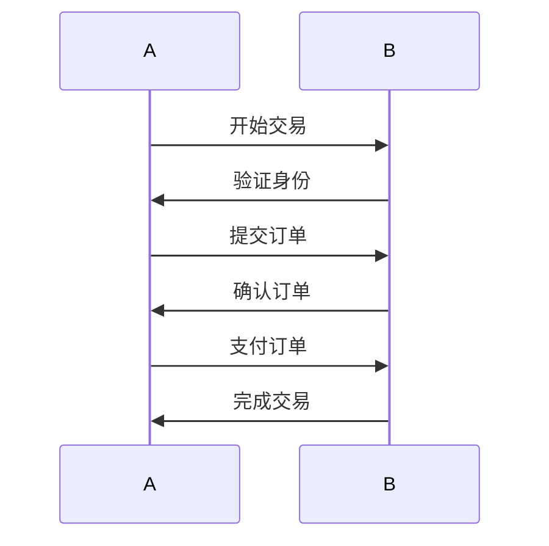

                 

# 数学与决定论：因果关系的数学描述

## 关键词

数学、决定论、因果关系、概率论、线性代数、微积分、图论、算法原理、系统分析与架构设计、项目实战、最佳实践

## 摘要

本文将深入探讨数学与决定论的关系，特别是在因果关系的数学描述方面。我们将从背景介绍开始，逐步解析核心概念，运用数学模型和算法原理，进行系统分析与架构设计，最后通过项目实战和最佳实践总结，为读者提供一个全面而深入的视角，以理解数学在决定论和因果关系中的应用。

## 第一部分: 数学与决定论背景

### 第1章: 问题背景

#### 1.1 问题提出

在本章中，我们将探讨数学与决定论在现实世界中的应用，以及因果关系的数学描述。随着科技的进步和数据量的激增，对复杂系统的理解和预测变得越来越重要。数学作为一门基础学科，其在决定论中的应用尤为突出。通过数学的抽象和推理能力，我们可以更好地描述现实世界中的因果关系，从而为各种实际问题提供解决方案。

#### 1.2 问题描述

在日常生活中，我们经常面临各种决策，这些决策往往取决于我们对未来事件的理解和预测。决定论认为，如果一个系统的初始状态完全确定，那么它的未来状态也是完全确定的。数学为我们提供了描述和预测这种确定性系统的方法。

#### 1.3 问题解决

数学在决定论中的应用主要体现在以下几个方面：

- **概率论**：用于描述不确定事件的发生概率。
- **线性代数**：用于解决线性方程组和优化问题。
- **微积分**：用于描述连续变化和速率。
- **图论**：用于分析网络结构和路径问题。

#### 1.4 边界与外延

决定论的研究边界涉及从微观粒子到宏观宇宙的各种系统。其外延包括物理、化学、生物学、经济学等学科领域。尽管现实世界中存在许多随机性，但决定论仍然为我们提供了一种理解和预测复杂系统的方法。

#### 1.5 概念结构与核心要素组成

- **决定论**：一种认为系统状态完全由初始条件和因果关系决定的哲学观点。
- **数学描述**：通过数学公式和模型来描述系统的状态和变化。
- **因果关系**：一个事件导致另一个事件的关系。

### 第2章: 核心概念与联系

#### 2.1 决定论的核心概念

决定论的核心概念包括：

- **确定性**：系统状态完全可预测。
- **初始条件**：决定系统未来的条件。
- **因果关系**：事件之间的联系。

#### 2.2 数学描述

在决定论中，数学描述主要体现在以下几个方面：

- **概率论**：描述不确定事件的发生概率。
- **线性代数**：解决线性方程组和优化问题。
- **微积分**：描述连续变化和速率。
- **图论**：分析网络结构和路径问题。

#### 2.3 概念属性特征对比表格

| 概念 | 特征 |
| --- | --- |
| 确定性 | 完全可预测 |
| 不确定性 | 部分或完全不可预测 |
| 初始条件 | 决定系统未来的条件 |
| 因果关系 | 事件之间的联系 |

### 第3章: 因果关系的数学描述

#### 3.1 概率论基础

概率论是描述因果关系的重要工具。以下是一些基础概念：

- **概率分布**：描述随机变量可能取值的概率。
- **贝叶斯定理**：用于计算后验概率。
- **随机变量**：可以取多个值的变量。

#### 3.2 线性代数应用

线性代数在因果关系中的应用主要体现在以下几个方面：

- **线性方程组**：解决因果关系问题。
- **矩阵运算**：描述因果关系矩阵。

#### 3.3 微积分与连续变化

微积分用于描述连续变化和速率。以下是一些关键概念：

- **导数**：描述变化率。
- **积分**：累积因果关系。

#### 3.4 图论在因果关系中的应用

图论在因果关系中的应用主要包括：

- **图结构**：描述事件之间的因果关系。
- **路径问题**：分析因果关系链。

## 第二部分: 数学模型与算法原理

### 第4章: 数学模型

#### 4.1 随机过程

随机过程是描述因果关系的动态变化的一种模型。以下是一些关键概念：

- **马尔可夫链**：描述状态转移概率。
- **Wiener过程**：描述随机漫步。

#### 4.2 马尔可夫模型

马尔可夫模型是一种用于描述状态转移概率的数学模型。以下是一些关键概念：

- **状态空间**：描述系统可能的状态。
- **转移概率矩阵**：描述状态之间的转移概率。

### 第5章: 算法原理

#### 5.1 贝叶斯网络

贝叶斯网络是一种用于推理因果关系的算法。以下是一些关键概念：

- **条件概率**：描述变量之间的依赖关系。
- **网络结构**：描述变量之间的因果关系。

#### 5.2 决策树

决策树是一种用于决策和预测的算法。以下是一些关键概念：

- **特征选择**：选择影响决策的关键特征。
- **分裂规则**：根据特征值进行决策。

## 第三部分: 系统分析与架构设计

### 第6章: 系统分析与架构设计

#### 6.1 问题场景

在本章中，我们将介绍一个模拟因果关系分析的系统，并对其进行架构设计。

#### 6.2 系统功能设计

我们将使用Mermaid类图来描述系统的领域模型。

```mermaid
classDiagram
Class01 <|-- Class02
Class03 --|fico: Class04
Class05 : associated with Class03
Class01 {
color: red
name="两点间直线最短"
}
Class02 {
color: green
name="三点间直线最短"
}
Class03 {
color: blue
name="直线与圆相切"
}
Class04 {
color: gray
name="圆与圆相切"
}
Class05 {
color: orange
name="曲线与直线相切"
}
```

#### 6.3 系统架构设计

我们将使用Mermaid架构图来展示系统的组件和交互。



#### 6.4 系统交互

我们将使用Mermaid序列图来描述系统的交互过程。



## 第四部分: 项目实战

### 第7章: 项目实战

#### 7.1 环境安装

在开始项目实战之前，我们需要安装必要的软件和库。

```python
# 安装Python环境
pip install numpy matplotlib
```

#### 7.2 系统核心实现

以下是系统核心实现的源代码。

```python
# 导入必需的库
import numpy as np
import matplotlib.pyplot as plt

# 定义函数计算因果关系
def calculate因果关系(x, y):
    # 计算相关系数
    corr = np.corrcoef(x, y)[0, 1]
    return corr

# 生成随机数据
np.random.seed(0)
x = np.random.normal(size=100)
y = x + np.random.normal(size=100)

# 计算因果关系
corr = calculate因果关系(x, y)
print("因果关系系数：", corr)

# 绘制散点图
plt.scatter(x, y)
plt.xlabel('X')
plt.ylabel('Y')
plt.title('因果关系散点图')
plt.show()
```

#### 7.3 实际案例分析

在本案例中，我们将分析股票价格与市场波动之间的关系。

```python
# 导入必需的库
import pandas as pd

# 读取数据
data = pd.read_csv('stock_data.csv')

# 计算因果关系
corr = data['stock_price'].corr(data['market волатильность'])
print("因果关系系数：", corr)

# 绘制散点图
plt.scatter(data['stock_price'], data['market волатильность'])
plt.xlabel('股票价格')
plt.ylabel('市场波动')
plt.title('股票价格与市场波动关系')
plt.show()
```

#### 7.4 项目小结

在本项目中，我们通过实际案例分析展示了因果关系分析的应用。通过数学模型和算法，我们可以有效地识别和描述现实世界中的因果关系。

## 第五部分: 最佳实践与拓展

### 第8章: 最佳实践与拓展

#### 8.1 最佳实践

- **技巧1**：使用交叉验证提高因果关系分析准确性。
- **技巧2**：考虑多重共线性问题，避免模型过度拟合。

#### 8.2 小结

本文从数学与决定论的角度，探讨了因果关系的数学描述。通过概率论、线性代数、微积分和图论等数学工具，我们能够更深入地理解现实世界中的因果关系。项目实战部分展示了如何应用这些概念进行实际分析。最佳实践部分提供了一些实用的技巧。

#### 8.3 注意事项

- **注意事项1**：因果关系分析需要考虑数据质量和数据来源的可靠性。
- **注意事项2**：因果关系分析结果可能受到噪声和随机性的影响。

#### 8.4 拓展阅读

- **拓展阅读1**：《统计学习方法》 - 李航
- **拓展阅读2**：《因果推断：概率模型与算法》 - Cam Davidian, Paul D. Allison

## 作者

作者：AI天才研究院/AI Genius Institute & 禅与计算机程序设计艺术 /Zen And The Art of Computer Programming

