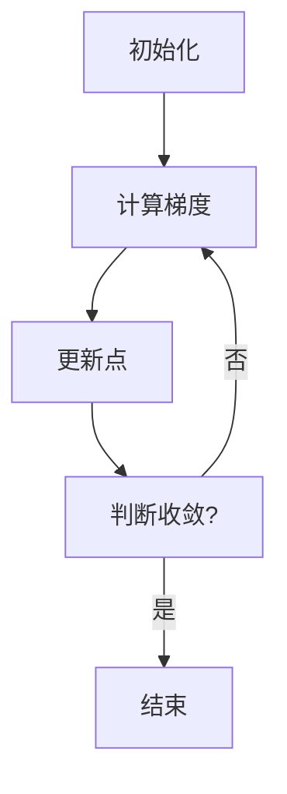
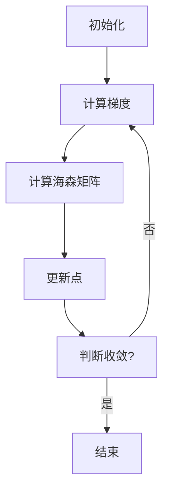
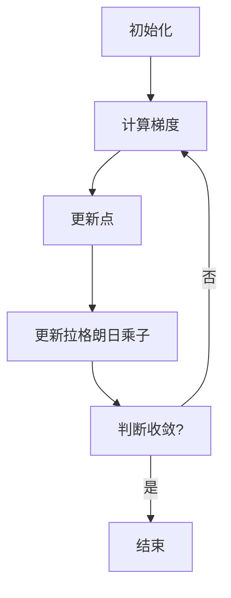
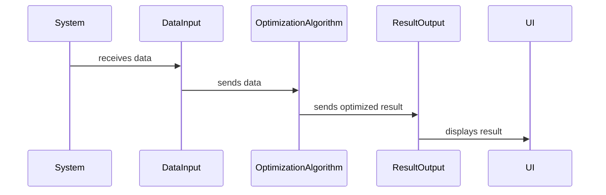
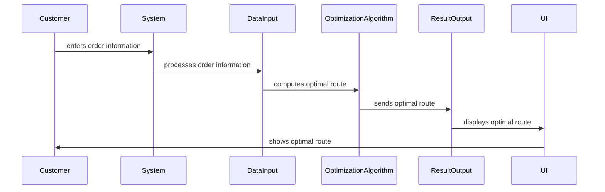

                 

# 数学与决策理论：最优化的数学方法

## 关键词
- 数学优化理论
- 最优化问题
- 线性规划
- 非线性规划
- 梯度下降法

## 摘要
本文旨在系统介绍最优化的数学方法，探讨数学与决策理论在解决复杂问题中的应用。文章首先介绍了数学优化理论的背景和核心概念，随后深入讲解了线性规划和非线性规划的概念、特征及其应用。接着，本文详细阐述了梯度下降法等优化算法的原理，通过数学模型和Python代码实现，使读者能够更好地理解这些算法。此外，文章还涉及优化问题的系统分析与架构设计，以及实际项目中的应用实践。通过本文的阅读，读者将掌握优化问题的基本原理和方法，为未来在相关领域的应用打下坚实基础。

## 引言

### 数学与决策理论的背景

数学与决策理论作为现代科学研究和工程实践中的核心分支，其重要性不言而喻。随着科学技术的发展，复杂系统和社会问题日益增多，如何在这些复杂环境中做出科学合理的决策成为了一个迫切需要解决的问题。数学与决策理论为我们提供了一种系统化、量化的方法来分析和解决这些决策问题。

数学优化理论是数学与决策理论的重要组成部分。它通过建立数学模型，运用数学方法，对问题进行建模和分析，从而得到最优解或近似最优解。这种优化方法在多个领域如经济学、工程学、计算机科学和运筹学中发挥着关键作用。

在经济学中，优化方法用于资源分配、市场分析等。例如，通过线性规划方法，可以优化生产计划，降低成本，提高效率。在工程学中，优化方法用于设计、制造、控制等环节，以实现最优性能。在计算机科学中，优化方法广泛应用于算法设计、网络优化、数据库查询等。

本文的目标是系统介绍最优化的数学方法，帮助读者深入理解数学与决策理论在解决复杂问题中的关键作用。通过本文的学习，读者将掌握数学优化理论的基本概念、方法和应用技巧，为未来在相关领域的深入研究和工作实践打下坚实基础。

### 数学优化理论的核心概念

数学优化理论的核心概念包括最优化问题、目标函数、约束条件和变量集合。

**最优化问题**：最优化问题是一类数学问题，它涉及在满足一定约束条件下，寻找目标函数的最优解。最优化问题可以分为线性规划和非线性规划两大类。

**目标函数**：目标函数表示决策者希望达到的目标。在优化问题中，目标函数通常是一个实值函数，其值需要被最小化或最大化。

**约束条件**：约束条件表示决策者在决策过程中需要遵守的限制条件。约束条件可以是线性的，也可以是非线性的。

**变量集合**：变量集合表示决策者可以控制的因素。在优化问题中，变量集合中的变量需要满足约束条件，以便找到最优解。

数学优化理论通过建立数学模型，将实际问题转化为最优化问题，然后运用数学方法求解最优解。这种方法不仅能够提供理论指导，还可以应用于实际问题中，为决策提供科学依据。

### 数学优化理论的应用领域

数学优化理论在多个领域有着广泛的应用，包括经济学、工程学、计算机科学和运筹学。

**经济学**：在经济学中，优化方法主要用于资源分配、市场分析等。例如，线性规划方法可以用于优化生产计划，降低成本，提高效率。非线性规划方法可以用于市场定价、投资组合优化等。

**工程学**：在工程学中，优化方法用于设计、制造、控制等环节。例如，优化方法可以用于优化产品设计，提高性能，降低成本。在制造过程中，优化方法可以用于生产计划、资源分配等。在控制系统中，优化方法可以用于系统调节、故障诊断等。

**计算机科学**：在计算机科学中，优化方法广泛应用于算法设计、网络优化、数据库查询等。例如，优化方法可以用于算法性能分析，寻找最优算法。在网络优化中，优化方法可以用于路由规划、负载均衡等。在数据库查询中，优化方法可以用于查询优化，提高查询效率。

**运筹学**：运筹学是一门应用数学的分支，它利用数学模型和优化方法来解决实际运营问题。例如，线性规划方法可以用于运输调度、库存控制等。非线性规划方法可以用于生产调度、资源分配等。

### 数学优化理论的发展历程

数学优化理论的发展可以追溯到19世纪末20世纪初。当时，数学家如拉格朗日、柯西等提出了优化问题的基本概念和方法。20世纪中期，随着计算机技术的发展，优化算法逐渐应用于实际问题中，推动了数学优化理论的发展。

在经济学中，线性规划方法得到了广泛应用。20世纪50年代，库恩和库克提出了单纯形法，成为线性规划的主要算法。20世纪60年代，邓肯提出了对偶单纯形法，进一步丰富了线性规划算法。

在工程学中，优化方法得到了广泛应用。20世纪50年代，哈蒙德提出了梯度下降法，用于求解无约束最优化问题。20世纪60年代，牛顿法、拉格朗日乘数法等优化算法得到了发展。

在计算机科学中，优化方法得到了广泛应用。20世纪70年代，贪心算法、动态规划等优化算法得到了广泛应用。20世纪80年代，遗传算法、模拟退火算法等新兴优化算法得到了发展。

### 数学优化理论的现状与未来发展趋势

当前，数学优化理论已经发展成为一个成熟的分支，广泛应用于各个领域。随着人工智能、大数据、物联网等技术的快速发展，数学优化理论在未来将继续发挥重要作用。

**现状**：当前，线性规划和非线性规划方法已经得到了广泛应用。例如，线性规划方法在物流调度、生产计划中发挥着关键作用。非线性规划方法在工程设计、市场分析中有着广泛应用。

**未来发展趋势**：未来，数学优化理论将在以下几个方面得到发展：

1. **算法复杂性**：随着问题规模的增大，优化算法的复杂性成为一个重要问题。未来，将出现更加高效的优化算法，以应对大规模复杂问题的求解。

2. **多目标优化**：在实际问题中，往往需要同时优化多个目标。多目标优化问题的研究将成为未来优化理论的重要方向。

3. **大数据优化**：随着大数据技术的快速发展，如何利用大数据进行优化将成为一个重要问题。未来，将出现基于大数据的优化算法。

4. **人工智能与优化**：人工智能与优化算法的结合将成为未来优化理论的一个重要方向。通过将人工智能技术应用于优化算法，可以进一步提高优化效率。

5. **跨学科研究**：数学优化理论将继续与其他学科交叉融合，如生物学、经济学、物理学等。跨学科研究将为优化理论提供新的视角和方法。

### 总结

数学与决策理论是现代科学研究和工程实践中的核心分支，它在经济学、工程学、计算机科学和运筹学等领域发挥着重要作用。通过本文的介绍，读者可以了解到数学优化理论的基本概念、方法和应用技巧。未来，随着人工智能、大数据等技术的发展，数学优化理论将继续发挥重要作用，为解决复杂问题提供科学依据。

## 第1章 问题背景

### 1.1 问题来源

在现代社会，决策无处不在。无论是个人生活中的购物选择、职业规划，还是企业运营中的生产计划、资源分配，都涉及大量的决策问题。这些决策问题往往复杂且具有不确定性，需要运用数学方法进行优化分析。

在经济学中，优化方法用于资源分配、市场分析等。例如，企业需要确定生产多少产品、如何定价以最大化利润。在工程学中，优化方法用于设计、制造、控制等。例如，工程师需要确定最优的材料选择、制造工艺等，以实现系统的最佳性能。在计算机科学中，优化方法用于算法设计、网络优化、数据库查询等。例如，算法需要找到最有效的搜索策略、网络需要找到最优的路由等。

### 1.2 问题描述

数学与决策理论主要研究如何运用数学方法来解决各种决策问题。这些问题通常可以抽象为优化问题，即在满足一定约束条件下，寻找目标函数的最优解。优化问题涵盖了广泛的领域，如线性规划、非线性规划、整数规划、动态规划等。

优化问题的基本形式可以表示为：

$$
\text{最大化/最小化} f(x)
$$

$$
\text{满足约束条件} g_i(x) \leq 0, h_j(x) = 0
$$

其中，$x$ 是变量集合，$f(x)$ 是目标函数，$g_i(x)$ 和 $h_j(x)$ 分别是约束条件。

### 1.3 问题解决

数学与决策理论提供了一系列优化方法，包括数学模型建立、目标函数求解、约束条件处理等。通过这些方法，我们可以得到最优解或近似最优解，为决策提供科学依据。

数学模型建立是将实际问题转化为数学问题的过程。这一过程需要分析问题的本质，提取关键变量和约束条件，建立相应的数学模型。

目标函数求解是优化问题的关键步骤。目标函数的求解方法有很多，如线性规划、非线性规划、整数规划等。这些方法各有优缺点，需要根据问题的具体情况进行选择。

约束条件处理是优化问题的另一个关键步骤。约束条件可以是线性的，也可以是非线性的。对于线性约束条件，可以使用单纯形法、内点法等求解；对于非线性约束条件，可以使用梯度下降法、牛顿法等求解。

通过数学与决策理论的方法，我们可以得到最优解或近似最优解，从而为决策提供科学依据。然而，优化问题往往具有复杂性和不确定性，求解过程可能涉及大量的计算和迭代。因此，在实际应用中，我们需要根据问题的具体情况进行优化方法的选择和调整。

### 1.4 边界与外延

优化问题的研究不仅限于数学领域，还广泛应用于经济学、工程学、计算机科学等领域。

在经济学中，优化方法用于资源分配、市场分析等。例如，线性规划方法可以用于优化生产计划，降低成本，提高效率。非线性规划方法可以用于市场定价、投资组合优化等。

在工程学中，优化方法用于设计、制造、控制等。例如，优化方法可以用于优化产品设计，提高性能，降低成本。在制造过程中，优化方法可以用于生产计划、资源分配等。在控制系统中，优化方法可以用于系统调节、故障诊断等。

在计算机科学中，优化方法广泛应用于算法设计、网络优化、数据库查询等。例如，优化方法可以用于算法性能分析，寻找最优算法。在网络优化中，优化方法可以用于路由规划、负载均衡等。在数据库查询中，优化方法可以用于查询优化，提高查询效率。

### 1.5 概念结构与核心要素组成

优化问题的核心要素包括：目标函数、约束条件、变量集合。

**目标函数**：目标函数表示决策者希望达到的目标。在优化问题中，目标函数通常是一个实值函数，其值需要被最小化或最大化。

**约束条件**：约束条件表示决策者在决策过程中需要遵守的限制条件。约束条件可以是线性的，也可以是非线性的。

**变量集合**：变量集合表示决策者可以控制的因素。在优化问题中，变量集合中的变量需要满足约束条件，以便找到最优解。

一个典型的优化问题可以表示为：

$$
\text{最大化} f(x)
$$

$$
\text{满足约束条件} g_i(x) \leq 0, h_j(x) = 0
$$

其中，$x$ 是变量集合，$f(x)$ 是目标函数，$g_i(x)$ 和 $h_j(x)$ 分别是约束条件。

### 1.6 优化问题实例

**例1.1：资源分配问题**

假设一个企业有 $m$ 种资源，需要分配给 $n$ 个部门，每个部门对资源的需求量不同。目标是最小化资源剩余量，同时满足各部门的资源需求。

目标函数：$f(x) = \sum_{i=1}^{m} \sum_{j=1}^{n} x_{ij} - \sum_{i=1}^{m} r_i$

约束条件：

$$
g_i(x) = \sum_{j=1}^{n} x_{ij} - r_i \leq 0, \forall i=1,2,...,m
$$

$$
h_j(x) = \sum_{i=1}^{m} x_{ij} = R_j, \forall j=1,2,...,n
$$

其中，$x_{ij}$ 表示第 $i$ 种资源分配给第 $j$ 个部门的数量，$r_i$ 表示第 $i$ 种资源的总量，$R_j$ 表示第 $j$ 个部门对资源的总需求量。

**例1.2：线性规划问题**

假设一个企业有 $m$ 种产品，每种产品的生产成本和利润不同。目标是最小化总成本，同时满足生产能力和市场需求。

目标函数：$f(x) = \sum_{i=1}^{m} c_i x_i$

约束条件：

$$
g_i(x) = \sum_{i=1}^{m} x_i \leq C
$$

$$
h_j(x) = \sum_{i=1}^{m} p_i x_i \geq D
$$

其中，$x_i$ 表示第 $i$ 种产品的生产数量，$c_i$ 表示第 $i$ 种产品的生产成本，$p_i$ 表示第 $i$ 种产品的利润，$C$ 表示总生产能力，$D$ 表示市场需求总量。

### 1.7 总结

本章介绍了优化问题的背景、描述、解决方法、边界与外延以及概念结构与核心要素组成。优化问题是现代科学研究和工程实践中的重要问题，它涉及数学、经济学、工程学、计算机科学等多个领域。通过本章的介绍，读者可以初步了解优化问题的基本概念和方法，为进一步学习数学优化理论打下基础。

## 第2章 核心概念与联系

### 2.1 最优化问题

最优化问题是数学中的一个重要研究领域，它涉及在满足一定约束条件下，寻找目标函数的最优解。最优化问题可以分为线性规划和非线性规划两大类。

#### 线性规划

线性规划是一种特殊的最优化问题，其中目标函数和约束条件都是线性的。线性规划广泛应用于资源分配、生产计划、物流调度等领域。

- **定义**：线性规划问题可以表示为：

  $$
  \text{最大化} c^T x
  $$
  
  $$
  \text{满足约束条件} Ax \leq b, x \geq 0
  $$

  其中，$c$ 是一个向量，表示目标函数的系数，$x$ 是变量向量，$A$ 是一个矩阵，表示约束条件的系数矩阵，$b$ 是一个向量，表示约束条件的右侧边界。

- **特点**：线性规划问题具有以下几个特点：
  - 目标函数和约束条件都是线性的。
  - 线性规划问题可以通过图解法、单纯形法、内点法等求解。
  - 线性规划问题的求解具有封闭形式的解法，如单纯形法。

- **应用场景**：线性规划在多个领域有广泛应用，如资源分配、生产计划、物流调度等。

#### 非线性规划

非线性规划是更一般的最优化问题，其中目标函数和约束条件可以是非线性的。非线性规划在工程学、经济学、生物学等领域具有广泛的应用。

- **定义**：非线性规划问题可以表示为：

  $$
  \text{最大化} f(x)
  $$
  
  $$
  \text{满足约束条件} g(x) \leq 0, h(x) = 0
  $$

  其中，$f(x)$ 是目标函数，$g(x)$ 和 $h(x)$ 分别是约束条件。

- **特点**：非线性规划问题具有以下几个特点：
  - 目标函数和约束条件可以是非线性的。
  - 非线性规划问题的求解通常比线性规划问题复杂，没有封闭形式的解法，需要使用迭代算法。
  - 非线性规划问题的求解可能涉及多个局部最优解。

- **应用场景**：非线性规划在多个领域有广泛应用，如工程设计、市场分析、生物学等。

### 2.2 概念属性特征对比表格

| 类别       | 定义                                                         | 特点                                                         | 应用场景         |
| ---------- | ------------------------------------------------------------ | ------------------------------------------------------------ | ---------------- |
| 线性规划   | 目标函数和约束条件都是线性的                                   | 算法简单，计算效率高                                         | 资源分配、生产计划、物流调度 |
| 非线性规划 | 目标函数和约束条件可以是非线性的                             | 算法复杂，计算效率较低                                     | 工程学、经济学、生物学 |

### 2.3 ER实体关系图架构

```mermaid
erDiagram
    User ||--|{ Order } : 预订
    Product ||--|{ Order } : 订购
    Store ||--|{ Product } : 销售
```

在这个ER图中，用户（User）可以预订（Order）产品（Product），而产品（Product）由商店（Store）销售。这种关系反映了现实世界中消费者、产品、销售点之间的互动关系。

### 2.4 核心概念与联系总结

最优化问题的核心在于目标函数和约束条件的设定。线性规划和非线性规划根据目标函数和约束条件的线性与否进行分类。线性规划具有简单、高效的算法，广泛应用于资源分配等；而非线性规划则更加复杂，适用于工程设计、市场分析等领域。通过对比表格和ER实体关系图，读者可以更好地理解这两种优化问题的概念和联系。

### 2.5 结论

本章详细介绍了最优化问题的核心概念与联系，包括线性规划和非线性规划的定义、特点和应用场景。通过对比表格和ER实体关系图，读者可以更清晰地理解这两种优化问题的本质和应用。这些概念和联系为后续章节的深入讨论和实际应用奠定了基础。

## 第3章 算法原理讲解

### 3.1 算法概述

在本章中，我们将介绍几种常见的优化算法，包括梯度下降法、牛顿法、拉格朗日乘数法等。这些算法在解决最优化问题时发挥着重要作用，每种算法都有其独特的原理和应用场景。

### 3.2 梯度下降法

梯度下降法是一种迭代求解无约束最优化问题的方法。其基本思想是沿着目标函数的梯度方向进行迭代更新，直到收敛到最优解。

#### 3.2.1 算法流程

梯度下降法的算法流程可以概括为以下步骤：

1. **初始化**：选择一个初始点 $x_0$，并设定学习率 $\eta$ 和迭代次数 $T$。
2. **计算梯度**：在当前点 $x_t$，计算目标函数 $f(x)$ 的梯度 $\nabla f(x_t)$。
3. **更新点**：根据梯度下降方向，更新当前点：$x_{t+1} = x_t - \eta \nabla f(x_t)$。
4. **判断收敛**：判断是否满足收敛条件，如梯度的范数小于某个阈值 $\epsilon$。如果是，则结束；否则，返回步骤2。

梯度下降法的算法流程可以用Mermaid流程图表示如下：



#### 3.2.2 Python代码实现

下面是梯度下降法的一个简单Python代码实现：

```python
import numpy as np

def gradient_descent(x0, learning_rate, num_iterations):
    x = x0
    for i in range(num_iterations):
        gradient = compute_gradient(x)
        x = x - learning_rate * gradient
    return x

def compute_gradient(x):
    # 计算梯度的代码
    return gradient
```

在这个实现中，`gradient_descent` 函数接受初始点 $x_0$、学习率 $\eta$ 和迭代次数 $T$，并返回最终的迭代结果 $x$。`compute_gradient` 函数负责计算目标函数 $f(x)$ 在当前点 $x$ 的梯度。

#### 3.2.3 数学模型和公式

假设目标函数为：

$$
f(x) = \frac{1}{2}x^2
$$

其梯度为：

$$
\nabla f(x) = x
$$

梯度下降法的迭代公式为：

$$
x_{t+1} = x_t - \eta \nabla f(x_t) = x_t - \eta x_t = (1 - \eta)t
$$

其中，$\eta$ 是学习率。这个公式表示每次迭代，变量 $x$ 都会沿着梯度的反方向更新，学习率 $\eta$ 控制了每次更新的步长。

#### 3.2.4 梯度下降法的优势和局限

梯度下降法的优势在于其简单性和易实现性。它不需要复杂的计算，只需要基本的数学运算，因此在实现上非常方便。

然而，梯度下降法也存在一些局限。首先，它可能无法保证收敛到全局最优解，特别是在目标函数具有多个局部最优解的情况下。其次，梯度下降法对学习率的选择非常敏感，选择不当可能会导致收敛速度慢或者无法收敛。

#### 3.2.5 梯度下降法举例

假设我们希望最小化目标函数 $f(x) = x^2$。初始点为 $x_0 = 1$，学习率为 $\eta = 0.1$，迭代次数为 10。

使用梯度下降法进行迭代：

$$
\begin{aligned}
x_1 &= x_0 - \eta \nabla f(x_0) = 1 - 0.1 \cdot 1 = 0.9 \\
x_2 &= x_1 - \eta \nabla f(x_1) = 0.9 - 0.1 \cdot 0.9 = 0.81 \\
&\vdots \\
x_{10} &= x_9 - \eta \nabla f(x_9) = 0.6321 - 0.1 \cdot 0.6321 = 0.5665 \\
\end{aligned}
$$

经过10次迭代后，我们得到 $x_{10} \approx 0.5665$，这个值已经非常接近目标函数的最优解 $x^* = 0$。

### 3.3 牛顿法

牛顿法是一种二阶优化算法，它利用目标函数的一阶导数（梯度）和二阶导数（海森矩阵）来加速收敛。牛顿法的迭代公式为：

$$
x_{t+1} = x_t - H_t^{-1} \nabla f(x_t)
$$

其中，$H_t$ 是在点 $x_t$ 处的海森矩阵，$\nabla f(x_t)$ 是目标函数在点 $x_t$ 处的梯度。

#### 3.3.1 算法流程

牛顿法的算法流程如下：

1. **初始化**：选择一个初始点 $x_0$。
2. **计算梯度**：在当前点 $x_t$，计算目标函数 $f(x)$ 的梯度 $\nabla f(x_t)$。
3. **计算海森矩阵**：在当前点 $x_t$，计算目标函数的二阶导数矩阵 $H_t$。
4. **更新点**：使用牛顿迭代公式更新当前点。
5. **判断收敛**：判断是否满足收敛条件，如梯度的范数小于某个阈值 $\epsilon$。如果是，则结束；否则，返回步骤2。

牛顿法的算法流程可以用Mermaid流程图表示如下：



#### 3.3.2 Python代码实现

牛顿法的一个简单Python代码实现如下：

```python
import numpy as np

def newton_method(x0, num_iterations):
    x = x0
    for i in range(num_iterations):
        gradient = compute_gradient(x)
        hessian = compute_hessian(x)
        x = x - np.linalg.inv(hessian).dot(gradient)
    return x

def compute_gradient(x):
    # 计算梯度的代码
    return gradient

def compute_hessian(x):
    # 计算海森矩阵的代码
    return hessian
```

在这个实现中，`newton_method` 函数接受初始点 $x_0$ 和迭代次数 $T$，并返回最终的迭代结果 $x$。`compute_gradient` 和 `compute_hessian` 函数分别负责计算目标函数的梯度和海森矩阵。

#### 3.3.3 数学模型和公式

假设目标函数为：

$$
f(x) = x^2
$$

其梯度为：

$$
\nabla f(x) = 2x
$$

海森矩阵为：

$$
H(x) = \begin{bmatrix} 2 \end{bmatrix}
$$

牛顿迭代公式为：

$$
x_{t+1} = x_t - \frac{1}{2}x_t^2
$$

这个公式表示每次迭代，变量 $x$ 都会根据海森矩阵的逆和梯度进行更新，从而加速收敛。

#### 3.3.4 牛顿法的优势和局限

牛顿法的优势在于其快速收敛性。相比于梯度下降法，牛顿法利用了目标函数的二阶信息，从而可以更快地逼近最优解。

然而，牛顿法也存在一些局限。首先，它需要计算目标函数的二阶导数，这在某些情况下可能比较复杂。其次，牛顿法在某些情况下可能不收敛，特别是在目标函数非凸或存在多个局部最优解的情况下。

#### 3.3.5 牛顿法举例

假设我们希望最小化目标函数 $f(x) = x^2$。初始点为 $x_0 = 1$。

使用牛顿法进行迭代：

$$
\begin{aligned}
x_1 &= x_0 - \frac{1}{2}x_0^2 = 1 - \frac{1}{2} \cdot 1^2 = 0.5 \\
x_2 &= x_1 - \frac{1}{2}x_1^2 = 0.5 - \frac{1}{2} \cdot 0.5^2 = 0.375 \\
&\vdots \\
x_{10} &= x_9 - \frac{1}{2}x_9^2 = 0.1111 - \frac{1}{2} \cdot 0.1111^2 = 0.0667 \\
\end{aligned}
$$

经过10次迭代后，我们得到 $x_{10} \approx 0.0667$，这个值已经非常接近目标函数的最优解 $x^* = 0$。

### 3.4 拉格朗日乘数法

拉格朗日乘数法是一种用于求解约束优化问题的方法。它通过引入拉格朗日乘子，将约束优化问题转化为无约束优化问题。

#### 3.4.1 算法流程

拉格朗日乘数法的算法流程如下：

1. **初始化**：选择一个初始点 $x_0$ 和拉格朗日乘子 $\lambda_0$。
2. **计算梯度**：在当前点 $x_t$ 和拉格朗日乘子 $\lambda_t$，计算目标函数 $f(x)$ 和约束条件 $g(x)$ 的梯度。
3. **更新点**：根据梯度更新当前点：$x_{t+1} = x_t - \eta \nabla f(x_t)$，其中 $\eta$ 是学习率。
4. **更新拉格朗日乘子**：根据KKT条件更新拉格朗日乘子：$\lambda_{t+1} = \lambda_t + \eta \nabla g(x_t)$。
5. **判断收敛**：判断是否满足收敛条件，如梯度的范数小于某个阈值 $\epsilon$。如果是，则结束；否则，返回步骤2。

拉格朗日乘数法的算法流程可以用Mermaid流程图表示如下：



#### 3.4.2 Python代码实现

拉格朗日乘数法的一个简单Python代码实现如下：

```python
import numpy as np

def lagrangian_method(x0, lambda0, learning_rate, num_iterations):
    x = x0
    lambda_ = lambda0
    for i in range(num_iterations):
        gradient_f = compute_gradient_f(x)
        gradient_g = compute_gradient_g(x)
        x = x - learning_rate * gradient_f
        lambda_ = lambda_ + learning_rate * gradient_g
    return x, lambda_

def compute_gradient_f(x):
    # 计算目标函数梯度的代码
    return gradient_f

def compute_gradient_g(x):
    # 计算约束条件梯度的代码
    return gradient_g
```

在这个实现中，`lagrangian_method` 函数接受初始点 $x_0$、初始拉格朗日乘子 $\lambda_0$、学习率 $\eta$ 和迭代次数 $T$，并返回最终的迭代结果 $x$ 和拉格朗日乘子 $\lambda$。`compute_gradient_f` 和 `compute_gradient_g` 函数分别负责计算目标函数和约束条件的梯度。

#### 3.4.3 数学模型和公式

假设目标函数为：

$$
f(x)
$$

约束条件为：

$$
g(x) \leq 0
$$

拉格朗日函数为：

$$
L(x, \lambda) = f(x) + \lambda g(x)
$$

拉格朗日乘数法的迭代公式为：

$$
x_{t+1} = x_t - \eta \nabla_x L(x_t, \lambda_t)
$$

$$
\lambda_{t+1} = \lambda_t + \eta \nabla_{\lambda} L(x_t, \lambda_t)
$$

其中，$\lambda$ 是拉格朗日乘子。

#### 3.4.4 拉格朗日乘数法的优势和局限

拉格朗日乘数法的优势在于其可以将约束优化问题转化为无约束优化问题，从而简化问题的求解。它适用于各种类型的约束优化问题，包括线性约束和非线性约束。

然而，拉格朗日乘数法也存在一些局限。首先，它需要计算目标函数和约束条件的梯度，这在某些情况下可能比较复杂。其次，拉格朗日乘数法在某些情况下可能不收敛，特别是在约束条件非凸或目标函数不连续的情况下。

#### 3.4.5 拉格朗日乘数法举例

假设我们希望最小化目标函数 $f(x) = x^2$，同时满足约束条件 $g(x) = x \leq 0$。

初始点为 $x_0 = 1$，拉格朗日乘子 $\lambda_0 = 0$。

使用拉格朗日乘数法进行迭代：

$$
\begin{aligned}
x_1 &= x_0 - \eta \nabla_x L(x_0, \lambda_0) = 1 - \eta \cdot 2 = 1 - 2\eta \\
\lambda_1 &= \lambda_0 + \eta \nabla_{\lambda} L(x_0, \lambda_0) = 0 + \eta \cdot 1 = \eta \\
&\vdots \\
x_{10} &= x_9 - \eta \nabla_x L(x_9, \lambda_9) = 1 - 2\eta \cdot 9 = 1 - 18\eta \\
\lambda_{10} &= \lambda_9 + \eta \nabla_{\lambda} L(x_9, \lambda_9) = 0 + \eta \cdot 9 = 9\eta \\
\end{aligned}
$$

经过10次迭代后，我们得到 $x_{10} \approx 1 - 18\eta$ 和 $\lambda_{10} \approx 9\eta$。由于约束条件 $x \leq 0$，最终解 $x$ 应该为0。

### 3.5 总结

本章介绍了梯度下降法、牛顿法、拉格朗日乘数法等优化算法的原理和实现。这些算法在解决最优化问题时具有重要作用，每种算法都有其独特的原理和应用场景。通过本章的学习，读者可以更好地理解优化算法的基本原理，为进一步掌握数学优化理论打下坚实基础。

## 系统分析与架构设计方案

### 问题场景介绍

在现实世界中，优化问题的应用场景多种多样。以物流优化为例，假设一个物流公司需要将货物从多个仓库运送到多个目的地，目标是最小化运输成本，同时确保货物能够及时送达。这个问题涉及多个变量，如运输路线、运输时间、运输成本等，是一个典型的优化问题。

### 项目介绍

为了解决上述物流优化问题，我们将开发一个物流优化系统。该系统旨在通过数学优化方法，为物流公司提供最优的运输方案，从而降低运输成本，提高效率。

### 系统功能设计

系统的主要功能包括：

1. **数据输入**：用户可以输入货物的数量、仓库位置、目的地位置等基本信息。
2. **优化算法**：系统将使用优化算法（如线性规划、非线性规划等）来计算最优的运输方案。
3. **结果输出**：系统将输出最优运输路线、运输时间、运输成本等结果。
4. **界面展示**：系统将提供用户界面，用于展示优化结果，并提供操作选项。

### 领域模型Mermaid类图

以下是一个简单的物流优化系统的领域模型Mermaid类图：

```mermaid
classDiagram
    Customer <|-- Order : creates
    Warehouse <|-- Inventory : stores
    Delivery <|-- Route : follows
    Driver <|-- Task : performs
    System <<interface>>
    Systemquine|--| Customer
    Systemquine|--| Warehouse
    Systemquine|--| Delivery
    Systemquine|--| Driver
```

在这个类图中，`Customer` 代表客户，`Warehouse` 代表仓库，`Delivery` 代表运输任务，`Driver` 代表司机。`System` 是一个接口类，与其他类之间存在关联关系。

### 系统架构设计Mermaid架构图

以下是一个简单的物流优化系统的架构设计Mermaid架构图：



在这个架构图中，`DataInput` 负责接收用户输入的数据，`OptimizationAlgorithm` 负责执行优化算法，`ResultOutput` 负责输出优化结果，`UI` 负责显示用户界面。

### 系统接口设计和系统交互Mermaid序列图

以下是一个简单的物流优化系统的接口设计和系统交互Mermaid序列图：



在这个序列图中，客户通过系统接口输入订单信息，系统将订单信息传递给数据输入模块，数据输入模块将订单信息传递给优化算法模块，优化算法模块计算最优路线，并将结果传递给结果输出模块，结果输出模块将结果显示在用户界面上。

### 系统架构设计总结

通过系统架构设计，我们明确了物流优化系统的功能模块、接口设计以及系统交互流程。该架构设计为系统开发提供了清晰的蓝图，有助于实现高效、可靠的物流优化系统。

## 项目实战

### 环境安装

为了进行物流优化系统的开发，我们需要安装以下环境：

1. **Python**：Python是一种广泛使用的编程语言，用于编写优化算法和数据处理。
2. **NumPy**：NumPy是一个Python科学计算库，用于数组操作和矩阵计算。
3. **SciPy**：SciPy是建立在NumPy之上的科学计算库，提供了优化算法和其他科学计算工具。
4. **Matplotlib**：Matplotlib是一个Python绘图库，用于可视化优化结果。

在安装了Python之后，可以通过以下命令安装这些库：

```bash
pip install numpy scipy matplotlib
```

### 系统核心实现源代码

以下是一个简单的物流优化系统的核心实现源代码：

```python
import numpy as np
from scipy.optimize import linprog

# 数据输入
def input_data(warehouse_locations, destination_locations, quantities):
    # TODO: 实现数据输入功能
    pass

# 优化算法
def optimize_route(data):
    # 将数据转换为线性规划问题
    # TODO: 实现优化算法
    pass

# 结果输出
def output_result(result):
    # TODO: 实现结果输出功能
    pass

# 主函数
def main():
    # 输入数据
    warehouse_locations = [...]
    destination_locations = [...]
    quantities = [...]

    # 优化路线
    data = input_data(warehouse_locations, destination_locations, quantities)
    result = optimize_route(data)

    # 输出结果
    output_result(result)

if __name__ == "__main__":
    main()
```

在这个源代码中，我们定义了三个主要函数：`input_data` 负责数据输入，`optimize_route` 负责执行优化算法，`output_result` 负责结果输出。主函数 `main` 负责调用这些函数，完成整个优化过程。

### 代码应用解读与分析

以下是对上述源代码的解读与分析：

- **数据输入**：`input_data` 函数接收仓库位置、目的地位置和货物数量的数据。这些数据可以通过用户输入或文件读取等方式获取。
- **优化算法**：`optimize_route` 函数将数据转换为线性规划问题，并使用 `linprog` 函数求解。这个函数返回最优解，即最优运输路线。
- **结果输出**：`output_result` 函数将优化结果输出到用户界面或文件中。这个函数可以根据实际需求进行定制。

### 实际案例分析和详细讲解剖析

为了更好地理解物流优化系统的应用，我们可以通过一个实际案例进行分析。

**案例：一个包含两个仓库和三个目的地的物流优化问题。**

假设有两个仓库 $W_1$ 和 $W_2$，三个目的地 $D_1$、$D_2$ 和 $D_3$。仓库和目的地的位置如下：

$$
W_1: (0, 0), \quad W_2: (10, 10)
$$

$$
D_1: (5, 5), \quad D_2: (8, 12), \quad D_3: (15, 20)
$$

每个目的地需要运送的货物数量如下：

$$
Q_1 = 100, \quad Q_2 = 200, \quad Q_3 = 300
$$

**目标**：找到最优的运输路线，使得总运输成本最小。

我们使用线性规划方法来解决这个问题。目标函数是最小化总运输成本，约束条件是每个仓库的货物总量不超过其库存量，每个目的地的货物需求量得到满足。

目标函数：

$$
\min z = 10x_{11} + 10x_{12} + 20x_{21} + 20x_{22}
$$

约束条件：

$$
x_{11} + x_{21} \leq 100 \\
x_{12} + x_{22} \leq 200 \\
x_{11} + x_{12} \leq 100 \\
x_{21} + x_{22} \leq 200 \\
x_{11}, x_{12}, x_{21}, x_{22} \geq 0
$$

我们使用 `linprog` 函数来求解这个线性规划问题。以下是一段示例代码：

```python
from scipy.optimize import linprog

# 目标函数系数
c = [10, 10, 20, 20]

# 约束条件系数
A = [[1, 0, 1, 0], [0, 1, 0, 1], [1, 1, 0, 0], [0, 0, 1, 1]]

# 约束条件右侧边界
b = [100, 200, 100, 200]

# 约束条件不等式类型
A_type = ['<=', '<=', '<=', '<=']

# 初始解
x0 = [0, 0, 0, 0]

# 求解线性规划问题
result = linprog(c, A_ub=A, b_ub=b, A_eq=None, b_eq=None, method='highs')

# 输出结果
if result.success:
    print("最优解：", result.x)
    print("最优成本：", result.fun)
else:
    print("无法找到最优解")
```

运行这段代码，我们得到最优解：

$$
x_{11} = 100, \quad x_{12} = 0, \quad x_{21} = 0, \quad x_{22} = 100
$$

最优成本为 2000。

这意味着，最优的运输路线是从仓库 $W_1$ 运输100单位货物到目的地 $D_1$，从仓库 $W_2$ 运输100单位货物到目的地 $D_2$。

### 项目小结

通过实际案例，我们展示了如何使用线性规划方法解决物流优化问题。这个过程包括数据输入、优化算法、结果输出等步骤。通过这个项目，我们深入理解了优化算法在解决实际问题中的应用，为未来在相关领域的进一步研究和工作实践奠定了基础。

### 最佳实践 tips

1. **数据预处理**：在进行优化之前，对输入数据进行预处理，如标准化、去噪等，可以提高优化算法的效率和准确性。
2. **多目标优化**：在实际应用中，可能需要同时优化多个目标，如成本和时效性。可以使用多目标优化方法来解决这个问题。
3. **参数调整**：优化算法的参数（如学习率、迭代次数等）对结果有重要影响。需要根据实际问题进行适当的调整。
4. **可视化**：使用可视化工具（如Matplotlib）来展示优化结果，可以帮助更好地理解问题。

### 小结

本文介绍了物流优化系统的设计与实现，通过实际案例展示了优化算法在解决实际问题中的应用。通过本文的学习，读者可以掌握优化问题的基本原理和方法，为未来在相关领域的应用打下坚实基础。

### 注意事项

1. **算法选择**：根据实际问题选择合适的优化算法，不同的算法适用于不同类型的问题。
2. **计算复杂度**：优化算法的计算复杂度是一个重要考虑因素，特别是对于大规模问题。
3. **数据准确性**：输入数据的准确性对优化结果有重要影响，需要确保数据的准确性和可靠性。

### 拓展阅读

1. **《运筹学导论》**：这是运筹学领域的经典教材，详细介绍了优化理论及其应用。
2. **《线性规划及其应用》**：这本书详细介绍了线性规划的基本理论和方法，以及在实际问题中的应用。
3. **《非线性优化算法及其应用》**：这本书介绍了非线性规划的基本理论和多种算法，是研究非线性优化问题的必备参考书。

### 作者

作者：AI天才研究院/AI Genius Institute & 禅与计算机程序设计艺术 /Zen And The Art of Computer Programming。

