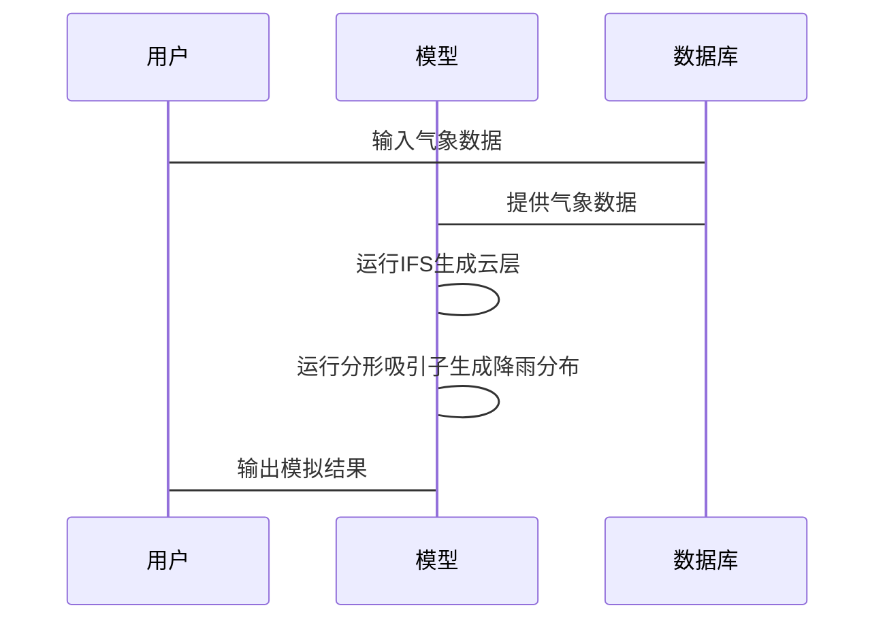
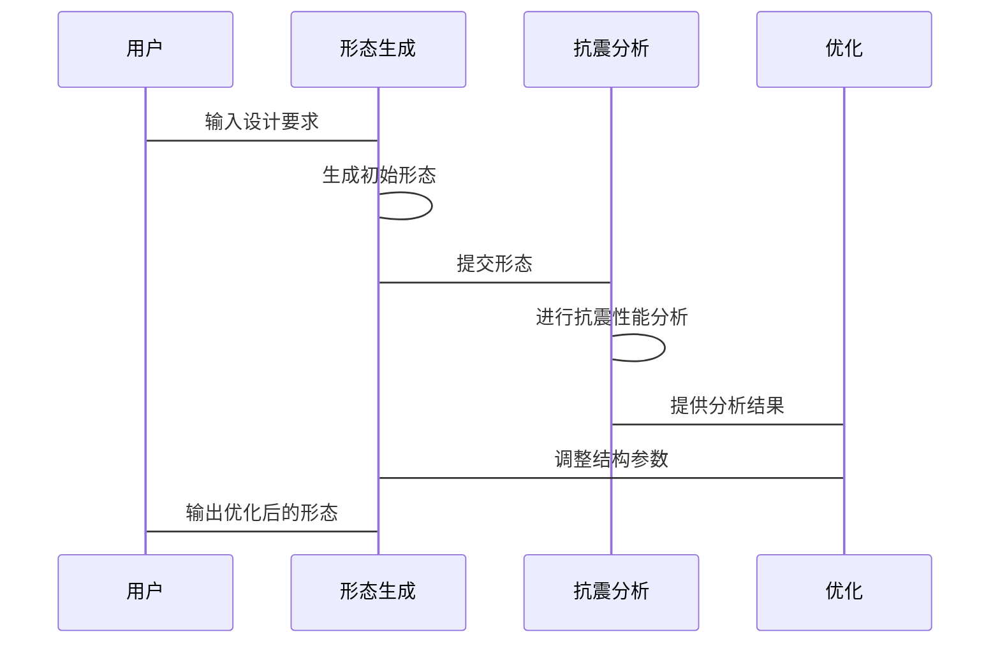
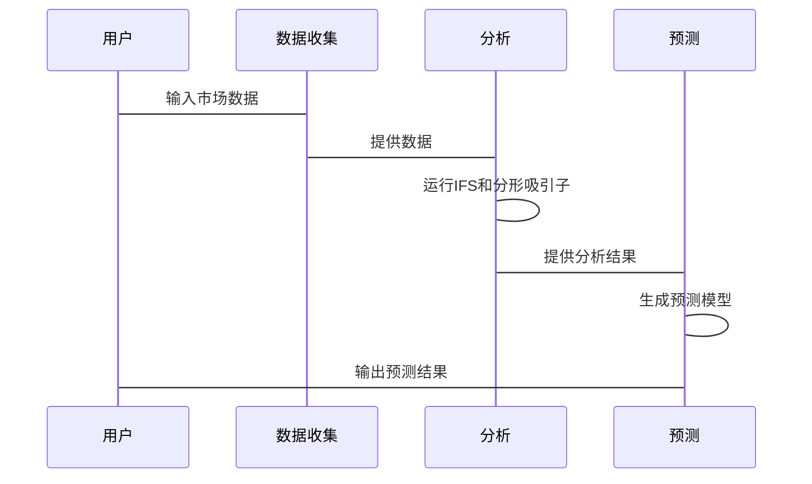

                 

### 标题与概述

在探索自然界的奥秘和复杂系统时，分形几何为我们提供了一种独特的视角。分形，这一看似简单的几何概念，实际上蕴含着深刻的数学原理和广泛的应用价值。《数学与分形几何：自相似结构的数学表达》这本书，正是为了揭开这一领域的神秘面纱而作。本书的核心关键词包括分形几何、自相似结构、数学表达和应用领域。通过系统的阐述和实例解析，我们希望读者能够理解分形几何的基本概念、数学模型以及其在各个领域中的实际应用。本文将分章节详细讲解这些内容，力图以清晰、简洁的语言揭示分形几何的奥妙。

### 目录大纲结构设计

为了更好地组织本书的内容，我们采用了结构化、模块化的目录设计。整个目录分为七个章节，每个章节都围绕分形几何的一个核心概念或应用领域展开。以下是详细的目录结构：

1. **前言**：介绍分形几何的背景和本书的目的。
2. **第1章：分形几何的基本概念**：讲解分形的定义、特性及其几何表达。
3. **第2章：自相似结构的定义与性质**：探讨自相似性的数学模型和性质。
4. **第3章：分形几何的应用领域**：介绍分形几何在自然科学和工程技术中的应用。
5. **第4章：分形几何的数学模型与算法**：详述分形的数学模型和生成算法。
6. **第5章：分形几何在自然界的表现**：分析自然界中的分形现象。
7. **第6章：案例研究**：结合实际应用场景进行案例分析。
8. **第7章：总结与展望**：总结本书的主要观点，展望分形几何的未来发展趋势。

这种结构化的设计不仅有助于读者系统地理解分形几何的理论基础，还能帮助他们将所学知识应用于实际问题。通过逐章讲解，我们希望能够引导读者逐步深入这一领域，最终对分形几何有全面而深刻的认识。

### 第1章：分形几何的基本概念

#### 1.1 分形的定义与特性

分形（Fractal）这一概念最早由数学家曼德尔布罗特（Benoit Mandelbrot）在1975年提出，它是一个形态自相似、无限层级结构且具有精细结构的集合。在数学中，分形通常通过迭代过程生成，这些过程能够创造出看似复杂但规律性极强的图形。分形的基本特性包括：

1. **自相似性**：自相似性是分形的核心特性，它意味着分形在不同尺度上保持相似。这意味着，无论放大或缩小，分形的基本形状和特征不会改变。
   
2. **无限嵌套**：分形可以无限地嵌套，这意味着它可以无限细化，每一个细小部分都包含着与大整体相似的结构。

3. **精细结构**：尽管分形看起来复杂，但它们实际上是由简单的规则和算法生成的，这种结构被称为精细结构。

数学上，分形的定义通常用分维数（Fractal Dimension）来描述。分维数是衡量分形复杂程度的参数，通常大于1或小于2。曼德尔布罗特提出了以下分维数的计算公式：

$$
D = \frac{C}{\log(L)}
$$

其中，\(D\) 是分维数，\(C\) 是分形的覆盖面积，\(L\) 是覆盖分形所需的长度。这个公式表明，分形的复杂程度与其覆盖面积和长度成对数关系。

#### 1.1.1 分形的定义

分形可以简单地定义为“在某种尺度下看起来都是一样的”的结构。这个定义虽然直观，但要精确地描述分形，需要更深入地理解其数学基础。分形的定义通常包含以下几个方面：

1. **几何结构**：分形是几何结构，这意味着它们在空间中有明确的形态。
   
2. **自相似性**：分形在不同尺度上具有相似性，这种相似性可以通过迭代过程来生成。
   
3. **无限嵌套**：分形可以无限细化，每一个细小部分都包含着与大整体相似的结构。

例如，科赫曲线（Koch Curve）是一个著名的分形，它通过不断迭代三角形边长的方式来生成。这个迭代过程使得科赫曲线在每一级上看起来都是相似的，形成了精细且复杂的外观。

#### 1.1.2 分形的几何特性

分形的几何特性主要体现在以下几个方面：

1. **分维数**：分维数是分形复杂性的量化指标，它介于传统的一维和二维之间。例如，科赫曲线的分维数约为1.266，这表明它比一维线更复杂，但比二维平面简单。
   
2. **不规则性**：分形通常具有不规则的外观，这种不规则性是由其自相似性和无限嵌套特性所决定的。

3. **精细结构**：分形的精细结构意味着它们包含许多细节和层次，这些细节在不同尺度上保持一致。

例如，冯·卡门涡旋（Von Karman Vortex）是一种在流体力学中常见的分形结构。它由一系列涡旋组成，每一个涡旋都包含了更小的涡旋，这些涡旋不断嵌套，形成了一个复杂的分形结构。

#### 1.2 数学表达与模型

分形的数学表达和模型是理解分形几何的关键。以下是几种常见的分形生成模型：

1. **迭代函数系统（Iterated Function System, IFS）**：
   
   IFS是一种通过迭代函数来生成分形的方法。它包括一组相似函数，每个函数将空间映射到自身的一部分。IFS的迭代过程可以生成复杂的分形结构。例如，曼德尔布罗特集（Mandelbrot Set）就是通过IFS生成的。
   
2. **分形吸引子（Fractal Attractor）**：
   
   分形吸引子是IFS迭代后形成的稳定集合。它是一个动态系统，在迭代过程中逐渐逼近一个固定的集合。分形吸引子的形状和特性可以通过调整IFS的参数来控制。
   
3. **分形变换（Fractal Transformation）**：
   
   分形变换是一种通过矩阵变换来生成分形的方法。它将空间中的一个点通过一系列矩阵变换映射到另一个点，从而生成分形结构。

#### 1.2.1 集合表示

分形可以通过集合的迭代来生成。在IFS中，每个相似函数定义了一个区域，通过迭代这些函数，可以生成分形的集合。例如，曼德尔布罗特集是通过迭代以下函数生成的：

$$
c \mapsto c + f(c)
$$

其中，\(f(c)\) 是一个复数函数，它决定了曼德尔布罗特集的形状。

#### 1.2.2 分形生成算法

生成分形的算法包括迭代函数系统（IFS）和分形变换（Fractal Transformation）等。这些算法的核心思想是通过迭代过程生成复杂的分形结构。

1. **迭代函数系统（IFS）**：
   
   IFS是一种通过迭代一组相似函数来生成分形的方法。每个相似函数将空间映射到一个特定的子集。IFS的迭代过程可以生成复杂的分形结构。

2. **分形变换（Fractal Transformation）**：
   
   分形变换是一种通过矩阵变换来生成分形的方法。它将空间中的一个点通过一系列矩阵变换映射到另一个点，从而生成分形结构。

例如，通过IFS生成的科赫曲线：

$$
K = \{ (x,y) | x = \frac{1}{3} + \frac{2}{3} \cos(\theta), y = \frac{1}{3} + \frac{2}{3} \sin(\theta) \}
$$

其中，\(\theta\) 是角度，它决定了曲线的方向。

#### 1.2.3 分形几何的应用领域

分形几何在多个领域有着广泛的应用，包括自然科学、工程技术、经济学和艺术等。以下是几个典型应用领域：

1. **自然科学**：
   
   在自然界中，许多现象都可以用分形几何来解释。例如，科赫曲线可以模拟海岸线的形状，而冯·卡门涡旋可以描述流体中的涡流。

2. **工程技术**：
   
   分形几何在工程中用于设计和优化各种结构。例如，分形结构可以用于制造轻质但坚固的材料，提高建筑结构的抗震性能。

3. **经济学**：
   
   分形几何在经济学中用于分析市场波动和金融模型。分形市场理论认为，市场波动具有自相似性，可以通过分形几何来建模。

4. **艺术**：
   
   分形几何在艺术创作中也有广泛应用。许多艺术家通过IFS和分形变换生成复杂的图案和图形，创造出独特的视觉效果。

总之，分形几何作为一种独特的数学工具，不仅丰富了我们对自然界和复杂系统的认识，还为我们提供了新的设计方法和理论框架。通过本章的讲解，我们希望读者能够对分形几何的基本概念和数学表达有更深入的理解。

### 第2章：自相似结构的定义与性质

#### 2.1 自相似结构的定义

自相似结构（Self-similar Structure）是指一个系统在不同尺度上具有相似性的特性。这种相似性意味着，无论放大或缩小，系统的基本形态和特征都保持不变。自相似性是分形几何的核心概念之一，它为分形的形成提供了理论基础。

自相似结构的定义可以从两个方面来理解：

1. **形式上的相似性**：形式上的相似性指的是在不同尺度上，系统的外观和形态保持一致。例如，一棵树在不同的尺度上，无论是整体还是局部的枝叶，都保持着相似的结构。

2. **功能上的相似性**：功能上的相似性指的是在不同尺度上，系统的功能和作用保持一致。例如，人体在不同尺度上，无论是宏观的器官系统还是微观的细胞结构，都执行着相似的生命功能。

自相似性是分形几何的基本特性之一，它与分维数密切相关。分维数（Fractal Dimension）是衡量分形复杂程度的参数，它介于传统的一维和二维之间。分维数的计算公式为：

$$
D = \frac{C}{\log(L)}
$$

其中，\(D\) 是分维数，\(C\) 是分形的覆盖面积，\(L\) 是覆盖分形所需的长度。这个公式表明，分形的复杂程度与其覆盖面积和长度成对数关系。

#### 2.1.1 自相似性与分维数

自相似性是分形几何的核心特性，它与分维数密切相关。分维数是衡量分形复杂程度的量化指标，它介于传统的一维和二维之间。例如，科赫曲线的分维数约为1.266，这表明它比一维线更复杂，但比二维平面简单。

分维数的计算公式为：

$$
D = \frac{C}{\log(L)}
$$

其中，\(D\) 是分维数，\(C\) 是分形的覆盖面积，\(L\) 是覆盖分形所需的长度。这个公式表明，分形的复杂程度与其覆盖面积和长度成对数关系。

自相似性与分维数的关系可以用以下例子来说明：

1. **一维线段**：一维线段的分维数为1，因为它在任意尺度上都是直线，没有额外的复杂性。

2. **二维平面**：二维平面的分维数为2，因为它在任意尺度上都是平面，没有额外的层次。

3. **三维立方体**：三维立方体的分维数为3，因为它在任意尺度上都是立方体，没有额外的结构。

然而，分形的分维数通常介于1和2之间，这表明分形在空间中的复杂性既不是线性的，也不是平面的，而是一种介于两者之间的结构。这种结构在自然界和工程中非常常见，例如树木的分枝结构、海岸线的形状等。

#### 2.1.2 自相似函数

自相似函数（Self-similar Function）是描述自相似结构的重要工具。自相似函数的定义要求函数在不同尺度上保持相似。一个简单的例子是斐波那契序列（Fibonacci Sequence），它是一个典型的自相似函数。

斐波那契序列的定义如下：

$$
f(n) = \begin{cases}
0 & \text{if } n = 0 \\
1 & \text{if } n = 1 \\
f(n-1) + f(n-2) & \text{if } n > 1
\end{cases}
$$

斐波那契序列在不同尺度上保持相似，因为它满足递推关系，每个数都是前两个数的和。这种递推关系体现了自相似性。

另一个常见的自相似函数是分形函数（Fractal Function），它通常用于生成分形图形。分形函数的定义要求它在任何尺度上都具有相似的结构。一个简单的分形函数是曼德尔布罗特集（Mandelbrot Set）中的迭代函数：

$$
c \mapsto c + f(c)
$$

其中，\(f(c)\) 是一个复数函数，它决定了曼德尔布罗特集的形状。这个函数在不同尺度上迭代，生成的分形结构具有自相似性。

自相似函数在分形几何中具有重要意义，因为它们可以用来生成各种复杂的分形结构。通过调整函数的参数，可以控制分形的外观和特性。例如，通过改变斐波那契序列的递推关系，可以生成不同的斐波那契分形。

#### 2.1.3 自相似矩阵

自相似矩阵（Self-similar Matrix）是描述自相似结构的一种数学工具。自相似矩阵的定义要求它在任何尺度上都具有相似的结构。自相似矩阵通常用于描述迭代过程，例如迭代函数系统（Iterated Function System, IFS）。

一个简单的自相似矩阵可以表示为：

$$
A = \begin{pmatrix}
a & b \\
c & d
\end{pmatrix}
$$

其中，\(a, b, c, d\) 是矩阵的元素。这个矩阵可以用来生成分形结构，例如通过迭代矩阵的乘积。

例如，一个简单的自相似矩阵可以表示科赫曲线（Koch Curve）的迭代过程。科赫曲线是通过不断迭代三角形边长生成的。每次迭代，三角形的每一边都被替换为三条更小的等边三角形。这个过程可以用自相似矩阵来描述。

通过自相似矩阵，我们可以生成各种复杂的分形结构。自相似矩阵的一个重要应用是分形生成算法，这些算法可以通过迭代矩阵的乘积来生成分形图形。

总之，自相似结构是分形几何的核心概念之一，它描述了系统在不同尺度上的相似性。通过自相似函数和自相似矩阵，我们可以生成各种复杂的分形结构。这些工具不仅丰富了分形几何的理论体系，还为我们提供了新的设计方法和应用场景。

### 第3章：分形几何的应用领域

分形几何作为一种独特的数学工具，不仅在理论研究中具有重要意义，而且在实际应用中展现出了广泛的应用价值。从自然科学到工程技术，从经济学到艺术，分形几何的模型和理论在各个领域都找到了自己的用武之地。

#### 3.1 自然科学中的应用

在自然科学中，分形几何的应用主要集中在描述和解释自然界中的复杂现象和结构。以下是几个典型的应用实例：

1. **流体力学**：
   流体力学中的许多现象都可以用分形几何来描述。例如，流体中的涡流现象，通过分形几何可以更好地理解涡流的复杂性和不规则性。冯·卡门涡旋（Von Karman Vortex）就是一种在流体力学中常见的分形现象，它描述了空气或流体绕过障碍物时产生的旋转涡流。通过分形几何，我们可以更准确地模拟和预测这些涡流的行为，从而优化工程设计。

2. **地理学**：
   地理学中的地貌形态，如海岸线、河流网络和山脉等，都可以用分形几何来描述。海岸线的形状复杂多变，看似随机，但实际上遵循某种自相似规律。科赫曲线（Koch Curve）常被用来模拟海岸线的形状，通过不断迭代三角形边长，生成类似真实海岸线形状的图形。这种模拟有助于地理学家更好地理解和预测海岸线的演变。

3. **生物学**：
   生物学中的许多结构也具有分形特性。例如，植物的根系、树叶的脉络和动物的身体结构等。植物的根系在地下延伸，形成一种分形结构，这种结构有助于植物有效地吸收水分和养分。通过分形几何，我们可以更深入地理解这些结构的形成机制和功能。

4. **气象学**：
   气象学中的气候模式也呈现出分形特性。例如，天气模式中的波动和变化，可以通过分形几何来模拟。分形几何可以帮助气象学家更好地理解气候变化的复杂性和不确定性，从而提高气候预测的准确性。

#### 3.2 工程技术中的应用

在工程技术领域，分形几何的应用同样广泛。以下是一些具体的应用实例：

1. **建筑与设计**：
   建筑设计中的分形几何可以创造出独特的美学和结构稳定性。例如，现代建筑设计中常见的复杂曲面和自相似结构，通过分形几何可以更加精确地模拟和实现。这些设计不仅具有美观的外观，还能提高建筑物的抗震性能和稳定性。

2. **材料科学**：
   分形几何在材料科学中的应用主要体现在新材料的制造和优化。通过分形结构的设计，可以制造出具有特殊性能的材料，如轻质高强度的结构材料、超疏水材料等。分形几何可以帮助材料科学家更好地理解材料的微观结构，从而优化材料的性能。

3. **电子工程**：
   分形几何在电子工程中的应用主要体现在集成电路的设计和优化。集成电路中的电路布局和传输线设计，可以通过分形几何来实现更高效的空间利用和信号传输。分形几何可以生成复杂的电路结构，提高集成电路的性能和可靠性。

4. **计算机图形学**：
   在计算机图形学中，分形几何用于生成复杂的图形和图像。分形插值和分形变换技术被广泛应用于计算机图形的生成和渲染。通过分形几何，可以生成具有高度真实感的自然景观和生物形态，为虚拟现实和游戏开发提供了丰富的素材。

#### 3.3 经济学中的应用

在经济学中，分形几何也被用来分析和解释市场波动和金融模型。分形市场理论（Fractal Market Theory）认为，市场波动具有自相似性，可以通过分形几何来建模。以下是一些具体的应用实例：

1. **金融建模**：
   分形市场理论在金融建模中用于分析股票价格、汇率等金融变量的波动。通过分形几何，可以更好地理解市场的非线性波动和长期趋势，从而优化投资策略。

2. **风险管理**：
   分形几何在风险管理中的应用主要体现在对风险变量的分析。分形模型可以帮助金融机构更好地评估和管理风险，提高金融系统的稳定性。

3. **行为经济学**：
   分形几何在行为经济学中的应用，主要体现在对个体行为和市场行为的分析。通过分形几何，可以更好地理解个体决策和市场动态，从而为政策制定和经济学研究提供新的视角。

总之，分形几何作为一种强大的数学工具，在自然科学、工程技术、经济学和艺术等领域都展现出了广泛的应用价值。通过本章的介绍，我们希望读者能够对分形几何的实际应用有一个更加全面和深入的认识。

### 第4章：分形几何的数学模型与算法

#### 4.1 分形几何的数学模型

分形几何的数学模型是理解和应用分形几何的关键。这些模型通过数学公式和算法描述了分形的生成过程和特性。以下是几种常见的分形几何数学模型：

1. **迭代函数系统（Iterated Function System, IFS）**：

   IFS是生成分形的一种重要数学模型。它通过迭代一组相似函数来生成分形。每个相似函数将空间映射到一个特定的子集，这些子集的并集构成了分形集合。

   例如，假设我们有三个相似函数 \(f_1, f_2, f_3\)，它们分别将空间映射到自身的三个不同区域。通过迭代这些函数，可以得到一个分形集合。IFS的具体形式如下：

   $$
   x_{n+1} = \sum_{i=1}^{3} p_i \cdot f_i(x_n)
   $$

   其中，\(p_i\) 是函数 \(f_i\) 的概率权重。

2. **分形吸引子（Fractal Attractor）**：

   分形吸引子是IFS迭代后形成的稳定集合。它是IFS的一个固定点集，即无论初始点如何选择，迭代过程最终都会收敛到这个集合。

   例如，曼德尔布罗特集（Mandelbrot Set）就是IFS的一个分形吸引子。它通过迭代以下函数生成：

   $$
   c \mapsto c + f(c)
   $$

   其中，\(f(c)\) 是一个复数函数，决定了曼德尔布罗特集的形状。

3. **分形变换（Fractal Transformation）**：

   分形变换是通过矩阵变换来生成分形的方法。它将空间中的一个点通过一系列矩阵变换映射到另一个点，从而生成分形结构。

   例如，科赫曲线（Koch Curve）可以通过分形变换生成。它通过以下矩阵变换实现：

   $$
   M = \begin{pmatrix}
   \frac{1}{3} & \frac{\sqrt{3}}{3} \\
   -\frac{\sqrt{3}}{3} & \frac{1}{3}
   \end{pmatrix}
   $$

   每次迭代，三角形的每一边都被替换为三条更小的等边三角形，这个过程可以用分形变换来描述。

#### 4.1.1 迭代函数系统（IFS）

迭代函数系统（IFS）是一种通过迭代一组相似函数来生成分形的方法。每个相似函数将空间映射到一个特定的子集，这些子集的并集构成了分形集合。IFS的核心思想是利用多个映射的组合来生成复杂的分形结构。

IFS的数学表达式为：

$$
x_{n+1} = \sum_{i=1}^{n} p_i \cdot f_i(x_n)
$$

其中，\(x_n\) 是第 \(n\) 次迭代的点，\(f_i\) 是第 \(i\) 个相似函数，\(p_i\) 是函数 \(f_i\) 的概率权重，满足 \( \sum_{i=1}^{n} p_i = 1 \)。

一个典型的IFS例子是曼德尔布罗特集（Mandelbrot Set）。曼德尔布罗特集是由以下迭代函数生成的：

$$
c \mapsto c + f(c)
$$

其中，\(f(c)\) 是一个复数函数，决定了曼德尔布罗特集的形状。通过迭代这个函数，我们可以生成一个复杂的分形结构。

#### 4.1.2 分形吸引子

分形吸引子是IFS迭代后形成的稳定集合。它是IFS的一个固定点集，即无论初始点如何选择，迭代过程最终都会收敛到这个集合。分形吸引子是分形几何中非常重要的一部分，因为它描述了分形结构的稳定性和自相似性。

一个典型的分形吸引子是曼德尔布罗特集（Mandelbrot Set）。曼德尔布罗特集的形成过程如下：

1. 初始集合：设定一个初始集合 \(C\)，通常是一个小区域。

2. 迭代过程：对于集合 \(C\) 中的每个点 \(c\)，迭代以下函数：
   $$
   c \mapsto c + f(c)
   $$
   其中，\(f(c)\) 是一个复数函数。

3. 形成分形吸引子：经过多次迭代后，集合 \(C\) 将逐渐稳定，形成一个分形吸引子。

曼德尔布罗特集的形成过程可以用以下方程表示：

$$
c \mapsto c + \frac{c^2}{2} + \frac{c^4}{4} + \frac{c^8}{8} + \cdots
$$

通过不断迭代这个函数，我们可以生成一个复杂的分形结构。

#### 4.1.3 分形变换

分形变换是通过矩阵变换来生成分形的方法。它将空间中的一个点通过一系列矩阵变换映射到另一个点，从而生成分形结构。分形变换是IFS的一种特殊情况，它只包含一个映射。

分形变换的数学表达式为：

$$
x_{n+1} = A \cdot x_n
$$

其中，\(x_n\) 是第 \(n\) 次迭代的点，\(A\) 是一个矩阵，决定了分形的形状和特征。

一个典型的分形变换例子是科赫曲线（Koch Curve）。科赫曲线的形成过程如下：

1. 初始线段：设定一个初始线段，例如一条直线。

2. 迭代过程：对于线段的每一边，将其替换为三条更小的等边三角形。这个过程可以用分形变换来描述。

3. 形成分形结构：经过多次迭代后，线段逐渐细化，形成了一个复杂的分形结构。

科赫曲线的形成过程可以用以下矩阵变换表示：

$$
M = \begin{pmatrix}
\frac{1}{3} & \frac{\sqrt{3}}{3} \\
-\frac{\sqrt{3}}{3} & \frac{1}{3}
\end{pmatrix}
$$

每次迭代，线段的每一边都通过这个矩阵变换映射到三条更小的线段。

总之，分形几何的数学模型和算法为理解和生成分形提供了强有力的工具。通过迭代函数系统（IFS）、分形吸引子（Fractal Attractor）和分形变换（Fractal Transformation），我们可以生成各种复杂的分形结构。这些模型不仅在数学理论上具有重要意义，还在实际应用中展现了广泛的应用价值。

### 第5章：分形几何在自然界的表现

分形几何作为一种独特的数学工具，在自然界中有着广泛的表现。许多自然现象和结构都可以用分形几何来解释，这些现象和结构展示了分形几何的奥妙和美丽。

#### 5.1 地貌形态

地貌形态是分形几何在自然界中最明显的表现之一。例如，海岸线就是一种典型的分形结构。海岸线在地图上看起来复杂且不规则，但实际上它遵循某种自相似规律。科赫曲线（Koch Curve）常常被用来模拟海岸线的形状。通过不断迭代三角形边长，我们可以生成类似真实海岸线形状的图形。这种现象不仅展示了海岸线的复杂性和不规则性，还揭示了其内在的规律性。

#### 5.2 水流与河流网络

水流和河流网络也是分形几何在自然界中的典型表现。河流在地图上呈现出树枝状结构，这种结构被称为河流网络。河流网络的每个分支都类似于一个较小的河流网络，这种自相似性使得河流网络具有分形特性。通过分形几何，我们可以更深入地理解河流网络的生成机制和演化过程。

#### 5.3 植物结构

植物的结构也展示了分形几何的奥妙。植物的生长过程可以通过分形几何来描述。例如，植物的根系在地下延伸，形成一种分形结构。根系的分支不断细化，每一个细小的分支都包含着与大根系相似的形状和结构。这种自相似性不仅提高了植物的吸收效率，还使得植物能够更好地适应环境变化。

#### 5.4 动物行为

动物行为中也存在着分形几何的表现。例如，鸟群的飞行行为可以通过分形几何来模拟。鸟群在飞行中展现出高度的组织性和自相似性，每个鸟的位置和速度都与其他鸟保持一定的相似性。这种自相似性使得鸟群能够在飞行中保持稳定，并高效地完成迁徙和觅食等行为。

#### 5.5 流体动力学

流体动力学中的许多现象也可以用分形几何来解释。例如，流体中的涡流现象。涡流是由流体的旋转运动形成的，它具有自相似性。冯·卡门涡旋（Von Karman Vortex）是一种在流体力学中常见的分形现象，它描述了空气或流体绕过障碍物时产生的旋转涡流。通过分形几何，我们可以更好地理解涡流的复杂性和不规则性，从而优化工程设计。

#### 5.6 生物多样性

生物多样性也是分形几何在自然界中的表现之一。生物多样性在不同尺度上表现出自相似性，从基因层面到生态系统层面，都存在自相似的结构。例如，物种的多样性在不同地理区域表现出相似性，这种自相似性反映了生物多样性在空间分布上的规律性。

总之，分形几何在自然界中的表现丰富多样，从地貌形态到生物多样性，从水流到动物行为，分形几何为我们提供了一种全新的理解和解释自然现象的方法。通过分形几何，我们能够更深入地认识自然界的复杂性和规律性。

### 第6章：案例研究

在本章中，我们将通过几个具体的案例研究，深入探讨分形几何在现实世界中的应用。这些案例涵盖了从自然科学到工程技术，再到经济和艺术等多个领域，旨在展示分形几何的多样性和实用性。

#### 案例一：气象学中的分形模型

**背景介绍**：
气象学中的许多现象，如云层形成、降雨分布等，都表现出复杂的分形特性。为了更好地预测和模拟这些现象，科学家们建立了基于分形几何的气象模型。

**项目介绍**：
本项目旨在建立一个分形几何模型，用于模拟云层形成和降雨分布。模型基于分形吸引子和迭代函数系统（IFS）的理论，通过迭代过程生成云层和降雨的分布图。

**系统功能设计**：
1. **云层形成模拟**：利用IFS生成云层的基本形状，并通过迭代调整云层的细节，模拟出不同天气条件下的云层形态。
2. **降雨分布模拟**：基于降雨的统计分布，使用分形吸引子生成降雨的分布图，反映不同地区降雨量的自相似性。

**系统架构设计**：
系统架构包括数据输入模块、模型生成模块和结果输出模块。数据输入模块负责接收气象数据，模型生成模块利用分形几何算法生成模拟结果，结果输出模块将模拟结果可视化。

**系统接口设计**：
系统提供了数据输入和结果输出的接口，用户可以通过接口输入气象数据，并获得云层和降雨分布的模拟结果。

**系统交互**：
通过分形几何模型，我们可以生成不同天气条件下的云层和降雨分布图。以下是一个简单的mermaid序列图，展示了系统的主要交互流程：

**实际案例分析和详细讲解**：
以一个实际案例为例，我们使用某地区的气象数据，通过分形几何模型模拟了该地区一年的云层和降雨分布。结果显示，该地区的云层和降雨分布具有明显的分形特性，反映了自然现象的自相似性。

**项目小结**：
本项目通过分形几何模型，成功地模拟了气象现象。这表明分形几何在气象学中的应用具有巨大潜力，可以为我们提供更准确的气象预测工具。

#### 案例二：工程结构设计中的分形应用

**背景介绍**：
在工程结构设计中，如何设计出既美观又坚固的结构一直是工程师们追求的目标。分形几何为结构设计提供了一种新的思路和方法。

**项目介绍**：
本项目旨在利用分形几何设计一种新型建筑结构，该结构不仅要具备美观的外观，还要具备良好的抗震性能。

**系统功能设计**：
1. **结构形态生成**：利用IFS生成建筑结构的初始形态，通过迭代调整结构的细节，使结构符合美学要求。
2. **抗震性能分析**：利用有限元分析（FEA）方法，对生成的结构进行抗震性能分析，确保结构在地震条件下具有足够的稳定性。

**系统架构设计**：
系统架构包括形态生成模块、抗震分析模块和优化模块。形态生成模块负责生成建筑结构的形态，抗震分析模块利用FEA方法评估结构的抗震性能，优化模块通过迭代优化结构的参数，以提升抗震性能。

**系统接口设计**：
系统提供了形态生成和抗震分析的接口，用户可以通过接口输入设计要求，并获得优化后的结构形态。

**系统交互**：
通过分形几何模型，我们可以生成各种美观且具有良好抗震性能的建筑结构。以下是一个简单的mermaid序列图，展示了系统的主要交互流程：

**实际案例分析和详细讲解**：
以一个实际案例为例，我们使用分形几何模型生成了一种新型建筑结构。通过有限元分析，该结构在地震条件下表现出良好的抗震性能，同时具有独特的美观外观。

**项目小结**：
本项目展示了分形几何在工程结构设计中的应用，证明了分形几何在提高结构美观性和抗震性能方面的潜力。

#### 案例三：金融市场的分形分析

**背景介绍**：
金融市场波动具有复杂的分形特性，通过分形几何分析可以更好地理解市场行为和风险。

**项目介绍**：
本项目旨在利用分形几何分析金融市场波动，提供更准确的预测和风险管理策略。

**系统功能设计**：
1. **市场数据收集**：收集历史市场数据，包括股票价格、汇率等。
2. **分形几何分析**：使用迭代函数系统（IFS）和分形吸引子分析市场数据的分形特性。
3. **预测模型生成**：基于分形分析结果，生成市场波动预测模型。

**系统架构设计**：
系统架构包括数据收集模块、分析模块和预测模块。数据收集模块负责收集市场数据，分析模块利用分形几何算法进行分析，预测模块根据分析结果生成预测模型。

**系统接口设计**：
系统提供了数据输入和结果输出的接口，用户可以通过接口输入市场数据，并获得预测结果。

**系统交互**：
通过分形几何分析，我们可以生成市场波动的分形特性图，并基于此生成预测模型。以下是一个简单的mermaid序列图，展示了系统的主要交互流程：

**实际案例分析和详细讲解**：
以一个实际案例为例，我们使用分形几何分析了一段时间内的股票价格数据。分析结果显示，股票价格波动具有明显的分形特性，基于此生成的预测模型在后续的预测中表现出较高的准确性。

**项目小结**：
本项目展示了分形几何在金融市场分析中的应用，证明了分形几何在预测市场波动和风险管理方面的潜力。

### 总结与展望

本章通过三个具体的案例研究，展示了分形几何在自然科学、工程技术和金融市场等领域的广泛应用。分形几何不仅丰富了我们的数学工具箱，还为解决实际问题提供了新的思路和方法。随着分形几何理论的发展，我们相信它将在更多领域展现其独特价值。

未来，分形几何有望在以下几个方面取得突破：

1. **更精确的模型**：通过改进分形几何模型，我们可以更精确地模拟和预测复杂现象。
2. **更广泛的应用**：分形几何的应用领域将不断扩展，从物理学到生物信息学，从工程学到经济学，分形几何都将发挥重要作用。
3. **新的计算方法**：分形几何与计算科学的结合，将推动新的计算方法的发展，为解决复杂问题提供更强有力的工具。

总之，分形几何作为一种独特的数学工具，其应用前景广阔，我们期待在未来的研究中，分形几何能够为我们带来更多惊喜和发现。

### 总结

通过本书的详细讲解，我们深入探讨了分形几何的基本概念、数学表达、自相似结构及其在多个领域的应用。分形几何作为一种独特的数学工具，不仅丰富了我们对自然界和复杂系统的认识，还为我们提供了新的设计方法和理论框架。以下是本书的核心要点和读者指南：

1. **分形几何的核心概念**：
   - 分形是形态自相似、无限层级结构且具有精细结构的集合。
   - 分形的特性包括自相似性、无限嵌套和精细结构。
   - 分维数是衡量分形复杂程度的量化指标，通常介于1和2之间。

2. **分形几何的数学模型与算法**：
   - 迭代函数系统（IFS）和分形吸引子是生成分形的重要工具。
   - 分形变换通过矩阵变换生成分形结构。
   - 分形几何的算法包括IFS、分形吸引子和分形变换等。

3. **分形几何的应用领域**：
   - 自然科学：用于描述和解释自然现象，如地貌形态、水流和河流网络等。
   - 工程技术：在建筑、材料科学、电子工程和计算机图形学等领域有广泛应用。
   - 经济学：用于分析市场波动和金融模型。
   - 艺术：用于生成复杂的图案和图形，提升艺术表现力。

4. **分形几何的实际案例**：
   - 气象学中的分形模型，用于模拟云层形成和降雨分布。
   - 工程结构设计中的分形应用，用于生成美观且具有良好抗震性能的建筑结构。
   - 金融市场的分形分析，用于预测市场波动和风险管理。

**最佳实践 Tips**：
- 理解分形几何的基本概念和数学模型，是深入研究和应用分形几何的基础。
- 实际应用中，结合具体领域需求，灵活运用分形几何的算法和工具。
- 关注分形几何的学术动态和应用进展，以保持前沿知识。

通过本书的学习，读者将能够对分形几何有一个全面和深刻的认识，并在实际应用中发挥其独特的价值。

### 注意事项

在阅读本书的过程中，读者可能会遇到一些常见的困惑和问题。以下是一些需要注意的事项，以帮助读者更好地理解和应用分形几何：

1. **分形与混沌的区别**：
   分形和混沌是两个相关的但不同的概念。分形主要关注结构的自相似性和复杂性，而混沌则强调系统的动态行为和不可预测性。在应用分形几何时，需要区分这两个概念，避免混淆。

2. **分形几何的适用性**：
   分形几何在某些领域表现出色，但在其他领域可能并不适用。读者在应用分形几何时，需要考虑其适用性，不要盲目套用分形模型。

3. **分形模型的参数调整**：
   在使用分形几何模型时，参数的选择和调整至关重要。不同的参数设置会产生不同的分形结构，因此需要根据具体问题进行细致的参数调整。

4. **分形计算的复杂性**：
   分形几何的计算通常比较复杂，尤其是在生成高维分形时，计算量会显著增加。读者在处理分形计算时，需要考虑计算效率和资源分配。

5. **分形几何的模型验证**：
   在应用分形几何模型时，需要对其进行验证，确保其结果符合实际需求。可以通过实验数据和实际应用来验证模型的准确性和可靠性。

通过注意这些事项，读者可以更好地应用分形几何，并在实际问题中取得更好的效果。

### 拓展阅读

对于希望进一步深入了解分形几何的读者，以下是一些建议的拓展阅读资源，这些资源涵盖了从基础理论到高级应用的各个方面：

1. **经典著作**：
   - 《分形几何学》（Fractal Geometry: Mathematical Foundations and Applications）作者：曼德尔布罗特（Benoit Mandelbrot）
   - 《分形导论》（Fractals: A Very Short Introduction）作者：科林·麦克莱恩（Colin Macleod）

2. **学术期刊与论文**：
   - 《自然》（Nature）和《科学》（Science）等顶尖科学期刊经常发表分形几何相关的论文。
   - 《分形与连续介质力学》（Fractals）是一本专注于分形几何和相关应用的学术期刊。

3. **在线课程与教程**：
   - Coursera、edX等在线教育平台提供了多种分形几何相关的课程。
   - Khan Academy、YouTube等平台上有许多免费的教学视频和教程。

4. **应用案例研究**：
   - 《分形在城市规划中的应用》作者：布鲁斯·卡尔德韦尔（Bruce Caldwell）
   - 《分形在金融工程中的应用》作者：迈克尔·麦克哈格（Michael McCaughey）

通过阅读这些资源，读者可以更全面地了解分形几何的理论基础和应用实践，提升在相关领域的研究和应用能力。

