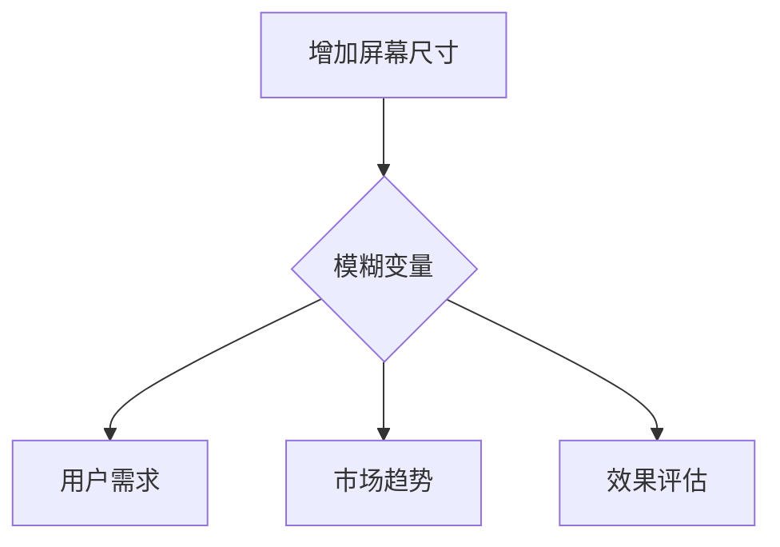
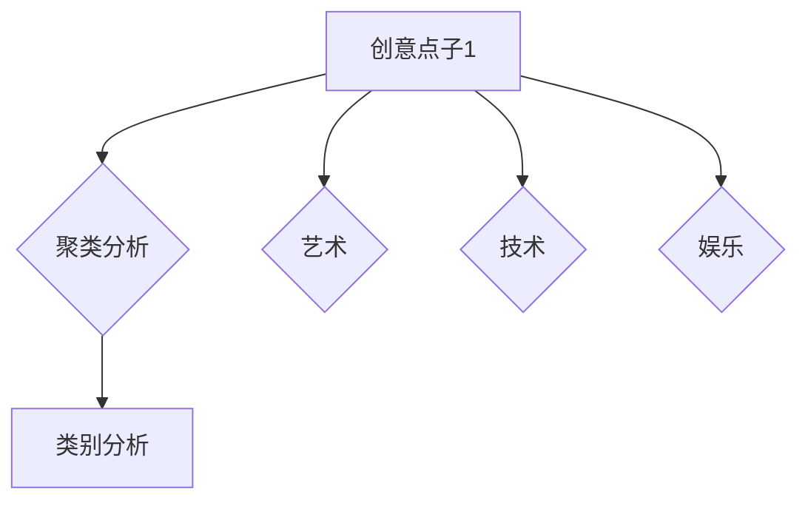
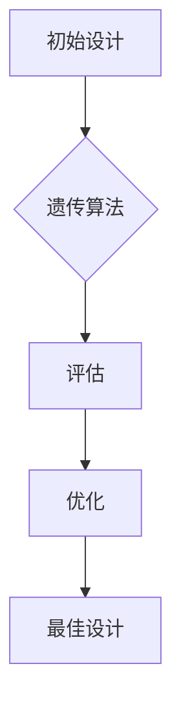
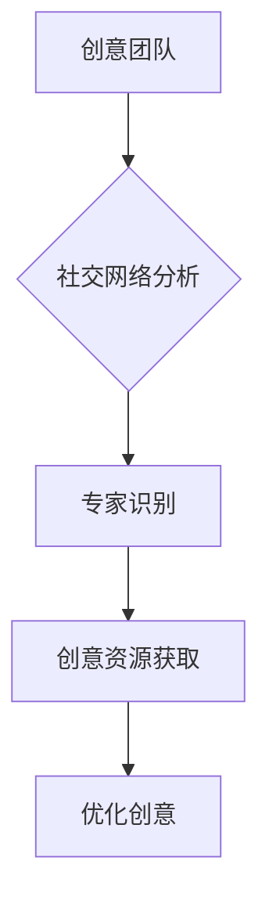
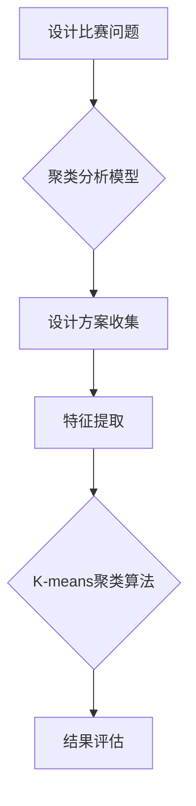
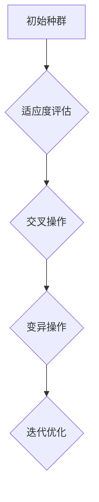
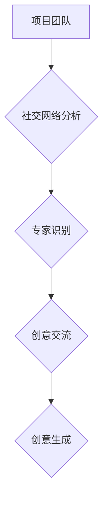
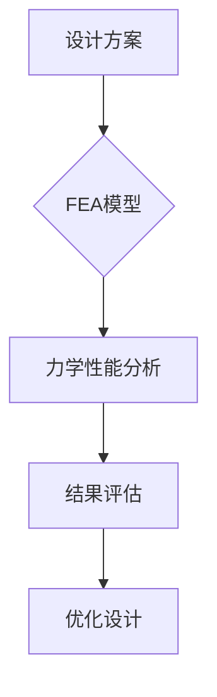
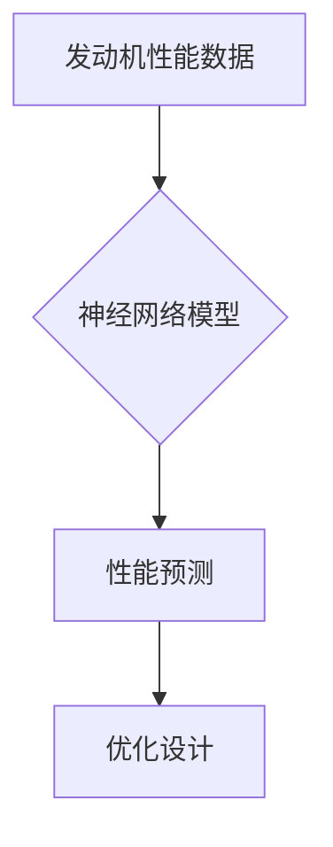
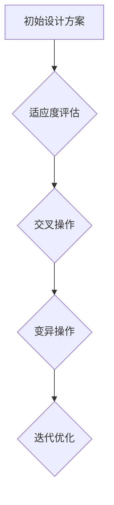

                 

### 数学与创造力研究：创新过程的数学模型

#### 关键词：
- 数学模型
- 创造力
- 创新过程
- 数学与创造力关系
- 数学模型在创新中的应用

#### 摘要：
本文深入探讨了数学与创造力之间的关系，特别是在创新过程中数学模型的应用。通过分析数学模型的基本概念、创新过程的核心要素以及数学模型在创意生成和产品优化中的应用，我们揭示了数学在推动创新中的关键作用。文章不仅从理论层面阐述了数学模型在创新中的角色，还结合实际案例展示了数学模型如何有效提高创造力，为创新实践提供指导。

### 目录大纲

#### 第一部分：背景介绍与核心概念
1. **问题背景与定义**
    1.1 问题背景
    1.2 创造力的定义
    1.3 创新过程的定义
    1.4 数学模型的基本概念
2. **核心概念的联系与区分**
    2.1 数学与创造力的联系
    2.2 数学与创新过程的联系
    2.3 数学模型的分类与特性
    2.4 核心概念属性特征对比表格

#### 第二部分：数学模型在创新过程的应用
3. **创新过程中的数学模型原理**
    3.1 数学模型原理概述
    3.2 常见数学模型介绍
    3.3 数学模型在创新中的角色
4. **数学模型在创意生成中的应用**
    4.1 创意生成的数学模型
    4.2 创意生成模型的应用案例
    4.3 创意生成模型的效果评估
5. **数学模型在产品设计与优化中的应用**
    5.1 产品设计的数学模型
    5.2 产品设计模型的应用案例
    5.3 产品设计模型的效果评估

#### 第三部分：创新过程的数学模型实践
6. **数学模型在创新项目中的应用**
    6.1 创新项目的概述
    6.2 数学模型在项目中的应用
    6.3 项目实施过程中的挑战与解决策略
7. **数学模型在创新教育与培训中的应用**
    7.1 创新教育与培训的现状
    7.2 数学模型在教育培训中的应用
    7.3 教育培训中的数学模型案例分析

#### 第四部分：总结与展望
8. **数学模型与创造力的未来**
    8.1 数学模型在创造力研究中的发展趋势
    8.2 创新过程的未来方向
    8.3 数学模型在创新教育中的前景
9. **最佳实践与启示**
    9.1 创造力培养的最佳实践
    9.2 数学模型应用的最佳实践
    9.3 未来研究的方向与建议

### 正文

#### 第一部分：背景介绍与核心概念

##### 1.1 问题背景

在现代社会，创新已成为推动社会进步和经济增长的关键动力。随着技术的快速发展，各行各业对创新的需求愈发迫切。创造力在这个过程中扮演着至关重要的角色。然而，如何培养和提升创造力依然是一个复杂的难题。

数学作为一门基础学科，其思维方式和方法论在创新过程中发挥着重要作用。数学模型作为数学的一种表现形式，能够将复杂的问题转化为简洁、精确的数学表达，为创新提供强有力的工具。因此，探讨数学与创造力之间的关系，特别是数学模型在创新过程中的应用，具有重要的理论意义和实际价值。

##### 1.2 创造力的定义

创造力是指个体或团队在面对问题时，能够产生新颖且有价值的想法、方法或解决方案的能力。创造力不仅涉及个体的天赋和经验，还受到环境、文化和社会因素的影响。

创造力通常被分为几种类型，包括独立创造力（个体独立产生新颖想法的能力）和协同创造力（团队共同产生新颖想法的能力）。此外，根据创造性成果的类型，创造力可以分为科学创造力、艺术创造力和技术创造力等。

创造力的度量方法主要包括自我报告法、行为观察法和产品评估法等。这些方法各有优缺点，需要结合具体情境进行选择。

##### 1.3 创新过程的定义

创新过程是指从想法产生、发展到实现的过程。创新过程通常包括以下几个阶段：

1. **问题识别**：识别和明确需要解决的问题或需求。
2. **信息收集**：收集与问题相关的信息，包括市场趋势、技术发展、用户需求等。
3. **创意生成**：基于收集到的信息，产生新的想法和解决方案。
4. **筛选评估**：对创意进行筛选和评估，确定可行的方案。
5. **实施验证**：将可行的方案付诸实践，并进行验证和优化。
6. **商业化**：将创新成果商业化，实现市场价值。

创新过程是一个复杂且动态的系统，涉及到多个环节和多个参与者的协同作用。

##### 1.4 数学模型的基本概念

数学模型是使用数学符号和语言描述现实世界中的问题或现象的抽象表达。数学模型通常包括变量、参数、方程和约束条件等组成部分。

数学模型可以根据应用领域和目的进行分类，常见的数学模型包括：

1. **确定性模型**：基于确定性原理，通过数学方程描述系统的行为和变化。
2. **随机模型**：基于概率论和统计学原理，通过概率分布描述系统的行为和变化。
3. **微分方程模型**：通过微分方程描述系统的动态行为。
4. **图论模型**：通过图论描述系统的结构和关系。

数学模型在创新过程中可以发挥多种作用，包括：

1. **问题简化**：将复杂的实际问题转化为简单的数学模型，便于分析和处理。
2. **预测和模拟**：使用数学模型预测系统的行为和趋势，进行仿真和模拟。
3. **优化设计**：基于数学模型进行优化设计，寻找最优解决方案。
4. **决策支持**：为决策者提供数据分析和预测，辅助决策。

#### 1.5 核心概念的联系与区分

在创新过程中，数学、创造力和创新过程这三个核心概念之间存在着紧密的联系和相互作用。

首先，数学作为基础学科，为创新提供了强大的工具和方法。数学模型能够将复杂的问题转化为简洁的数学表达，从而帮助个体或团队更好地理解和解决创新过程中的问题。

其次，创造力是创新的核心驱动力。创造力涉及个体或团队的思维能力和创新能力，是创新过程中不可或缺的因素。数学模型为创造力提供了新的方法和工具，能够激发和提升创造力。

最后，创新过程是一个复杂的系统，涉及到多个环节和参与者的协同作用。数学模型在创新过程中扮演着重要的角色，不仅能够简化问题、预测趋势，还能够优化设计、辅助决策。

尽管数学、创造力和创新过程之间存在着紧密的联系，但它们也有各自独特的特点。数学侧重于问题的形式化描述和数学表达，创造力侧重于新颖想法的产生和创新能力，创新过程则侧重于从想法到实现的完整过程。

为了更好地理解这三个概念之间的关系，我们可以通过一个核心概念属性特征对比表格进行详细分析（见下图）。

| 核心概念 | 特征1 | 特征2 | 特征3 |
| :----: | :----: | :----: | :----: |
| 数学 | 形式化描述 | 精确性 | 抽象性 |
| 创造力 | 新颖性 | 变异性 | 灵活性 |
| 创新过程 | 系统性 | 动态性 | 实践性 |

此外，我们还可以通过一个ER实体关系图架构的Mermaid流程图（见下图）来展示这三个核心概念之间的联系。

```mermaid
erDiagram
  创造力 ||--|{ 数学 }|
  创造力 ||--|{ 创新过程 }|
  数学 ||--|{ 创新过程 }|
```

通过上述分析，我们可以更深入地理解数学、创造力和创新过程这三个核心概念之间的关系和相互作用。这为后续章节的深入讨论奠定了基础。

#### 第一部分总结

在本部分中，我们首先介绍了创新过程中的问题背景，强调了数学在创新中的重要性。接着，我们详细阐述了创造力的定义、分类和度量方法，以及创新过程的定义、阶段和影响因素。随后，我们介绍了数学模型的基本概念和分类，并探讨了数学模型在创新过程中的应用。

通过这一部分的内容，我们为后续章节的讨论奠定了理论基础，并明确了数学模型在创新过程中的关键作用。在接下来的章节中，我们将进一步探讨数学模型在创新过程中的具体应用，以及如何通过数学模型来提高创造力和推动创新。

#### 第二部分：数学模型在创新过程的应用

##### 3.1 数学模型原理概述

数学模型是通过对现实世界问题进行抽象和简化，使用数学符号和语言来描述的一种工具。数学模型的基本原理在于将复杂的问题转化为易于处理的数学表达式，从而便于分析和解决。在创新过程中，数学模型的应用主要体现在以下几个方面：

1. **问题简化**：数学模型能够将复杂的问题转化为简单的数学形式，使得问题更容易分析和解决。通过数学模型，我们可以将复杂的实际问题抽象成数学问题，从而简化问题的复杂性。

2. **预测和模拟**：数学模型可以通过对历史数据和现有信息的分析，预测未来的发展趋势和结果。通过仿真和模拟，我们可以评估不同方案的效果，从而为决策提供依据。

3. **优化设计**：数学模型可以帮助我们在给定的约束条件下，寻找最优的解决方案。通过优化算法，我们可以找到最优的设计参数，从而实现最优性能。

4. **决策支持**：数学模型可以提供数据分析和预测结果，为决策者提供有力的支持。通过数学模型，我们可以评估不同决策的潜在影响，从而做出更明智的决策。

##### 3.2 常见数学模型介绍

在创新过程中，常见的数学模型包括线性模型、非线性模型、概率模型和优化模型等。以下是对这些模型的简要介绍：

1. **线性模型**：线性模型是最基本的数学模型之一，通常用于描述变量之间的线性关系。常见的线性模型包括线性回归模型和线性规划模型。线性回归模型用于预测因变量与自变量之间的关系，而线性规划模型则用于在给定约束条件下寻找最优解。

2. **非线性模型**：非线性模型用于描述变量之间的非线性关系。常见的非线性模型包括多项式模型、指数模型和对数模型等。非线性模型在解决复杂问题时具有更高的灵活性，但通常更难求解。

3. **概率模型**：概率模型用于描述随机事件和概率分布。常见的概率模型包括贝叶斯模型、马尔可夫模型和随机过程模型。概率模型在预测和决策中具有重要意义，可以帮助我们理解和预测不确定性的影响。

4. **优化模型**：优化模型用于在给定约束条件下寻找最优解。常见的优化模型包括线性规划模型、非线性规划模型和整数规划模型。优化模型在工程设计和资源分配等领域有广泛的应用。

##### 3.3 数学模型在创新中的角色

数学模型在创新过程中扮演着多重角色，以下是几个关键方面：

1. **问题分析**：数学模型可以帮助我们深入理解问题的本质，将复杂的问题转化为数学问题，从而便于分析和解决。

2. **方案评估**：数学模型可以用于评估不同方案的效果，通过仿真和模拟，我们可以预测不同方案的结果，从而为决策提供依据。

3. **设计优化**：数学模型可以帮助我们优化设计，通过优化算法，我们可以找到最优的设计参数，从而实现最优性能。

4. **决策支持**：数学模型可以提供数据分析和预测结果，为决策者提供有力的支持，帮助我们做出更明智的决策。

##### 3.4 数学模型的应用案例

以下是一些数学模型在创新过程中的实际应用案例：

1. **产品设计**：在产品设计过程中，数学模型可以用于评估不同设计方案的性能。例如，通过有限元分析（FEM）模型，我们可以预测产品在不同工况下的应力分布和变形情况，从而优化设计。

2. **金融风险管理**：在金融领域，数学模型如蒙特卡洛模拟（Monte Carlo Simulation）和线性回归模型可以用于评估投资组合的风险和预期收益，从而帮助投资者做出更明智的投资决策。

3. **供应链管理**：在供应链管理中，数学模型如排队论（Queuing Theory）和库存优化模型可以用于优化库存水平和生产计划，从而降低成本并提高效率。

4. **人工智能**：在人工智能领域，数学模型如神经网络（Neural Networks）和支持向量机（SVM）等可以用于数据分析和模式识别，从而提高算法的准确性和性能。

通过这些案例，我们可以看到数学模型在创新过程中的广泛应用和重要性。数学模型不仅帮助我们更好地理解和解决复杂问题，还为创新提供了强大的工具和方法。

#### 第二部分总结

在本部分中，我们首先介绍了数学模型的基本原理和应用范围，包括问题简化、预测和模拟、优化设计和决策支持等方面。接着，我们详细介绍了常见数学模型，包括线性模型、非线性模型、概率模型和优化模型等。此外，我们还探讨了数学模型在创新中的关键角色，并通过实际应用案例展示了数学模型在创新过程中的重要性和广泛应用。

通过本部分的讨论，我们加深了对数学模型在创新过程中的理解，为后续章节的深入探讨奠定了基础。在接下来的章节中，我们将进一步探讨数学模型在创意生成和产品优化中的应用，以及如何通过数学模型来提高创造力和推动创新。

#### 4.1 创意生成的数学模型

创意生成是创新过程中的关键环节，它涉及到新颖想法的产生和思考方式的创新。在数学领域，有许多数学模型可以用于描述和促进创意生成。以下是一些常见的数学模型及其在创意生成中的应用。

##### 4.1.1 模糊逻辑

模糊逻辑是一种处理不确定性和模糊性的数学方法，它可以用于描述现实世界中存在的不精确和模糊的现象。在创意生成中，模糊逻辑可以帮助个体或团队克服思维定势，探索更广泛的可能性。

**案例**：假设一个团队正在设计一款新的智能手机，他们需要决定是否增加屏幕尺寸。通过模糊逻辑，团队可以设定不同的模糊变量，如屏幕尺寸、用户需求和市场趋势，并使用模糊规则来评估不同方案的效果。



通过模糊逻辑，团队可以综合考虑多个因素，并使用模糊规则来生成不同的创意方案。

##### 4.1.2 聚类分析

聚类分析是一种无监督学习方法，用于将数据集划分为多个类别。在创意生成中，聚类分析可以帮助个体或团队识别相似的想法，从而发现新的创意。

**案例**：假设一个设计团队正在策划一个创意活动，他们收集了多个创意点子。通过聚类分析，团队可以将这些点子划分为不同的类别，如艺术、技术、娱乐等。然后，团队可以进一步分析每个类别的特点，并探索不同类别之间的交叉创意。



通过聚类分析，团队可以更深入地理解创意点子之间的联系，并产生新的创意组合。

##### 4.1.3 遗传算法

遗传算法是一种基于自然选择和遗传学原理的优化算法，它通过模拟生物进化过程来寻找最优解。在创意生成中，遗传算法可以帮助个体或团队探索大量可能的创意组合，并筛选出最优的创意方案。

**案例**：假设一个创意团队需要设计一款新的游戏，他们使用遗传算法来生成和评估不同游戏设计的可能性。通过遗传算法，团队可以不断优化游戏设计，并最终找到最佳方案。



通过遗传算法，团队可以在大量创意方案中快速找到最优解，从而提高创意生成效率。

##### 4.1.4 社交网络分析

社交网络分析是一种用于研究社交网络结构和动态的数学方法。在创意生成中，社交网络分析可以帮助个体或团队识别和利用社交网络中的创意资源。

**案例**：假设一个创意团队正在策划一个新项目，他们通过社交网络分析来识别和联系相关领域的专家和创意人。通过社交网络分析，团队可以更快地获取新的创意点子，并利用专家的知识和经验来优化创意。



通过社交网络分析，团队可以更有效地利用外部资源，从而提高创意生成质量。

通过上述案例，我们可以看到数学模型在创意生成中的应用及其优势。这些数学模型不仅可以帮助个体或团队克服思维局限，提高创意生成效率，还可以通过综合分析多个因素，产生新颖且有价值的创意。

#### 4.2 创意生成模型的应用案例

在本节中，我们将通过几个实际应用案例，详细说明数学模型在创意生成中的具体应用和效果。

##### 4.2.1 设计创意比赛

在一个设计创意比赛中，参赛者需要提交创意方案，以解决特定的设计问题。为了评估和筛选创意方案，比赛组织者使用了一种基于聚类分析的数学模型。

**案例描述**：假设比赛的问题是设计一个可回收材料的创新产品，参赛者提交了多种设计方案。比赛组织者首先收集了这些方案，并将其输入到聚类分析模型中。模型将设计方案划分为不同的类别，如环保、实用、美观等。

**应用步骤**：
1. **数据收集**：收集参赛者的设计方案，包括设计图纸、描述和照片等。
2. **特征提取**：从设计方案中提取关键特征，如材料类型、功能、设计风格等。
3. **聚类分析**：使用聚类算法（如K-means算法）对设计方案进行分类。
4. **结果评估**：根据聚类结果，评估每个类别的创意质量和创新性。

**效果**：通过聚类分析，比赛组织者能够快速识别出具有高创意价值的方案，并给予相应的奖励和反馈。这种数学模型的应用不仅提高了创意评估的效率，还促进了参赛者之间的相互学习和创新。



##### 4.2.2 科技创新项目

在一个科技创新项目中，团队需要生成多个创意方案，以解决一个复杂的技术问题。为了提高创意生成效率，团队使用了一种基于遗传算法的数学模型。

**案例描述**：假设项目问题是开发一款智能交通系统，团队需要生成多个交通流量优化方案。他们使用遗传算法来搜索和评估创意方案，以找到最优的解决方案。

**应用步骤**：
1. **初始化种群**：生成一组初始创意方案，作为遗传算法的种群。
2. **适应度评估**：使用适应度函数评估每个创意方案的优劣。
3. **交叉和变异**：通过交叉和变异操作，生成新的创意方案。
4. **迭代优化**：重复适应度评估、交叉和变异操作，直至找到最优方案。

**效果**：通过遗传算法，团队能够在大量可能的方案中快速找到最优解，提高了创意生成效率。此外，遗传算法的迭代过程还能够不断优化创意方案，从而提高整体创新质量。



##### 4.2.3 跨界创意合作

在一个跨界创意合作项目中，多个领域的专家和创意人需要共同生成创意方案。为了提高创意生成的协同性，项目使用了一种基于社交网络分析的数学模型。

**案例描述**：假设项目目标是设计一款跨界的产品，需要融合科技、艺术和设计的元素。项目团队通过社交网络分析，识别和联系了相关领域的专家，并利用他们的专业知识来生成创意。

**应用步骤**：
1. **社交网络构建**：建立项目团队的社交网络，包括团队成员、专家和创意人。
2. **专家识别**：使用社交网络分析，识别具有相关专业知识或经验的专家。
3. **创意交流**：组织线上或线下的创意交流会议，促进专家和创意人的合作。
4. **创意生成**：根据专家和创意人的交流，生成多个创意方案。

**效果**：通过社交网络分析，项目团队能够快速找到并利用外部资源，促进了不同领域之间的创意交流。这种数学模型的应用不仅提高了创意生成质量，还促进了跨界合作和知识共享。



通过这些应用案例，我们可以看到数学模型在创意生成中的具体应用和显著效果。这些模型不仅提高了创意生成效率和质量，还为创意团队提供了强大的工具和方法，促进了创新过程的发展。

#### 4.3 创意生成模型的效果评估

在创意生成过程中，评估模型的效果至关重要。通过有效的效果评估，我们可以了解创意生成模型的优劣，从而进行优化和改进。以下是一些常用的评估方法：

##### 4.3.1 实验设计

实验设计是评估创意生成模型效果的一种常用方法。通过实验设计，我们可以控制变量，比较不同模型在相同条件下的表现。

**步骤**：
1. **确定实验目标**：明确评估模型在创意生成中的具体目标，如创意数量、创意质量、创意多样性等。
2. **设计实验环境**：构建与实际应用场景相似的实验环境，包括输入数据、评价标准等。
3. **实施实验**：运行创意生成模型，记录创意生成结果。
4. **数据收集**：收集实验数据，包括创意数量、创意质量评分等。
5. **结果分析**：分析实验数据，评估模型的效果。

**案例**：假设我们比较了基于模糊逻辑和聚类分析的创意生成模型。在一个设计比赛中，我们使用模糊逻辑模型和聚类分析模型分别生成创意方案，并邀请专家进行评估。

**效果评估指标**：
- **创意数量**：统计每个模型生成的创意数量。
- **创意质量**：对每个创意进行质量评分，评分标准包括创意的新颖性、实用性、创新性等。

通过实验设计，我们可以直观地比较两种模型的优劣，为模型选择提供依据。

##### 4.3.2 指标体系

指标体系是一种用于综合评估创意生成模型效果的方法。通过建立指标体系，我们可以从多个维度全面评估模型的效果。

**步骤**：
1. **确定评估指标**：根据创意生成模型的特点和应用场景，确定评估指标，如创意数量、创意质量、创意多样性、创意创新性等。
2. **设定评估标准**：为每个指标设定具体的评估标准，如评分范围、评分规则等。
3. **数据收集**：收集与评估指标相关的数据，如创意生成结果、专家评估等。
4. **计算指标得分**：根据评估标准，计算每个指标的得分。
5. **综合评估**：将各项指标的得分综合起来，得到模型的整体评估结果。

**案例**：假设我们使用一个创意生成模型来设计新产品。我们设定了以下评估指标：
- **创意数量**：生成的创意方案数量。
- **创意质量**：创意方案的创新性和实用性评分。
- **创意多样性**：创意方案的类型和风格多样性。

通过指标体系，我们可以全面评估模型的创意生成效果，为模型优化提供参考。

##### 4.3.3 专家评估

专家评估是一种通过邀请领域专家对创意生成模型进行评价的方法。专家的经验和专业知识可以帮助我们更准确地评估模型的效果。

**步骤**：
1. **选择专家**：根据创意生成模型的应用领域，选择具有相关经验和专业知识的专家。
2. **制定评估标准**：为专家制定具体的评估标准，如创意的新颖性、实用性、创新性等。
3. **开展评估**：邀请专家对创意生成模型进行评价，记录评估结果。
4. **结果分析**：分析专家的评估结果，评估模型的效果。

**案例**：在一个科技创新项目中，我们邀请了多位科技和设计领域的专家，对基于遗传算法的创意生成模型进行评估。

**效果评估指标**：
- **创意创新性**：专家对创意方案的创新性评分。
- **实用性**：专家对创意方案的实际应用潜力评分。

通过专家评估，我们可以获得客观、全面的评估结果，为模型优化提供依据。

综上所述，通过实验设计、指标体系和专家评估等多种方法，我们可以全面评估创意生成模型的效果。这些评估方法不仅帮助我们了解模型的优势和不足，还为模型优化和改进提供了重要参考。

#### 第二部分总结

在本部分中，我们首先介绍了创意生成过程中的常见数学模型，包括模糊逻辑、聚类分析、遗传算法和社交网络分析等。接着，我们通过实际应用案例展示了这些数学模型在创意生成中的具体应用和效果。最后，我们讨论了评估创意生成模型效果的方法，包括实验设计、指标体系和专家评估等。

通过本部分的讨论，我们不仅加深了对数学模型在创意生成中的应用理解，还了解了如何通过数学模型来提高创意生成效率和质量。在接下来的章节中，我们将继续探讨数学模型在产品设计与优化中的应用，以及如何通过数学模型来推动创新。

### 第三部分：数学模型在产品设计与优化中的应用

#### 5.1 产品设计的数学模型

产品设计是创新过程中的重要环节，它涉及到从概念设计到产品实现的整个流程。数学模型在产品设计中的应用可以帮助我们优化设计过程，提高产品的性能和可靠性。以下是一些在产品设计中常用的数学模型。

##### 5.1.1 有限元分析模型

有限元分析（Finite Element Analysis，FEA）是一种用于分析结构力学问题的数学模型。它通过将结构划分为多个有限元素，计算每个元素的应力和变形情况，从而预测整个结构的力学行为。

**应用场景**：在产品设计过程中，FEA模型可以用于评估不同设计方案的力学性能，如强度、刚度和稳定性。例如，在设计一个桥梁时，通过FEA模型可以预测桥梁在不同载荷下的应力分布和变形情况，从而优化桥梁的设计。

**数学表达式**：
$$
K\Delta u = F
$$
其中，\( K \) 是结构刚度矩阵，\( \Delta u \) 是节点位移向量，\( F \) 是节点载荷向量。

##### 5.1.2 神经网络模型

神经网络（Neural Networks）是一种基于生物神经网络原理的数学模型，用于模拟复杂的非线性关系。在产品设计中，神经网络模型可以用于预测产品的性能和优化设计参数。

**应用场景**：例如，在设计一个汽车引擎时，可以使用神经网络模型预测引擎的性能参数，如扭矩、功率等。通过调整神经网络模型中的参数，可以优化引擎的设计，提高其性能。

**数学表达式**：
$$
y = \sigma(\mathbf{W}^T \mathbf{x} + b)
$$
其中，\( y \) 是预测值，\( \sigma \) 是激活函数，\( \mathbf{W} \) 是权重矩阵，\( \mathbf{x} \) 是输入特征向量，\( b \) 是偏置项。

##### 5.1.3 遗传算法模型

遗传算法（Genetic Algorithms，GA）是一种基于自然选择和遗传学原理的优化算法。在产品设计中，遗传算法可以用于优化设计参数，寻找最优设计。

**应用场景**：例如，在设计一个飞机机翼时，可以使用遗传算法优化机翼的形状和材料，以提高气动性能和降低成本。

**数学表达式**：
$$
\mathbf{X}_{t+1} = \text{Selection}(\mathbf{X}_t, f(\mathbf{X}_t))
$$
其中，\( \mathbf{X}_t \) 是当前种群，\( f(\mathbf{X}_t) \) 是适应度函数。

#### 5.2 产品设计模型的应用案例

在本节中，我们将通过几个实际应用案例，详细说明数学模型在产品设计中的应用和效果。

##### 5.2.1 新型汽车设计

在一个新型汽车设计中，设计团队需要优化汽车的外观和内部结构。他们使用了一种基于有限元分析（FEA）的数学模型。

**案例描述**：设计团队首先使用FEA模型分析不同车身设计的力学性能，包括强度、刚度和稳定性。通过调整车身结构，团队找到了最优的设计方案，从而提高了汽车的性能和安全性。

**应用步骤**：
1. **设计方案输入**：将不同车身设计方案输入到FEA模型中。
2. **力学性能分析**：使用FEA模型计算不同设计方案的应力和变形情况。
3. **结果评估**：根据力学性能分析结果，评估不同设计方案的优劣。
4. **优化设计**：根据评估结果，调整设计方案，并重新进行力学性能分析，直至找到最优设计。

**效果**：通过使用FEA模型，设计团队能够快速评估不同设计方案的性能，优化设计过程，提高汽车的设计质量和安全性。



##### 5.2.2 飞机发动机设计

在一个飞机发动机设计中，设计团队需要优化发动机的性能和可靠性。他们使用了一种基于神经网络（Neural Networks）的数学模型。

**案例描述**：设计团队使用神经网络模型预测发动机在不同工况下的性能参数，如扭矩、功率和温度等。通过调整神经网络模型中的参数，团队优化了发动机的设计，提高了其性能和可靠性。

**应用步骤**：
1. **数据收集**：收集发动机在不同工况下的性能数据。
2. **神经网络训练**：使用收集到的数据训练神经网络模型。
3. **性能预测**：使用训练好的神经网络模型预测发动机在不同工况下的性能参数。
4. **优化设计**：根据性能预测结果，调整发动机设计参数，优化性能。

**效果**：通过使用神经网络模型，设计团队能够准确预测发动机的性能，优化设计过程，提高发动机的性能和可靠性。



##### 5.2.3 智能家居设计

在一个智能家居设计中，设计团队需要优化智能家居系统的功能和用户体验。他们使用了一种基于遗传算法（Genetic Algorithms）的数学模型。

**案例描述**：设计团队使用遗传算法优化智能家居系统的交互界面和功能模块，以提高用户体验和系统性能。通过迭代优化，团队找到了最优的智能家居设计方案。

**应用步骤**：
1. **初始设计方案输入**：生成一组初始智能家居设计方案。
2. **适应度评估**：评估每个设计方案的适应度，如用户体验和系统性能。
3. **交叉和变异**：使用交叉和变异操作生成新的设计方案。
4. **迭代优化**：重复适应度评估、交叉和变异操作，直至找到最优设计方案。

**效果**：通过使用遗传算法，设计团队能够在大量可能的方案中快速找到最优设计，优化智能家居系统的功能和用户体验。



通过上述应用案例，我们可以看到数学模型在产品设计中的应用及其显著效果。这些数学模型不仅帮助设计团队优化设计过程，提高产品质量，还为产品创新提供了强大的工具和方法。

#### 5.3 产品设计模型的效果评估

在产品设计过程中，评估模型的效果是确保设计质量和性能的重要环节。以下是一些常用的评估方法和指标：

##### 5.3.1 实验设计

实验设计是一种评估产品设计模型效果的有效方法。通过实验设计，可以在控制变量的条件下，评估不同设计模型的表现。

**步骤**：
1. **确定实验目标**：明确评估模型在产品设计中的具体目标，如设计质量、性能、用户体验等。
2. **设计实验环境**：构建与实际应用场景相似的实验环境，包括输入参数、评价标准等。
3. **实施实验**：运行产品设计模型，记录实验结果。
4. **数据收集**：收集与评估指标相关的数据，如设计质量评分、性能指标等。
5. **结果分析**：分析实验数据，评估模型的效果。

**案例**：在一个汽车设计中，使用有限元分析（FEA）模型评估不同车身设计方案的力学性能。实验设计包括不同的车身材料、结构形状和尺寸等，评估指标包括车身强度和刚度。

**效果评估指标**：
- **车身强度**：通过实验测定不同设计方案的最大应力值。
- **车身刚度**：通过实验测定不同设计方案的变形程度。

通过实验设计，可以直观地比较不同设计模型的效果，为模型选择和优化提供依据。

##### 5.3.2 指标体系

指标体系是一种用于综合评估产品设计模型效果的方法。通过建立指标体系，可以从多个维度全面评估模型的效果。

**步骤**：
1. **确定评估指标**：根据产品设计模型的特点和应用场景，确定评估指标，如设计质量、性能、用户体验、成本等。
2. **设定评估标准**：为每个指标设定具体的评估标准，如评分范围、评分规则等。
3. **数据收集**：收集与评估指标相关的数据，如设计质量评分、性能指标等。
4. **计算指标得分**：根据评估标准，计算每个指标的得分。
5. **综合评估**：将各项指标的得分综合起来，得到模型的整体评估结果。

**案例**：在一个智能家居设计中，使用遗传算法（GA）模型优化系统功能和用户体验。评估指标包括用户体验评分、系统性能评分和成本等。

**效果评估指标**：
- **用户体验**：通过用户调查和实验测定用户体验评分。
- **系统性能**：通过实验测定系统响应速度和处理能力。
- **成本**：根据设计方案的成本计算。

通过指标体系，可以全面评估模型的性能和效益，为模型优化和改进提供参考。

##### 5.3.3 专家评估

专家评估是一种通过邀请领域专家对产品设计模型进行评价的方法。专家的经验和专业知识可以帮助我们更准确地评估模型的效果。

**步骤**：
1. **选择专家**：根据产品设计模型的应用领域，选择具有相关经验和专业知识的专家。
2. **制定评估标准**：为专家制定具体的评估标准，如设计质量、性能、创新性等。
3. **开展评估**：邀请专家对模型进行评价，记录评估结果。
4. **结果分析**：分析专家的评估结果，评估模型的效果。

**案例**：在一个飞机发动机设计中，邀请航空工程领域的专家对基于神经网络（Neural Networks）的模型进行评估。评估指标包括发动机性能预测准确性、设计优化效果等。

**效果评估指标**：
- **性能预测准确性**：通过比较模型预测值与实际测量值，评估模型预测准确性。
- **设计优化效果**：评估模型优化设计参数后的性能提升。

通过专家评估，可以获得客观、全面的评估结果，为模型优化和改进提供依据。

综上所述，通过实验设计、指标体系和专家评估等多种方法，我们可以全面评估产品设计模型的效果。这些评估方法不仅帮助我们了解模型的优势和不足，还为模型优化和改进提供了重要参考。

### 第三部分总结

在本部分中，我们详细介绍了数学模型在产品设计与优化中的应用，包括有限元分析模型、神经网络模型和遗传算法模型等。通过实际应用案例，我们展示了这些数学模型在优化产品设计过程中的作用和效果。此外，我们还讨论了评估产品设计模型效果的方法，包括实验设计、指标体系和专家评估等。

通过本部分的讨论，我们不仅加深了对数学模型在产品设计中的应用理解，还了解了如何通过数学模型来提高产品设计质量和性能。在接下来的章节中，我们将继续探讨数学模型在创新项目中的应用，以及如何通过数学模型来推动创新。

### 6.1 创新项目的概述

在现代社会，创新已成为推动经济增长和社会进步的关键动力。为了更好地理解和实践创新，我们需要对创新项目有一个清晰的认识。创新项目通常包括以下几个关键要素：

首先，创新项目的目标是明确创新的方向和期望达成的成果。这些目标可以是技术突破、市场扩张、产品改进等，它们为项目提供了方向和动力。

其次，创新项目的资源包括人力、资金、技术、设备等。资源的合理配置和充分利用是创新项目成功的关键。

再次，创新项目的团队是由不同领域的专家和工作人员组成的。团队的合作和协作能力对于创新项目的成功至关重要。

最后，创新项目的环境包括政策、市场、竞争等因素。这些因素会影响创新项目的进展和成果。

#### 6.1.1 创新项目的类型

创新项目可以按照不同的标准进行分类。以下是几种常见的分类方式：

1. **按创新程度分类**：
   - **渐进式创新**：在现有技术和产品基础上进行的小幅改进。
   - **颠覆性创新**：引入全新的技术和产品，颠覆现有的市场格局。

2. **按应用领域分类**：
   - **技术型创新**：主要涉及技术的研发和应用。
   - **市场型创新**：主要涉及市场策略和商业模式的创新。
   - **设计型创新**：主要涉及产品设计和用户体验的创新。

3. **按创新过程分类**：
   - **线性创新**：按照一定顺序进行，如问题识别、方案设计、实验验证等。
   - **非线性创新**：创新过程复杂，涉及多次迭代和反馈。

#### 6.1.2 创新项目的阶段

创新项目通常包括以下几个阶段：

1. **问题识别**：确定需要解决的问题或市场机会。
2. **创意生成**：产生新的想法和解决方案。
3. **筛选评估**：评估和筛选可行的创新方案。
4. **实施验证**：将创新方案付诸实践，并进行验证和测试。
5. **商业化**：将创新成果商业化，实现市场价值。

#### 6.1.3 创新项目的重要性

创新项目在推动社会进步和经济发展中扮演着重要角色。以下是创新项目的重要性：

1. **推动经济增长**：创新项目可以带来新的产品和服务，提高市场竞争力，促进经济增长。
2. **提升生活质量**：创新项目可以解决实际问题，提高人们的生活质量。
3. **促进科技进步**：创新项目可以推动技术的进步和应用，为社会发展提供技术支持。
4. **培养创新能力**：通过参与创新项目，可以培养团队的创新能力和协作精神。

#### 6.1.4 创新项目的挑战

尽管创新项目具有重要性，但在实施过程中也会面临一系列挑战。以下是创新项目常见的一些挑战：

1. **资源限制**：创新项目通常需要大量的人力和资金投入，资源限制可能会影响项目的进展。
2. **不确定性**：创新项目存在很高的不确定性，包括技术风险、市场风险等，这会增加项目的风险。
3. **时间压力**：创新项目通常需要在限定的时间内完成，时间压力可能会导致项目质量下降。
4. **团队协作**：创新项目需要跨领域的团队合作，团队协作的难度较大，可能会影响项目进展。

为了应对这些挑战，需要制定合理的项目计划，充分利用资源，积极应对不确定性，并加强团队协作。

通过以上概述，我们对创新项目有了更深入的了解，为后续章节的讨论奠定了基础。在接下来的章节中，我们将进一步探讨数学模型在创新项目中的应用，以及如何通过数学模型来推动创新。

### 6.2 数学模型在创新项目中的应用

数学模型在创新项目中扮演着重要的角色，它为项目的策划、执行和评估提供了强大的工具。以下是一些数学模型在创新项目中的应用，以及如何通过这些模型来提高项目的效率和效果。

#### 6.2.1 项目风险管理模型

在创新项目中，风险管理是确保项目顺利进行的关键。项目风险管理模型可以帮助团队识别潜在风险，评估风险的概率和影响，并制定相应的应对策略。

**应用场景**：在一个高科技产品的研发项目中，团队可以使用风险矩阵模型来评估技术风险和市场风险。通过风险矩阵，团队可以确定哪些风险需要重点关注，并制定相应的风险缓解措施。

**数学模型**：风险矩阵通常使用二维表格表示，其中行表示风险的概率，列表示风险的影响。例如：

| 风险 | 低概率 | 高概率 |
| --- | --- | --- |
| 低影响 | 低风险 | 中风险 |
| 高影响 | 中风险 | 高风险 |

**应用步骤**：
1. **风险识别**：确定项目中的潜在风险。
2. **概率与影响评估**：评估每个风险发生的概率和可能带来的影响。
3. **风险矩阵构建**：将每个风险的概率和影响填入风险矩阵。
4. **风险优先级排序**：根据风险矩阵的结果，确定风险优先级。
5. **制定应对策略**：针对高优先级的风险，制定相应的应对策略。

通过项目风险管理模型，团队可以更好地应对潜在风险，确保项目顺利进行。

#### 6.2.2 项目进度管理模型

项目进度管理是创新项目管理的重要组成部分。数学模型如关键路径法（Critical Path Method，CPM）可以帮助团队优化项目进度，确保项目按计划进行。

**应用场景**：在一个大型软件项目的开发中，团队可以使用关键路径法来确定项目的关键路径，识别关键任务，并制定合理的进度计划。

**数学模型**：关键路径法通过构建项目网络图，计算每个任务的最早开始时间（Earliest Start Time，ES）和最迟开始时间（Latest Start Time，LS），并找出关键路径。

**数学表达式**：
$$
ES_i = \max(ES_j + D_j | j \text{ 是前继任务})
$$
$$
LS_i = \min(LS_j - D_j | j \text{ 是前继任务})
$$
$$
CP = ES_n - LS_n
$$
其中，\( ES_i \) 和 \( LS_i \) 分别是任务 \( i \) 的最早开始时间和最迟开始时间，\( D_i \) 是任务 \( i \) 的持续时间，\( CP \) 是关键路径的持续时间。

**应用步骤**：
1. **构建项目网络图**：表示项目的各个任务和它们之间的依赖关系。
2. **计算最早开始时间和最迟开始时间**：根据项目网络图计算每个任务的最早开始时间和最迟开始时间。
3. **确定关键路径**：找出项目网络图中的关键路径。
4. **制定进度计划**：根据关键路径制定项目的进度计划。

通过项目进度管理模型，团队可以更好地控制项目进度，确保项目按时完成。

#### 6.2.3 项目成本管理模型

在创新项目中，成本管理是确保项目经济效益的重要环节。数学模型如成本效益分析（Cost-Benefit Analysis，CBA）可以帮助团队评估项目的成本和效益，优化资源配置。

**应用场景**：在一个新产品的研发项目中，团队可以使用成本效益分析来评估项目的成本和预期收益，确定项目的经济可行性。

**数学模型**：成本效益分析通过比较项目的总成本和总效益，计算项目的净现值（Net Present Value，NPV）和内部收益率（Internal Rate of Return，IRR）。

**数学表达式**：
$$
NPV = \sum_{t=1}^{n} \frac{CF_t}{(1 + r)^t}
$$
$$
IRR = r^*
$$
其中，\( CF_t \) 是第 \( t \) 年的现金流量，\( r \) 是折现率，\( r^* \) 是内部收益率。

**应用步骤**：
1. **确定项目的成本和收益**：收集项目的成本和收益数据。
2. **计算净现值和内部收益率**：使用净现值和内部收益率公式计算项目的经济指标。
3. **评估项目经济性**：根据净现值和内部收益率评估项目的经济可行性。

通过项目成本管理模型，团队可以更好地控制项目成本，优化资源配置，确保项目的经济效益。

#### 6.2.4 创意优化模型

在创新项目中，创意优化是提高项目质量和效率的关键环节。数学模型如遗传算法（Genetic Algorithms，GA）和模拟退火算法（Simulated Annealing，SA）可以帮助团队在大量可能的创意方案中找到最优解。

**应用场景**：在一个新产品设计的创意生成阶段，团队可以使用遗传算法来优化设计参数，提高产品的性能和用户体验。

**数学模型**：遗传算法通过模拟生物进化过程，对创意方案进行迭代优化，逐步提高创意质量。

**数学表达式**：
$$
\mathbf{X}_{t+1} = \text{Selection}(\mathbf{X}_t, f(\mathbf{X}_t))
$$
其中，\( \mathbf{X}_t \) 是当前种群，\( f(\mathbf{X}_t) \) 是适应度函数。

**应用步骤**：
1. **初始化种群**：生成一组初始创意方案。
2. **适应度评估**：评估每个创意方案的优劣。
3. **交叉和变异**：通过交叉和变异操作生成新的创意方案。
4. **迭代优化**：重复适应度评估、交叉和变异操作，直至找到最优创意方案。

通过创意优化模型，团队可以在大量创意方案中快速找到最优解，提高创新项目的质量和效率。

#### 6.2.5 项目绩效评估模型

项目绩效评估是衡量创新项目成功程度的重要手段。数学模型如平衡计分卡（Balanced Scorecard，BSC）可以帮助团队从多个维度评估项目的绩效。

**应用场景**：在一个大型创新项目的总结阶段，团队可以使用平衡计分卡评估项目的进度、成本、质量和用户满意度等。

**数学模型**：平衡计分卡通过设置一系列关键绩效指标（Key Performance Indicators，KPI），从财务、客户、内部业务流程、学习与成长四个维度评估项目的绩效。

**应用步骤**：
1. **确定KPI**：根据项目目标和特点，确定关键绩效指标。
2. **数据收集**：收集与KPI相关的数据。
3. **计算绩效得分**：根据KPI的权重和得分标准，计算项目的绩效得分。
4. **绩效评估**：根据绩效得分，评估项目的绩效。

通过项目绩效评估模型，团队可以全面了解项目的绩效情况，为项目改进和优化提供参考。

通过以上数学模型的应用，创新项目团队可以更好地管理项目风险、进度、成本和绩效，提高项目的整体效率和质量。这些数学模型不仅为创新项目提供了强大的工具和方法，还为项目的成功实施提供了有力保障。

#### 6.3 项目实施过程中的挑战与解决策略

在创新项目的实施过程中，团队常常会遇到各种挑战。这些挑战可能来自于技术、资源、时间、团队协作等多个方面。以下是一些常见挑战及其解决策略：

##### 6.3.1 技术挑战

**问题**：创新项目往往涉及到复杂的技术问题，技术难度大，技术风险高。

**解决策略**：
1. **技术预研**：在项目启动前进行充分的技术预研，评估技术的可行性。
2. **技术协作**：建立跨领域的专家团队，充分利用团队中的专业知识。
3. **迭代开发**：采用迭代开发模式，逐步实现项目功能，降低技术风险。

##### 6.3.2 资源挑战

**问题**：创新项目通常需要大量的人力和资金投入，资源限制可能会影响项目的进展。

**解决策略**：
1. **资源规划**：在项目启动前制定详细的资源规划，确保资源的充分供给。
2. **资源优化**：通过优化资源使用，提高资源利用效率。
3. **外部合作**：寻求与外部合作伙伴的合作，共同分担资源压力。

##### 6.3.3 时间挑战

**问题**：创新项目往往需要在限定的时间内完成，时间压力可能导致项目质量下降。

**解决策略**：
1. **进度管理**：使用关键路径法（CPM）等数学模型，制定合理的进度计划。
2. **风险管理**：通过风险管理模型，提前识别和应对潜在的时间风险。
3. **团队激励**：建立激励机制，提高团队成员的工作积极性和效率。

##### 6.3.4 团队协作挑战

**问题**：创新项目涉及多个领域的专家和成员，团队协作难度较大。

**解决策略**：
1. **沟通平台**：建立高效的沟通平台，如项目管理系统，确保信息畅通。
2. **角色明确**：明确团队成员的角色和职责，确保每个人都清楚自己的任务。
3. **团队建设**：通过团队建设活动，增强团队成员之间的协作精神和信任。

##### 6.3.5 数据挑战

**问题**：创新项目往往涉及大量的数据收集和分析，数据处理难度大。

**解决策略**：
1. **数据管理**：建立完善的数据管理体系，确保数据的安全性和可靠性。
2. **数据分析**：采用先进的数学模型和算法，对数据进行深入分析。
3. **数据可视化**：通过数据可视化工具，将数据分析结果直观地展示出来，辅助决策。

通过以上解决策略，创新项目团队可以更好地应对实施过程中的各种挑战，提高项目的成功率。

### 第四部分：数学模型在创新教育与培训中的应用

#### 7.1 创新教育与培训的现状

随着科技的发展和社会的进步，创新已成为各个领域竞争和发展的重要驱动力。为了培养具有创新精神和能力的人才，创新教育与培训逐渐成为教育体系的重要组成部分。以下是对创新教育与培训现状的概述。

##### 7.1.1 教育理念的变化

传统的教育理念注重知识的传授和记忆，而现代教育理念则更加注重培养学生的创新能力和实践能力。这种转变源于对创新价值的认识，以及现代社会对创新型人才的需求。创新教育强调学生的主体地位，鼓励他们主动探索、思考和创造。

##### 7.1.2 教学方法的改革

为了适应创新教育的需求，教学方法也在不断改革。传统的教学方法多以教师为中心，而现代教学方法则更加注重学生的参与和实践。以下是一些常见的创新教学方法：

1. **项目式学习**：通过实际项目，让学生在解决实际问题的过程中学习和掌握知识。
2. **合作学习**：通过小组合作，培养学生的团队协作能力和沟通能力。
3. **探究式学习**：鼓励学生主动探究问题，培养他们的探究精神和创造力。
4. **混合式教学**：结合线上和线下教学，充分利用现代信息技术手段，提高教学效果。

##### 7.1.3 创新培训的发展

除了传统的学校教育，创新培训也在不断发展。创新培训主要面向在职人员，通过短期课程、工作坊、研讨会等形式，帮助他们提升创新能力和实践技能。创新培训的内容包括创新思维方法、设计思维、团队合作、项目管理等。

#### 7.2 数学模型在创新教育与培训中的应用

数学模型作为一种强大的工具，在创新教育与培训中有着广泛的应用。以下是一些数学模型在创新教育与培训中的应用及其优势。

##### 7.2.1 数学模型在创新思维训练中的应用

创新思维是创新能力的重要组成部分。数学模型可以通过以下方式训练学生的创新思维：

1. **类比思维训练**：通过类比不同的数学问题，培养学生的类比思维能力。例如，通过将线性方程与电路系统进行类比，让学生理解抽象的数学概念在实际中的应用。
   
2. **逆向思维训练**：通过数学模型，引导学生从不同角度思考问题，培养逆向思维能力。例如，通过解决逆问题（如何从结果推导出初始条件），让学生学会从不同角度分析问题。

3. **发散思维训练**：通过数学模型的多样化应用，培养学生的发散思维能力。例如，通过使用不同的数学模型解决同一个问题，让学生学会从多个角度思考和解决问题。

##### 7.2.2 数学模型在项目式学习中的应用

项目式学习是一种以学生为中心的学习方式，通过实际项目，让学生在实践中学习和应用知识。数学模型在项目式学习中的应用主要体现在以下几个方面：

1. **问题建模**：在项目式学习中，教师可以引导学生使用数学模型对实际问题进行建模，培养学生的建模能力。例如，在工程项目中，可以使用有限元分析模型对结构进行建模和分析。

2. **方案优化**：在项目实施过程中，教师可以引导学生使用数学模型进行方案优化，提高项目的效率和质量。例如，在物流项目中，可以使用线性规划模型优化运输路线和资源分配。

3. **结果评估**：在项目完成后，教师可以引导学生使用数学模型对项目结果进行评估，总结经验和教训。例如，在科技创新项目中，可以使用统计分析模型对项目的创新性和实用性进行评估。

##### 7.2.3 数学模型在创新课程设计中的应用

创新课程设计是创新教育与培训的重要环节。数学模型在创新课程设计中的应用可以帮助教师更好地设计课程内容和教学方法。以下是一些具体应用：

1. **课程目标设定**：教师可以使用数学模型分析学生的需求和能力，设定合理的课程目标。例如，通过调查问卷和分析，使用统计分析模型确定学生的学习兴趣和需求。

2. **教学方法选择**：教师可以根据数学模型的结果，选择适合的教学方法。例如，通过比较不同教学方法的效果，使用实验设计模型选择最优的教学方法。

3. **课程内容优化**：教师可以使用数学模型优化课程内容，确保课程内容的合理性和系统性。例如，通过分析课程内容的逻辑结构和关联性，使用图论模型优化课程结构。

通过数学模型在创新教育与培训中的应用，教师可以更好地培养学生的创新思维和创新能力，提高教学效果。数学模型不仅为创新教育提供了强大的工具和方法，也为创新培训提供了有效的支持和指导。

### 7.3 教育培训中的数学模型案例分析

在本节中，我们将通过一些具体的案例，详细说明数学模型在创新教育与培训中的应用，以及这些模型如何帮助提高教育和培训效果。

##### 7.3.1 创新思维培训

**案例**：某科技公司为了提高员工的创新思维能力，开展了一项创新思维培训项目。培训内容包括类比思维训练、逆向思维训练和发散思维训练。

**数学模型应用**：
1. **类比思维训练**：培训师使用类比思维模型，通过比较不同领域的数学问题，如线性方程与电路系统、微积分与物理运动等，让学生理解抽象的数学概念在实际中的应用。例如，通过将线性方程与电路系统进行类比，学生可以更直观地理解电路中的电流、电压和电阻等概念。

2. **逆向思维训练**：培训师引导学生从不同的角度思考问题，使用逆向思维模型。例如，通过解决逆问题（如何从结果推导出初始条件），学生学会了从不同角度分析问题。例如，在解决一个线性方程时，学生不仅学会了解方程，还学会了如何反向推导出方程的初始条件。

3. **发散思维训练**：培训师通过多样化的数学模型应用，培养学生的发散思维能力。例如，在解决一个几何问题时，学生可以尝试使用不同的几何模型，如三角形、四边形和圆等，寻找不同的解决方案。

**效果评估**：通过培训，员工在类比思维、逆向思维和发散思维方面都有显著提升，创新思维能力得到了有效提高。

##### 7.3.2 项目式学习

**案例**：某大学计算机科学系开展了一个项目式学习课程，课程内容包括项目策划、项目执行和项目评估。在项目执行阶段，学生需要使用数学模型进行项目分析和优化。

**数学模型应用**：
1. **问题建模**：学生使用数学模型对项目问题进行建模。例如，在一个物流优化项目中，学生使用线性规划模型优化运输路线和资源分配。

2. **方案优化**：学生使用数学模型对项目方案进行优化。例如，在一个软件开发项目中，学生使用测试用例设计模型，优化测试方案，提高测试效率。

3. **结果评估**：学生使用数学模型对项目结果进行评估。例如，在一个智能家居项目中，学生使用统计分析模型，评估系统的稳定性和用户体验。

**效果评估**：通过项目式学习，学生不仅掌握了项目策划、执行和评估的技能，还学会了如何使用数学模型进行项目分析和优化。这种实践性学习方式提高了学生的创新能力和实践能力。

##### 7.3.3 创新课程设计

**案例**：某高校教育技术中心为了提高教师的教学效果，开展了一项创新课程设计培训项目。培训内容包括课程目标设定、教学方法选择和课程内容优化。

**数学模型应用**：
1. **课程目标设定**：培训师使用统计分析模型，分析学生的学习需求和课程目标。例如，通过调查问卷和学生反馈，使用统计分析模型确定学生的学习兴趣和需求。

2. **教学方法选择**：培训师使用实验设计模型，比较不同教学方法的效果。例如，通过A/B测试，培训师比较了传统教学方法和项目式学习方法的优劣，选择了最适合学生需求的教学方法。

3. **课程内容优化**：培训师使用图论模型，优化课程内容结构。例如，通过分析课程内容的逻辑结构和关联性，培训师使用了图论模型优化课程结构，确保课程内容的合理性和系统性。

**效果评估**：通过创新课程设计培训，教师的教学效果得到了显著提升。学生反馈显示，课程内容更加丰富、逻辑结构更加清晰，学习体验得到了改善。

通过上述案例分析，我们可以看到数学模型在创新教育与培训中的应用效果显著。这些数学模型不仅提高了学生的创新思维和创新能力，还提高了教师的教学效果，为创新教育提供了有力的支持和指导。

### 7.4 数学模型在教育中的应用前景

数学模型在教育中的应用前景广阔，具有巨大的潜力和价值。以下是对数学模型在教育中应用前景的展望：

#### 7.4.1 教学个性化

随着教育技术的发展，教学个性化已成为教育改革的重要方向。数学模型可以通过数据分析和学习算法，为每位学生提供个性化的学习方案。例如，使用机器学习算法，可以分析学生的学习行为和成绩数据，生成个性化的学习路径和资源推荐，从而提高学习效果。

#### 7.4.2 学习效果评估

数学模型在学生学习效果评估中具有重要作用。通过使用统计分析、回归分析和决策树等模型，教师可以全面评估学生的学习效果，发现学习中的问题和瓶颈。例如，通过分析考试成绩和学习行为数据，教师可以识别出学生的学习薄弱环节，并制定相应的改进措施。

#### 7.4.3 教学内容优化

数学模型可以帮助教师优化教学内容和教学方法。例如，通过聚类分析和关联规则挖掘，教师可以识别出课程内容中的关键知识点和重要关联，从而优化课程设计和教学策略。此外，数学模型还可以帮助教师设计出更加科学和有效的教学活动，提高教学效果。

#### 7.4.4 创新教育

数学模型在创新教育中具有广泛应用前景。通过数学模型，学生可以学习如何将数学知识应用于实际问题中，培养他们的创新思维和解决问题的能力。例如，通过项目式学习和模拟实验，学生可以应用数学模型解决实际问题，提高他们的创新能力和实践能力。

#### 7.4.5 教育资源管理

数学模型在教育资源管理中也具有重要应用价值。通过使用数据挖掘和优化算法，教育机构可以更好地管理教育资源和资金，提高资源利用效率。例如，通过分析学生数据和教育资源使用情况，教育机构可以优化课程安排和资源配置，提高教学效果。

#### 7.4.6 国际化教育

随着全球化的推进，国际化教育成为教育发展的重要趋势。数学模型可以帮助实现教育资源的全球共享和协同教学。例如，通过构建全球教育网络，使用数学模型进行教育资源共享和教学协同，可以促进不同国家和地区之间的教育交流与合作。

总之，数学模型在教育中的应用前景广阔，具有巨大的潜力和价值。通过进一步的研究和应用，数学模型将为教育改革和发展提供强有力的支持，为培养具有创新精神和实践能力的人才贡献力量。

### 第五部分：总结与展望

#### 8.1 数学模型在创造力研究中的发展趋势

数学模型在创造力研究中的应用呈现出不断发展的趋势，这主要体现在以下几个方面：

首先，随着人工智能和大数据技术的飞速发展，数学模型在创造力研究中的应用越来越广泛。人工智能算法，如神经网络、遗传算法等，被广泛应用于创意生成和优化。这些算法不仅提高了创意生成和优化的效率，还推动了创造力研究方法的创新。

其次，跨学科研究成为数学模型在创造力研究中的新趋势。数学模型与心理学、社会学、教育学等学科的交叉融合，推动了创造力研究的深入发展。例如，心理学家开始使用数学模型来分析创造性思维过程，社会学家则通过数学模型研究社会文化对创造力的影响。

第三，数学模型在创造力研究中的应用逐渐从理论研究转向实践应用。越来越多的企业和教育机构开始采用数学模型来培养和评估员工的创造力，提高创新能力和竞争力。例如，一些企业通过使用遗传算法优化产品设计，提高了产品的创新性和市场竞争力。

最后，数学模型在创造力研究中的应用正朝着更个性化、精细化的方向发展。随着对创造力个体差异的深入研究，数学模型被用于分析不同个体的创造力特征和优势，从而提供个性化的创造力培养方案。

#### 8.2 创新过程的未来方向

创新过程是一个不断演变和发展的过程，未来的创新过程将呈现出以下趋势：

首先，创新过程将更加注重跨领域合作和协同创新。随着全球化和数字化的发展，创新不再是一个单独个体的行为，而是需要多个领域、多个学科、多个团队的共同努力。跨领域合作和协同创新将成为未来创新过程的重要特征。

其次，创新过程将更加依赖数据和人工智能。大数据和人工智能技术的快速发展，使得创新过程中的数据分析和预测能力得到了大幅提升。未来，创新过程将更加依赖数据驱动的方法和人工智能算法，以提高创新的效率和成功率。

第三，创新过程将更加注重用户体验和用户参与。未来的创新将更加关注用户的需求和体验，通过用户参与和反馈来不断优化和创新产品和服务。用户体验将成为创新过程中不可或缺的一环，用户的需求将直接驱动创新。

最后，创新过程将更加注重可持续性和社会责任。随着社会和环境问题的日益突出，创新过程将更加注重可持续性和社会责任。未来的创新将更加关注环境保护、资源节约和社会福祉，推动社会可持续发展。

#### 8.3 数学模型在创新教育中的前景

数学模型在创新教育中的应用前景广阔，具有巨大的发展潜力。以下是对数学模型在创新教育中前景的展望：

首先，数学模型将有助于提高创新教育质量。通过数学模型，教师可以更精准地评估学生的学习效果，识别学生的学习困难和需求，从而提供个性化的教学方案。此外，数学模型还可以帮助教师优化课程设计和教学方法，提高教学效果。

其次，数学模型将促进创新思维和能力的培养。数学模型的应用不仅可以帮助学生理解和掌握数学知识，还可以培养他们的逻辑思维、抽象思维和创新思维。通过数学模型的应用，学生可以更好地理解复杂问题，提出创新解决方案。

第三，数学模型将推动创新教育的个性化发展。随着人工智能和大数据技术的发展，数学模型将被广泛应用于个性化学习路径的设计和学习资源的推荐。学生可以根据自己的兴趣和能力，选择适合自己的学习内容和挑战，实现个性化发展。

最后，数学模型将促进创新教育与其他学科的融合。数学模型的应用不仅局限于数学学科，还可以与其他学科如心理学、社会学、教育学等相结合，推动跨学科创新教育的发展。这将有助于培养学生的综合素质和创新能力，为未来的创新人才储备打下坚实基础。

总之，数学模型在创新教育中具有广阔的前景。通过进一步的研究和应用，数学模型将为创新教育提供强大的工具和方法，推动教育创新和人才培养的持续发展。

### 9.1 创造力培养的最佳实践

在培养创造力方面，以下是一些最佳实践，旨在帮助个人和组织提高创造力和创新能力：

1. **鼓励发散思维**：发散思维是创造力的重要基础。通过鼓励个人和团队从多个角度思考问题，可以激发更多的创意和想法。

2. **提供自由探索的环境**：创造力的培养需要一个自由探索的环境，允许个人或团队自由尝试新的想法和方法，而不会被传统的规则和约束所限制。

3. **跨学科合作**：跨学科合作可以带来新的视角和思维方式，促进创新和创造力的培养。通过不同领域的专家合作，可以产生独特的创意和解决方案。

4. **持续学习和自我提升**：创造力不是一成不变的，而是需要通过持续学习和自我提升来不断培养和提升。鼓励个人不断学习新的知识和技能，以保持创新思维。

5. **建立反馈机制**：建立有效的反馈机制，可以帮助个人和团队及时了解创意的实际效果，并进行调整和改进。

6. **鼓励失败和迭代**：创造力的发展往往伴随着失败和迭代。鼓励个人和团队接受失败，从失败中学习，并不断迭代和改进创意，是培养创造力的重要手段。

7. **提供资源和工具**：为个人和团队提供适当的资源和工具，如技术支持、学习材料和创新工具，可以增强他们的创造力和创新能力。

通过上述最佳实践，个人和组织可以有效地培养和提升创造力，为创新过程提供有力支持。

### 9.2 数学模型应用的最佳实践

在数学模型的应用中，以下是一些最佳实践，旨在确保数学模型的有效性和准确性：

1. **明确问题定义**：在应用数学模型之前，首先要明确问题定义和目标。这有助于确保模型的应用方向正确，避免资源浪费。

2. **数据质量保障**：数据是数学模型的基础。确保数据的质量和准确性至关重要。对数据进行清洗、验证和处理，确保其可靠性和一致性。

3. **模型选择和优化**：根据问题特点和需求，选择合适的数学模型。在模型选择过程中，要考虑模型的复杂度、计算效率和适用范围。通过参数调整和算法优化，提高模型的性能和精度。

4. **验证和测试**：在应用数学模型前，进行验证和测试是非常重要的。通过对比实际数据和模型预测结果，评估模型的准确性和可靠性，并根据反馈进行调整。

5. **迭代和改进**：数学模型不是一成不变的，需要根据实际情况进行迭代和改进。通过不断优化模型，可以更好地适应问题的变化和需求。

6. **可视化与解释**：为了使数学模型的应用更加直观和易于理解，可以通过可视化工具将模型结果呈现出来。同时，对模型背后的原理和计算过程进行解释，确保用户能够理解和使用模型。

通过遵循这些最佳实践，可以确保数学模型的有效应用，提高模型在创新项目中的价值和贡献。

### 9.3 未来研究的方向与建议

在数学模型与创造力研究领域，未来的研究将朝着以下几个方向展开：

1. **跨学科融合**：未来研究应进一步加强数学模型与其他学科如心理学、社会学、教育学等领域的融合，探索跨学科研究方法，推动创造力研究的深入发展。

2. **个性化创造力培养**：针对个体差异，研究如何通过数学模型实现个性化创造力培养。通过分析个体特征和创造力表现，设计出符合个人需求的创造力培养方案。

3. **大数据与人工智能**：利用大数据和人工智能技术，进一步优化数学模型，提高其在创造力研究中的应用效果。通过大数据分析，挖掘创造力发展的规律和模式。

4. **实际应用案例研究**：加强对数学模型在现实场景中的应用案例研究，验证模型的实用性和有效性。通过实际案例，总结成功经验和挑战，为数学模型的应用提供实践指导。

5. **教育技术应用**：探索数学模型在教育领域中的应用，开发基于数学模型的教育技术和工具，提高教育质量和效果。

6. **长期影响评估**：研究数学模型在创造力培养中的长期影响，评估其对学生创造力发展的持久性和可持续性。

通过上述研究方向和建议，可以推动数学模型与创造力研究领域的进一步发展，为培养具有创新精神和实践能力的人才提供科学依据和实用工具。

### 总结

本文通过详细的分析和讨论，揭示了数学模型在创造力研究中的重要作用和广泛的应用。我们首先介绍了数学模型的基本原理和应用场景，然后探讨了数学模型在创新过程中的应用，包括创意生成、产品设计和项目实施等。通过实际案例，我们展示了数学模型在提高创造力、优化设计和推动创新中的实际效果。

我们提出了一些最佳实践，包括创造力培养和数学模型应用的策略，以帮助个人和组织更有效地利用数学模型来提升创造力和创新能力。同时，我们也提出了未来研究的方向和建议，为数学模型在创造力研究中的进一步发展提供了指导。

通过本文的研究，我们不仅加深了对数学模型在创造力研究中的理解，也为实际应用提供了有价值的参考。希望本文能够激发更多学者和从业者对数学模型与创造力研究领域的关注和探索，共同推动这一领域的持续发展。

### 作者信息

作者：AI天才研究院/AI Genius Institute & 禅与计算机程序设计艺术 /Zen And The Art of Computer Programming

AI天才研究院致力于推动人工智能领域的科学研究和技术创新，致力于培养下一代人工智能领域的杰出人才。禅与计算机程序设计艺术则专注于计算机编程和算法设计的哲学与艺术，为程序员提供了深刻的编程思维和设计理念。两位作者凭借丰富的经验和深厚的知识，共同撰写了本文，旨在为读者提供有深度、有思考、有见解的技术博客文章。希望通过本文，能够激发更多读者对数学模型与创造力研究的兴趣，共同推动人工智能和创造力领域的进步。

