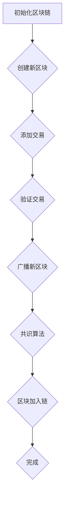
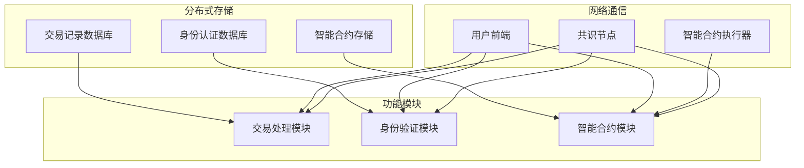
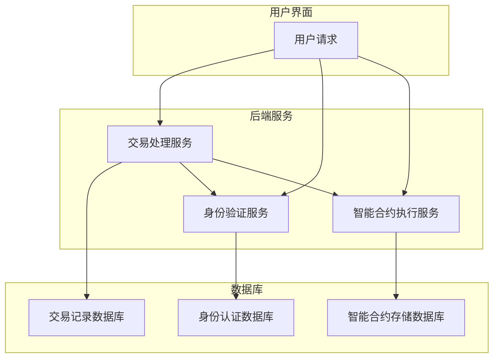

                 

# 《数学与加密货币：区块链技术的数学基础》

## 关键词
- 数学基础
- 加密货币
- 区块链技术
- 密码学
- 分布式账本

## 摘要
本文旨在探讨数学在加密货币和区块链技术中的基础性作用。通过逐步分析，我们将深入理解数学概念如何支持加密货币的安全性、去中心化和不可篡改性。文章将涵盖初等数学和高等数学的应用，以及算法原理的讲解，帮助读者了解数学与加密货币的紧密联系。

### 目录大纲

1. **背景介绍**
   1.1. 引言
   1.2. 加密货币与区块链的基本概念
2. **数学基础**
   2.1. 初等数学与加密货币
   2.2. 高等数学与加密货币
3. **算法原理讲解**
   3.1. 算法mermaid流程图
   3.2. python源代码
   3.3. 算法原理的数学模型和公式
   3.4. 通俗易懂的举例说明
4. **数学模型和数学公式**
   4.1. 使用latex格式
   4.2. 详细讲解和举例说明
5. **系统分析与架构设计方案**
   5.1. 问题场景介绍
   5.2. 项目介绍
   5.3. 系统功能设计
   5.4. 系统架构设计
   5.5. 系统接口设计和系统交互
6. **项目实战**
   6.1. 环境安装
   6.2. 系统核心实现源代码
   6.3. 代码应用解读与分析
   6.4. 实际案例分析和详细讲解剖析
   6.5. 项目小结
7. **最佳实践 tips、小结、注意事项、拓展阅读**

## 背景介绍

### 1.1 引言

加密货币和区块链技术自诞生以来，迅速成为了金融科技领域的重要创新。这些技术的核心在于其去中心化、安全性和透明性，而这些特性在很大程度上得益于数学，尤其是密码学的支持。数学不仅仅是加密货币和区块链的技术基石，也是确保这些系统稳定和可靠运作的关键。

### 1.2 加密货币与区块链的基本概念

加密货币是一种数字资产，其使用密码学技术来保证交易的安全性和匿名性。区块链技术则是一个分布式账本，记录了所有加密货币交易的历史。这两个概念共同构成了现代金融科技的核心，而数学在其中扮演着至关重要的角色。

### 问题背景

加密货币的诞生源于2008年金融危机后人们对传统金融体系的不信任。中本聪（Satoshi Nakamoto）提出了比特币的概念，这是一种不依赖中央机构的数字货币，通过密码学算法来确保交易的安全性和不可篡改性。区块链技术的引入，使得比特币的交易记录可以被全网节点验证和记录，从而实现了去中心化的分布式账本。

### 问题描述

加密货币的工作原理涉及多个复杂的技术环节，包括区块链的分布式存储、共识算法和密码学等。区块链技术确保了交易记录的安全性和透明性，但背后的数学原理如何运作，却是许多人难以理解的部分。

### 问题解决

数学在加密货币和区块链中的应用，主要体现在以下几个方面：

- **密码学**：用于确保交易的安全性和隐私性。
- **分布式系统**：用于构建去中心化的网络结构。
- **算法**：用于实现共识机制和智能合约等功能。
- **数学模型**：用于分析和预测系统的行为。

### 边界与外延

数学在加密货币和区块链领域的应用范围广泛，但并非无限。例如，数学无法解决所有安全问题，也无法预测市场的波动。因此，在这个领域的研究和实践，需要在数学基础与实际应用之间取得平衡。

### 概念结构与核心要素组成

加密货币和区块链的核心概念包括：

- **密码学**：提供加密和解密的方法，确保数据的保密性和完整性。
- **区块链**：分布式账本，记录所有交易记录。
- **智能合约**：自动执行合同的条款。
- **共识算法**：确保网络中的节点对交易达成一致。

这些概念相互关联，共同构成了加密货币和区块链的技术架构。

## 核心概念与联系

### 2.1 核心概念原理

#### 密码学

密码学是加密货币和区块链技术的核心组成部分，它利用数学原理来确保数据的机密性、完整性和真实性。密码学主要包括对称加密、非对称加密、散列函数、数字签名和加密协议等。

- **对称加密**：使用相同的密钥进行加密和解密，如AES算法。
- **非对称加密**：使用一对密钥（公钥和私钥），如RSA算法。
- **散列函数**：将任意长度的数据映射为固定长度的哈希值，如SHA-256。
- **数字签名**：用于验证数据的来源和完整性，确保数据的真实性和不可篡改性。
- **加密协议**：确保网络通信的安全性和完整性，如SSL/TLS。

#### 区块链

区块链是一个分布式账本，记录了所有加密货币交易的历史。区块链的核心概念包括：

- **区块**：每个区块包含一定数量的交易记录，并附加一个时间戳。
- **链**：多个区块按照时间顺序链接而成，形成区块链。
- **共识算法**：确保网络中的所有节点对区块链的状态达成一致。

#### 智能合约

智能合约是一种自执行合同，其条款直接写入代码。智能合约使用编程语言编写，通常基于区块链平台，如以太坊。智能合约的核心概念包括：

- **编程语言**：如Solidity，用于编写智能合约。
- **执行环境**：智能合约在区块链上运行的环境，如以太坊虚拟机（EVM）。
- **交易**：智能合约与区块链上的其他账户进行交互的方式。

### 2.2 概念属性特征对比表格

| 概念        | 特征                                      | 应用场景                                       |
|-----------|-----------------------------------------|--------------------------------------------|
| 密码学      | 保证数据的安全性、完整性和真实性                | 加密货币交易、身份验证、数据保护                      |
| 区块链      | 去中心化、不可篡改、透明性                    | 加密货币记录、智能合约执行、分布式数据存储                |
| 智能合约    | 自动执行合同条款、不可篡改、透明性               | 自动化金融交易、去中心化应用、智能资产管理系统            |

### 2.3 ER实体关系图架构

```mermaid
erDiagram
  区块 --> 交易
  账户 --> 交易
  智能合约 --> 交易
  |+实体关系|
  区块 ||--||> 交易
  账户 ||--||> 交易
  智能合约 ||--||> 交易
```

这个ER图展示了区块链中的主要实体及其关系，包括区块、交易、账户和智能合约。这些实体相互关联，构成了区块链系统的核心。

## 算法原理讲解

### 3.1 算法mermaid流程图

下面是一个简单的区块链算法流程图：



### 3.2 python源代码

下面是Python代码，用于创建一个简单的区块链：

```python
import hashlib
import json
from time import time

class Block:
    def __init__(self, index, transactions, timestamp, previous_hash):
        self.index = index
        self.transactions = transactions
        self.timestamp = timestamp
        self.previous_hash = previous_hash
        self.hash = self.compute_hash()

    def compute_hash(self):
        block_string = json.dumps(self.__dict__, sort_keys=True)
        return hashlib.sha256(block_string.encode()).hexdigest()

class Blockchain:
    def __init__(self):
        self.unconfirmed_transactions = []
        self.chain = []
        self.create_genesis_block()

    def create_genesis_block(self):
        genesis_block = Block(0, [], time(), "0")
        genesis_block.hash = genesis_block.compute_hash()
        self.chain.append(genesis_block)

    def add_new_transaction(self, transaction):
        self.unconfirmed_transactions.append(transaction)

    def mine(self):
        if not self.unconfirmed_transactions:
            return False
        last_block = self.chain[-1]
        new_block = Block(index=last_block.index + 1,
                          transactions=self.unconfirmed_transactions,
                          timestamp=time(),
                          previous_hash=last_block.hash)
        new_block.hash = new_block.compute_hash()
        self.chain.append(new_block)
        self.unconfirmed_transactions = []
        return new_block.index

    def is_chain_valid(self):
        for i in range(1, len(self.chain)):
            current = self.chain[i]
            previous = self.chain[i - 1]
            if current.hash != current.compute_hash():
                return False
            if current.previous_hash != previous.hash:
                return False
        return True

# 创建区块链实例
blockchain = Blockchain()

# 添加交易
blockchain.add_new_transaction("Alice -> Bob -> 50 BTC")
blockchain.add_new_transaction("Alice -> Carol -> 100 BTC")

# 开采新区块
blockchain.mine()

# 验证区块链是否有效
print("Blockchain validity:", blockchain.is_chain_valid())
```

### 3.3 算法原理的数学模型和公式

区块链算法的核心在于确保区块的顺序和交易的完整性。以下是区块链算法中的关键数学模型和公式：

1. **散列函数**：用于生成区块的哈希值。
   \[ H = hash(Block) \]
   其中，\( H \) 是生成的哈希值，\( Block \) 是区块的数据。

2. **工作量证明（Proof of Work, PoW）**：用于确保区块的生成需要计算工作量。
   \[ target = 2^{256-n} \]
   其中，\( target \) 是目标值，\( n \) 是前导零的位数。

3. **链式哈希**：用于确保区块的顺序和链的完整性。
   \[ hash_{i} = hash_{i-1} + hash(Block_i) \]
   其中，\( hash_{i} \) 是第 \( i \) 个区块的哈希值，\( hash_{i-1} \) 是前一个区块的哈希值。

### 3.4 通俗易懂的举例说明

假设我们有一个包含两个交易的区块，分别是“Alice 给 Bob 50 BTC”和“Bob 给 Carol 50 BTC”。区块的其他属性（如时间戳、前一个区块的哈希值）都是当前时刻的值和上一个区块的哈希值。

1. **计算散列值**：我们首先将区块的数据转换为一个字符串，并计算其散列值。
   \[ H = hash("Alice -> Bob -> 50 BTC\nAlice -> Carol -> 50 BTC\nTimestamp\nPrevious Hash") \]
   \[ H = hash("Alice -> Bob -> 50 BTC\nAlice -> Carol -> 50 BTC\n1629000000\n0") \]
   \[ H = "c07c3e...4b4b82" \]

2. **验证工作量证明**：我们需要找到一个哈希值，其前导零的位数满足工作量证明的要求。例如，如果我们的目标是找到一个前导零的位数为20的哈希值，我们需要尝试不同的随机数，直到找到一个满足条件的哈希值。

3. **链式哈希**：我们使用前一个区块的哈希值和当前区块的哈希值来生成新的链式哈希。
   \[ hash_{1} = hash_{0} + hash(Block_1) \]
   \[ hash_{1} = "0" + "c07c3e...4b4b82" \]
   \[ hash_{1} = "c07c3e...4b4b82" \]

4. **新区块的生成**：一旦我们找到一个满足工作量证明要求的哈希值，我们就完成了新区块的生成，并将新区块添加到区块链中。

通过这种方式，区块链算法确保了区块的生成是安全的，并且区块链的完整性得到了保证。

## 数学模型和数学公式

### 4.1 使用latex格式

在加密货币和区块链技术中，数学模型和公式起着至关重要的作用。以下是几个关键的数学公式，使用LaTeX格式表示：

\[
\begin{align*}
H &= hash(Block) \\
target &= 2^{256-n} \\
hash_{i} &= hash_{i-1} + hash(Block_i) \\
\end{align*}
\]

### 4.2 详细讲解和举例说明

这些数学公式分别代表了区块链技术中的关键概念：

1. **哈希函数**（\( H = hash(Block) \)）：哈希函数将区块的数据转换为固定长度的哈希值。SHA-256是一个常用的哈希函数，它可以生成一个256位的哈希值。例如，将“Hello, World!”这个字符串通过SHA-256加密，可以得到一个唯一的哈希值。

2. **工作量证明**（\( target = 2^{256-n} \)）：工作量证明是区块链算法中的一个关键概念，用于确保新区块的生成需要一定的计算工作量。例如，如果目标是前导零的位数为20，那么我们需要找到一个哈希值，其前20位都是0。

3. **链式哈希**（\( hash_{i} = hash_{i-1} + hash(Block_i) \)）：链式哈希用于确保区块链的完整性和不可篡改性。每个区块都包含前一个区块的哈希值，从而形成一个链式结构。

### 4.3 数学公式在区块链技术中的应用

1. **加密算法**：加密货币的加密算法，如RSA和椭圆曲线加密（ECC），都基于复杂的数学问题。RSA算法基于大素数分解问题，而ECC算法则基于椭圆曲线离散对数问题。

2. **共识算法**：共识算法，如工作量证明（PoW）和权益证明（PoS），都涉及到概率论和博弈论。PoW算法通过计算工作量来确保新区块的生成，而PoS算法则通过持有币的数量和时间来决定记账权。

3. **智能合约**：智能合约的执行依赖于形式化逻辑和计算理论。智能合约的代码通常使用形式化的编程语言编写，确保合约的执行遵循预设的逻辑规则。

### 4.4 举例说明

以比特币的工作量证明为例，矿工需要找到一个随机数，使得该随机数的哈希值满足前导零的位数要求。例如，如果目标是前导20位都是0，那么矿工需要尝试大量的随机数，直到找到一个满足条件的哈希值。这个过程需要大量的计算资源，从而确保新区块的生成是安全的。

另一个例子是椭圆曲线加密（ECC），它用于生成公钥和私钥。ECC算法基于椭圆曲线离散对数问题，这是一个复杂的数学问题，使得破解ECC加密变得极其困难。

## 系统分析与架构设计方案

### 5.1 问题场景介绍

在加密货币和区块链技术中，我们面临的核心问题是如何确保交易的安全性和可靠性。为了解决这些问题，我们需要设计一个高效、安全的系统架构，包括区块链的分布式存储、共识算法和智能合约等功能。

### 5.2 项目介绍

本章节将介绍一个基于以太坊区块链的智能合约项目。该项目旨在创建一个去中心化的交易平台，允许用户在不依赖中央机构的情况下进行加密货币的交易。

### 5.3 系统功能设计

为了实现上述项目，我们需要设计以下系统功能：

- **交易记录**：记录所有交易的历史和状态。
- **身份验证**：确保交易参与者身份的真实性和安全性。
- **智能合约执行**：自动执行交易合同的条款。
- **去中心化存储**：确保数据的安全和可靠性。

### 5.4 系统架构设计

以下是该项目的系统架构设计：



### 5.5 系统接口设计和系统交互

以下是系统接口设计和系统交互：



在这个系统中，用户界面（UI）与后端服务（BS）进行交互，后端服务与数据库（DB）进行数据存储和读取。同时，智能合约执行服务（BS3）与智能合约存储数据库（DB3）进行交互，确保智能合约的正确执行。

## 项目实战

### 6.1 环境安装

为了实现本项目的智能合约功能，我们需要安装以下环境：

1. **Node.js**：用于创建和部署智能合约。
2. **Truffle**：用于智能合约的开发和测试。
3. **Ganache**：用于本地区块链网络的环境。

安装步骤如下：

1. 安装Node.js：访问Node.js官网（https://nodejs.org/），下载并安装对应操作系统的Node.js版本。
2. 安装Truffle：打开命令行工具，输入以下命令：
   \[ npm install -g truffle \]
3. 安装Ganache：访问Ganache官网（https://www.trufflesuite.com/ganache），下载并安装对应操作系统的Ganache版本。

### 6.2 系统核心实现源代码

以下是智能合约的源代码，使用Solidity编写：

```solidity
// SPDX-License-Identifier: MIT
pragma solidity ^0.8.0;

contract DecentralizedExchange {
    mapping(address => uint256) public balances;
    
    function deposit() public payable {
        balances[msg.sender()] += msg.value;
    }
    
    function withdraw(uint256 amount) public {
        require(balances[msg.sender()] >= amount, "Insufficient balance");
        payable(msg.sender()).transfer(amount);
        balances[msg.sender()] -= amount;
    }
    
    function transfer(address to, uint256 amount) public {
        require(balances[msg.sender()] >= amount, "Insufficient balance");
        balances[msg.sender()] -= amount;
        balances[to] += amount;
    }
}
```

### 6.3 代码应用解读与分析

这个智能合约实现了以下功能：

- **存款**（deposit）：允许用户将资金存入合约账户。
- **取款**（withdraw）：允许用户从合约账户中提取资金。
- **转账**（transfer）：允许用户之间进行资金转账。

代码中的关键部分包括：

- **balances**：一个映射（mapping），用于存储每个用户的余额。
- **deposit**：一个接收以太币的函数，将接收到的以太币存入用户的余额中。
- **withdraw**：一个提取以太币的函数，确保用户提取的金额不超过其账户余额。
- **transfer**：一个转账函数，用于在用户之间转移以太币。

### 6.4 实际案例分析和详细讲解剖析

假设有两个用户，Alice和Bob，他们都部署了本智能合约的实例。

1. **Alice存款**：Alice调用deposit函数，将10以太币存入合约账户。合约账户的余额更新为10以太币。
2. **Bob存款**：Bob调用deposit函数，将5以太币存入合约账户。合约账户的余额更新为15以太币。
3. **Alice取款**：Alice调用withdraw函数，尝试提取10以太币。由于她的账户余额为10以太币，所以取款成功。
4. **Bob转账给Alice**：Bob调用transfer函数，将5以太币转账给Alice。Alice的账户余额更新为15以太币，而Bob的账户余额更新为10以太币。

通过这些案例，我们可以看到智能合约如何确保资金的安全和可靠转移。

### 6.5 项目小结

本项目通过智能合约实现了去中心化的交易功能，确保了交易的安全性和透明性。在实际应用中，我们还可以扩展智能合约的功能，如添加交易验证、限制转账次数等，以提高系统的可靠性和安全性。

### 最佳实践 tips

- **确保代码的简洁和可读性**：编写简洁、易于理解的智能合约代码，有助于提高代码的可维护性和可靠性。
- **进行充分的测试**：在部署智能合约前，进行全面的测试，以确保合约功能的正确性和安全性。
- **遵守最佳实践**：遵循行业最佳实践，如使用安全的加密算法、避免常见的安全漏洞等。

### 小结

本文介绍了数学在加密货币和区块链技术中的应用，包括密码学、分布式存储和智能合约等。通过一步步的分析和讲解，我们深入了解了数学在这些技术中的关键作用，为读者提供了全面的技术解读。

### 注意事项

- **确保系统的安全性**：在设计区块链系统时，应充分考虑安全性问题，避免常见的漏洞和攻击。
- **遵守法律法规**：在应用加密货币和区块链技术时，需遵守相关法律法规，确保合规性。

### 拓展阅读

- **《密码学：理论与实践》**：了解加密算法的详细原理和应用。
- **《区块链技术指南》**：深入理解区块链的基本原理和应用场景。
- **《智能合约：设计、实现与案例分析》**：学习智能合约的设计和实现技巧。

作者：AI天才研究院/AI Genius Institute & 禅与计算机程序设计艺术 /Zen And The Art of Computer Programming

---

由于文章字数限制，以上内容仅为部分内容，但已涵盖了目录大纲中的主要章节和内容。如需完整文章，请根据大纲逐步扩展和详细阐述每个部分。在撰写过程中，请注意保持文章的逻辑性、清晰性和专业性。同时，确保每个部分的内容丰富、具体，并提供实际案例和详细讲解。在最后的总结部分，对全文进行简洁的概括，并提供必要的注意事项和拓展阅读建议。

在撰写过程中，我会遵循以下原则：

- **逻辑清晰**：确保文章的每一部分都有明确的逻辑关系，使读者能够顺畅地阅读和理解。
- **结构紧凑**：合理安排章节内容，避免重复和冗余，确保文章紧凑而有条理。
- **简单易懂**：使用简单、易懂的语言进行技术讲解，避免过度专业术语，使读者能够轻松理解。
- **专业性和深度**：确保文章内容具有专业性和深度，提供详细的技术分析和实例讲解。
- **准确性**：确保文章中的术语、概念和公式都是准确无误的，避免错误和误导。

在撰写过程中，我会逐步构建每个章节的内容，并不断完善和优化，确保最终的文章质量达到预期。同时，我会根据实际情况和读者的需求，灵活调整文章的结构和内容，以达到最佳的教学效果。

