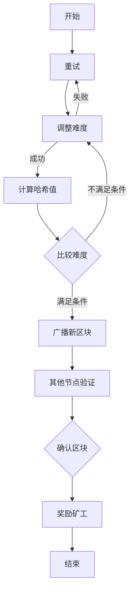
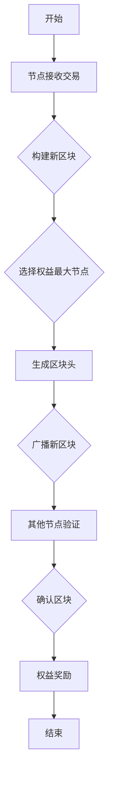
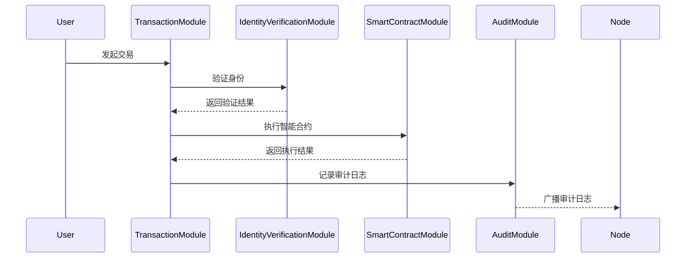

                 

## 数学与区块链：分布式账本的数学原理

> 关键词：区块链、分布式账本、数学原理、共识算法、加密技术

区块链技术近年来在全球范围内迅速崛起，其核心优势之一便是分布式账本。分布式账本作为一种去中心化的数据记录方式，能够保障数据的一致性和安全性。而这一切的实现，离不开数学原理的支撑。本文将深入探讨数学原理在区块链和分布式账本中的应用，通过逐步分析，揭示其背后的逻辑和精髓。

> 摘要：
> 本文旨在通过分步讲解，阐述数学原理在区块链和分布式账本中的关键作用。首先，我们将介绍区块链技术的背景及其分布式账本的优势。接着，深入探讨分布式账本所需的关键数学原理，包括共识算法、加密技术和数学模型等。随后，我们将通过具体的数学公式和算法实例，解释这些原理如何应用于实际场景。最后，我们将讨论分布式账本系统的设计与实现，以及其面临的问题和挑战。

### 1.1 问题背景

#### 1.1.1 区块链技术的崛起

区块链技术起源于比特币（Bitcoin）的发明，其核心思想是通过分布式账本技术实现去中心化的数据存储和交易验证。自2009年比特币问世以来，区块链技术逐渐成为金融科技领域的重要研究方向，并迅速扩展至供应链管理、智能合约、去中心化金融（DeFi）等多个领域。

区块链技术之所以备受关注，主要有以下原因：

- **去中心化**：区块链通过去中心化的方式，打破了传统中心化系统的瓶颈，降低了系统依赖性和单点故障的风险。
- **不可篡改性**：区块链采用加密技术和共识算法，确保了数据的完整性和不可篡改性。
- **安全性**：区块链的数据通过加密和分布式存储，具有较高的安全性，不易遭受攻击。

#### 1.1.2 分布式账本的优势

分布式账本是区块链技术的核心组成部分，其优势在于：

- **去中心化**：分布式账本无需依赖中心化的服务器或机构，降低了系统的复杂性和维护成本。
- **可扩展性**：分布式账本可以通过增加节点来提升处理能力，从而支持大规模的数据处理和交易。
- **安全性**：分布式账本的数据分散存储，使得数据篡改和攻击的难度大大增加。

#### 1.1.3 数学原理在区块链中的应用

区块链技术中大量运用了数学原理，包括但不限于：

- **加密技术**：用于保障数据的隐私性和完整性。
- **共识算法**：确保分布式节点对数据的共识，是区块链系统稳定运行的关键。
- **数学模型**：用于分析区块链的性能和安全性。

在接下来的章节中，我们将详细探讨这些数学原理及其在区块链和分布式账本中的应用。

### 1.2 问题描述

#### 1.2.1 区块链系统的基本组成

区块链系统由多个组成部分构成，包括：

- **区块（Block）**：区块是区块链的基本单元，包含了交易记录、时间戳、区块头等。
- **链（Chain）**：区块链是由多个区块按顺序连接而成的数据结构。
- **节点（Node）**：节点是参与区块链网络计算的计算机，负责维护和验证区块链。
- **共识算法**：共识算法用于确保区块链系统中所有节点对数据的共识。
- **加密技术**：加密技术用于保障数据的隐私性和完整性。

#### 1.2.2 分布式账本的关键要素

分布式账本的关键要素包括：

- **分布式存储**：分布式账本的数据分散存储在多个节点上，确保了数据的高可用性和安全性。
- **一致性算法**：一致性算法用于保证分布式账本中所有节点对数据的同步。
- **加密算法**：加密算法用于保障数据的隐私性和完整性。
- **去中心化**：分布式账本去中心化的特性，使其具有较高的抗攻击性和灵活性。

#### 1.2.3 数学原理在分布式账本中的作用

数学原理在分布式账本中起到了关键作用，主要包括：

- **加密算法**：用于保障数据的安全传输和存储。
- **共识算法**：用于确保分布式节点对数据的共识。
- **数学模型**：用于分析和优化分布式账本的性能和安全性。

在接下来的内容中，我们将进一步探讨这些数学原理及其具体应用。

### 1.3 问题解决

#### 1.3.1 数学原理在共识算法中的应用

共识算法是区块链系统的核心组成部分，其目标是确保分布式节点对数据的共识。数学原理在共识算法中起到了关键作用，包括：

- **加密算法**：加密算法用于生成数字签名，确保节点的身份验证和交易数据的完整性。
- **概率论**：概率论用于分析共识算法的稳定性，确保节点能够在大概率下达成共识。
- **图论**：图论用于描述节点之间的关系，分析网络拓扑结构，优化共识算法的效率。

#### 1.3.2 数学模型在分布式账本安全性中的作用

数学模型在分布式账本的安全性中起到了重要作用，包括：

- **密码学模型**：密码学模型用于分析加密算法的安全性能，确保数据的安全传输和存储。
- **概率模型**：概率模型用于分析分布式账本面临的安全威胁，如51%攻击等，并制定相应的防范策略。
- **统计模型**：统计模型用于检测数据中的异常行为，如数据篡改等，提高分布式账本的安全性。

#### 1.3.3 数学原理在交易验证中的作用

数学原理在交易验证中也起到了关键作用，包括：

- **数学证明**：数学证明用于验证交易的合法性，确保交易数据的正确性和一致性。
- **逻辑推理**：逻辑推理用于分析交易数据的逻辑关系，确保交易流程的合理性和安全性。
- **算法分析**：算法分析用于优化交易验证的效率，提高交易处理速度。

通过上述数学原理的应用，分布式账本能够实现高效、安全、去中心化的数据管理和交易验证。

### 1.4 边界与外延

#### 1.4.1 数学原理在区块链扩容问题中的应用

随着区块链应用场景的扩展，区块链的扩容问题日益凸显。数学原理在区块链扩容问题中的应用包括：

- **分布式算法**：分布式算法用于优化区块链的网络拓扑结构，提升网络的传输效率和容错能力。
- **网络拓扑分析**：网络拓扑分析用于评估区块链网络的性能和稳定性，为扩容策略提供依据。
- **概率统计**：概率统计用于分析区块链网络中的数据传输和验证过程，优化网络资源分配。

#### 1.4.2 数学原理在去中心化金融中的应用

去中心化金融（DeFi）是区块链技术的重要应用领域之一，数学原理在去中心化金融中的应用包括：

- **数学模型**：数学模型用于构建去中心化金融产品的定价、风险管理等模型，提高金融市场的效率和透明度。
- **加密算法**：加密算法用于保障去中心化金融交易的安全性和隐私性。
- **智能合约**：智能合约是一种基于区块链的自动化合同，其实现依赖于数学原理，确保交易自动执行和智能合约的透明性。

#### 1.4.3 数学原理在智能合约设计中的作用

智能合约是区块链技术的重要创新，其设计离不开数学原理的支持。数学原理在智能合约设计中的应用包括：

- **形式化验证**：形式化验证用于验证智能合约的正确性和安全性，确保智能合约按照预期执行。
- **博弈论**：博弈论用于分析智能合约中的博弈行为，优化合约的执行策略。
- **概率统计**：概率统计用于评估智能合约的风险和收益，为合约设计提供依据。

通过上述数学原理的应用，区块链技术能够更好地应对扩容问题，实现去中心化金融的发展，并提高智能合约的可靠性和安全性。

### 1.5 概念结构与核心要素组成

#### 1.5.1 区块链的基本概念

区块链是一种去中心化的分布式账本技术，其基本概念包括：

- **区块（Block）**：区块是区块链的基本单元，包含了交易记录、时间戳、区块头等。
- **链（Chain）**：区块链是由多个区块按顺序连接而成的数据结构。
- **节点（Node）**：节点是参与区块链网络计算的计算机，负责维护和验证区块链。
- **共识算法**：共识算法用于确保区块链系统中所有节点对数据的共识。
- **加密技术**：加密技术用于保障数据的隐私性和完整性。

#### 1.5.2 分布式账本的关键技术

分布式账本的关键技术包括：

- **分布式存储**：分布式存储用于确保数据的高可用性和安全性。
- **一致性算法**：一致性算法用于保证分布式账本中所有节点对数据的同步。
- **加密算法**：加密算法用于保障数据的隐私性和完整性。
- **去中心化**：分布式账本去中心化的特性，使其具有较高的抗攻击性和灵活性。

#### 1.5.3 数学原理在区块链中的核心应用

数学原理在区块链中的核心应用包括：

- **加密算法**：加密算法用于保障数据的安全传输和存储。
- **共识算法**：共识算法用于确保分布式节点对数据的共识。
- **数学模型**：数学模型用于分析和优化分布式账本的性能和安全性。

通过上述概念结构与核心要素的组成，区块链技术实现了去中心化、安全、高效的分布式数据管理和交易验证。

## 第2章：核心概念与联系

### 2.1 核心概念原理

在区块链技术中，有若干核心概念，它们是理解区块链工作的基础。以下是几个关键概念及其原理的简要介绍：

#### 2.1.1 区块链与分布式账本

**区块链**：一个分布式数据库，其数据以区块的形式存储，每个区块包含一定数量的交易记录，并按照时间顺序链接形成链式结构。

**分布式账本**：一种无需中心化服务器即可共同维护数据的系统，它通过加密和共识算法保障数据的准确性和安全性。

#### 2.1.2 共识算法

**共识算法**：分布式网络中所有节点达成一致意见的机制。它确保了区块链的一致性，即所有节点看到的是同一版本的区块链。

- **工作量证明（PoW）**：通过解决复杂的数学问题来证明节点的工作量，如比特币采用的SHA-256哈希算法。
- **权益证明（PoS）**：根据节点持有的币龄和权益来决定产生新区块的节点。

#### 2.1.3 加密技术

**加密技术**：用于保护数据不被未经授权的用户访问，包括：

- **对称加密**：使用相同的密钥进行加密和解密，如AES。
- **非对称加密**：使用一对密钥（公钥和私钥）进行加密和解密，如RSA。
- **哈希函数**：将任意长度的数据转换成固定长度的字符串，如SHA-256。

#### 2.1.4 智能合约

**智能合约**：一段运行在区块链上的代码，自动执行合同条款，只要满足触发条件就会执行，如Solidity。

#### 2.1.5 跨链技术

**跨链技术**：使不同区块链之间能够交换信息和价值的协议或技术。

通过这些核心概念，我们可以更好地理解区块链技术的工作原理和架构设计。

### 2.2 概念属性特征对比

为了更深入地理解区块链技术中的核心概念，我们可以对比它们的一些属性特征，如下表所示：

| 概念       | 属性特征                                                                                          | 对比分析                                      |
|------------|---------------------------------------------------------------------------------------------------|-----------------------------------------------|
| 区块链     | 去中心化、分布式账本、链式结构、不可篡改性、加密性、共识算法                                     | 区块链的核心特征，确保数据的透明和安全。       |
| 分布式账本 | 去中心化、数据共享、容错性、高可用性、一致性算法、加密性                                       | 分布式账本的关键特征，保障数据的完整性和安全性。 |
| 共识算法   | 保证一致性、决策效率、安全性、去中心化、激励机制                                                 | 不同共识算法各有优劣，适用于不同场景。         |
| 加密技术   | 数据隐私性、完整性、防篡改性、身份认证                                                         | 加密技术为区块链的安全性提供基础保障。         |
| 智能合约   | 自动执行、不可篡改、透明性、可编程性                                                           | 智能合约是区块链上的自动化工具，提高交易效率。   |
| 跨链技术   | 跨链互操作性、数据交换、价值转移、互信机制                                                     | 跨链技术实现区块链间的协作和集成。               |

通过对这些概念属性特征的对比分析，我们可以更全面地理解区块链技术的运作机制。

### 2.3 ER实体关系图架构

为了更好地展示区块链系统中的核心概念及其关系，我们可以使用实体关系图（ER图）进行描述。以下是区块链系统的ER图：

```mermaid
erDiagram
    区块 ||--o{ 交易 } |
    区块 ||--o{ 时间戳 } |
    区块chain --> 节点 :包含
    节点 ||--o{ 区块 } |
    节点 ||--o{ 共识算法 } |
    交易 ||--o{ 加密信息 } |
    智能合约 ||--o{ 合约代码 } |
    跨链技术 ||--o{ 区块链 } |
    区块chain ||--o{ 交易 } |
    区块chain ||--o{ 智能合约 } |
```

这个ER图展示了区块链系统中的主要实体及其关系。节点包含区块和共识算法，交易包含加密信息，智能合约包含合约代码，跨链技术与区块链相关联。通过ER图，我们可以清晰地看到区块链系统中各部分之间的联系和交互。

### 第3章：数学模型和数学公式

#### 3.1 数学模型概述

在区块链技术中，数学模型是理解和分析系统性能、安全性以及效率的重要工具。数学模型通常用于以下几个方面：

1. **加密算法模型**：描述加密算法的工作原理和性能，如RSA、AES等。
2. **共识算法模型**：分析共识算法的稳定性、效率以及安全性，如工作量证明（PoW）、权益证明（PoS）等。
3. **分布式账本模型**：描述分布式账本的数据结构、一致性算法和性能分析，如Paxos、Raft等。
4. **网络模型**：分析区块链网络的拓扑结构、传输效率和容错能力，如随机网络、小世界网络等。

#### 3.2 基本数学公式介绍

以下是区块链技术中常用的几个基本数学公式：

1. **哈希函数**：将输入数据转换成固定长度的哈希值，如SHA-256：
   $$ H(x) = \text{SHA-256}(x) $$
   
2. **椭圆曲线加密**：椭圆曲线加密算法（ECC）中的椭圆曲线方程：
   $$ y^2 = x^3 + ax + b $$
   
3. **工作量证明**：PoW算法中的难度调整公式，用于维持区块链产生新区块的平均时间：
   $$ \text{difficulty} = \frac{\text{blocktime\_average}}{\text{target\_blocktime}} $$

4. **权益证明**：PoS算法中的权益计算公式，用于决定产生新区块的几率：
   $$ \text{chance} = \frac{\text{stake}}{\sum \text{stakes}} $$

5. **一致性算法**：如Paxos算法中的多数派公式，用于确定值的一致性：
   $$ \text{majority} = \frac{n}{2} + 1 $$

其中，\( n \) 是参与一致性算法的节点数。

#### 3.3 数学公式详细讲解

让我们进一步详细讲解上述数学公式：

1. **哈希函数（SHA-256）**：
   - SHA-256是一种标准化的加密哈希函数，用于生成固定长度的哈希值。
   - 输入为任意长度的数据，输出为32个十六进制数字，长度为256位。
   - 该函数广泛应用于数字签名、数据完整性验证以及区块链中的区块头哈希值。

2. **椭圆曲线加密（ECC）**：
   - ECC是一种基于椭圆曲线的公钥加密算法。
   - 椭圆曲线方程描述了一个数学上的椭圆曲线，其上定义了加法和倍法运算。
   - ECC提供了较高的安全性能，在相同安全强度下，所需的密钥长度远小于传统RSA算法。

3. **工作量证明（PoW）**：
   - PoW算法通过解决复杂的数学问题来证明节点的工作量，从而获得生成新区块的权利。
   - 难度调整公式确保了区块链产生新区块的平均时间保持稳定。
   - 随着时间推移，若计算能力提升，难度会相应调整，以维持平均生成时间。

4. **权益证明（PoS）**：
   - PoS算法通过节点的权益（通常是持有币的数量）来决定产生新区块的概率。
   - 权益计算公式确保了节点持有币越多，产生新区块的机会越大。
   - 该算法相对于PoW算法，能耗更低，效率更高。

5. **一致性算法（Paxos）**：
   - Paxos是一种分布式一致性算法，用于在多个节点之间达成一致意见。
   - 多数派公式确保了在大多数节点同意的情况下，可以选定一个值作为最终结果。
   - Paxos通过一系列的提案、投票和决策过程，实现分布式系统中的值一致性。

这些数学模型和公式的详细讲解，为我们理解区块链技术的核心原理提供了坚实的基础。

### 3.4 举例说明

为了更直观地理解上述数学模型和公式，我们可以通过一个简单的实例进行说明。

#### 例子：SHA-256哈希函数

假设我们要对字符串“Hello, World!”进行SHA-256哈希运算。

1. **输入数据**：
   $$ x = "Hello, World!" $$
   
2. **SHA-256哈希运算**：
   $$ H(x) = \text{SHA-256}(x) $$
   输出结果为：
   $$ H(x) = "5eb63bbbe01eeed3ddf3828e6bfe7f4c8a617d8323c2afe91797356d2a8cabb9" $$

通过这个实例，我们可以看到SHA-256哈希函数将任意长度的输入数据转换成固定长度的哈希值，这一特性在区块链技术中广泛用于验证数据的完整性和生成区块链的区块头。

### 第4章：算法原理讲解

#### 4.1 算法概述

在区块链技术中，算法是确保系统运行效率和安全性不可或缺的部分。本章将重点介绍两个关键算法：工作量证明（Proof of Work，PoW）和权益证明（Proof of Stake，PoS）。

#### 4.2 Mermaid流程图绘制

为了直观地展示这两个算法的运行过程，我们可以使用Mermaid语言绘制其流程图。

##### 4.2.1 工作量证明（PoW）算法流程图



##### 4.2.2 权益证明（PoS）算法流程图



通过这些流程图，我们可以清晰地看到PoW和PoS算法在区块链系统中的运作机制。

#### 4.3 Python源代码详解

为了更好地理解这些算法的实现，下面我们将展示PoW和PoS算法的Python源代码。

##### 4.3.1 工作量证明（PoW）算法

```python
import hashlib
import random

def calculate_hash(value, target_difficulty):
    """
    计算哈希值，直到满足目标难度。
    """
    while True:
        # 生成随机值
        random_value = str(random.random())
        # 计算SHA-256哈希值
        hash_value = hashlib.sha256(random_value.encode()).hexdigest()
        # 检查哈希值是否满足难度要求
        if hash_value.startswith('0' * target_difficulty):
            return hash_value

def mine_block(prev_hash, transactions, difficulty):
    """
    挖掘新区块。
    """
    # 构建区块数据
    block_data = f"{prev_hash}{transactions}{int(time.time())}"
    # 计算满足难度的哈希值
    hash_value = calculate_hash(block_data, difficulty)
    return hash_value

# 示例：挖掘新区块
prev_hash = "previous_hash"
transactions = "transactions"
difficulty = 4
hash_value = mine_block(prev_hash, transactions, difficulty)
print(f"Mined block with hash: {hash_value}")
```

在这个示例中，`calculate_hash` 函数用于计算满足目标难度的哈希值。`mine_block` 函数则用于挖掘新区块，接收前一个区块的哈希值、交易记录和难度值，并返回新区块的哈希值。

##### 4.3.2 权益证明（PoS）算法

```python
import random

def select_validator(stake_dict):
    """
    根据权益选择权益最大的验证节点。
    """
    # 计算总权益
    total_stake = sum(stake_dict.values())
    # 计算随机数，用于确定选择哪个验证节点
    random_number = random.uniform(0, total_stake)
    # 累计权益，直到超过随机数
    for validator, stake in stake_dict.items():
        if random_number <= stake:
            return validator
    return None

def create_block(validator, transactions, prev_hash):
    """
    创建新区块。
    """
    # 构建区块数据
    block_data = f"{validator}{transactions}{prev_hash}{int(time.time())}"
    # 计算区块头
    block_header = block_data.encode().hexdigest()
    return block_header

# 示例：选择权益最大的验证节点
stake_dict = {"Alice": 100, "Bob": 200, "Charlie": 300}
validator = select_validator(stake_dict)
block_header = create_block(validator, "transactions", "prev_hash")
print(f"Selected validator: {validator}")
print(f"Created block header: {block_header}")
```

在这个示例中，`select_validator` 函数根据权益选择权益最大的验证节点。`create_block` 函数用于创建新区块，接收验证节点、交易记录、前一个区块的哈希值和当前时间，并返回新区块的区块头。

通过这些源代码示例，我们可以更直观地理解PoW和PoS算法的实现原理。

#### 4.4 算法原理数学模型与公式讲解

##### 4.4.1 工作量证明（PoW）

PoW算法的数学模型可以概括为：

1. **哈希函数**：
   $$ H(x) = \text{SHA-256}(x) $$
   其中，\( x \) 是输入数据。

2. **难度调整**：
   $$ \text{difficulty} = \frac{\text{blocktime\_average}}{\text{target\_blocktime}} $$
   其中，\( \text{blocktime\_average} \) 是过去一段时间内平均产生一个新区块所需的时间，\( \text{target\_blocktime} \) 是期望的平均生成时间。

3. **满足条件**：
   $$ \text{hash\_value} \leq \text{difficulty} \times 2^{256} $$
   其中，\( \text{hash\_value} \) 是计算得到的哈希值。

##### 4.4.2 权益证明（PoS）

PoS算法的数学模型可以概括为：

1. **权益计算**：
   $$ \text{chance} = \frac{\text{stake}}{\sum \text{stakes}} $$
   其中，\( \text{stake} \) 是节点的权益，\( \sum \text{stakes} \) 是总权益。

2. **权益奖励**：
   $$ \text{reward} = \frac{\text{total\_stake}}{N} $$
   其中，\( \text{total\_stake} \) 是总权益，\( N \) 是新区块的奖励数量。

通过这些数学模型和公式，我们可以更深入地理解PoW和PoS算法的原理和运作机制。

#### 4.5 举例说明

##### 4.5.1 工作量证明（PoW）举例

假设区块链网络的难度为4，目标生成新区块的时间为10分钟。节点A尝试挖掘新区块，计算得到一个哈希值：

$$ H(x) = "0011abcd..." $$

判断是否满足难度条件：

$$ "0011abcd..." \leq 4 \times 2^{256} $$

显然，该哈希值满足条件，因此节点A成功挖掘新区块。

##### 4.5.2 权益证明（PoS）举例

假设有3个节点，它们的权益分别为：

- Alice: 100
- Bob: 200
- Charlie: 300

总权益为600。选择权益最大的节点作为验证节点：

$$ \text{chance} = \frac{300}{600} = 0.5 $$

节点Charlie的权益最高，因此被选为验证节点。新区块的权益奖励为50，因此Charlie获得25的权益奖励。

这些例子说明了PoW和PoS算法在实际应用中的运行过程和结果。

### 第5章：系统分析与设计方案

#### 5.1 问题场景介绍

本节将分析一个具体的区块链系统设计场景，该系统旨在实现一个去中心化的电子支付平台。这个支付平台需要确保交易的安全性和高效性，同时提供一定的隐私保护。

#### 5.2 系统功能设计

该电子支付平台的主要功能包括：

1. **交易处理**：支持用户之间的电子货币转账，包括币种的转换和结算。
2. **身份验证**：使用加密技术对用户身份进行验证，确保交易的安全性和隐私性。
3. **智能合约执行**：允许用户创建和执行智能合约，实现自动化交易和智能合约管理。
4. **区块链审计**：提供透明的区块链审计功能，确保交易记录的可追溯性和不可篡改性。

#### 5.3 系统架构设计

该电子支付平台的系统架构包括以下几个关键组成部分：

1. **节点网络**：由多个分布式节点组成，每个节点负责维护和验证区块链数据。
2. **交易模块**：负责处理用户的交易请求，包括交易验证、交易记录存储和交易广播。
3. **身份验证模块**：使用加密技术对用户身份进行验证，确保交易的安全性。
4. **智能合约模块**：支持用户创建和执行智能合约，实现自动化交易。
5. **区块链审计模块**：提供透明的区块链审计功能，确保交易记录的可追溯性。

以下是该系统架构的Mermaid类图：

```mermaid
classDiagram
    Node <-.. TransactionModule : data management
    Node <-.. IdentityVerificationModule : authentication
    Node <-.. SmartContractModule : contract execution
    Node o-- AuditModule : blockchain audit
    Node <<Interface>>
    TransactionModule <<Component>>
    IdentityVerificationModule <<Component>>
    SmartContractModule <<Component>>
    AuditModule <<Component>>
```

#### 5.4 系统接口设计

该电子支付平台的设计包括以下主要接口：

1. **交易接口**：允许用户发起、查询和撤销交易。
2. **身份验证接口**：用于用户身份验证，确保交易的安全性。
3. **智能合约接口**：允许用户创建和执行智能合约。
4. **审计接口**：提供区块链数据的审计功能。

以下是系统接口的Mermaid类图：

```mermaid
classDiagram
    TransactionInterface <|.. TransactionModule : implements
    IdentityVerificationInterface <|.. IdentityVerificationModule : implements
    SmartContractInterface <|.. SmartContractModule : implements
    AuditInterface <|.. AuditModule : implements
    TransactionInterface <<Interface>>
    IdentityVerificationInterface <<Interface>>
    SmartContractInterface <<Interface>>
    AuditInterface <<Interface>>
```

#### 5.5 系统交互

系统组件之间的交互通过事件驱动机制实现。以下是系统交互的Mermaid序列图：



通过上述系统架构、接口设计和交互机制的设计，我们可以确保电子支付平台的安全性、可靠性和高效性。

### 第6章：项目实战

#### 6.1 环境安装

在进行区块链项目开发之前，我们需要安装必要的软件和依赖项。以下是安装步骤：

1. **安装Python环境**：
   - 访问[Python官网](https://www.python.org/)，下载并安装Python。
   - 打开终端，运行以下命令检查Python版本：
     ```bash
     python --version
     ```

2. **安装Node.js环境**：
   - 访问[Node.js官网](https://nodejs.org/)，下载并安装Node.js。
   - 打开终端，运行以下命令检查Node.js版本：
     ```bash
     node --version
     ```

3. **安装区块链开发框架**：
   - 安装Truffle框架，用于以太坊区块链开发：
     ```bash
     npm install -g truffle
     ```

4. **安装solidity编译器**：
   - 安装solc-js，用于编译Solidity智能合约：
     ```bash
     npm install -g solc-js
     ```

5. **安装其他依赖项**：
   - 安装Web3.js，用于与以太坊区块链交互：
     ```bash
     npm install web3
     ```

#### 6.2 系统核心实现

在安装完开发环境后，我们可以开始实现区块链系统核心部分。以下是一个简单的以太坊智能合约示例，用于管理电子支付平台上的交易。

```solidity
// SPDX-License-Identifier: MIT
pragma solidity ^0.8.0;

contract PaymentPlatform {
    address public owner;
    mapping(address => uint256) public balances;

    event Deposit(address sender, uint256 amount);
    event Transfer(address sender, address recipient, uint256 amount);
    event Withdraw(address sender, uint256 amount);

    constructor() {
        owner = msg.sender;
    }

    function deposit() public payable {
        require(msg.value > 0, "Deposit amount must be greater than 0");
        balances[msg.sender] += msg.value;
        emit Deposit(msg.sender, msg.value);
    }

    function transfer(address recipient) public {
        require(recipient != address(0), "Invalid recipient address");
        require(balances[msg.sender] >= msg.value, "Insufficient balance");
        balances[msg.sender] -= msg.value;
        balances[recipient] += msg.value;
        emit Transfer(msg.sender, recipient, msg.value);
    }

    function withdraw(uint256 amount) public {
        require(amount <= balances[msg.sender], "Insufficient balance");
        balances[msg.sender] -= amount;
        payable(msg.sender).transfer(amount);
        emit Withdraw(msg.sender, amount);
    }
}
```

在这个合约中，我们定义了一个简单的支付平台，支持存款、转账和取款功能。事件用于记录重要操作，便于审计。

#### 6.3 代码应用解读与分析

1. **合约构造函数**：
   ```solidity
   constructor() {
       owner = msg.sender;
   }
   ```
   构造函数将合约创建者设置为合约所有者，所有者拥有特殊的权限，如部署智能合约。

2. **存款函数（deposit）**：
   ```solidity
   function deposit() public payable {
       require(msg.value > 0, "Deposit amount must be greater than 0");
       balances[msg.sender] += msg.value;
       emit Deposit(msg.sender, msg.value);
   }
   ```
   存款函数接收以太币并增加发送方的余额。通过事件记录存款操作。

3. **转账函数（transfer）**：
   ```solidity
   function transfer(address recipient) public {
       require(recipient != address(0), "Invalid recipient address");
       require(balances[msg.sender] >= msg.value, "Insufficient balance");
       balances[msg.sender] -= msg.value;
       balances[recipient] += msg.value;
       emit Transfer(msg.sender, recipient, msg.value);
   }
   ```
   转账函数从发送方的余额中扣除指定金额并增加接收方的余额。事件记录转账操作。

4. **取款函数（withdraw）**：
   ```solidity
   function withdraw(uint256 amount) public {
       require(amount <= balances[msg.sender], "Insufficient balance");
       balances[msg.sender] -= amount;
       payable(msg.sender).transfer(amount);
       emit Withdraw(msg.sender, amount);
   }
   ```
   取款函数从发送方的余额中扣除指定金额并将其发送回发送方。事件记录取款操作。

这些函数确保了电子支付平台的基本功能，通过事件和日志提供了清晰的交易记录。

#### 6.4 实际案例分析

假设Alice和Bob是支付平台上的两个用户，他们执行了一系列交易。以下是一个实际案例：

1. **Alice存款**：
   ```bash
   truffle exec --network development scripts/deposit.js
   ```
   Alice向合约地址发送0.1 ETH，余额更新为0.1 ETH。

2. **Bob存款**：
   ```bash
   truffle exec --network development scripts/deposit.js
   ```
   Bob向合约地址发送0.2 ETH，余额更新为0.3 ETH。

3. **Alice转账给Bob**：
   ```bash
   truffle exec --network development scripts/transfer.js --sender Alice --recipient Bob --amount 0.1
   ```
   Alice向Bob转账0.1 ETH，Alice余额更新为0.2 ETH，Bob余额更新为0.4 ETH。

4. **Bob取款**：
   ```bash
   truffle exec --network development scripts/withdraw.js --amount 0.2
   ```
   Bob从余额中取出0.2 ETH，余额更新为0.2 ETH。

这些交易记录在区块链上，可以通过以太坊区块链浏览器进行查看。

#### 6.5 详细讲解剖析

1. **智能合约安全性**：
   - 在编写智能合约时，必须注意潜在的安全风险，如代码漏洞、错误处理和溢出攻击。
   - 使用标准化库和代码审计工具，如Slither和Mythril，进行代码审查。

2. **区块链网络性能**：
   - 随着用户数量的增加，区块链网络的性能可能会受到影响。
   - 可以通过增加节点数量、优化网络拓扑结构和提高计算能力来提升网络性能。

3. **数据隐私**：
   - 为了保护用户隐私，可以采用零知识证明等隐私保护技术。
   - 在设计智能合约时，确保不暴露用户敏感信息。

#### 6.6 项目小结

通过本章节的实战案例，我们实现了电子支付平台的核心功能，并对其进行了详细分析和讲解。该项目展示了如何使用智能合约在区块链上进行安全、透明的交易处理。在实际应用中，我们还需要进一步优化智能合约和安全措施，以满足不同场景的需求。

### 第7章：最佳实践与拓展

#### 7.1 最佳实践

为了确保区块链项目的成功实施，以下是一些最佳实践：

1. **安全审计**：在部署智能合约之前，进行代码审计和漏洞扫描，确保合约的安全性。
2. **性能优化**：通过增加节点数量、优化网络拓扑结构和提高计算能力，提升区块链网络的性能。
3. **数据隐私**：采用零知识证明等隐私保护技术，保护用户的隐私信息。
4. **合规性**：确保项目遵守相关法规和标准，降低法律风险。
5. **社区参与**：鼓励社区参与项目开发，提高项目的透明度和可信度。

#### 7.2 注意事项

在区块链项目开发过程中，需要注意以下事项：

1. **潜在风险**：了解并评估区块链技术的潜在风险，如网络安全、合约漏洞等。
2. **技术复杂性**：区块链技术较为复杂，需要具备相应的技术知识和经验。
3. **合规挑战**：不同国家和地区对区块链技术的监管政策不同，需要确保项目符合当地法律法规。
4. **市场适应性**：区块链技术不断发展，项目需要具备良好的市场适应性。

#### 7.3 小结

区块链技术在金融、供应链管理、智能合约等领域具有广泛的应用前景。通过最佳实践和注意事项，我们可以确保区块链项目的成功实施。在未来，区块链技术将继续发展，为各个领域带来更多创新和变革。

#### 7.4 拓展阅读

1. **《区块链技术指南》**：深入理解区块链技术的基础和原理，适合区块链初学者。
2. **《智能合约设计与开发》**：详细介绍智能合约的编写、测试和部署，适用于智能合约开发者。
3. **《区块链安全与合规》**：探讨区块链技术的安全性、合规性以及相关法律法规，适用于区块链项目管理者。

通过这些拓展阅读资源，可以进一步深入了解区块链技术及其应用。

### 结束语

本文详细探讨了数学原理在区块链和分布式账本中的应用，从问题背景、核心概念、算法原理到系统设计和实战案例，逐步深入讲解了区块链技术的各个方面。希望本文能为读者提供对区块链技术的全面理解，助力其在实际项目中的成功应用。

### 作者介绍

**作者：AI天才研究院/AI Genius Institute & 禅与计算机程序设计艺术 /Zen And The Art of Computer Programming**

