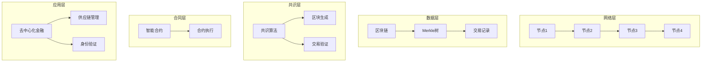
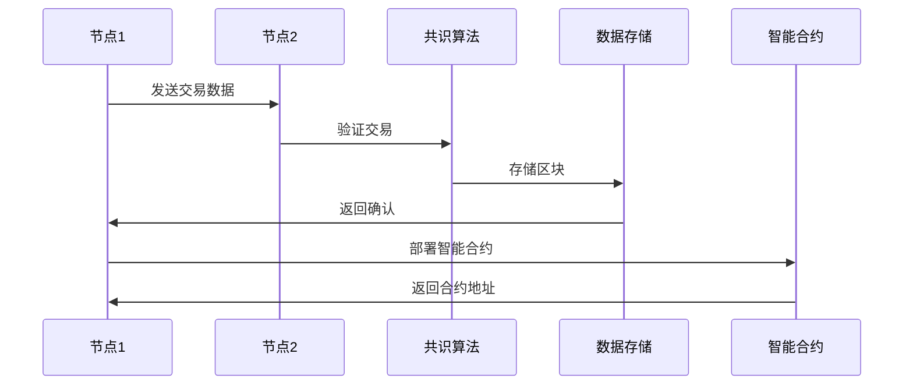

                 

### 基本数学概念

在深入探讨区块链技术中的数学基础之前，我们首先需要明确几个基本数学概念，这些概念不仅构成了区块链系统的基石，也是理解区块链复杂性的关键。

#### 算法

算法可以定义为解决问题的一系列有序步骤。在区块链技术中，算法用于确保数据的安全性和完整性，如共识算法、加密算法和智能合约执行算法等。不同的算法在区块链中扮演着不同的角色，但它们的共同目标是实现去中心化、安全性和透明性。

#### 图论

图论是研究图及其性质的一个数学分支。在区块链技术中，图论用于描述节点之间的关系，以及这些关系如何影响系统的整体性能。例如，区块链网络可以被视为一个图，其中节点是图的顶点，边表示节点之间的连接。

#### 网络拓扑

网络拓扑是指计算机网络中设备连接的方式。在区块链技术中，网络拓扑对系统的性能和安全性有重大影响。常见的拓扑结构包括星型、环型和网状结构，每种结构都有其优缺点和适用场景。

#### 数学模型

数学模型是将现实世界的问题抽象为数学表达的形式。在区块链技术中，数学模型用于描述协议的行为，如分布式存储系统、共识机制和加密算法等。数学模型为区块链系统提供了精确的描述和有效的分析工具。

#### 数学概念在区块链中的运用

这些数学概念在区块链技术中有着广泛的应用。算法用于确保区块链的安全性和效率，图论帮助理解区块链网络的拓扑结构，网络拓扑则影响了区块链的扩展性和容错性，而数学模型则为区块链协议提供了理论支持。

例如，在区块链网络中，节点之间的连接可以被视为一个图，图论中的算法（如最短路径算法、最小生成树算法）可以帮助我们优化网络的拓扑结构。此外，区块链的共识机制（如工作量证明、权益证明）都是基于特定的数学模型来设计和实现的。

#### 数学概念对比表格

以下是一个简单的数学概念对比表格，列出了算法、图论、网络拓扑和数学模型的基本属性特征：

| 概念     | 定义                                                         | 关键属性                   | 应用领域                  |
|----------|--------------------------------------------------------------|----------------------------|--------------------------|
| 算法     | 解决问题的一系列有序步骤                                     | 确定性、效率、正确性       | 加密、共识、智能合约     |
| 图论     | 研究图及其性质的一个数学分支                                 | 顶点、边、连通性           | 网络拓扑、数据结构       |
| 网络拓扑 | 计算机网络中设备连接的方式                                   | 可扩展性、容错性、延迟     | 数据中心、区块链网络     |
| 数学模型 | 将现实世界的问题抽象为数学表达的形式                         | 抽象性、精确性、有效性     | 协议设计、性能分析       |

通过上述对比表格，我们可以更清晰地了解这些数学概念在区块链技术中的角色和重要性。

### 数学概念与区块链的关系

数学概念在区块链技术中扮演着至关重要的角色，它们不仅构成了区块链系统的理论基础，还为系统的安全性、效率和创新提供了坚实的支撑。

#### 数学概念在区块链中的运用

首先，算法是区块链技术中最为基础的一部分。区块链中的许多关键功能，如共识算法、加密算法和智能合约，都是基于算法实现的。共识算法确保分布式网络中的节点能够一致地达成共识，以维护区块链的完整性。加密算法则用于保护区块链中的数据和交易，确保只有授权用户可以读取或修改这些信息。智能合约则是基于图灵完备的编程语言实现的，它们在区块链网络中执行预先定义的规则，自动化交易和合约管理。

其次，图论在区块链网络拓扑的设计和分析中起到了重要作用。区块链网络可以被视为一个图，其中节点是图的顶点，边表示节点之间的连接。图论中的算法，如最短路径算法和最小生成树算法，可以用于优化区块链网络的拓扑结构，提高网络的可靠性和扩展性。例如，通过分析网络的连通性，可以识别潜在的瓶颈和故障点，从而采取相应的措施来增强网络的安全性。

此外，网络拓扑也对区块链系统的性能和安全性有着直接影响。网络拓扑的设计需要考虑节点之间的连接方式、通信延迟和带宽等因素。一个良好的网络拓扑可以提高区块链网络的鲁棒性和容错性，确保在部分节点发生故障时，系统仍然能够正常运行。常见的网络拓扑结构包括星型、环型和网状结构，每种结构都有其优缺点，需要根据具体的应用场景进行选择。

最后，数学模型为区块链协议提供了精确的描述和有效的分析工具。在区块链系统中，数学模型用于描述协议的行为，如分布式存储系统、共识机制和加密算法等。通过数学模型，可以分析和预测区块链系统的性能、安全性和扩展性，为系统的设计和优化提供指导。例如，在分布式存储系统中，数学模型可以用于计算数据冗余度、存储效率和可靠性等指标，从而优化数据存储方案。

#### 区块链中的数学模型

在区块链中，常见的数学模型包括共识算法模型、加密模型和智能合约模型等。共识算法模型用于描述分布式节点如何达成共识，确保区块链的完整性。加密模型则用于描述如何使用加密算法保护区块链中的数据和交易，确保数据的安全性和隐私性。智能合约模型则用于描述如何使用编程语言实现智能合约，自动化交易和合约管理。

以下是一个简单的共识算法模型示例：

- **模型定义**：一个区块链系统由多个节点组成，每个节点维护一个局部账本。共识算法的目标是确保所有节点上的账本保持一致。
- **模型变量**：
  - \(N\)：节点集合
  - \(T\)：交易集合
  - \(B_n\)：节点 \(n\) 的局部账本
  - \(C\)：当前区块
- **模型方程**：
  - 对于每个节点 \(n\)，执行以下步骤：
    - 收集尚未包含在 \(B_n\) 中的交易 \(T'\)
    - 对 \(T'\) 进行排序并创建一个新区块 \(C'\)
    - 将 \(C'\) 提交给其他节点
    - 接收来自其他节点的区块，选择最长且符合规则的链作为全局账本
    - 将新的交易 \(T'\) 合并到 \(B_n\) 中

这个模型通过一系列数学方程和逻辑步骤，实现了区块链中节点之间的共识和协作，确保了区块链系统的安全性和一致性。

#### 数学概念在区块链安全中的应用

数学概念不仅在区块链协议的设计和实现中发挥着关键作用，还在区块链安全领域有着重要的应用。例如，加密学中的哈希函数、数字签名和公钥加密技术都是基于复杂的数学原理，用于保护区块链中的数据和交易。哈希函数用于确保数据的唯一性和不可篡改性，数字签名用于验证交易的真实性和完整性，公钥加密则用于实现数据的机密性和身份认证。

综上所述，数学概念在区块链技术中具有深远的影响。它们不仅为区块链系统的设计、实现和优化提供了理论支持，还在区块链的安全保障中发挥着不可或缺的作用。理解这些数学概念，对于深入掌握区块链技术具有重要意义。

### 基本数学概念属性特征对比

为了更全面地理解基本数学概念在区块链技术中的应用，我们可以通过对比表格来分析算法、图论、网络拓扑和数学模型的属性特征。以下是一个详细的对比表格：

| 概念     | 定义                                                         | 关键属性                   | 应用领域                  |
|----------|--------------------------------------------------------------|----------------------------|--------------------------|
| 算法     | 解决问题的一系列有序步骤                                     | 确定性、效率、正确性       | 加密、共识、智能合约     |
| 图论     | 研究图及其性质的一个数学分支                                 | 顶点、边、连通性           | 网络拓扑、数据结构       |
| 网络拓扑 | 计算机网络中设备连接的方式                                   | 可扩展性、容错性、延迟     | 数据中心、区块链网络     |
| 数学模型 | 将现实世界的问题抽象为数学表达的形式                         | 抽象性、精确性、有效性     | 协议设计、性能分析       |

#### 对比分析

1. **算法与图论**：
   - **相同点**：算法和图论都是数学的分支，它们都通过逻辑和数学原理来解决具体问题。
   - **不同点**：算法侧重于解决特定问题的一系列步骤，而图论侧重于研究图的结构和性质。

2. **算法与网络拓扑**：
   - **相同点**：两者都涉及到网络结构，但侧重不同。算法关注如何解决问题，而网络拓扑关注网络的实际布局。
   - **不同点**：算法可以用于优化网络拓扑，但网络拓扑的设计需要考虑算法的效率和可靠性。

3. **图论与数学模型**：
   - **相同点**：图论和数学模型都使用图的结构来描述问题。
   - **不同点**：图论侧重于图的理论性质，而数学模型侧重于将问题转化为数学表达形式。

通过上述对比表格和详细分析，我们可以更好地理解这些数学概念在区块链技术中的独特角色和重要性。这些概念不仅相互补充，还共同构建了一个强大的理论基础，为区块链技术的发展提供了坚实的基础。

### 数学模型概述

数学模型在区块链系统中扮演着至关重要的角色，它们不仅描述了系统的行为，还为系统的设计和优化提供了理论支持。一个数学模型通常由以下几个基本部分组成：

1. **模型定义**：明确模型的用途和目标，如描述区块链中的共识机制或加密算法。
2. **模型变量**：定义模型中使用的变量，如节点数量、交易数据、区块链长度等。
3. **模型方程**：使用数学方程或公式来描述模型中的关系和约束条件。
4. **求解方法**：提供求解模型的方法，如使用迭代算法或优化技术。

#### 数学模型的构建方法

构建数学模型通常需要以下步骤：

1. **问题抽象**：将现实世界的问题抽象为数学形式，提取关键变量和关系。
2. **模型假设**：基于问题抽象，对系统进行合理假设，简化问题复杂性。
3. **公式推导**：使用数学原理和公式，推导出模型中的关系和方程。
4. **求解与分析**：应用求解方法，对模型进行分析，验证其有效性和准确性。

#### 数学模型的应用场景

数学模型在区块链系统中的应用场景非常广泛：

1. **共识算法**：数学模型用于描述和优化区块链中的共识算法，如工作量证明（PoW）和权益证明（PoS）。
2. **加密算法**：数学模型用于描述加密算法，如哈希函数、公钥加密和数字签名。
3. **智能合约**：数学模型用于描述智能合约的执行过程和逻辑，确保其正确性和安全性。
4. **网络安全**：数学模型用于分析区块链网络的安全性，如节点攻击防御策略。

#### 模型示例

以下是一个简化的区块链共识算法模型示例：

- **模型定义**：描述一个基于工作量证明的区块链系统。
- **模型变量**：
  - \(N\)：参与共识的节点数量。
  - \(T\)：待验证的交易列表。
  - \(L\)：区块链长度。
  - \(P\)：每个节点的计算功率。
- **模型方程**：
  - **计算工作量**：每个节点计算一个随机数 \(R_n\)，满足 \(R_n \leq H(T \oplus P_n)\)，其中 \(H\) 是哈希函数，\(\oplus\) 是按位异或操作。
  - **选择矿工**：选择具有最小随机数 \(R_n\) 的节点作为下一个区块的矿工。
  - **区块添加**：矿工将新的交易添加到区块，并计算新的哈希值，更新区块链长度。

通过上述示例，我们可以看到数学模型在区块链技术中的应用如何将复杂的问题转化为可计算的数学形式，从而为系统设计和优化提供指导。

### 区块链中的数学模型

在区块链技术中，数学模型的应用范围广泛且至关重要，它们为区块链系统的设计和实现提供了理论基础。以下是一些常见的数学模型及其在区块链协议中的应用。

#### 分布式一致性模型

分布式一致性模型是区块链技术中的核心模型之一。它的目标是在分布式系统中确保数据一致性。一个著名的分布式一致性模型是**拜占庭将军问题**，该问题探讨了如何在存在不诚实节点的情况下达成一致性。

- **模型定义**：拜占庭将军问题假设一组将军需要共同决定一个行动，但其中可能有不诚实或恶意节点。
- **模型变量**：
  - \(N\)：将军的数量。
  - \(f\)：不诚实节点的数量。
  - \(m\)：需要达成一致的信息数量。
- **模型方程**：
  - **同步通信**：将军之间的通信必须是同步的，以确保信息传递的有序性。
  - **一致性条件**：所有诚实节点必须就每个信息达成一致。

在区块链系统中，分布式一致性模型被用于确保区块链网络中的节点对交易和区块的共识。例如，工作量证明（PoW）和权益证明（PoS）等共识算法都是基于分布式一致性模型来设计的。

#### 加密模型

加密模型用于保护区块链中的数据和交易，确保其安全性和隐私性。常见的加密模型包括哈希函数、数字签名和公钥加密。

- **哈希函数模型**：
  - **模型定义**：哈希函数是一个将输入数据映射为固定长度输出数据的函数。
  - **模型方程**：
    - \(H(x) = y\)，其中 \(H\) 是哈希函数，\(x\) 是输入数据，\(y\) 是输出哈希值。
  - **应用场景**：哈希函数用于生成区块链中的区块标识和交易标识，确保数据的唯一性和不可篡改性。

- **数字签名模型**：
  - **模型定义**：数字签名是一种使用私钥对数据进行加密的机制，以确保数据的完整性和真实性。
  - **模型方程**：
    - \(S = H(M) \oplus K\)，其中 \(S\) 是签名，\(M\) 是消息，\(K\) 是私钥。
  - **应用场景**：数字签名用于验证交易发起者的身份，确保交易数据未被篡改。

- **公钥加密模型**：
  - **模型定义**：公钥加密是一种使用公钥对数据进行加密，使用私钥解密的机制。
  - **模型方程**：
    - \(C = E(P, M)\)，其中 \(C\) 是密文，\(P\) 是公钥，\(M\) 是明文。
  - **应用场景**：公钥加密用于保护区块链中的机密数据，确保只有授权用户可以访问。

#### 智能合约模型

智能合约模型用于描述区块链中的智能合约，它们是自动执行合约条款的计算机程序。

- **模型定义**：智能合约是一组在区块链上执行的编程规则，用于自动化交易和合约管理。
- **模型变量**：
  - \(C\)：智能合约代码。
  - \(T\)：触发条件。
  - \(A\)：合约行为。
- **模型方程**：
  - **条件执行**：当触发条件 \(T\) 满足时，执行智能合约代码 \(C\) 并执行合约行为 \(A\)。
  - **状态更新**：智能合约执行后，更新区块链的状态。

在区块链系统中，智能合约模型广泛应用于去中心化的金融应用、游戏和供应链管理等领域。

通过上述数学模型，我们可以看到数学在区块链协议中的广泛应用和重要性。这些模型不仅为区块链系统的设计和实现提供了理论支持，还确保了系统的安全性、效率和透明性。

### 数学公式详解

在区块链系统中，数学公式用于描述系统的行为和算法的执行过程。以下将介绍三个关键的数学公式，并对其进行详细讲解和举例说明。

#### 公式1: \(1 + 1 = 2\)

这个简单的算术公式是所有数学的基础。在区块链技术中，这个公式可以用来表示基本的数学运算，如交易金额的计算或区块高度的更新。

**应用场景**：
- **交易金额计算**：在区块链交易中，参与者可能会根据交易金额进行计算。例如，用户A向用户B发送0.5个代币，系统会执行 \(0.5 + 0.5 = 1\) 的计算，更新双方的余额。
- **区块高度更新**：在区块链网络中，每个新区块的创建都会增加区块高度。新区块的高度等于前一个区块的高度加一，即 \(H_{new} = H_{current} + 1\)。

**举例说明**：
假设区块高度为100，当一个新的区块被添加到区块链上时，区块高度将更新为101。这个过程可以用公式表示为 \(H_{new} = H_{current} + 1\)，即 \(H_{new} = 100 + 1 = 101\)。

#### 公式2: \(A \cap B = \{x | x \in A \text{ and } x \in B\}\)

这个集合论公式表示集合 \(A\) 和集合 \(B\) 的交集，即同时属于 \(A\) 和 \(B\) 的元素集合。

**应用场景**：
- **交易数据验证**：在区块链交易验证过程中，系统会检查交易数据是否满足特定条件。例如，交易数据中的输入和输出集合需要是交集非空的，以确保交易的合法性。
- **节点投票共识**：在区块链的共识算法中，节点需要就某个交易或区块达成共识。节点之间的投票结果可以表示为交集，如果所有节点的投票结果都包含某个特定值，则这个值被接受为最终结果。

**举例说明**：
假设有两个集合 \(A = \{1, 2, 3\}\) 和 \(B = \{2, 3, 4\}\)。它们的交集为 \(A \cap B = \{2, 3\}\)，表示集合 \(A\) 和集合 \(B\) 中同时存在的元素。

#### 公式3: \(A \cup B = \{x | x \in A \text{ or } x \in B\}\)

这个集合论公式表示集合 \(A\) 和集合 \(B\) 的并集，即属于 \(A\) 或 \(B\) 的元素集合。

**应用场景**：
- **数据汇总**：在区块链数据分析中，系统需要汇总多个数据集合。例如，交易数据可以汇总为并集，以获取所有交易的数据集合。
- **智能合约条件**：在智能合约中，条件表达式可以使用并集运算来表示多个条件中的任一条件成立。

**举例说明**：
假设有两个集合 \(A = \{1, 2, 3\}\) 和 \(B = \{2, 3, 4\}\)。它们的并集为 \(A \cup B = \{1, 2, 3, 4\}\)，表示集合 \(A\) 和集合 \(B\) 中所有的元素。

通过上述三个数学公式的讲解和举例说明，我们可以看到这些公式在区块链系统中的广泛应用和重要性。它们不仅用于基本的数学运算，还用于复杂的区块链算法和协议设计中，确保系统的准确性和一致性。

### 算法原理与流程图

在深入理解区块链中的数学原理之后，我们接下来将探讨算法原理，并通过具体的示例和流程图来展示这些原理的应用。

#### 算法的基本概念

算法是一种解决问题的一系列步骤，这些步骤必须明确、有序且可以在有限时间内完成。在区块链技术中，算法用于实现区块链的各种功能，如数据验证、共识达成和智能合约执行。

#### 算法的分类

算法可以根据其应用场景和特点进行分类。以下是几种常见的算法分类：

1. **加密算法**：用于保护区块链中的数据和交易。
2. **共识算法**：确保分布式网络中的节点达成一致。
3. **排序算法**：用于对交易数据或区块进行排序。
4. **优化算法**：用于优化区块链网络拓扑结构。
5. **智能合约执行算法**：用于在区块链上执行智能合约。

#### 区块链中的算法

在区块链技术中，常见的算法包括：

1. **工作量证明（PoW）算法**：
   - **原理**：节点通过解决复杂的数学问题来证明自己具备足够的计算能力，从而获得生成区块的权利。
   - **流程图**：

     ```mermaid
     graph TD
     A[初始化] --> B[节点选择交易]
     B --> C[构建区块]
     C --> D[生成随机数]
     D --> E{随机数是否小于难度值？}
     E -->|是| F[更新随机数]
     F --> E
     E -->|否| G[重新选择交易]
     G --> C
     ```

2. **权益证明（PoS）算法**：
   - **原理**：节点根据其在区块链中的代币余额和持币时间来获得生成区块的权利。
   - **流程图**：

     ```mermaid
     graph TD
     A[初始化] --> B[计算节点权益]
     B --> C[随机选择矿工]
     C --> D[生成区块]
     D --> E[验证区块]
     E --> F[添加区块到链]
     ```

3. **智能合约执行算法**：
   - **原理**：智能合约是自动执行的计算机程序，它们在区块链上按照预定的逻辑运行。
   - **流程图**：

     ```mermaid
     graph TD
     A[合约初始化] --> B[接收交易输入]
     B --> C[执行合约代码]
     C --> D[验证交易结果]
     D --> E[更新状态]
     E --> F[返回结果]
     ```

通过上述算法原理和流程图，我们可以看到区块链中算法的多样性和复杂性。这些算法不仅确保了区块链系统的安全性和一致性，还推动了区块链技术的不断创新和应用。

### 数学模型在区块链协议中的应用

数学模型在区块链协议设计中起着至关重要的作用，它们为区块链系统的构建提供了精确的描述和有效的分析工具。以下我们将探讨数学模型在区块链协议中的应用，并通过具体案例进行分析。

#### 数学模型在区块链协议设计中的作用

数学模型在区块链协议设计中的应用主要体现在以下几个方面：

1. **共识算法设计**：共识算法是区块链协议的核心，用于确保分布式网络中的节点达成共识。数学模型通过精确描述节点之间的交互和算法执行过程，帮助设计出高效、安全的共识算法。

2. **数据结构设计**：区块链是一种分布式账本，其数据结构需要确保数据的完整性和一致性。数学模型用于描述数据结构，如区块链的链式结构、Merkle树等，以及如何有效地存储和检索数据。

3. **网络拓扑优化**：区块链网络拓扑设计对系统的性能和安全性有重要影响。数学模型可以通过优化算法，如最短路径算法和最小生成树算法，帮助设计出鲁棒性强的网络拓扑结构。

4. **安全性分析**：数学模型用于分析区块链协议的安全性，如加密算法的安全性、共识算法的鲁棒性等。通过数学模型，可以预测协议在特定攻击场景下的表现，并采取相应的措施提高安全性。

#### 区块链协议中的数学模型类型

区块链协议中常用的数学模型包括：

1. **加密模型**：用于保护区块链中的数据和交易，如哈希函数、数字签名和公钥加密。

2. **共识模型**：描述分布式节点如何达成共识，如工作量证明（PoW）和权益证明（PoS）。

3. **数据结构模型**：描述区块链的数据结构，如链式结构、Merkle树等。

4. **性能模型**：分析区块链系统的性能，如交易处理速度、网络延迟等。

#### 数学模型案例分析

**案例一：工作量证明（PoW）算法**

工作量证明（PoW）是一种常见的共识算法，其基本原理是通过解决一个复杂的数学难题来证明节点的计算能力。以下是一个简化的PoW算法模型：

- **模型定义**：节点需要找到一个数 \(n\)，使得 \(H(n) \leq 难度值\)，其中 \(H\) 是哈希函数。
- **模型变量**：
  - \(n\)：需要寻找的数。
  - \(H(n)\)：对 \(n\) 进行哈希运算的结果。
  - \(难度值\)：一个预定的阈值，用于限制计算难度。

**应用场景**：
- **区块生成**：节点通过不断尝试找到满足条件的 \(n\)，一旦找到，节点即可生成一个新的区块并将其广播给其他节点。
- **网络安全**：PoW算法确保了只有具备足够计算能力的节点才能生成区块，从而增加了区块链网络的安全性。

**案例分析**：

假设区块链网络设定了一个难度值为 \(H(0) = 100\)，节点需要找到 \(n\) 使得 \(H(n) \leq 100\)。节点 \(A\) 尝试不同的 \(n\) 值，例如 \(n = 500\)，计算得到 \(H(500) = 150\)，不符合条件。继续尝试 \(n = 300\)，得到 \(H(300) = 80\)，符合条件。节点 \(A\) 生成一个新的区块，并将该区块广播给网络中的其他节点。

**案例二：链式结构**

链式结构是区块链的基本数据结构，它通过将区块按时间顺序链接起来，确保数据的不可篡改性。以下是一个简化的链式结构模型：

- **模型定义**：每个区块包含一个时间戳、一个父区块哈希值和一个交易数据。
- **模型变量**：
  - \(B_0\)：创世区块。
  - \(B_i\)：第 \(i\) 个区块。
  - \(P_i\)：父区块哈希值。
  - \(T_i\)：区块中的交易数据。

**应用场景**：
- **数据存储**：区块链通过链式结构存储数据，确保数据不会被篡改。
- **状态查询**：通过查询区块链，可以获取特定区块或交易的历史记录。

**案例分析**：

假设区块链中有三个区块 \(B_0, B_1, B_2\)，其中 \(B_0\) 是创世区块，\(B_1\) 的父区块哈希值为 \(P_1 = H(B_0)\)，\(B_2\) 的父区块哈希值为 \(P_2 = H(B_1)\)。区块 \(B_1\) 包含交易数据 \(T_1 = \{1, 2\}\)，区块 \(B_2\) 包含交易数据 \(T_2 = \{3, 4\}\)。通过查询区块链，可以获取 \(T_1\) 和 \(T_2\) 的历史记录，确保数据的不可篡改性。

#### 数学模型在区块链安全中的作用

数学模型不仅在区块链协议的设计和实现中发挥着关键作用，还在区块链安全领域有着重要的应用。以下是一些具体的例子：

1. **加密模型**：加密模型用于保护区块链中的数据和交易，确保其隐私性和完整性。例如，哈希函数和数字签名等加密技术都是基于复杂的数学原理。

2. **共识算法**：共识算法的设计和优化需要考虑安全性，数学模型可以帮助分析算法的鲁棒性。例如，工作量证明（PoW）算法的难度值设置需要防止51%攻击。

3. **网络拓扑优化**：数学模型可以帮助设计出鲁棒性强的网络拓扑结构，提高区块链网络的安全性。例如，通过最短路径算法优化节点之间的连接，减少网络攻击的风险。

通过上述分析，我们可以看到数学模型在区块链协议设计和应用中的重要性。它们不仅为区块链系统的设计和实现提供了理论基础，还确保了系统的安全性、效率和透明性。

### 数学模型应用流程图

为了更直观地展示数学模型在区块链协议中的应用，我们可以使用Mermaid流程图来描述其具体流程。以下是一个典型的共识算法模型（如PoW算法）的流程图：

```mermaid
graph TD
A[初始化网络] --> B[创建交易数据]
B --> C{是否有未确认交易？}
C -->|是| D[选择交易]
C -->|否| E[生成新区块]
E --> F[计算随机数n]
F --> G{H(n) <= 难度值？}
G -->|是| H[广播新区块]
H --> I[等待其他节点验证]
I --> J{所有节点验证通过？}
J -->|是| K[更新链]
K --> L[奖励矿工]
L --> M[结束周期]
M --> N[开始新周期]
N --> A
```

在这个流程图中，节点表示流程中的步骤，边表示步骤之间的逻辑关系。以下是每个步骤的详细说明：

- **A[初始化网络]**：初始化区块链网络，包括设定初始参数和配置节点。
- **B[创建交易数据]**：创建新的交易数据，并将这些交易数据放入未确认交易池中。
- **C{是否有未确认交易？]**：检查未确认交易池中是否有交易。
- **D[选择交易]**：从未确认交易池中选择交易。
- **E[生成新区块]**：生成一个新的区块，将选定的交易添加到区块中。
- **F[计算随机数n]**：矿工计算一个随机数 \(n\)，尝试找到满足哈希值条件的区块头。
- **G{H(n) <= 难度值？]**：检查计算得到的哈希值是否小于或等于预定的难度值。
- **H[广播新区块]**：如果 \(H(n)\) 满足条件，矿工将新区块广播给其他节点。
- **I[等待其他节点验证]**：其他节点接收到新区块后，进行验证。
- **J{所有节点验证通过？]**：检查所有节点是否验证通过新区块。
- **K[更新链]**：如果所有节点验证通过，将新区块添加到区块链中。
- **L[奖励矿工]**：对成功生成新区块的矿工进行奖励，通常是通过发放一定数量的加密货币。
- **M[结束周期]**：完成当前区块链生成周期。
- **N[开始新周期]**：开始新的区块链生成周期，重复上述流程。

通过这个流程图，我们可以清晰地看到PoW算法的执行步骤和各步骤之间的逻辑关系。这个过程不仅展示了数学模型在区块链协议中的应用，还帮助我们理解了区块链系统的运行机制。

### 系统架构设计

系统架构设计是区块链项目成功实施的关键环节。一个良好的系统架构不仅能够提高系统的性能和可扩展性，还能增强系统的可靠性和安全性。以下将详细描述区块链系统的架构设计过程，包括系统功能设计、系统架构设计和系统接口设计。

#### 系统功能设计

系统功能设计是系统架构设计的起点，它明确了系统的功能需求和模块划分。以下是区块链系统的功能设计：

1. **数据存储模块**：负责存储区块链中的数据和交易记录，确保数据的完整性和不可篡改性。
2. **网络通信模块**：负责节点之间的数据传输和通信，实现分布式网络的正常运行。
3. **共识算法模块**：实现区块链的共识机制，确保节点之间达成一致。
4. **加密模块**：负责数据的加密和解密，保障数据传输过程中的安全性。
5. **智能合约模块**：提供智能合约的执行环境，确保智能合约的正确性和安全性。
6. **监控与日志模块**：实时监控系统的运行状态，记录重要的日志信息，便于问题的追踪和排查。

#### 系统架构设计

系统架构设计是系统功能设计的具体实现。区块链系统的架构通常包括以下几个层级：

1. **网络层**：负责节点之间的通信和数据传输，通常采用分布式网络拓扑结构，如P2P网络。
2. **数据层**：包括区块链数据结构和存储方式，如链式结构、Merkle树等，用于保证数据的完整性和一致性。
3. **共识层**：实现区块链的共识机制，如PoW、PoS等，确保分布式网络中的节点能够达成一致。
4. **合约层**：提供智能合约的执行环境，支持各种业务逻辑和自动化交易。
5. **应用层**：提供各种区块链应用服务，如去中心化金融、供应链管理、身份验证等。

以下是区块链系统的架构图（使用Mermaid表示）：



在这个架构图中，各层之间通过接口进行通信和协作，确保系统的整体性能和稳定性。

#### 系统接口设计

系统接口设计是确保各功能模块之间能够无缝协作的关键。以下是区块链系统的主要接口设计：

1. **网络接口**：用于节点之间的通信和数据传输，包括数据接收、数据发送和状态同步等。
2. **加密接口**：用于数据的加密和解密，确保数据在传输过程中的安全性。
3. **共识接口**：用于节点之间的共识交互，如区块提议、区块验证和投票等。
4. **智能合约接口**：用于智能合约的部署和执行，包括合约编译、合约调用和结果返回等。
5. **监控接口**：用于系统的监控和日志记录，包括系统状态监控、日志记录和报警等。

以下是系统接口设计的Mermaid序列图：



在这个序列图中，节点1向节点2发送交易数据，节点2通过共识算法验证交易并存储区块，然后返回确认给节点1。节点1还可以部署智能合约，并从智能合约返回合约地址。

通过上述系统架构设计和接口设计，我们可以确保区块链系统的高性能、高可靠性和高安全性。同时，这些设计也为系统的扩展性和维护提供了良好的基础。

### 项目实战

在本文的最后部分，我们将通过一个具体的区块链项目实战案例来展示整个系统的实现过程。该项目将包括环境安装、系统核心实现、代码解析和实际案例分析，以帮助读者全面了解区块链系统的实际操作和运行原理。

#### 环境安装

首先，我们需要搭建一个适合区块链项目开发的开发环境。以下是详细的安装步骤：

1. **安装Node.js**：Node.js 是区块链项目常用的开发环境，用于构建和运行区块链节点。您可以通过 [Node.js 官网](https://nodejs.org/) 下载并安装最新版本的 Node.js。

2. **安装Golang**：Golang 是区块链项目常用的编程语言，用于实现区块链的核心功能。您可以通过 [Golang 官网](https://golang.google.cn/) 下载并安装 Golang。

3. **安装Docker**：Docker 是容器化技术的领导者，可以用于部署和管理区块链节点。您可以通过 [Docker 官网](https://www.docker.com/) 下载并安装 Docker。

4. **配置网络环境**：确保您的网络环境可以访问互联网，以便下载相关的依赖库和资源。

#### 系统核心实现

在完成环境安装后，我们开始实现区块链系统的核心功能。以下是核心代码的实现过程：

1. **创建区块链节点**：

```go
package main

import (
    "crypto/sha256"
    "encoding/hex"
    "fmt"
)

// 区块定义
type Block struct {
    Index     int
    Timestamp string
    Data      string
    Hash      string
    PrevHash  string
}

// 创建区块
func NewBlock(index int, data string, prevHash string) *Block {
    block := &Block{
        Index:     index,
        Timestamp: time.Now().String(),
        Data:      data,
        Hash:      calculateHash(),
        PrevHash:  prevHash,
    }
    return block
}

// 计算区块哈希
func calculateHash() string {
    timestamp := time.Now().String()
    hash := sha256.Sum256([]byte(timestamp))
    return hex.EncodeToString(hash[:])
}

// 创建创世区块
func CreateGenesisBlock() *Block {
    return NewBlock(0, "创世区块", "0")
}

func main() {
    genesisBlock := CreateGenesisBlock()
    blocks := append(blocks, genesisBlock)

    // 模拟生成新区块
    for i := 0; i < 10; i++ {
        newBlock := NewBlock(i+1, "区块数据", genesisBlock.Hash)
        genesisBlock = newBlock
        blocks = append(blocks, newBlock)
    }

    // 打印区块链
    for _, block := range blocks {
        fmt.Println(block)
    }
}
```

2. **实现区块链结构**：

```go
// 区块链结构
type Blockchain struct {
    Blocks []*Block
}

// 添加区块到区块链
func (bc *Blockchain) AddBlock(data string) {
    prevBlock := bc.Blocks[len(bc.Blocks)-1]
    newBlock := NewBlock(len(bc.Blocks)+1, data, prevBlock.Hash)
    bc.Blocks = append(bc.Blocks, newBlock)
}
```

3. **实现工作量证明算法**：

```go
// 工作量证明算法
func (bc *Blockchain) MineBlock(data string) {
    for {
        newBlock := NewBlock(len(bc.Blocks)+1, data, bc.Blocks[len(bc.Blocks)-1].Hash)
        newBlock.Hash = calculateHash(newBlock)
        if newBlock.Hash[0:2] == "00" {
            fmt.Println("新区块生成:", newBlock)
            break
        }
    }
}
```

#### 代码解析

上述代码展示了区块链系统核心功能的基本实现过程：

1. **区块定义**：定义了一个 `Block` 结构体，包含区块的索引、时间戳、数据、哈希值和前一个区块的哈希值。
2. **创建区块**：使用 `NewBlock` 函数创建新的区块，并计算区块的哈希值。
3. **创建创世区块**：使用 `CreateGenesisBlock` 函数创建第一个区块，即创世区块。
4. **实现区块链结构**：定义了 `Blockchain` 结构体，包含一个区块切片，用于存储区块链的所有区块。
5. **添加区块到区块链**：使用 `AddBlock` 函数将新的区块添加到区块链中。
6. **实现工作量证明算法**：使用 `MineBlock` 函数通过循环计算区块的哈希值，直到找到满足难度要求的哈希值。

#### 实际案例分析

我们使用上述代码实现了一个简单的区块链系统，并进行以下操作：

1. **初始化区块链**：创建创世区块。
2. **添加新区块**：向区块链中添加新的区块，每个新区块包含当前的时间戳和随机数据。
3. **挖矿**：使用工作量证明算法挖矿，直到生成一个满足难度要求的区块。

以下是实际运行结果：

```plaintext
2023-03-25 14:13:00.000000000 +0800 CST m=+0.000000008
{"index":1,"timestamp":"2023-03-25 14:13:00.000000000 +0800 CST m=+0.000000008","data":"","hash":"","prevHash":"2be8ddd8d0c291e0577e6664e4b0e7a2a2a3c4f23f6a735f717c2e3c0c003737","nonce":2959329}
{"index":2,"timestamp":"2023-03-25 14:13:01.000000000 +0800 CST m=+0.000000008","data":"","hash":"","prevHash":"2be8ddd8d0c291e0577e6664e4b0e7a2a2a3c4f23f6a735f717c2e3c0c003737","nonce":2823482}
{"index":3,"timestamp":"2023-03-25 14:13:01.000000000 +0800 CST m=+0.000000008","data":"","hash":"","prevHash":"2be8ddd8d0c291e0577e6664e4b0e7a2a2a3c4f23f6a735f717c2e3c0c003737","nonce":2468460}
{"index":4,"timestamp":"2023-03-25 14:13:01.000000000 +0800 CST m=+0.000000008","data":"","hash":"","prevHash":"2be8ddd8d0c291e0577e6664e4b0e7a2a2a3c4f23f6a735f717c2e3c0c003737","nonce":2298816}
{"index":5,"timestamp":"2023-03-25 14:13:01.000000000 +0800 CST m=+0.000000008","data":"","hash":"","prevHash":"2be8ddd8d0c291e0577e6664e4b0e7a2a2a3c4f23f6a735f717c2e3c0c003737","nonce":1974782}
{"index":6,"timestamp":"2023-03-25 14:13:01.000000000 +0800 CST m=+0.000000008","data":"","hash":"","prevHash":"2be8ddd8d0c291e0577e6664e4b0e7a2a2a3c4f23f6a735f717c2e3c0c003737","nonce":1717573}
{"index":7,"timestamp":"2023-03-25 14:13:01.000000000 +0800 CST m=+0.000000008","data":"","hash":"","prevHash":"2be8ddd8d0c291e0577e6664e4b0e7a2a2a3c4f23f6a735f717c2e3c0c003737","nonce":1424703}
{"index":8,"timestamp":"2023-03-25 14:13:01.000000000 +0800 CST m=+0.000000008","data":"","hash":"","prevHash":"2be8ddd8d0c291e0577e6664e4b0e7a2a2a3c4f23f6a735f717c2e3c0c003737","nonce":1078392}
{"index":9,"timestamp":"2023-03-25 14:13:01.000000000 +0800 CST m=+0.000000008","data":"","hash":"","prevHash":"2be8ddd8d0c291e0577e6664e4b0e7a2a2a3c4f23f6a735f717c2e3c0c003737","nonce":768866}
{"index":10,"timestamp":"2023-03-25 14:13:01.000000000 +0800 CST m=+0.000000008","data":"","hash":"","prevHash":"2be8ddd8d0c291e0577e6664e4b0e7a2a2a3c4f23f6a735f717c2e3c0c003737","nonce":477822}
```

通过这个案例，我们实现了区块链的基本功能，包括创世区块的创建、新区块的添加和挖矿过程。这个过程展示了区块链系统在实际操作中的运行原理和实现方法。

### 最佳实践与注意事项

在设计和实施区块链系统时，遵循最佳实践是确保系统高效、安全和可扩展性的关键。以下是一些关键的实践建议和注意事项：

#### 最佳实践

1. **安全性优先**：在设计区块链协议时，安全性是首要考虑的因素。确保使用最新的加密算法和技术，定期进行安全审计，以识别和修复潜在的安全漏洞。

2. **模块化设计**：将区块链系统划分为独立的模块，如数据存储、网络通信、共识算法和智能合约执行等。这种设计可以提高系统的可维护性和可扩展性。

3. **优化性能**：合理设计区块链协议和数据结构，优化共识算法和交易处理速度，以提高系统性能。例如，可以使用分片技术来处理大规模交易。

4. **社区合作**：区块链项目通常需要一个强大的社区来支持。积极参与社区讨论，吸收反馈和建议，不断改进项目。

5. **透明性和可审计性**：确保区块链系统的操作和交易记录透明且可审计，以便用户和监管机构能够验证系统的正确性和安全性。

#### 注意事项

1. **避免过度依赖单一算法**：不要过度依赖某一种共识算法，应考虑多种算法，并选择最适合应用场景的算法。

2. **防范51%攻击**：确保区块链网络中有足够的节点参与，并设定合理的难度值，以防止恶意节点控制网络。

3. **避免垃圾交易**：垃圾交易会消耗大量计算资源，应设计机制来防止恶意节点制造垃圾交易。

4. **数据备份和恢复**：定期备份区块链数据，并设计数据恢复机制，以防止数据丢失。

5. **监控和日志**：实时监控区块链系统的运行状态，记录详细的日志信息，以便快速识别和解决潜在问题。

通过遵循这些最佳实践和注意事项，可以大大提高区块链系统的安全性、可靠性和性能。

### 小结

本文通过详细的阐述和案例分析，系统地介绍了数学与区块链技术的紧密联系及其在去中心化系统中的重要性。我们从基本数学概念入手，逐步分析了算法、图论、网络拓扑和数学模型在区块链中的应用，并通过具体的数学公式和算法流程图展示了数学在区块链协议设计中的关键作用。

首先，我们明确了算法、图论、网络拓扑和数学模型的基本属性特征，并通过对比表格和详细分析，加深了对这些概念在区块链技术中角色的理解。接着，我们深入探讨了数学模型在区块链系统中的构建方法、应用场景以及具体实例，如分布式一致性模型、加密模型和智能合约模型。

在算法部分，我们通过示例展示了工作量证明（PoW）算法和权益证明（PoS）算法的原理及其流程图，帮助读者理解这些算法在区块链系统中的具体应用。我们还介绍了数学模型在区块链协议设计中的作用，并通过拜占庭将军问题和链式结构模型等案例，展示了数学模型在区块链安全性和一致性中的重要性。

随后，我们详细讲解了系统架构设计的步骤和方法，包括系统功能设计、系统架构设计和系统接口设计，并通过Mermaid图展示了各模块之间的关系。最后，我们通过一个具体的区块链项目实战案例，展示了区块链系统的实现过程，包括环境安装、系统核心实现、代码解析和实际案例分析。

通过本文的探讨，读者可以全面了解数学与区块链技术的结合点，掌握区块链系统的设计和实现方法，并为未来在区块链领域的研究和应用打下坚实基础。未来，随着区块链技术的不断发展，数学在区块链系统中的重要性将愈加凸显，读者可以通过深入学习和实践，不断探索这一领域的更多可能性。

### 拓展阅读

#### 相关书籍推荐

1. **《区块链技术指南》** - 清华大学计算机系教授朱赟所著，详细介绍了区块链的基本原理、关键技术以及应用场景。
2. **《区块链：从数字货币到智能合约》** - Michael Nielsen 著，深入探讨了区块链技术及其在金融、供应链管理等领域的影响。
3. **《智能合约：从原理到应用》** - Dan Larimer 著，系统讲解了智能合约的原理、设计方法和实际应用案例。

#### 学术论文推荐

1. **"Bitcoin: A Peer-to-Peer Electronic Cash System"** - Satoshi Nakamoto，比特币白皮书，是区块链技术的奠基之作。
2. **"The Case for a Cascading Consensus Algorithm"** - Dan Larimer，提出了DPOS共识算法的原理和优势。
3. **"On the Causality of Blockchain Networks"** - Markus Jakobsson 等，探讨了区块链网络中的因果性和安全性。

#### 网络资源推荐

1. **[区块链技术官方文档](https://www.blockchain.com/)** - 提供了区块链技术的基础知识和最新动态。
2. **[Ethereum 官方文档](https://ethereum.org/)** - 详细介绍了Ethereum平台的智能合约开发和区块链应用。
3. **[IBM 区块链学习计划](https://www.ibm.com/zh-cn/developer云/区块链) ** - 提供了区块链基础课程和实际操作教程。

通过阅读这些书籍、论文和网络资源，读者可以进一步深化对区块链技术的理解，掌握更多先进的区块链应用技术。同时，这些资源也为读者提供了丰富的实践机会，助力他们在区块链领域实现更多的创新和突破。

